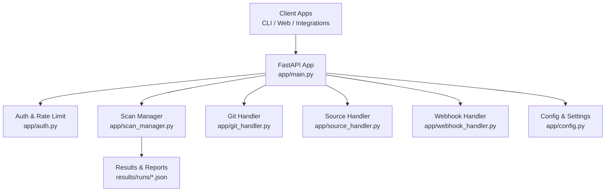
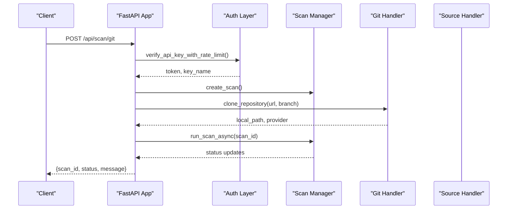
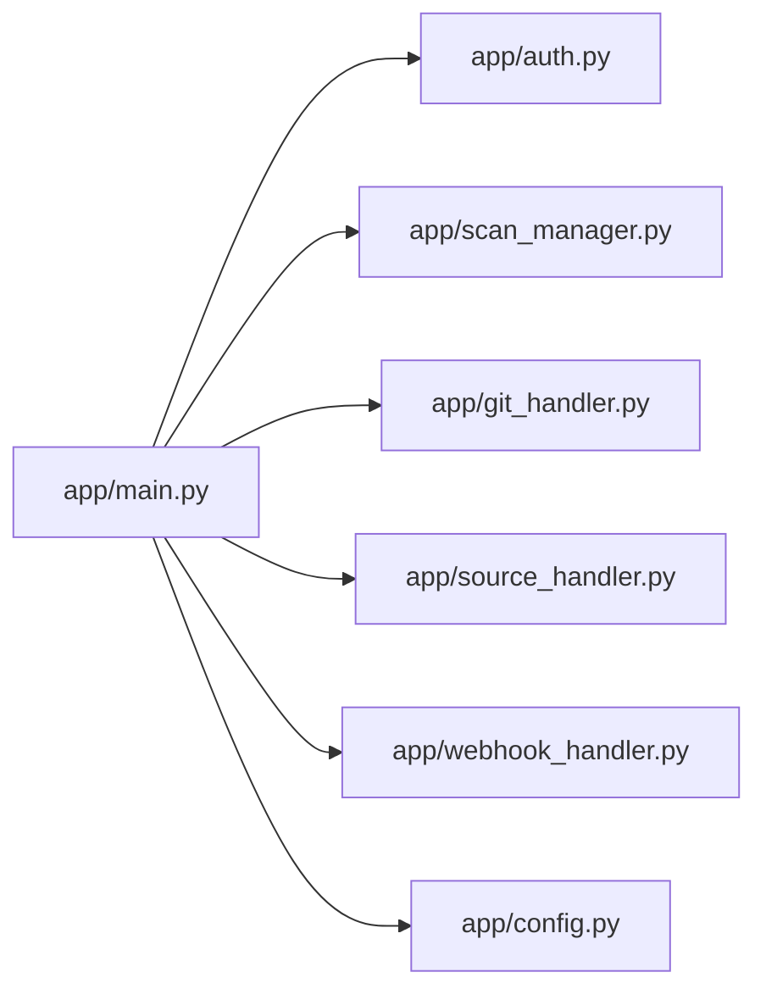

# API Reference

<cite>
**Referenced Files in This Document**
- [app/main.py](file://app/main.py)
- [app/auth.py](file://app/auth.py)
- [app/webhook_handler.py](file://app/webhook_handler.py)
- [app/scan_manager.py](file://app/scan_manager.py)
- [app/config.py](file://app/config.py)
- [app/git_handler.py](file://app/git_handler.py)
- [app/source_handler.py](file://app/source_handler.py)
- [frontend/src/api/client.js](file://frontend/src/api/client.js)
- [README.md](file://README.md)
- [DOCS_APPLICATION_FLOW.md](file://DOCS_APPLICATION_FLOW.md)
- [data/api_keys.json](file://data/api_keys.json)
</cite>

## Table of Contents
1. [Introduction](#introduction)
2. [Project Structure](#project-structure)
3. [Core Components](#core-components)
4. [Architecture Overview](#architecture-overview)
5. [Detailed Component Analysis](#detailed-component-analysis)
6. [Dependency Analysis](#dependency-analysis)
7. [Performance Considerations](#performance-considerations)
8. [Troubleshooting Guide](#troubleshooting-guide)
9. [Conclusion](#conclusion)
10. [Appendices](#appendices)

## Introduction
This document provides comprehensive API documentation for AutoPoV’s REST API. It covers:
- Authentication and rate limiting
- Scan management endpoints for triggering, monitoring, and controlling agent runs
- Webhook integration endpoints for GitHub/GitLab automation
- Key management endpoints for API key provisioning and administration
- Real-time streaming endpoints using Server-Sent Events (SSE)
- Error response codes, security considerations, and practical examples
- API versioning, backward compatibility, and client implementation guidelines

## Project Structure
AutoPoV exposes a FastAPI-based REST API under the base path /api. The backend orchestrates autonomous agent workflows for vulnerability discovery and PoV generation.

**Diagram sources**
- [app/main.py:114-122](file://app/main.py#L114-L122)
- [app/auth.py:192-250](file://app/auth.py#L192-L250)
- [app/scan_manager.py:47-73](file://app/scan_manager.py#L47-L73)
- [app/git_handler.py:20-26](file://app/git_handler.py#L20-L26)
- [app/source_handler.py:18-24](file://app/source_handler.py#L18-L24)
- [app/webhook_handler.py:15-24](file://app/webhook_handler.py#L15-L24)
- [app/config.py:13-254](file://app/config.py#L13-L254)

**Section sources**
- [app/main.py:114-122](file://app/main.py#L114-L122)
- [README.md:245-284](file://README.md#L245-L284)
- [DOCS_APPLICATION_FLOW.md:205-228](file://DOCS_APPLICATION_FLOW.md#L205-L228)

## Core Components
- FastAPI application with CORS and lifespan hooks
- Authentication with two-tier model: Admin Key (management) and API Key (operations)
- Scan lifecycle management with background execution and persistence
- Git and ZIP/raw code ingestion handlers
- Webhook processors for GitHub and GitLab
- SSE streaming for live logs

**Section sources**
- [app/main.py:114-122](file://app/main.py#L114-L122)
- [app/auth.py:40-186](file://app/auth.py#L40-L186)
- [app/scan_manager.py:47-73](file://app/scan_manager.py#L47-L73)
- [app/webhook_handler.py:15-362](file://app/webhook_handler.py#L15-L362)

## Architecture Overview
The API is organized into functional groups:
- Health and configuration
- Scan creation and control
- Status polling and streaming
- History, metrics, and reporting
- Webhooks
- Key management (admin)

**Diagram sources**
- [app/main.py:204-285](file://app/main.py#L204-L285)
- [app/auth.py:221-236](file://app/auth.py#L221-L236)
- [app/scan_manager.py:74-114](file://app/scan_manager.py#L74-L114)
- [app/git_handler.py:199-294](file://app/git_handler.py#L199-L294)

## Detailed Component Analysis

### Authentication and Rate Limiting
- Two-tier authentication:
  - Admin Key: used for key management endpoints; validated via HMAC-safe comparison against environment variable
  - API Key: Bearer token or query parameter; SHA-256 hashed and stored; validated with debounced last_used updates
- Rate limiting: 10 scans per key per 60 seconds enforced on scan-triggering endpoints
- SSE endpoints accept API key via query parameter

**Section sources**
- [app/auth.py:192-250](file://app/auth.py#L192-L250)
- [app/auth.py:221-236](file://app/auth.py#L221-L236)
- [app/main.py:548-583](file://app/main.py#L548-L583)
- [README.md:377-383](file://README.md#L377-L383)

### Health and Configuration
- GET /api/health: returns service status, version, and tool availability
- GET /api/config: returns system configuration including supported CWEs and model routing modes

**Section sources**
- [app/main.py:176-185](file://app/main.py#L176-L185)
- [app/main.py:188-200](file://app/main.py#L188-L200)
- [app/config.py:108-146](file://app/config.py#L108-L146)

### Scan Management Endpoints

#### Trigger Scans
- POST /api/scan/git
  - Request body: url, token (optional), branch (optional), model (optional), cwes (optional)
  - Response: {scan_id, status, message}
  - Behavior: validates access, clones repository, runs scan asynchronously
- POST /api/scan/zip
  - Request: multipart/form-data with file, model, cwes
  - Response: {scan_id, status, message}
  - Behavior: extracts ZIP, resolves source, runs scan asynchronously
- POST /api/scan/paste
  - Request body: code, language (optional), filename (optional), model (optional), cwes (optional)
  - Response: {scan_id, status, message}
  - Behavior: writes code to temporary source, runs scan asynchronously

Notes:
- Rate-limited via verify_api_key_with_rate_limit
- Background tasks run with new event loops to avoid blocking

**Section sources**
- [app/main.py:204-285](file://app/main.py#L204-L285)
- [app/main.py:288-347](file://app/main.py#L288-L347)
- [app/main.py:350-400](file://app/main.py#L350-L400)
- [app/auth.py:221-236](file://app/auth.py#L221-L236)
- [app/git_handler.py:155-198](file://app/git_handler.py#L155-L198)
- [app/source_handler.py:31-78](file://app/source_handler.py#L31-L78)

#### Monitor and Control
- GET /api/scan/{scan_id}
  - Response: {scan_id, status, progress, logs, result?, findings?, error?}
  - Behavior: returns current state; if not found, tries to load persisted result
- GET /api/scan/{scan_id}/stream
  - Response: SSE stream of logs; ends with complete event and result
  - Behavior: streams new logs until completion; accepts API key via query parameter
- POST /api/scan/{scan_id}/cancel
  - Response: {scan_id, status, message}
  - Behavior: cancels running scan if possible
- POST /api/scan/{scan_id}/replay
  - Request body: models (list), include_failed (bool), max_findings (int)
  - Response: {status, replay_ids}
  - Behavior: replays findings against new models; creates new scans

**Section sources**
- [app/main.py:511-545](file://app/main.py#L511-L545)
- [app/main.py:548-583](file://app/main.py#L548-L583)
- [app/main.py:492-507](file://app/main.py#L492-L507)
- [app/main.py:404-490](file://app/main.py#L404-L490)
- [app/scan_manager.py:419-493](file://app/scan_manager.py#L419-L493)

#### History, Metrics, and Reports
- GET /api/history
  - Query: limit, offset
  - Response: {history: [...]}
- GET /api/report/{scan_id}
  - Query: format (json|pdf)
  - Response: file download
- GET /api/metrics
  - Response: system-wide metrics
- GET /api/learning/summary
  - Response: summary and model stats

**Section sources**
- [app/main.py:587-595](file://app/main.py#L587-L595)
- [app/main.py:599-644](file://app/main.py#L599-L644)
- [app/main.py:754-757](file://app/main.py#L754-L757)
- [app/main.py:745-751](file://app/main.py#L745-L751)

### Webhook Integration Endpoints
- POST /api/webhook/github
  - Headers: X-Hub-Signature-256, X-GitHub-Event
  - Response: {status, message, scan_id?}
  - Behavior: verifies HMAC signature, parses push/PR events, triggers scan via callback
- POST /api/webhook/gitlab
  - Headers: X-Gitlab-Token, X-Gitlab-Event
  - Response: {status, message, scan_id?}
  - Behavior: verifies token, parses push/MR events, triggers scan via callback

Security:
- GitHub: HMAC-SHA256 verification using configured secret
- GitLab: shared token verification

**Section sources**
- [app/main.py:647-688](file://app/main.py#L647-L688)
- [app/webhook_handler.py:196-336](file://app/webhook_handler.py#L196-L336)
- [app/webhook_handler.py:25-74](file://app/webhook_handler.py#L25-L74)

### Key Management Endpoints (Admin)
- POST /api/keys/generate
  - Query: name
  - Response: {key, message}
  - Behavior: generates new API key and returns raw key once
- GET /api/keys
  - Response: {keys: [...]}
  - Behavior: lists all keys (without hashes)
- DELETE /api/keys/{key_id}
  - Response: {message}
  - Behavior: revokes key

Admin-only endpoints require Admin Key validated via HMAC-safe comparison.

**Section sources**
- [app/main.py:692-723](file://app/main.py#L692-L723)
- [app/auth.py:180-186](file://app/auth.py#L180-L186)
- [data/api_keys.json:1-42](file://data/api_keys.json#L1-L42)

### Administrative Utilities
- POST /api/admin/cleanup
  - Query: max_age_days, max_results
  - Response: {files_removed, bytes_freed, message}

**Section sources**
- [app/main.py:726-741](file://app/main.py#L726-L741)
- [app/scan_manager.py:512-561](file://app/scan_manager.py#L512-L561)

## Dependency Analysis
- API endpoints depend on:
  - Authentication: verify_api_key, verify_api_key_with_rate_limit, verify_admin_key
  - Scan lifecycle: get_scan_manager(), run_scan_async, get_scan_result
  - Source ingestion: get_git_handler(), get_source_handler()
  - Webhooks: get_webhook_handler()
  - Configuration: settings

**Diagram sources**
- [app/main.py:13-27](file://app/main.py#L13-L27)
- [app/auth.py:19-20](file://app/auth.py#L19-L20)
- [app/scan_manager.py:18-21](file://app/scan_manager.py#L18-L21)
- [app/git_handler.py:17](file://app/git_handler.py#L17)
- [app/source_handler.py:15](file://app/source_handler.py#L15)
- [app/webhook_handler.py:12](file://app/webhook_handler.py#L12)
- [app/config.py:19](file://app/config.py#L19)

**Section sources**
- [app/main.py:13-27](file://app/main.py#L13-L27)

## Performance Considerations
- Background execution: scans run in background tasks with new event loops to avoid blocking
- Rate limiting: 10 scans per key per 60 seconds to prevent abuse
- SSE streaming: minimal overhead; clients should reconnect on disconnect
- Tool availability checks: Docker, CodeQL, Joern checked at runtime; fallbacks applied when unavailable
- Cleanup: admin-triggered cleanup removes old result files to control disk growth

[No sources needed since this section provides general guidance]

## Troubleshooting Guide
Common issues and resolutions:
- 401 Unauthorized: Invalid or missing API key; ensure Bearer token or query parameter is correct
- 403 Forbidden: Admin-only endpoint; ensure Admin Key is provided
- 429 Too Many Requests: Exceeded rate limit; wait for next window
- 404 Not Found: Scan not found; verify scan_id and that scan was created
- 409 Conflict: Cannot cancel scan (not running); check status before cancel
- 5xx Internal Server Errors: Inspect server logs; verify tool availability and environment variables

Operational tips:
- Use GET /api/health to verify service readiness
- Use GET /api/config to confirm supported CWEs and routing modes
- Use GET /api/metrics for system health indicators
- Use GET /api/learning/summary to review agent performance

**Section sources**
- [app/main.py:492-507](file://app/main.py#L492-L507)
- [app/auth.py:221-236](file://app/auth.py#L221-L236)
- [app/scan_manager.py:604-653](file://app/scan_manager.py#L604-L653)

## Conclusion
AutoPoV’s REST API provides a robust, secure, and scalable interface for autonomous vulnerability discovery and PoV generation. It supports multiple ingestion methods, real-time observability via SSE, webhook automation, and administrative controls. Clients should implement rate-limit-aware polling, handle SSE gracefully, and manage API keys securely.

[No sources needed since this section summarizes without analyzing specific files]

## Appendices

### API Versioning and Backward Compatibility
- Version: exposed via GET /api/health and FastAPI app version
- Backward compatibility: maintained by avoiding breaking changes to response shapes; new fields appended rather than removed
- Migration: no explicit deprecation policy; consult release notes and health endpoint for environment/tool availability

**Section sources**
- [app/main.py:176-185](file://app/main.py#L176-L185)
- [app/config.py:17-18](file://app/config.py#L17-L18)

### Client Implementation Guidelines
- Authentication:
  - Use Bearer token header for most endpoints
  - For SSE, pass api_key as query parameter
- Rate limiting:
  - Implement exponential backoff on 429 responses
- Streaming:
  - Use EventSource for /api/scan/{id}/stream
  - Handle reconnects and complete events
- Error handling:
  - Log HTTP status codes and messages
  - Retry transient failures (network timeouts, 5xx)
- Example flows:
  - Programmatic scanning: POST /api/scan/git, poll /api/scan/{id}, stream /api/scan/{id}/stream
  - Result retrieval: GET /api/report/{id}?format=json|pdf
  - Administrative operations: POST /api/admin/cleanup, manage keys via /api/keys/*

**Section sources**
- [frontend/src/api/client.js:18-77](file://frontend/src/api/client.js#L18-L77)
- [README.md:245-284](file://README.md#L245-L284)
- [DOCS_APPLICATION_FLOW.md:175-182](file://DOCS_APPLICATION_FLOW.md#L175-L182)

### Request/Response Schemas

- POST /api/scan/git
  - Request: {url, token?, branch?, model?, cwes?}
  - Response: {scan_id, status, message}
- POST /api/scan/zip
  - Request: multipart/form-data (file, model, cwes)
  - Response: {scan_id, status, message}
- POST /api/scan/paste
  - Request: {code, language?, filename?, model?, cwes?}
  - Response: {scan_id, status, message}
- GET /api/scan/{scan_id}
  - Response: {scan_id, status, progress, logs, result?, findings?, error?}
- GET /api/scan/{scan_id}/stream
  - Response: SSE stream of {type, message} events ending with {type: "complete", result}
- POST /api/scan/{scan_id}/cancel
  - Response: {scan_id, status, message}
- POST /api/scan/{scan_id}/replay
  - Request: {models, include_failed?, max_findings?}
  - Response: {status, replay_ids}
- GET /api/history
  - Response: {history: [...]}
- GET /api/report/{scan_id}
  - Response: file download (JSON or PDF)
- GET /api/metrics
  - Response: metrics object
- GET /api/learning/summary
  - Response: {summary, models}
- GET /api/config
  - Response: configuration object
- GET /api/health
  - Response: {status, version, docker_available, codeql_available, joern_available}
- POST /api/webhook/github
  - Headers: X-Hub-Signature-256, X-GitHub-Event
  - Response: {status, message, scan_id?}
- POST /api/webhook/gitlab
  - Headers: X-Gitlab-Token, X-Gitlab-Event
  - Response: {status, message, scan_id?}
- POST /api/keys/generate
  - Response: {key, message}
- GET /api/keys
  - Response: {keys: [...]}
- DELETE /api/keys/{key_id}
  - Response: {message}
- POST /api/admin/cleanup
  - Response: {files_removed, bytes_freed, message}

**Section sources**
- [app/main.py:204-400](file://app/main.py#L204-L400)
- [app/main.py:511-583](file://app/main.py#L511-L583)
- [app/main.py:587-644](file://app/main.py#L587-L644)
- [app/main.py:647-741](file://app/main.py#L647-L741)
- [app/webhook_handler.py:196-336](file://app/webhook_handler.py#L196-L336)

### Security Considerations
- Admin Key: stored in environment; validated with HMAC-safe comparison
- API Key: SHA-256 hashed and stored; validated with debounced disk writes
- Rate limiting: per-key enforcement to prevent abuse
- Webhook signatures: GitHub HMAC-SHA256 and GitLab shared token verification
- SSE: API key via query parameter; ensure HTTPS in production
- Tool sandboxing: Docker execution with resource limits

**Section sources**
- [app/auth.py:180-186](file://app/auth.py#L180-L186)
- [app/auth.py:221-236](file://app/auth.py#L221-L236)
- [app/webhook_handler.py:25-74](file://app/webhook_handler.py#L25-L74)
- [README.md:377-383](file://README.md#L377-L383)