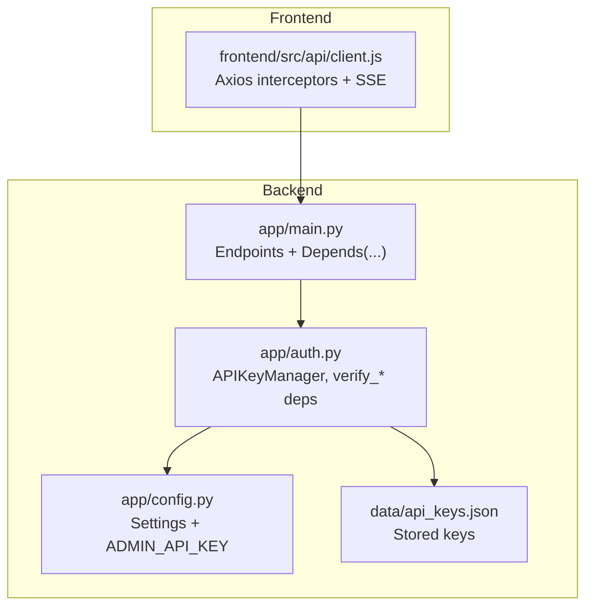
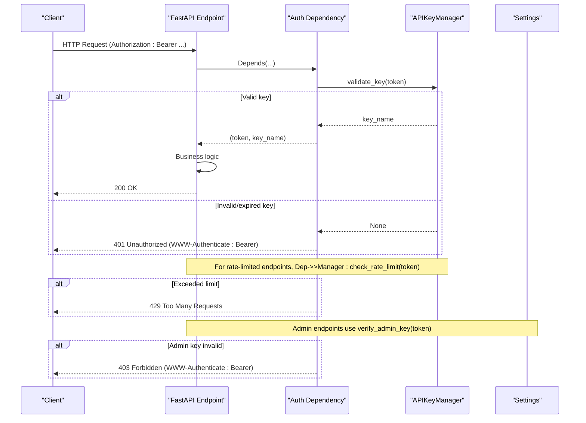
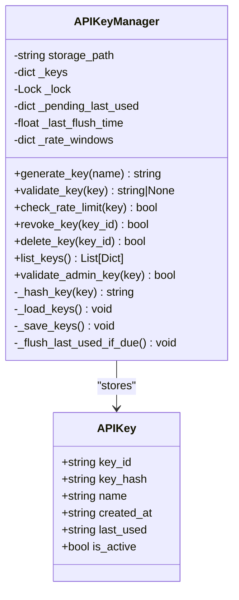
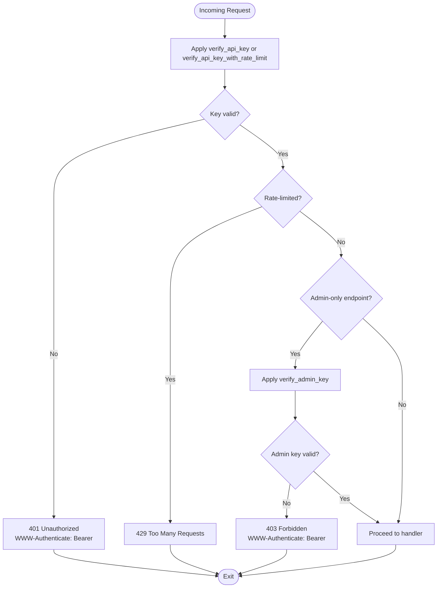
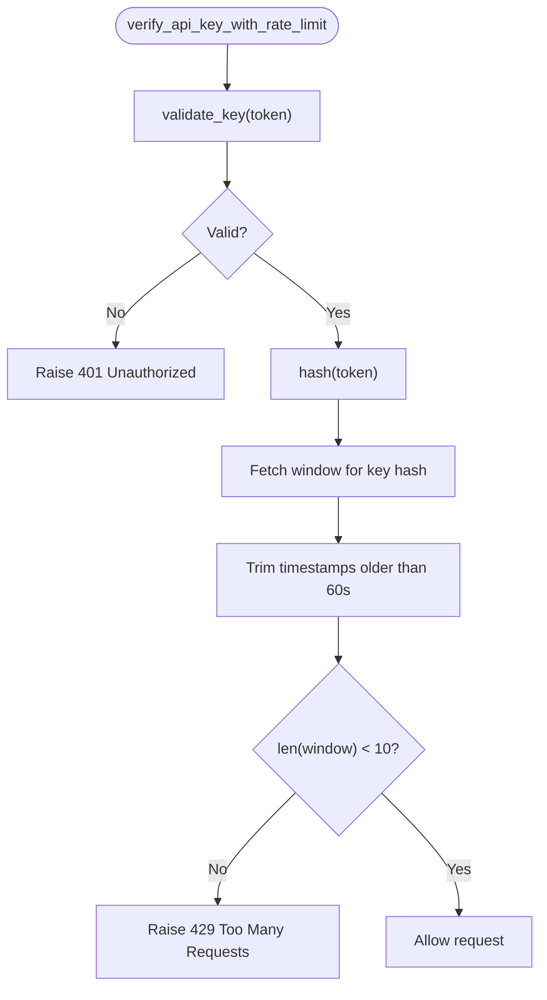
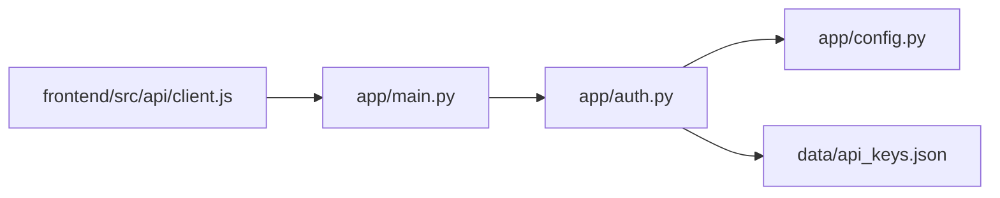

# Authentication & Authorization

<cite>
**Referenced Files in This Document**
- [app/auth.py](file://app/auth.py)
- [app/main.py](file://app/main.py)
- [app/config.py](file://app/config.py)
- [data/api_keys.json](file://data/api_keys.json)
- [frontend/src/api/client.js](file://frontend/src/api/client.js)
- [README.md](file://README.md)
- [tests/test_auth.py](file://tests/test_auth.py)
- [test_api_key.py](file://test_api_key.py)
- [generate_key.py](file://generate_key.py)
- [add_api_key.py](file://add_api_key.py)
</cite>

## Table of Contents
1. [Introduction](#introduction)
2. [Project Structure](#project-structure)
3. [Core Components](#core-components)
4. [Architecture Overview](#architecture-overview)
5. [Detailed Component Analysis](#detailed-component-analysis)
6. [Dependency Analysis](#dependency-analysis)
7. [Performance Considerations](#performance-considerations)
8. [Troubleshooting Guide](#troubleshooting-guide)
9. [Conclusion](#conclusion)

## Introduction
This document explains AutoPoV’s authentication and authorization system with a focus on API key-based access control, rate limiting, and admin key verification. It describes how clients authenticate to the REST API, how endpoints are categorized by access level, and how security is enforced across the system. Practical examples show proper header usage, error responses for unauthorized requests, and best practices for managing API keys in production.

## Project Structure
The authentication system spans several modules:
- Authentication logic and rate limiting are implemented in the authentication module.
- API endpoints are defined in the main application module and depend on authentication dependencies.
- Configuration defines admin key and other security-related settings.
- Frontend client injects the Authorization header for authenticated requests.
- Tests and scripts demonstrate key generation, validation, and usage.

**Diagram sources**
- [app/auth.py:1-256](file://app/auth.py#L1-L256)
- [app/main.py:1-768](file://app/main.py#L1-L768)
- [app/config.py:1-255](file://app/config.py#L1-L255)
- [data/api_keys.json:1-42](file://data/api_keys.json#L1-L42)
- [frontend/src/api/client.js:1-78](file://frontend/src/api/client.js#L1-L78)

**Section sources**
- [app/auth.py:1-256](file://app/auth.py#L1-L256)
- [app/main.py:1-768](file://app/main.py#L1-L768)
- [app/config.py:1-255](file://app/config.py#L1-L255)
- [data/api_keys.json:1-42](file://data/api_keys.json#L1-L42)
- [frontend/src/api/client.js:1-78](file://frontend/src/api/client.js#L1-L78)

## Core Components
- APIKeyManager: Manages API key storage, validation, rate limiting, and admin key verification. Keys are stored as SHA-256 hashes and validated using constant-time comparison to prevent timing attacks.
- Authentication dependencies:
  - verify_api_key: Validates Bearer tokens from Authorization header or query param for SSE.
  - verify_api_key_with_rate_limit: Enforces per-key rate limits before allowing scan-triggering endpoints.
  - verify_admin_key: Validates admin key via constant-time comparison for admin-only endpoints.
- Configuration: ADMIN_API_KEY is loaded from environment variables and used to protect admin endpoints.

Key behaviors:
- Header-based authentication: Authorization: Bearer <apov_...>
- Query parameter fallback for SSE: ?api_key=<apov_...>
- Rate limiting: 10 scans per minute per API key hash
- Admin-only endpoints: key generation, listing, revocation, cleanup

**Section sources**
- [app/auth.py:30-256](file://app/auth.py#L30-L256)
- [app/config.py:26-27](file://app/config.py#L26-L27)
- [frontend/src/api/client.js:18-25](file://frontend/src/api/client.js#L18-L25)

## Architecture Overview
The authentication flow integrates with FastAPI dependencies to enforce access control at the endpoint level. Requests are validated before entering business logic, and rate limiting is enforced for sensitive operations.

**Diagram sources**
- [app/auth.py:192-250](file://app/auth.py#L192-L250)
- [app/main.py:204-285](file://app/main.py#L204-L285)
- [app/config.py:26-27](file://app/config.py#L26-L27)

## Detailed Component Analysis

### APIKeyManager
Responsibilities:
- Generate new API keys with SHA-256 hashing and persistent storage.
- Validate keys using constant-time comparison and track last_used timestamps.
- Enforce per-key rate limiting within a sliding window.
- Revoke/delete keys and list keys (without exposing hashes).
- Verify admin key via constant-time comparison against settings.ADMIN_API_KEY.

Concurrency and persistence:
- Thread-safe operations guarded by a lock.
- Debounced disk writes for last_used updates to reduce I/O.
- Rate windows maintained per key hash.

Security:
- SHA-256 hashes stored; raw keys are never persisted.
- Constant-time comparisons prevent timing attacks.
- Admin key verification uses HMAC constant-time comparison.

**Diagram sources**
- [app/auth.py:30-186](file://app/auth.py#L30-L186)

**Section sources**
- [app/auth.py:40-186](file://app/auth.py#L40-L186)

### Authentication Dependencies
- verify_api_key(request): Extracts token from Authorization header or query param for SSE, validates via APIKeyManager, raises 401 on failure.
- verify_api_key_with_rate_limit(request): Same as above, plus enforces rate limit; raises 429 if exceeded.
- verify_admin_key(credentials): Validates admin key via constant-time comparison; raises 403 on failure.

Endpoint categorization:
- Public endpoints: health, docs, redoc, openapi.
- Authenticated endpoints: config, history, metrics, learning summary, scan status, logs stream, report download.
- Admin-only endpoints: key generation, listing, revocation, cleanup.

**Diagram sources**
- [app/auth.py:192-250](file://app/auth.py#L192-L250)
- [app/main.py:175-767](file://app/main.py#L175-L767)

**Section sources**
- [app/auth.py:192-250](file://app/auth.py#L192-L250)
- [app/main.py:175-767](file://app/main.py#L175-L767)

### Rate Limiting Enforcement
Behavior:
- Sliding window of 60 seconds.
- Maximum 10 scans per key hash per window.
- Enforced on scan-triggering endpoints (Git, ZIP, Paste, Replay).
- Non-rate-limited endpoints (status, logs, reports, metrics, history) do not check rate limits.

**Diagram sources**
- [app/auth.py:129-146](file://app/auth.py#L129-L146)

**Section sources**
- [app/auth.py:24-27](file://app/auth.py#L24-L27)
- [app/auth.py:129-146](file://app/auth.py#L129-L146)

### Admin Key Verification
- Admin key is compared against settings.ADMIN_API_KEY using constant-time comparison.
- Admin endpoints include key generation, listing, revocation, and cleanup.
- Clients must pass Authorization: Bearer <admin_key> for these endpoints.

**Section sources**
- [app/auth.py:180-185](file://app/auth.py#L180-L185)
- [app/config.py:26-27](file://app/config.py#L26-L27)
- [app/main.py:691-741](file://app/main.py#L691-L741)

### Endpoint Categories and Access Control
- Public endpoints: health, docs, redoc, openapi.
- Authenticated endpoints: config, history, metrics, learning summary, scan status, logs stream, report download.
- Admin-only endpoints: key generation, listing, revocation, cleanup.

Examples of protected endpoints:
- Scan creation endpoints apply rate-limiting dependency.
- Status, logs, and report endpoints apply basic authentication dependency.
- Admin endpoints apply admin key dependency.

**Section sources**
- [app/main.py:175-767](file://app/main.py#L175-L767)

### Token Validation and Storage
- Keys are stored as SHA-256 hashes with metadata (id, name, timestamps, active flag).
- Raw keys are never stored; only the hash is persisted.
- Validation uses constant-time comparison to prevent timing attacks.
- Admin key is validated against settings.ADMIN_API_KEY using constant-time comparison.

**Section sources**
- [data/api_keys.json:1-42](file://data/api_keys.json#L1-L42)
- [app/auth.py:84-127](file://app/auth.py#L84-L127)
- [app/auth.py:180-185](file://app/auth.py#L180-L185)

### Client-Side Authentication
- Frontend Axios client injects Authorization header for all authenticated requests.
- For SSE, the client passes api_key as a query parameter to avoid CORS issues with Authorization headers.
- Keys are sourced from localStorage or environment variables.

Practical examples:
- Authorization header: Authorization: Bearer apov_xxx
- SSE fallback: GET /api/scan/{id}/stream?api_key=apov_xxx

**Section sources**
- [frontend/src/api/client.js:18-25](file://frontend/src/api/client.js#L18-L25)
- [frontend/src/api/client.js:44-47](file://frontend/src/api/client.js#L44-L47)

## Dependency Analysis
- app/main.py depends on app/auth.py for authentication dependencies and on app/config.py for settings.
- app/auth.py depends on app/config.py for ADMIN_API_KEY and on data/api_keys.json for persistence.
- frontend/src/api/client.js depends on environment variables and local storage for API key retrieval.

**Diagram sources**
- [app/main.py:19-20](file://app/main.py#L19-L20)
- [app/auth.py:19](file://app/auth.py#L19)
- [app/config.py:26-27](file://app/config.py#L26-L27)
- [data/api_keys.json:1-42](file://data/api_keys.json#L1-L42)
- [frontend/src/api/client.js:1-78](file://frontend/src/api/client.js#L1-L78)

**Section sources**
- [app/main.py:19-20](file://app/main.py#L19-L20)
- [app/auth.py:19](file://app/auth.py#L19)
- [app/config.py:26-27](file://app/config.py#L26-L27)
- [data/api_keys.json:1-42](file://data/api_keys.json#L1-L42)
- [frontend/src/api/client.js:1-78](file://frontend/src/api/client.js#L1-L78)

## Performance Considerations
- Rate limiting uses an in-memory sliding window keyed by SHA-256 hash; it is efficient and avoids frequent disk I/O.
- Debounced disk writes for last_used reduce write frequency; keys are flushed at most every 30 seconds.
- Constant-time comparisons prevent timing attacks without significant overhead.
- SSE endpoints support query-parameter authentication to avoid preflight overhead.

[No sources needed since this section provides general guidance]

## Troubleshooting Guide
Common issues and resolutions:
- 401 Unauthorized:
  - Cause: Missing or invalid API key.
  - Resolution: Ensure Authorization header is present and correct; verify key validity in data/api_keys.json.
- 403 Forbidden:
  - Cause: Admin-only endpoint accessed without admin key.
  - Resolution: Provide ADMIN_API_KEY via Authorization header for admin endpoints.
- 429 Too Many Requests:
  - Cause: Exceeded 10 scans per minute per key.
  - Resolution: Wait until the next 60-second window; reduce client-side polling frequency.
- SSE connection fails:
  - Cause: Authorization header not accepted by EventSource.
  - Resolution: Pass api_key as query parameter (?api_key=apov_xxx) as implemented in the frontend client.

Operational checks:
- Verify ADMIN_API_KEY in environment variables.
- Confirm API keys exist and are active in data/api_keys.json.
- Use test scripts to validate key behavior.

**Section sources**
- [app/auth.py:212-236](file://app/auth.py#L212-L236)
- [app/auth.py:243-248](file://app/auth.py#L243-L248)
- [frontend/src/api/client.js:44-47](file://frontend/src/api/client.js#L44-L47)
- [tests/test_auth.py:11-56](file://tests/test_auth.py#L11-L56)
- [test_api_key.py:15-31](file://test_api_key.py#L15-L31)

## Conclusion
AutoPoV employs a robust, two-tier authentication model:
- Admin Key: Protects administrative operations with constant-time verification.
- API Keys: Provide bearer-token access to operational endpoints, with SHA-256 hashed storage and rate limiting.

The system balances usability (header-based auth and SSE fallback) with strong security (constant-time comparisons, debounced persistence, and sliding-window rate limiting). Production deployments should enforce HTTPS, rotate keys regularly, and monitor rate-limiting thresholds to prevent abuse.