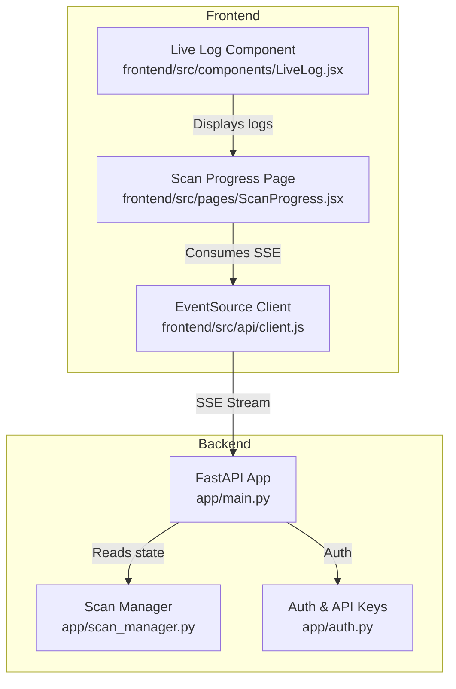
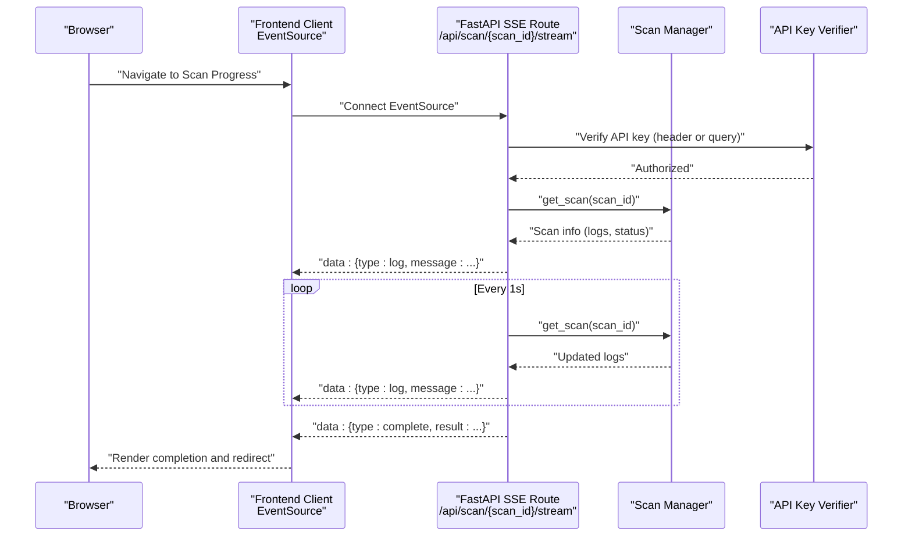
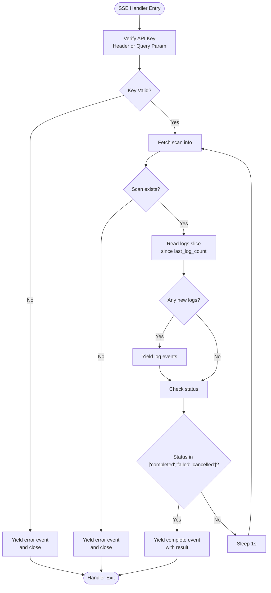
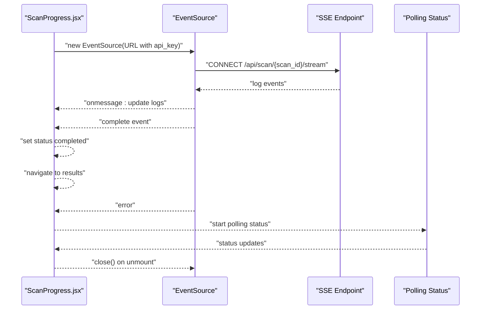
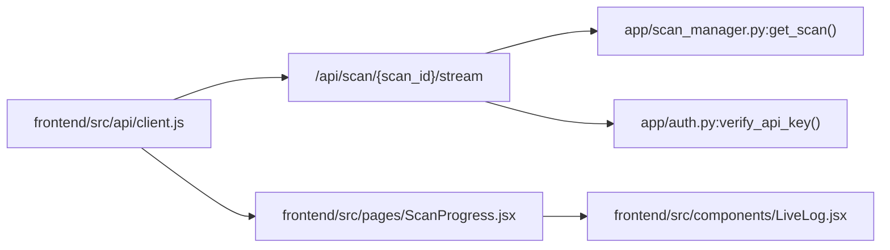

# Real-time Streaming API

<cite>
**Referenced Files in This Document**
- [app/main.py](file://app/main.py)
- [app/scan_manager.py](file://app/scan_manager.py)
- [app/auth.py](file://app/auth.py)
- [frontend/src/api/client.js](file://frontend/src/api/client.js)
- [frontend/src/pages/ScanProgress.jsx](file://frontend/src/pages/ScanProgress.jsx)
- [frontend/src/components/LiveLog.jsx](file://frontend/src/components/LiveLog.jsx)
</cite>

## Table of Contents
1. [Introduction](#introduction)
2. [Project Structure](#project-structure)
3. [Core Components](#core-components)
4. [Architecture Overview](#architecture-overview)
5. [Detailed Component Analysis](#detailed-component-analysis)
6. [Dependency Analysis](#dependency-analysis)
7. [Performance Considerations](#performance-considerations)
8. [Troubleshooting Guide](#troubleshooting-guide)
9. [Conclusion](#conclusion)

## Introduction
This document describes AutoPoV’s real-time streaming capabilities using Server-Sent Events (SSE). It focuses on the streaming endpoint `/api/scan/{scan_id}/stream`, covering connection establishment, event types, message formats, connection lifecycle, and automatic disconnection handling. It also documents the streaming architecture, event generator implementation, event data structures, and practical client-side examples for connection management and error recovery. Finally, it provides best practices for browser compatibility and performance considerations for real-time monitoring applications.

## Project Structure
The streaming feature spans backend and frontend components:
- Backend: FastAPI endpoint that streams logs and completion events via SSE.
- Frontend: React components that connect to the SSE endpoint and render live logs.

**Diagram sources**
- [app/main.py:548-583](file://app/main.py#L548-L583)
- [app/scan_manager.py:419-421](file://app/scan_manager.py#L419-L421)
- [app/auth.py:192-218](file://app/auth.py#L192-L218)
- [frontend/src/api/client.js:44-47](file://frontend/src/api/client.js#L44-L47)
- [frontend/src/pages/ScanProgress.jsx:53-78](file://frontend/src/pages/ScanProgress.jsx#L53-L78)
- [frontend/src/components/LiveLog.jsx:1-67](file://frontend/src/components/LiveLog.jsx#L1-L67)

**Section sources**
- [app/main.py:548-583](file://app/main.py#L548-L583)
- [frontend/src/api/client.js:44-47](file://frontend/src/api/client.js#L44-L47)
- [frontend/src/pages/ScanProgress.jsx:53-78](file://frontend/src/pages/ScanProgress.jsx#L53-L78)

## Core Components
- Streaming Endpoint: GET `/api/scan/{scan_id}/stream` returns a Server-Sent Events stream.
- Event Generator: An async generator that yields log and completion events.
- Authentication: API key verification via Bearer token or query parameter for SSE.
- Frontend Client: Creates an EventSource connection and handles incoming events.
- Live Log Display: Renders streamed log messages with color-coded severity.

**Section sources**
- [app/main.py:548-583](file://app/main.py#L548-L583)
- [app/auth.py:192-218](file://app/auth.py#L192-L218)
- [frontend/src/api/client.js:44-47](file://frontend/src/api/client.js#L44-L47)
- [frontend/src/pages/ScanProgress.jsx:53-78](file://frontend/src/pages/ScanProgress.jsx#L53-L78)
- [frontend/src/components/LiveLog.jsx:1-67](file://frontend/src/components/LiveLog.jsx#L1-L67)

## Architecture Overview
The streaming architecture consists of:
- Backend: FastAPI route creates a streaming response with a custom event generator.
- State Management: The Scan Manager holds scan state, logs, and results.
- Authentication: The SSE route accepts API keys via Authorization header or query parameter.
- Frontend: EventSource connects to the SSE endpoint and updates the UI reactively.

**Diagram sources**
- [app/main.py:548-583](file://app/main.py#L548-L583)
- [app/scan_manager.py:419-421](file://app/scan_manager.py#L419-L421)
- [app/auth.py:192-218](file://app/auth.py#L192-L218)
- [frontend/src/api/client.js:44-47](file://frontend/src/api/client.js#L44-L47)
- [frontend/src/pages/ScanProgress.jsx:53-78](file://frontend/src/pages/ScanProgress.jsx#L53-L78)

## Detailed Component Analysis

### Streaming Endpoint Implementation
- Route: GET `/api/scan/{scan_id}/stream`
- Media Type: `text/event-stream`
- Authentication: Validates API key via Bearer header or query parameter `api_key`.
- Event Generator:
  - Tracks last log index to avoid duplicates.
  - Streams new log entries as `type: log`.
  - On completion (status in ["completed", "failed", "cancelled"]), sends `type: complete` with result payload.
  - Continues polling until completion or scan not found.

**Diagram sources**
- [app/main.py:548-583](file://app/main.py#L548-L583)

**Section sources**
- [app/main.py:548-583](file://app/main.py#L548-L583)

### Event Data Structures
- Log Event (`type: log`): Contains a single log message string.
- Completion Event (`type: complete`): Contains the scan result object (or null if not available).
- Error Event (`type: error`): Sent when the scan does not exist or authentication fails.

Example event payloads:
- Log: `{ "type": "log", "message": "..." }`
- Complete: `{ "type": "complete", "result": { ... } }`
- Error: `{ "type": "error", "message": "Scan not found" }`

Notes:
- The result object is derived from the scan manager’s stored result and serialized as a dictionary.
- The frontend consumes these events and updates the UI accordingly.

**Section sources**
- [app/main.py:548-583](file://app/main.py#L548-L583)

### Frontend Streaming Client
- EventSource Creation: Constructs the SSE URL with the API key as a query parameter.
- Event Handling:
  - `onmessage`: Parses event data and appends new logs to the UI state.
  - `onerror`: Gracefully falls back to polling for status updates.
- Lifecycle:
  - Establishes SSE on mount.
  - Closes SSE on unmount.
  - Uses polling for status updates as a fallback.

**Diagram sources**
- [frontend/src/pages/ScanProgress.jsx:53-78](file://frontend/src/pages/ScanProgress.jsx#L53-L78)
- [frontend/src/api/client.js:44-47](file://frontend/src/api/client.js#L44-L47)

**Section sources**
- [frontend/src/pages/ScanProgress.jsx:53-78](file://frontend/src/pages/ScanProgress.jsx#L53-L78)
- [frontend/src/api/client.js:44-47](file://frontend/src/api/client.js#L44-L47)

### Live Log Rendering
- LiveLog displays a scrollable terminal-like view of logs.
- Timestamp parsing and color-coded severity highlighting.
- Auto-scrolls to the latest log entry.

**Section sources**
- [frontend/src/components/LiveLog.jsx:1-67](file://frontend/src/components/LiveLog.jsx#L1-L67)

### Authentication and Authorization
- API key verification supports:
  - Bearer Authorization header.
  - Query parameter `api_key` (used by SSE/EventSource).
- Rate limiting is enforced on scan-triggering endpoints; SSE uses standard verification.

**Section sources**
- [app/auth.py:192-218](file://app/auth.py#L192-L218)

## Dependency Analysis
- Backend depends on:
  - Scan Manager for retrieving scan state and logs.
  - API Key Manager for verifying tokens.
- Frontend depends on:
  - Axios for HTTP requests and EventSource for SSE.
  - React components for rendering.

**Diagram sources**
- [app/main.py:548-583](file://app/main.py#L548-L583)
- [app/scan_manager.py:419-421](file://app/scan_manager.py#L419-L421)
- [app/auth.py:192-218](file://app/auth.py#L192-L218)
- [frontend/src/api/client.js:44-47](file://frontend/src/api/client.js#L44-L47)
- [frontend/src/pages/ScanProgress.jsx:53-78](file://frontend/src/pages/ScanProgress.jsx#L53-L78)
- [frontend/src/components/LiveLog.jsx:1-67](file://frontend/src/components/LiveLog.jsx#L1-L67)

**Section sources**
- [app/main.py:548-583](file://app/main.py#L548-L583)
- [app/scan_manager.py:419-421](file://app/scan_manager.py#L419-L421)
- [app/auth.py:192-218](file://app/auth.py#L192-L218)
- [frontend/src/api/client.js:44-47](file://frontend/src/api/client.js#L44-L47)
- [frontend/src/pages/ScanProgress.jsx:53-78](file://frontend/src/pages/ScanProgress.jsx#L53-L78)
- [frontend/src/components/LiveLog.jsx:1-67](file://frontend/src/components/LiveLog.jsx#L1-L67)

## Performance Considerations
- Polling Interval: The SSE handler sleeps 1 second between checks to balance responsiveness and resource usage.
- Log Deduplication: Tracks last log index to avoid resending previously sent logs.
- Connection Lifecycle: EventSource closes automatically on completion; the frontend also closes it on unmount to prevent leaks.
- Backpressure: SSE is pull-based; the server only emits when there are new logs, reducing unnecessary traffic.
- Scalability: For high concurrency, consider connection pooling and rate-limiting at the gateway level.

[No sources needed since this section provides general guidance]

## Troubleshooting Guide
Common issues and resolutions:
- Authentication Failure:
  - Ensure the API key is provided via Authorization header or query parameter `api_key`.
  - Confirm the key is valid and active.
- Scan Not Found:
  - The SSE endpoint yields an error event when the scan does not exist; the frontend falls back to polling.
- SSE Connection Drops:
  - The frontend sets `onerror` to continue polling; reconnect automatically on page refresh.
- Browser Compatibility:
  - EventSource is widely supported in modern browsers. For older browsers, use polyfills or fallback to long-polling.
- CORS and Headers:
  - Ensure the frontend origin is allowed by CORS middleware and that the API key is attached to the request.

**Section sources**
- [app/auth.py:192-218](file://app/auth.py#L192-L218)
- [app/main.py:548-583](file://app/main.py#L548-L583)
- [frontend/src/pages/ScanProgress.jsx:53-78](file://frontend/src/pages/ScanProgress.jsx#L53-L78)

## Conclusion
AutoPoV’s SSE streaming provides a robust, low-latency mechanism for real-time monitoring of scan progress. The backend efficiently streams log updates and completion notifications, while the frontend gracefully handles connection drops and integrates with the broader scan lifecycle. By following the best practices outlined here, developers can build reliable, scalable real-time monitoring experiences.