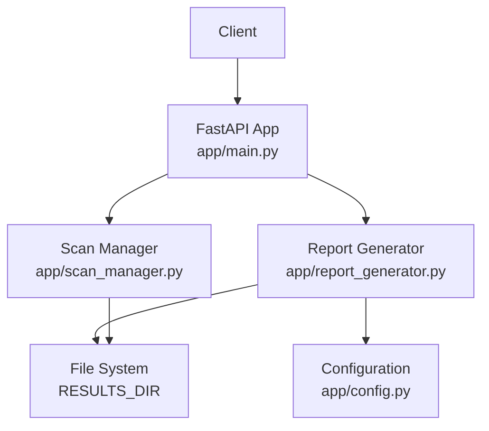
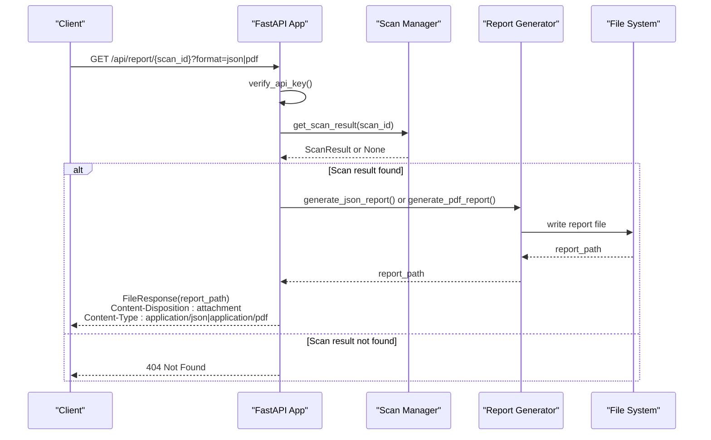
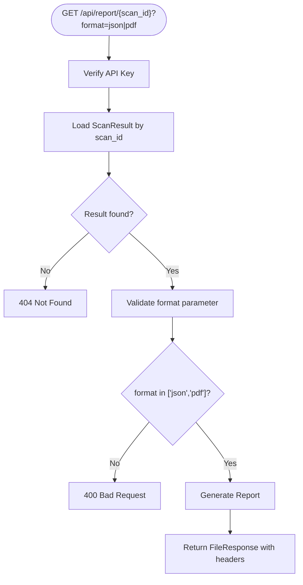
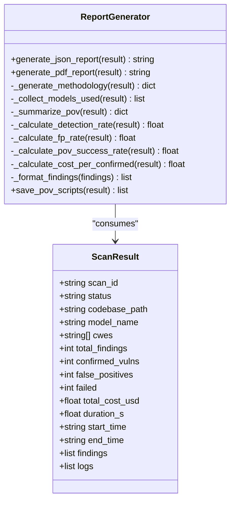
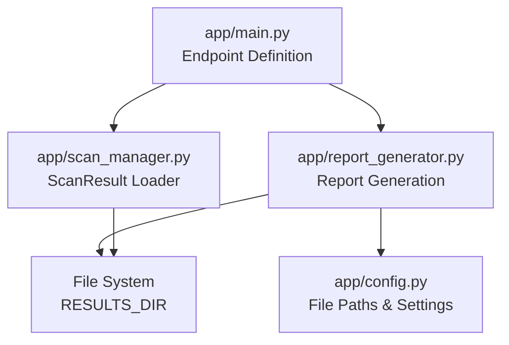

# Report Generation API

<cite>
**Referenced Files in This Document**
- [app/main.py](file://app/main.py)
- [app/report_generator.py](file://app/report_generator.py)
- [app/scan_manager.py](file://app/scan_manager.py)
- [app/config.py](file://app/config.py)
- [README.md](file://README.md)
</cite>

## Table of Contents
1. [Introduction](#introduction)
2. [Project Structure](#project-structure)
3. [Core Components](#core-components)
4. [Architecture Overview](#architecture-overview)
5. [Detailed Component Analysis](#detailed-component-analysis)
6. [Dependency Analysis](#dependency-analysis)
7. [Performance Considerations](#performance-considerations)
8. [Troubleshooting Guide](#troubleshooting-guide)
9. [Conclusion](#conclusion)
10. [Appendices](#appendices)

## Introduction
This document provides comprehensive API documentation for AutoPoV's report generation endpoints. It focuses on the report retrieval endpoint `/api/report/{scan_id}`, covering supported output formats (JSON, PDF), file download mechanisms, response headers, report generation process, file attachment handling, content disposition headers, report data structure, formatting options, customization capabilities, practical examples, and error handling.

## Project Structure
The report generation API is implemented within the FastAPI application and integrates with the report generator module and scan manager. The key components are:
- FastAPI endpoint definition for report retrieval
- Report generator module for producing JSON and PDF reports
- Scan manager for loading scan results
- Configuration module for file paths and environment settings

**Diagram sources**
- [app/main.py:599-644](file://app/main.py#L599-L644)
- [app/scan_manager.py:449-458](file://app/scan_manager.py#L449-L458)
- [app/report_generator.py:209-610](file://app/report_generator.py#L209-L610)
- [app/config.py:136-146](file://app/config.py#L136-L146)

**Section sources**
- [app/main.py:599-644](file://app/main.py#L599-L644)
- [app/scan_manager.py:449-458](file://app/scan_manager.py#L449-L458)
- [app/report_generator.py:209-610](file://app/report_generator.py#L209-L610)
- [app/config.py:136-146](file://app/config.py#L136-L146)

## Core Components
- Report Retrieval Endpoint: GET `/api/report/{scan_id}`
  - Accepts query parameter `format` with values "json" or "pdf"
  - Requires API key authentication
  - Returns FileResponse with appropriate media type and filename
  - Sets Content-Disposition and Content-Type headers for browser downloads
- Report Generator: Generates JSON and PDF reports from ScanResult instances
  - JSON report includes metadata, scan summary, model usage, metrics, findings, and methodology
  - PDF report includes cover page, executive summary, model usage, confirmed vulnerabilities, false positives, methodology, and appendix
- Scan Manager: Loads scan results from persisted JSON files
  - Provides ScanResult objects used by the report generator

**Section sources**
- [app/main.py:599-644](file://app/main.py#L599-L644)
- [app/report_generator.py:209-610](file://app/report_generator.py#L209-L610)
- [app/scan_manager.py:449-458](file://app/scan_manager.py#L449-L458)

## Architecture Overview
The report retrieval flow connects the client to the FastAPI endpoint, which validates authentication, loads the scan result, generates the report, and streams the file back to the client with appropriate headers for download.

**Diagram sources**
- [app/main.py:599-644](file://app/main.py#L599-L644)
- [app/scan_manager.py:449-458](file://app/scan_manager.py#L449-L458)
- [app/report_generator.py:209-610](file://app/report_generator.py#L209-L610)

## Detailed Component Analysis

### Report Retrieval Endpoint
- Endpoint: GET `/api/report/{scan_id}`
- Query Parameter:
  - format: "json" or "pdf" (default: "json")
- Authentication:
  - Requires API key via verify_api_key dependency
- Behavior:
  - Loads ScanResult by scan_id
  - Validates format parameter
  - Generates report using ReportGenerator
  - Returns FileResponse with filename and headers for browser download
- Response Headers:
  - Content-Disposition: attachment; filename={scan_id}_report.json or .pdf
  - Content-Type: application/json or application/pdf
  - Access-Control-Expose-Headers: Content-Disposition, Content-Type

**Diagram sources**
- [app/main.py:599-644](file://app/main.py#L599-L644)

**Section sources**
- [app/main.py:599-644](file://app/main.py#L599-L644)

### Report Generation Process
- JSON Report:
  - Uses ReportGenerator.generate_json_report(result)
  - Writes to RESULTS_DIR/{scan_id}_report.json
  - Includes report_metadata, scan_summary, model_usage, metrics, findings, and methodology
- PDF Report:
  - Uses ReportGenerator.generate_pdf_report(result)
  - Requires fpdf2 library availability
  - Writes to RESULTS_DIR/{scan_id}_report.pdf
  - Includes cover page, executive summary, model usage, confirmed vulnerabilities, false positives, methodology, and appendix

**Diagram sources**
- [app/report_generator.py:200-820](file://app/report_generator.py#L200-L820)
- [app/scan_manager.py:23-45](file://app/scan_manager.py#L23-L45)

**Section sources**
- [app/report_generator.py:209-610](file://app/report_generator.py#L209-L610)
- [app/scan_manager.py:23-45](file://app/scan_manager.py#L23-L45)

### Report Data Structure and Formatting Options
- JSON Report Structure:
  - report_metadata: tool, version, generated_at, report_type
  - scan_summary: scan_id, status, codebase, timestamps, configuration
  - model_usage: models_used, openrouter_activity, total_cost_usd
  - metrics: totals, rates, pov_summary, cost_per_confirmed
  - findings: formatted findings with verdict, confidence, explanation, code, status, PoV info
  - methodology: routing_mode, model_mode, scout_enabled, codeql_enabled, cwes_checked, duration, process steps, metric definitions
- PDF Report Formatting:
  - Professional design with header/footer, section/subsection headers, body text, metric cards, tables, code blocks, info boxes
  - Cover page with scan ID, generated time, target
  - Executive summary with key metrics and success rates
  - Model usage with OpenRouter activity and internal tracking
  - Confirmed vulnerabilities with validation results and execution output
  - False positives analysis
  - Methodology with process steps and metric definitions
  - Appendix with technical details

**Section sources**
- [app/report_generator.py:209-610](file://app/report_generator.py#L209-L610)

### File Attachment Handling and Content Disposition Headers
- FileResponse configuration:
  - media_type: "application/json" or "application/pdf"
  - filename: "{scan_id}_report.json" or "{scan_id}_report.pdf"
  - headers:
    - Access-Control-Expose-Headers: "Content-Disposition, Content-Type"
    - Content-Disposition: "attachment; filename={scan_id}_report.json|pdf"
    - Content-Type: "application/json|application/pdf"
- Browser download behavior:
  - Content-Disposition: attachment triggers browser download dialog
  - Filename parameter sets suggested filename for downloaded file

**Section sources**
- [app/main.py:614-636](file://app/main.py#L614-L636)

### Practical Examples and Integration Patterns
- Example curl commands:
  - Download JSON report: curl "http://localhost:8000/api/report/{scan_id}?format=json" -H "Authorization: Bearer apov_your_key" -o report.json
  - Download PDF report: curl "http://localhost:8000/api/report/{scan_id}?format=pdf" -H "Authorization: Bearer apov_your_key" -o report.pdf
- Frontend integration:
  - The frontend client demonstrates responseType handling for PDF downloads (blob) vs JSON
  - getReport(scanId, format) function shows how to request reports and handle responses
- Automated reporting workflows:
  - Poll scan status until completion
  - Retrieve report in desired format
  - Store or process downloaded files programmatically

**Section sources**
- [README.md:273-275](file://README.md#L273-L275)
- [README.md:50-53](file://README.md#L50-L53)

## Dependency Analysis
The report generation API depends on several modules and follows a clear dependency chain from the endpoint to the report generator and scan manager.

**Diagram sources**
- [app/main.py:599-644](file://app/main.py#L599-L644)
- [app/scan_manager.py:449-458](file://app/scan_manager.py#L449-L458)
- [app/report_generator.py:209-610](file://app/report_generator.py#L209-L610)
- [app/config.py:136-146](file://app/config.py#L136-L146)

**Section sources**
- [app/main.py:599-644](file://app/main.py#L599-L644)
- [app/scan_manager.py:449-458](file://app/scan_manager.py#L449-L458)
- [app/report_generator.py:209-610](file://app/report_generator.py#L209-L610)
- [app/config.py:136-146](file://app/config.py#L136-L146)

## Performance Considerations
- Report generation overhead:
  - JSON report: lightweight serialization to file
  - PDF report: requires fpdf2 library and involves rendering; may be slower for large findings lists
- File I/O:
  - Reports are written to RESULTS_DIR; ensure adequate disk space and permissions
- Concurrency:
  - Report generation occurs synchronously within the request handler; consider scaling horizontally if throughput is critical
- Memory usage:
  - Large scan results may increase memory footprint during report generation

## Troubleshooting Guide
Common errors and their causes:
- 404 Not Found:
  - Occurs when scan_id does not correspond to an existing result file
  - Verify scan completion and correct scan_id
- 400 Bad Request:
  - Occurs when format parameter is invalid (not "json" or "pdf")
  - Ensure format query parameter is set to "json" or "pdf"
- 500 Internal Server Error:
  - Occurs during report generation (e.g., missing fpdf2 for PDF)
  - Check library availability and permissions for RESULTS_DIR
- Authentication failures:
  - 403 Forbidden if API key verification fails
  - Ensure valid API key is provided in Authorization header

**Section sources**
- [app/main.py:608-643](file://app/main.py#L608-L643)

## Conclusion
The AutoPoV report generation API provides a straightforward mechanism to retrieve comprehensive security assessment reports in JSON or PDF formats. The endpoint handles authentication, loads scan results, generates reports, and returns downloadable files with appropriate headers. The report generator produces detailed JSON and professionally formatted PDF reports, enabling both programmatic consumption and human-readable summaries for automated reporting workflows.

## Appendices

### API Definition
- Endpoint: GET `/api/report/{scan_id}`
- Query Parameters:
  - format: "json" or "pdf" (default: "json")
- Authentication: Bearer API Key
- Response:
  - 200 OK with FileResponse for successful report retrieval
  - 400 Bad Request for invalid format
  - 404 Not Found for missing scan results
  - 500 Internal Server Error for generation failures

### Report Data Fields (JSON)
- report_metadata: tool, version, generated_at, report_type
- scan_summary: scan_id, status, codebase, timestamps, configuration
- model_usage: models_used, openrouter_activity, total_cost_usd
- metrics: totals, rates, pov_summary, cost_per_confirmed
- findings: formatted findings with verdict, confidence, explanation, code, status, PoV info
- methodology: routing_mode, model_mode, scout_enabled, codeql_enabled, cwes_checked, duration, process steps, metric definitions

### PDF Report Sections
- Cover Page: Scan ID, Generated Time, Target
- Executive Summary: Key Metrics and Success Rates
- Model Usage: OpenRouter Activity and Internal Tracking
- Confirmed Vulnerabilities: Validation Results and Execution Output
- False Positives Analysis
- Methodology: Process Steps and Metric Definitions
- Appendix: Technical Details