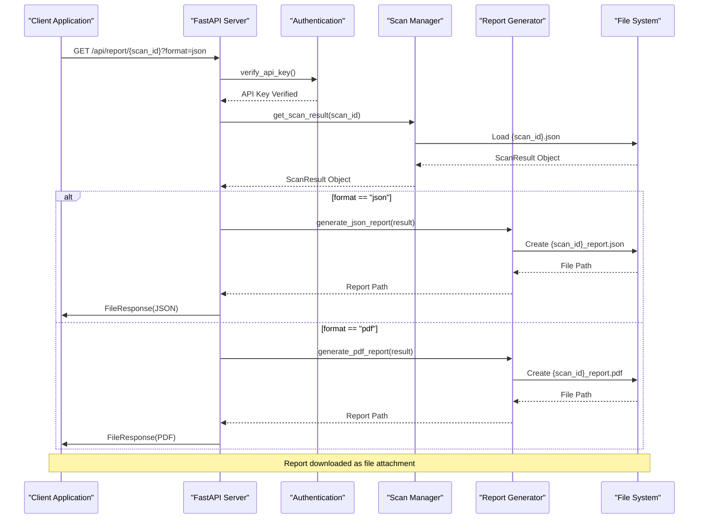
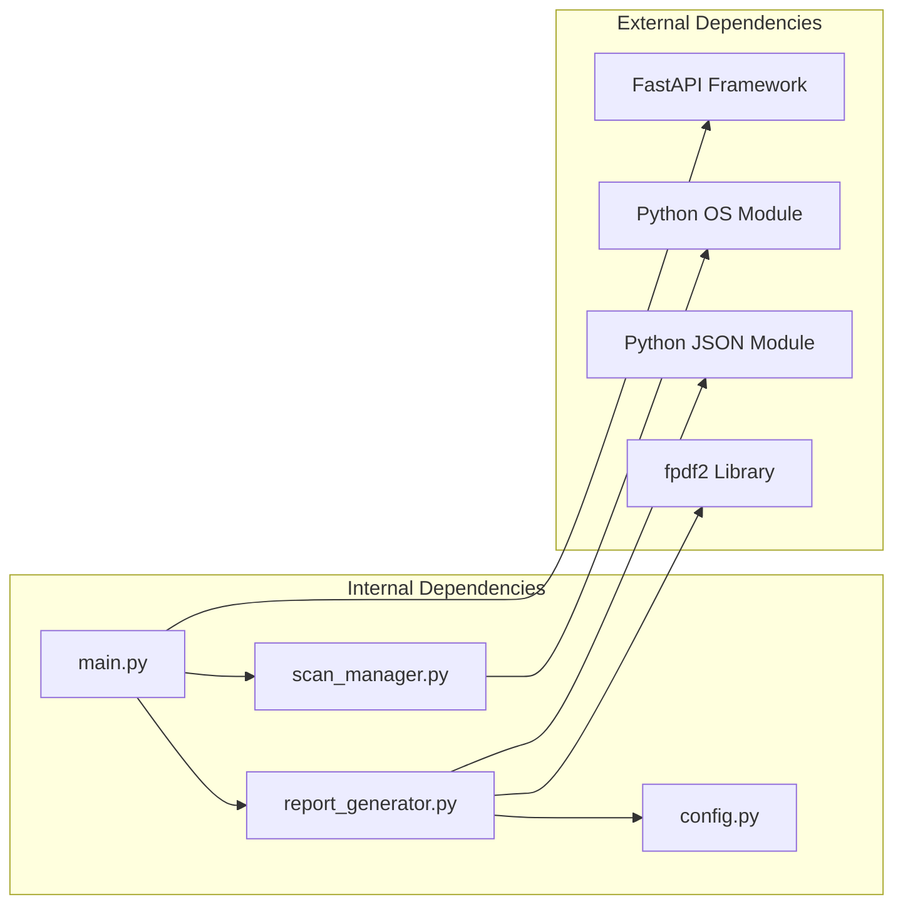

# Report Generation Endpoints

<cite>
**Referenced Files in This Document**
- [main.py](file://app/main.py)
- [report_generator.py](file://app/report_generator.py)
- [scan_manager.py](file://app/scan_manager.py)
- [client.js](file://frontend/src/api/client.js)
- [Results.jsx](file://frontend/src/pages/Results.jsx)
- [config.py](file://app/config.py)
</cite>

## Table of Contents
1. [Introduction](#introduction)
2. [Project Structure](#project-structure)
3. [Core Components](#core-components)
4. [Architecture Overview](#architecture-overview)
5. [Detailed Component Analysis](#detailed-component-analysis)
6. [Dependency Analysis](#dependency-analysis)
7. [Performance Considerations](#performance-considerations)
8. [Troubleshooting Guide](#troubleshooting-guide)
9. [Conclusion](#conclusion)

## Introduction

This document provides comprehensive API documentation for AutoPoV's report generation endpoints, focusing on the GET `/api/report/{scan_id}` endpoint that enables users to generate and download scan reports in multiple formats. AutoPoV is an autonomous proof-of-vulnerability framework that performs vulnerability assessments on codebases using AI-powered agents and generates detailed reports in both JSON and PDF formats.

The report generation system provides two primary output formats:
- **JSON Format**: Comprehensive machine-readable report containing all scan metadata, findings, metrics, and analysis results
- **PDF Format**: Professionally formatted human-readable report with executive summaries, vulnerability details, and validation evidence

## Project Structure

The report generation functionality spans multiple components within the AutoPoV architecture:

```mermaid
graph TB
subgraph "API Layer"
API[FastAPI Application]
Auth[Authentication]
ReportEndpoint[GET /api/report/{scan_id}]
end
subgraph "Business Logic"
ScanManager[Scan Manager]
ReportGenerator[Report Generator]
end
subgraph "Data Layer"
ResultsDir[Results Directory]
JSONFile[JSON Report File]
PDFFile[PDF Report File]
end
subgraph "Output Formats"
JSONFormat[JSON Format]
PDFFormat[PDF Format]
end
API --> Auth
API --> ReportEndpoint
ReportEndpoint --> ScanManager
ReportEndpoint --> ReportGenerator
ScanManager --> ResultsDir
ReportGenerator --> JSONFile
ReportGenerator --> PDFFile
ReportEndpoint --> JSONFormat
ReportEndpoint --> PDFFormat
```

**Diagram sources**
- [main.py:599-644](file://app/main.py#L599-L644)
- [report_generator.py:200-262](file://app/report_generator.py#L200-L262)
- [scan_manager.py:449-458](file://app/scan_manager.py#L449-L458)

**Section sources**
- [main.py:599-644](file://app/main.py#L599-L644)
- [report_generator.py:200-262](file://app/report_generator.py#L200-L262)
- [scan_manager.py:449-458](file://app/scan_manager.py#L449-L458)

## Core Components

### Report Generation Endpoint

The primary report generation endpoint is implemented as a FastAPI route that handles GET requests for retrieving scan reports:

**Endpoint**: `GET /api/report/{scan_id}`

**Parameters**:
- `scan_id` (path parameter): Unique identifier of the scan for which to generate a report
- `format` (query parameter, optional): Output format, defaults to "json"
  - "json": Generate JSON report
  - "pdf": Generate PDF report

**Authentication**: Requires API key verification using the `verify_api_key` dependency

**Section sources**
- [main.py:599-644](file://app/main.py#L599-L644)

### Report Generator Module

The report generator provides two distinct report generation methods:

**JSON Report Generation**:
- Creates comprehensive JSON files with all scan metadata
- Includes scan summary, model usage statistics, metrics, and findings
- File naming convention: `{scan_id}_report.json`
- Content-Type: `application/json`

**PDF Report Generation**:
- Generates professionally formatted PDF documents
- Includes executive summaries, vulnerability details, and validation evidence
- File naming convention: `{scan_id}_report.pdf`
- Content-Type: `application/pdf`

**Section sources**
- [report_generator.py:209-262](file://app/report_generator.py#L209-L262)
- [report_generator.py:264-610](file://app/report_generator.py#L264-L610)

### Scan Result Management

The scan manager handles retrieval and storage of scan results:

**Result Retrieval**:
- Loads scan results from JSON files in the results directory
- Supports both active scans and completed scan results
- Provides structured data for report generation

**File Organization**:
- Results stored in `./results/runs/` directory
- Individual scan results saved as `{scan_id}.json`
- Report files saved as `{scan_id}_report.{format}`

**Section sources**
- [scan_manager.py:449-458](file://app/scan_manager.py#L449-L458)
- [config.py:138-142](file://app/config.py#L138-L142)

## Architecture Overview

The report generation process follows a structured workflow:



**Diagram sources**
- [main.py:599-644](file://app/main.py#L599-L644)
- [report_generator.py:209-262](file://app/report_generator.py#L209-L262)
- [report_generator.py:264-610](file://app/report_generator.py#L264-L610)

## Detailed Component Analysis

### API Endpoint Implementation

The report generation endpoint implements robust error handling and response formatting:

**Request Processing**:
1. Validates API key authentication
2. Retrieves scan result by scan_id
3. Generates appropriate report format based on query parameter
4. Returns file response with proper headers

**Response Headers**:
- `Content-Disposition`: `attachment; filename={scan_id}_report.{format}`
- `Content-Type`: `application/json` or `application/pdf`
- `Access-Control-Expose-Headers`: `Content-Disposition, Content-Type`

**Error Handling**:
- 404 Not Found: When scan result is not found
- 400 Bad Request: When invalid format parameter is provided
- 500 Internal Server Error: When report generation fails

**Section sources**
- [main.py:599-644](file://app/main.py#L599-L644)

### Report Generation Methods

#### JSON Report Generation

The JSON report generation creates comprehensive machine-readable reports:

**File Naming Convention**: `{scan_id}_report.json`

**Content Structure**:
- Report metadata (tool version, generation timestamp)
- Scan summary (duration, configuration, status)
- Model usage statistics
- Metrics and analytics
- Detailed findings with validation results
- Methodology documentation

**File Path**: Stored in `RESULTS_DIR` directory

**Section sources**
- [report_generator.py:209-262](file://app/report_generator.py#L209-L262)
- [config.py:138](file://app/config.py#L138)

#### PDF Report Generation

The PDF report generation creates professionally formatted documents:

**File Naming Convention**: `{scan_id}_report.pdf`

**Content Features**:
- Cover page with security assessment branding
- Executive summary with key metrics
- AI model usage analysis
- Confirmed vulnerability details
- False positive analysis
- Methodology documentation
- Technical appendix

**Requirements**: Requires `fpdf2` library installation

**Section sources**
- [report_generator.py:264-610](file://app/report_generator.py#L264-L610)

### Frontend Integration

The frontend provides seamless report download functionality:

**Client Implementation**:
- Uses Axios for HTTP requests
- Handles both JSON and PDF responses appropriately
- Creates downloadable files using Blob API
- Implements proper error handling

**User Interface**:
- Two buttons for report formats (JSON and PDF)
- Automatic file naming with scan_id prefix
- Download triggers for immediate file saving

**Section sources**
- [client.js:52-55](file://frontend/src/api/client.js#L52-L55)
- [Results.jsx:43-61](file://frontend/src/pages/Results.jsx#L43-L61)

## Dependency Analysis

The report generation system has minimal external dependencies:



**Diagram sources**
- [main.py:26](file://app/main.py#L26)
- [report_generator.py:18](file://app/report_generator.py#L18)
- [config.py:6](file://app/config.py#L6)

**Section sources**
- [main.py:26](file://app/main.py#L26)
- [report_generator.py:18](file://app/report_generator.py#L18)
- [config.py:6](file://app/config.py#L6)

## Performance Considerations

### File I/O Operations
- Report generation involves synchronous file operations
- JSON reports are generated quickly due to simple serialization
- PDF generation requires additional processing time for document creation

### Memory Usage
- Large scan results may require significant memory for PDF generation
- Consider scan result size limits for optimal performance
- PDF generation requires sufficient memory for document assembly

### Scalability
- Report generation is CPU-bound for PDF creation
- JSON generation is I/O-bound and generally faster
- Consider caching frequently accessed reports for improved performance

## Troubleshooting Guide

### Common Issues and Solutions

**Issue**: "Scan result not found" (404 Error)
- **Cause**: Invalid scan_id or scan result not yet generated
- **Solution**: Verify scan_id exists and scan has completed successfully

**Issue**: "Invalid format. Use 'json' or 'pdf'" (400 Error)
- **Cause**: Unsupported format parameter value
- **Solution**: Use only "json" or "pdf" format values

**Issue**: "Report generation failed" (500 Error)
- **Cause**: PDF library not installed or report generation error
- **Solution**: Install `fpdf2` library or check JSON report generation

**Issue**: PDF generation fails with "fpdf not available"
- **Cause**: `fpdf2` library not installed
- **Solution**: Install with `pip install fpdf2`

**Section sources**
- [main.py:608-643](file://app/main.py#L608-L643)
- [report_generator.py:266-267](file://app/report_generator.py#L266-L267)

### Practical Usage Examples

#### Programmatic Report Retrieval

**JavaScript Example**:
```javascript
// Download JSON report
const response = await getReport(scanId, 'json');
const blob = new Blob([response.data], { type: 'application/json' });
const url = window.URL.createObjectURL(blob);
const a = document.createElement('a');
a.href = url;
a.download = `${scanId}_report.json`;
a.click();

// Download PDF report  
const response = await getReport(scanId, 'pdf');
const blob = new Blob([response.data], { type: 'application/pdf' });
const url = window.URL.createObjectURL(blob);
const a = document.createElement('a');
a.href = url;
a.download = `${scanId}_report.pdf`;
a.click();
```

**Python Example**:
```python
import requests

# Download JSON report
response = requests.get(
    f"http://localhost:8000/api/report/{scan_id}?format=json",
    headers={"Authorization": "Bearer YOUR_API_KEY"}
)

if response.status_code == 200:
    with open(f"{scan_id}_report.json", "wb") as f:
        f.write(response.content)
```

**Section sources**
- [client.js:52-55](file://frontend/src/api/client.js#L52-L55)
- [Results.jsx:43-61](file://frontend/src/pages/Results.jsx#L43-L61)

## Conclusion

AutoPoV's report generation system provides a robust and flexible solution for exporting vulnerability scan results in multiple formats. The system offers:

- **Dual Format Support**: Both JSON and PDF report formats for different use cases
- **Professional Output**: PDF reports include comprehensive formatting and analysis
- **Machine-Readable JSON**: Complete scan data for programmatic processing
- **Seamless Integration**: Easy-to-use API endpoints with proper error handling
- **Flexible Deployment**: Minimal dependencies with clear configuration options

The report generation functionality integrates smoothly with AutoPoV's scanning pipeline, providing users with comprehensive vulnerability assessment reports that can be easily shared, archived, and processed programmatically. The system's design ensures reliability, scalability, and ease of use for both individual developers and enterprise environments.