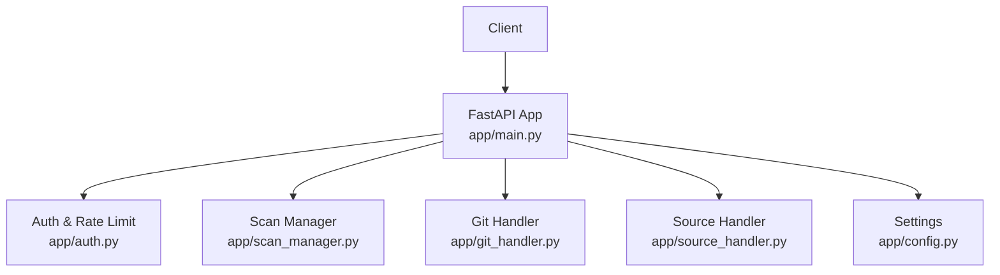
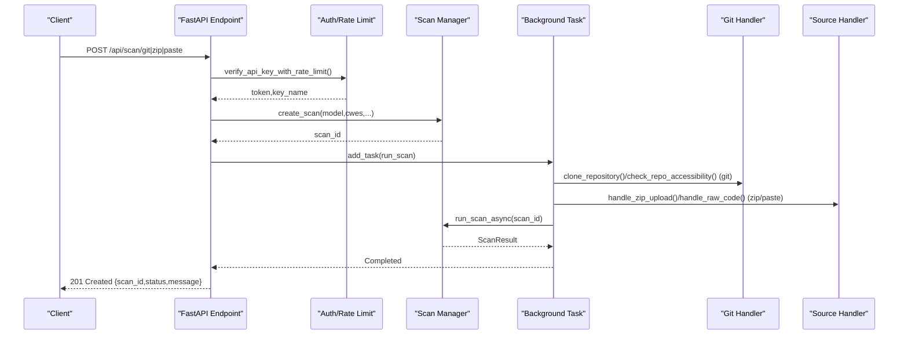
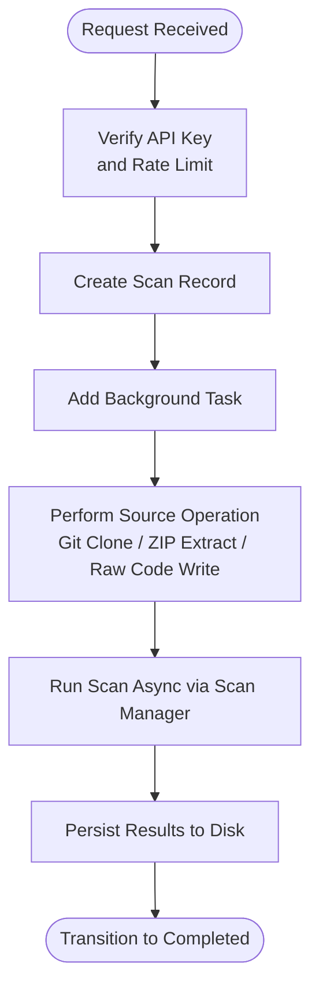
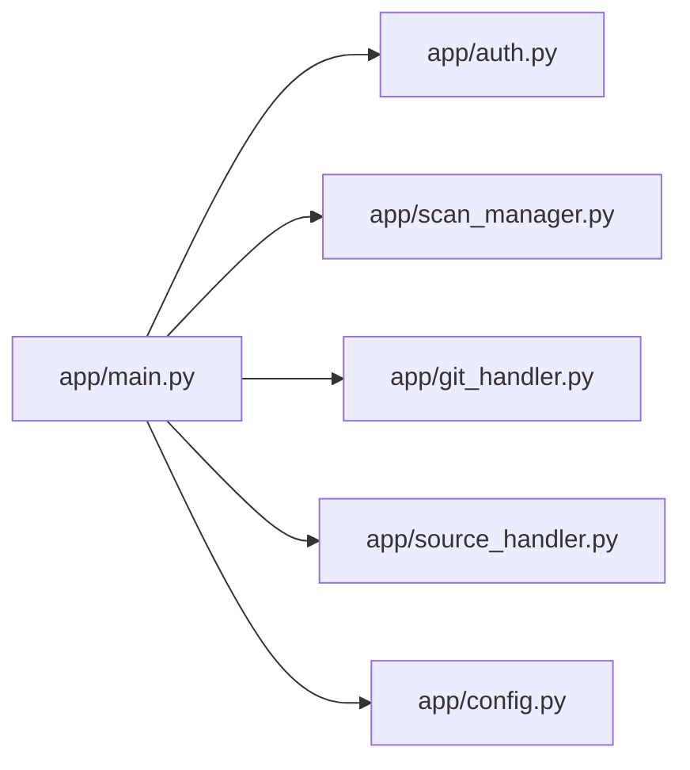

# Scan Initiation Endpoints

<cite>
**Referenced Files in This Document**
- [app/main.py](file://app/main.py)
- [app/scan_manager.py](file://app/scan_manager.py)
- [app/auth.py](file://app/auth.py)
- [app/source_handler.py](file://app/source_handler.py)
- [app/git_handler.py](file://app/git_handler.py)
- [app/config.py](file://app/config.py)
- [README.md](file://README.md)
</cite>

## Table of Contents
1. [Introduction](#introduction)
2. [Project Structure](#project-structure)
3. [Core Components](#core-components)
4. [Architecture Overview](#architecture-overview)
5. [Detailed Component Analysis](#detailed-component-analysis)
6. [Dependency Analysis](#dependency-analysis)
7. [Performance Considerations](#performance-considerations)
8. [Troubleshooting Guide](#troubleshooting-guide)
9. [Conclusion](#conclusion)

## Introduction
This document provides comprehensive API documentation for AutoPoV’s scan initiation endpoints. It covers the three primary endpoints for creating scans:
- POST /api/scan/git: Git repository scanning with URL, optional token, and branch parameters
- POST /api/scan/zip: ZIP file upload scanning using multipart form data
- POST /api/scan/paste: Direct code paste scanning

For each endpoint, you will find request schemas, parameter validation rules, authentication requirements, response formats, background task patterns, error handling strategies, rate limiting behavior, security considerations, and practical examples.

## Project Structure
The scan initiation endpoints are implemented in the FastAPI application module and orchestrated by the scan manager. Supporting handlers manage source inputs and Git operations. Authentication and rate limiting are enforced centrally.

**Diagram sources**
- [app/main.py:204-400](file://app/main.py#L204-L400)
- [app/auth.py:192-236](file://app/auth.py#L192-L236)
- [app/scan_manager.py:74-114](file://app/scan_manager.py#L74-L114)
- [app/git_handler.py:199-294](file://app/git_handler.py#L199-L294)
- [app/source_handler.py:31-78](file://app/source_handler.py#L31-L78)
- [app/config.py:136-146](file://app/config.py#L136-L146)

**Section sources**
- [app/main.py:204-400](file://app/main.py#L204-L400)
- [app/scan_manager.py:74-114](file://app/scan_manager.py#L74-L114)
- [app/auth.py:192-236](file://app/auth.py#L192-L236)
- [app/git_handler.py:199-294](file://app/git_handler.py#L199-L294)
- [app/source_handler.py:31-78](file://app/source_handler.py#L31-L78)
- [app/config.py:136-146](file://app/config.py#L136-L146)

## Core Components
- FastAPI endpoints for scan initiation
- Authentication and rate limiting
- Scan lifecycle management (creation, background execution, completion)
- Source input handlers (Git, ZIP, raw code)
- Configuration-driven defaults and policies

Key behaviors:
- Asynchronous background execution using BackgroundTasks and thread pools
- Centralized scan state and result persistence
- Two-tier authentication (Admin Key for management, API Key for operations)
- Rate limiting enforced per API key per minute

**Section sources**
- [app/main.py:204-400](file://app/main.py#L204-L400)
- [app/scan_manager.py:234-365](file://app/scan_manager.py#L234-L365)
- [app/auth.py:24-27](file://app/auth.py#L24-L27)
- [app/auth.py:129-146](file://app/auth.py#L129-L146)

## Architecture Overview
The scan initiation flow follows a background task pattern:
1. Client sends a scan request with required parameters
2. Endpoint validates authentication and rate limits
3. Scan is created via Scan Manager
4. Background task performs the actual scan (Git clone, ZIP extraction, or raw code handling)
5. Results are persisted and can be polled or streamed

**Diagram sources**
- [app/main.py:204-400](file://app/main.py#L204-L400)
- [app/auth.py:221-236](file://app/auth.py#L221-L236)
- [app/scan_manager.py:74-114](file://app/scan_manager.py#L74-L114)
- [app/scan_manager.py:234-365](file://app/scan_manager.py#L234-L365)
- [app/git_handler.py:155-198](file://app/git_handler.py#L155-L198)
- [app/source_handler.py:31-78](file://app/source_handler.py#L31-L78)

## Detailed Component Analysis

### Endpoint: POST /api/scan/git
Purpose: Initiate a scan of a Git repository by URL, optionally with a token and branch.

- Method: POST
- Path: /api/scan/git
- Authentication: Bearer API Key (with rate limit enforcement)
- Request Schema (Pydantic):
  - url: string (required)
  - token: string (optional)
  - branch: string (optional)
  - model: string (default: openai/gpt-4o)
  - cwes: array of strings (default: ["CWE-89","CWE-119","CWE-190","CWE-416"])
- Response: 201 Created with ScanResponse
  - scan_id: string
  - status: string ("created")
  - message: string

Processing logic:
- Validates authentication and rate limit
- Creates a scan record via Scan Manager
- Background task:
  - Checks repository accessibility (size, branch existence, provider-specific checks)
  - Clones repository (with injected credentials if configured)
  - Updates scan with local path
  - Executes scan asynchronously using Scan Manager
- On completion, scan status transitions to "completed" and results are persisted

Validation rules:
- url must be a valid Git provider URL
- branch must exist if provided
- cwes must be a valid list of supported CWE identifiers
- model must be a known model identifier

Security considerations:
- Supports injecting tokens for private repositories (provider-specific)
- Enforces rate limiting per API key
- Logs repository checks and clone attempts

Rate limiting:
- 10 scans per minute per API key

Example request:
- Headers: Authorization: Bearer apov_...
- Body: { "url": "https://github.com/user/repo.git", "branch": "main", "cwes": ["CWE-89","CWE-79"] }

Example response:
- 201 Created: { "scan_id": "...", "status": "created", "message": "Git repository scan initiated" }

Related flows:
- Repository accessibility check and branch verification
- Credential injection for providers (GitHub, GitLab, Bitbucket)

**Section sources**
- [app/main.py:204-285](file://app/main.py#L204-L285)
- [app/main.py:31-45](file://app/main.py#L31-L45)
- [app/main.py:54-68](file://app/main.py#L54-L68)
- [app/auth.py:221-236](file://app/auth.py#L221-L236)
- [app/scan_manager.py:74-114](file://app/scan_manager.py#L74-L114)
- [app/scan_manager.py:234-365](file://app/scan_manager.py#L234-L365)
- [app/git_handler.py:155-198](file://app/git_handler.py#L155-L198)
- [app/git_handler.py:199-294](file://app/git_handler.py#L199-L294)
- [app/config.py:108-134](file://app/config.py#L108-L134)

### Endpoint: POST /api/scan/zip
Purpose: Upload a ZIP archive containing source code and initiate a scan.

- Method: POST
- Path: /api/scan/zip
- Authentication: Bearer API Key (with rate limit enforcement)
- Request: multipart/form-data
  - file: UploadFile (required)
  - model: string (form field, default: openai/gpt-4o)
  - cwes: string (comma-separated list, default: "CWE-89,CWE-119,CWE-190,CWE-416")
- Response: 201 Created with ScanResponse

Processing logic:
- Validates authentication and rate limit
- Creates a scan record via Scan Manager
- Reads uploaded file content (UploadFile is not thread-safe)
- Background task:
  - Saves uploaded ZIP to temporary path
  - Extracts ZIP to scan source directory with path traversal protection
  - Updates scan with extracted path
  - Executes scan asynchronously using Scan Manager

Validation rules:
- file must be a valid ZIP archive
- cwes must parse to a valid list
- model must be a known model identifier

Security considerations:
- Path traversal prevention during ZIP extraction
- Temporary file handling and cleanup
- Enforces rate limiting per API key

Rate limiting:
- 10 scans per minute per API key

Example request:
- Headers: Authorization: Bearer apov_..., Content-Type: multipart/form-data
- Body: file=<ZIP>, model=openai/gpt-4o, cwes=CWE-89,CWE-79

Example response:
- 201 Created: { "scan_id": "...", "status": "created", "message": "ZIP file scan initiated" }

Related flows:
- ZIP extraction with single-root directory handling
- Path traversal detection and rejection

**Section sources**
- [app/main.py:288-347](file://app/main.py#L288-L347)
- [app/main.py:31-45](file://app/main.py#L31-L45)
- [app/main.py:54-68](file://app/main.py#L54-L68)
- [app/auth.py:221-236](file://app/auth.py#L221-L236)
- [app/scan_manager.py:74-114](file://app/scan_manager.py#L74-L114)
- [app/scan_manager.py:234-365](file://app/scan_manager.py#L234-L365)
- [app/source_handler.py:31-78](file://app/source_handler.py#L31-L78)

### Endpoint: POST /api/scan/paste
Purpose: Submit raw code directly for scanning.

- Method: POST
- Path: /api/scan/paste
- Authentication: Bearer API Key (with rate limit enforcement)
- Request Schema (Pydantic):
  - code: string (required)
  - language: string (optional)
  - filename: string (optional)
  - model: string (default: openai/gpt-4o)
  - cwes: array of strings (default: ["CWE-89","CWE-119","CWE-190","CWE-416"])
- Response: 201 Created with ScanResponse

Processing logic:
- Validates authentication and rate limit
- Creates a scan record via Scan Manager
- Background task:
  - Writes code to a file in the scan source directory
  - Determines filename from language if not provided
  - Updates scan with source path
  - Executes scan asynchronously using Scan Manager

Validation rules:
- code must be a non-empty string
- language must be mapped to a supported extension if provided
- cwes must be a valid list of supported CWE identifiers
- model must be a known model identifier

Security considerations:
- Controlled file naming and extension resolution
- Enforces rate limiting per API key

Rate limiting:
- 10 scans per minute per API key

Example request:
- Headers: Authorization: Bearer apov_...
- Body: { "code": "print('hello world')", "language": "python", "cwes": ["CWE-89"] }

Example response:
- 201 Created: { "scan_id": "...", "status": "created", "message": "Code paste scan initiated" }

Related flows:
- Language-to-extension mapping
- File creation in source directory

**Section sources**
- [app/main.py:350-400](file://app/main.py#L350-L400)
- [app/main.py:39-45](file://app/main.py#L39-L45)
- [app/main.py:54-68](file://app/main.py#L54-L68)
- [app/auth.py:221-236](file://app/auth.py#L221-L236)
- [app/scan_manager.py:74-114](file://app/scan_manager.py#L74-L114)
- [app/scan_manager.py:234-365](file://app/scan_manager.py#L234-L365)
- [app/source_handler.py:193-232](file://app/source_handler.py#L193-L232)

### Background Task Pattern and Lifecycle
All three endpoints use a consistent background task pattern:
- Create scan record with initial state
- Add a background task to perform the actual work
- The background task executes in a new event loop within a thread pool
- Scan Manager coordinates execution and persists results
- Status can be polled or streamed via dedicated endpoints

**Diagram sources**
- [app/main.py:204-400](file://app/main.py#L204-L400)
- [app/scan_manager.py:234-365](file://app/scan_manager.py#L234-L365)

**Section sources**
- [app/main.py:204-400](file://app/main.py#L204-L400)
- [app/scan_manager.py:234-365](file://app/scan_manager.py#L234-L365)

### Authentication and Rate Limiting
- Two-tier authentication:
  - Admin Key: for administrative endpoints (key management, cleanup)
  - API Key: for operational endpoints (scans, polling, streaming)
- Rate limiting:
  - 10 scans per minute per API key
  - Enforced centrally with sliding window
- Token retrieval:
  - Authorization header Bearer token preferred
  - Query parameter fallback for streaming endpoints

Security:
- Timing-safe comparisons for admin key validation
- SHA-256 hashing for API key storage
- Pending last_used updates flushed periodically

**Section sources**
- [app/auth.py:24-27](file://app/auth.py#L24-L27)
- [app/auth.py:129-146](file://app/auth.py#L129-L146)
- [app/auth.py:192-236](file://app/auth.py#L192-L236)
- [README.md:379-382](file://README.md#L379-L382)

### Error Handling Strategies
Common error scenarios:
- Authentication failures: 401 Unauthorized
- Rate limit exceeded: 429 Too Many Requests
- Invalid or missing parameters: 400 Bad Request
- Repository access issues: 400 Bad Request with descriptive message
- ZIP extraction errors: 400 Bad Request with error details
- Background task exceptions: scan status transitions to "failed" with error logs

Error propagation:
- Background tasks catch exceptions and update scan state
- Error messages are logged and stored in scan logs
- Final status reflects completion or failure

**Section sources**
- [app/auth.py:221-236](file://app/auth.py#L221-L236)
- [app/main.py:223-238](file://app/main.py#L223-L238)
- [app/main.py:335-340](file://app/main.py#L335-L340)
- [app/main.py:388-393](file://app/main.py#L388-L393)
- [app/scan_manager.py:339-365](file://app/scan_manager.py#L339-L365)

## Dependency Analysis
The scan initiation endpoints depend on several internal modules:

**Diagram sources**
- [app/main.py:204-400](file://app/main.py#L204-L400)
- [app/auth.py:192-236](file://app/auth.py#L192-L236)
- [app/scan_manager.py:74-114](file://app/scan_manager.py#L74-L114)
- [app/git_handler.py:199-294](file://app/git_handler.py#L199-L294)
- [app/source_handler.py:31-78](file://app/source_handler.py#L31-L78)
- [app/config.py:136-146](file://app/config.py#L136-L146)

**Section sources**
- [app/main.py:204-400](file://app/main.py#L204-L400)
- [app/auth.py:192-236](file://app/auth.py#L192-L236)
- [app/scan_manager.py:74-114](file://app/scan_manager.py#L74-L114)
- [app/git_handler.py:199-294](file://app/git_handler.py#L199-L294)
- [app/source_handler.py:31-78](file://app/source_handler.py#L31-L78)
- [app/config.py:136-146](file://app/config.py#L136-L146)

## Performance Considerations
- Background execution offloads long-running operations from the request thread
- Thread pool executor used for synchronous scan execution
- Repository size checks prevent excessive resource usage for large repositories
- Optional shallow clones reduce bandwidth and time for large repositories
- Results persisted to disk with CSV history for efficient retrieval

[No sources needed since this section provides general guidance]

## Troubleshooting Guide
Common issues and resolutions:
- 401 Unauthorized: Verify API key is set in Authorization header or query parameter for streaming
- 429 Too Many Requests: Wait until the rate limit window resets (60 seconds)
- 400 Bad Request (Git): Ensure URL is valid, branch exists, and credentials are configured for private repositories
- 400 Bad Request (ZIP): Confirm file is a valid ZIP archive and not corrupted
- 400 Bad Request (Paste): Ensure code is provided and language is supported if specified
- Scan stuck in "running": Check logs via GET /api/scan/{scan_id} or stream via /api/scan/{scan_id}/stream

Operational tips:
- Use GET /api/scan/{scan_id} to poll status and retrieve results
- Use SSE streaming for real-time logs
- Use GET /api/history to review recent scans

**Section sources**
- [app/main.py:511-545](file://app/main.py#L511-L545)
- [app/main.py:548-583](file://app/main.py#L548-L583)
- [app/scan_manager.py:419-493](file://app/scan_manager.py#L419-L493)

## Conclusion
AutoPoV’s scan initiation endpoints provide a robust, asynchronous interface for scanning Git repositories, ZIP archives, and raw code. They enforce strong authentication and rate limiting, support background execution, and persist results for later retrieval. By following the request schemas, validation rules, and security considerations outlined here, you can reliably integrate AutoPoV into automated workflows and CI/CD pipelines.