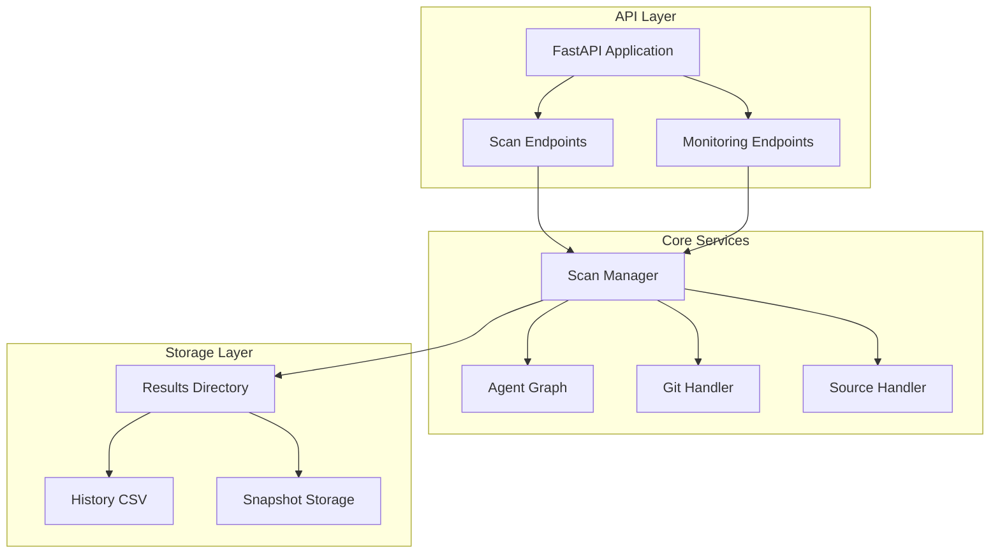
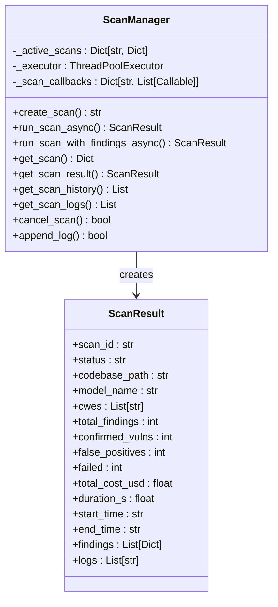
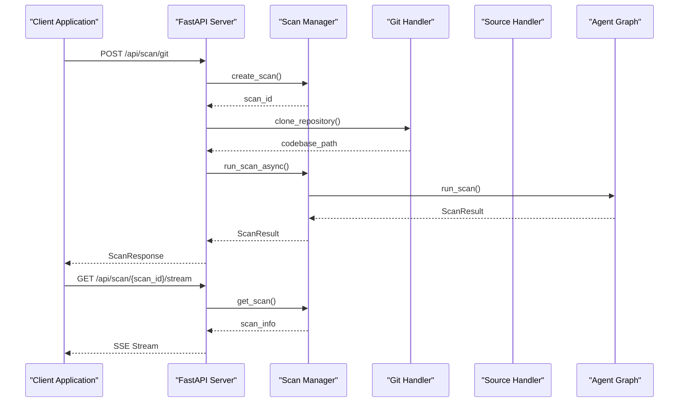
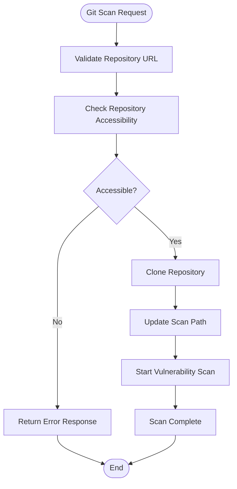
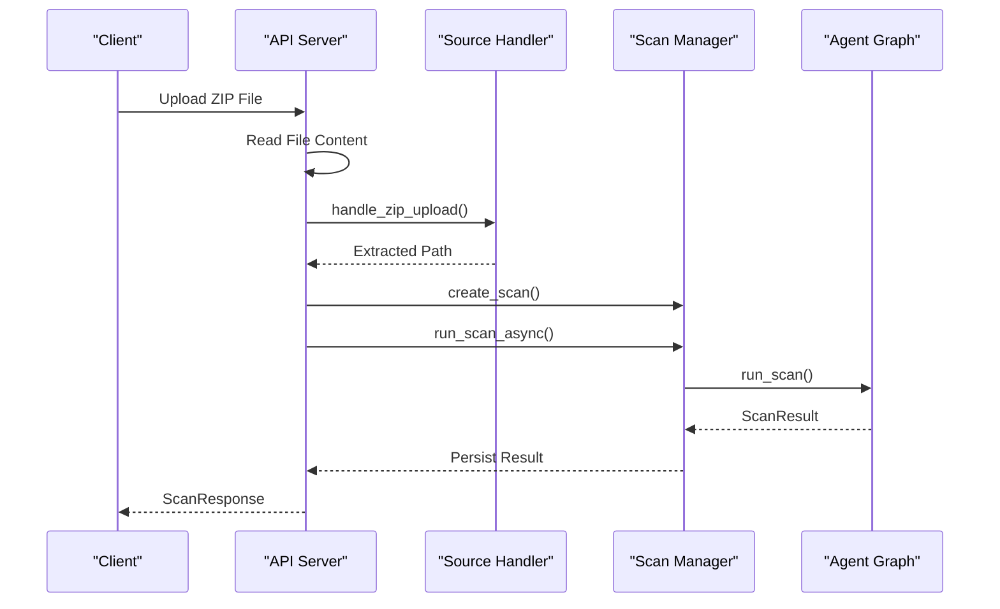
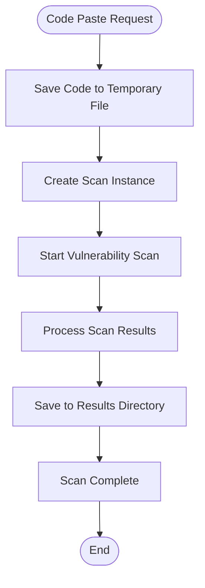
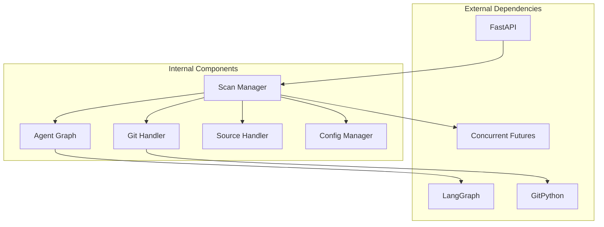

# Scan Management API

<cite>
**Referenced Files in This Document**
- [app/main.py](file://app/main.py)
- [app/scan_manager.py](file://app/scan_manager.py)
- [app/config.py](file://app/config.py)
- [app/git_handler.py](file://app/git_handler.py)
- [app/source_handler.py](file://app/source_handler.py)
- [app/agent_graph.py](file://app/agent_graph.py)
- [results/runs/scan_history.csv](file://results/runs/scan_history.csv)
</cite>

## Table of Contents
1. [Introduction](#introduction)
2. [Project Structure](#project-structure)
3. [Core Components](#core-components)
4. [Architecture Overview](#architecture-overview)
5. [Detailed Component Analysis](#detailed-component-analysis)
6. [Dependency Analysis](#dependency-analysis)
7. [Performance Considerations](#performance-considerations)
8. [Troubleshooting Guide](#troubleshooting-guide)
9. [Conclusion](#conclusion)

## Introduction

AutoPoV is an autonomous Proof-of-Vulnerability framework that provides comprehensive vulnerability scanning capabilities through a REST API. The scan management system handles three primary scan initiation methods: Git repository scanning, ZIP file uploads, and code paste submissions. It offers real-time monitoring through streaming endpoints and provides replay functionality for historical scans.

The system operates on an asynchronous architecture with background processing, thread pooling, and persistent state management. All scan operations are tracked through a centralized scan manager that maintains scan state, logs, and results.

## Project Structure

The scan management system is built around several key components:



**Diagram sources**
- [app/main.py:204-584](file://app/main.py#L204-L584)
- [app/scan_manager.py:47-663](file://app/scan_manager.py#L47-L663)

**Section sources**
- [app/main.py:114-122](file://app/main.py#L114-L122)
- [app/scan_manager.py:47-73](file://app/scan_manager.py#L47-L73)

## Core Components

### Scan Manager Architecture

The Scan Manager serves as the central orchestrator for all vulnerability scanning operations:



**Diagram sources**
- [app/scan_manager.py:47-200](file://app/scan_manager.py#L47-L200)
- [app/scan_manager.py:23-45](file://app/scan_manager.py#L23-L45)

### Configuration Management

The system uses a comprehensive configuration system that controls scan behavior, model selection, and resource limits:

| Configuration Category | Key | Default Value | Description |
|----------------------|-----|---------------|-------------|
| Model Selection | MODEL_MODE | "online" | "online" or "offline" |
| Model Names | MODEL_NAME | "openai/gpt-4o" | Default LLM model |
| Routing Mode | ROUTING_MODE | "auto" | "auto", "fixed", or "learning" |
| Cost Controls | MAX_COST_USD | 100.0 | Maximum cost per scan |
| Chunk Limits | MAX_CHUNK_SIZE | 4000 | Maximum chunk size for analysis |
| Retry Limits | MAX_RETRIES | 2 | Maximum retry attempts |

**Section sources**
- [app/config.py:13-255](file://app/config.py#L13-L255)

## Architecture Overview

The scan management system follows a layered architecture with clear separation of concerns:



**Diagram sources**
- [app/main.py:204-285](file://app/main.py#L204-L285)
- [app/scan_manager.py:234-264](file://app/scan_manager.py#L234-L264)

## Detailed Component Analysis

### Git Repository Scanning Endpoint

The Git repository scanning endpoint handles remote repository analysis with comprehensive validation and error handling.

**Endpoint**: `POST /api/scan/git`

**Request Schema**:
```json
{
  "url": "string",
  "token": "string",
  "branch": "string",
  "model": "string",
  "cwes": ["string"]
}
```

**Response Schema**:
```json
{
  "scan_id": "string",
  "status": "string",
  "message": "string"
}
```

**Processing Flow**:



**Diagram sources**
- [app/main.py:204-285](file://app/main.py#L204-L285)
- [app/git_handler.py:155-198](file://app/git_handler.py#L155-L198)

**Section sources**
- [app/main.py:204-285](file://app/main.py#L204-L285)
- [app/git_handler.py:199-294](file://app/git_handler.py#L199-L294)

### ZIP File Upload Scanning Endpoint

The ZIP file upload endpoint processes compressed code archives with security validation and extraction.

**Endpoint**: `POST /api/scan/zip`

**Request Schema**:
- Form-data: `file` (UploadFile)
- Form-data: `model` (string, default: "openai/gpt-4o")
- Form-data: `cwes` (string, default: "CWE-89,CWE-119,CWE-190,CWE-416")

**Processing Flow**:



**Diagram sources**
- [app/main.py:288-347](file://app/main.py#L288-L347)
- [app/source_handler.py:31-78](file://app/source_handler.py#L31-L78)

**Section sources**
- [app/main.py:288-347](file://app/main.py#L288-L347)
- [app/source_handler.py:31-78](file://app/source_handler.py#L31-L78)

### Code Paste Scanning Endpoint

The code paste endpoint handles direct code submission with automatic language detection and file creation.

**Endpoint**: `POST /api/scan/paste`

**Request Schema**:
```json
{
  "code": "string",
  "language": "string",
  "filename": "string",
  "model": "string",
  "cwes": ["string"]
}
```

**Processing Flow**:



**Diagram sources**
- [app/main.py:350-400](file://app/main.py#L350-L400)
- [app/source_handler.py:193-232](file://app/source_handler.py#L193-L232)

**Section sources**
- [app/main.py:350-400](file://app/main.py#L350-L400)
- [app/source_handler.py:193-232](file://app/source_handler.py#L193-L232)

### Scan Status Monitoring Endpoint

The status monitoring endpoint provides real-time scan progress and results.

**Endpoint**: `GET /api/scan/{scan_id}`

**Response Schema**:
```json
{
  "scan_id": "string",
  "status": "string",
  "progress": integer,
  "logs": ["string"],
  "result": {
    "scan_id": "string",
    "status": "string",
    "codebase_path": "string",
    "model_name": "string",
    "cwes": ["string"],
    "total_findings": integer,
    "confirmed_vulns": integer,
    "false_positives": integer,
    "failed": integer,
    "total_cost_usd": number,
    "duration_s": number,
    "start_time": "string",
    "end_time": "string",
    "findings": [{}],
    "logs": ["string"]
  },
  "findings": [{}],
  "error": "string"
}
```

**Section sources**
- [app/main.py:511-545](file://app/main.py#L511-L545)
- [app/scan_manager.py:419-458](file://app/scan_manager.py#L419-L458)

### Real-Time Streaming Endpoint

The streaming endpoint provides Server-Sent Events (SSE) for real-time log updates during scan execution.

**Endpoint**: `GET /api/scan/{scan_id}/stream`

**Streaming Event Types**:
- `log`: New log entry
- `complete`: Scan completion with result data
- `error`: Error condition

**Event Payload**:
```json
{
  "type": "string",
  "message": "string"
}
```

**Section sources**
- [app/main.py:548-583](file://app/main.py#L548-L583)
- [app/scan_manager.py:423-447](file://app/scan_manager.py#L423-L447)

### Scan Cancellation Endpoint

The cancellation endpoint allows terminating running scans when supported.

**Endpoint**: `POST /api/scan/{scan_id}/cancel`

**Response Schema**:
```json
{
  "scan_id": "string",
  "status": "cancelled",
  "message": "string"
}
```

**Section sources**
- [app/main.py:492-507](file://app/main.py#L492-L507)
- [app/scan_manager.py:495-502](file://app/scan_manager.py#L495-L502)

### Replay Functionality

The replay endpoint enables running scans against historical findings with different models.

**Endpoint**: `POST /api/scan/{scan_id}/replay`

**Request Schema**:
```json
{
  "models": ["string"],
  "include_failed": boolean,
  "max_findings": integer
}
```

**Response Schema**:
```json
{
  "status": "string",
  "replay_ids": ["string"]
}
```

**Section sources**
- [app/main.py:404-490](file://app/main.py#L404-L490)
- [app/scan_manager.py:117-139](file://app/scan_manager.py#L117-L139)

### History Retrieval Endpoint

The history endpoint provides access to completed scan records.

**Endpoint**: `GET /api/history`

**Query Parameters**:
- `limit`: integer (default: 100)
- `offset`: integer (default: 0)

**Response Schema**:
```json
{
  "history": [
    {
      "scan_id": "string",
      "status": "string",
      "model_name": "string",
      "cwes": "string",
      "total_findings": integer,
      "confirmed_vulns": integer,
      "false_positives": integer,
      "failed": integer,
      "total_cost_usd": number,
      "duration_s": number,
      "start_time": "string",
      "end_time": "string"
    }
  ]
}
```

**Section sources**
- [app/main.py:586-595](file://app/main.py#L586-L595)
- [app/scan_manager.py:460-481](file://app/scan_manager.py#L460-L481)

## Dependency Analysis

The scan management system exhibits clear dependency relationships:



**Diagram sources**
- [app/main.py:13-28](file://app/main.py#L13-L28)
- [app/scan_manager.py:18-25](file://app/scan_manager.py#L18-L25)

### Error Handling Patterns

The system implements comprehensive error handling across all scan types:

| Error Type | Trigger Condition | Response |
|------------|-------------------|----------|
| Repository Not Found | Git clone fails | 404 Not Found |
| Authentication Required | Private repository | 401 Unauthorized |
| Rate Limit Exceeded | API rate limiting | 429 Too Many Requests |
| Invalid ZIP | Malformed archive | 400 Bad Request |
| Model Error | LLM API failure | 500 Internal Server Error |
| Scan Timeout | Excessive processing time | 504 Gateway Timeout |

**Section sources**
- [app/git_handler.py:289-293](file://app/git_handler.py#L289-L293)
- [app/source_handler.py:56-63](file://app/source_handler.py#L56-L63)

## Performance Considerations

### Asynchronous Processing

The system utilizes asyncio with ThreadPoolExecutor for optimal performance:

- **Thread Pool Size**: 3 concurrent workers
- **Background Task Queue**: Unlimited capacity
- **Memory Management**: Automatic cleanup of temporary files
- **Resource Limits**: Configurable maximum cost and retries

### Storage Optimization

- **Result Persistence**: JSON files with CSV audit trail
- **Snapshot Management**: Optional codebase snapshots for replay
- **Cleanup Policies**: Automatic removal of old results
- **Compression**: Efficient JSON serialization

### Scalability Features

- **Horizontal Scaling**: Stateless API design
- **Load Balancing**: Multiple worker processes
- **Queue Management**: Background task scheduling
- **Resource Monitoring**: Built-in metrics endpoint

## Troubleshooting Guide

### Common Issues and Solutions

**Git Repository Issues**:
- **Problem**: Repository clone timeout
- **Solution**: Reduce repository size or use ZIP upload
- **Prevention**: Monitor repository size before scanning

**Authentication Problems**:
- **Problem**: Private repository access denied
- **Solution**: Configure appropriate tokens in settings
- **Verification**: Test token permissions separately

**Resource Exhaustion**:
- **Problem**: Out of memory during large scans
- **Solution**: Increase system resources or reduce CWE scope
- **Monitoring**: Use metrics endpoint to track resource usage

**API Rate Limiting**:
- **Problem**: GitHub API rate limit exceeded
- **Solution**: Configure personal access tokens
- **Alternative**: Use local ZIP uploads instead

### Debugging Techniques

1. **Enable Debug Mode**: Set `DEBUG=true` in environment
2. **Monitor Logs**: Use `/api/scan/{scan_id}/stream` endpoint
3. **Check Metrics**: Review `/api/metrics` for system health
4. **Validate Configuration**: Verify `.env` settings are correct

**Section sources**
- [app/config.py:162-211](file://app/config.py#L162-L211)
- [app/main.py:754-757](file://app/main.py#L754-L757)

## Conclusion

The AutoPoV scan management system provides a robust, scalable solution for automated vulnerability assessment. Its asynchronous architecture, comprehensive error handling, and real-time monitoring capabilities make it suitable for production environments requiring reliable security scanning.

Key strengths include:
- **Flexible Input Methods**: Support for Git repositories, ZIP uploads, and code paste
- **Real-time Monitoring**: Streaming endpoints for live feedback
- **Historical Analysis**: Replay functionality and comprehensive audit trails
- **Production Ready**: Built-in resource management and cleanup policies

The system's modular design allows for easy extension and customization while maintaining reliability and performance standards.