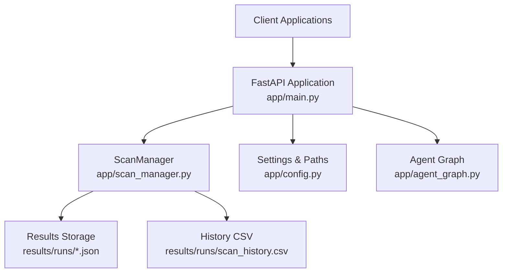
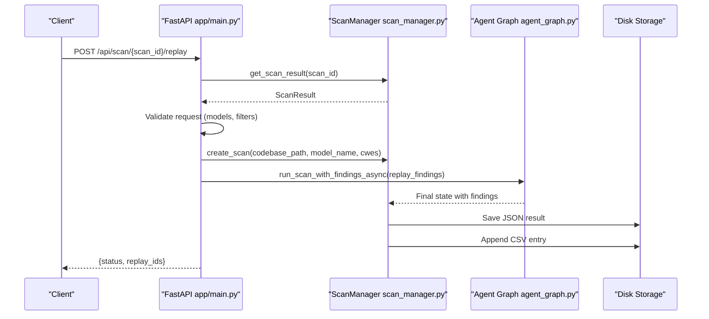
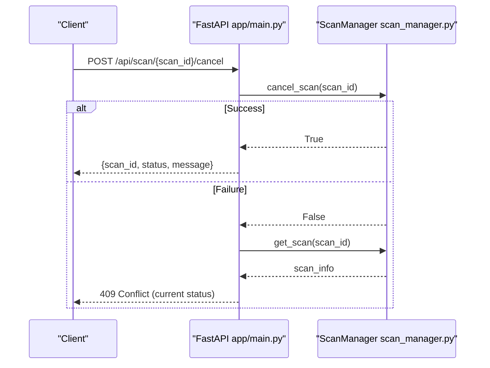
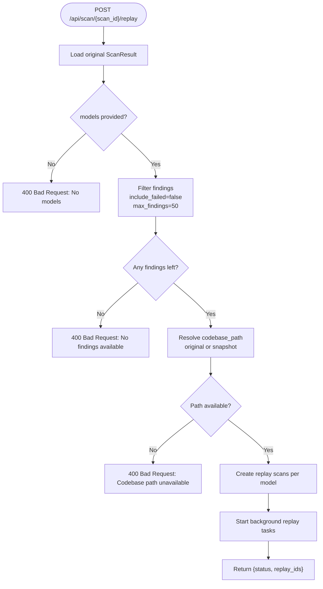
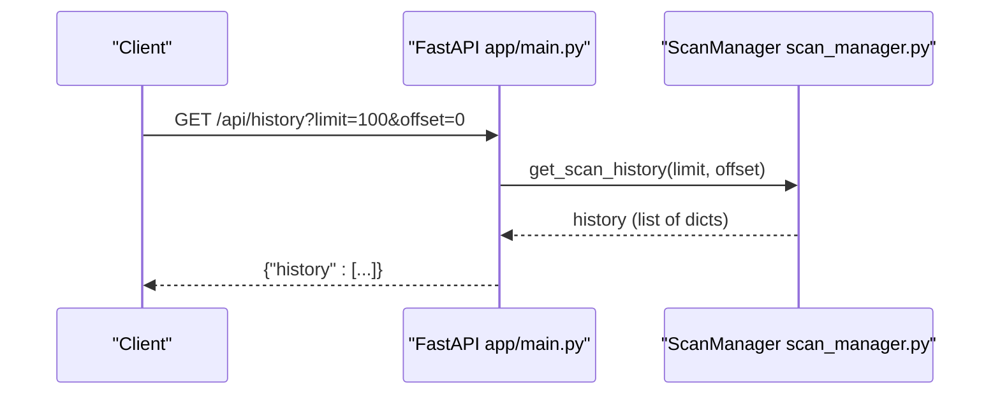
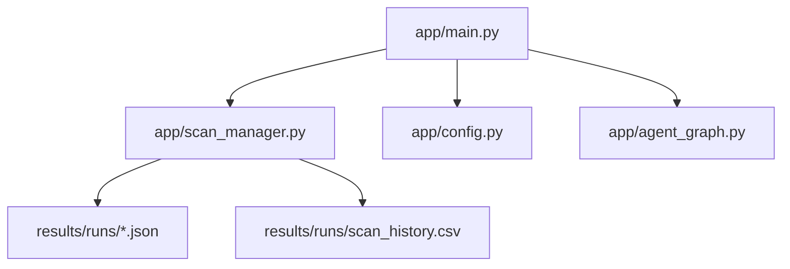

# Scan Management Operations

<cite>
**Referenced Files in This Document**
- [app/main.py](file://app/main.py)
- [app/scan_manager.py](file://app/scan_manager.py)
- [app/config.py](file://app/config.py)
- [app/agent_graph.py](file://app/agent_graph.py)
- [results/runs/scan_history.csv](file://results/runs/scan_history.csv)
- [results/runs/057aaece-eef6-4464-98d2-e97a8481a0c0.json](file://results/runs/057aaece-eef6-4464-98d2-e97a8481a0c0.json)
- [results/runs/03febf6b-42fc-4dcc-ab61-daab09256ea3.json](file://results/runs/03febf6b-42fc-4dcc-ab61-daab09256ea3.json)
</cite>

## Table of Contents
1. [Introduction](#introduction)
2. [Project Structure](#project-structure)
3. [Core Components](#core-components)
4. [Architecture Overview](#architecture-overview)
5. [Detailed Component Analysis](#detailed-component-analysis)
6. [Dependency Analysis](#dependency-analysis)
7. [Performance Considerations](#performance-considerations)
8. [Troubleshooting Guide](#troubleshooting-guide)
9. [Conclusion](#conclusion)

## Introduction
This document provides comprehensive API documentation for AutoPoV's scan management operations. It focuses on three key endpoints:
- POST /api/scan/{scan_id}/cancel: Cancel a running scan with status validation and error handling
- POST /api/scan/{scan_id}/replay: Replay scans with model selection, finding filtering, and batch processing capabilities
- GET /api/history: Retrieve scan history with pagination parameters

The documentation covers request/response schemas, validation rules, practical examples, and explains the replay functionality's relationship to original scan results and snapshot management.

## Project Structure
AutoPoV exposes a FastAPI-based REST API with dedicated endpoints for scan management. The scan lifecycle is managed by a central ScanManager that persists results to disk and maintains an in-memory registry of active scans. Results are stored as JSON files in the results/runs directory, with a CSV audit trail in scan_history.csv.

**Diagram sources**
- [app/main.py:114-122](file://app/main.py#L114-L122)
- [app/scan_manager.py:47-73](file://app/scan_manager.py#L47-L73)
- [app/config.py:136-146](file://app/config.py#L136-L146)

**Section sources**
- [app/main.py:114-122](file://app/main.py#L114-L122)
- [app/scan_manager.py:47-73](file://app/scan_manager.py#L47-L73)
- [app/config.py:136-146](file://app/config.py#L136-L146)

## Core Components
- FastAPI Application: Defines endpoints, request/response models, and authentication/authorization.
- ScanManager: Central orchestrator managing scan lifecycle, state, persistence, and cancellation.
- Agent Graph: Executes vulnerability detection workflow and integrates with CodeQL/LangChain components.
- Configuration: Provides runtime settings, directory paths, and feature toggles.

Key responsibilities:
- Endpoint handlers validate inputs, enforce rate limits, and delegate to ScanManager.
- ScanManager stores results as JSON and maintains a CSV history for analytics.
- Agent Graph performs the actual vulnerability detection and generates findings.

**Section sources**
- [app/main.py:30-91](file://app/main.py#L30-L91)
- [app/scan_manager.py:47-663](file://app/scan_manager.py#L47-L663)
- [app/agent_graph.py:82-168](file://app/agent_graph.py#L82-L168)

## Architecture Overview
The scan management architecture centers around the ScanManager singleton, which coordinates asynchronous scan execution and persists outcomes. Endpoints interact with ScanManager to create, monitor, and manage scans, while results are persisted to disk and indexed in CSV for historical analysis.

**Diagram sources**
- [app/main.py:404-490](file://app/main.py#L404-L490)
- [app/scan_manager.py:117-232](file://app/scan_manager.py#L117-L232)
- [app/agent_graph.py:241-307](file://app/agent_graph.py#L241-L307)

## Detailed Component Analysis

### POST /api/scan/{scan_id}/cancel
Purpose: Cancel a running scan identified by scan_id.

Behavior:
- Validates existence of scan_id in active scans.
- Checks current status; only cancels if status is "running".
- Returns success with cancellation message or raises HTTP 409 with current status if not cancellable.

Validation rules:
- scan_id must correspond to an existing active scan.
- Current status must be "running".

Error handling:
- 404 Not Found if scan_id does not exist.
- 409 Conflict with current status if not running.

Response schema:
- JSON object with fields: scan_id, status, message.

Practical example:
- Request: POST /api/scan/123e4567-e89b-12d3-a456-426614174000/cancel
- Success response: {"scan_id":"123e4567-e89b-12d3-a456-426614174000","status":"cancelled","message":"Scan cancellation requested"}

**Diagram sources**
- [app/main.py:492-507](file://app/main.py#L492-L507)
- [app/scan_manager.py:495-502](file://app/scan_manager.py#L495-L502)

**Section sources**
- [app/main.py:492-507](file://app/main.py#L492-L507)
- [app/scan_manager.py:495-502](file://app/scan_manager.py#L495-L502)

### POST /api/scan/{scan_id}/replay
Purpose: Replay a previous scan using its findings and selected models.

Behavior:
- Retrieves original scan result by scan_id.
- Validates presence of models list.
- Filters findings:
  - Optionally excludes failed findings (include_failed flag).
  - Limits to max_findings.
- Resolves codebase path:
  - Uses original codebase_path if available.
  - Falls back to snapshot directory if enabled.
- Creates new scan(s) per model with preloaded findings.
- Starts background replay tasks and returns replay_ids.

Request schema:
- Body: ReplayRequest
  - models: Array of model identifiers
  - include_failed: Boolean (default: false)
  - max_findings: Integer (default: 50)

Response schema:
- JSON object with fields: status, replay_ids (array of newly created scan ids).

Validation rules:
- scan_id must exist and have a saved result.
- models must be non-empty.
- At least one finding must remain after filtering.
- codebase_path must be available or snapshot must exist.

Error handling:
- 404 Not Found if scan result not found.
- 400 Bad Request if models empty or no findings available.
- 400 Bad Request if codebase path unavailable and snapshot missing.

Practical example:
- Request: POST /api/scan/123e4567-e89b-12d3-a456-426614174000/replay
  - Body: {"models":["openai/gpt-4o"],"include_failed":false,"max_findings":50}
- Success response: {"status":"replay_started","replay_ids":["88888888-cccc-dddd-eeee-ffffffffffff","99999999-dddd-eeee-ffff-gggggggggggg"]}

Relationship to original results and snapshots:
- Replay reuses findings from the original scan result.
- Snapshot management enables replay even if original codebase is removed.
- Replay sets triggered_by to "replay" and records replay_of pointing to original scan_id.

**Diagram sources**
- [app/main.py:404-490](file://app/main.py#L404-L490)
- [app/scan_manager.py:117-232](file://app/scan_manager.py#L117-L232)

**Section sources**
- [app/main.py:404-490](file://app/main.py#L404-L490)
- [app/scan_manager.py:117-232](file://app/scan_manager.py#L117-L232)
- [app/config.py:142-146](file://app/config.py#L142-L146)

### GET /api/history
Purpose: Retrieve scan history with pagination.

Parameters:
- limit: Integer (default: 100)
- offset: Integer (default: 0)

Response schema:
- JSON object with field: history (array of CSV row dictionaries)

Pagination behavior:
- Returns rows in reverse chronological order (newest first).
- Applies offset and limit to the reversed list.

Practical example:
- Request: GET /api/history?limit=50&offset=0
- Response: {"history":[{"scan_id":"...","status":"completed",...},{"scan_id":"...","status":"failed",...}]}

**Diagram sources**
- [app/main.py:587-595](file://app/main.py#L587-L595)
- [app/scan_manager.py:460-481](file://app/scan_manager.py#L460-L481)

**Section sources**
- [app/main.py:587-595](file://app/main.py#L587-L595)
- [app/scan_manager.py:460-481](file://app/scan_manager.py#L460-L481)
- [results/runs/scan_history.csv:1-72](file://results/runs/scan_history.csv#L1-L72)

## Dependency Analysis
The scan management endpoints depend on:
- ScanManager for scan lifecycle, persistence, and cancellation.
- Agent Graph for executing vulnerability detection workflows.
- Configuration for runtime settings and directory paths.
- Results storage for JSON and CSV persistence.

**Diagram sources**
- [app/main.py:24-26](file://app/main.py#L24-L26)
- [app/scan_manager.py:47-73](file://app/scan_manager.py#L47-L73)
- [app/config.py:136-146](file://app/config.py#L136-L146)

**Section sources**
- [app/main.py:24-26](file://app/main.py#L24-L26)
- [app/scan_manager.py:47-73](file://app/scan_manager.py#L47-L73)
- [app/config.py:136-146](file://app/config.py#L136-L146)

## Performance Considerations
- Asynchronous execution: Scans run in background tasks using thread pools to avoid blocking the API.
- Result persistence: JSON and CSV writes occur after completion to minimize latency.
- Snapshot management: Enabling snapshots allows replay without retaining the original codebase, reducing disk usage.
- Pagination: History endpoint supports limit/offset to control response size.

[No sources needed since this section provides general guidance]

## Troubleshooting Guide
Common issues and resolutions:
- Cancel endpoint returns 409 Conflict: The scan is not in "running" status. Check scan status via GET /api/scan/{scan_id}.
- Replay endpoint returns 404 Not Found: The original scan result does not exist. Ensure the scan completed and results are persisted.
- Replay endpoint returns 400 Bad Request (no models): Provide a non-empty models array.
- Replay endpoint returns 400 Bad Request (no findings available): Adjust include_failed or increase max_findings.
- History endpoint returns empty: Verify CSV exists and contains entries; check limit/offset values.

**Section sources**
- [app/main.py:492-507](file://app/main.py#L492-L507)
- [app/main.py:404-490](file://app/main.py#L404-L490)
- [app/main.py:587-595](file://app/main.py#L587-L595)
- [app/scan_manager.py:460-481](file://app/scan_manager.py#L460-L481)

## Conclusion
AutoPoV's scan management endpoints provide robust controls for canceling running scans, replaying previous scans with configurable models and filters, and retrieving historical data with pagination. The system leverages a centralized ScanManager for lifecycle orchestration, persistent storage for results, and snapshot management for replay flexibility. Proper validation and error handling ensure predictable behavior across operations.