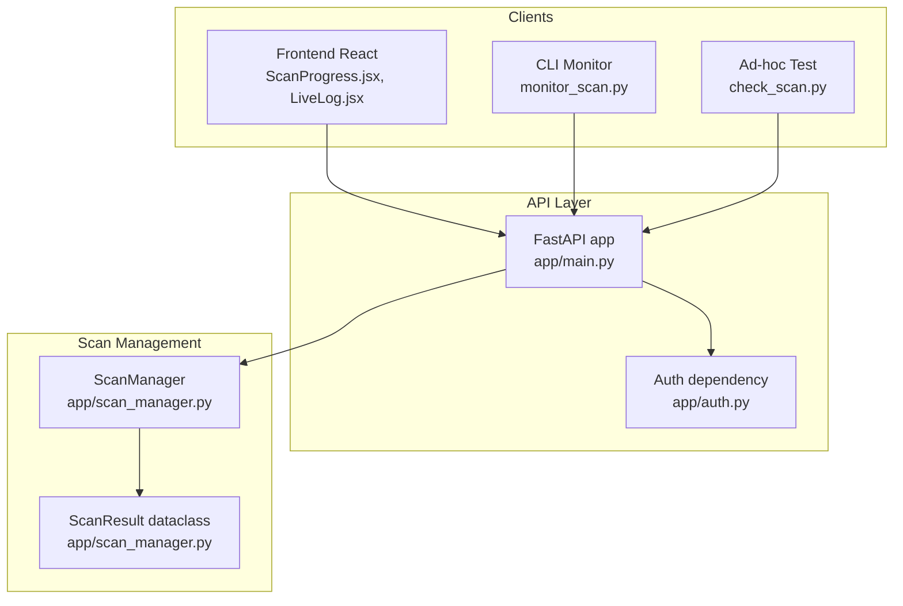
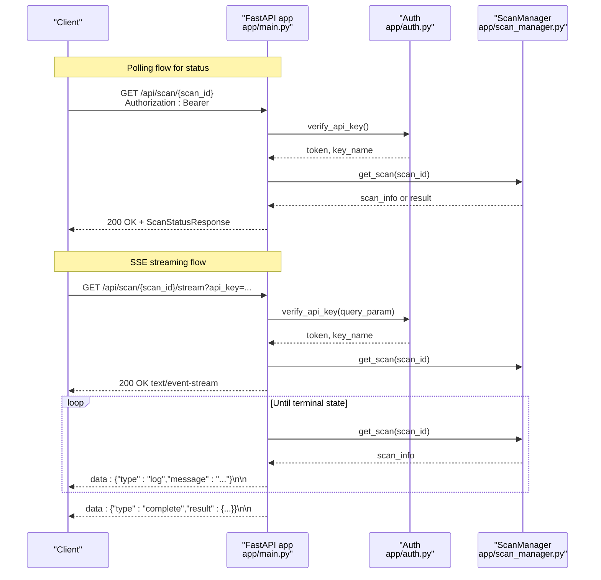
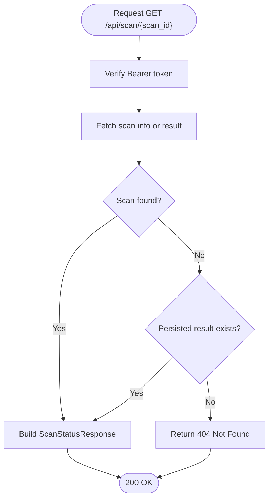
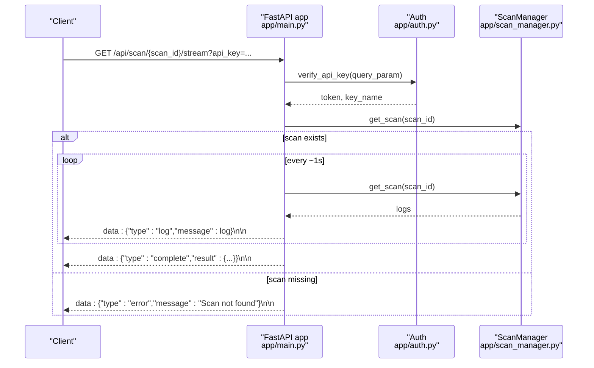
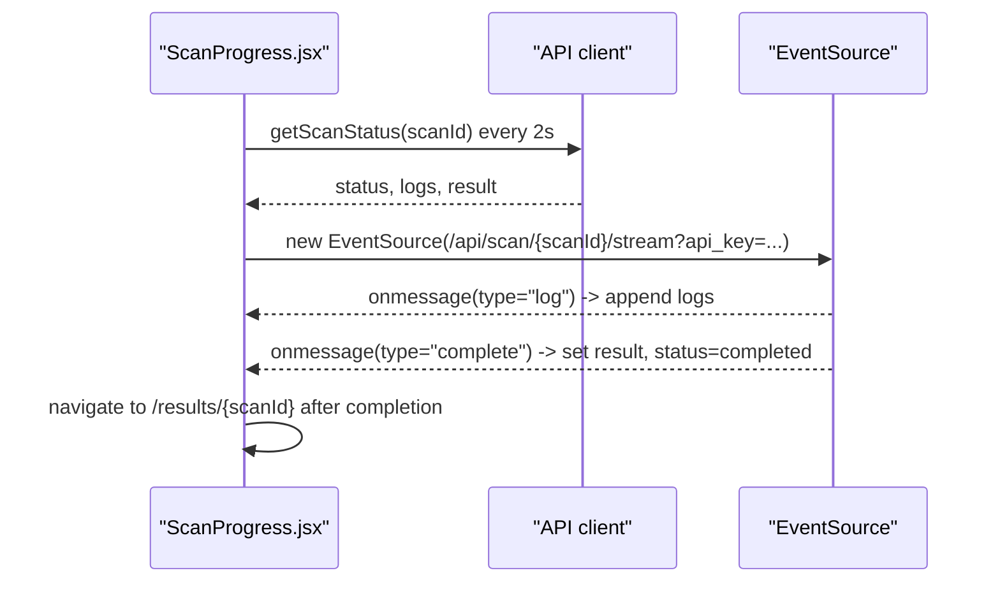
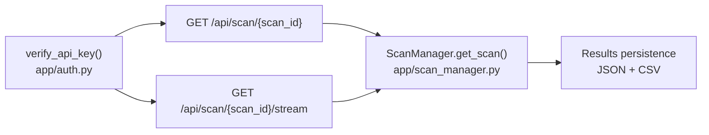

# Scan Monitoring Endpoints

<cite>
**Referenced Files in This Document**
- [app/main.py](file://app/main.py)
- [app/scan_manager.py](file://app/scan_manager.py)
- [app/auth.py](file://app/auth.py)
- [frontend/src/pages/ScanProgress.jsx](file://frontend/src/pages/ScanProgress.jsx)
- [frontend/src/components/LiveLog.jsx](file://frontend/src/components/LiveLog.jsx)
- [monitor_scan.py](file://monitor_scan.py)
- [check_scan.py](file://check_scan.py)
- [DOCS_APPLICATION_FLOW.md](file://DOCS_APPLICATION_FLOW.md)
</cite>

## Table of Contents
1. [Introduction](#introduction)
2. [Project Structure](#project-structure)
3. [Core Components](#core-components)
4. [Architecture Overview](#architecture-overview)
5. [Detailed Component Analysis](#detailed-component-analysis)
6. [Dependency Analysis](#dependency-analysis)
7. [Performance Considerations](#performance-considerations)
8. [Troubleshooting Guide](#troubleshooting-guide)
9. [Conclusion](#conclusion)

## Introduction
This document provides comprehensive API documentation for AutoPoV’s scan monitoring endpoints focused on:
- Retrieving scan status and results via GET /api/scan/{scan_id}
- Real-time Server-Sent Events (SSE) streaming via GET /api/scan/{scan_id}/stream

It covers response schemas, status codes, progress indicators, log arrays, findings collections, error handling, connection behavior, reconnection strategies, and practical examples for polling and streaming.

## Project Structure
The monitoring endpoints are implemented in the FastAPI application module and backed by a scan manager that maintains in-memory scan state and persists results to disk. Frontend components demonstrate client-side consumption of both polling and streaming.

**Diagram sources**
- [app/main.py:511-583](file://app/main.py#L511-L583)
- [app/auth.py:192-218](file://app/auth.py#L192-L218)
- [app/scan_manager.py:23-45](file://app/scan_manager.py#L23-L45)
- [frontend/src/pages/ScanProgress.jsx:16-79](file://frontend/src/pages/ScanProgress.jsx#L16-L79)
- [frontend/src/components/LiveLog.jsx:1-67](file://frontend/src/components/LiveLog.jsx#L1-L67)
- [monitor_scan.py:15-71](file://monitor_scan.py#L15-L71)
- [check_scan.py:10-15](file://check_scan.py#L10-L15)

**Section sources**
- [app/main.py:511-583](file://app/main.py#L511-L583)
- [app/scan_manager.py:47-114](file://app/scan_manager.py#L47-L114)
- [app/auth.py:192-218](file://app/auth.py#L192-L218)

## Core Components
- GET /api/scan/{scan_id}
  - Purpose: Poll for current scan status, progress, logs, findings, and results.
  - Response model: ScanStatusResponse with fields for scan_id, status, progress, logs, result, findings, and optional error.
  - Typical status values: created, checking, cloning, running, completed, failed, cancelled.
  - Progress: integer percentage indicating completion.
  - Logs: array of log strings appended by agents and scan manager.
  - Findings: array of finding dictionaries collected during the scan.
  - Result: object containing aggregated metrics and metadata when available.

- GET /api/scan/{scan_id}/stream
  - Purpose: Stream live logs and completion signals via SSE.
  - Event types:
    - type: log — message contains a new log entry string
    - type: complete — message contains the final result object
    - type: error — message indicates scan not found
  - Connection handling: The stream continues until the scan reaches terminal state (completed, failed, cancelled) or the client closes the connection.

**Section sources**
- [app/main.py:60-68](file://app/main.py#L60-L68)
- [app/main.py:511-545](file://app/main.py#L511-L545)
- [app/main.py:548-583](file://app/main.py#L548-L583)
- [app/scan_manager.py:420-493](file://app/scan_manager.py#L420-L493)

## Architecture Overview
The monitoring endpoints integrate authentication, scan state retrieval, and SSE streaming.

**Diagram sources**
- [app/main.py:511-545](file://app/main.py#L511-L545)
- [app/main.py:548-583](file://app/main.py#L548-L583)
- [app/auth.py:192-218](file://app/auth.py#L192-L218)
- [app/scan_manager.py:419-421](file://app/scan_manager.py#L419-L421)

## Detailed Component Analysis

### GET /api/scan/{scan_id}
- Endpoint: GET /api/scan/{scan_id}
- Authentication: Bearer token in Authorization header
- Response model: ScanStatusResponse
  - Fields:
    - scan_id: string
    - status: string (one of created, checking, cloning, running, completed, failed, cancelled)
    - progress: integer (0–100)
    - logs: array of strings
    - result: object (aggregated metrics and metadata; may be null until completion)
    - findings: array of dicts (candidate and confirmed findings)
    - error: optional string (error message if present)
- Behavior:
  - Returns scan_info if active, otherwise loads persisted result if available.
  - On missing scan and no persisted result, returns 404 Not Found.
- Practical usage:
  - Poll at intervals (e.g., every 2 seconds) to track progress and collect logs.
  - Use the result object for final metrics and findings after completion.

**Diagram sources**
- [app/main.py:511-545](file://app/main.py#L511-L545)
- [app/scan_manager.py:419-421](file://app/scan_manager.py#L419-L421)

**Section sources**
- [app/main.py:60-68](file://app/main.py#L60-L68)
- [app/main.py:511-545](file://app/main.py#L511-L545)
- [app/scan_manager.py:419-421](file://app/scan_manager.py#L419-L421)

### GET /api/scan/{scan_id}/stream
- Endpoint: GET /api/scan/{scan_id}/stream
- Authentication: Bearer token via Authorization header or api_key query parameter
- Media type: text/event-stream
- Event format:
  - {"type":"log","message":"<log string>"}
  - {"type":"complete","result":{...}}
  - {"type":"error","message":"Scan not found"}
- Behavior:
  - Streams new logs as they arrive.
  - Emits a complete event with the final result when status is completed, failed, or cancelled.
  - Emits an error event if the scan does not exist.
  - Continues until terminal state or client disconnects.

**Diagram sources**
- [app/main.py:548-583](file://app/main.py#L548-L583)
- [app/auth.py:206-208](file://app/auth.py#L206-L208)
- [app/scan_manager.py:419-421](file://app/scan_manager.py#L419-L421)

**Section sources**
- [app/main.py:548-583](file://app/main.py#L548-L583)
- [app/auth.py:206-208](file://app/auth.py#L206-L208)
- [DOCS_APPLICATION_FLOW.md:175-182](file://DOCS_APPLICATION_FLOW.md#L175-L182)

### Client-Side Consumption Patterns

#### Frontend (React)
- Polling: The progress page polls status every 2 seconds, updates logs, and navigates to results upon completion.
- SSE: Subscribes to /api/scan/{scan_id}/stream; onmessage handles type=log and type=complete.

**Diagram sources**
- [frontend/src/pages/ScanProgress.jsx:16-79](file://frontend/src/pages/ScanProgress.jsx#L16-L79)
- [frontend/src/components/LiveLog.jsx:1-67](file://frontend/src/components/LiveLog.jsx#L1-L67)

**Section sources**
- [frontend/src/pages/ScanProgress.jsx:16-79](file://frontend/src/pages/ScanProgress.jsx#L16-L79)
- [frontend/src/components/LiveLog.jsx:1-67](file://frontend/src/components/LiveLog.jsx#L1-L67)

#### CLI Monitor
- Polling: Periodically calls GET /api/scan/{scan_id}, prints status, progress, logs, and final result.
- Example usage: monitor_scan.py demonstrates scanning a given scan_id with periodic polling and streaming.

**Section sources**
- [monitor_scan.py:15-71](file://monitor_scan.py#L15-L71)
- [check_scan.py:10-15](file://check_scan.py#L10-L15)

## Dependency Analysis
- Authentication:
  - verify_api_key supports both Authorization header and api_key query parameter for SSE compatibility.
- Scan state:
  - get_scan returns active scan info; if absent, get_scan_result loads persisted results.
- SSE streaming:
  - Maintains last-log index to avoid duplicates and emits complete/error events on terminal states.

**Diagram sources**
- [app/auth.py:192-218](file://app/auth.py#L192-L218)
- [app/main.py:511-545](file://app/main.py#L511-L545)
- [app/main.py:548-583](file://app/main.py#L548-L583)
- [app/scan_manager.py:419-421](file://app/scan_manager.py#L419-L421)

**Section sources**
- [app/auth.py:192-218](file://app/auth.py#L192-L218)
- [app/scan_manager.py:419-421](file://app/scan_manager.py#L419-L421)

## Performance Considerations
- Polling interval: 2 seconds balances responsiveness with server load; adjust based on latency and throughput needs.
- SSE streaming: Efficient for real-time updates; minimal overhead compared to frequent polling.
- Log volume: Large scans produce many logs; clients should truncate or paginate if needed.
- Persistence: Completed scans persist results to disk; polling can still return results even after the active scan is cleaned up.

[No sources needed since this section provides general guidance]

## Troubleshooting Guide
- 401 Unauthorized
  - Cause: Missing or invalid API key.
  - Resolution: Ensure Authorization header contains a valid Bearer token or api_key query parameter is provided for SSE.
- 404 Not Found
  - Cause: scan_id not found and no persisted result exists.
  - Resolution: Verify scan_id correctness or wait for persistence if the scan recently completed.
- 429 Too Many Requests
  - Cause: Rate limit exceeded (10 scans per minute per key).
  - Resolution: Back off and retry later or generate a new API key.
- SSE connection drops
  - Behavior: The stream ends when scan reaches terminal state or the connection closes.
  - Resolution: Implement client-side reconnection with exponential backoff and resume from last received log index.
- Client-side consumption
  - Frontend: The progress page gracefully handles SSE errors and falls back to polling.
  - CLI: monitor_scan.py prints errors and retries on transient failures.

**Section sources**
- [app/auth.py:212-218](file://app/auth.py#L212-L218)
- [app/auth.py:230-236](file://app/auth.py#L230-L236)
- [app/main.py:560-562](file://app/main.py#L560-L562)
- [frontend/src/pages/ScanProgress.jsx:66-71](file://frontend/src/pages/ScanProgress.jsx#L66-L71)
- [monitor_scan.py:25-27](file://monitor_scan.py#L25-L27)

## Conclusion
AutoPoV’s monitoring endpoints provide a robust mechanism to observe scan progress:
- Use GET /api/scan/{scan_id} for polling status, logs, findings, and results.
- Use GET /api/scan/{scan_id}/stream for real-time SSE updates with log streaming and completion notifications.
- Combine both approaches on the client side for resilient monitoring, with SSE for live updates and polling as a fallback.