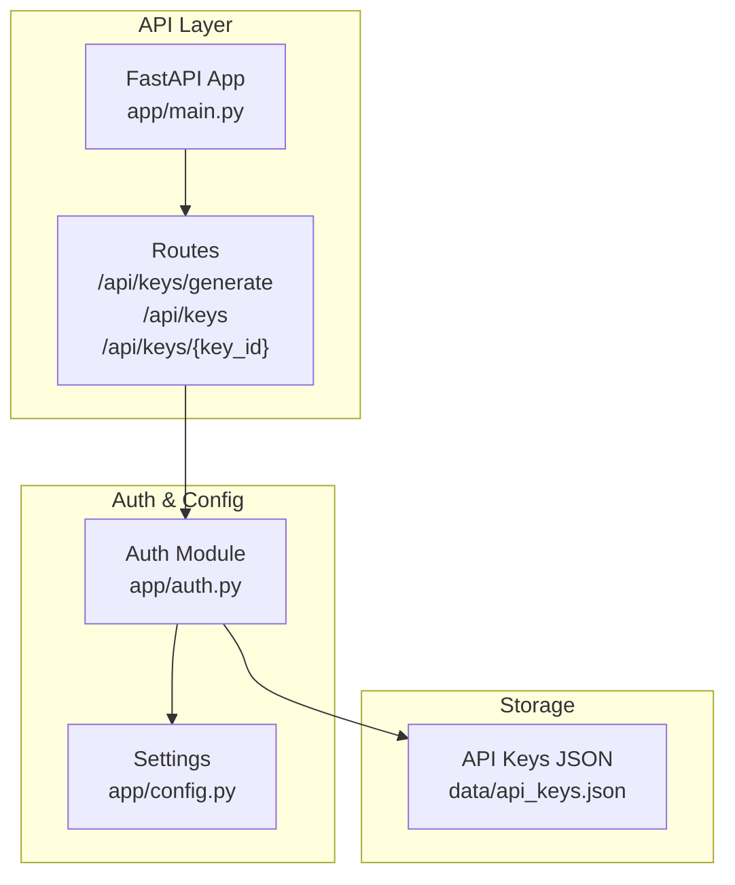
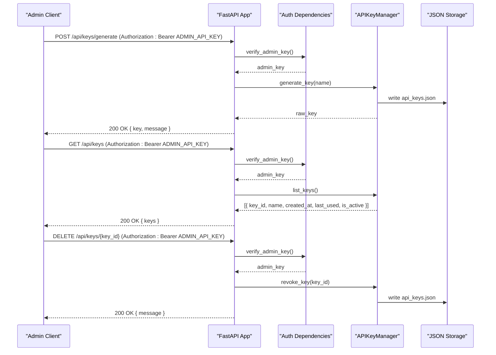
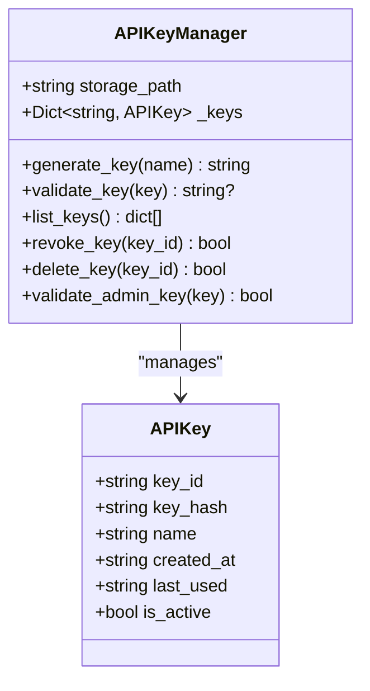
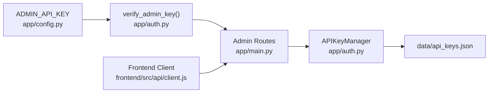

# API Key Management

<cite>
**Referenced Files in This Document**
- [app/main.py](file://app/main.py)
- [app/auth.py](file://app/auth.py)
- [app/config.py](file://app/config.py)
- [data/api_keys.json](file://data/api_keys.json)
- [frontend/src/api/client.js](file://frontend/src/api/client.js)
- [frontend/src/pages/Settings.jsx](file://frontend/src/pages/Settings.jsx)
- [generate_key.py](file://generate_key.py)
- [generate_key_temp.py](file://generate_key_temp.py)
- [add_api_key.py](file://add_api_key.py)
- [test_api_key.py](file://test_api_key.py)
- [README.md](file://README.md)
</cite>

## Table of Contents
1. [Introduction](#introduction)
2. [Project Structure](#project-structure)
3. [Core Components](#core-components)
4. [Architecture Overview](#architecture-overview)
5. [Detailed Component Analysis](#detailed-component-analysis)
6. [Dependency Analysis](#dependency-analysis)
7. [Performance Considerations](#performance-considerations)
8. [Troubleshooting Guide](#troubleshooting-guide)
9. [Conclusion](#conclusion)

## Introduction
This document provides comprehensive API documentation for AutoPoV’s API key management endpoints. It covers:
- Key generation endpoint for creating new API keys
- Key listing endpoint for viewing active keys with metadata
- Key revocation endpoint for removing access credentials
- Authentication requirements and admin-only access control
- Security considerations and lifecycle management implications
- Practical examples for generating keys, listing permissions, and revoking compromised keys
- The API key manager interface and operational procedures for system administrators

## Project Structure
AutoPoV exposes API key management endpoints under the base path /api. The endpoints are implemented in the FastAPI application and backed by an API key manager that persists keys to a JSON file.

**Diagram sources**
- [app/main.py:691-723](file://app/main.py#L691-L723)
- [app/auth.py:40-186](file://app/auth.py#L40-L186)
- [app/config.py:13-249](file://app/config.py#L13-L249)
- [data/api_keys.json:1-42](file://data/api_keys.json#L1-L42)

**Section sources**
- [app/main.py:691-723](file://app/main.py#L691-L723)
- [app/auth.py:40-186](file://app/auth.py#L40-L186)
- [app/config.py:13-249](file://app/config.py#L13-L249)
- [data/api_keys.json:1-42](file://data/api_keys.json#L1-L42)

## Core Components
- API key manager: Generates, validates, lists, and revokes API keys; stores them in a JSON file.
- Admin-only endpoints: Expose key generation, listing, and revocation.
- Frontend client: Provides convenience functions for key management operations.
- Configuration: Requires ADMIN_API_KEY to enable admin-only endpoints.

**Section sources**
- [app/auth.py:40-186](file://app/auth.py#L40-L186)
- [app/main.py:691-723](file://app/main.py#L691-L723)
- [app/config.py:26-27](file://app/config.py#L26-L27)
- [frontend/src/api/client.js:59-68](file://frontend/src/api/client.js#L59-L68)

## Architecture Overview
The API key management flow integrates FastAPI routes, authentication dependencies, and the API key manager.

**Diagram sources**
- [app/main.py:691-723](file://app/main.py#L691-L723)
- [app/auth.py:180-186](file://app/auth.py#L180-L186)
- [app/auth.py:88-105](file://app/auth.py#L88-L105)
- [app/auth.py:166-178](file://app/auth.py#L166-L178)
- [app/auth.py:148-155](file://app/auth.py#L148-L155)
- [data/api_keys.json:1-42](file://data/api_keys.json#L1-L42)

## Detailed Component Analysis

### API Key Generation Endpoint
- Endpoint: POST /api/keys/generate
- Authentication: Admin-only (requires ADMIN_API_KEY)
- Request parameters:
  - name: string (optional, default "default")
- Response format:
  - key: string (the newly generated API key)
  - message: string (success message)
- Behavior:
  - Generates a new API key with a random identifier and a secure raw key
  - Stores the key hash and metadata in the JSON storage
  - Returns the raw key once; it is not shown again
- Security considerations:
  - Admin-only access ensures only authorized operators can create keys
  - Raw key is never persisted; only the SHA-256 hash is stored
  - Keys are validated using constant-time comparison

Practical example (CLI):
- Use the provided script to generate a key programmatically.

**Section sources**
- [app/main.py:692-702](file://app/main.py#L692-L702)
- [app/auth.py:88-105](file://app/auth.py#L88-L105)
- [app/auth.py:84-86](file://app/auth.py#L84-L86)
- [generate_key.py:7-8](file://generate_key.py#L7-L8)
- [generate_key_temp.py:10-11](file://generate_key_temp.py#L10-L11)

### API Key Listing Endpoint
- Endpoint: GET /api/keys
- Authentication: Admin-only (requires ADMIN_API_KEY)
- Response format:
  - keys: array of objects containing:
    - key_id: string
    - name: string
    - created_at: ISO timestamp
    - last_used: ISO timestamp or null
    - is_active: boolean
- Behavior:
  - Lists all API keys without exposing hashes
  - Reflects current state from JSON storage
- Use cases:
  - Auditing active keys
  - Monitoring usage via last_used timestamps

Practical example (frontend):
- The Settings page calls this endpoint to populate the key list.

**Section sources**
- [app/main.py:705-711](file://app/main.py#L705-L711)
- [app/auth.py:166-178](file://app/auth.py#L166-L178)
- [frontend/src/api/client.js:65-68](file://frontend/src/api/client.js#L65-L68)
- [frontend/src/pages/Settings.jsx:35-47](file://frontend/src/pages/Settings.jsx#L35-L47)

### API Key Revocation Endpoint
- Endpoint: DELETE /api/keys/{key_id}
- Authentication: Admin-only (requires ADMIN_API_KEY)
- Path parameter:
  - key_id: string (the identifier of the key to revoke)
- Behavior:
  - Marks the key as inactive in storage
  - Future validations will reject the key
- Use cases:
  - Immediate deactivation of compromised or leaked keys
  - Temporary suspension during investigations

Practical example (frontend):
- The Settings page provides a revocation action with confirmation.

**Section sources**
- [app/main.py:714-723](file://app/main.py#L714-L723)
- [app/auth.py:148-155](file://app/auth.py#L148-L155)
- [frontend/src/pages/Settings.jsx:66-78](file://frontend/src/pages/Settings.jsx#L66-L78)

### API Key Manager Interface
The API key manager encapsulates key lifecycle operations and persistence.

**Diagram sources**
- [app/auth.py:30-38](file://app/auth.py#L30-L38)
- [app/auth.py:40-186](file://app/auth.py#L40-L186)

Key operations:
- generate_key(name): Creates a new key pair and persists it
- validate_key(key): Validates a raw key using SHA-256 hash comparison
- list_keys(): Returns metadata for all keys without exposing hashes
- revoke_key(key_id): Deactivates a key
- delete_key(key_id): Removes a key from storage
- validate_admin_key(key): Validates admin key using constant-time comparison

**Section sources**
- [app/auth.py:40-186](file://app/auth.py#L40-L186)

### Operational Procedures for Administrators
- Provisioning:
  - Generate a new key using the admin-only endpoint or CLI script
  - Immediately store the returned raw key securely
- Rotation:
  - Periodically rotate keys to reduce risk exposure
  - Revoke old keys after migration
- Monitoring:
  - Use the listing endpoint to track active keys and last_used timestamps
- Revocation:
  - Revoke compromised keys immediately
  - Confirm deactivation by attempting to use the key

**Section sources**
- [README.md:179-193](file://README.md#L179-L193)
- [frontend/src/pages/Settings.jsx:35-78](file://frontend/src/pages/Settings.jsx#L35-L78)

## Dependency Analysis
- Endpoints depend on admin verification:
  - verify_admin_key() enforces admin-only access
- Admin verification depends on settings:
  - ADMIN_API_KEY must be configured
- API key manager depends on:
  - JSON storage path (DATA_DIR)
  - Thread-safe operations for concurrent access
- Frontend client depends on:
  - Admin key availability and correct Authorization header

**Diagram sources**
- [app/config.py:26-27](file://app/config.py#L26-L27)
- [app/auth.py:239-250](file://app/auth.py#L239-L250)
- [app/main.py:691-723](file://app/main.py#L691-L723)
- [app/auth.py:40-186](file://app/auth.py#L40-L186)
- [data/api_keys.json:1-42](file://data/api_keys.json#L1-L42)
- [frontend/src/api/client.js:59-68](file://frontend/src/api/client.js#L59-L68)

**Section sources**
- [app/config.py:26-27](file://app/config.py#L26-L27)
- [app/auth.py:239-250](file://app/auth.py#L239-L250)
- [app/main.py:691-723](file://app/main.py#L691-L723)
- [frontend/src/api/client.js:59-68](file://frontend/src/api/client.js#L59-L68)

## Performance Considerations
- Persistence overhead:
  - Keys are written to disk on each change; batched updates minimize I/O
- Concurrency:
  - Thread locks protect in-memory state and disk writes
- Rate limiting:
  - While not part of key management, the system enforces per-key rate limits on scan operations to prevent abuse

[No sources needed since this section provides general guidance]

## Troubleshooting Guide
Common issues and resolutions:
- 401 Unauthorized when using API key:
  - Ensure the Authorization header is present and correct
  - Verify the key is active and not revoked
- 403 Forbidden on admin endpoints:
  - Confirm ADMIN_API_KEY is set in configuration
  - Ensure the admin key is passed correctly
- Key not found on revoke:
  - Verify the key_id is correct
  - Check that the key was not already deleted
- Key listing empty:
  - Confirm keys were generated and not deleted
  - Check storage file permissions

Operational examples:
- Generate a key via CLI script
- Manually add a key to storage for testing
- Test key validity using a simple API call

**Section sources**
- [app/main.py:691-723](file://app/main.py#L691-L723)
- [app/auth.py:107-127](file://app/auth.py#L107-L127)
- [app/auth.py:180-186](file://app/auth.py#L180-L186)
- [generate_key.py:7-8](file://generate_key.py#L7-L8)
- [add_api_key.py:10-37](file://add_api_key.py#L10-L37)
- [test_api_key.py:15-31](file://test_api_key.py#L15-L31)

## Conclusion
AutoPoV’s API key management provides a secure, admin-controlled mechanism for provisioning, auditing, and revoking API keys. By leveraging SHA-256 hashing, constant-time comparisons, and admin-only endpoints, the system minimizes risk while enabling flexible operational workflows. Administrators should follow rotation and monitoring procedures to maintain a strong security posture.