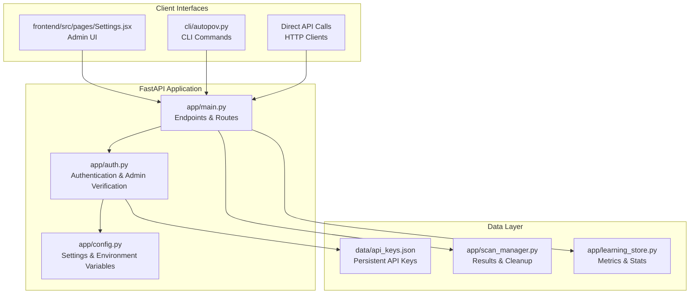
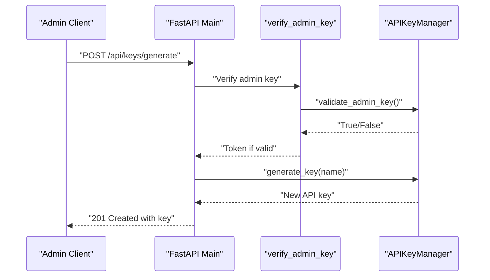
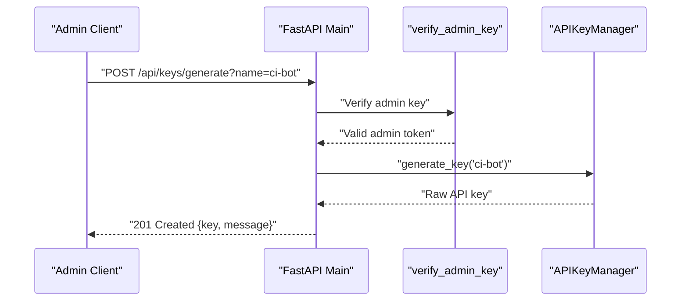
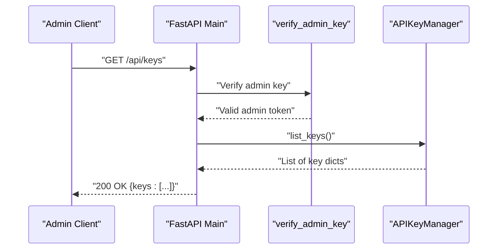
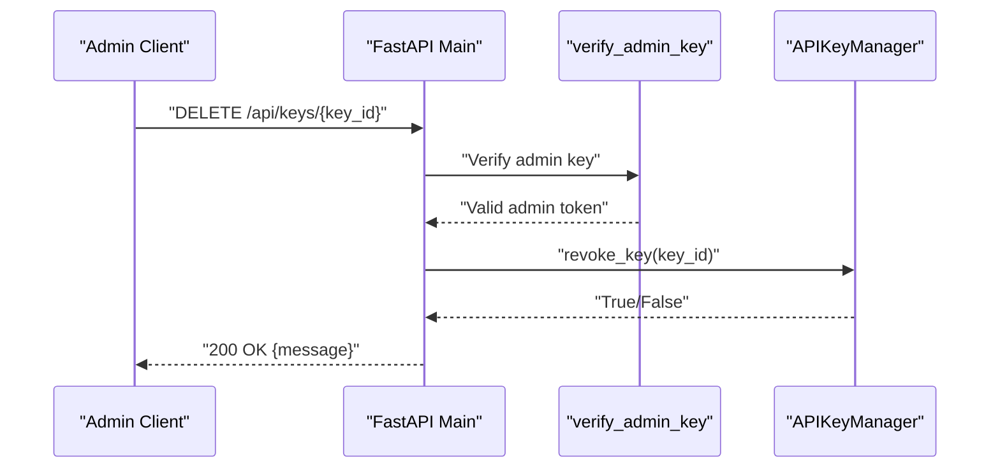
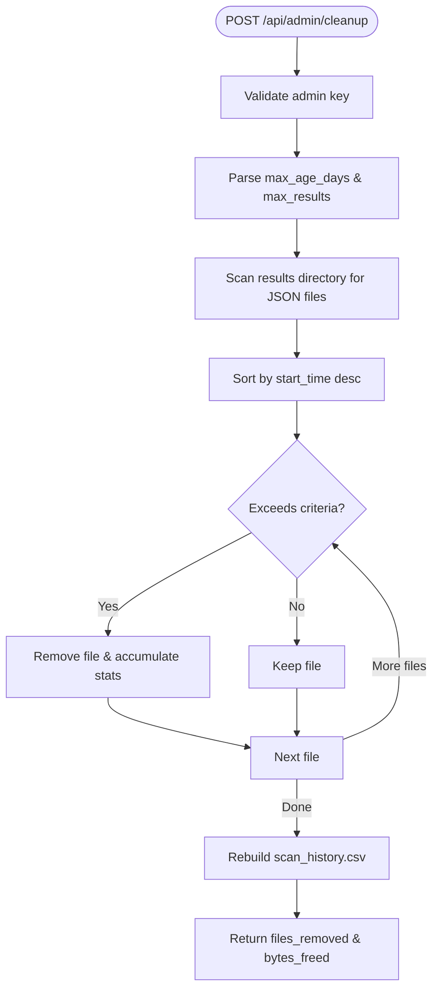
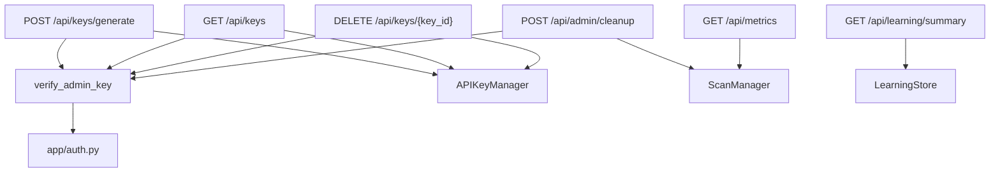

# System Administration API

<cite>
**Referenced Files in This Document**
- [app/main.py](file://app/main.py)
- [app/auth.py](file://app/auth.py)
- [app/scan_manager.py](file://app/scan_manager.py)
- [app/learning_store.py](file://app/learning_store.py)
- [app/config.py](file://app/config.py)
- [data/api_keys.json](file://data/api_keys.json)
- [frontend/src/pages/Settings.jsx](file://frontend/src/pages/Settings.jsx)
- [frontend/src/api/client.js](file://frontend/src/api/client.js)
- [cli/autopov.py](file://cli/autopov.py)
- [generate_key.py](file://generate_key.py)
- [add_api_key.py](file://add_api_key.py)
</cite>

## Table of Contents
1. [Introduction](#introduction)
2. [Project Structure](#project-structure)
3. [Core Components](#core-components)
4. [Architecture Overview](#architecture-overview)
5. [Detailed Component Analysis](#detailed-component-analysis)
6. [Dependency Analysis](#dependency-analysis)
7. [Performance Considerations](#performance-considerations)
8. [Troubleshooting Guide](#troubleshooting-guide)
9. [Conclusion](#conclusion)

## Introduction
This document provides comprehensive API documentation for AutoPoV's system administration endpoints. It covers API key management (generation, listing, revocation), system cleanup operations, learning store metrics, and system monitoring capabilities. The documentation explains admin-only access control mechanisms, security implications, and operational procedures for maintaining the system efficiently.

## Project Structure
AutoPoV exposes REST endpoints through a FastAPI application with dedicated admin-only routes for key management and system maintenance. The authentication layer enforces admin-only access using a server-side admin key configured via environment variables. Administrative operations are designed to be secure and auditable, with proper error handling and rate limiting for standard API usage.

**Diagram sources**
- [app/main.py:691-758](file://app/main.py#L691-L758)
- [app/auth.py:180-250](file://app/auth.py#L180-L250)
- [app/scan_manager.py:512-561](file://app/scan_manager.py#L512-L561)
- [app/learning_store.py:126-186](file://app/learning_store.py#L126-L186)
- [data/api_keys.json:1-42](file://data/api_keys.json#L1-L42)

**Section sources**
- [app/main.py:691-758](file://app/main.py#L691-L758)
- [app/auth.py:180-250](file://app/auth.py#L180-L250)
- [app/config.py:26-28](file://app/config.py#L26-L28)

## Core Components
- Admin-only API key management endpoints:
  - Generate API key: POST `/api/keys/generate`
  - List API keys: GET `/api/keys`
  - Revoke API key: DELETE `/api/keys/{key_id}`
- System cleanup endpoint:
  - Cleanup old results: POST `/api/admin/cleanup`
- Monitoring endpoints:
  - Learning store summary: GET `/api/learning/summary`
  - System metrics: GET `/api/metrics`

These endpoints require admin authentication via the `verify_admin_key` dependency, which validates the admin key against the server configuration.

**Section sources**
- [app/main.py:691-758](file://app/main.py#L691-L758)
- [app/auth.py:239-250](file://app/auth.py#L239-L250)

## Architecture Overview
The admin endpoints are protected by an admin-only authentication mechanism. Requests must include a valid admin key in the Authorization header. Successful authentication grants access to administrative operations, while unauthorized access is rejected with appropriate HTTP status codes.

**Diagram sources**
- [app/main.py:692-702](file://app/main.py#L692-L702)
- [app/auth.py:239-250](file://app/auth.py#L239-L250)
- [app/auth.py:180-185](file://app/auth.py#L180-L185)

**Section sources**
- [app/main.py:691-723](file://app/main.py#L691-L723)
- [app/auth.py:239-250](file://app/auth.py#L239-L250)

## Detailed Component Analysis

### API Key Management Endpoints

#### Generate API Key (`POST /api/keys/generate`)
- Purpose: Creates a new API key with an optional descriptive name.
- Authentication: Admin-only via `verify_admin_key`.
- Request:
  - Headers: `Authorization: Bearer <admin_key>`
  - Query parameters: `name` (optional, default "default")
- Response: JSON with the generated key and a success message.
- Behavior:
  - Generates a unique key identifier and a random API key value.
  - Stores the hashed key in persistent storage.
  - Returns the raw key once; subsequent requests will not reveal the key again.

**Diagram sources**
- [app/main.py:692-702](file://app/main.py#L692-L702)
- [app/auth.py:239-250](file://app/auth.py#L239-L250)
- [app/auth.py:88-105](file://app/auth.py#L88-L105)

**Section sources**
- [app/main.py:692-702](file://app/main.py#L692-L702)
- [app/auth.py:88-105](file://app/auth.py#L88-L105)

#### List API Keys (`GET /api/keys`)
- Purpose: Retrieves a list of all API keys with metadata (excluding hashes).
- Authentication: Admin-only via `verify_admin_key`.
- Response: JSON array containing key metadata (id, name, creation date, last used, active status).
- Notes: Useful for auditing and key lifecycle management.

**Diagram sources**
- [app/main.py:705-711](file://app/main.py#L705-L711)
- [app/auth.py:239-250](file://app/auth.py#L239-L250)
- [app/auth.py:166-178](file://app/auth.py#L166-L178)

**Section sources**
- [app/main.py:705-711](file://app/main.py#L705-L711)
- [app/auth.py:166-178](file://app/auth.py#L166-L178)

#### Revoke API Key (`DELETE /api/keys/{key_id}`)
- Purpose: Revokes a specific API key by setting its active status to false.
- Authentication: Admin-only via `verify_admin_key`.
- Response: Success message upon revocation.
- Behavior:
  - Marks the key inactive in persistent storage.
  - Immediate effect: requests using the revoked key will fail authentication.

**Diagram sources**
- [app/main.py:714-723](file://app/main.py#L714-L723)
- [app/auth.py:239-250](file://app/auth.py#L239-L250)
- [app/auth.py:148-155](file://app/auth.py#L148-L155)

**Section sources**
- [app/main.py:714-723](file://app/main.py#L714-L723)
- [app/auth.py:148-155](file://app/auth.py#L148-L155)

### System Cleanup Endpoint (`POST /api/admin/cleanup`)
- Purpose: Removes old scan result files to optimize storage and maintain system performance.
- Authentication: Admin-only via `verify_admin_key`.
- Request parameters:
  - `max_age_days`: Retain results newer than this age (default: 30).
  - `max_results`: Keep only the most recent N results (default: 500).
- Response: JSON indicating the number of files removed and bytes freed, plus a summary message.

Operational procedure:
- The endpoint identifies result files in the runs directory, sorts them by start time, and removes those exceeding retention criteria.
- After removal, it rebuilds the scan history CSV from remaining results.

**Diagram sources**
- [app/main.py:726-741](file://app/main.py#L726-L741)
- [app/scan_manager.py:512-561](file://app/scan_manager.py#L512-L561)
- [app/scan_manager.py:563-602](file://app/scan_manager.py#L563-L602)

**Section sources**
- [app/main.py:726-741](file://app/main.py#L726-L741)
- [app/scan_manager.py:512-561](file://app/scan_manager.py#L512-L561)

### Learning Store Summary (`GET /api/learning/summary`)
- Purpose: Provides a summary of learning store statistics and model performance metrics.
- Authentication: Standard API key required (not admin-only).
- Response: JSON containing:
  - `summary`: Totals for investigations and proof-of-vulnerability runs.
  - `models`: Aggregated performance by model for investigation and PoV stages.

Use cases:
- Monitor system learning progress.
- Evaluate model effectiveness for different stages.

**Section sources**
- [app/main.py:745-751](file://app/main.py#L745-L751)
- [app/learning_store.py:126-186](file://app/learning_store.py#L126-L186)

### Metrics Endpoint (`GET /api/metrics`)
- Purpose: Exposes system-wide metrics for monitoring and performance analysis.
- Authentication: Standard API key required (not admin-only).
- Response: JSON with aggregated metrics such as total scans, completed scans, failed scans, running scans, total findings, costs, and average durations.

Use cases:
- Dashboard integration.
- Automated alerting and capacity planning.

**Section sources**
- [app/main.py:754-757](file://app/main.py#L754-L757)
- [app/scan_manager.py:604-653](file://app/scan_manager.py#L604-L653)

## Dependency Analysis
The admin endpoints depend on the authentication layer and the API key manager for key lifecycle operations. The cleanup endpoint depends on the scan manager for result file management and CSV rebuilding. The metrics and learning store endpoints depend on their respective managers for data aggregation.

**Diagram sources**
- [app/main.py:691-758](file://app/main.py#L691-L758)
- [app/auth.py:239-250](file://app/auth.py#L239-L250)
- [app/scan_manager.py:512-561](file://app/scan_manager.py#L512-L561)
- [app/learning_store.py:126-186](file://app/learning_store.py#L126-L186)

**Section sources**
- [app/main.py:691-758](file://app/main.py#L691-L758)
- [app/auth.py:239-250](file://app/auth.py#L239-L250)
- [app/scan_manager.py:512-561](file://app/scan_manager.py#L512-L561)
- [app/learning_store.py:126-186](file://app/learning_store.py#L126-L186)

## Performance Considerations
- Admin endpoints are lightweight and primarily perform file I/O and JSON serialization. They should remain responsive under normal loads.
- The cleanup operation iterates through result files and rebuilds CSV metadata. For systems with very large histories, consider scheduling cleanup during off-peak hours.
- Metrics aggregation reads CSV files; ensure the CSV remains consistent after cleanup operations.

## Troubleshooting Guide
Common issues and resolutions:
- Unauthorized access to admin endpoints:
  - Symptom: 403 Forbidden when calling admin endpoints.
  - Cause: Missing or invalid admin key.
  - Resolution: Verify the `ADMIN_API_KEY` environment variable and include a valid Bearer token in the Authorization header.
- Key not found during revocation:
  - Symptom: 404 Not Found when deleting a key.
  - Cause: Invalid key ID or key already deleted.
  - Resolution: Use the list endpoint to confirm the key exists and is active.
- Cleanup fails silently:
  - Symptom: No files removed despite parameters suggesting otherwise.
  - Cause: Insufficient permissions or incorrect directory paths.
  - Resolution: Confirm the runs directory exists and is writable; verify cleanup parameters.

Security considerations:
- Admin keys must be stored securely and rotated regularly.
- API keys are hashed and stored persistently; avoid exposing raw keys in logs or client-side code.
- Use HTTPS in production to protect bearer tokens in transit.

**Section sources**
- [app/auth.py:243-248](file://app/auth.py#L243-L248)
- [app/main.py:717-723](file://app/main.py#L717-L723)
- [app/scan_manager.py:546-556](file://app/scan_manager.py#L546-L556)

## Conclusion
AutoPoV's system administration endpoints provide robust controls for API key lifecycle management, system cleanup, and monitoring. Admin-only access ensures sensitive operations are protected, while standard API keys enable non-admin users to access metrics and learning summaries. Proper configuration of admin keys and periodic cleanup operations help maintain system performance and security.