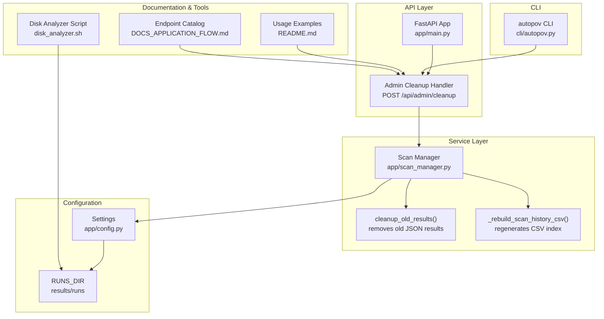
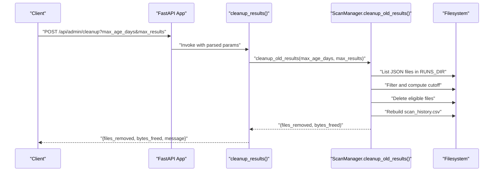
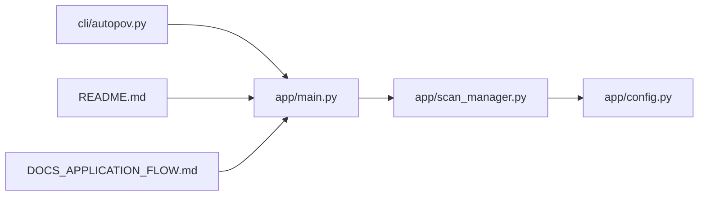
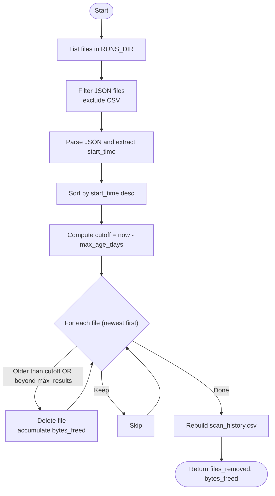

# System Cleanup & Maintenance

<cite>
**Referenced Files in This Document**
- [app/main.py](file://app/main.py)
- [app/scan_manager.py](file://app/scan_manager.py)
- [app/config.py](file://app/config.py)
- [cli/autopov.py](file://cli/autopov.py)
- [README.md](file://README.md)
- [DOCS_APPLICATION_FLOW.md](file://DOCS_APPLICATION_FLOW.md)
- [disk_analyzer.sh](file://disk_analyzer.sh)
</cite>

## Table of Contents
1. [Introduction](#introduction)
2. [Project Structure](#project-structure)
3. [Core Components](#core-components)
4. [Architecture Overview](#architecture-overview)
5. [Detailed Component Analysis](#detailed-component-analysis)
6. [Dependency Analysis](#dependency-analysis)
7. [Performance Considerations](#performance-considerations)
8. [Troubleshooting Guide](#troubleshooting-guide)
9. [Conclusion](#conclusion)
10. [Appendices](#appendices)

## Introduction
This document explains AutoPoV’s system cleanup and maintenance capabilities with a focus on the administrative cleanup endpoint and related mechanisms. It covers:
- The cleanup endpoint (/api/admin/cleanup) and its parameters
- How cleanup removes old scan result files and optimizes storage
- The cleanup_old_results method implementation, file removal criteria, and storage space calculation
- Operational guidelines for scheduled cleanup, storage monitoring, and maintenance procedures
- Example configurations for different deployment scenarios and the impact on performance and storage capacity

## Project Structure
AutoPoV organizes cleanup-related functionality around a dedicated endpoint, a scan manager service, and supporting CLI and documentation assets. The key locations are:
- Endpoint definition and handler in the FastAPI application
- Cleanup logic in the scan manager
- Configuration constants for result directories
- CLI wrapper for remote cleanup
- Documentation and scripts for operational visibility

**Diagram sources**
- [app/main.py:726-741](file://app/main.py#L726-L741)
- [app/scan_manager.py:511-561](file://app/scan_manager.py#L511-L561)
- [app/scan_manager.py:563-602](file://app/scan_manager.py#L563-L602)
- [app/config.py:136-142](file://app/config.py#L136-L142)
- [cli/autopov.py:805-841](file://cli/autopov.py#L805-L841)
- [README.md:281-283](file://README.md#L281-L283)
- [DOCS_APPLICATION_FLOW.md:224-225](file://DOCS_APPLICATION_FLOW.md#L224-L225)
- [disk_analyzer.sh:1-38](file://disk_analyzer.sh#L1-L38)

**Section sources**
- [app/main.py:726-741](file://app/main.py#L726-L741)
- [app/scan_manager.py:511-602](file://app/scan_manager.py#L511-L602)
- [app/config.py:136-142](file://app/config.py#L136-L142)
- [cli/autopov.py:805-841](file://cli/autopov.py#L805-L841)
- [README.md:281-283](file://README.md#L281-L283)
- [DOCS_APPLICATION_FLOW.md:224-225](file://DOCS_APPLICATION_FLOW.md#L224-L225)
- [disk_analyzer.sh:1-38](file://disk_analyzer.sh#L1-L38)

## Core Components
- Admin cleanup endpoint: Validates admin credentials, delegates to the scan manager, and returns a summary of removed files and freed bytes.
- Scan manager cleanup: Enumerates JSON result files, applies age and count thresholds, deletes eligible files, and rebuilds the CSV index.
- Configuration: Defines the results directory and related paths used by cleanup.
- CLI: Provides a convenience command to trigger cleanup remotely with optional parameters.
- Documentation: Includes usage examples and endpoint catalog entries.

Key responsibilities:
- Endpoint: Parameter parsing, admin key verification, response formatting
- Service: File discovery, filtering, deletion, and CSV regeneration
- Config: Directory roots for results and runs
- CLI: Remote invocation and output formatting

**Section sources**
- [app/main.py:726-741](file://app/main.py#L726-L741)
- [app/scan_manager.py:511-602](file://app/scan_manager.py#L511-L602)
- [app/config.py:136-142](file://app/config.py#L136-L142)
- [cli/autopov.py:805-841](file://cli/autopov.py#L805-L841)
- [README.md:281-283](file://README.md#L281-L283)
- [DOCS_APPLICATION_FLOW.md:224-225](file://DOCS_APPLICATION_FLOW.md#L224-L225)

## Architecture Overview
The cleanup flow is a straightforward pipeline: the endpoint receives parameters, validates admin credentials, invokes the scan manager, and returns a concise summary.

**Diagram sources**
- [app/main.py:726-741](file://app/main.py#L726-L741)
- [app/scan_manager.py:511-561](file://app/scan_manager.py#L511-L561)
- [app/scan_manager.py:563-602](file://app/scan_manager.py#L563-L602)

## Detailed Component Analysis

### Admin Cleanup Endpoint
- Path: POST /api/admin/cleanup
- Parameters:
  - max_age_days: integer (default applied by handler)
  - max_results: integer (default applied by handler)
  - admin_key: header-based admin key verification
- Behavior:
  - Verifies admin key
  - Calls scan manager cleanup
  - Returns files_removed, bytes_freed, and a human-readable message

Operational notes:
- The handler sets defaults for parameters and forwards them to the scan manager.
- Responses are JSON with numeric counts and a summary message.

**Section sources**
- [app/main.py:726-741](file://app/main.py#L726-L741)
- [DOCS_APPLICATION_FLOW.md:224-225](file://DOCS_APPLICATION_FLOW.md#L224-L225)
- [README.md:281-283](file://README.md#L281-L283)

### Scan Manager Cleanup Logic
Method: cleanup_old_results(max_age_days, max_results)
- Discovery:
  - Lists files in RUNS_DIR
  - Skips non-JSON files and the CSV index itself
- Parsing:
  - Reads each JSON file and extracts start_time
  - Falls back to minimum datetime if parsing fails
- Sorting:
  - Orders by start_time descending (newest first)
- Criteria:
  - Removes files older than max_age_days
  - Removes files beyond the newest max_results entries
- Deletion:
  - Deletes matching files and accumulates bytes_freed
  - Logs failures to remove individual files
- Index rebuild:
  - Regenerates scan_history.csv from surviving JSON files
  - Writes a header and sorted rows

Storage space calculation:
- bytes_freed is incremented by the size of each deleted file.

CSV rebuild:
- Iterates surviving JSON files, extracts fields, sorts by start_time descending, and writes a new CSV.

**Section sources**
- [app/scan_manager.py:511-561](file://app/scan_manager.py#L511-L561)
- [app/scan_manager.py:563-602](file://app/scan_manager.py#L563-L602)

### Configuration and Paths
- RUNS_DIR is defined in settings and used by the scan manager to locate result JSON files and the CSV index.
- The cleanup process operates exclusively within RUNS_DIR.

**Section sources**
- [app/config.py:136-142](file://app/config.py#L136-L142)
- [app/scan_manager.py:69](file://app/scan_manager.py#L69)

### CLI Wrapper
- Command: admin cleanup
- Options:
  - --admin-key or AUTOPOV_ADMIN_KEY
  - --max-age-days (default 30)
  - --max-results (default 500)
- Behavior:
  - Sends a POST request to /api/admin/cleanup with query parameters
  - Prints a formatted panel with files_removed, bytes_freed (converted to KB), and message

**Section sources**
- [cli/autopov.py:805-841](file://cli/autopov.py#L805-L841)

### Usage Examples
- Example cURL invocation for admin cleanup is documented in the project README.

**Section sources**
- [README.md:281-283](file://README.md#L281-L283)

## Dependency Analysis
The cleanup flow depends on:
- FastAPI route handler for parameter binding and admin key verification
- Scan manager for filesystem operations and CSV maintenance
- Settings for RUNS_DIR location
- CLI for remote invocation

**Diagram sources**
- [app/main.py:726-741](file://app/main.py#L726-L741)
- [app/scan_manager.py:511-602](file://app/scan_manager.py#L511-L602)
- [app/config.py:136-142](file://app/config.py#L136-L142)
- [cli/autopov.py:805-841](file://cli/autopov.py#L805-L841)
- [README.md:281-283](file://README.md#L281-L283)
- [DOCS_APPLICATION_FLOW.md:224-225](file://DOCS_APPLICATION_FLOW.md#L224-L225)

**Section sources**
- [app/main.py:726-741](file://app/main.py#L726-L741)
- [app/scan_manager.py:511-602](file://app/scan_manager.py#L511-L602)
- [app/config.py:136-142](file://app/config.py#L136-L142)
- [cli/autopov.py:805-841](file://cli/autopov.py#L805-L841)
- [README.md:281-283](file://README.md#L281-L283)
- [DOCS_APPLICATION_FLOW.md:224-225](file://DOCS_APPLICATION_FLOW.md#L224-L225)

## Performance Considerations
- Time complexity:
  - File enumeration: O(n) where n is the number of files in RUNS_DIR
  - JSON parsing and sorting: O(n log n)
  - Deletion: O(n) with per-file size accounting
- Space complexity:
  - Linear with the number of JSON files processed
- Impact on system performance:
  - Cleanup runs synchronously; keep max_results moderate to avoid long-running operations
  - Frequent deletions can cause I/O spikes; schedule during low-activity windows
- Storage optimization:
  - Regular cleanup prevents unbounded growth of results/runs
  - CSV rebuild ensures metadata remains consistent after deletions

[No sources needed since this section provides general guidance]

## Troubleshooting Guide
Common issues and resolutions:
- Permission denied when deleting files:
  - Verify the process has write permissions to RUNS_DIR
  - Ensure the file is not locked by another process
- Malformed JSON:
  - The scan manager falls back to minimum datetime; malformed files are skipped
- Missing CSV:
  - The CSV is rebuilt from surviving JSON files; missing entries indicate prior deletion or corruption
- Admin key invalid:
  - Confirm the admin key matches the server configuration and use the correct bearer token format

Operational checks:
- Use the disk analyzer script to inspect directory sizes and Docker-related caches
- Monitor the endpoint response for files_removed and bytes_freed to confirm effectiveness

**Section sources**
- [app/scan_manager.py:530-537](file://app/scan_manager.py#L530-L537)
- [app/scan_manager.py:548-556](file://app/scan_manager.py#L548-L556)
- [disk_analyzer.sh:1-38](file://disk_analyzer.sh#L1-L38)

## Conclusion
AutoPoV’s cleanup mechanism provides a robust, configurable way to manage storage by removing old scan result files and maintaining a consistent CSV index. The admin endpoint offers a simple interface for operators, while the scan manager encapsulates the logic for discovery, filtering, deletion, and index regeneration. Combined with CLI support and monitoring tools, this system helps maintain predictable storage usage and system performance.

[No sources needed since this section summarizes without analyzing specific files]

## Appendices

### Cleanup Endpoint Definition
- Method: POST
- Path: /api/admin/cleanup
- Query parameters:
  - max_age_days: integer (default applied by handler)
  - max_results: integer (default applied by handler)
- Required authentication: Admin key
- Response fields:
  - files_removed: integer
  - bytes_freed: integer
  - message: string

**Section sources**
- [DOCS_APPLICATION_FLOW.md:224-225](file://DOCS_APPLICATION_FLOW.md#L224-L225)
- [app/main.py:726-741](file://app/main.py#L726-L741)

### Cleanup Process Flowchart

**Diagram sources**
- [app/scan_manager.py:511-561](file://app/scan_manager.py#L511-L561)
- [app/scan_manager.py:563-602](file://app/scan_manager.py#L563-L602)

### Example Configurations and Scenarios
- Development environment:
  - Lower max_age_days (e.g., 7) and smaller max_results (e.g., 50) to keep local storage small
- CI/CD pipeline:
  - Schedule cleanup nightly with moderate retention (e.g., max_age_days=30) and higher max_results (e.g., 500) to preserve recent runs
- Production systems:
  - Use longer retention (e.g., max_age_days=90) and larger max_results (e.g., 1000) with periodic manual checks

[No sources needed since this section provides general guidance]