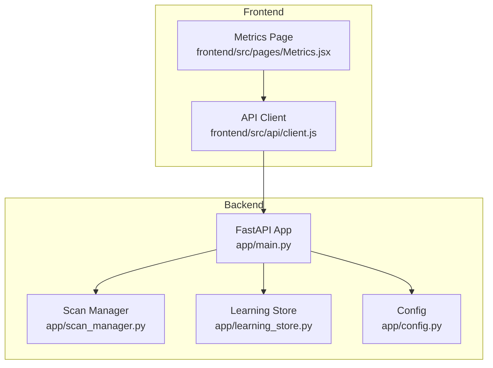
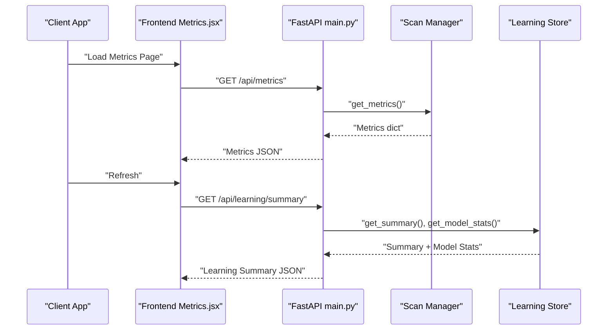
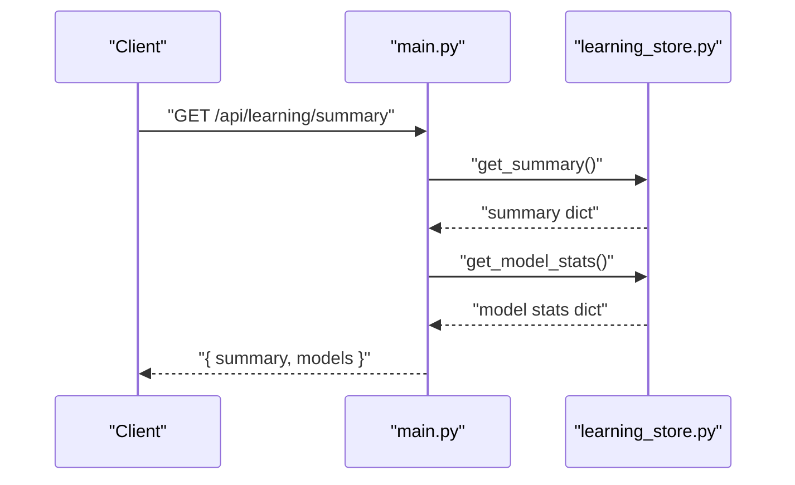
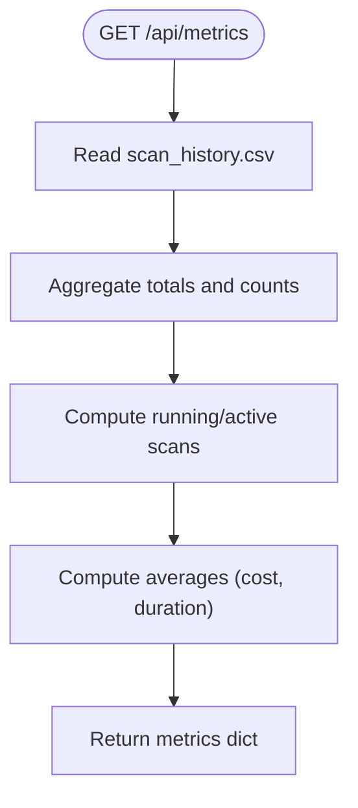
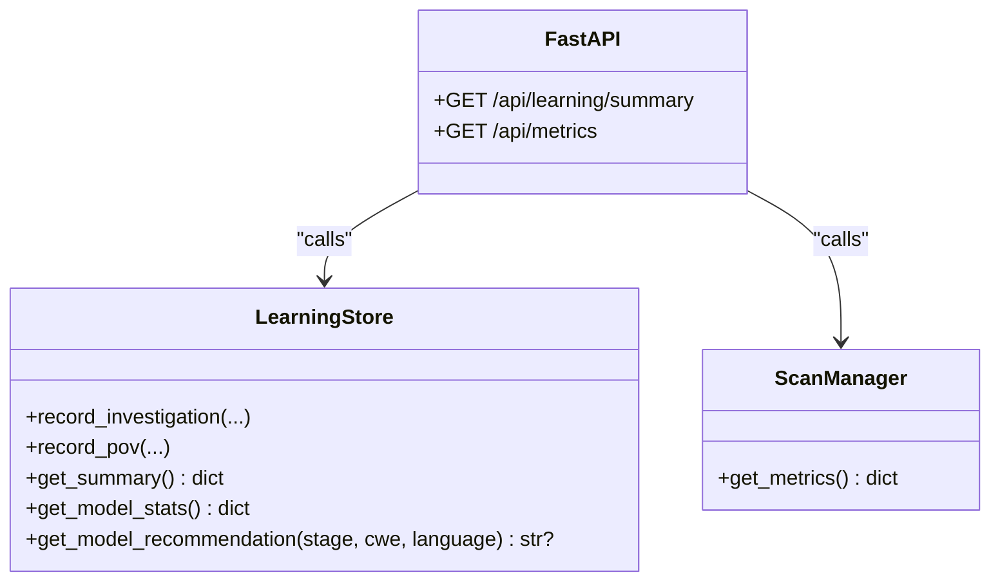
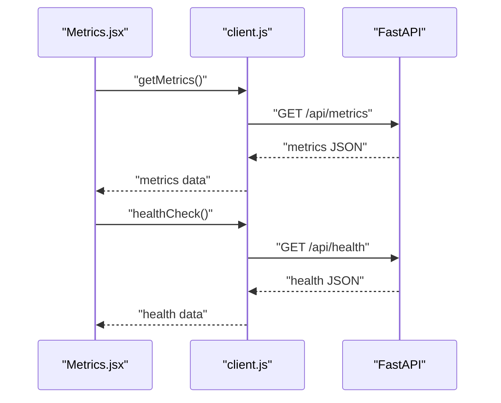
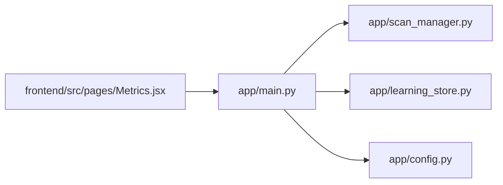

# System Monitoring & Analytics

<cite>
**Referenced Files in This Document**
- [app/main.py](file://app/main.py)
- [app/learning_store.py](file://app/learning_store.py)
- [app/scan_manager.py](file://app/scan_manager.py)
- [app/config.py](file://app/config.py)
- [frontend/src/pages/Metrics.jsx](file://frontend/src/pages/Metrics.jsx)
- [frontend/src/api/client.js](file://frontend/src/api/client.js)
- [README.md](file://README.md)
</cite>

## Table of Contents
1. [Introduction](#introduction)
2. [Project Structure](#project-structure)
3. [Core Components](#core-components)
4. [Architecture Overview](#architecture-overview)
5. [Detailed Component Analysis](#detailed-component-analysis)
6. [Dependency Analysis](#dependency-analysis)
7. [Performance Considerations](#performance-considerations)
8. [Troubleshooting Guide](#troubleshooting-guide)
9. [Conclusion](#conclusion)
10. [Appendices](#appendices)

## Introduction
This document explains AutoPoV’s system monitoring and analytics endpoints, focusing on:
- Learning store summary endpoint: /api/learning/summary for adaptive model performance insights.
- Metrics endpoint: /api/metrics for system-wide performance indicators, scan statistics, and operational data.
It also documents the learning store interface used to track agent performance, model effectiveness, and system optimization data, and provides practical examples for monitoring system health, analyzing scan performance trends, and using metrics for capacity planning. Guidance is included for integrating monitoring data into external systems.

## Project Structure
AutoPoV exposes monitoring endpoints via a FastAPI application. The backend collects metrics from scan history and the learning store, while the frontend consumes these endpoints to render dashboards and health indicators.

**Diagram sources**
- [app/main.py:745-758](file://app/main.py#L745-L758)
- [app/scan_manager.py:604-653](file://app/scan_manager.py#L604-L653)
- [app/learning_store.py:126-186](file://app/learning_store.py#L126-L186)
- [app/config.py:162-198](file://app/config.py#L162-L198)
- [frontend/src/pages/Metrics.jsx:28-51](file://frontend/src/pages/Metrics.jsx#L28-L51)
- [frontend/src/api/client.js:57-78](file://frontend/src/api/client.js#L57-L78)

**Section sources**
- [app/main.py:745-758](file://app/main.py#L745-L758)
- [app/scan_manager.py:604-653](file://app/scan_manager.py#L604-L653)
- [app/learning_store.py:126-186](file://app/learning_store.py#L126-L186)
- [frontend/src/pages/Metrics.jsx:28-51](file://frontend/src/pages/Metrics.jsx#L28-L51)
- [frontend/src/api/client.js:57-78](file://frontend/src/api/client.js#L57-L78)

## Core Components
- Learning Store: SQLite-backed persistence for agent outcomes, enabling model performance aggregation and recommendations.
- Scan Manager: Centralized orchestration that persists scan results to CSV and computes system metrics from historical data.
- FastAPI Endpoints: Expose /api/learning/summary and /api/metrics with authentication and rate limits.
- Frontend Metrics Page: Consumes /api/metrics and /api/health to render system health and operational statistics.

Key responsibilities:
- Learning Store: Summarize investigations and PoV runs, compute model stats, and recommend models based on historical performance.
- Scan Manager: Aggregate totals, counts, and averages from scan_history.csv for metrics.
- API Layer: Enforce authentication and expose endpoints for analytics consumption.

**Section sources**
- [app/learning_store.py:14-256](file://app/learning_store.py#L14-L256)
- [app/scan_manager.py:47-663](file://app/scan_manager.py#L47-L663)
- [app/main.py:745-758](file://app/main.py#L745-L758)
- [frontend/src/pages/Metrics.jsx:28-51](file://frontend/src/pages/Metrics.jsx#L28-L51)

## Architecture Overview
The monitoring architecture integrates data collection, persistence, and presentation:

**Diagram sources**
- [app/main.py:745-758](file://app/main.py#L745-L758)
- [app/scan_manager.py:604-653](file://app/scan_manager.py#L604-L653)
- [app/learning_store.py:126-186](file://app/learning_store.py#L126-L186)
- [frontend/src/pages/Metrics.jsx:28-51](file://frontend/src/pages/Metrics.jsx#L28-L51)

## Detailed Component Analysis

### Learning Store Summary Endpoint
- Endpoint: GET /api/learning/summary
- Purpose: Provide adaptive model performance data for routing decisions.
- Implementation:
  - Calls store.get_summary() for aggregated counts and costs across investigations and PoV runs.
  - Calls store.get_model_stats() for per-model performance (confirmed counts, average confidence, cost, and derived rates).
- Returned structure:
  - summary: total investigations, total investigation cost, total PoV runs, total PoV cost, PoV successes.
  - models.investigate: per model total, confirmed, average confidence, cost, confirm_rate.
  - models.pov: per model total, confirmed, cost, success_rate.

**Diagram sources**
- [app/main.py:745-751](file://app/main.py#L745-L751)
- [app/learning_store.py:126-186](file://app/learning_store.py#L126-L186)

**Section sources**
- [app/main.py:745-751](file://app/main.py#L745-L751)
- [app/learning_store.py:126-186](file://app/learning_store.py#L126-L186)

### Metrics Endpoint
- Endpoint: GET /api/metrics
- Purpose: Retrieve system performance indicators, scan statistics, and operational data.
- Implementation:
  - Reads scan_history.csv and aggregates totals, counts, and averages.
  - Computes running/active scan counts from in-memory state.
- Returned structure:
  - Counts: total_scans, completed_scans, failed_scans, running_scans, active_scans.
  - Findings: total_findings, confirmed_vulns, false_positives.
  - Costs: total_cost_usd, avg_cost_usd.
  - Durations: avg_duration_s.

**Diagram sources**
- [app/scan_manager.py:604-653](file://app/scan_manager.py#L604-L653)

**Section sources**
- [app/main.py:754-757](file://app/main.py#L754-L757)
- [app/scan_manager.py:604-653](file://app/scan_manager.py#L604-L653)

### Learning Store Interface
- Persistence: SQLite tables for investigations and pov_runs.
- Methods:
  - record_investigation(): logs model, CWE, language, source, verdict, confidence, cost.
  - record_pov(): logs model, CWE, success, validation method, cost.
  - get_summary(): total counts and costs across both tables.
  - get_model_stats(): per-model aggregates for investigate and pov stages.
  - get_model_recommendation(stage, cwe, language): recommends best-performing model by confirmed-per-cost.

**Diagram sources**
- [app/learning_store.py:14-256](file://app/learning_store.py#L14-L256)
- [app/scan_manager.py:47-663](file://app/scan_manager.py#L47-L663)
- [app/main.py:745-758](file://app/main.py#L745-L758)

**Section sources**
- [app/learning_store.py:14-256](file://app/learning_store.py#L14-L256)
- [app/scan_manager.py:47-663](file://app/scan_manager.py#L47-L663)
- [app/main.py:745-758](file://app/main.py#L745-L758)

### Frontend Integration
- The Metrics page fetches:
  - /api/metrics for scan activity, findings, cost, and performance.
  - /api/health for agent server health and tool availability.
- The API client injects Authorization headers and supports SSE for logs elsewhere; metrics are plain JSON.

**Diagram sources**
- [frontend/src/pages/Metrics.jsx:28-51](file://frontend/src/pages/Metrics.jsx#L28-L51)
- [frontend/src/api/client.js:28-57](file://frontend/src/api/client.js#L28-L57)

**Section sources**
- [frontend/src/pages/Metrics.jsx:28-51](file://frontend/src/pages/Metrics.jsx#L28-L51)
- [frontend/src/api/client.js:28-57](file://frontend/src/api/client.js#L28-L57)

## Dependency Analysis
- API depends on Scan Manager for metrics and on Learning Store for learning summaries.
- Frontend depends on API for metrics and health.
- Config provides runtime tool availability checks used by health.

**Diagram sources**
- [app/main.py:745-758](file://app/main.py#L745-L758)
- [app/scan_manager.py:604-653](file://app/scan_manager.py#L604-L653)
- [app/learning_store.py:126-186](file://app/learning_store.py#L126-L186)
- [app/config.py:162-198](file://app/config.py#L162-L198)
- [frontend/src/pages/Metrics.jsx:28-51](file://frontend/src/pages/Metrics.jsx#L28-L51)

**Section sources**
- [app/main.py:745-758](file://app/main.py#L745-L758)
- [app/scan_manager.py:604-653](file://app/scan_manager.py#L604-L653)
- [app/learning_store.py:126-186](file://app/learning_store.py#L126-L186)
- [app/config.py:162-198](file://app/config.py#L162-L198)
- [frontend/src/pages/Metrics.jsx:28-51](file://frontend/src/pages/Metrics.jsx#L28-L51)

## Performance Considerations
- Metrics computation reads scan_history.csv and iterates rows; keep CSV compact and avoid excessive churn.
- Recommendations rely on SQL grouping; ensure indexes are not required (SQLite) but maintain reasonable table sizes.
- Frontend polling frequency should be tuned to reduce load; current page refreshes on demand.

## Troubleshooting Guide
- If /api/metrics returns empty or missing fields:
  - Verify scan_history.csv exists and contains recent entries.
  - Confirm scans complete successfully to populate CSV.
- If /api/learning/summary is empty:
  - Ensure agents have executed and recorded outcomes to learning.db.
- If health checks fail:
  - Confirm Docker, CodeQL, and Joern binaries are available as per config checks.

**Section sources**
- [app/scan_manager.py:616-636](file://app/scan_manager.py#L616-L636)
- [app/learning_store.py:126-186](file://app/learning_store.py#L126-L186)
- [app/config.py:162-198](file://app/config.py#L162-L198)

## Conclusion
AutoPoV’s monitoring endpoints provide actionable insights into system performance and adaptive model effectiveness. The learning store summary enables data-driven routing decisions, while the metrics endpoint offers a comprehensive view of scan activity, findings, and costs. Integrating these endpoints into external monitoring stacks allows teams to track trends, plan capacity, and optimize agent performance over time.

## Appendices

### Endpoint Specifications
- GET /api/learning/summary
  - Response: { summary: {...}, models: { investigate: [...], pov: [...] } }
  - Fields include totals, costs, and derived rates per model.
- GET /api/metrics
  - Response: { total_scans, completed_scans, failed_scans, running_scans, active_scans, total_findings, confirmed_vulns, false_positives, total_cost_usd, avg_cost_usd, avg_duration_s, ... }

**Section sources**
- [app/main.py:745-758](file://app/main.py#L745-L758)
- [app/scan_manager.py:604-653](file://app/scan_manager.py#L604-L653)
- [app/learning_store.py:126-186](file://app/learning_store.py#L126-L186)

### Practical Examples
- Monitoring system health:
  - Use /api/health to verify tool availability and agent server status.
- Analyzing scan performance trends:
  - Track avg_duration_s and avg_cost_usd over time to detect regressions or improvements.
- Capacity planning:
  - Monitor running_scans and completed_scans to size infrastructure accordingly.
- Using metrics for model selection:
  - Combine /api/metrics with /api/learning/summary to correlate throughput, cost, and success rates.

**Section sources**
- [frontend/src/pages/Metrics.jsx:87-191](file://frontend/src/pages/Metrics.jsx#L87-L191)
- [README.md:345-374](file://README.md#L345-L374)