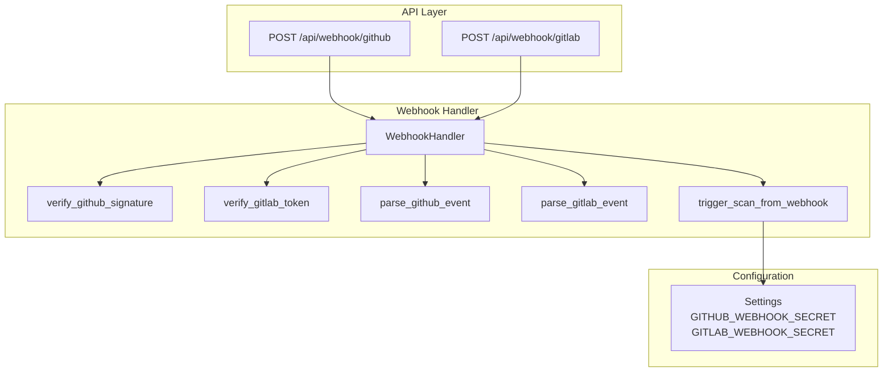
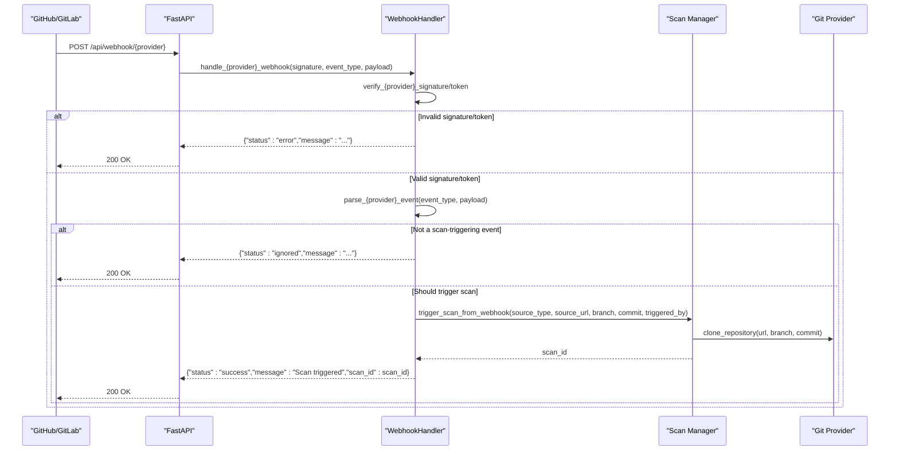
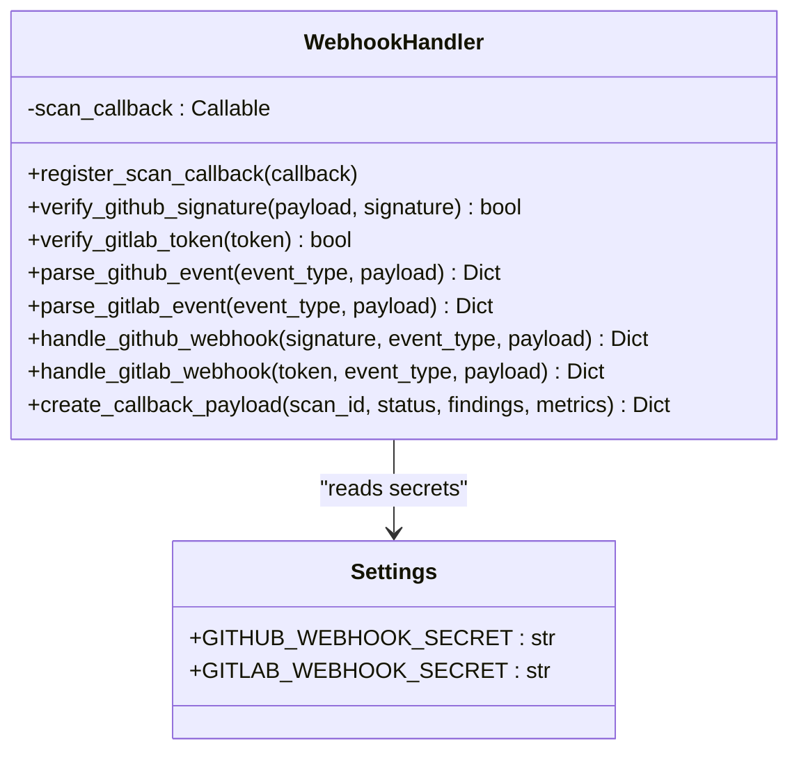
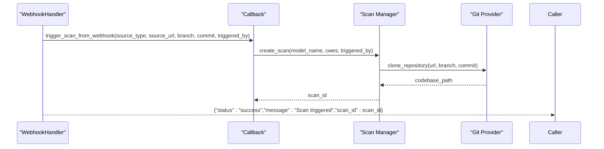
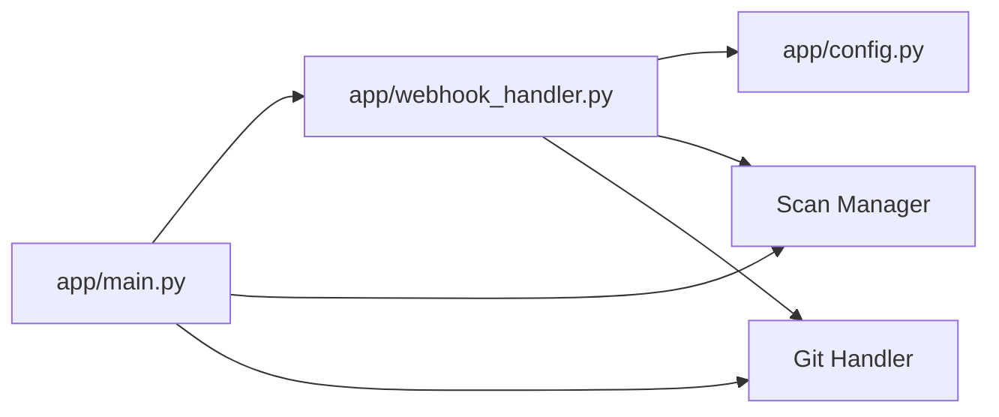

# Webhook Integration API

<cite>
**Referenced Files in This Document**
- [app/webhook_handler.py](file://app/webhook_handler.py)
- [app/main.py](file://app/main.py)
- [app/config.py](file://app/config.py)
- [frontend/src/components/WebhookSetup.jsx](file://frontend/src/components/WebhookSetup.jsx)
- [cli/autopov.py](file://cli/autopov.py)
- [tests/test_webhook_handler.py](file://tests/test_webhook_handler.py)
- [tests/test_api.py](file://tests/test_api.py)
</cite>

## Table of Contents
1. [Introduction](#introduction)
2. [Project Structure](#project-structure)
3. [Core Components](#core-components)
4. [Architecture Overview](#architecture-overview)
5. [Detailed Component Analysis](#detailed-component-analysis)
6. [Dependency Analysis](#dependency-analysis)
7. [Performance Considerations](#performance-considerations)
8. [Troubleshooting Guide](#troubleshooting-guide)
9. [Conclusion](#conclusion)
10. [Appendices](#appendices)

## Introduction
This document provides comprehensive API documentation for AutoPoV's webhook integration endpoints. It covers the GitHub and GitLab webhook endpoints, including signature verification, event payload handling, and automated scan triggering. It also details webhook security mechanisms, supported events, payload parsing, error handling, and practical integration guidance for CI/CD pipelines.

## Project Structure
The webhook integration spans several modules:
- API endpoints: GitHub and GitLab webhook handlers exposed via FastAPI routes
- Webhook handler: Centralized logic for signature verification, payload parsing, and scan triggering
- Configuration: Environment variables for webhook secrets and provider tokens
- Frontend and CLI: Provide webhook setup guidance and endpoint discovery

**Diagram sources**
- [app/main.py:646-688](file://app/main.py#L646-L688)
- [app/webhook_handler.py:15-363](file://app/webhook_handler.py#L15-L363)
- [app/config.py:69-72](file://app/config.py#L69-L72)

**Section sources**
- [app/main.py:646-688](file://app/main.py#L646-L688)
- [app/webhook_handler.py:15-363](file://app/webhook_handler.py#L15-L363)
- [app/config.py:69-72](file://app/config.py#L69-L72)

## Core Components
- WebhookHandler: Encapsulates signature verification, event parsing, and scan triggering logic
- FastAPI endpoints: Expose /api/webhook/github and /api/webhook/gitlab
- Configuration: Environment variables for webhook secrets and provider tokens
- Callback registration: Registers a callback to trigger scans from webhook events

Key responsibilities:
- Signature verification for GitHub (HMAC SHA-256) and GitLab (shared token)
- Payload parsing for push and pull/merge request events
- Conditional triggering of scans based on event type and payload validity
- Response formatting with standardized status messages

**Section sources**
- [app/webhook_handler.py:15-363](file://app/webhook_handler.py#L15-L363)
- [app/main.py:646-688](file://app/main.py#L646-L688)
- [app/config.py:69-72](file://app/config.py#L69-L72)

## Architecture Overview
The webhook flow integrates with the broader AutoPoV architecture as follows:

**Diagram sources**
- [app/main.py:646-688](file://app/main.py#L646-L688)
- [app/webhook_handler.py:196-336](file://app/webhook_handler.py#L196-L336)
- [app/main.py:134-172](file://app/main.py#L134-L172)

## Detailed Component Analysis

### WebhookHandler Class
The WebhookHandler centralizes all webhook-related logic:
- Signature verification for GitHub using HMAC SHA-256 with a configurable secret
- Token verification for GitLab using a shared token
- Event parsing for GitHub (push, pull_request) and GitLab (push, merge_request)
- Conditional scan triggering based on event validity and payload content
- Standardized response formatting

**Diagram sources**
- [app/webhook_handler.py:15-363](file://app/webhook_handler.py#L15-L363)
- [app/config.py:69-72](file://app/config.py#L69-L72)

**Section sources**
- [app/webhook_handler.py:15-363](file://app/webhook_handler.py#L15-L363)
- [app/config.py:69-72](file://app/config.py#L69-L72)

### GitHub Webhook Endpoint
- Endpoint: POST /api/webhook/github
- Required headers:
  - X-Hub-Signature-256: GitHub webhook signature (sha256=...)
  - X-GitHub-Event: Event type (e.g., push, pull_request)
- Supported events:
  - push: Triggers scan when commit hash is present and not zero
  - pull_request: Triggers scan for opened, synchronize, or reopened actions
- Response fields:
  - status: success | ignored | error
  - message: human-readable status description
  - scan_id: present when a scan is triggered

Security:
- Signature verification uses HMAC SHA-256 against the raw request body
- Secret is configured via GITHUB_WEBHOOK_SECRET environment variable

**Section sources**
- [app/main.py:646-666](file://app/main.py#L646-L666)
- [app/webhook_handler.py:25-55](file://app/webhook_handler.py#L25-L55)
- [app/webhook_handler.py:75-132](file://app/webhook_handler.py#L75-L132)

### GitLab Webhook Endpoint
- Endpoint: POST /api/webhook/gitlab
- Required headers:
  - X-Gitlab-Token: Shared secret token
  - X-Gitlab-Event: Event type (e.g., Push Hook, Merge Request Hook)
- Supported events:
  - push: Triggers scan when commit hash is present and not zero
  - merge_request: Triggers scan for open, update, or reopen actions
- Response fields:
  - status: success | ignored | error
  - message: human-readable status description
  - scan_id: present when a scan is triggered

Security:
- Token verification uses constant-time comparison against GITLAB_WEBHOOK_SECRET
- Uses object_kind for GitLab event identification

**Section sources**
- [app/main.py:669-688](file://app/main.py#L669-L688)
- [app/webhook_handler.py:57-73](file://app/webhook_handler.py#L57-L73)
- [app/webhook_handler.py:134-194](file://app/webhook_handler.py#L134-L194)

### Signature Verification Mechanisms
- GitHub:
  - Validates presence of X-Hub-Signature-256 header
  - Requires "sha256=" prefix
  - Computes HMAC SHA-256 over raw request body using GITHUB_WEBHOOK_SECRET
  - Uses constant-time comparison to prevent timing attacks
- GitLab:
  - Validates presence of X-Gitlab-Token header
  - Compares token against GITLAB_WEBHOOK_SECRET using constant-time comparison

**Section sources**
- [app/webhook_handler.py:25-55](file://app/webhook_handler.py#L25-L55)
- [app/webhook_handler.py:57-73](file://app/webhook_handler.py#L57-L73)
- [app/config.py:69-72](file://app/config.py#L69-L72)

### Event Payload Handling and Parsing
- GitHub:
  - push: Extracts repository URL, full name, branch, commit, and pusher
  - pull_request: Extracts PR number, title, branch, commit, author, and filters actions
- GitLab:
  - push: Extracts project URL, namespace, branch, commit, and pusher
  - merge_request: Extracts MR number, title, branch, last commit, author, and filters actions

Conditional triggering:
- Scans are triggered when commit hash is non-empty and not the zero hash
- Non-triggering events return "ignored" status with explanatory message

**Section sources**
- [app/webhook_handler.py:75-132](file://app/webhook_handler.py#L75-L132)
- [app/webhook_handler.py:134-194](file://app/webhook_handler.py#L134-L194)

### Automated Scan Triggering
- When a scan is triggered, the handler invokes a registered callback
- The callback creates a scan via the scan manager and asynchronously clones the repository
- The scan proceeds independently of the webhook response

**Diagram sources**
- [app/webhook_handler.py:244-265](file://app/webhook_handler.py#L244-L265)
- [app/main.py:134-172](file://app/main.py#L134-L172)

**Section sources**
- [app/webhook_handler.py:244-265](file://app/webhook_handler.py#L244-L265)
- [app/main.py:134-172](file://app/main.py#L134-L172)

### Webhook Security and Error Handling
- Unauthorized requests:
  - Invalid GitHub signature returns {"status":"error","message":"Invalid signature"}
  - Invalid GitLab token returns {"status":"error","message":"Invalid token"}
  - Missing signature/token returns {"status":"error","message":"Invalid JSON payload"} or similar
- Malformed payloads:
  - JSON decode errors return {"status":"error","message":"Invalid JSON payload"}
- Unsupported events:
  - Events not configured to trigger scans return {"status":"ignored","message":"Event type '...' does not trigger scans"}

**Section sources**
- [app/webhook_handler.py:213-265](file://app/webhook_handler.py#L213-L265)
- [app/webhook_handler.py:284-336](file://app/webhook_handler.py#L284-L336)
- [tests/test_api.py:46-59](file://tests/test_api.py#L46-L59)

### Webhook Callback Registration System
- During application startup, a callback is registered to trigger scans from webhook events
- The callback delegates to trigger_scan_from_webhook, which:
  - Creates a scan record
  - Clones the repository asynchronously
  - Runs the scan in the background

**Section sources**
- [app/main.py:94-111](file://app/main.py#L94-L111)
- [app/main.py:101-105](file://app/main.py#L101-L105)
- [app/main.py:134-172](file://app/main.py#L134-L172)

## Dependency Analysis
The webhook integration depends on:
- FastAPI routing for endpoint exposure
- Configuration settings for webhook secrets
- Git provider handlers for repository cloning
- Scan manager for initiating vulnerability scans

**Diagram sources**
- [app/main.py:19-27](file://app/main.py#L19-L27)
- [app/webhook_handler.py:12](file://app/webhook_handler.py#L12)
- [app/config.py:13-255](file://app/config.py#L13-L255)

**Section sources**
- [app/main.py:19-27](file://app/main.py#L19-L27)
- [app/webhook_handler.py:12](file://app/webhook_handler.py#L12)
- [app/config.py:13-255](file://app/config.py#L13-L255)

## Performance Considerations
- Asynchronous background processing: Scans are started asynchronously to avoid blocking webhook responses
- Constant-time comparisons: Prevent timing attacks during signature verification
- Minimal payload parsing: Only essential fields are extracted to reduce processing overhead
- Early exits: Non-triggering events are handled quickly to minimize resource usage

## Troubleshooting Guide
Common issues and resolutions:
- Invalid signature/token:
  - Ensure GITHUB_WEBHOOK_SECRET or GITLAB_WEBHOOK_SECRET is set correctly
  - Verify provider-side webhook configuration matches expected headers
- Invalid JSON payload:
  - Confirm the provider sends valid JSON payloads
  - Check for encoding issues or truncated requests
- Unsupported events:
  - Only push and pull_request (GitHub) or push and merge_request (GitLab) trigger scans
  - Filtered actions (e.g., ping, closed PR) will be ignored
- No scan triggered:
  - Verify commit hash is present and not zero
  - Ensure repository is accessible and credentials are configured

Testing and debugging techniques:
- Use the CLI to display webhook endpoints and verify configuration
- Monitor scan status via the /api/scan/{scan_id} endpoint
- Inspect logs via streaming endpoint /api/scan/{scan_id}/stream
- Review webhook setup guidance in the frontend component

**Section sources**
- [cli/autopov.py:850-882](file://cli/autopov.py#L850-L882)
- [app/main.py:548-583](file://app/main.py#L548-L583)
- [frontend/src/components/WebhookSetup.jsx:78-83](file://frontend/src/components/WebhookSetup.jsx#L78-L83)

## Conclusion
AutoPoV's webhook integration provides secure, event-driven vulnerability scanning for GitHub and GitLab repositories. The implementation emphasizes robust security through signature verification, careful payload parsing, and asynchronous scan execution. With clear configuration options and comprehensive error handling, the system enables seamless integration into CI/CD pipelines for continuous security monitoring.

## Appendices

### Practical Examples

#### GitHub Webhook Configuration
- Payload URL: https://your-host/api/webhook/github
- Secret header: X-Hub-Signature-256
- Events: push, pull_request
- Secret setup: Set GITHUB_WEBHOOK_SECRET environment variable

#### GitLab Webhook Configuration
- Payload URL: https://your-host/api/webhook/gitlab
- Secret header: X-Gitlab-Token
- Events: Push Hook, Merge Request Hook
- Secret setup: Set GITLAB_WEBHOOK_SECRET environment variable

#### Example Payload Structures
- GitHub push:
  - ref: refs/heads/main
  - after: commit-hash
  - repository.clone_url: repository URL
  - pusher.name: committer name
- GitHub pull_request:
  - action: opened|synchronize|reopened
  - pull_request.head.ref: branch
  - pull_request.head.sha: commit
  - repository.clone_url: repository URL
- GitLab push:
  - object_kind: push
  - ref: refs/heads/main
  - after: commit-hash
  - project.git_http_url: repository URL
  - user_name: committer
- GitLab merge_request:
  - object_kind: merge_request
  - object_attributes.action: open|update|reopen
  - object_attributes.source_branch: branch
  - object_attributes.last_commit.id: commit
  - project.git_http_url: repository URL

**Section sources**
- [frontend/src/components/WebhookSetup.jsx:8-21](file://frontend/src/components/WebhookSetup.jsx#L8-L21)
- [app/webhook_handler.py:75-132](file://app/webhook_handler.py#L75-L132)
- [app/webhook_handler.py:134-194](file://app/webhook_handler.py#L134-L194)