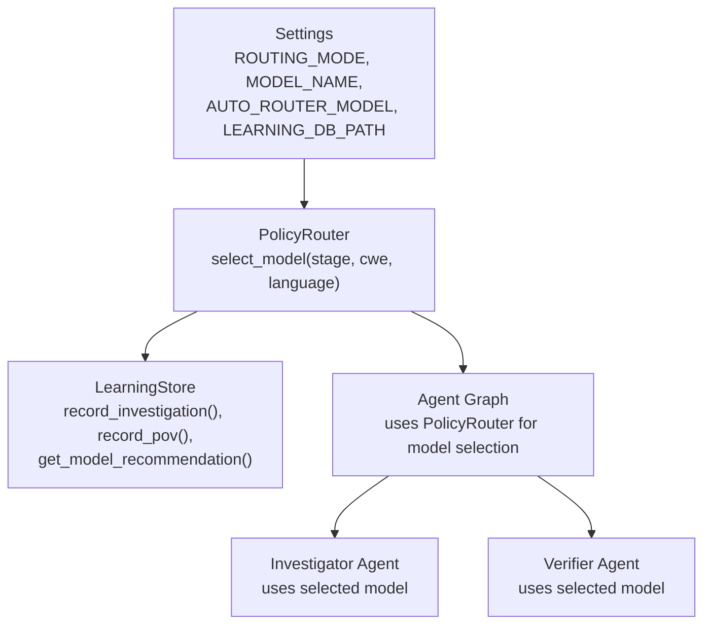
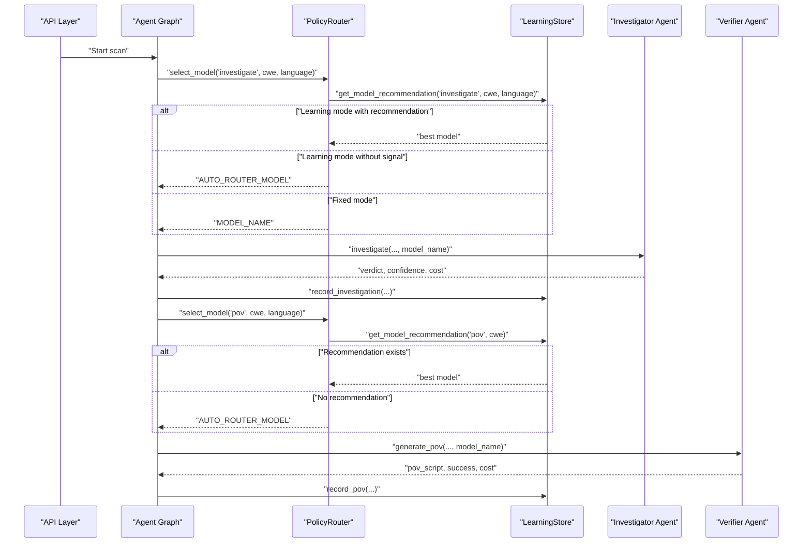
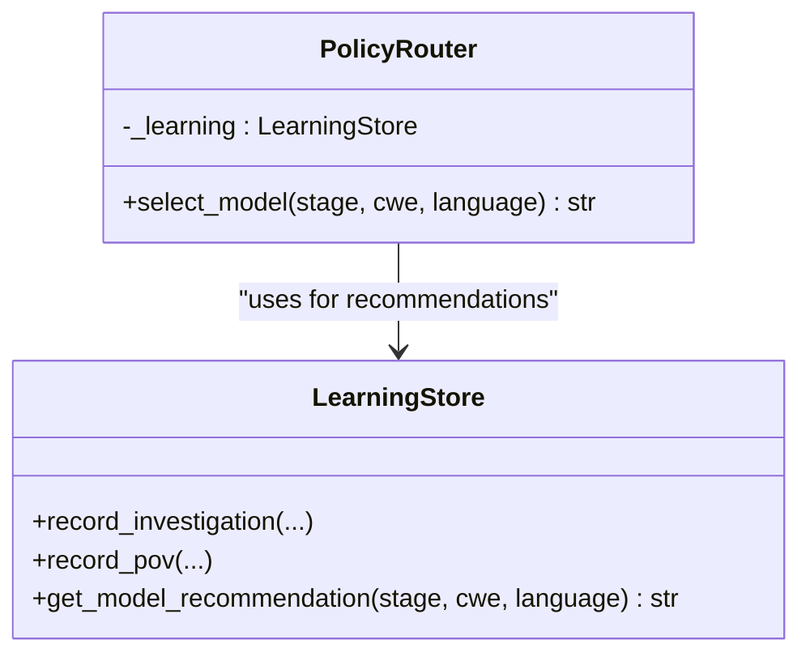
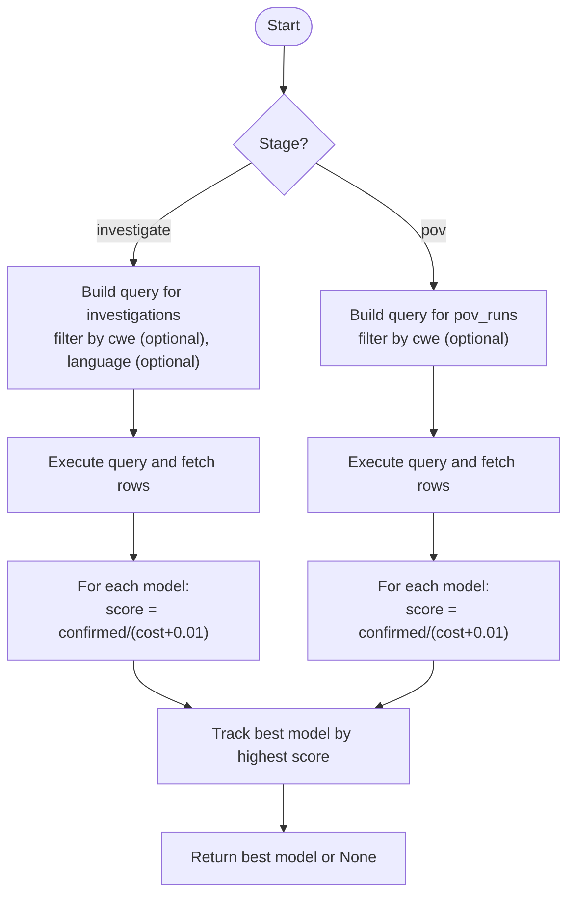
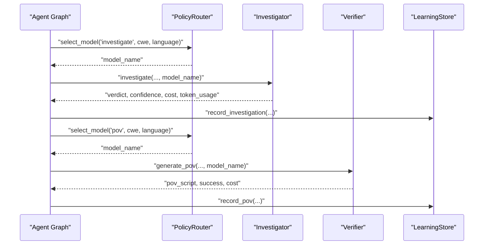
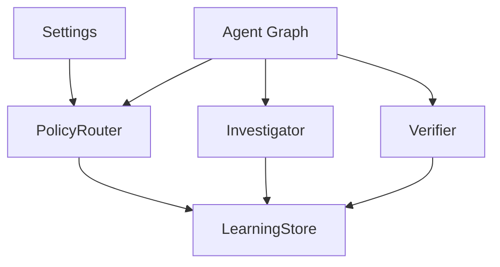

# Adaptive Model Routing

<cite>
**Referenced Files in This Document**
- [policy.py](file://app/policy.py)
- [learning_store.py](file://app/learning_store.py)
- [config.py](file://app/config.py)
- [agent_graph.py](file://app/agent_graph.py)
- [investigator.py](file://agents/investigator.py)
- [verifier.py](file://agents/verifier.py)
- [main.py](file://app/main.py)
- [DOCS_APPLICATION_FLOW.md](file://DOCS_APPLICATION_FLOW.md)
- [README.md](file://README.md)
</cite>

## Table of Contents
1. [Introduction](#introduction)
2. [Project Structure](#project-structure)
3. [Core Components](#core-components)
4. [Architecture Overview](#architecture-overview)
5. [Detailed Component Analysis](#detailed-component-analysis)
6. [Dependency Analysis](#dependency-analysis)
7. [Performance Considerations](#performance-considerations)
8. [Troubleshooting Guide](#troubleshooting-guide)
9. [Conclusion](#conclusion)
10. [Appendices](#appendices)

## Introduction
This document explains AutoPoV’s adaptive model routing system. It focuses on the PolicyRouter class and its three routing modes—fixed, learning, and auto router—detailing how model selection considers stage types, CWE categories, and programming languages. It also documents the integration with the Learning Store for performance-based recommendations, provides configuration examples, describes fallback mechanisms, and offers practical scenarios, performance impact analysis, troubleshooting tips, and optimization strategies.

## Project Structure
The adaptive routing system spans configuration, routing logic, learning persistence, and agent orchestration:
- Configuration defines routing mode, default models, and learning database location.
- PolicyRouter encapsulates routing decisions and delegates to the Learning Store when applicable.
- Learning Store persists and queries performance signals to recommend models.
- Agents consume the selected model for investigation and PoV generation/validation.

**Diagram sources**
- [config.py:42-44](file://app/config.py#L42-L44)
- [policy.py:18-32](file://app/policy.py#L18-L32)
- [learning_store.py:188-248](file://app/learning_store.py#L188-L248)
- [agent_graph.py:220](file://app/agent_graph.py#L220)
- [agent_graph.py:711](file://app/agent_graph.py#L711)
- [agent_graph.py:796](file://app/agent_graph.py#L796)

**Section sources**
- [config.py:42-44](file://app/config.py#L42-L44)
- [policy.py:18-32](file://app/policy.py#L18-L32)
- [learning_store.py:188-248](file://app/learning_store.py#L188-L248)
- [agent_graph.py:220](file://app/agent_graph.py#L220)
- [agent_graph.py:711](file://app/agent_graph.py#L711)
- [agent_graph.py:796](file://app/agent_graph.py#L796)

## Core Components
- PolicyRouter: Central decision-maker for model selection across stages, leveraging configuration and optional learning signals.
- LearningStore: SQLite-backed persistence for investigation and PoV outcomes; computes model recommendations based on performance.
- Configuration: Defines routing mode, default models, and learning database path.
- Agent Graph: Orchestrates scanning and invokes PolicyRouter to select models for investigation and PoV stages.
- Investigator and Verifier Agents: Execute tasks using the selected model and record outcomes for learning.

**Section sources**
- [policy.py:12-39](file://app/policy.py#L12-L39)
- [learning_store.py:14-256](file://app/learning_store.py#L14-L256)
- [config.py:42-44](file://app/config.py#L42-L44)
- [agent_graph.py:220](file://app/agent_graph.py#L220)
- [agent_graph.py:711](file://app/agent_graph.py#L711)
- [agent_graph.py:796](file://app/agent_graph.py#L796)
- [investigator.py:270-432](file://agents/investigator.py#L270-L432)
- [verifier.py:90-223](file://agents/verifier.py#L90-L223)

## Architecture Overview
The routing pipeline integrates configuration, routing logic, and learning-driven recommendations. The PolicyRouter consults the Learning Store when in learning mode, otherwise falls back to the auto router model or uses a fixed model.

**Diagram sources**
- [policy.py:18-32](file://app/policy.py#L18-L32)
- [learning_store.py:188-248](file://app/learning_store.py#L188-L248)
- [agent_graph.py:711](file://app/agent_graph.py#L711)
- [agent_graph.py:796](file://app/agent_graph.py#L796)
- [investigator.py:270-432](file://agents/investigator.py#L270-L432)
- [verifier.py:90-223](file://agents/verifier.py#L90-L223)

## Detailed Component Analysis

### PolicyRouter Class
PolicyRouter encapsulates the routing logic:
- Fixed mode: Always returns the configured model name.
- Learning mode: Queries the Learning Store for a recommendation; if none, falls back to the auto router model.
- Auto router mode: Returns the auto router model.

**Diagram sources**
- [policy.py:12-39](file://app/policy.py#L12-L39)
- [learning_store.py:14-256](file://app/learning_store.py#L14-L256)

**Section sources**
- [policy.py:18-32](file://app/policy.py#L18-L32)
- [policy.py:35-39](file://app/policy.py#L35-L39)

### Learning Store Recommendation Algorithm
The Learning Store computes a performance-based recommendation:
- For the investigate stage: scores models by confirmed findings divided by total cost (with a small constant to avoid division by zero).
- For the PoV stage: scores models by success count divided by total cost.
- Filters can optionally constrain by CWE and language for investigation.

**Diagram sources**
- [learning_store.py:204-248](file://app/learning_store.py#L204-L248)

**Section sources**
- [learning_store.py:188-248](file://app/learning_store.py#L188-L248)
- [DOCS_APPLICATION_FLOW.md:192-201](file://DOCS_APPLICATION_FLOW.md#L192-L201)
- [README.md:345-367](file://README.md#L345-L367)

### Integration with Agents and Agent Graph
- Agent Graph selects models for investigation and PoV stages using PolicyRouter.
- Investigator and Verifier Agents execute tasks with the selected model and return cost and metadata used for learning.
- Outcomes are recorded in the Learning Store to improve future recommendations.

**Diagram sources**
- [agent_graph.py:711](file://app/agent_graph.py#L711)
- [agent_graph.py:796](file://app/agent_graph.py#L796)
- [investigator.py:270-432](file://agents/investigator.py#L270-L432)
- [verifier.py:90-223](file://agents/verifier.py#L90-L223)
- [learning_store.py:61-123](file://app/learning_store.py#L61-L123)

**Section sources**
- [agent_graph.py:220](file://app/agent_graph.py#L220)
- [agent_graph.py:711](file://app/agent_graph.py#L711)
- [agent_graph.py:796](file://app/agent_graph.py#L796)
- [investigator.py:270-432](file://agents/investigator.py#L270-L432)
- [verifier.py:90-223](file://agents/verifier.py#L90-L223)
- [learning_store.py:61-123](file://app/learning_store.py#L61-L123)

### Configuration Examples and Fallback Mechanisms
- Routing modes:
  - Fixed: Always use a single model.
  - Learning: Use the best-performing model according to the Learning Store; if none, fall back to the auto router model.
  - Auto router: Use the auto router model for all stages.
- Environment variables and defaults:
  - ROUTING_MODE controls the mode.
  - MODEL_NAME provides the fixed model.
  - AUTO_ROUTER_MODEL provides the fallback model for learning mode when no recommendation is available.
  - LEARNING_DB_PATH points to the SQLite database used by the Learning Store.

**Section sources**
- [config.py:42-44](file://app/config.py#L42-L44)
- [policy.py:18-32](file://app/policy.py#L18-L32)
- [learning_store.py:17-20](file://app/learning_store.py#L17-L20)

### Practical Model Switching Scenarios
- Mixed CWE landscape: The recommendation algorithm adapts to different CWE categories and programming languages, selecting higher-scoring models per category/language combination.
- Cost-sensitive operation: The scoring balances confirmed findings against cost, encouraging lower-cost models that still perform well.
- Auto router fallback: When the Learning Store lacks sufficient data, the system continues using the auto router model to maintain stability.

**Section sources**
- [learning_store.py:204-248](file://app/learning_store.py#L204-L248)
- [README.md:345-367](file://README.md#L345-L367)

### Performance Impact Analysis
- The Investigator Agent calculates actual costs from token usage and records them, enabling accurate scoring.
- The Verifier Agent similarly tracks costs for PoV generation.
- The Learning Store aggregates performance metrics to guide future routing decisions.

**Section sources**
- [investigator.py:434-471](file://agents/investigator.py#L434-L471)
- [verifier.py:178-188](file://agents/verifier.py#L178-L188)
- [learning_store.py:142-186](file://app/learning_store.py#L142-L186)

## Dependency Analysis
PolicyRouter depends on configuration and the Learning Store. The Agent Graph orchestrates model selection and outcome recording. Investigator and Verifier Agents depend on the selected model and contribute to learning.

**Diagram sources**
- [config.py:42-44](file://app/config.py#L42-L44)
- [policy.py:15-16](file://app/policy.py#L15-L16)
- [agent_graph.py:711](file://app/agent_graph.py#L711)
- [agent_graph.py:796](file://app/agent_graph.py#L796)
- [investigator.py:270-432](file://agents/investigator.py#L270-L432)
- [verifier.py:90-223](file://agents/verifier.py#L90-L223)

**Section sources**
- [policy.py:15-16](file://app/policy.py#L15-L16)
- [agent_graph.py:711](file://app/agent_graph.py#L711)
- [agent_graph.py:796](file://app/agent_graph.py#L796)
- [investigator.py:270-432](file://agents/investigator.py#L270-L432)
- [verifier.py:90-223](file://agents/verifier.py#L90-L223)

## Performance Considerations
- Prefer learning mode for sustained scans to leverage historical performance signals.
- Monitor the Learning Store summary and model stats to assess routing effectiveness.
- Ensure cost tracking is enabled so recommendations reflect true economic impact.

[No sources needed since this section provides general guidance]

## Troubleshooting Guide
Common issues and resolutions:
- No recommendation returned in learning mode:
  - Cause: Insufficient historical data or filters (CWE/language) exclude all models.
  - Resolution: Allow more scans to populate the database; relax filters if appropriate.
- Unexpected model selection:
  - Cause: Fixed mode overrides recommendations; auto router fallback used when learning has no signal.
  - Resolution: Verify ROUTING_MODE and AUTO_ROUTER_MODEL; confirm Learning Store contains entries.
- Cost discrepancies:
  - Cause: Token usage extraction varies by provider/LangChain version.
  - Resolution: Confirm Investigator/Verifier Agents are recording token usage and costs; check pricing assumptions.
- Database connectivity:
  - Cause: LEARNING_DB_PATH misconfigured or permissions issue.
  - Resolution: Ensure the path exists and is writable; verify directory creation on startup.

**Section sources**
- [policy.py:24-29](file://app/policy.py#L24-L29)
- [learning_store.py:17-20](file://app/learning_store.py#L17-L20)
- [investigator.py:339-377](file://agents/investigator.py#L339-L377)
- [verifier.py:151-188](file://agents/verifier.py#L151-L188)

## Conclusion
AutoPoV’s adaptive model routing system dynamically selects models based on stage, CWE category, and programming language, guided by performance signals stored in the Learning Store. PolicyRouter integrates seamlessly with the Agent Graph and agents, ensuring robust fallbacks and continuous improvement. By tuning configuration and leveraging learning, teams can optimize both accuracy and cost across diverse vulnerability scanning scenarios.

[No sources needed since this section summarizes without analyzing specific files]

## Appendices

### Configuration Reference
- ROUTING_MODE: Controls routing behavior (auto | fixed | learning).
- MODEL_NAME: Fixed model name used in fixed mode.
- AUTO_ROUTER_MODEL: Fallback model used when learning mode has no recommendation.
- LEARNING_DB_PATH: Path to the SQLite database used by the Learning Store.

**Section sources**
- [config.py:42-44](file://app/config.py#L42-L44)

### API Integration Notes
- The API initializes scans with the appropriate model depending on routing mode.
- Metrics and learning summaries are exposed via dedicated endpoints.

**Section sources**
- [main.py:144](file://app/main.py#L144)
- [main.py:213](file://app/main.py#L213)
- [main.py:301](file://app/main.py#L301)
- [main.py:462](file://app/main.py#L462)
- [main.py:745-751](file://app/main.py#L745-L751)