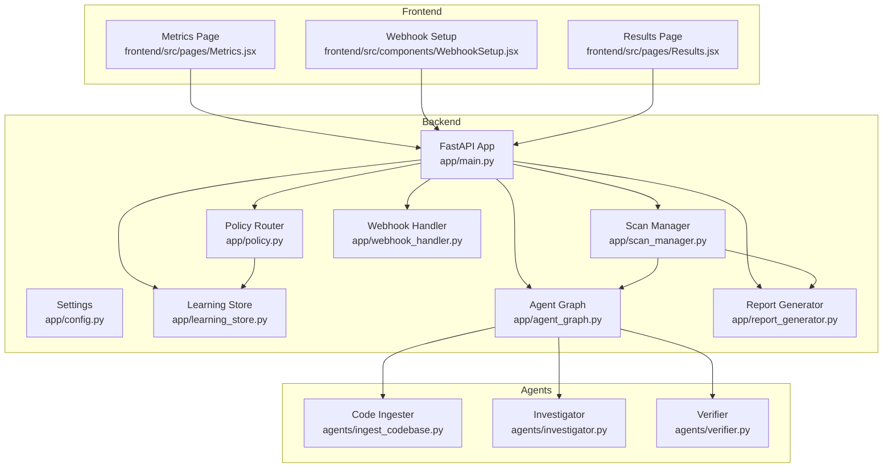
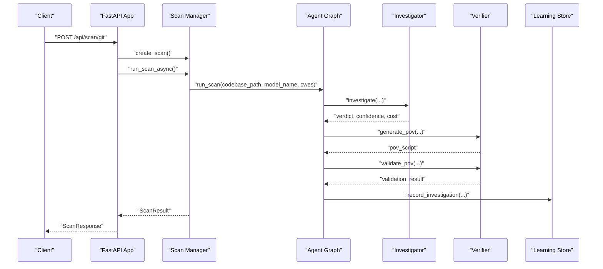
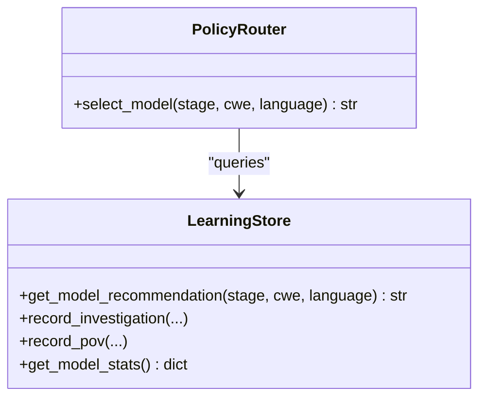
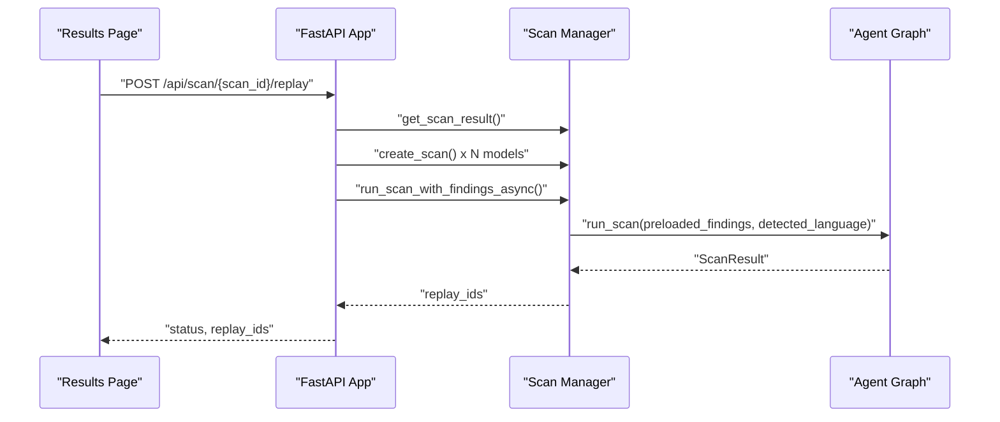
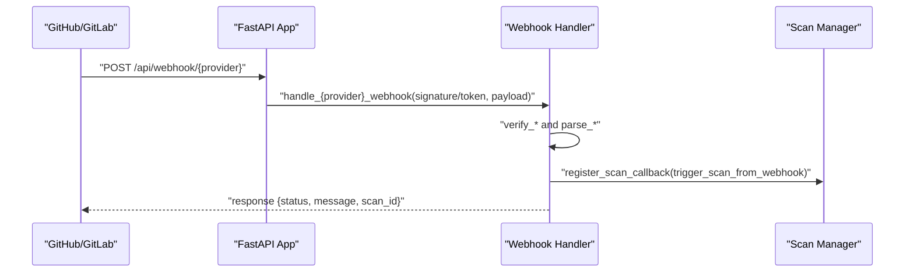
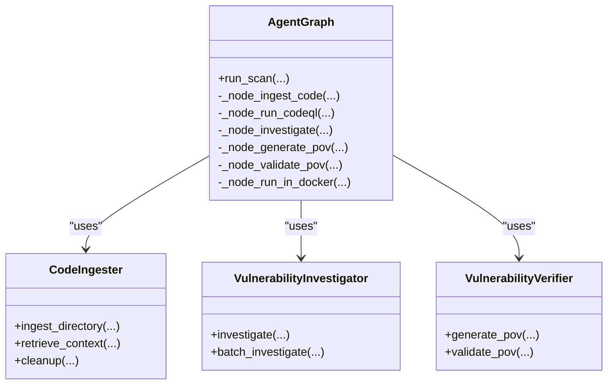
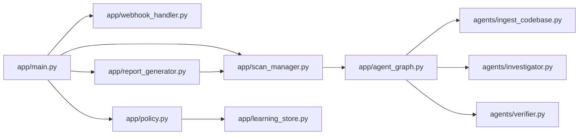

# Advanced Features

<cite>
**Referenced Files in This Document**
- [policy.py](file://app/policy.py)
- [learning_store.py](file://app/learning_store.py)
- [webhook_handler.py](file://app/webhook_handler.py)
- [scan_manager.py](file://app/scan_manager.py)
- [config.py](file://app/config.py)
- [main.py](file://app/main.py)
- [report_generator.py](file://app/report_generator.py)
- [agent_graph.py](file://app/agent_graph.py)
- [ingest_codebase.py](file://agents/ingest_codebase.py)
- [investigator.py](file://agents/investigator.py)
- [verifier.py](file://agents/verifier.py)
- [Metrics.jsx](file://frontend/src/pages/Metrics.jsx)
- [WebhookSetup.jsx](file://frontend/src/components/WebhookSetup.jsx)
- [Results.jsx](file://frontend/src/pages/Results.jsx)
</cite>

## Table of Contents
1. [Introduction](#introduction)
2. [Project Structure](#project-structure)
3. [Core Components](#core-components)
4. [Architecture Overview](#architecture-overview)
5. [Detailed Component Analysis](#detailed-component-analysis)
6. [Dependency Analysis](#dependency-analysis)
7. [Performance Considerations](#performance-considerations)
8. [Troubleshooting Guide](#troubleshooting-guide)
9. [Conclusion](#conclusion)
10. [Appendices](#appendices)

## Introduction
This document explains AutoPoV’s advanced capabilities and research-oriented features. It covers:
- Adaptive model routing powered by Policy Agent intelligence and Learning Store performance tracking
- Scan replay for cross-model benchmarking and configuration testing
- Webhook integration for automated CI/CD workflows and continuous security monitoring
- Research analytics with performance metrics, model comparison, and optimization insights
- Cleanup and maintenance features for result management and storage optimization
- Advanced configuration options, custom agent development guidelines, and extensibility patterns
- Performance optimization, scaling strategies, and production deployment considerations

## Project Structure
AutoPoV is organized into modular backend services, agent components, and a React frontend. The backend exposes a FastAPI application with endpoints for scanning, replay, metrics, reports, and webhooks. Agents implement the vulnerability detection pipeline, while the Learning Store persists outcomes to drive adaptive routing.

**Diagram sources**
- [main.py:114-122](file://app/main.py#L114-L122)
- [config.py:13-249](file://app/config.py#L13-L249)
- [policy.py:12-39](file://app/policy.py#L12-L39)
- [learning_store.py:14-256](file://app/learning_store.py#L14-L256)
- [scan_manager.py:47-663](file://app/scan_manager.py#L47-L663)
- [agent_graph.py:82-168](file://app/agent_graph.py#L82-L168)
- [webhook_handler.py:15-363](file://app/webhook_handler.py#L15-L363)
- [report_generator.py:200-830](file://app/report_generator.py#L200-L830)
- [ingest_codebase.py:41-413](file://agents/ingest_codebase.py#L41-L413)
- [investigator.py:37-519](file://agents/investigator.py#L37-L519)
- [verifier.py:42-562](file://agents/verifier.py#L42-L562)
- [Metrics.jsx:28-204](file://frontend/src/pages/Metrics.jsx#L28-L204)
- [WebhookSetup.jsx:4-89](file://frontend/src/components/WebhookSetup.jsx#L4-L89)
- [Results.jsx:8-434](file://frontend/src/pages/Results.jsx#L8-L434)

**Section sources**
- [main.py:114-122](file://app/main.py#L114-L122)
- [config.py:13-249](file://app/config.py#L13-L249)

## Core Components
- Policy Router: Selects models for each stage using routing mode and learning signals.
- Learning Store: Persists scan outcomes and aggregates performance metrics for recommendation.
- Scan Manager: Orchestrates scan lifecycle, background execution, persistence, and cleanup.
- Agent Graph: LangGraph-based workflow coordinating ingestion, CodeQL/autonomous discovery, investigation, PoV generation/validation, and Docker execution.
- Webhook Handler: Validates and parses GitHub/GitLab events, triggers scans, and emits callbacks.
- Report Generator: Produces JSON/PDF reports with metrics, model usage, and methodology.
- Frontend Pages: Metrics dashboard, webhook setup, and results with replay controls.

**Section sources**
- [policy.py:12-39](file://app/policy.py#L12-L39)
- [learning_store.py:14-256](file://app/learning_store.py#L14-L256)
- [scan_manager.py:47-663](file://app/scan_manager.py#L47-L663)
- [agent_graph.py:82-168](file://app/agent_graph.py#L82-L168)
- [webhook_handler.py:15-363](file://app/webhook_handler.py#L15-L363)
- [report_generator.py:200-830](file://app/report_generator.py#L200-L830)
- [Metrics.jsx:28-204](file://frontend/src/pages/Metrics.jsx#L28-L204)
- [WebhookSetup.jsx:4-89](file://frontend/src/components/WebhookSetup.jsx#L4-L89)
- [Results.jsx:8-434](file://frontend/src/pages/Results.jsx#L8-L434)

## Architecture Overview
The system integrates configuration-driven routing, persistent learning, and reproducible scanning. The Agent Graph coordinates heterogeneous tools (CodeQL, heuristic/LLM scouts, LLM investigation, PoV generation/validation, Docker execution). Results are persisted and exposed via REST endpoints, with optional webhook automation.

**Diagram sources**
- [main.py:204-401](file://app/main.py#L204-L401)
- [scan_manager.py:234-366](file://app/scan_manager.py#L234-L366)
- [agent_graph.py:691-777](file://app/agent_graph.py#L691-L777)
- [investigator.py:270-433](file://agents/investigator.py#L270-L433)
- [verifier.py:90-387](file://agents/verifier.py#L90-L387)
- [learning_store.py:61-124](file://app/learning_store.py#L61-L124)

## Detailed Component Analysis

### Adaptive Model Routing with Policy Agent Intelligence
AutoPoV selects models per stage using three modes:
- fixed: Uses a single configured model
- learning: Chooses the best-performing model based on historical outcomes
- auto: Uses a default auto-router model

The Policy Router delegates to the Learning Store to retrieve model recommendations filtered by stage, CWE, and language. The Agent Graph invokes the router for both investigation and PoV stages.

**Diagram sources**
- [policy.py:12-39](file://app/policy.py#L12-L39)
- [learning_store.py:188-248](file://app/learning_store.py#L188-L248)

**Section sources**
- [policy.py:18-32](file://app/policy.py#L18-L32)
- [learning_store.py:188-248](file://app/learning_store.py#L188-L248)
- [agent_graph.py:220-222](file://app/agent_graph.py#L220-L222)

### Learning Store Performance Tracking
The Learning Store maintains two tables:
- investigations: captures verdicts, confidence, model, cost, and metadata
- pov_runs: captures PoV success, cost, and validation method

It exposes:
- Aggregated stats per model for investigate and PoV stages
- Recommendation engine scoring by confirmed/(cost + epsilon)
- Summary totals for cost and counts

These insights feed the Policy Router and inform research analytics.

**Section sources**
- [learning_store.py:25-140](file://app/learning_store.py#L25-L140)
- [learning_store.py:142-186](file://app/learning_store.py#L142-L186)
- [learning_store.py:188-248](file://app/learning_store.py#L188-L248)

### Scan Replay Functionality
Scan replay enables cross-model benchmarking and configuration testing:
- Loads prior scan results and preloads findings
- Creates new scan runs against specified models
- Supports filtering by confirmed findings and limits
- Persists replay runs and snapshots for later comparison

The frontend provides a modal to configure replay parameters and track new scan IDs.

**Diagram sources**
- [Results.jsx:122-140](file://frontend/src/pages/Results.jsx#L122-L140)
- [main.py:404-491](file://app/main.py#L404-L491)
- [scan_manager.py:117-233](file://app/scan_manager.py#L117-L233)
- [agent_graph.py:154-162](file://app/agent_graph.py#L154-L162)

**Section sources**
- [main.py:404-491](file://app/main.py#L404-L491)
- [scan_manager.py:117-233](file://app/scan_manager.py#L117-L233)
- [Results.jsx:122-140](file://frontend/src/pages/Results.jsx#L122-L140)

### Webhook Integration for CI/CD and Continuous Monitoring
AutoPoV supports GitHub and GitLab webhooks:
- Signature/token verification
- Event parsing for push and pull/merge-request
- Conditional triggering based on event type and commit presence
- Callback registration to initiate scans from webhook events

The frontend includes a setup guide for configuring webhook URLs and secrets.

**Diagram sources**
- [webhook_handler.py:196-336](file://app/webhook_handler.py#L196-L336)
- [main.py:134-173](file://app/main.py#L134-L173)
- [WebhookSetup.jsx:4-89](file://frontend/src/components/WebhookSetup.jsx#L4-L89)

**Section sources**
- [webhook_handler.py:15-363](file://app/webhook_handler.py#L15-L363)
- [main.py:134-173](file://app/main.py#L134-L173)
- [WebhookSetup.jsx:4-89](file://frontend/src/components/WebhookSetup.jsx#L4-L89)

### Research Analytics and Metrics
The system provides:
- Metrics endpoint aggregating scan counts, findings, costs, and durations
- Model usage tracking and cost attribution
- PoV success rates and detection rates
- Reports with methodology and detailed metrics

The frontend Metrics page surfaces health checks, scan activity, finding statistics, and cost/performance indicators.

**Section sources**
- [main.py:754-757](file://app/main.py#L754-L757)
- [report_generator.py:604-767](file://app/report_generator.py#L604-L767)
- [Metrics.jsx:28-204](file://frontend/src/pages/Metrics.jsx#L28-L204)

### Cleanup and Maintenance Features
AutoPoV includes robust result management:
- Automatic cleanup of old result files based on age and retention limits
- Rebuilding of scan history CSV from surviving JSON files
- Optional snapshot creation for replay support
- Vector store cleanup per scan

Admin endpoints expose result cleanup with feedback on removed files and bytes freed.

**Section sources**
- [scan_manager.py:512-561](file://app/scan_manager.py#L512-L561)
- [scan_manager.py:604-653](file://app/scan_manager.py#L604-L653)
- [main.py:726-741](file://app/main.py#L726-L741)

### Advanced Configuration Options
AutoPoV exposes extensive configuration via environment variables and Pydantic settings:
- Routing modes (fixed, auto, learning) and auto-router model
- Online/offline LLM modes with provider-specific settings
- Cost tracking and maximum cost caps
- Code analysis tools (CodeQL, Joern, Kaitai)
- Vector store and embedding settings
- Docker execution parameters
- Directory paths for data, results, and snapshots

**Section sources**
- [config.py:13-249](file://app/config.py#L13-L249)

### Custom Agent Development Guidelines and Extensibility
Extending AutoPoV follows established patterns:
- Agents integrate via dependency injection and global accessors
- New agents can be wired into the Agent Graph by adding nodes and edges
- Prompts and validators can be extended for domain-specific reasoning
- Vector store ingestion supports custom chunking and embeddings

**Diagram sources**
- [agent_graph.py:82-168](file://app/agent_graph.py#L82-L168)
- [ingest_codebase.py:41-413](file://agents/ingest_codebase.py#L41-L413)
- [investigator.py:37-519](file://agents/investigator.py#L37-L519)
- [verifier.py:42-562](file://agents/verifier.py#L42-L562)

**Section sources**
- [agent_graph.py:82-168](file://app/agent_graph.py#L82-L168)
- [ingest_codebase.py:41-413](file://agents/ingest_codebase.py#L41-L413)
- [investigator.py:37-519](file://agents/investigator.py#L37-L519)
- [verifier.py:42-562](file://agents/verifier.py#L42-L562)

## Dependency Analysis
The backend components exhibit clear separation of concerns:
- FastAPI app orchestrates endpoints and delegates to managers/services
- Policy Router depends on Learning Store for recommendations
- Agent Graph composes agents and integrates with ingestion and validation
- Scan Manager coordinates persistence and cleanup
- Webhook Handler encapsulates provider-specific logic
- Report Generator consumes ScanResult and settings

**Diagram sources**
- [main.py:114-122](file://app/main.py#L114-L122)
- [policy.py:12-39](file://app/policy.py#L12-L39)
- [learning_store.py:14-256](file://app/learning_store.py#L14-L256)
- [scan_manager.py:47-663](file://app/scan_manager.py#L47-L663)
- [agent_graph.py:82-168](file://app/agent_graph.py#L82-L168)
- [ingest_codebase.py:41-413](file://agents/ingest_codebase.py#L41-L413)
- [investigator.py:37-519](file://agents/investigator.py#L37-L519)
- [verifier.py:42-562](file://agents/verifier.py#L42-L562)
- [report_generator.py:200-830](file://app/report_generator.py#L200-L830)

**Section sources**
- [main.py:114-122](file://app/main.py#L114-L122)
- [policy.py:12-39](file://app/policy.py#L12-L39)
- [learning_store.py:14-256](file://app/learning_store.py#L14-L256)
- [scan_manager.py:47-663](file://app/scan_manager.py#L47-L663)
- [agent_graph.py:82-168](file://app/agent_graph.py#L82-L168)
- [report_generator.py:200-830](file://app/report_generator.py#L200-L830)

## Performance Considerations
- Asynchronous execution: Scan Manager uses a thread pool executor to offload blocking operations, enabling concurrency for multiple scans.
- Cost control: Configurable maximum cost and cost tracking per finding enable budget-aware operation.
- Vector store batching: Code ingestion embeds and stores chunks in batches to reduce overhead.
- Cleanup policies: Automated cleanup prevents unbounded disk growth and maintains CSV integrity.
- Scaling: Use multiple workers behind a reverse proxy; separate databases for vector stores and learning store if needed.

[No sources needed since this section provides general guidance]

## Troubleshooting Guide
Common operational issues and remedies:
- Webhook signature/token invalid: Verify provider secrets and headers match configuration.
- CodeQL not available: The system falls back to heuristic/LLM-only analysis; install CodeQL CLI or disable CodeQL-dependent features.
- Missing embeddings or ChromaDB: Install required packages and ensure persistent directories exist.
- Scan stuck or failing: Inspect scan logs via streaming endpoint; check error fields in scan status.
- Cleanup not reclaiming space: Confirm retention limits and age thresholds; verify CSV rebuild succeeded.

**Section sources**
- [webhook_handler.py:213-265](file://app/webhook_handler.py#L213-L265)
- [agent_graph.py:256-305](file://app/agent_graph.py#L256-L305)
- [ingest_codebase.py:96-121](file://agents/ingest_codebase.py#L96-L121)
- [scan_manager.py:563-602](file://app/scan_manager.py#L563-L602)
- [main.py:548-583](file://app/main.py#L548-L583)

## Conclusion
AutoPoV’s advanced features combine adaptive routing, persistent learning, reproducible scanning, and automation-ready webhooks. The system supports rigorous research workflows, continuous monitoring, and scalable production deployments through configurable cost control, cleanup policies, and extensible agent architecture.

[No sources needed since this section summarizes without analyzing specific files]

## Appendices

### Production Deployment Checklist
- Configure environment variables for routing, LLM providers, and secrets
- Provision persistent volumes for data, results, snapshots, and vector store
- Set up reverse proxy and multiple worker processes
- Enable cost tracking and maximum cost caps
- Monitor metrics and set up alerting
- Automate cleanup jobs to maintain disk hygiene

[No sources needed since this section provides general guidance]