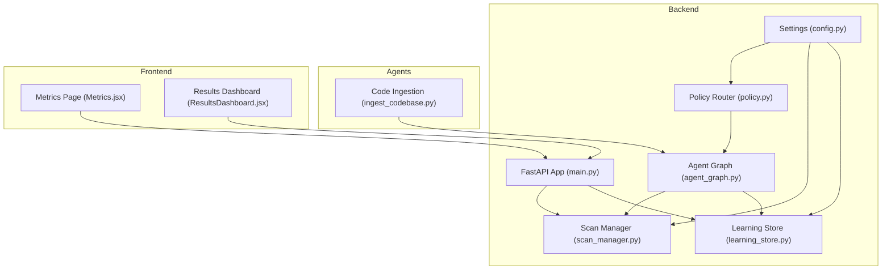
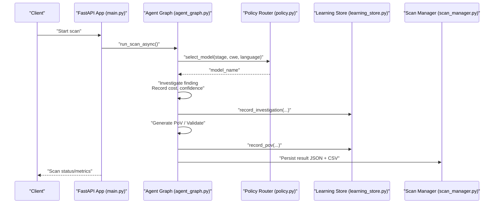
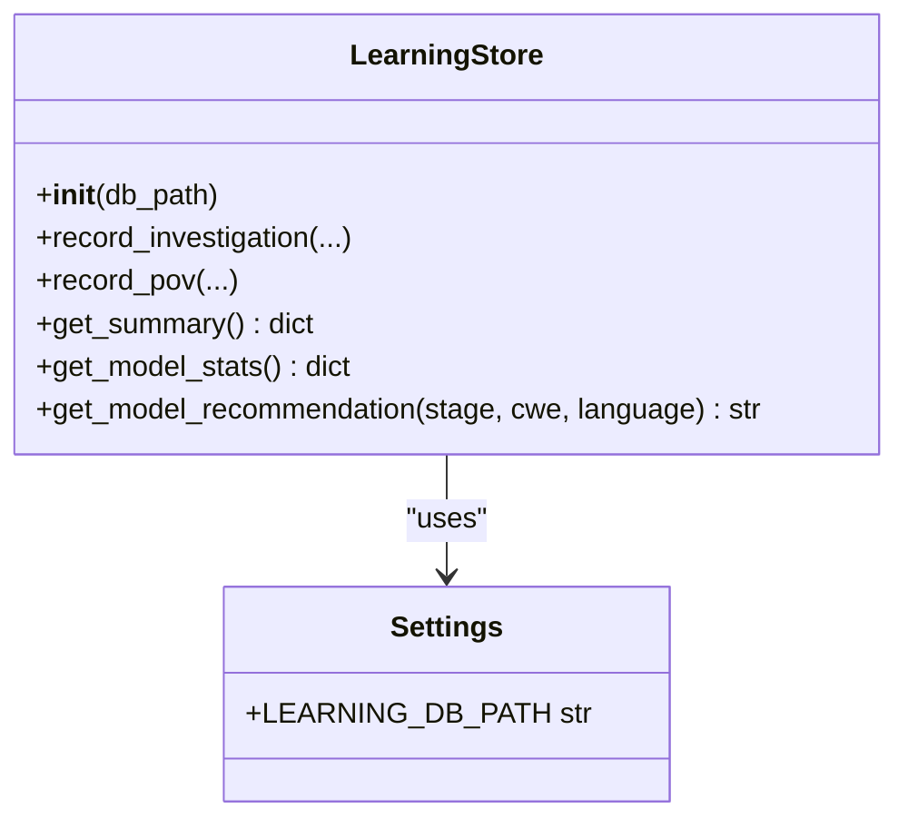
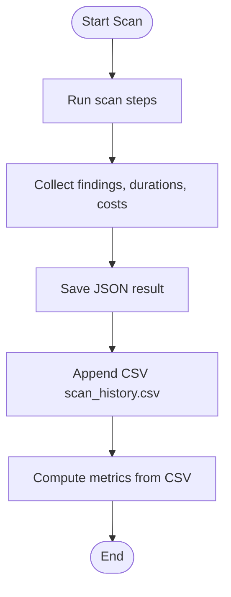
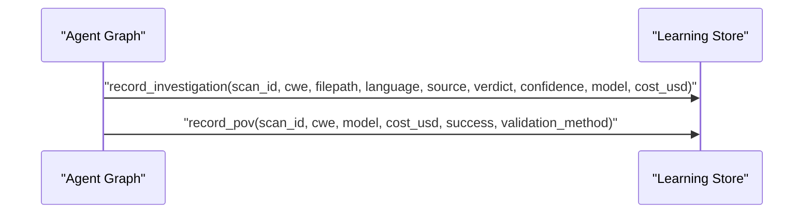
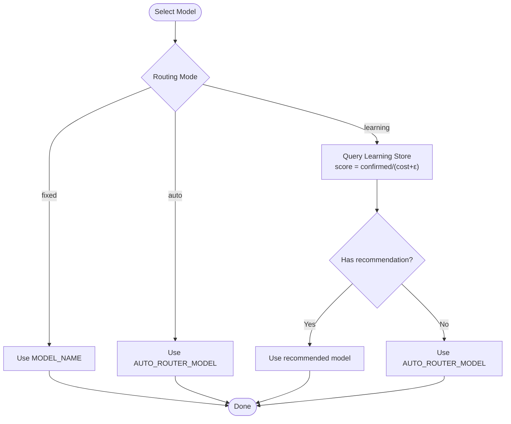
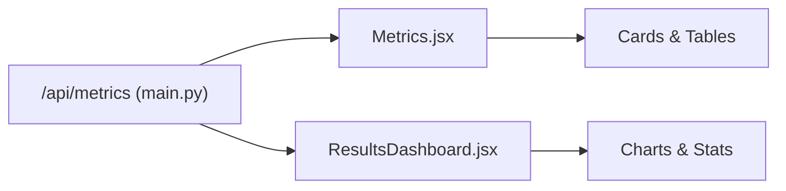
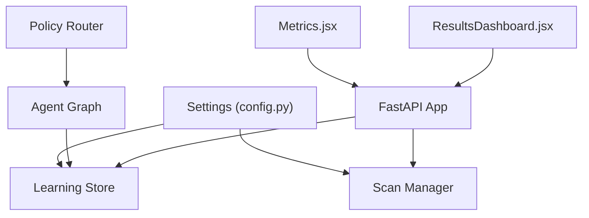

# Learning Store & Performance Tracking

<cite>
**Referenced Files in This Document**
- [learning_store.py](file://app/learning_store.py)
- [scan_manager.py](file://app/scan_manager.py)
- [config.py](file://app/config.py)
- [main.py](file://app/main.py)
- [agent_graph.py](file://app/agent_graph.py)
- [policy.py](file://app/policy.py)
- [ingest_codebase.py](file://agents/ingest_codebase.py)
- [Metrics.jsx](file://frontend/src/pages/Metrics.jsx)
- [ResultsDashboard.jsx](file://frontend/src/components/ResultsDashboard.jsx)
- [00457eac-35b4-4e40-a9bd-59f9443694a4.json](file://results/runs/00457eac-35b4-4e40-a9bd-59f9443694a4.json)
</cite>

## Table of Contents
1. [Introduction](#introduction)
2. [Project Structure](#project-structure)
3. [Core Components](#core-components)
4. [Architecture Overview](#architecture-overview)
5. [Detailed Component Analysis](#detailed-component-analysis)
6. [Dependency Analysis](#dependency-analysis)
7. [Performance Considerations](#performance-considerations)
8. [Troubleshooting Guide](#troubleshooting-guide)
9. [Conclusion](#conclusion)
10. [Appendices](#appendices)

## Introduction
This document explains AutoPoV’s Learning Store system and performance tracking capabilities. It covers how agent performance metrics, model effectiveness, and scan outcomes are collected, stored, and queried. It also documents the recommendation algorithms, metrics tracking (success rates, processing times, resource utilization), configuration options for data retention and aggregation, and practical workflows for performance analysis and trend identification. Privacy considerations and storage optimization strategies are addressed to ensure responsible and efficient operation.

## Project Structure
The Learning Store and performance tracking span backend services, configuration, and frontend dashboards:
- Backend services persist and analyze outcomes in SQLite and CSV.
- The agent graph records per-findings costs and outcomes.
- The policy router selects models based on historical performance.
- Frontend dashboards visualize metrics and trends.

**Diagram sources**
- [config.py:13-255](file://app/config.py#L13-L255)
- [learning_store.py:14-256](file://app/learning_store.py#L14-L256)
- [scan_manager.py:47-663](file://app/scan_manager.py#L47-L663)
- [agent_graph.py:82-800](file://app/agent_graph.py#L82-L800)
- [policy.py:12-40](file://app/policy.py#L12-L40)
- [main.py:114-768](file://app/main.py#L114-L768)
- [ingest_codebase.py:41-413](file://agents/ingest_codebase.py#L41-L413)
- [Metrics.jsx:1-204](file://frontend/src/pages/Metrics.jsx#L1-L204)
- [ResultsDashboard.jsx:1-289](file://frontend/src/components/ResultsDashboard.jsx#L1-L289)

**Section sources**
- [config.py:13-255](file://app/config.py#L13-L255)
- [main.py:114-768](file://app/main.py#L114-L768)

## Core Components
- Learning Store: SQLite-backed persistence for investigation outcomes and PoV runs, with summaries, model statistics, and recommendations.
- Scan Manager: Orchestrates scans, aggregates metrics, persists results to JSON and CSV, and cleans up old artifacts.
- Agent Graph: Executes the vulnerability detection workflow, records per-finding costs and outcomes, and triggers Learning Store writes.
- Policy Router: Selects models for each stage based on routing mode and historical performance.
- Frontend Dashboards: Visualize system metrics, scan activity, and cost breakdowns.

**Section sources**
- [learning_store.py:14-256](file://app/learning_store.py#L14-L256)
- [scan_manager.py:47-663](file://app/scan_manager.py#L47-L663)
- [agent_graph.py:691-778](file://app/agent_graph.py#L691-L778)
- [policy.py:12-40](file://app/policy.py#L12-L40)
- [Metrics.jsx:1-204](file://frontend/src/pages/Metrics.jsx#L1-L204)
- [ResultsDashboard.jsx:1-289](file://frontend/src/components/ResultsDashboard.jsx#L1-L289)

## Architecture Overview
The system collects performance data at runtime and persists it for analytics and model routing decisions.

**Diagram sources**
- [main.py:204-400](file://app/main.py#L204-L400)
- [agent_graph.py:691-778](file://app/agent_graph.py#L691-L778)
- [policy.py:18-32](file://app/policy.py#L18-L32)
- [learning_store.py:61-124](file://app/learning_store.py#L61-L124)
- [scan_manager.py:234-366](file://app/scan_manager.py#L234-L366)

## Detailed Component Analysis

### Learning Store
- Persistence schema:
  - investigations: per-investigation records with cwe, filepath, language, source, verdict, confidence, model, cost_usd, timestamp.
  - pov_runs: per-PoV run with cwe, model, cost_usd, success flag, validation_method, timestamp.
- Aggregations:
  - get_summary(): totals and sums for investigations and PoV runs.
  - get_model_stats(): per-model confirm rates, success rates, average confidence, and cost.
- Recommendations:
  - get_model_recommendation(stage, cwe, language): selects model by highest confirmed/(cost + epsilon) score, filtered by optional criteria.

**Diagram sources**
- [learning_store.py:14-256](file://app/learning_store.py#L14-L256)
- [config.py:44](file://app/config.py#L44)

**Section sources**
- [learning_store.py:14-256](file://app/learning_store.py#L14-L256)
- [config.py:44](file://app/config.py#L44)

### Scan Manager
- Responsibilities:
  - Run scans asynchronously, collect findings, compute durations, and accumulate costs.
  - Persist results to JSON and append to CSV scan_history.csv.
  - Provide metrics aggregation from CSV.
  - Periodic cleanup of old result files and CSV rebuild.
- Metrics exposed via GET /api/metrics.

**Diagram sources**
- [scan_manager.py:234-366](file://app/scan_manager.py#L234-L366)
- [scan_manager.py:604-653](file://app/scan_manager.py#L604-L653)
- [scan_manager.py:512-561](file://app/scan_manager.py#L512-L561)

**Section sources**
- [scan_manager.py:47-663](file://app/scan_manager.py#L47-L663)
- [main.py:754-758](file://app/main.py#L754-L758)

### Agent Graph and Outcomes Recording
- During investigation:
  - Records per-finding cost_usd, confidence, model_used, and other metadata.
  - Writes to Learning Store via record_investigation.
- During PoV:
  - Writes to Learning Store via record_pov with success flag and validation method.
- These outcomes feed model recommendations and performance dashboards.

**Diagram sources**
- [agent_graph.py:763-773](file://app/agent_graph.py#L763-L773)
- [learning_store.py:61-124](file://app/learning_store.py#L61-L124)

**Section sources**
- [agent_graph.py:691-778](file://app/agent_graph.py#L691-L778)
- [learning_store.py:61-124](file://app/learning_store.py#L61-L124)

### Policy Router and Recommendation Algorithm
- Routing modes:
  - fixed: uses MODEL_NAME.
  - learning: uses model recommended by Learning Store; falls back to AUTO_ROUTER_MODEL if no signal.
  - auto: uses AUTO_ROUTER_MODEL.
- Recommendation algorithm:
  - Investigate stage: maximize confirmed/(cost + 0.01).
  - PoV stage: maximize success/(cost + 0.01).

**Diagram sources**
- [policy.py:18-32](file://app/policy.py#L18-L32)
- [learning_store.py:188-248](file://app/learning_store.py#L188-L248)

**Section sources**
- [policy.py:12-40](file://app/policy.py#L12-L40)
- [learning_store.py:188-248](file://app/learning_store.py#L188-L248)

### Frontend Metrics and Results Visualization
- Metrics page aggregates system-wide metrics (scans, findings, costs, durations).
- Results dashboard computes detection rate, false positive rate, PoV success rate, and cost breakdowns by model and purpose.

**Diagram sources**
- [main.py:754-758](file://app/main.py#L754-L758)
- [Metrics.jsx:1-204](file://frontend/src/pages/Metrics.jsx#L1-L204)
- [ResultsDashboard.jsx:1-289](file://frontend/src/components/ResultsDashboard.jsx#L1-L289)

**Section sources**
- [Metrics.jsx:1-204](file://frontend/src/pages/Metrics.jsx#L1-L204)
- [ResultsDashboard.jsx:1-289](file://frontend/src/components/ResultsDashboard.jsx#L1-L289)

## Dependency Analysis
- Learning Store depends on Settings for database path and is used by Agent Graph and API endpoints.
- Scan Manager depends on Settings for directories and persists results to JSON and CSV.
- Agent Graph depends on Policy Router and writes to Learning Store.
- Frontend depends on API endpoints for metrics and results.

**Diagram sources**
- [config.py:13-255](file://app/config.py#L13-L255)
- [learning_store.py:14-256](file://app/learning_store.py#L14-L256)
- [scan_manager.py:47-663](file://app/scan_manager.py#L47-L663)
- [agent_graph.py:82-800](file://app/agent_graph.py#L82-L800)
- [policy.py:12-40](file://app/policy.py#L12-L40)
- [main.py:114-768](file://app/main.py#L114-L768)
- [Metrics.jsx:1-204](file://frontend/src/pages/Metrics.jsx#L1-L204)
- [ResultsDashboard.jsx:1-289](file://frontend/src/components/ResultsDashboard.jsx#L1-L289)

**Section sources**
- [config.py:13-255](file://app/config.py#L13-L255)
- [main.py:114-768](file://app/main.py#L114-L768)

## Performance Considerations
- Data collection granularity:
  - Per-finding cost_usd and confidence are recorded during investigation and aggregated in CSV/JSON.
  - PoV success and cost are recorded separately to enable distinct performance analysis.
- Query optimization:
  - Learning Store uses targeted SQL with optional filters by cwe and language.
  - Aggregation queries group by model and compute confirm rates and success rates.
- Storage optimization:
  - Old result files are pruned by age and count; CSV is rebuilt to keep only live results.
  - Vector store collections are cleaned up after scans to reduce disk usage.
- Cost control:
  - Cost tracking is enabled by default; MAX_COST_USD and per-stage caps can be configured.
- Frontend rendering:
  - Metrics and charts are computed client-side from available data to minimize server load.

[No sources needed since this section provides general guidance]

## Troubleshooting Guide
- Learning Store not initialized:
  - Ensure LEARNING_DB_PATH exists and is writable; the store creates directories on startup.
- Missing CSV metrics:
  - Verify scan_history.csv exists and is readable; Scan Manager rebuilds it from JSON results.
- Empty recommendations:
  - In learning mode, recommendations require sufficient historical data; fallback to AUTO_ROUTER_MODEL is automatic.
- Cleanup not working:
  - Confirm max_age_days and max_results thresholds; ensure permissions to delete files and write CSV.
- Frontend metrics missing:
  - Confirm API is reachable and /api/metrics returns data; check browser console for errors.

**Section sources**
- [config.py:44](file://app/config.py#L44)
- [scan_manager.py:512-561](file://app/scan_manager.py#L512-L561)
- [policy.py:24-29](file://app/policy.py#L24-L29)

## Conclusion
AutoPoV’s Learning Store and performance tracking form a cohesive system for continuous improvement and observability. Outcomes are captured at each stage, persisted efficiently, and used to drive model selection and operational insights. The combination of SQL-backed summaries, CSV metrics, and frontend dashboards enables practical performance analysis and trend identification, while configuration options ensure responsible data retention and cost control.

[No sources needed since this section summarizes without analyzing specific files]

## Appendices

### Data Collection Mechanisms
- Investigation outcomes:
  - Recorded per finding with cwe, filepath, language, source, verdict, confidence, model, cost_usd, timestamp.
- PoV outcomes:
  - Recorded per run with cwe, model, cost_usd, success flag, validation_method, timestamp.
- Scan results:
  - Saved as JSON with findings and metrics; appended to CSV scan_history.csv.

**Section sources**
- [learning_store.py:61-124](file://app/learning_store.py#L61-L124)
- [scan_manager.py:367-401](file://app/scan_manager.py#L367-L401)
- [agent_graph.py:763-773](file://app/agent_graph.py#L763-L773)

### Storage Architecture
- SQLite database for Learning Store with two tables: investigations and pov_runs.
- CSV log for historical scans with columns for counts, costs, and durations.
- JSON artifacts per scan for detailed findings and logs.

**Section sources**
- [learning_store.py:25-59](file://app/learning_store.py#L25-L59)
- [scan_manager.py:374-401](file://app/scan_manager.py#L374-L401)
- [00457eac-35b4-4e40-a9bd-59f9443694a4.json:1-21](file://results/runs/00457eac-35b4-4e40-a9bd-59f9443694a4.json#L1-L21)

### Query Optimization and Recommendation Algorithms
- Learning Store queries:
  - Summarize totals and costs; group by model; optional filters by cwe and language.
- Recommendation scoring:
  - Investigate: confirmed/(cost + 0.01); PoV: success/(cost + 0.01).
- Metrics aggregation:
  - Compute totals, averages, and rates from CSV scan_history.csv.

**Section sources**
- [learning_store.py:126-186](file://app/learning_store.py#L126-L186)
- [learning_store.py:188-248](file://app/learning_store.py#L188-L248)
- [scan_manager.py:604-653](file://app/scan_manager.py#L604-L653)

### Metrics Tracking System
- Success rates:
  - Detection rate, false positive rate, PoV success rate computed from findings.
- Processing times:
  - Duration_s from ScanResult; average duration derived from CSV.
- Resource utilization:
  - Total cost_usd and average cost per scan; cost breakdown by model and purpose.

**Section sources**
- [ResultsDashboard.jsx:8-31](file://frontend/src/components/ResultsDashboard.jsx#L8-L31)
- [ResultsDashboard.jsx:42-79](file://frontend/src/components/ResultsDashboard.jsx#L42-L79)
- [scan_manager.py:604-653](file://app/scan_manager.py#L604-L653)

### Performance Analysis Workflows and Trend Identification
- Workflow:
  - Trigger scan via API → Agent Graph executes stages → Outcomes written to Learning Store → Metrics endpoint aggregates CSV → Frontend renders charts and dashboards.
- Trend identification:
  - Compare model success rates and confirm rates over time; inspect cost trends by model and purpose; monitor PoV success rates to assess exploitability.

**Section sources**
- [main.py:204-400](file://app/main.py#L204-L400)
- [agent_graph.py:691-778](file://app/agent_graph.py#L691-L778)
- [Metrics.jsx:104-191](file://frontend/src/pages/Metrics.jsx#L104-L191)
- [ResultsDashboard.jsx:165-227](file://frontend/src/components/ResultsDashboard.jsx#L165-L227)

### Configuration Options
- Data retention:
  - max_age_days and max_results for cleanup_old_results; rebuilds CSV from remaining JSON.
- Aggregation periods:
  - Metrics endpoint reads CSV for totals and averages; adjust retention to control aggregation windows.
- Custom metric definitions:
  - Extend CSV schema and ScanResult fields; update metrics aggregation logic accordingly.

**Section sources**
- [scan_manager.py:512-561](file://app/scan_manager.py#L512-L561)
- [scan_manager.py:604-653](file://app/scan_manager.py#L604-L653)

### Data Privacy Considerations and Storage Optimization Strategies
- Privacy:
  - Restrict access to API endpoints; ensure logs and results are not exposed publicly.
  - Consider anonymizing identifiers and minimizing sensitive data in CSV/JSON.
- Optimization:
  - Enable SAVE_CODEBASE_SNAPSHOT selectively; clean up old results regularly.
  - Use vector store cleanup after scans; prune large temporary directories.

**Section sources**
- [config.py:144-146](file://app/config.py#L144-L146)
- [scan_manager.py:512-561](file://app/scan_manager.py#L512-L561)
- [ingest_codebase.py:393-403](file://agents/ingest_codebase.py#L393-L403)