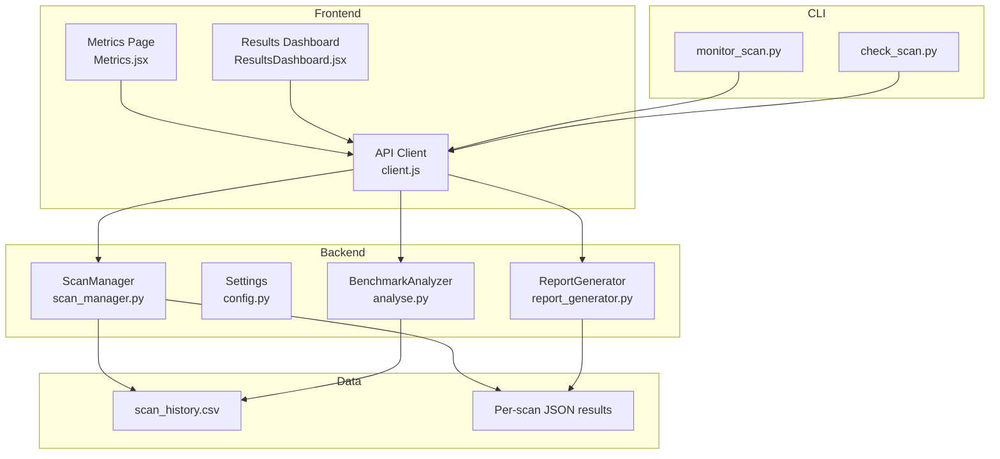
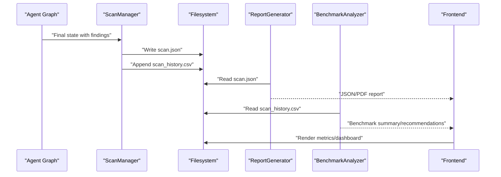
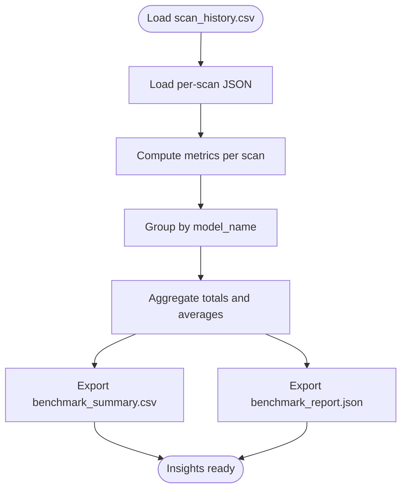
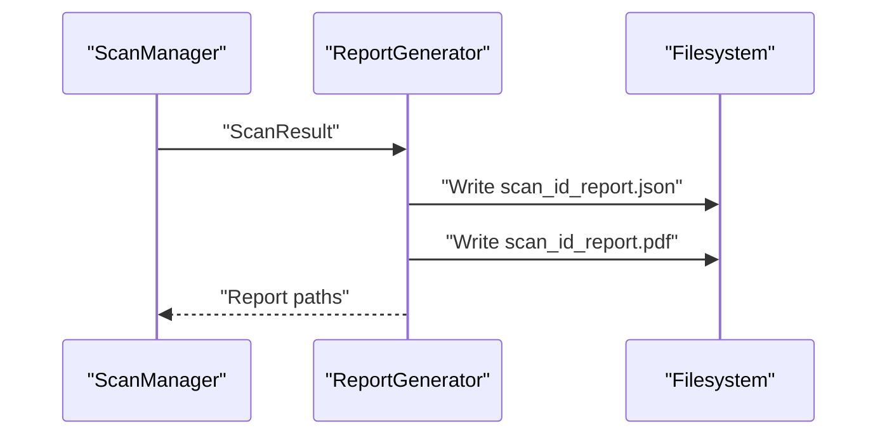
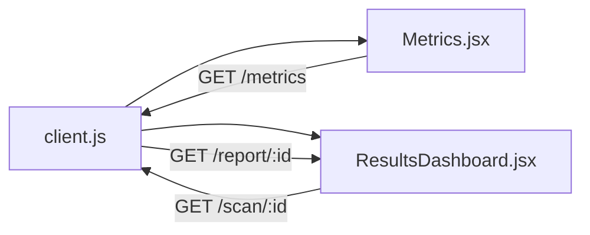
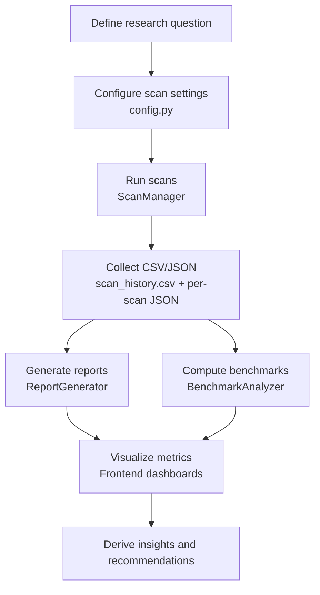
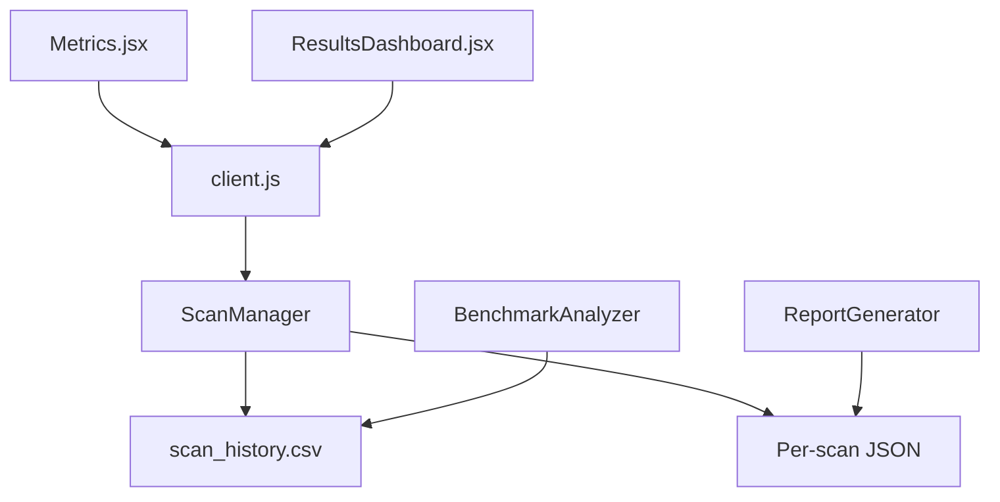

# Research Analytics & Insights

<cite>
**Referenced Files in This Document**
- [report_generator.py](file://app/report_generator.py)
- [analyse.py](file://analyse.py)
- [scan_manager.py](file://app/scan_manager.py)
- [config.py](file://app/config.py)
- [scan_history.csv](file://results/runs/scan_history.csv)
- [Metrics.jsx](file://frontend/src/pages/Metrics.jsx)
- [ResultsDashboard.jsx](file://frontend/src/components/ResultsDashboard.jsx)
- [client.js](file://frontend/src/api/client.js)
- [monitor_scan.py](file://monitor_scan.py)
- [check_scan.py](file://check_scan.py)
</cite>

## Table of Contents
1. [Introduction](#introduction)
2. [Project Structure](#project-structure)
3. [Core Components](#core-components)
4. [Architecture Overview](#architecture-overview)
5. [Detailed Component Analysis](#detailed-component-analysis)
6. [Dependency Analysis](#dependency-analysis)
7. [Performance Considerations](#performance-considerations)
8. [Troubleshooting Guide](#troubleshooting-guide)
9. [Conclusion](#conclusion)
10. [Appendices](#appendices)

## Introduction
This document explains AutoPoV’s research analytics and insights generation capabilities. It covers how the system extracts patterns from scan results, agent performance metrics, and model effectiveness comparisons; how it reports findings, trends, and optimization recommendations; and how it visualizes performance dashboards and comparative analyses. It also provides examples of research workflows for academic and industrial use, guidelines for extending analytics, and reproducibility practices.

## Project Structure
AutoPoV’s analytics pipeline spans backend services, frontend dashboards, and persistent datasets:
- Backend services manage scan lifecycle, persist results, and expose metrics.
- Reporting utilities generate structured JSON and PDF reports.
- Analytics scripts summarize historical runs and produce benchmark insights.
- Frontend dashboards visualize metrics and findings distributions.
- CLI monitors and checks scans for operational research workflows.

**Diagram sources**
- [scan_manager.py:1-663](file://app/scan_manager.py#L1-L663)
- [config.py:1-255](file://app/config.py#L1-L255)
- [report_generator.py:1-830](file://app/report_generator.py#L1-L830)
- [analyse.py:1-357](file://analyse.py#L1-L357)
- [scan_history.csv:1-72](file://results/runs/scan_history.csv#L1-L72)
- [Metrics.jsx:1-204](file://frontend/src/pages/Metrics.jsx#L1-L204)
- [ResultsDashboard.jsx:1-289](file://frontend/src/components/ResultsDashboard.jsx#L1-L289)
- [client.js:1-78](file://frontend/src/api/client.js#L1-L78)
- [monitor_scan.py:1-90](file://monitor_scan.py#L1-L90)
- [check_scan.py:1-16](file://check_scan.py#L1-L16)

**Section sources**
- [scan_manager.py:1-663](file://app/scan_manager.py#L1-L663)
- [config.py:1-255](file://app/config.py#L1-L255)
- [report_generator.py:1-830](file://app/report_generator.py#L1-L830)
- [analyse.py:1-357](file://analyse.py#L1-L357)
- [scan_history.csv:1-72](file://results/runs/scan_history.csv#L1-L72)
- [Metrics.jsx:1-204](file://frontend/src/pages/Metrics.jsx#L1-L204)
- [ResultsDashboard.jsx:1-289](file://frontend/src/components/ResultsDashboard.jsx#L1-L289)
- [client.js:1-78](file://frontend/src/api/client.js#L1-L78)
- [monitor_scan.py:1-90](file://monitor_scan.py#L1-L90)
- [check_scan.py:1-16](file://check_scan.py#L1-L16)

## Core Components
- ScanManager persists and aggregates scan outcomes, maintains CSV history, and exposes metrics for dashboards.
- ReportGenerator produces structured JSON and PDF reports enriched with model usage and methodology.
- BenchmarkAnalyzer loads CSV history, computes per-model statistics, and generates benchmark summaries and recommendations.
- Frontend dashboards visualize metrics and findings distributions; API client connects to backend endpoints.
- CLI utilities support monitoring and checking scan status for research workflows.

**Section sources**
- [scan_manager.py:47-658](file://app/scan_manager.py#L47-L658)
- [report_generator.py:200-800](file://app/report_generator.py#L200-L800)
- [analyse.py:39-357](file://analyse.py#L39-L357)
- [Metrics.jsx:28-204](file://frontend/src/pages/Metrics.jsx#L28-L204)
- [ResultsDashboard.jsx:5-289](file://frontend/src/components/ResultsDashboard.jsx#L5-L289)
- [client.js:28-78](file://frontend/src/api/client.js#L28-L78)
- [monitor_scan.py:15-90](file://monitor_scan.py#L15-L90)
- [check_scan.py:10-16](file://check_scan.py#L10-L16)

## Architecture Overview
The analytics architecture integrates data ingestion, storage, computation, and visualization:
- Data ingestion: ScanManager writes per-scan JSON and appends CSV rows.
- Data storage: Persistent CSV and JSON artifacts enable offline analysis.
- Computation: ReportGenerator and BenchmarkAnalyzer process results for insights.
- Visualization: Frontend dashboards render metrics and distributions.
- Monitoring: CLI scripts observe scan progress and outcomes.

**Diagram sources**
- [scan_manager.py:367-418](file://app/scan_manager.py#L367-L418)
- [report_generator.py:209-262](file://app/report_generator.py#L209-L262)
- [analyse.py:46-60](file://analyse.py#L46-L60)
- [Metrics.jsx:28-204](file://frontend/src/pages/Metrics.jsx#L28-L204)
- [ResultsDashboard.jsx:5-289](file://frontend/src/components/ResultsDashboard.jsx#L5-L289)

## Detailed Component Analysis

### Data Analysis Framework for Patterns and Metrics
- Metrics extraction:
  - Detection rate, false positive rate, PoV success rate, and cost per confirmed vulnerability are computed from scan outcomes.
  - Per-scan JSON captures granular findings, token usage, and validation results.
  - CSV history aggregates model, CWE scope, and outcome counts for comparative analysis.
- Comparative analysis:
  - BenchmarkAnalyzer groups results by model, computing totals and averages for confirmed vulnerabilities, FP, total findings, cost, duration, and derived rates.
  - Recommendations highlight best detection rate, lowest FP rate, and most cost-effective model.
- Reproducibility:
  - CSV and JSON artifacts enable offline replication and cross-validation.
  - Snapshots and persisted vectors support replay and auditing.

**Diagram sources**
- [analyse.py:46-247](file://analyse.py#L46-L247)
- [scan_history.csv:1-72](file://results/runs/scan_history.csv#L1-L72)

**Section sources**
- [analyse.py:72-98](file://analyse.py#L72-L98)
- [analyse.py:107-214](file://analyse.py#L107-L214)
- [analyse.py:216-267](file://analyse.py#L216-L267)
- [scan_manager.py:604-653](file://app/scan_manager.py#L604-L653)

### Reporting System for Research Insights
- JSON reports:
  - Include metadata, scan summary, model usage, metrics, findings, and methodology.
  - Enriched with PoV summaries and cost breakdowns.
- PDF reports:
  - Professional layout with executive summary, model usage, confirmed vulnerabilities, false positives, methodology, and appendix.
  - Uses OpenRouter activity when available to attribute actual models and costs.
- Export formats:
  - JSON and PDF outputs are generated per scan and stored alongside results.

**Diagram sources**
- [report_generator.py:209-262](file://app/report_generator.py#L209-L262)
- [report_generator.py:264-610](file://app/report_generator.py#L264-L610)

**Section sources**
- [report_generator.py:200-257](file://app/report_generator.py#L200-L257)
- [report_generator.py:612-657](file://app/report_generator.py#L612-L657)
- [report_generator.py:768-798](file://app/report_generator.py#L768-L798)

### Visualization Components for Dashboards and Comparative Analysis
- Metrics page:
  - Displays system health, scan activity, findings, and cost/performance stats.
  - Fetches live metrics and health endpoints.
- Results dashboard:
  - Renders summary cards, pie charts for findings distribution, bar charts for rates, and collapsible cost breakdowns.
  - Computes detection, FP, and PoV success rates from findings.
- API client:
  - Provides typed endpoints for metrics, reports, and SSE streams.

**Diagram sources**
- [client.js:28-78](file://frontend/src/api/client.js#L28-L78)
- [Metrics.jsx:28-204](file://frontend/src/pages/Metrics.jsx#L28-L204)
- [ResultsDashboard.jsx:5-289](file://frontend/src/components/ResultsDashboard.jsx#L5-L289)

**Section sources**
- [Metrics.jsx:28-204](file://frontend/src/pages/Metrics.jsx#L28-L204)
- [ResultsDashboard.jsx:8-31](file://frontend/src/components/ResultsDashboard.jsx#L8-L31)
- [ResultsDashboard.jsx:42-79](file://frontend/src/components/ResultsDashboard.jsx#L42-L79)
- [client.js:28-78](file://frontend/src/api/client.js#L28-L78)

### Research Workflows: Academic and Industrial Applications
- Academic benchmarking:
  - Use CSV and JSON artifacts to compare detection rates, FP rates, and cost-effectiveness across models and CWE sets.
  - Generate benchmark reports and publish comparative analyses.
- Industrial triage and regression testing:
  - Monitor scans via CLI utilities, track metrics dashboards, and generate PDF reports for stakeholders.
  - Use PoV success rates to prioritize remediation efforts.
- Reproducible research:
  - Persist snapshots and results; re-run scans with identical configurations; audit model usage and costs.

**Diagram sources**
- [config.py:13-142](file://app/config.py#L13-L142)
- [scan_manager.py:367-418](file://app/scan_manager.py#L367-L418)
- [report_generator.py:209-262](file://app/report_generator.py#L209-L262)
- [analyse.py:216-267](file://analyse.py#L216-L267)
- [Metrics.jsx:28-204](file://frontend/src/pages/Metrics.jsx#L28-L204)
- [ResultsDashboard.jsx:5-289](file://frontend/src/components/ResultsDashboard.jsx#L5-L289)

**Section sources**
- [config.py:13-142](file://app/config.py#L13-L142)
- [monitor_scan.py:29-71](file://monitor_scan.py#L29-L71)
- [check_scan.py:10-16](file://check_scan.py#L10-L16)

### Guidelines for Custom Analytics Development and Integration
- Extend BenchmarkAnalyzer:
  - Add new derived metrics in calculation functions and aggregation logic.
  - Introduce new CSV columns and report fields in export routines.
- Integrate external tools:
  - Incorporate external cost APIs or model registries into model usage tracking.
  - Add new visualization panels in the frontend for domain-specific metrics.
- Maintain reproducibility:
  - Preserve CSV and JSON artifacts; document environment variables and settings.
  - Use snapshots for replay and validation.

**Section sources**
- [analyse.py:72-98](file://analyse.py#L72-L98)
- [analyse.py:107-214](file://analyse.py#L107-L214)
- [report_generator.py:659-719](file://app/report_generator.py#L659-L719)
- [config.py:136-142](file://app/config.py#L136-L142)

## Dependency Analysis
- Coupling:
  - ScanManager centralizes persistence and metrics; ReportGenerator and BenchmarkAnalyzer depend on CSV/JSON outputs.
  - Frontend depends on API client endpoints exposed by backend services.
- Cohesion:
  - ReportGenerator encapsulates report creation; BenchmarkAnalyzer encapsulates comparative analysis.
- External dependencies:
  - OpenRouter activity tracking for model attribution.
  - Pandas for tabular analysis (fallback available).
  - Frontend libraries for visualization (recharts, icons).

**Diagram sources**
- [scan_manager.py:367-418](file://app/scan_manager.py#L367-L418)
- [report_generator.py:209-262](file://app/report_generator.py#L209-L262)
- [analyse.py:46-60](file://analyse.py#L46-L60)
- [Metrics.jsx:28-204](file://frontend/src/pages/Metrics.jsx#L28-L204)
- [ResultsDashboard.jsx:5-289](file://frontend/src/components/ResultsDashboard.jsx#L5-L289)
- [client.js:28-78](file://frontend/src/api/client.js#L28-L78)

**Section sources**
- [scan_manager.py:367-418](file://app/scan_manager.py#L367-L418)
- [report_generator.py:209-262](file://app/report_generator.py#L209-L262)
- [analyse.py:46-60](file://analyse.py#L46-L60)
- [client.js:28-78](file://frontend/src/api/client.js#L28-L78)

## Performance Considerations
- Cost control:
  - Centralized cost tracking and limits reduce resource drift during experiments.
- Scalability:
  - CSV-based history enables batch processing; consider partitioning for large-scale runs.
- Visualization:
  - Memoization and responsive charts optimize rendering for large datasets.
- Monitoring:
  - CLI utilities streamline long-running research campaigns.

[No sources needed since this section provides general guidance]

## Troubleshooting Guide
- Missing CSV or JSON:
  - Verify ScanManager persistence and filesystem permissions.
- Empty or stale metrics:
  - Confirm metrics endpoint reads CSV and that scans completed successfully.
- Report generation failures:
  - Ensure PDF library availability and that scan JSON exists.
- Frontend connectivity:
  - Check API key configuration and CORS settings.

**Section sources**
- [scan_manager.py:367-418](file://app/scan_manager.py#L367-L418)
- [report_generator.py:264-268](file://app/report_generator.py#L264-L268)
- [client.js:6-8](file://frontend/src/api/client.js#L6-L8)
- [Metrics.jsx:35-51](file://frontend/src/pages/Metrics.jsx#L35-L51)

## Conclusion
AutoPoV’s analytics stack provides a robust foundation for research: structured persistence, comprehensive reporting, comparative benchmarking, and interactive dashboards. Researchers can reproduce results, compare models, and derive actionable insights for both academic evaluation and industrial triage.

[No sources needed since this section summarizes without analyzing specific files]

## Appendices

### Data Export Formats and Reproducibility
- CSV: scan_history.csv for aggregated runs.
- JSON: per-scan JSON and benchmark reports for programmatic consumption.
- PDF: per-scan PDF reports for stakeholder communication.
- Reproducibility: preserve environment settings, snapshots, and artifacts.

**Section sources**
- [scan_history.csv:1-72](file://results/runs/scan_history.csv#L1-L72)
- [report_generator.py:209-262](file://app/report_generator.py#L209-L262)
- [analyse.py:216-267](file://analyse.py#L216-L267)

### Research Methodology Support
- Standardized metrics: detection rate, FP rate, PoV success rate, cost per confirmed.
- Comparable configurations: model selection, routing mode, CWE scope.
- Auditing: logs, snapshots, and model usage attribution.

**Section sources**
- [report_generator.py:612-657](file://app/report_generator.py#L612-L657)
- [config.py:37-52](file://app/config.py#L37-L52)
- [config.py:108-134](file://app/config.py#L108-L134)