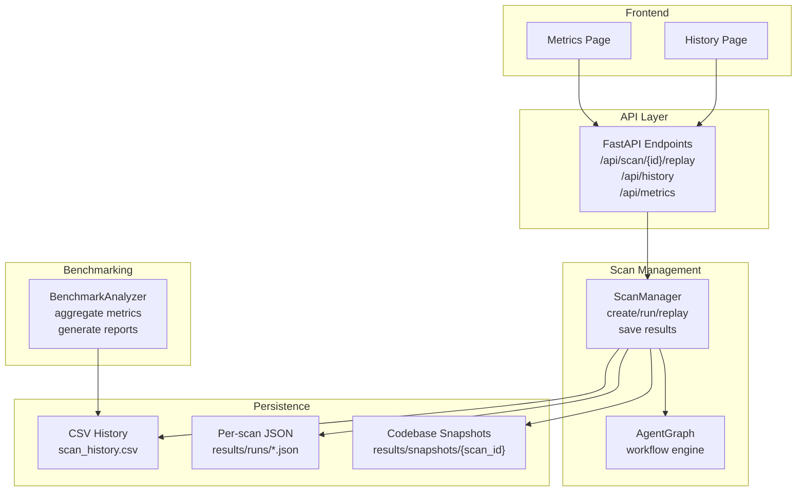
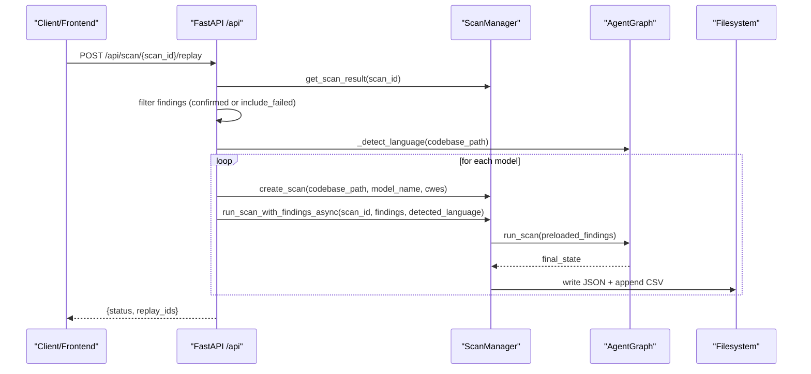
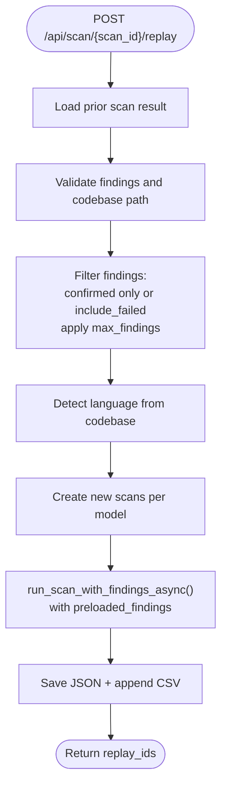
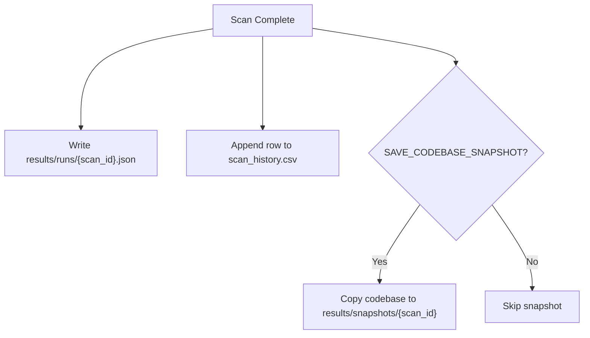
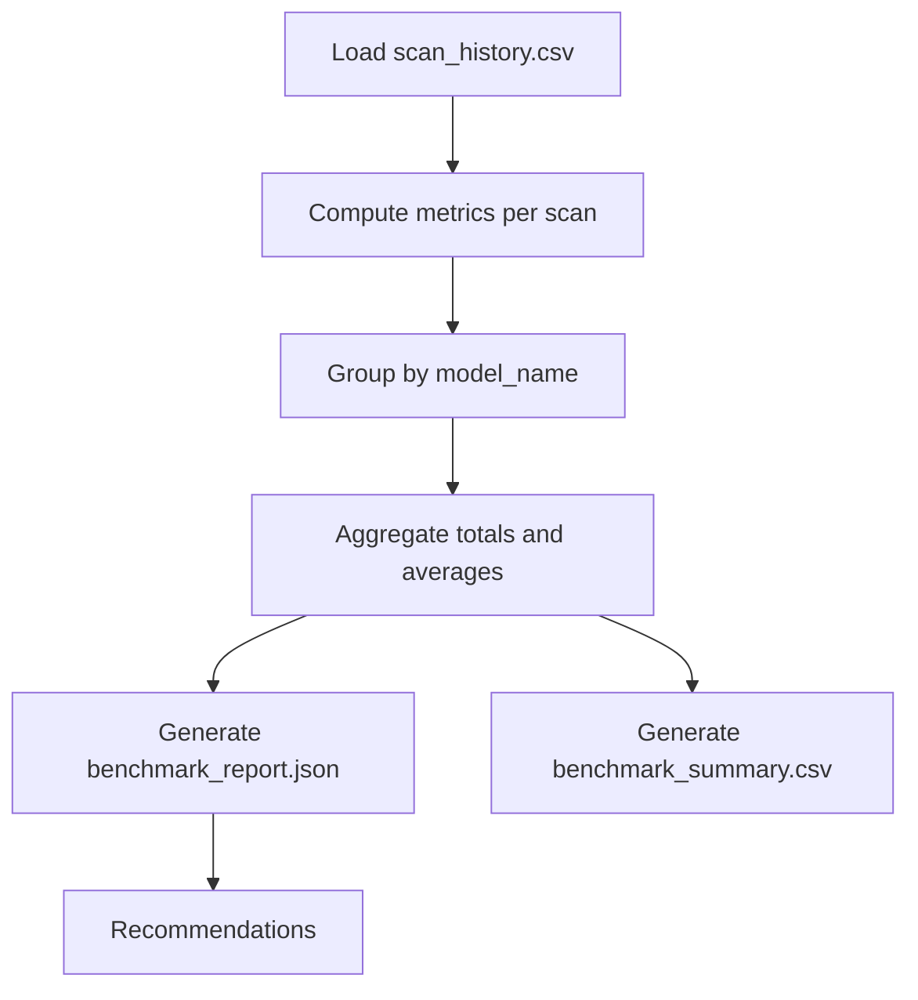
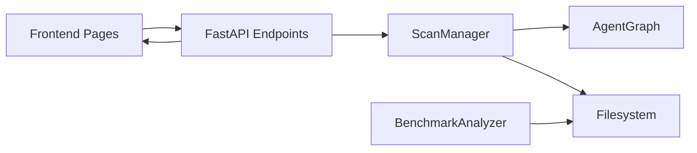

# Scan Replay & Benchmarking

<cite>
**Referenced Files in This Document**
- [app/scan_manager.py](file://app/scan_manager.py)
- [app/main.py](file://app/main.py)
- [app/agent_graph.py](file://app/agent_graph.py)
- [analyse.py](file://analyse.py)
- [app/config.py](file://app/config.py)
- [frontend/src/pages/History.jsx](file://frontend/src/pages/History.jsx)
- [frontend/src/pages/Metrics.jsx](file://frontend/src/pages/Metrics.jsx)
- [frontend/src/api/client.js](file://frontend/src/api/client.js)
- [results/runs/scan_history.csv](file://results/runs/scan_history.csv)
</cite>

## Table of Contents
1. [Introduction](#introduction)
2. [Project Structure](#project-structure)
3. [Core Components](#core-components)
4. [Architecture Overview](#architecture-overview)
5. [Detailed Component Analysis](#detailed-component-analysis)
6. [Dependency Analysis](#dependency-analysis)
7. [Performance Considerations](#performance-considerations)
8. [Troubleshooting Guide](#troubleshooting-guide)
9. [Conclusion](#conclusion)
10. [Appendices](#appendices)

## Introduction
This document explains AutoPoV's scan replay and benchmarking capabilities. It covers how to re-execute prior scans with different models or configurations (scan replay), how scan history and results are persisted and managed, and how to build and interpret benchmarking reports across models and CWE categories. It also provides practical guidance for setting up benchmarking pipelines, comparing results, detecting performance regressions, and generating optimization recommendations.

## Project Structure
AutoPoV organizes replay and benchmarking around three pillars:
- Scan orchestration and persistence: managed by the scan manager and agent graph
- Replay API: exposes endpoints to replay prior scans with new models or filters
- Benchmarking analysis: aggregates historical results and produces metrics, comparisons, and recommendations

**Diagram sources**
- [app/main.py:404-490](file://app/main.py#L404-L490)
- [app/scan_manager.py:47-233](file://app/scan_manager.py#L47-L233)
- [app/agent_graph.py:82-168](file://app/agent_graph.py#L82-L168)
- [analyse.py:39-306](file://analyse.py#L39-L306)
- [frontend/src/pages/History.jsx:1-188](file://frontend/src/pages/History.jsx#L1-L188)
- [frontend/src/pages/Metrics.jsx:1-204](file://frontend/src/pages/Metrics.jsx#L1-L204)

**Section sources**
- [app/scan_manager.py:47-233](file://app/scan_manager.py#L47-L233)
- [app/main.py:404-490](file://app/main.py#L404-L490)
- [app/agent_graph.py:82-168](file://app/agent_graph.py#L82-L168)
- [analyse.py:39-306](file://analyse.py#L39-L306)
- [frontend/src/pages/History.jsx:1-188](file://frontend/src/pages/History.jsx#L1-L188)
- [frontend/src/pages/Metrics.jsx:1-204](file://frontend/src/pages/Metrics.jsx#L1-L204)

## Core Components
- ScanManager: orchestrates scan lifecycle, persists results to JSON and CSV, manages logs, and supports replay via preloaded findings.
- AgentGraph: defines the vulnerability detection workflow and integrates CodeQL, heuristic/LM scouts, investigation, PoV generation/validation, and containerized execution.
- Replay API: accepts a prior scan ID, filters findings, detects language, and starts new scans with selected models.
- BenchmarkAnalyzer: loads historical CSV, computes metrics, compares models, and generates reports and recommendations.
- Frontend pages: History and Metrics dashboards consume API endpoints to present scan history and system metrics.

**Section sources**
- [app/scan_manager.py:47-233](file://app/scan_manager.py#L47-L233)
- [app/agent_graph.py:82-168](file://app/agent_graph.py#L82-L168)
- [app/main.py:404-490](file://app/main.py#L404-L490)
- [analyse.py:39-306](file://analyse.py#L39-L306)
- [frontend/src/pages/History.jsx:1-188](file://frontend/src/pages/History.jsx#L1-L188)
- [frontend/src/pages/Metrics.jsx:1-204](file://frontend/src/pages/Metrics.jsx#L1-L204)

## Architecture Overview
The replay and benchmarking architecture connects API endpoints, scan orchestration, persistence, and analysis.

**Diagram sources**
- [app/main.py:404-490](file://app/main.py#L404-L490)
- [app/scan_manager.py:117-212](file://app/scan_manager.py#L117-L212)
- [app/agent_graph.py:241-307](file://app/agent_graph.py#L241-L307)

## Detailed Component Analysis

### Scan Replay System
The replay system allows you to:
- Select a prior scan by ID
- Filter findings (include only confirmed or include failed)
- Limit the number of findings to replay
- Detect language from the codebase
- Start new scans with chosen models
- Persist results and maintain logs

Key behaviors:
- Preloaded findings are injected into the AgentGraph workflow to bypass CodeQL and heuristic steps.
- Snapshots are used when the original codebase is not available.
- Results are saved to JSON and appended to CSV for downstream analysis.

**Diagram sources**
- [app/main.py:404-490](file://app/main.py#L404-L490)
- [app/scan_manager.py:117-212](file://app/scan_manager.py#L117-L212)

**Section sources**
- [app/main.py:404-490](file://app/main.py#L404-L490)
- [app/scan_manager.py:117-212](file://app/scan_manager.py#L117-L212)
- [app/agent_graph.py:241-307](file://app/agent_graph.py#L241-L307)

### Scan History Management and Persistence
- JSON persistence: Each scan result is serialized to a JSON file named by scan_id.
- CSV history: A CSV tracks high-level metrics for all scans, enabling quick aggregation and reporting.
- Snapshots: Optionally preserved codebase copies enable replay even if the original source is removed.

**Diagram sources**
- [app/scan_manager.py:367-418](file://app/scan_manager.py#L367-L418)

**Section sources**
- [app/scan_manager.py:367-418](file://app/scan_manager.py#L367-L418)
- [results/runs/scan_history.csv:1-72](file://results/runs/scan_history.csv#L1-L72)

### Benchmarking Framework
The BenchmarkAnalyzer provides:
- Loading historical results from CSV
- Computing metrics per scan (detection rate, FP rate, cost per confirmed)
- Aggregating by model with averages and totals
- Generating CSV summaries and detailed JSON reports
- Producing recommendations (best detection rate, lowest FP rate, most cost-effective)

**Diagram sources**
- [analyse.py:46-306](file://analyse.py#L46-L306)

**Section sources**
- [analyse.py:46-306](file://analyse.py#L46-L306)

### Frontend Integration
- History page lists scans with status, model, confirmed findings, cost, and date, with pagination and navigation to results.
- Metrics page displays system health and key metrics (scan counts, findings, costs, durations) and allows manual refresh.

**Section sources**
- [frontend/src/pages/History.jsx:1-188](file://frontend/src/pages/History.jsx#L1-L188)
- [frontend/src/pages/Metrics.jsx:1-204](file://frontend/src/pages/Metrics.jsx#L1-L204)
- [frontend/src/api/client.js:49-78](file://frontend/src/api/client.js#L49-L78)

## Dependency Analysis
- API depends on ScanManager for replay and history retrieval.
- ScanManager depends on AgentGraph for workflow execution and on filesystem for persistence.
- BenchmarkAnalyzer depends on CSV history for analysis.
- Frontend consumes API endpoints for history, metrics, and streaming logs.

**Diagram sources**
- [app/main.py:404-490](file://app/main.py#L404-L490)
- [app/scan_manager.py:47-233](file://app/scan_manager.py#L47-L233)
- [analyse.py:39-306](file://analyse.py#L39-L306)

**Section sources**
- [app/main.py:404-490](file://app/main.py#L404-L490)
- [app/scan_manager.py:47-233](file://app/scan_manager.py#L47-L233)
- [analyse.py:39-306](file://analyse.py#L39-L306)

## Performance Considerations
- Replay reduces overhead by bypassing CodeQL and heuristic steps when using preloaded findings.
- Snapshots ensure replay availability but increase disk usage; configure retention policies to manage growth.
- CSV rebuilding and cleanup routines keep history manageable and queryable.
- Cost and duration metrics enable tracking of performance regressions across models and runs.

[No sources needed since this section provides general guidance]

## Troubleshooting Guide
Common issues and remedies:
- Replay fails due to missing findings: ensure include_failed flag if needed and verify max_findings limits.
- Codebase path unavailable: confirm snapshot exists or restore original path.
- CSV inconsistencies: trigger cleanup to rebuild scan_history.csv from JSON files.
- Frontend not loading history: verify API key, endpoint reachability, and pagination parameters.

**Section sources**
- [app/main.py:404-490](file://app/main.py#L404-L490)
- [app/scan_manager.py:512-561](file://app/scan_manager.py#L512-L561)
- [frontend/src/pages/History.jsx:1-188](file://frontend/src/pages/History.jsx#L1-L188)

## Conclusion
AutoPoV’s replay and benchmarking system enables efficient re-execution of past scans under different models or configurations, robust persistence of results, and actionable insights through aggregated metrics and recommendations. By leveraging the replay API and BenchmarkAnalyzer, teams can continuously evaluate model performance, detect regressions, and optimize scanning strategies.

[No sources needed since this section summarizes without analyzing specific files]

## Appendices

### Step-by-Step: Setting Up a Benchmarking Pipeline
1. Run scans with multiple models and target the same codebase/CWE set.
2. Verify results are persisted to JSON and CSV.
3. Use the BenchmarkAnalyzer to:
   - Generate a CSV summary for quick comparison
   - Produce a detailed JSON report with recommendations
4. Compare models by name to isolate performance differences.

**Section sources**
- [analyse.py:216-267](file://analyse.py#L216-L267)
- [analyse.py:300-306](file://analyse.py#L300-L306)

### Interpreting Benchmark Results
- Detection Rate (%): proportion of confirmed findings among total findings.
- False Positive Rate (%): proportion of skipped/failed findings misclassified as vulnerabilities.
- Cost per Confirmed ($): total cost divided by confirmed vulnerabilities.
- Average Duration (s): mean time across completed scans.

**Section sources**
- [analyse.py:72-98](file://analyse.py#L72-L98)
- [results/runs/scan_history.csv:1-72](file://results/runs/scan_history.csv#L1-L72)

### Comparative Analysis Examples
- Compare two providers (e.g., openai/gpt-4o vs anthropic/claude-3.5-sonnet) across identical CWE sets and codebases.
- Evaluate offline vs online models for cost and latency trade-offs.
- Analyze performance across different CWE categories to identify provider strengths.

**Section sources**
- [app/main.py:404-490](file://app/main.py#L404-L490)
- [analyse.py:300-306](file://analyse.py#L300-L306)

### Performance Regression Detection and Optimization Recommendations
- Track average duration and cost per scan over time; regressions appear as sustained increases.
- Use BenchmarkAnalyzer recommendations to select the best-performing model per stage (investigation, PoV).
- Tune routing mode and model selection based on historical performance stored in the learning store.

**Section sources**
- [app/scan_manager.py:604-653](file://app/scan_manager.py#L604-L653)
- [app/config.py:136-146](file://app/config.py#L136-L146)