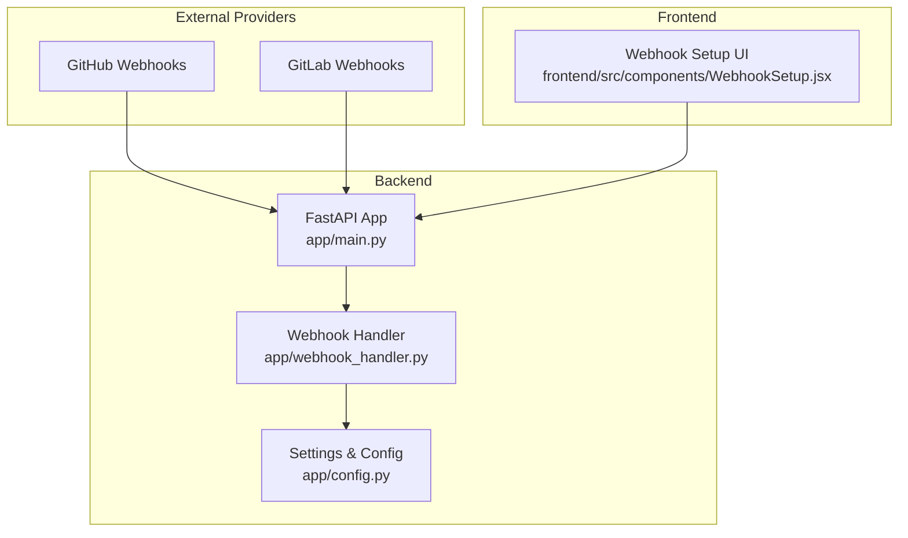
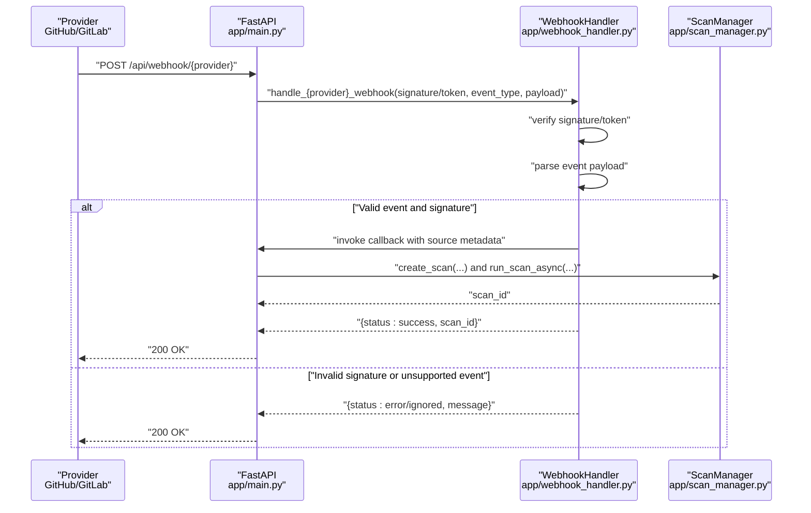
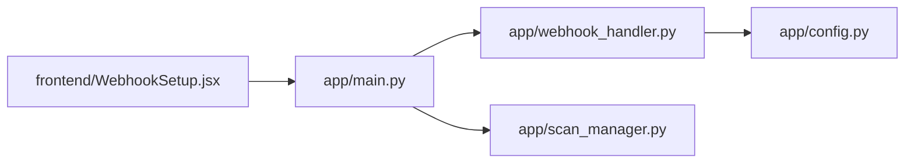

# Webhook Integration

<cite>
**Referenced Files in This Document**
- [app/webhook_handler.py](file://app/webhook_handler.py)
- [app/main.py](file://app/main.py)
- [app/config.py](file://app/config.py)
- [frontend/src/components/WebhookSetup.jsx](file://frontend/src/components/WebhookSetup.jsx)
- [tests/test_webhook_handler.py](file://tests/test_webhook_handler.py)
- [README.md](file://README.md)
</cite>

## Table of Contents
1. [Introduction](#introduction)
2. [Project Structure](#project-structure)
3. [Core Components](#core-components)
4. [Architecture Overview](#architecture-overview)
5. [Detailed Component Analysis](#detailed-component-analysis)
6. [Dependency Analysis](#dependency-analysis)
7. [Performance Considerations](#performance-considerations)
8. [Troubleshooting Guide](#troubleshooting-guide)
9. [Conclusion](#conclusion)
10. [Appendices](#appendices)

## Introduction
This document describes AutoPoV’s webhook integration system for CI/CD automation and continuous security monitoring. It explains the webhook endpoint architecture, authentication mechanisms, payload formats, supported event types, and integration patterns with CI/CD platforms. It also covers configuration, secret management, security best practices, delivery reliability, retry strategies, error handling, and integration with external monitoring systems and incident response workflows.

## Project Structure
The webhook system spans the backend API, a dedicated webhook handler, configuration management, and a frontend component that surfaces webhook setup details.

**Diagram sources**
- [app/main.py:646-688](file://app/main.py#L646-L688)
- [app/webhook_handler.py:15-363](file://app/webhook_handler.py#L15-L363)
- [app/config.py:13-255](file://app/config.py#L13-L255)
- [frontend/src/components/WebhookSetup.jsx:1-89](file://frontend/src/components/WebhookSetup.jsx#L1-L89)

**Section sources**
- [app/main.py:646-688](file://app/main.py#L646-L688)
- [app/webhook_handler.py:15-363](file://app/webhook_handler.py#L15-L363)
- [app/config.py:13-255](file://app/config.py#L13-L255)
- [frontend/src/components/WebhookSetup.jsx:1-89](file://frontend/src/components/WebhookSetup.jsx#L1-L89)

## Core Components
- Webhook Handler: Parses GitHub and GitLab events, validates signatures/tokens, extracts scan metadata, and triggers scans via a callback.
- FastAPI Endpoints: Expose GitHub and GitLab webhook endpoints with header-based authentication.
- Configuration: Stores secrets and environment-driven settings for webhook verification.
- Frontend UI: Provides webhook URLs, headers, and setup guidance.

Key responsibilities:
- Authentication: GitHub HMAC SHA-256 signature verification; GitLab token verification.
- Event Parsing: Supports push and pull_request (GitHub) and push and merge_request (GitLab).
- Callback Integration: Invokes a registered callback to start a scan with extracted metadata.
- Response: Returns structured results indicating status, message, and optional scan identifiers.

**Section sources**
- [app/webhook_handler.py:15-363](file://app/webhook_handler.py#L15-L363)
- [app/main.py:646-688](file://app/main.py#L646-L688)
- [app/config.py:69-71](file://app/config.py#L69-L71)
- [frontend/src/components/WebhookSetup.jsx:1-89](file://frontend/src/components/WebhookSetup.jsx#L1-L89)

## Architecture Overview
The webhook flow integrates with the scan lifecycle. On receiving a validated webhook, the system clones the repository (if needed) and starts a scan asynchronously.

**Diagram sources**
- [app/main.py:646-688](file://app/main.py#L646-L688)
- [app/webhook_handler.py:196-336](file://app/webhook_handler.py#L196-L336)
- [app/scan_manager.py:74-114](file://app/scan_manager.py#L74-L114)

## Detailed Component Analysis

### Webhook Handler
The WebhookHandler encapsulates:
- Signature/token verification
- Event parsing for GitHub and GitLab
- Callback registration and invocation
- Response payload creation

Supported events:
- GitHub: push, pull_request (opened, synchronize, reopened)
- GitLab: push, merge_request (open, update, reopen)

Verification:
- GitHub: HMAC SHA-256 over the raw body using the configured secret.
- GitLab: Shared secret token comparison.

Parsing:
- Extracts repository URL, branch, commit, author/pusher, and PR/MR metadata.
- Determines whether a scan should be triggered based on event type and commit validity.

Callback:
- Invoked with source_type, source_url, branch, commit, and triggered_by metadata.
- Returns a scan identifier for the initiating event.

Response:
- Standardized response with status, message, and optional scan_id and event_data.

Security:
- Uses constant-time comparison for signature and token validation.
- Requires secrets to be configured; otherwise, verification fails.

**Section sources**
- [app/webhook_handler.py:15-363](file://app/webhook_handler.py#L15-L363)
- [tests/test_webhook_handler.py:13-166](file://tests/test_webhook_handler.py#L13-L166)

### FastAPI Webhook Endpoints
Endpoints:
- POST /api/webhook/github: Validates X-Hub-Signature-256 and X-GitHub-Event headers.
- POST /api/webhook/gitlab: Validates X-Gitlab-Token and X-Gitlab-Event headers.

Behavior:
- Reads raw request body.
- Delegates to WebhookHandler.
- Returns a standardized WebhookResponse.

Integration:
- The application registers a scan callback during startup that triggers repository cloning and scan execution.

**Section sources**
- [app/main.py:646-688](file://app/main.py#L646-L688)
- [app/main.py:94-111](file://app/main.py#L94-L111)

### Configuration and Secret Management
Environment variables:
- GITHUB_WEBHOOK_SECRET: Secret used to verify GitHub signatures.
- GITLAB_WEBHOOK_SECRET: Secret used to verify GitLab tokens.

Settings:
- Stored in the Settings class and accessed globally via app/config.py.

Best practices:
- Rotate secrets regularly.
- Store secrets in secure secret managers or CI/CD secret stores.
- Restrict access to environment variables and configuration files.

**Section sources**
- [app/config.py:69-71](file://app/config.py#L69-L71)
- [app/config.py:248-255](file://app/config.py#L248-L255)

### Frontend Webhook Setup UI
The UI provides:
- Payload URLs for GitHub and GitLab endpoints.
- Secret header names for each provider.
- Setup location guidance.
- A note to configure secrets in environment variables.

**Section sources**
- [frontend/src/components/WebhookSetup.jsx:1-89](file://frontend/src/components/WebhookSetup.jsx#L1-L89)

### Event Types and Payload Formats
Supported events:
- GitHub
  - push: Triggers scan when commit is non-zero.
  - pull_request: Triggers scan on opened/synchronize/reopened.
- GitLab
  - push: Triggers scan when commit is non-zero.
  - merge_request: Triggers scan on open/update/reopen.

Parsed metadata:
- provider, event_type, timestamp
- GitHub: repo_url, repo_name, branch, commit, pusher/author, PR/MR details
- GitLab: repo_url, repo_name, branch, commit, pusher/author, MR details
- trigger_scan flag indicates whether a scan should be started

Callback payload:
- scan_id, status, timestamp, findings_count, findings, metrics

**Section sources**
- [app/webhook_handler.py:75-194](file://app/webhook_handler.py#L75-L194)
- [app/webhook_handler.py:338-353](file://app/webhook_handler.py#L338-L353)
- [tests/test_webhook_handler.py:64-143](file://tests/test_webhook_handler.py#L64-L143)

### Implementation Examples for CI/CD Platforms

#### GitHub Actions
- Configure a GitHub Actions workflow to send a webhook to AutoPoV on push or pull_request.
- Use the GitHub webhook endpoint URL and the configured GITHUB_WEBHOOK_SECRET.
- Example steps:
  - Checkout repository
  - Trigger curl or HTTP request to AutoPoV webhook endpoint with X-Hub-Signature-256 and X-GitHub-Event headers
  - Optionally parse response for scan_id

#### Jenkins
- Use the Generic Webhook Trigger plugin to listen for push and pull_request events.
- Configure a POST request to AutoPoV with:
  - Headers: X-Hub-Signature-256 (GitHub) or X-Gitlab-Token (GitLab)
  - Payload: JSON body matching provider expectations
- On successful verification, AutoPoV responds with status and scan_id.

#### GitLab CI
- Use GitLab CI job to send a webhook on push or merge request.
- Use the GitLab webhook endpoint URL and the configured GITLAB_WEBHOOK_SECRET.
- Example steps:
  - Prepare payload JSON
  - Send HTTP POST to AutoPoV with X-Gitlab-Token and X-Gitlab-Event headers
  - Capture response for logging and reporting

Note: The repository README provides general guidance for configuring webhooks in provider settings.

**Section sources**
- [README.md:386-396](file://README.md#L386-L396)

### Delivery Reliability, Retry Mechanisms, and Error Handling
Delivery reliability:
- Providers typically retry failed deliveries with exponential backoff. Configure retry policies in provider settings.
- AutoPoV returns a 200 OK response even for invalid signatures or unsupported events, with a JSON body indicating error/ignored status.

Retry mechanisms:
- Implement retries at the provider level (GitHub/GitLab) with jitter and bounded attempts.
- Consider idempotency: AutoPoV ignores duplicate commits and non-triggering events.

Error handling:
- Invalid signature/token: Returns error status with message.
- Unsupported event type: Returns ignored status with message.
- Invalid JSON payload: Returns error status with message.
- No callback registered: Returns success with message indicating no scan was triggered.

**Section sources**
- [app/webhook_handler.py:213-265](file://app/webhook_handler.py#L213-L265)
- [app/webhook_handler.py:284-336](file://app/webhook_handler.py#L284-L336)
- [tests/test_api.py:46-59](file://tests/test_api.py#L46-L59)

### Integration Patterns with External Monitoring Systems and Incident Response
- Use webhook responses to trigger downstream actions (e.g., Slack, email, ticketing systems) when scans are triggered or fail.
- Track scan_id to correlate webhook events with scan progress and results.
- Integrate with monitoring dashboards to visualize webhook throughput and error rates.
- For incident response, use the scan_id to fetch results and artifacts via the REST API.

**Section sources**
- [app/main.py:511-545](file://app/main.py#L511-L545)
- [app/main.py:646-688](file://app/main.py#L646-L688)

## Dependency Analysis
The webhook system depends on:
- FastAPI endpoints for request handling
- WebhookHandler for authentication and parsing
- Settings for secret storage
- ScanManager for triggering scans

**Diagram sources**
- [app/main.py:646-688](file://app/main.py#L646-L688)
- [app/webhook_handler.py:15-363](file://app/webhook_handler.py#L15-L363)
- [app/config.py:13-255](file://app/config.py#L13-L255)
- [frontend/src/components/WebhookSetup.jsx:1-89](file://frontend/src/components/WebhookSetup.jsx#L1-L89)

**Section sources**
- [app/main.py:646-688](file://app/main.py#L646-L688)
- [app/webhook_handler.py:15-363](file://app/webhook_handler.py#L15-L363)
- [app/config.py:13-255](file://app/config.py#L13-L255)
- [frontend/src/components/WebhookSetup.jsx:1-89](file://frontend/src/components/WebhookSetup.jsx#L1-L89)

## Performance Considerations
- Asynchronous scan execution: Webhooks trigger scans in the background to avoid blocking the request.
- Signature verification is lightweight and constant-time.
- Event parsing extracts minimal metadata needed to start a scan.

[No sources needed since this section provides general guidance]

## Troubleshooting Guide
Common issues and resolutions:
- Invalid signature/token: Ensure secrets match provider configuration and environment variables.
- Unsupported event type: Confirm that only push/pull_request (GitHub) or push/merge_request (GitLab) are selected.
- Invalid JSON payload: Validate provider payload format and content-type.
- No scan triggered: Verify that the commit is non-zero and that a callback is registered.

Testing:
- Unit tests validate signature verification, event parsing, and payload creation.

**Section sources**
- [tests/test_webhook_handler.py:13-166](file://tests/test_webhook_handler.py#L13-L166)
- [tests/test_api.py:46-59](file://tests/test_api.py#L46-L59)

## Conclusion
AutoPoV’s webhook integration enables seamless CI/CD automation and continuous security monitoring. By validating provider signatures, parsing relevant events, and triggering scans asynchronously, the system supports reliable, secure, and scalable vulnerability detection workflows. Proper configuration of secrets, robust retry strategies, and integration with monitoring systems ensure dependable operations.

[No sources needed since this section summarizes without analyzing specific files]

## Appendices

### Webhook Endpoint Reference
- GitHub: POST /api/webhook/github
  - Headers: X-Hub-Signature-256, X-GitHub-Event
  - Events: push, pull_request (opened/synchronize/reopened)
- GitLab: POST /api/webhook/gitlab
  - Headers: X-Gitlab-Token, X-Gitlab-Event
  - Events: push, merge_request (open/update/reopen)

**Section sources**
- [app/main.py:646-688](file://app/main.py#L646-L688)

### Configuration Reference
- GITHUB_WEBHOOK_SECRET: Secret for GitHub signature verification
- GITLAB_WEBHOOK_SECRET: Secret for GitLab token verification

**Section sources**
- [app/config.py:69-71](file://app/config.py#L69-L71)