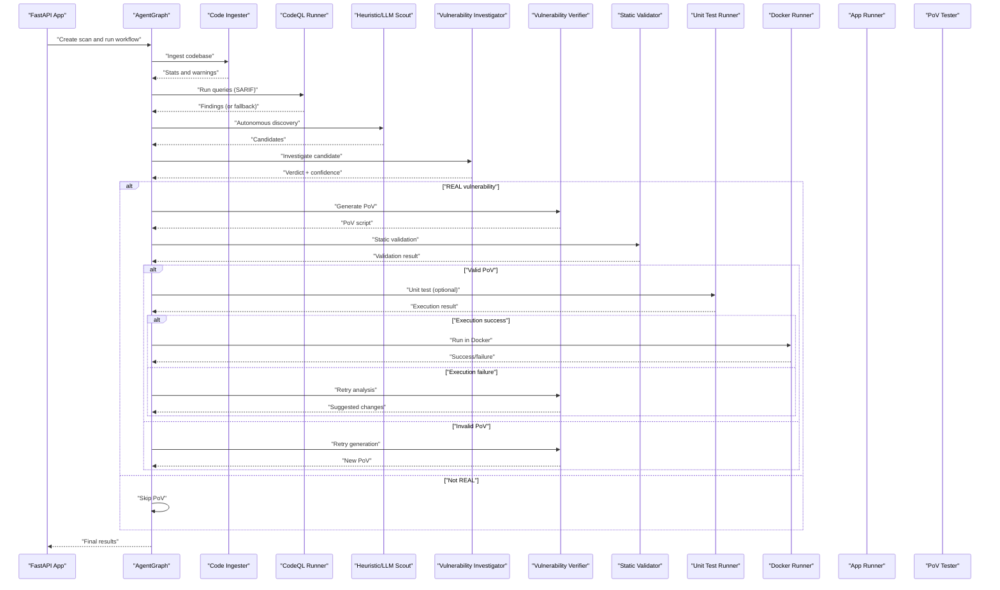
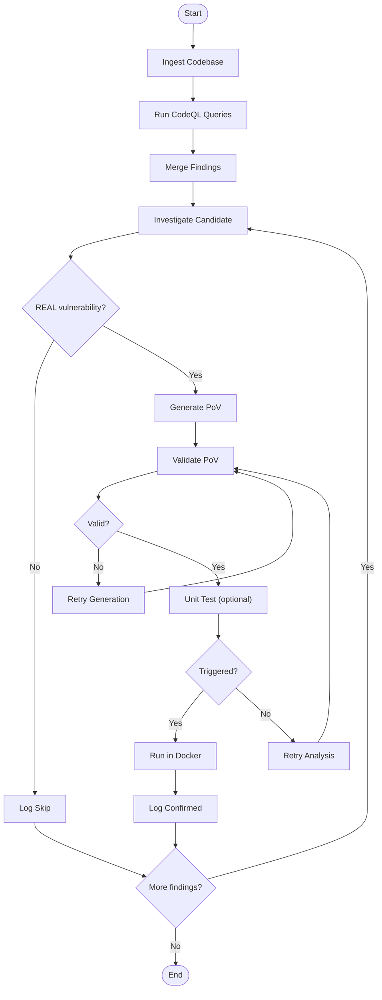
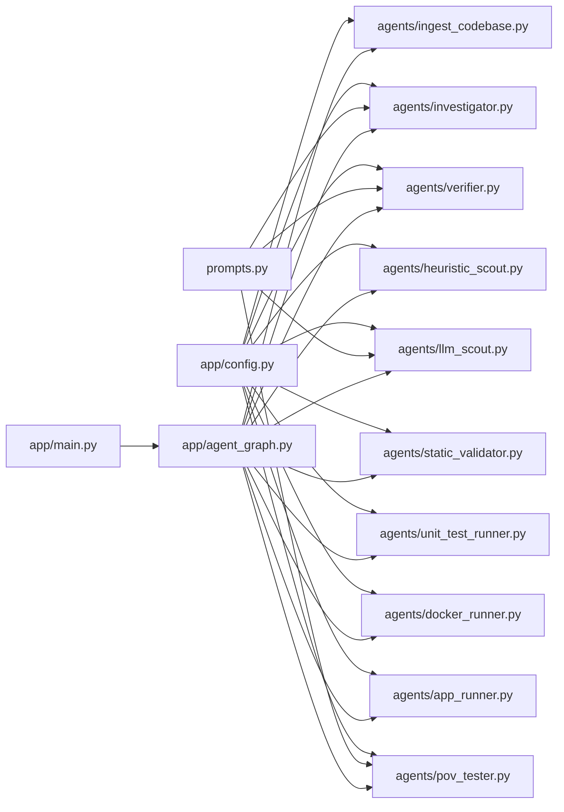

# Agent Architecture & Interface

<cite>
**Referenced Files in This Document**
- [agents/__init__.py](file://agents/__init__.py)
- [agents/app_runner.py](file://agents/app_runner.py)
- [agents/docker_runner.py](file://agents/docker_runner.py)
- [agents/heuristic_scout.py](file://agents/heuristic_scout.py)
- [agents/ingest_codebase.py](file://agents/ingest_codebase.py)
- [agents/investigator.py](file://agents/investigator.py)
- [agents/llm_scout.py](file://agents/llm_scout.py)
- [agents/pov_tester.py](file://agents/pov_tester.py)
- [agents/static_validator.py](file://agents/static_validator.py)
- [agents/unit_test_runner.py](file://agents/unit_test_runner.py)
- [agents/verifier.py](file://agents/verifier.py)
- [app/agent_graph.py](file://app/agent_graph.py)
- [app/main.py](file://app/main.py)
- [app/config.py](file://app/config.py)
- [prompts.py](file://prompts.py)
</cite>

## Table of Contents
1. [Introduction](#introduction)
2. [Project Structure](#project-structure)
3. [Core Components](#core-components)
4. [Architecture Overview](#architecture-overview)
5. [Detailed Component Analysis](#detailed-component-analysis)
6. [Dependency Analysis](#dependency-analysis)
7. [Performance Considerations](#performance-considerations)
8. [Troubleshooting Guide](#troubleshooting-guide)
9. [Conclusion](#conclusion)

## Introduction
This document describes AutoPoV’s agent architecture and interface design. It covers the common agent interface specifications, lifecycle management, shared utilities, and the LangGraph-based orchestration that coordinates vulnerability detection and PoV validation across multiple specialized agents. The focus areas include:
- Shared agent interfaces and initialization patterns
- State management and result propagation
- Communication protocols and shared state access
- Factory-style instantiation and configuration-driven creation
- Error handling, logging, and performance monitoring
- Agent-specific configuration, resource management, and cleanup

## Project Structure
AutoPoV organizes its agents under the agents/ directory, each implementing a focused capability (scouting, ingestion, investigation, PoV generation/validation, testing, and Docker execution). The orchestration layer resides in app/agent_graph.py, which defines the LangGraph workflow and manages state transitions. Configuration is centralized in app/config.py, and prompts for LLM interactions live in prompts.py. The FastAPI entry point in app/main.py exposes the system’s REST API and triggers scans.

```mermaid
graph TB
subgraph "Agents"
A1["agents/ingest_codebase.py"]
A2["agents/investigator.py"]
A3["agents/verifier.py"]
A4["agents/heuristic_scout.py"]
A5["agents/llm_scout.py"]
A6["agents/static_validator.py"]
A7["agents/unit_test_runner.py"]
A8["agents/docker_runner.py"]
A9["agents/app_runner.py"]
A10["agents/pov_tester.py"]
end
subgraph "Orchestration"
O1["app/agent_graph.py"]
end
subgraph "Configuration"
C1["app/config.py"]
C2["prompts.py"]
end
subgraph "API"
API["app/main.py"]
end
API --> O1
O1 --> A1
O1 --> A2
O1 --> A3
O1 --> A4
O1 --> A5
O1 --> A6
O1 --> A7
O1 --> A8
O1 --> A9
O1 --> A10
A1 -.uses.-> C1
A2 -.uses.-> C1
A3 -.uses.-> C1
A4 -.uses.-> C1
A5 -.uses.-> C1
A6 -.uses.-> C1
A7 -.uses.-> C1
A8 -.uses.-> C1
A9 -.uses.-> C1
A10 -.uses.-> C1
A2 -.uses.-> C2
A3 -.uses.-> C2
A5 -.uses.-> C2
A10 -.uses.-> C2
```

**Diagram sources**
- [app/agent_graph.py:82-168](file://app/agent_graph.py#L82-L168)
- [agents/__init__.py:6-20](file://agents/__init__.py#L6-L20)
- [app/config.py:13-255](file://app/config.py#L13-L255)
- [prompts.py:7-424](file://prompts.py#L7-L424)
- [app/main.py:114-122](file://app/main.py#L114-L122)

**Section sources**
- [agents/__init__.py:1-21](file://agents/__init__.py#L1-L21)
- [app/agent_graph.py:82-168](file://app/agent_graph.py#L82-L168)
- [app/config.py:13-255](file://app/config.py#L13-L255)
- [prompts.py:7-424](file://prompts.py#L7-L424)
- [app/main.py:114-122](file://app/main.py#L114-L122)

## Core Components
This section outlines the common patterns and shared utilities across agents:
- Initialization and configuration: Agents rely on app/config.py settings for runtime behavior, including model selection, resource limits, and feature toggles.
- Global singletons: Each agent exposes a global instance and a get_*() accessor for dependency injection and reuse.
- Error handling: Dedicated exception classes encapsulate domain-specific failures (e.g., CodeIngestionError, DockerRunnerError).
- Logging and tracing: Agents log progress and integrate with LangSmith via LangChainTracer when enabled.
- Result propagation: Agents return structured dictionaries with standardized fields (e.g., success, stdout/stderr, exit_code, execution_time_s, timestamp) to enable consistent downstream processing.

Key shared utilities:
- LangChain integration for LLMs (ChatOpenAI/Ollama) and embeddings (OpenAI/HuggingFace).
- Vector store integration via ChromaDB for retrieval-augmented investigation.
- Prompt templates in prompts.py for consistent LLM interactions.

**Section sources**
- [agents/ingest_codebase.py:36-94](file://agents/ingest_codebase.py#L36-L94)
- [agents/investigator.py:32-104](file://agents/investigator.py#L32-L104)
- [agents/verifier.py:37-88](file://agents/verifier.py#L37-L88)
- [agents/docker_runner.py:22-61](file://agents/docker_runner.py#L22-L61)
- [agents/static_validator.py:12-23](file://agents/static_validator.py#L12-L23)
- [agents/unit_test_runner.py:16-33](file://agents/unit_test_runner.py#L16-L33)
- [agents/app_runner.py:14-24](file://agents/app_runner.py#L14-L24)
- [agents/pov_tester.py:16-23](file://agents/pov_tester.py#L16-L23)
- [app/config.py:13-255](file://app/config.py#L13-L255)
- [prompts.py:7-424](file://prompts.py#L7-L424)

## Architecture Overview
AutoPoV uses a LangGraph-based workflow to orchestrate vulnerability detection. The workflow progresses through code ingestion, CodeQL analysis, autonomous discovery, investigation, PoV generation, validation, and execution. Each stage is represented as a node, with conditional edges determining branching based on outcomes (e.g., whether to generate a PoV or skip).



**Diagram sources**
- [app/agent_graph.py:88-168](file://app/agent_graph.py#L88-L168)
- [agents/ingest_codebase.py:207-313](file://agents/ingest_codebase.py#L207-L313)
- [agents/investigator.py:270-432](file://agents/investigator.py#L270-L432)
- [agents/verifier.py:90-223](file://agents/verifier.py#L90-L223)
- [agents/static_validator.py:123-233](file://agents/static_validator.py#L123-L233)
- [agents/unit_test_runner.py:34-116](file://agents/unit_test_runner.py#L34-L116)
- [agents/docker_runner.py:62-191](file://agents/docker_runner.py#L62-L191)
- [agents/app_runner.py:25-133](file://agents/app_runner.py#L25-L133)
- [agents/pov_tester.py:24-105](file://agents/pov_tester.py#L24-L105)

**Section sources**
- [app/agent_graph.py:82-168](file://app/agent_graph.py#L82-L168)
- [app/main.py:204-400](file://app/main.py#L204-L400)

## Detailed Component Analysis

### Agent Base Class Structure and Interfaces
While AutoPoV agents are implemented as standalone classes rather than a shared base class, they follow a consistent interface pattern:
- Initialization with configuration-dependent attributes (e.g., embedding clients, LLM clients).
- Standardized method signatures for core operations (e.g., investigate, generate_pov, validate_pov, run_pov).
- Consistent return value shapes across agents to enable uniform processing.

```mermaid
classDiagram
class CodeIngester {
+ingest_directory(directory, scan_id, progress_callback)
+retrieve_context(query, scan_id, top_k)
+get_file_content(filepath, scan_id)
+cleanup(scan_id)
}
class VulnerabilityInvestigator {
+investigate(scan_id, codebase_path, cwe_type, filepath, line_number, alert_message, model_name)
+batch_investigate(scan_id, codebase_path, alerts, progress_callback)
}
class VulnerabilityVerifier {
+generate_pov(cwe_type, filepath, line_number, vulnerable_code, explanation, code_context, target_language, model_name)
+validate_pov(pov_script, cwe_type, filepath, line_number, vulnerable_code)
+analyze_failure(cwe_type, filepath, line_number, explanation, failed_pov, execution_output, attempt_number, max_retries)
}
class StaticValidator {
+validate(pov_script, cwe_type, vulnerable_code, filepath, line_number)
+quick_validate(pov_script, cwe_type)
}
class UnitTestRunner {
+test_vulnerable_function(pov_script, vulnerable_code, cwe_type, scan_id)
+test_with_mock_data(pov_script, cwe_type, mock_inputs)
+validate_syntax(pov_script)
}
class DockerRunner {
+run_pov(pov_script, scan_id, pov_id, extra_files)
+run_with_input(pov_script, input_data, scan_id, pov_id)
+run_binary_pov(pov_script, binary_data, scan_id, pov_id)
+batch_run(pov_scripts, scan_id, progress_callback)
+get_stats()
}
class ApplicationRunner {
+start_nodejs_app(scan_id, app_path, port, start_timeout)
+stop_app(scan_id)
+get_app_url(scan_id)
+is_app_running(scan_id)
+cleanup_all()
}
class PoVTester {
+test_pov_against_app(pov_script, scan_id, cwe_type, target_url, language)
+test_with_app_lifecycle(pov_script, scan_id, cwe_type, app_path, language, app_port)
}
class HeuristicScout {
+scan_directory(codebase_path, cwes)
}
class LLMScout {
+scan_directory(codebase_path, cwes, model_name)
}
```



**Diagram sources**
- [agents/ingest_codebase.py:41-413](file://agents/ingest_codebase.py#L41-L413)
- [agents/investigator.py:37-519](file://agents/investigator.py#L37-L519)
- [agents/verifier.py:42-562](file://agents/verifier.py#L42-L562)
- [agents/static_validator.py:22-305](file://agents/static_validator.py#L22-L305)
- [agents/unit_test_runner.py:28-344](file://agents/unit_test_runner.py#L28-L344)
- [agents/docker_runner.py:27-377](file://agents/docker_runner.py#L27-L377)
- [agents/app_runner.py:19-200](file://agents/app_runner.py#L19-L200)
- [agents/pov_tester.py:21-296](file://agents/pov_tester.py#L21-L296)
- [agents/heuristic_scout.py:13-242](file://agents/heuristic_scout.py#L13-L242)
- [agents/llm_scout.py:32-208](file://agents/llm_scout.py#L32-L208)

**Section sources**
- [agents/ingest_codebase.py:41-413](file://agents/ingest_codebase.py#L41-L413)
- [agents/investigator.py:37-519](file://agents/investigator.py#L37-L519)
- [agents/verifier.py:42-562](file://agents/verifier.py#L42-L562)
- [agents/static_validator.py:22-305](file://agents/static_validator.py#L22-L305)
- [agents/unit_test_runner.py:28-344](file://agents/unit_test_runner.py#L28-L344)
- [agents/docker_runner.py:27-377](file://agents/docker_runner.py#L27-L377)
- [agents/app_runner.py:19-200](file://agents/app_runner.py#L19-L200)
- [agents/pov_tester.py:21-296](file://agents/pov_tester.py#L21-L296)
- [agents/heuristic_scout.py:13-242](file://agents/heuristic_scout.py#L13-L242)
- [agents/llm_scout.py:32-208](file://agents/llm_scout.py#L32-L208)

### Lifecycle Management and State Propagation
The orchestration layer maintains a ScanState that tracks scan-wide metadata and per-finding state. The workflow advances through nodes, updating state and logs at each step. Conditional edges route execution based on agent outcomes (e.g., skip PoV for non-REAL findings, rerun validation on failure).



**Diagram sources**
- [app/agent_graph.py:88-168](file://app/agent_graph.py#L88-L168)
- [app/agent_graph.py:691-777](file://app/agent_graph.py#L691-L777)

**Section sources**
- [app/agent_graph.py:64-80](file://app/agent_graph.py#L64-L80)
- [app/agent_graph.py:88-168](file://app/agent_graph.py#L88-L168)
- [app/agent_graph.py:691-777](file://app/agent_graph.py#L691-L777)

### Communication Protocols and Shared State Access
- Configuration-driven model selection: Agents consult app/config.py for model mode (online/offline), provider-specific settings, and routing policies.
- Prompt-driven LLM interactions: Agents use prompts.py templates to maintain consistent instruction formatting.
- Shared state access: The orchestration node methods receive and mutate ScanState, passing context (e.g., detected language, current finding index) to agents.

**Section sources**
- [app/config.py:212-231](file://app/config.py#L212-L231)
- [prompts.py:257-358](file://prompts.py#L257-L358)
- [app/agent_graph.py:708-725](file://app/agent_graph.py#L708-L725)

### Factory Patterns and Dynamic Instantiation
- Global singleton pattern: Each agent exposes a module-level instance and a get_*() function for controlled access.
- Orchestration-level composition: The AgentGraph imports and invokes agents via their get_*() accessors, enabling decoupled dependency injection.

**Section sources**
- [agents/ingest_codebase.py:406-413](file://agents/ingest_codebase.py#L406-L413)
- [agents/investigator.py:512-519](file://agents/investigator.py#L512-L519)
- [agents/verifier.py:554-562](file://agents/verifier.py#L554-L562)
- [agents/heuristic_scout.py:237-242](file://agents/heuristic_scout.py#L237-L242)
- [agents/llm_scout.py:203-208](file://agents/llm_scout.py#L203-L208)
- [agents/static_validator.py:298-305](file://agents/static_validator.py#L298-L305)
- [agents/unit_test_runner.py:337-344](file://agents/unit_test_runner.py#L337-L344)
- [agents/docker_runner.py:370-377](file://agents/docker_runner.py#L370-L377)
- [agents/app_runner.py:193-200](file://agents/app_runner.py#L193-L200)
- [agents/pov_tester.py:289-296](file://agents/pov_tester.py#L289-L296)
- [app/agent_graph.py:22-29](file://app/agent_graph.py#L22-L29)

### Agent Error Handling, Logging, and Monitoring
- Dedicated exceptions: Agents define specific exception classes to signal domain errors (e.g., DockerRunnerError, CodeIngestionError).
- Centralized logging: Agents log progress and errors; the orchestration logs scan-level events and results.
- Cost tracking: Investigator and Verifier extract token usage from LLM responses and compute costs using pricing tables.
- Tracing: Optional LangSmith integration via LangChainTracer for observability.

**Section sources**
- [agents/docker_runner.py:22-24](file://agents/docker_runner.py#L22-L24)
- [agents/ingest_codebase.py:36-38](file://agents/ingest_codebase.py#L36-L38)
- [agents/investigator.py:32-34](file://agents/investigator.py#L32-L34)
- [agents/investigator.py:434-471](file://agents/investigator.py#L434-L471)
- [agents/verifier.py:37-39](file://agents/verifier.py#L37-L39)

### Agent-Specific Configuration Options and Resource Management
- Code ingestion: Configurable chunk sizes, overlap, and ChromaDB persistence; handles binary files and skips hidden directories.
- Docker execution: Configurable image, timeout, CPU/memory limits; supports batch runs and stats retrieval.
- Application lifecycle: Node.js app startup, dependency installation, readiness checks, and termination.
- PoV testing: Supports Python and JavaScript PoVs, URL patching, and lifecycle management with app runner.
- Static validation: CWE-specific pattern matching and confidence scoring; syntax validation via AST.

**Section sources**
- [agents/ingest_codebase.py:44-58](file://agents/ingest_codebase.py#L44-L58)
- [agents/docker_runner.py:30-36](file://agents/docker_runner.py#L30-L36)
- [agents/app_runner.py:22-24](file://agents/app_runner.py#L22-L24)
- [agents/pov_tester.py:24-44](file://agents/pov_tester.py#L24-L44)
- [agents/static_validator.py:120-122](file://agents/static_validator.py#L120-L122)

### Implementation Examples and Common Patterns
- Investigation pipeline: The investigator retrieves code context, optionally augments with RAG and CPG analysis, and parses structured JSON responses.
- PoV generation and validation: The verifier generates PoV scripts using prompts, validates via static analysis and unit tests, and falls back to LLM analysis when needed.
- Autonomous discovery: Heuristic and LLM scouts produce candidate findings with confidence scores and metadata for downstream investigation.

**Section sources**
- [agents/investigator.py:270-432](file://agents/investigator.py#L270-L432)
- [agents/verifier.py:90-223](file://agents/verifier.py#L90-L223)
- [agents/heuristic_scout.py:188-234](file://agents/heuristic_scout.py#L188-L234)
- [agents/llm_scout.py:88-200](file://agents/llm_scout.py#L88-L200)

## Dependency Analysis
The agents depend on configuration and prompts, while the orchestration composes them into a cohesive workflow. The API layer triggers scans and streams results.



**Diagram sources**
- [app/config.py:13-255](file://app/config.py#L13-L255)
- [prompts.py:7-424](file://prompts.py#L7-L424)
- [app/main.py:204-400](file://app/main.py#L204-L400)
- [app/agent_graph.py:88-168](file://app/agent_graph.py#L88-L168)

**Section sources**
- [app/config.py:13-255](file://app/config.py#L13-L255)
- [prompts.py:7-424](file://prompts.py#L7-L424)
- [app/main.py:204-400](file://app/main.py#L204-L400)
- [app/agent_graph.py:88-168](file://app/agent_graph.py#L88-L168)

## Performance Considerations
- Cost control: Configuration includes maximum cost thresholds and per-agent cost estimation; token usage extraction enables precise tracking.
- Resource limits: Docker runner enforces CPU and memory constraints; ingestion batching reduces overhead.
- Parallelism: Batch operations (e.g., Docker batch_run, ingestion batching) improve throughput.
- Caching and reuse: Global agent instances reduce initialization overhead; ChromaDB collections persist across scans.

[No sources needed since this section provides general guidance]

## Troubleshooting Guide
Common issues and remedies:
- Docker not available: The DockerRunner returns predefined results and logs errors; verify DOCKER_ENABLED and connectivity.
- CodeQL not available: The orchestrator falls back to heuristic and LLM-only analysis; ensure CODEQL_CLI_PATH and packs are installed.
- LLM provider errors: Check API keys and base URLs; the agents propagate meaningful error messages.
- Ingestion failures: The orchestrator continues with warnings; inspect ChromaDB availability and embedding configuration.
- Application startup failures: The AppRunner reports timeouts and connection errors; verify ports and dependency installation.

**Section sources**
- [agents/docker_runner.py:81-90](file://agents/docker_runner.py#L81-L90)
- [app/agent_graph.py:256-262](file://app/agent_graph.py#L256-L262)
- [agents/app_runner.py:135-148](file://agents/app_runner.py#L135-L148)
- [agents/ingest_codebase.py:96-109](file://agents/ingest_codebase.py#L96-L109)

## Conclusion
AutoPoV’s agent architecture combines modular, specialized agents with a robust orchestration layer to deliver an end-to-end vulnerability detection and PoV validation pipeline. The design emphasizes configuration-driven behavior, consistent interfaces, shared utilities, and observability. The LangGraph workflow ensures predictable state transitions and resilient fallbacks, while agents’ standardized return formats simplify result aggregation and reporting.