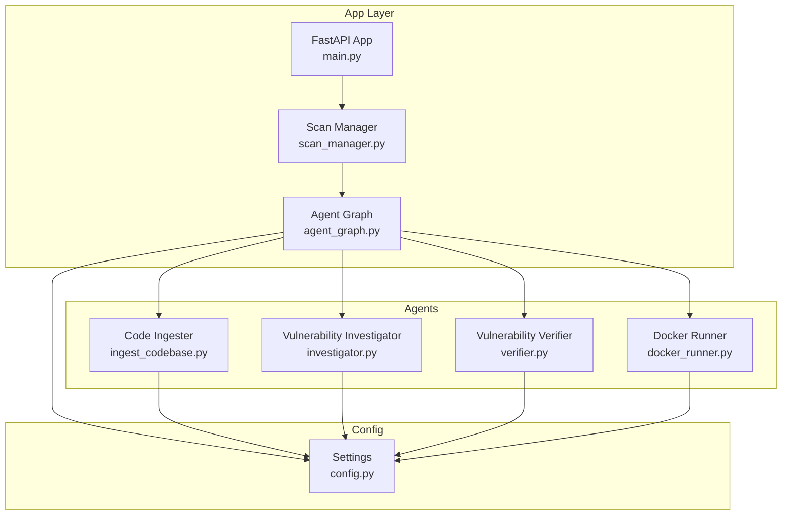
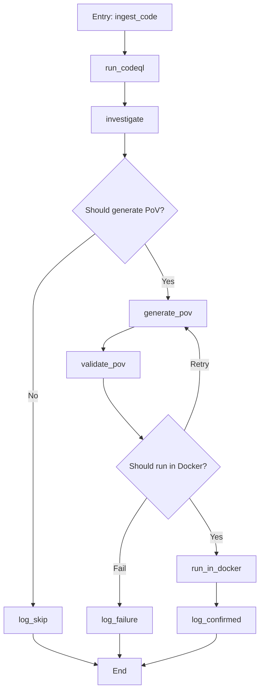
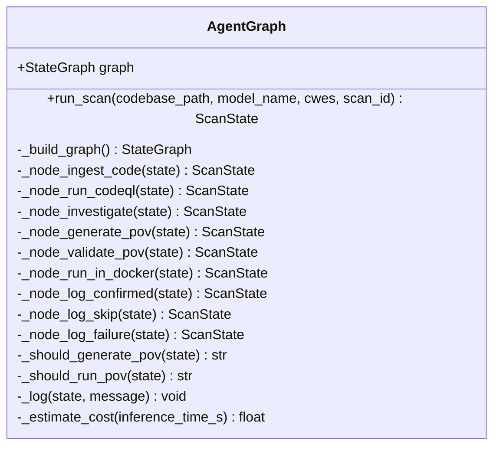
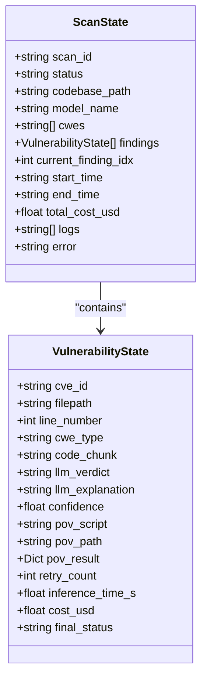
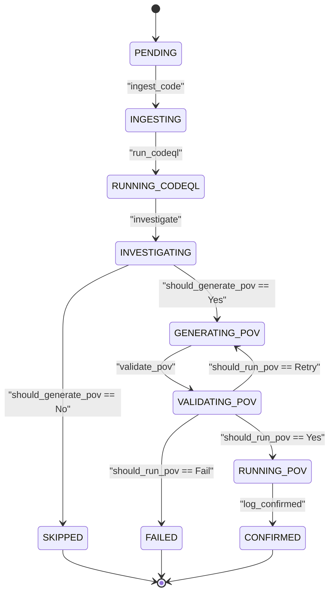
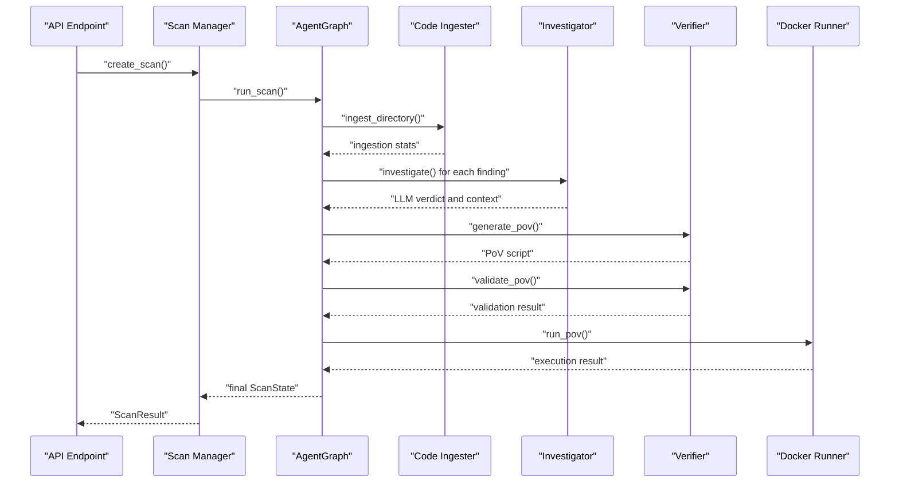
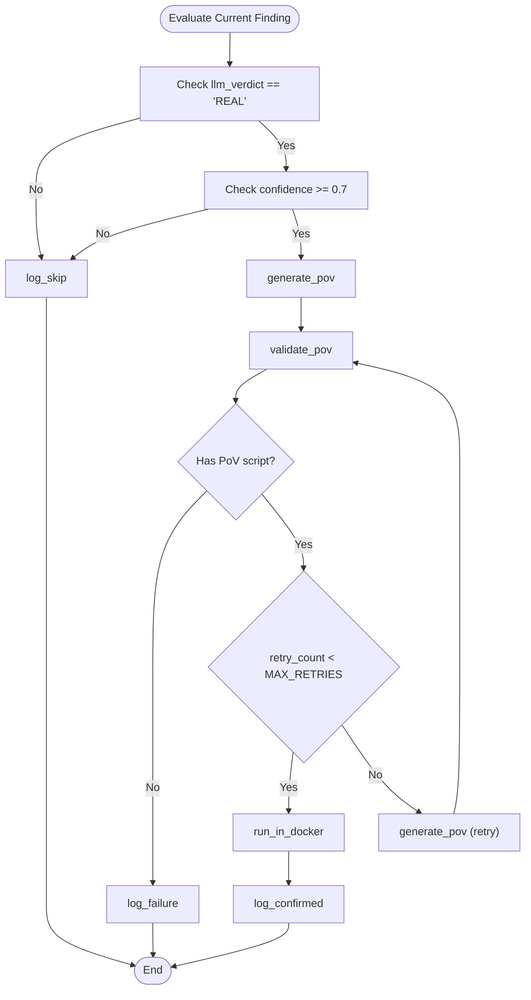
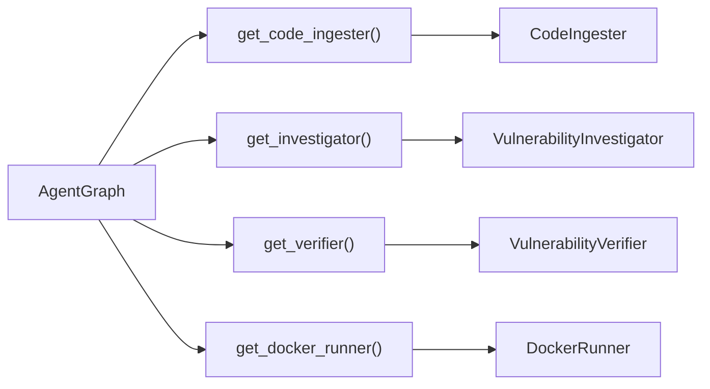
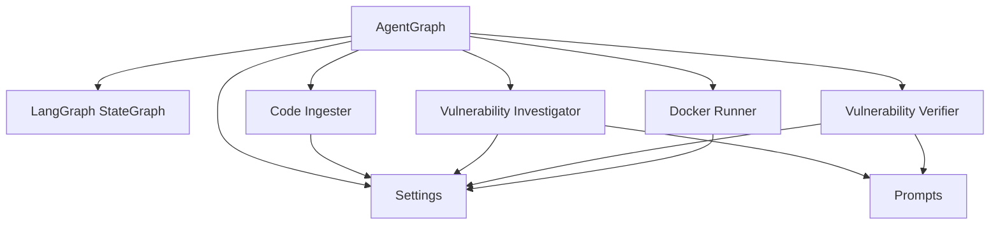

# Agent Architecture Overview

<cite>
**Referenced Files in This Document**
- [agent_graph.py](file://autopov/app/agent_graph.py)
- [config.py](file://autopov/app/config.py)
- [agents/__init__.py](file://autopov/agents/__init__.py)
- [ingest_codebase.py](file://autopov/agents/ingest_codebase.py)
- [investigator.py](file://autopov/agents/investigator.py)
- [verifier.py](file://autopov/agents/verifier.py)
- [docker_runner.py](file://autopov/agents/docker_runner.py)
- [scan_manager.py](file://autopov/app/scan_manager.py)
- [main.py](file://autopov/app/main.py)
- [prompts.py](file://autopov/prompts.py)
- [README.md](file://autopov/README.md)
</cite>

## Update Summary
**Changes Made**
- Updated to reflect the complete redesign of the scanning pipeline around a LangGraph-based agent system
- Added comprehensive documentation for the sophisticated multi-stage vulnerability detection workflow
- Enhanced coverage of automated codebase ingestion, CodeQL analysis integration, LLM-powered investigation
- Expanded documentation for PoV generation, validation, and Docker-based execution testing
- Updated state machine design with conditional branching based on confidence thresholds
- Added detailed coverage of retry mechanisms and comprehensive logging

## Table of Contents
1. [Introduction](#introduction)
2. [Project Structure](#project-structure)
3. [Core Components](#core-components)
4. [Architecture Overview](#architecture-overview)
5. [Detailed Component Analysis](#detailed-component-analysis)
6. [Dependency Analysis](#dependency-analysis)
7. [Performance Considerations](#performance-considerations)
8. [Troubleshooting Guide](#troubleshooting-guide)
9. [Conclusion](#conclusion)

## Introduction
This document explains AutoPoV's agent architecture built on LangGraph, focusing on the workflow orchestration that transforms code ingestion into autonomous Proof-of-Vulnerability (PoV) execution. The system integrates multiple specialized agents (code ingestion, investigation, verification, and Docker execution) under a centralized configuration system. It documents the state machine design, node-based processing, conditional edges, factory pattern for agent instantiation, and the global agent graph singleton. Practical examples illustrate state mutations and workflow execution patterns, along with error handling, logging, and progress tracking.

**Updated** The system now implements a sophisticated multi-stage vulnerability detection workflow with automated codebase ingestion, CodeQL analysis integration, LLM-powered investigation, PoV generation, validation, and Docker-based execution testing with conditional branching based on confidence thresholds, retry mechanisms, and comprehensive logging.

## Project Structure
AutoPoV organizes its backend around a FastAPI application that exposes REST endpoints and orchestrates scans via a LangGraph-based workflow. The agents module encapsulates specialized capabilities, while the configuration module centralizes environment-driven behavior.

**Diagram sources**
- [main.py](file://autopov/app/main.py#L105-L113)
- [scan_manager.py](file://autopov/app/scan_manager.py#L43-L49)
- [agent_graph.py](file://autopov/app/agent_graph.py#L84-L135)
- [config.py](file://autopov/app/config.py#L13-L231)

**Section sources**
- [README.md](file://autopov/README.md#L17-L35)
- [main.py](file://autopov/app/main.py#L105-L113)

## Core Components
- AgentGraph: LangGraph workflow orchestrator implementing the state machine and node-based processing.
- ScanState and VulnerabilityState: Typed dictionaries defining the workflow state and per-finding state.
- ScanStatus: Enumeration controlling workflow transitions.
- Agent factories: Global singletons for each agent type, enabling dependency injection and reuse.
- Centralized configuration: Settings class providing environment-aware configuration for models, tools, and runtime behavior.

Key implementation references:
- AgentGraph class and state machine: [agent_graph.py](file://autopov/app/agent_graph.py#L78-L135)
- State definitions: [agent_graph.py](file://autopov/app/agent_graph.py#L43-L76)
- Status enumeration: [agent_graph.py](file://autopov/app/agent_graph.py#L29-L41)
- Agent factories: [agents/__init__.py](file://autopov/agents/__init__.py#L6-L20)
- Configuration: [config.py](file://autopov/app/config.py#L13-L231)

**Section sources**
- [agent_graph.py](file://autopov/app/agent_graph.py#L29-L76)
- [agents/__init__.py](file://autopov/agents/__init__.py#L6-L20)
- [config.py](file://autopov/app/config.py#L13-L231)

## Architecture Overview
The system follows a LangGraph-based workflow where each node performs a distinct operation. Edges define the control flow, with conditional edges determining PoV generation and validation outcomes. The scan manager coordinates asynchronous execution and persists results.

**Diagram sources**
- [agent_graph.py](file://autopov/app/agent_graph.py#L84-L135)
- [agent_graph.py](file://autopov/app/agent_graph.py#L602-L629)

**Section sources**
- [agent_graph.py](file://autopov/app/agent_graph.py#L84-L135)

## Detailed Component Analysis

### AgentGraph: LangGraph Workflow Orchestrator
AgentGraph defines the state machine and implements node functions for each workflow stage. It manages:
- State transitions via ScanStatus
- Conditional edges for PoV decisions
- Logging and cost tracking
- Integration with agents via factory functions

Key behaviors:
- Node functions mutate ScanState to reflect progress and outcomes.
- Conditional edge handlers evaluate current finding and decide next steps.
- Cost estimation and logging are integrated into state updates.

Implementation highlights:
- State graph construction and edges: [agent_graph.py](file://autopov/app/agent_graph.py#L84-L135)
- Node implementations: [agent_graph.py](file://autopov/app/agent_graph.py#L136-L686)
- Conditional logic: [agent_graph.py](file://autopov/app/agent_graph.py#L602-L629)
- Run method and initial state creation: [agent_graph.py](file://autopov/app/agent_graph.py#L646-L686)

**Diagram sources**
- [agent_graph.py](file://autopov/app/agent_graph.py#L78-L696)

**Section sources**
- [agent_graph.py](file://autopov/app/agent_graph.py#L78-L696)

### State Management: ScanState and VulnerabilityState
Two TypedDict structures define the workflow state:
- ScanState: Top-level scan metadata, progress, and findings list.
- VulnerabilityState: Per-finding attributes including PoV-related fields and status.

State mutation patterns:
- Nodes update status, logs, and findings.
- current_finding_idx advances through the findings list.
- final_status captures outcome per finding.

References:
- [agent_graph.py](file://autopov/app/agent_graph.py#L43-L76)

**Diagram sources**
- [agent_graph.py](file://autopov/app/agent_graph.py#L43-L76)

**Section sources**
- [agent_graph.py](file://autopov/app/agent_graph.py#L43-L76)

### State Machine Design: ScanStatus and Transitions
ScanStatus enumerates all possible states. Transitions occur between nodes and are governed by conditional logic:
- From ingest_code to run_codeql to investigate
- Conditional from investigate to generate_pov or log_skip
- Conditional from validate_pov to run_in_docker, generate_pov (retry), or log_failure
- Terminal nodes log_confirmed, log_skip, and log_failure

References:
- [agent_graph.py](file://autopov/app/agent_graph.py#L29-L41)
- [agent_graph.py](file://autopov/app/agent_graph.py#L602-L629)

**Diagram sources**
- [agent_graph.py](file://autopov/app/agent_graph.py#L29-L41)
- [agent_graph.py](file://autopov/app/agent_graph.py#L602-L629)

**Section sources**
- [agent_graph.py](file://autopov/app/agent_graph.py#L29-L41)
- [agent_graph.py](file://autopov/app/agent_graph.py#L602-L629)

### Node-Based Processing Architecture
Each node encapsulates a specific operation:
- ingest_code: Ingest codebase into vector store and update status/logs.
- run_codeql: Execute CodeQL queries or fallback to LLM-only analysis.
- investigate: Use LLM and RAG to assess findings.
- generate_pov: Create PoV script using LLM.
- validate_pov: Validate PoV script statically and via LLM.
- run_in_docker: Execute PoV in Docker and record results.
- log_confirmed/skip/failure: Advance to next finding or finalize.

References:
- [agent_graph.py](file://autopov/app/agent_graph.py#L136-L686)

**Diagram sources**
- [agent_graph.py](file://autopov/app/agent_graph.py#L136-L686)
- [scan_manager.py](file://autopov/app/scan_manager.py#L118-L176)

**Section sources**
- [agent_graph.py](file://autopov/app/agent_graph.py#L136-L686)
- [scan_manager.py](file://autopov/app/scan_manager.py#L118-L176)

### Conditional Edge Logic
Conditional edges determine workflow branching:
- _should_generate_pov: Based on LLM verdict and confidence threshold.
- _should_run_pov: Based on PoV presence, retry count, and MAX_RETRIES.

References:
- [agent_graph.py](file://autopov/app/agent_graph.py#L602-L629)
- [config.py](file://autopov/app/config.py#L93)

**Diagram sources**
- [agent_graph.py](file://autopov/app/agent_graph.py#L602-L629)
- [config.py](file://autopov/app/config.py#L93)

**Section sources**
- [agent_graph.py](file://autopov/app/agent_graph.py#L602-L629)
- [config.py](file://autopov/app/config.py#L93)

### Factory Pattern and Global Singletons
Each agent exposes a global singleton via a factory function:
- get_code_ingester(): Returns CodeIngester instance.
- get_investigator(): Returns VulnerabilityInvestigator instance.
- get_verifier(): Returns VulnerabilityVerifier instance.
- get_docker_runner(): Returns DockerRunner instance.
- get_agent_graph(): Returns AgentGraph singleton.

This pattern enables dependency injection and consistent agent instances across the workflow.

References:
- [agents/__init__.py](file://autopov/agents/__init__.py#L6-L20)
- [agent_graph.py](file://autopov/app/agent_graph.py#L693-L696)

**Diagram sources**
- [agents/__init__.py](file://autopov/agents/__init__.py#L6-L20)
- [agent_graph.py](file://autopov/app/agent_graph.py#L693-L696)

**Section sources**
- [agents/__init__.py](file://autopov/agents/__init__.py#L6-L20)
- [agent_graph.py](file://autopov/app/agent_graph.py#L693-L696)

### Integration with Centralized Configuration
AgentGraph and agents rely on Settings for:
- Model selection (online/offline), API keys, and embedding models.
- Tool availability checks (CodeQL, Docker, Joern).
- Resource limits (MAX_RETRIES, MAX_COST_USD).
- Directory paths and persistence locations.

References:
- [agent_graph.py](file://autopov/app/agent_graph.py#L22-L26)
- [config.py](file://autopov/app/config.py#L13-L231)
- [prompts.py](file://autopov/prompts.py#L245-L374)

**Section sources**
- [agent_graph.py](file://autopov/app/agent_graph.py#L22-L26)
- [config.py](file://autopov/app/config.py#L13-L231)
- [prompts.py](file://autopov/prompts.py#L245-L374)

### Practical Examples: State Mutations and Workflow Execution
- Initial state creation and run invocation: [agent_graph.py](file://autopov/app/agent_graph.py#L646-L686)
- Ingestion node mutation: [agent_graph.py](file://autopov/app/agent_graph.py#L136-L161)
- Investigation node mutation: [agent_graph.py](file://autopov/app/agent_graph.py#L404-L439)
- PoV generation and validation: [agent_graph.py](file://autopov/app/agent_graph.py#L441-L515)
- Docker execution and terminal logging: [agent_graph.py](file://autopov/app/agent_graph.py#L517-L566)

**Section sources**
- [agent_graph.py](file://autopov/app/agent_graph.py#L646-L686)
- [agent_graph.py](file://autopov/app/agent_graph.py#L136-L161)
- [agent_graph.py](file://autopov/app/agent_graph.py#L404-L439)
- [agent_graph.py](file://autopov/app/agent_graph.py#L441-L515)
- [agent_graph.py](file://autopov/app/agent_graph.py#L517-L566)

### Error Handling, Logging, and Progress Tracking
- Logging: _log appends timestamped entries to state["logs"].
- Error propagation: Exceptions are caught, logged, and stored in state["error"].
- Cost tracking: _estimate_cost computes approximate costs based on inference time and mode.
- Progress tracking: current_finding_idx advances through findings; scan status reflects overall progress.

References:
- [agent_graph.py](file://autopov/app/agent_graph.py#L630-L645)

**Section sources**
- [agent_graph.py](file://autopov/app/agent_graph.py#L630-L645)

## Dependency Analysis
The workflow depends on:
- LangGraph for state graph construction and execution.
- Agents for specialized tasks (ingestion, investigation, verification, Docker execution).
- Configuration for runtime behavior and tool availability.
- Prompts for LLM interactions.

**Diagram sources**
- [agent_graph.py](file://autopov/app/agent_graph.py#L13-L26)
- [config.py](file://autopov/app/config.py#L13-L231)
- [prompts.py](file://autopov/prompts.py#L245-L374)

**Section sources**
- [agent_graph.py](file://autopov/app/agent_graph.py#L13-L26)
- [config.py](file://autopov/app/config.py#L13-L231)
- [prompts.py](file://autopov/prompts.py#L245-L374)

## Performance Considerations
- Asynchronous execution: ScanManager uses a thread pool executor to run scans concurrently.
- Cost control: MAX_COST_USD and cost estimation prevent runaway expenses.
- Retries: MAX_RETRIES limits repeated attempts to balance quality and latency.
- Tool availability: Availability checks reduce unnecessary failures and improve resilience.

## Troubleshooting Guide
Common issues and remedies:
- CodeQL not available: Falls back to LLM-only analysis; verify CODEQL_CLI_PATH and installation.
- Docker not available: PoV execution is skipped; verify DOCKER_ENABLED and Docker daemon.
- Joern not available: CWE-416 analysis is skipped; verify JOERN_CLI_PATH and installation.
- Missing API keys: Configure OPENROUTER_API_KEY or OLLAMA_BASE_URL depending on MODEL_MODE.
- Exceeding cost limits: Adjust MAX_COST_USD or switch to offline models.

References:
- [config.py](file://autopov/app/config.py#L144-L193)
- [agent_graph.py](file://autopov/app/agent_graph.py#L168-L173)
- [agent_graph.py](file://autopov/app/agent_graph.py#L517-L547)

**Section sources**
- [config.py](file://autopov/app/config.py#L144-L193)
- [agent_graph.py](file://autopov/app/agent_graph.py#L168-L173)
- [agent_graph.py](file://autopov/app/agent_graph.py#L517-L547)

## Conclusion
AutoPoV's LangGraph-based architecture cleanly separates concerns across specialized agents while maintaining a unified state machine. The factory pattern and global singletons enable modular composition, and the centralized configuration ensures adaptability across environments. The workflow's conditional edges and robust error handling provide resilient orchestration from code ingestion to PoV execution, with comprehensive logging and progress tracking.

**Updated** The system now implements a sophisticated multi-stage vulnerability detection workflow that integrates automated codebase ingestion, CodeQL analysis integration, LLM-powered investigation, PoV generation, validation, and Docker-based execution testing with conditional branching based on confidence thresholds, retry mechanisms, and comprehensive logging. This redesign provides a complete solution for autonomous vulnerability detection and benchmarking in industrial codebases.