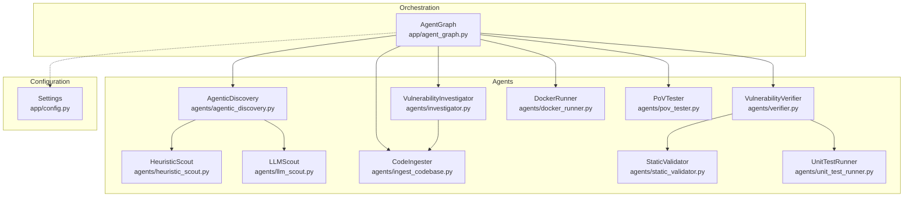
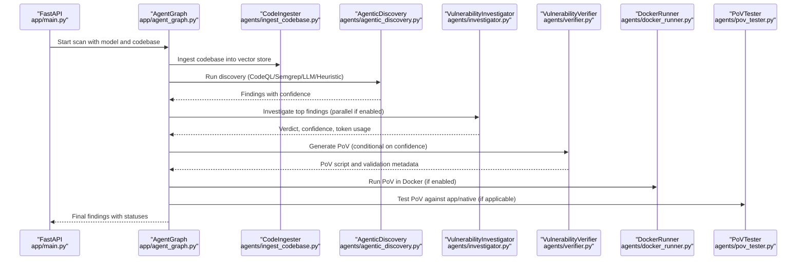
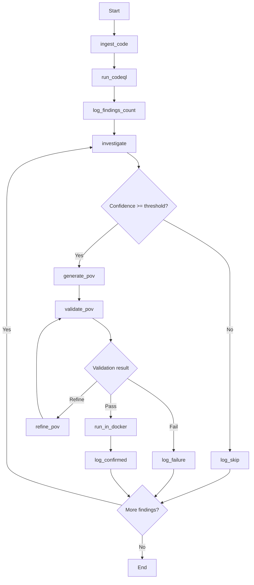
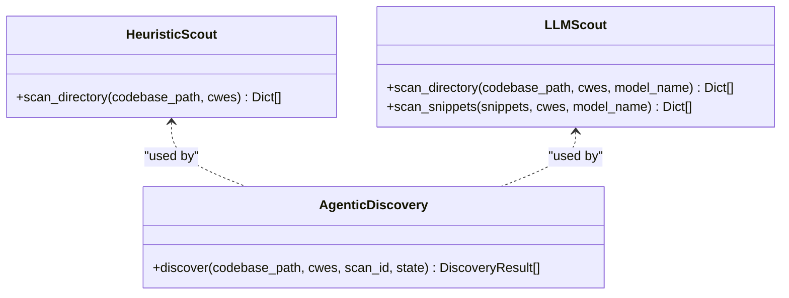
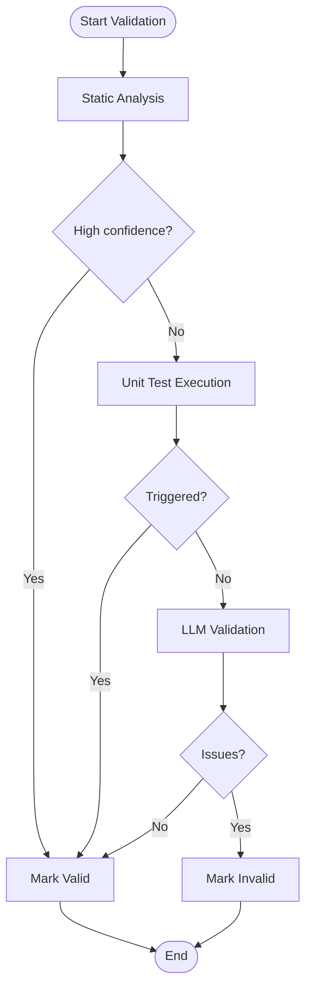
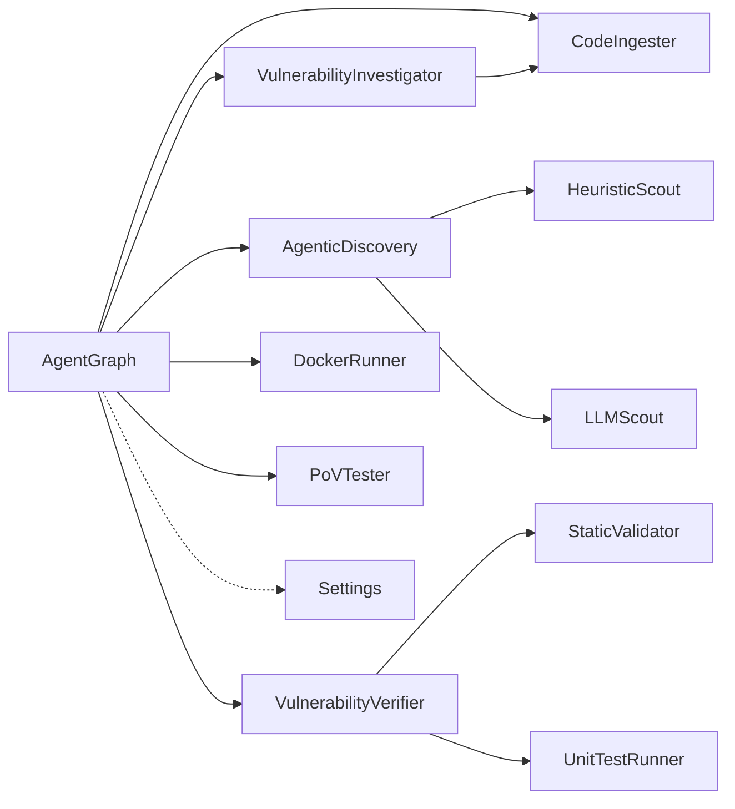

# Agent System

<cite>
**Referenced Files in This Document**
- [agents/__init__.py](file://agents/__init__.py)
- [app/agent_graph.py](file://app/agent_graph.py)
- [agents/ingest_codebase.py](file://agents/ingest_codebase.py)
- [agents/heuristic_scout.py](file://agents/heuristic_scout.py)
- [agents/llm_scout.py](file://agents/llm_scout.py)
- [agents/agentic_discovery.py](file://agents/agentic_discovery.py)
- [agents/investigator.py](file://agents/investigator.py)
- [agents/verifier.py](file://agents/verifier.py)
- [agents/docker_runner.py](file://agents/docker_runner.py)
- [agents/pov_tester.py](file://agents/pov_tester.py)
- [agents/static_validator.py](file://agents/static_validator.py)
- [agents/unit_test_runner.py](file://agents/unit_test_runner.py)
- [app/config.py](file://app/config.py)
- [app/main.py](file://app/main.py)
</cite>

## Table of Contents
1. [Introduction](#introduction)
2. [Project Structure](#project-structure)
3. [Core Components](#core-components)
4. [Architecture Overview](#architecture-overview)
5. [Detailed Component Analysis](#detailed-component-analysis)
6. [Dependency Analysis](#dependency-analysis)
7. [Performance Considerations](#performance-considerations)
8. [Troubleshooting Guide](#troubleshooting-guide)
9. [Conclusion](#conclusion)

## Introduction
This document describes AutoPoV’s multi-agent system for autonomous vulnerability discovery and validation. The system orchestrates stateful agent workflows using LangGraph to guide codebase analysis, candidate discovery, deep investigation, PoV generation, and multi-stage validation. It supports parallel processing, conditional routing based on confidence and validation outcomes, and integrates with external systems such as CodeQL, Semgrep, Docker, and LLM providers. The architecture emphasizes modularity, scalability, and self-improvement through caching and refinement loops.

## Project Structure
The agent system is organized into modular components under agents/, orchestrated by app/agent_graph.py, and configured via app/config.py. The FastAPI application in app/main.py exposes endpoints to trigger scans and manage lifecycle.

**Diagram sources**
- [app/agent_graph.py:111-228](file://app/agent_graph.py#L111-L228)
- [agents/agentic_discovery.py:50-332](file://agents/agentic_discovery.py#L50-L332)
- [agents/heuristic_scout.py:13-176](file://agents/heuristic_scout.py#L13-L176)
- [agents/llm_scout.py:33-254](file://agents/llm_scout.py#L33-L254)
- [agents/ingest_codebase.py:107-509](file://agents/ingest_codebase.py#L107-L509)
- [agents/investigator.py:38-562](file://agents/investigator.py#L38-L562)
- [agents/verifier.py:44-841](file://agents/verifier.py#L44-L841)
- [agents/static_validator.py:20-191](file://agents/static_validator.py#L20-L191)
- [agents/unit_test_runner.py:28-458](file://agents/unit_test_runner.py#L28-L458)
- [agents/docker_runner.py:29-498](file://agents/docker_runner.py#L29-L498)
- [agents/pov_tester.py:18-325](file://agents/pov_tester.py#L18-L325)
- [app/config.py:14-342](file://app/config.py#L14-L342)

**Section sources**
- [agents/__init__.py:1-21](file://agents/__init__.py#L1-L21)
- [app/agent_graph.py:1-228](file://app/agent_graph.py#L1-L228)
- [app/config.py:14-342](file://app/config.py#L14-L342)

## Core Components
- AgentGraph: LangGraph-based orchestrator managing end-to-end vulnerability pipeline with stateful nodes and conditional edges.
- Discovery Agents: HeuristicScout and LLMScout for candidate generation; AgenticDiscovery for language-aware orchestration.
- Investigator: LLM-driven deep analysis with RAG and optional native analysis via Joern.
- Verifier: Multi-stage PoV generation and validation using static, unit test, and LLM-based approaches.
- Runtime Executors: DockerRunner and PoVTester for containerized and native runtime validation.
- Infrastructure: CodeIngester for vector store ingestion and ChromaDB-backed retrieval.

**Section sources**
- [app/agent_graph.py:45-110](file://app/agent_graph.py#L45-L110)
- [agents/agentic_discovery.py:50-332](file://agents/agentic_discovery.py#L50-L332)
- [agents/heuristic_scout.py:13-176](file://agents/heuristic_scout.py#L13-L176)
- [agents/llm_scout.py:33-254](file://agents/llm_scout.py#L33-L254)
- [agents/investigator.py:38-562](file://agents/investigator.py#L38-L562)
- [agents/verifier.py:44-841](file://agents/verifier.py#L44-L841)
- [agents/docker_runner.py:29-498](file://agents/docker_runner.py#L29-L498)
- [agents/pov_tester.py:18-325](file://agents/pov_tester.py#L18-L325)
- [agents/ingest_codebase.py:107-509](file://agents/ingest_codebase.py#L107-L509)

## Architecture Overview
The system follows a LangGraph workflow with explicit state and conditional routing. The graph defines nodes for ingestion, discovery, investigation, PoV generation, validation, refinement, and runtime execution, with edges determined by confidence thresholds and validation outcomes.

**Diagram sources**
- [app/agent_graph.py:137-228](file://app/agent_graph.py#L137-L228)
- [agents/ingest_codebase.py:303-409](file://agents/ingest_codebase.py#L303-L409)
- [agents/agentic_discovery.py:269-332](file://agents/agentic_discovery.py#L269-L332)
- [agents/investigator.py:299-471](file://agents/investigator.py#L299-L471)
- [agents/verifier.py:255-357](file://agents/verifier.py#L255-L357)
- [agents/docker_runner.py:75-197](file://agents/docker_runner.py#L75-L197)
- [agents/pov_tester.py:207-320](file://agents/pov_tester.py#L207-L320)

## Detailed Component Analysis

### AgentGraph Orchestration
AgentGraph encapsulates the state machine with typed state, nodes for ingestion, discovery, investigation, PoV generation/validation, refinement, and runtime execution. It implements:
- Stateful nodes with progress tracking and token/cost accounting
- Conditional edges based on confidence thresholds and validation outcomes
- Parallel investigation for speedup
- Cancellation checks and early termination logic

**Diagram sources**
- [app/agent_graph.py:137-228](file://app/agent_graph.py#L137-L228)
- [app/agent_graph.py:532-751](file://app/agent_graph.py#L532-L751)

**Section sources**
- [app/agent_graph.py:45-110](file://app/agent_graph.py#L45-L110)
- [app/agent_graph.py:137-228](file://app/agent_graph.py#L137-L228)
- [app/agent_graph.py:532-751](file://app/agent_graph.py#L532-L751)

### Ingestion Agent (CodeIngester)
Responsibilities:
- Chunk code, compute embeddings, persist to ChromaDB
- Support online and offline embedding backends
- Retrieve context for RAG-enabled agents
- Manage per-scan collections and cleanup

Key capabilities:
- Local fallbacks (Hash, HuggingFace, Sentence Transformers)
- Batched ingestion and robust error handling
- Retrieval by query with metadata

**Section sources**
- [agents/ingest_codebase.py:107-509](file://agents/ingest_codebase.py#L107-L509)

### Scout Agents
- HeuristicScout: Lightweight pattern-based discovery across multiple CWE families
- LLMScout: LLM-powered candidate generation and triage
- AgenticDiscovery: Orchestrates CodeQL/Semgrep/LLM/Heuristic with language profiling and hybrid enforcement

**Diagram sources**
- [agents/heuristic_scout.py:13-176](file://agents/heuristic_scout.py#L13-L176)
- [agents/llm_scout.py:33-254](file://agents/llm_scout.py#L33-L254)
- [agents/agentic_discovery.py:50-332](file://agents/agentic_discovery.py#L50-L332)

**Section sources**
- [agents/heuristic_scout.py:13-176](file://agents/heuristic_scout.py#L13-L176)
- [agents/llm_scout.py:33-254](file://agents/llm_scout.py#L33-L254)
- [agents/agentic_discovery.py:269-332](file://agents/agentic_discovery.py#L269-L332)

### Investigator Agent
- Uses RAG context and optional native analysis (Joern) to produce structured vulnerability assessments
- Implements caching for confident results and cost tracking
- Supports both online (OpenRouter) and offline (Ollama) LLM modes

**Section sources**
- [agents/investigator.py:38-562](file://agents/investigator.py#L38-L562)

### Verifier Agent (PoV Generation and Validation)
Multi-stage validation pipeline:
- Static validation (patterns, contract signals, relevance)
- Unit test harness for Python/JS targets
- LLM-based validation as fallback
- Refinement loop with retry analysis

**Diagram sources**
- [agents/verifier.py:359-549](file://agents/verifier.py#L359-L549)
- [agents/static_validator.py:64-120](file://agents/static_validator.py#L64-L120)
- [agents/unit_test_runner.py:74-161](file://agents/unit_test_runner.py#L74-L161)

**Section sources**
- [agents/verifier.py:44-841](file://agents/verifier.py#L44-L841)
- [agents/static_validator.py:20-191](file://agents/static_validator.py#L20-L191)
- [agents/unit_test_runner.py:28-458](file://agents/unit_test_runner.py#L28-L458)

### Runtime Executors
- DockerRunner: Executes PoV scripts in isolated containers with configurable images and resource limits
- PoVTester: Tests PoVs against live apps, repositories, and native binaries; supports targeted harnesses and sanitizers

**Section sources**
- [agents/docker_runner.py:29-498](file://agents/docker_runner.py#L29-L498)
- [agents/pov_tester.py:18-325](file://agents/pov_tester.py#L18-L325)

### Shared Interfaces and State Management
- Typed state for vulnerability findings and scan-wide metrics
- Token and cost tracking per model and per finding
- Parallel investigation with batching and thread pooling
- Cancellation and early termination hooks

**Section sources**
- [app/agent_graph.py:45-110](file://app/agent_graph.py#L45-L110)
- [app/agent_graph.py:644-751](file://app/agent_graph.py#L644-L751)

### Tool Integration and External Systems
- CodeQL and Semgrep for static analysis
- ChromaDB for RAG
- Docker Engine for sandboxed execution
- OpenRouter/Ollama for LLM inference
- Joern for native C/C++ analysis

**Section sources**
- [agents/agentic_discovery.py:376-431](file://agents/agentic_discovery.py#L376-L431)
- [agents/ingest_codebase.py:192-217](file://agents/ingest_codebase.py#L192-L217)
- [agents/docker_runner.py:50-61](file://agents/docker_runner.py#L50-L61)
- [app/config.py:289-316](file://app/config.py#L289-L316)

### Self-Improving Learning Loop
- Analysis cache to avoid repeated LLM calls for similar code
- Refinement loop for failed PoVs with retry analysis
- Confidence-based routing to reduce unnecessary work
- Early stopping after a configurable number of confirmed findings

**Section sources**
- [agents/investigator.py:340-361](file://agents/investigator.py#L340-L361)
- [agents/verifier.py:665-725](file://agents/verifier.py#L665-L725)
- [app/agent_graph.py:230-237](file://app/agent_graph.py#L230-L237)

### Customization and Extension Points
- Add new discovery strategies in AgenticDiscovery
- Extend validators by adding new CWE-specific patterns or oracles
- Integrate new runtime harnesses in PoVTester
- Configure parallelism and cost controls via Settings
- Swap embedding backends or vector stores through CodeIngester

**Section sources**
- [agents/agentic_discovery.py:50-332](file://agents/agentic_discovery.py#L50-L332)
- [agents/static_validator.py:23-59](file://agents/static_validator.py#L23-L59)
- [agents/pov_tester.py:136-295](file://agents/pov_tester.py#L136-L295)
- [app/config.py:127-140](file://app/config.py#L127-L140)

## Dependency Analysis
The agent system exhibits layered dependencies: orchestration depends on discovery and infrastructure, while discovery depends on static analyzers and LLMs. Validators depend on static and unit test utilities, and executors depend on Docker and OS toolchains.

**Diagram sources**
- [app/agent_graph.py:137-228](file://app/agent_graph.py#L137-L228)
- [agents/__init__.py:6-19](file://agents/__init__.py#L6-L19)

**Section sources**
- [agents/__init__.py:1-21](file://agents/__init__.py#L1-L21)
- [app/agent_graph.py:137-228](file://app/agent_graph.py#L137-L228)

## Performance Considerations
- Parallel investigation reduces wall-clock time for large finding sets
- Cost control via caps on discovery and PoV generation
- Caching reduces repeated LLM calls
- Early stopping prevents unnecessary runtime execution
- Resource limits in DockerRunner mitigate runaway processes

[No sources needed since this section provides general guidance]

## Troubleshooting Guide
Common issues and remedies:
- Missing model configuration: Ensure MODEL_NAME is set and matches configured online/offline models
- Docker not available: Verify DOCKER_ENABLED and connectivity; otherwise, runtime validation will be skipped
- CodeQL/Semgrep not installed: The system gracefully falls back to LLM-based discovery
- RAG ingestion failures: Check ChromaDB availability and embedding backend configuration
- Validation failures: Use refinement loop and review static/unit test oracles

**Section sources**
- [app/config.py:277-287](file://app/config.py#L277-L287)
- [app/config.py:201-213](file://app/config.py#L201-L213)
- [agents/docker_runner.py:63-73](file://agents/docker_runner.py#L63-L73)
- [agents/ingest_codebase.py:320-322](file://agents/ingest_codebase.py#L320-L322)
- [agents/verifier.py:665-725](file://agents/verifier.py#L665-L725)

## Conclusion
AutoPoV’s multi-agent system combines robust static analysis, LLM-driven exploration, and multi-stage validation to deliver a scalable, configurable, and self-improving vulnerability discovery pipeline. The LangGraph-based orchestration enables conditional routing, parallel processing, and resilience, while modular agents and clear extension points support customization and future enhancements.