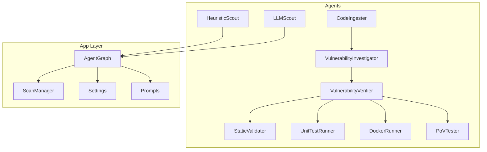
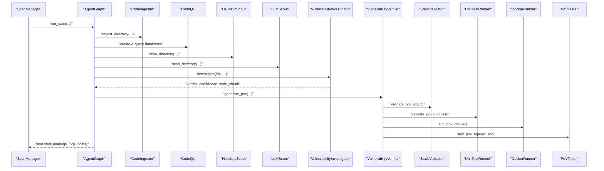
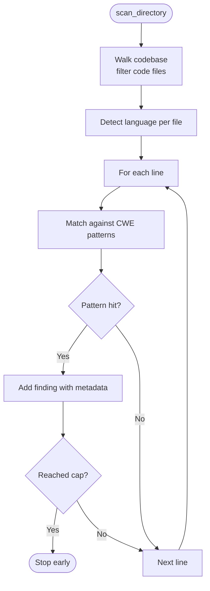
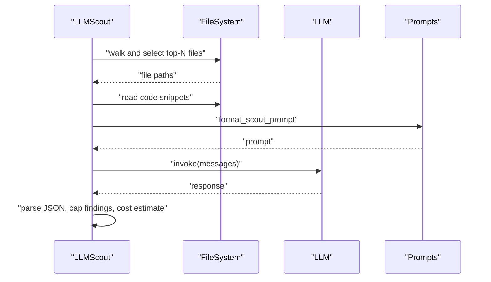
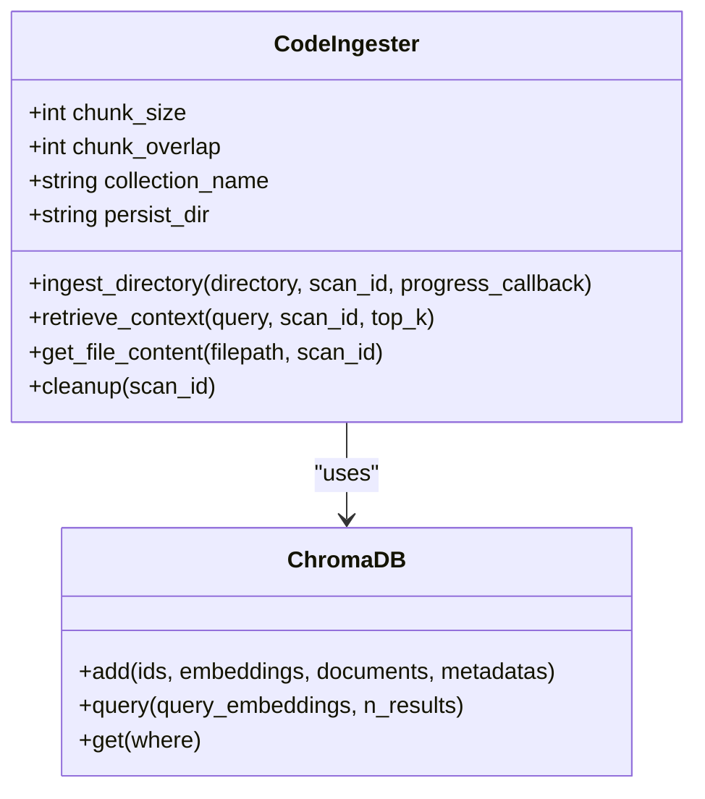
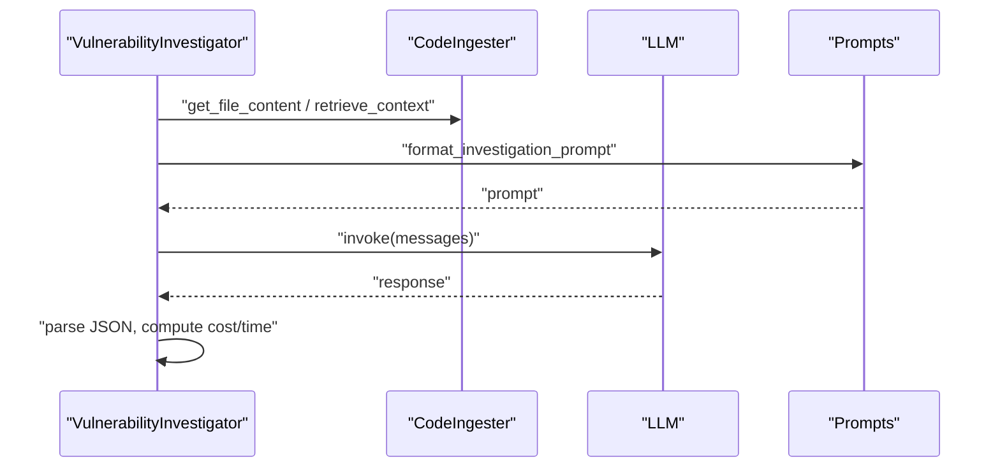
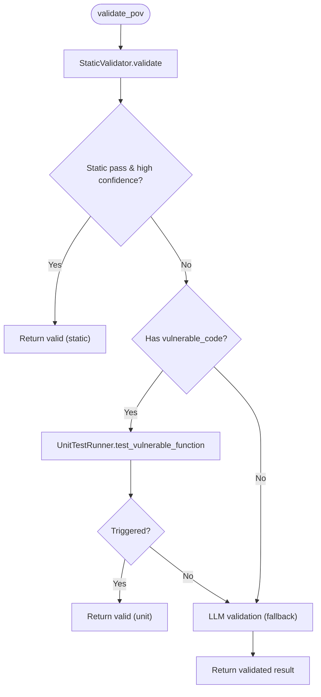
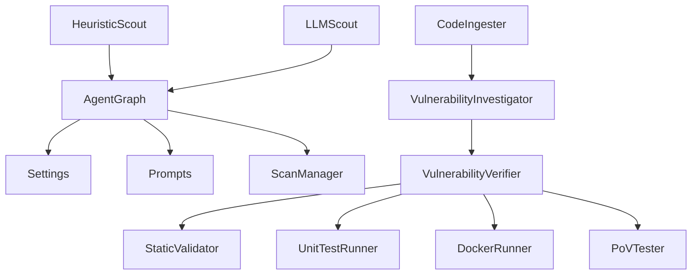

# Agent System

<cite>
**Referenced Files in This Document**
- [agents/__init__.py](file://agents/__init__.py)
- [agents/heuristic_scout.py](file://agents/heuristic_scout.py)
- [agents/llm_scout.py](file://agents/llm_scout.py)
- [agents/ingest_codebase.py](file://agents/ingest_codebase.py)
- [agents/investigator.py](file://agents/investigator.py)
- [agents/verifier.py](file://agents/verifier.py)
- [agents/static_validator.py](file://agents/static_validator.py)
- [agents/unit_test_runner.py](file://agents/unit_test_runner.py)
- [agents/docker_runner.py](file://agents/docker_runner.py)
- [agents/pov_tester.py](file://agents/pov_tester.py)
- [app/agent_graph.py](file://app/agent_graph.py)
- [app/scan_manager.py](file://app/scan_manager.py)
- [app/config.py](file://app/config.py)
- [prompts.py](file://prompts.py)
</cite>

## Table of Contents
1. [Introduction](#introduction)
2. [Project Structure](#project-structure)
3. [Core Components](#core-components)
4. [Architecture Overview](#architecture-overview)
5. [Detailed Component Analysis](#detailed-component-analysis)
6. [Dependency Analysis](#dependency-analysis)
7. [Performance Considerations](#performance-considerations)
8. [Troubleshooting Guide](#troubleshooting-guide)
9. [Conclusion](#conclusion)

## Introduction
This document describes AutoPoV’s multi-agent vulnerability detection and exploitation system. It explains each agent’s role, responsibilities, and interaction patterns within the workflow, the agent lifecycle from initialization through execution to completion, agent communication mechanisms, shared state management, and result propagation. It also covers agent interfaces, common utilities, error handling strategies, and implementation details for code ingestion, pattern-based discovery, LLM-powered reasoning, deep analysis with confidence scoring, exploit generation, and validation methods. Agent-specific configuration options, performance characteristics, and troubleshooting approaches are included.

## Project Structure
AutoPoV organizes its agents under the agents/ directory and orchestrates them via a LangGraph-based workflow in app/agent_graph.py. Supporting modules include configuration (app/config.py), prompt templates (prompts.py), and a scan lifecycle manager (app/scan_manager.py). The agents collaborate to discover, investigate, validate, and confirm vulnerabilities across codebases.

**Diagram sources**
- [agents/heuristic_scout.py:13-242](file://agents/heuristic_scout.py#L13-L242)
- [agents/llm_scout.py:32-208](file://agents/llm_scout.py#L32-L208)
- [agents/ingest_codebase.py:41-413](file://agents/ingest_codebase.py#L41-L413)
- [agents/investigator.py:37-519](file://agents/investigator.py#L37-L519)
- [agents/verifier.py:42-562](file://agents/verifier.py#L42-L562)
- [agents/static_validator.py:22-305](file://agents/static_validator.py#L22-L305)
- [agents/unit_test_runner.py:28-344](file://agents/unit_test_runner.py#L28-L344)
- [agents/docker_runner.py:27-377](file://agents/docker_runner.py#L27-L377)
- [agents/pov_tester.py:21-296](file://agents/pov_tester.py#L21-L296)
- [app/agent_graph.py:82-168](file://app/agent_graph.py#L82-L168)
- [app/scan_manager.py:47-663](file://app/scan_manager.py#L47-L663)
- [app/config.py:13-255](file://app/config.py#L13-L255)
- [prompts.py:7-424](file://prompts.py#L7-L424)

**Section sources**
- [agents/__init__.py:11-20](file://agents/__init__.py#L11-L20)
- [app/agent_graph.py:82-168](file://app/agent_graph.py#L82-L168)
- [app/scan_manager.py:47-663](file://app/scan_manager.py#L47-L663)
- [app/config.py:13-255](file://app/config.py#L13-L255)
- [prompts.py:7-424](file://prompts.py#L7-L424)

## Core Components
- HeuristicScout: Lightweight pattern-based candidate discovery across supported languages.
- LLMScout: LLM-powered candidate discovery across sampled files with cost-awareness.
- CodeIngester: Code chunking, embedding, and ChromaDB storage for RAG.
- VulnerabilityInvestigator: LLM-based deep analysis with RAG, optional Joern CPG for C/C++.
- VulnerabilityVerifier: PoV generation, hybrid validation (static, unit test, LLM), and retry analysis.
- StaticValidator: Static analysis of PoV scripts for structure and CWE-appropriate patterns.
- UnitTestRunner: Executes PoVs against isolated vulnerable code snippets in a test harness.
- DockerRunner: Executes PoVs inside Docker containers for isolation and safety.
- PoVTester: Runs PoVs against live applications and manages app lifecycle for testing.

**Section sources**
- [agents/heuristic_scout.py:13-242](file://agents/heuristic_scout.py#L13-L242)
- [agents/llm_scout.py:32-208](file://agents/llm_scout.py#L32-L208)
- [agents/ingest_codebase.py:41-413](file://agents/ingest_codebase.py#L41-L413)
- [agents/investigator.py:37-519](file://agents/investigator.py#L37-L519)
- [agents/verifier.py:42-562](file://agents/verifier.py#L42-L562)
- [agents/static_validator.py:22-305](file://agents/static_validator.py#L22-L305)
- [agents/unit_test_runner.py:28-344](file://agents/unit_test_runner.py#L28-L344)
- [agents/docker_runner.py:27-377](file://agents/docker_runner.py#L27-L377)
- [agents/pov_tester.py:21-296](file://agents/pov_tester.py#L21-L296)

## Architecture Overview
The system uses a LangGraph workflow to orchestrate agents. The workflow ingests code, optionally discovers candidates via CodeQL and autonomous scouts, investigates findings, generates and validates PoVs, and executes them in isolation or against live apps. Shared state is maintained across nodes, and results propagate through the graph with cost tracking and logging.

**Diagram sources**
- [app/agent_graph.py:170-800](file://app/agent_graph.py#L170-L800)
- [agents/ingest_codebase.py:207-313](file://agents/ingest_codebase.py#L207-L313)
- [agents/heuristic_scout.py:188-234](file://agents/heuristic_scout.py#L188-L234)
- [agents/llm_scout.py:88-200](file://agents/llm_scout.py#L88-L200)
- [agents/investigator.py:270-432](file://agents/investigator.py#L270-L432)
- [agents/verifier.py:90-387](file://agents/verifier.py#L90-L387)
- [agents/static_validator.py:123-233](file://agents/static_validator.py#L123-L233)
- [agents/unit_test_runner.py:34-116](file://agents/unit_test_runner.py#L34-L116)
- [agents/docker_runner.py:62-191](file://agents/docker_runner.py#L62-L191)
- [agents/pov_tester.py:24-105](file://agents/pov_tester.py#L24-L105)

**Section sources**
- [app/agent_graph.py:82-168](file://app/agent_graph.py#L82-L168)
- [app/scan_manager.py:117-232](file://app/scan_manager.py#L117-L232)

## Detailed Component Analysis

### HeuristicScout
- Role: Rapid, pattern-based discovery of potential vulnerabilities across supported languages.
- Responsibilities:
  - Traverse codebase and filter code files by extension.
  - Detect language per file.
  - Scan each line for patterns associated with specific CWE families.
  - Enforce maximum findings cap.
- Data structures:
  - Pattern registry keyed by CWE identifiers.
  - Finding records with fields for cwe_type, filepath, line_number, code_chunk, confidence, and metadata.
- Complexity:
  - Time: O(F × L × P) where F is files, L is lines per file, P is patterns per CWE.
  - Space: Proportional to number of findings up to cap.
- Error handling:
  - Gracefully skips unreadable files and continues scanning.
- Configuration:
  - SCOUT_MAX_FINDINGS governs cap.
- Implementation notes:
  - Uses regex patterns for common vulnerability indicators.
  - Confidence defaults to a conservative value.

**Diagram sources**
- [agents/heuristic_scout.py:188-234](file://agents/heuristic_scout.py#L188-L234)

**Section sources**
- [agents/heuristic_scout.py:13-242](file://agents/heuristic_scout.py#L13-L242)
- [app/config.py:46-52](file://app/config.py#L46-L52)

### LLMScout
- Role: LLM-powered candidate discovery across sampled files with cost control.
- Responsibilities:
  - Enumerate and sort files by size.
  - Read code snippets respecting limits.
  - Build a structured prompt and query LLM.
  - Parse JSON response into findings with confidence and rationale.
  - Estimate and enforce cost cap.
- Data structures:
  - Finding records enriched with language and reason.
- Complexity:
  - Time dominated by LLM invocation and file sampling.
  - Space proportional to sampled files and parsed findings.
- Error handling:
  - Graceful fallback when LLM unavailable or response malformed.
- Configuration:
  - SCOUT_MAX_FILES, SCOUT_MAX_CHARS_PER_FILE, SCOUT_MAX_FINDINGS, SCOUT_MAX_COST_USD.
- Implementation notes:
  - Supports online (OpenRouter) and offline (Ollama) LLM backends.
  - Uses prompts.py to format the scout prompt.

**Diagram sources**
- [agents/llm_scout.py:88-200](file://agents/llm_scout.py#L88-L200)
- [prompts.py:413-424](file://prompts.py#L413-L424)

**Section sources**
- [agents/llm_scout.py:32-208](file://agents/llm_scout.py#L32-L208)
- [app/config.py:46-52](file://app/config.py#L46-L52)
- [prompts.py:391-424](file://prompts.py#L391-L424)

### CodeIngester (RAG)
- Role: Prepare codebase for retrieval-augmented analysis.
- Responsibilities:
  - Chunk code with overlap-aware splitter.
  - Generate embeddings using online or offline providers.
  - Persist chunks to ChromaDB with scan-scoped collections.
  - Retrieve context for queries and reconstruct file content.
  - Cleanup collections after scan.
- Data structures:
  - Documents with page_content and metadata (filepath, language).
  - ChromaDB collection per scan.
- Complexity:
  - Chunking and embedding scale with file count and chunk size.
  - Retrieval O(N) per query depending on collection size.
- Error handling:
  - Raises exceptions if required libraries are missing.
- Configuration:
  - MAX_CHUNK_SIZE, CHUNK_OVERLAP, CHROMA_PERSIST_DIR, CHROMA_COLLECTION_NAME.
- Implementation notes:
  - Embedding provider selection mirrors LLM configuration.
  - Batch embedding and insertion improve throughput.

**Diagram sources**
- [agents/ingest_codebase.py:41-413](file://agents/ingest_codebase.py#L41-L413)

**Section sources**
- [agents/ingest_codebase.py:41-413](file://agents/ingest_codebase.py#L41-L413)
- [app/config.py:73-80](file://app/config.py#L73-L80)

### VulnerabilityInvestigator
- Role: Deep analysis of a single finding using LLM and RAG.
- Responsibilities:
  - Retrieve code context and optional RAG context.
  - Optionally run Joern CPG for C/C++ (CWE-416).
  - Invoke LLM with a structured prompt and parse JSON result.
  - Track inference time, token usage, and cost.
  - Support batch investigation with progress callbacks.
- Data structures:
  - Structured result with verdict, confidence, explanation, vulnerable_code, root_cause, impact.
- Complexity:
  - Dominated by LLM invocation and optional Joern execution.
- Error handling:
  - Graceful fallback to UNKNOWN verdict with error explanation.
- Configuration:
  - LLM provider selection mirrors global settings.
- Implementation notes:
  - Cost calculation uses pricing table and token usage extraction.
  - Supports tracing via LangSmith when enabled.

**Diagram sources**
- [agents/investigator.py:270-432](file://agents/investigator.py#L270-L432)
- [prompts.py:7-44](file://prompts.py#L7-L44)

**Section sources**
- [agents/investigator.py:37-519](file://agents/investigator.py#L37-L519)
- [prompts.py:7-44](file://prompts.py#L7-L44)

### VulnerabilityVerifier
- Role: Generate and validate PoVs with a hybrid approach.
- Responsibilities:
  - Generate PoV via LLM with structured prompt.
  - Validate using StaticValidator, UnitTestRunner, and optional LLM analysis.
  - Analyze failures and suggest improvements.
- Data structures:
  - PoV generation result with script, language, timing, cost, token usage.
  - Validation result with is_valid, issues, suggestions, will_trigger, and method.
- Complexity:
  - Generation depends on LLM; validation adds static and unit test phases.
- Error handling:
  - Graceful fallbacks and JSON parsing with fallback structures.
- Implementation notes:
  - Uses CWE-specific checks and standard library enforcement.
  - Supports retry analysis with structured JSON.

**Diagram sources**
- [agents/verifier.py:225-387](file://agents/verifier.py#L225-L387)
- [agents/static_validator.py:123-233](file://agents/static_validator.py#L123-L233)
- [agents/unit_test_runner.py:34-116](file://agents/unit_test_runner.py#L34-L116)

**Section sources**
- [agents/verifier.py:42-562](file://agents/verifier.py#L42-L562)
- [agents/static_validator.py:22-305](file://agents/static_validator.py#L22-L305)
- [agents/unit_test_runner.py:28-344](file://agents/unit_test_runner.py#L28-L344)
- [prompts.py:46-121](file://prompts.py#L46-L121)

### StaticValidator
- Role: Fast, static analysis of PoV scripts.
- Responsibilities:
  - Check presence of “VULNERABILITY TRIGGERED” indicator.
  - Verify required imports and attack patterns for specific CWEs.
  - Score relevance to vulnerable code.
  - Compute confidence and validity thresholds.
- Data structures:
  - ValidationResult with is_valid, confidence, matched_patterns, issues, details.
- Complexity:
  - Linear in script length and number of patterns.
- Error handling:
  - Graceful fallback for unknown CWEs.

**Section sources**
- [agents/static_validator.py:22-305](file://agents/static_validator.py#L22-L305)

### UnitTestRunner
- Role: Execute PoVs against isolated vulnerable code.
- Responsibilities:
  - Extract vulnerable function/context.
  - Create a test harness that loads target code and executes PoV.
  - Run in isolated subprocess with restricted environment.
  - Capture output and determine if vulnerability was triggered.
- Data structures:
  - TestResult with success, vulnerability_triggered, execution_time_s, stdout/stderr, exit_code, details.
- Complexity:
  - Deterministic per execution; constrained by timeout.
- Error handling:
  - Handles timeouts and exceptions with structured results.

**Section sources**
- [agents/unit_test_runner.py:28-344](file://agents/unit_test_runner.py#L28-L344)

### DockerRunner
- Role: Execute PoVs in Docker containers for isolation and safety.
- Responsibilities:
  - Manage Docker client, pull image if needed.
  - Run PoVs with resource limits and no network access.
  - Capture logs and determine success based on exit code and output.
  - Support batch runs with progress callbacks.
- Data structures:
  - Execution result with success, vulnerability_triggered, stdout, stderr, exit_code, execution_time_s, timestamp.
- Complexity:
  - Depends on container runtime and image availability.
- Error handling:
  - Graceful degradation when Docker is unavailable.

**Section sources**
- [agents/docker_runner.py:27-377](file://agents/docker_runner.py#L27-L377)
- [app/config.py:92-98](file://app/config.py#L92-L98)

### PoVTester
- Role: Run PoVs against live applications and manage app lifecycle.
- Responsibilities:
  - Patch PoV to use target URL.
  - Start/stop application via app runner.
  - Execute PoV against running service and interpret results.
- Data structures:
  - Test result with success, vulnerability_triggered, stdout, stderr, exit_code, execution_time_s, timestamp, target_url.
- Complexity:
  - Dependent on app startup/shutdown and PoV execution.
- Error handling:
  - Ensures app shutdown even on errors.

**Section sources**
- [agents/pov_tester.py:21-296](file://agents/pov_tester.py#L21-L296)

## Dependency Analysis
Agents depend on configuration and shared utilities. The AgentGraph coordinates agent interactions and maintains shared state. Prompts define the LLM instructions. The ScanManager orchestrates lifecycle and persistence.

**Diagram sources**
- [app/agent_graph.py:82-168](file://app/agent_graph.py#L82-L168)
- [app/scan_manager.py:47-663](file://app/scan_manager.py#L47-L663)
- [app/config.py:13-255](file://app/config.py#L13-L255)
- [prompts.py:7-424](file://prompts.py#L7-L424)

**Section sources**
- [app/agent_graph.py:82-168](file://app/agent_graph.py#L82-L168)
- [app/scan_manager.py:47-663](file://app/scan_manager.py#L47-L663)
- [app/config.py:13-255](file://app/config.py#L13-L255)
- [prompts.py:7-424](file://prompts.py#L7-L424)

## Performance Considerations
- Cost control:
  - LLMScout enforces per-scan cost caps and limits files/chars scanned.
  - Investigator and Verifier extract token usage to compute actual costs.
- Throughput:
  - CodeIngester batches embeddings and inserts to reduce overhead.
  - UnitTestRunner and DockerRunner use timeouts to bound execution.
- Scalability:
  - HeuristicScout and LLMScout provide early filtering to reduce downstream LLM calls.
  - AgentGraph loops through findings sequentially to keep memory usage bounded.
- I/O:
  - ChromaDB persistence and cleanup minimize long-term overhead.

[No sources needed since this section provides general guidance]

## Troubleshooting Guide
- Missing dependencies:
  - CodeIngester raises errors if embeddings or ChromaDB are unavailable.
  - DockerRunner raises errors if docker-py is missing or Docker is unreachable.
  - Investigator/Verifiers raise errors if LLM providers are not installed or keys are missing.
- LLM response issues:
  - Investigator and Verifier handle malformed JSON by falling back to structured defaults.
  - LLMScout falls back when response cannot be parsed.
- Execution failures:
  - UnitTestRunner and DockerRunner return structured results on timeouts and exceptions.
  - PoVTester ensures app shutdown even on errors.
- Logging and diagnostics:
  - AgentGraph logs major steps and errors.
  - ScanManager persists logs and results for later inspection.

**Section sources**
- [agents/ingest_codebase.py:36-38](file://agents/ingest_codebase.py#L36-L38)
- [agents/docker_runner.py:22-24](file://agents/docker_runner.py#L22-L24)
- [agents/investigator.py:32-34](file://agents/investigator.py#L32-L34)
- [agents/verifier.py:37-39](file://agents/verifier.py#L37-L39)
- [agents/llm_scout.py:28-29](file://agents/llm_scout.py#L28-L29)
- [app/agent_graph.py:170-176](file://app/agent_graph.py#L170-L176)
- [app/scan_manager.py:423-447](file://app/scan_manager.py#L423-L447)

## Conclusion
AutoPoV’s agent system integrates pattern-based discovery, LLM-powered reasoning, RAG-enhanced analysis, and robust validation pipelines to detect and confirm vulnerabilities. The LangGraph workflow coordinates agents, manages shared state, tracks costs, and ensures reliable execution across isolated environments. Configuration enables flexible deployment across online and offline LLM backends, while built-in safeguards protect against excessive costs and resource usage.