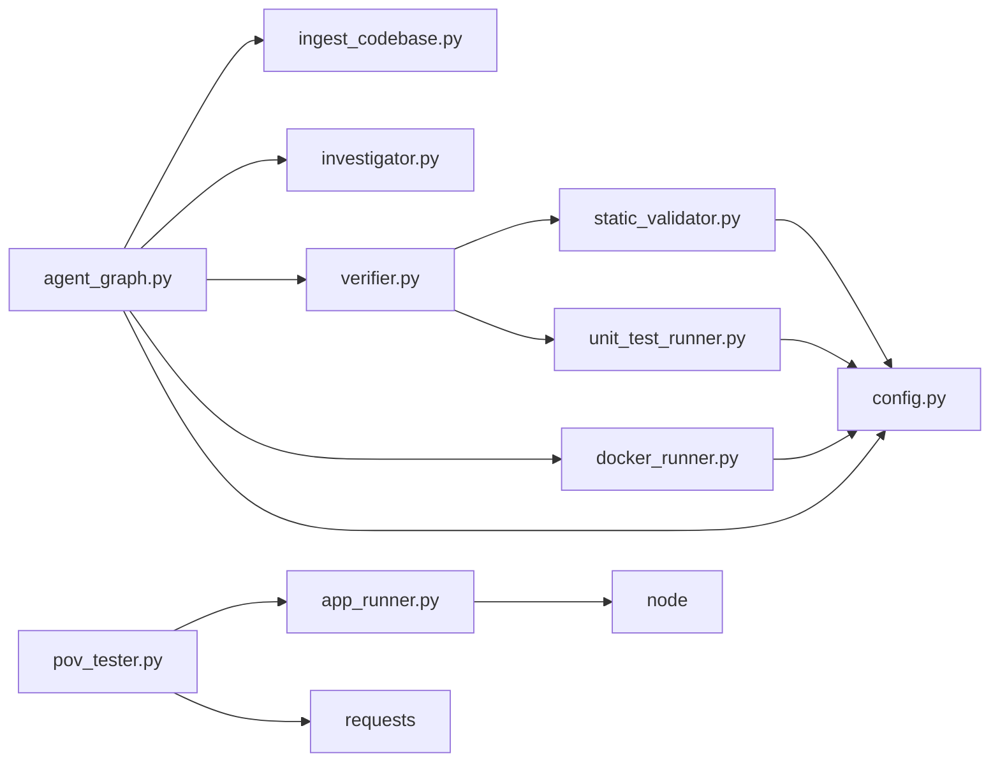

# Agent System

<cite>
**Referenced Files in This Document**
- [agent_graph.py](file://autopov/app/agent_graph.py)
- [ingest_codebase.py](file://autopov/agents/ingest_codebase.py)
- [investigator.py](file://autopov/agents/investigator.py)
- [verifier.py](file://autopov/agents/verifier.py)
- [docker_runner.py](file://autopov/agents/docker_runner.py)
- [app_runner.py](file://autopov/agents/app_runner.py)
- [pov_tester.py](file://autopov/agents/pov_tester.py)
- [static_validator.py](file://autopov/agents/static_validator.py)
- [unit_test_runner.py](file://autopov/agents/unit_test_runner.py)
- [prompts.py](file://autopov/prompts.py)
- [config.py](file://autopov/app/config.py)
- [scan_manager.py](file://autopov/app/scan_manager.py)
- [main.py](file://autopov/app/main.py)
- [README.md](file://autopov/README.md)
</cite>

## Update Summary
**Changes Made**
- Added documentation for four new specialized agent modules: Application Runner, PoV Tester, Static Validator, and Unit Test Runner
- Updated architecture overview to reflect enhanced validation workflow with hybrid approaches
- Added new agent integration patterns and workflow enhancements
- Expanded validation logic to include static analysis, unit testing, and application lifecycle management
- Integrated new agents into the LangGraph-based agent orchestration system

## Table of Contents
1. [Introduction](#introduction)
2. [Project Structure](#project-structure)
3. [Core Components](#core-components)
4. [Architecture Overview](#architecture-overview)
5. [Detailed Component Analysis](#detailed-component-analysis)
6. [Enhanced Validation Workflow](#enhanced-validation-workflow)
7. [Dependency Analysis](#dependency-analysis)
8. [Performance Considerations](#performance-considerations)
9. [Troubleshooting Guide](#troubleshooting-guide)
10. [Conclusion](#conclusion)
11. [Appendices](#appendices)

## Introduction
This document explains AutoPoV's agent system built on LangGraph. It focuses on the agent graph orchestrator, state management, conditional branching, and specialized agents: ingest_codebase (code chunking and embedding), investigator (LLM-based vulnerability analysis), verifier (PoV generation and validation), docker_runner (secure execution), app_runner (application lifecycle management), pov_tester (PoV application testing), static_validator (static code analysis validation), and unit_test_runner (isolated unit testing). It also covers prompt engineering, RAG implementation, LLM integration patterns, customization/extensibility, practical agent interactions, workflow execution, error handling, progress tracking, performance considerations, debugging, and troubleshooting.

## Project Structure
AutoPoV organizes its agent system under app and agents modules:
- app/agent_graph.py defines the LangGraph workflow and state machine
- agents/ contains specialized agents including the new validation and testing agents
- prompts.py centralizes LLM prompts
- app/config.py holds runtime configuration and environment checks
- app/scan_manager.py manages scan lifecycle and persistence
- app/main.py exposes REST endpoints that trigger scans

```mermaid
graph TB
subgraph "App Layer"
AG["agent_graph.py<br/>LangGraph Orchestrator"]
SM["scan_manager.py<br/>Scan Lifecycle"]
CFG["config.py<br/>Settings & Tool Checks"]
API["main.py<br/>REST API"]
end
subgraph "Enhanced Agent Ecosystem"
IC["ingest_codebase.py<br/>Code Ingestion + RAG"]
IV["investigator.py<br/>LLM Analysis + RAG"]
VR["verifier.py<br/>PoV Generation + Hybrid Validation"]
DR["docker_runner.py<br/>Secure Execution"]
AR["app_runner.py<br/>Application Lifecycle"]
PT["pov_tester.py<br/>PoV Application Testing"]
SV["static_validator.py<br/>Static Analysis Validation"]
UT["unit_test_runner.py<br/>Unit Test Execution"]
end
subgraph "External Integrations"
LLM["LLM Providers"]
DB["ChromaDB"]
CODEQL["CodeQL CLI"]
JOERN["Joern CLI"]
DOCKER["Docker Engine"]
NODE["Node.js Runtime"]
REQ["HTTP Requests"]
END
subgraph "Workflow Enhancements"
HYBRID["Hybrid Validation<br/>Static + Unit + LLM"]
APPL["Application Testing<br/>Node.js Apps"]
end
API --> SM
SM --> AG
AG --> IC
AG --> IV
AG --> VR
AG --> DR
VR --> SV
VR --> UT
PT --> AR
PT --> REQ
AR --> NODE
DR --> DOCKER
IV --> LLM
VR --> LLM
IC --> DB
AG --> CODEQL
AG --> JOERN
```

**Diagram sources**
- [agent_graph.py:84-134](file://autopov/app/agent_graph.py#L84-L134)
- [ingest_codebase.py:41-115](file://autopov/agents/ingest_codebase.py#L41-L115)
- [investigator.py:37-87](file://autopov/agents/investigator.py#L37-L87)
- [verifier.py:40-77](file://autopov/agents/verifier.py#L40-L77)
- [docker_runner.py:27-48](file://autopov/agents/docker_runner.py#L27-L48)
- [app_runner.py:19-200](file://autopov/agents/app_runner.py#L19-L200)
- [pov_tester.py:21-296](file://autopov/agents/pov_tester.py#L21-L296)
- [static_validator.py:22-305](file://autopov/agents/static_validator.py#L22-L305)
- [unit_test_runner.py:28-339](file://autopov/agents/unit_test_runner.py#L28-L339)
- [config.py:137-172](file://autopov/app/config.py#L137-L172)

**Section sources**
- [README.md:17-35](file://autopov/README.md#L17-L35)
- [main.py:102-117](file://autopov/app/main.py#L102-L117)

## Core Components
- Agent Graph Orchestrator: LangGraph workflow with nodes and conditional edges, managing state transitions across ingestion, analysis, PoV generation, hybrid validation, and execution.
- Enhanced Specialized Agents:
  - ingest_codebase: Code chunking, embedding, and ChromaDB storage for RAG
  - investigator: LLM-based vulnerability analysis with RAG and optional Joern CPG for CWE-416
  - verifier: PoV generation and hybrid validation with static analysis, unit testing, and LLM fallback
  - docker_runner: Secure execution of PoV scripts in isolated containers
  - app_runner: Application lifecycle management for PoV testing environments
  - pov_tester: End-to-end PoV testing against running applications
  - static_validator: Static code analysis validation for PoV scripts
  - unit_test_runner: Isolated unit testing of PoV scripts against vulnerable code
- State Management: TypedDict-based state for scan and per-finding metadata, including confidence, PoV artifacts, validation results, and cost tracking.
- Conditional Branching: Decisions based on LLM verdict/confidence thresholds, validation outcomes, and execution results.

**Section sources**
- [agent_graph.py:43-76](file://autopov/app/agent_graph.py#L43-L76)
- [agent_graph.py:101-133](file://autopov/app/agent_graph.py#L101-L133)
- [agent_graph.py:488-514](file://autopov/app/agent_graph.py#L488-L514)

## Architecture Overview
The system uses a LangGraph StateGraph to orchestrate an enhanced vulnerability detection pipeline with comprehensive validation:
- Nodes: ingest_code, run_codeql, investigate, generate_pov, validate_pov, run_in_docker, log_confirmed, log_skip, log_failure
- Enhanced Edges: sequential progression from ingestion to analysis, conditional branching to PoV generation or skipping, and conditional branching to hybrid validation, execution, regeneration, or failure logging
- State: ScanState and VulnerabilityState track progress, findings, costs, validation results, and logs

```mermaid
sequenceDiagram
participant API as "FastAPI Endpoint"
participant SM as "ScanManager"
participant AG as "AgentGraph"
participant IC as "Ingest Codebase"
participant CQ as "CodeQL"
participant IV as "Investigator"
participant VR as "Verifier"
participant SV as "Static Validator"
participant UT as "Unit Test Runner"
participant PT as "PoV Tester"
participant AR as "App Runner"
participant DR as "Docker Runner"
API->>SM : "Create scan"
SM->>AG : "run_scan(codebase_path, model, cwes)"
AG->>IC : "ingest_directory()"
IC-->>AG : "stats"
AG->>CQ : "run queries per CWE"
CQ-->>AG : "findings or fallback"
AG->>IV : "investigate(each finding)"
IV-->>AG : "verdict, confidence, code_chunk"
alt "VERDICT == REAL and CONFIDENCE >= threshold"
AG->>VR : "generate_pov()"
VR-->>AG : "pov_script"
AG->>VR : "validate_pov()"
alt "STATIC VALIDATION PASS (HIGH CONFIDENCE)"
VR->>SV : "static_validate()"
SV-->>VR : "static_result"
VR->>UT : "unit_test_runner()"
UT-->>VR : "unit_test_result"
alt "UNIT TEST CONFIRMS VULN"
VR-->>AG : "validation_result (confirmed)"
AG->>DR : "run_pov() (fallback)"
DR-->>AG : "result"
else "STATIC VALIDATION LOW CONFIDENCE"
VR->>UT : "test_vulnerable_function()"
UT-->>VR : "unit_test_result"
alt "UNIT TEST CONFIRMS VULN"
VR-->>AG : "validation_result (confirmed)"
AG->>DR : "run_pov() (fallback)"
DR-->>AG : "result"
else "UNIT TEST INCONCLUSIVE"
VR->>VR : "_llm_validate_pov() (fallback)"
VR-->>AG : "validation_result"
AG->>DR : "run_pov() (fallback)"
DR-->>AG : "result"
end
else "INVALID and retries left"
AG->>VR : "analyze_failure() (optional)"
AG->>VR : "generate_pov() (retry)"
else "INVALID and no retries left"
AG->>AG : "log_failure"
end
else "Skip"
AG->>AG : "log_skip"
end
AG-->>SM : "Final state"
SM-->>API : "Scan result"
```

**Diagram sources**
- [agent_graph.py:136-572](file://autopov/app/agent_graph.py#L136-L572)
- [scan_manager.py:86-200](file://autopov/app/scan_manager.py#L86-L200)
- [investigator.py:254-365](file://autopov/agents/investigator.py#L254-L365)
- [verifier.py:79-149](file://autopov/agents/verifier.py#L79-L149)
- [docker_runner.py:62-191](file://autopov/agents/docker_runner.py#L62-L191)
- [static_validator.py:123-233](file://autopov/agents/static_validator.py#L123-L233)
- [unit_test_runner.py:34-104](file://autopov/agents/unit_test_runner.py#L34-L104)

## Detailed Component Analysis

### Agent Graph Orchestrator
Responsibilities:
- Build and compile the LangGraph workflow
- Manage state transitions and conditional edges
- Integrate specialized agents and external tools
- Track logs, costs, and progress
- Coordinate hybrid validation workflow

Key behaviors:
- Ingestion node: calls ingest_codebase, logs warnings, handles errors
- CodeQL node: runs queries per CWE, falls back to LLM-only when unavailable
- Investigation node: calls investigator for each finding, updates state with verdict and confidence
- PoV generation/validation nodes: generate and validate PoV scripts using hybrid approach
- Enhanced Docker execution node: runs PoV in isolated containers with safety constraints
- Logging nodes: finalize statuses and advance to next finding or completion

Decision logic:
- Conditional edges:
  - From investigate: generate PoV if VERDICT == REAL and CONFIDENCE >= 0.7; otherwise skip
  - From validate_pov: run in Docker if validation inconclusive; regenerate PoV if invalid but retries remain; otherwise log failure
  - Enhanced validation routing: prioritize static analysis, then unit testing, then LLM validation

Cost tracking:
- Estimates cost based on inference time and model mode
- Tracks validation method costs separately

**Section sources**
- [agent_graph.py:84-134](file://autopov/app/agent_graph.py#L84-L134)
- [agent_graph.py:136-572](file://autopov/app/agent_graph.py#L136-L572)
- [agent_graph.py:488-514](file://autopov/app/agent_graph.py#L488-L514)

### ingest_codebase Agent
Responsibilities:
- Chunk code into overlapping segments
- Generate embeddings using configured provider (OpenAI or HuggingFace)
- Persist chunks to ChromaDB with per-scan collections
- Retrieve context for RAG and fetch full file content

Inputs/Outputs:
- Inputs: directory path, scan_id, progress callback
- Outputs: ingestion statistics (processed, skipped, chunks, errors)
- Retrieval API: query-based context and file content retrieval

RAG implementation:
- Uses RecursiveCharacterTextSplitter with language-aware separators
- Stores documents with metadata (source, filepath, language)
- Embeddings powered by configured LLM settings

Error handling:
- Raises CodeIngestionError for missing dependencies or configuration
- Skips binary and empty files
- Batches embeddings and adds to collection

**Section sources**
- [ingest_codebase.py:41-115](file://autopov/agents/ingest_codebase.py#L41-L115)
- [ingest_codebase.py:201-307](file://autopov/agents/ingest_codebase.py#L201-L307)
- [ingest_codebase.py:309-352](file://autopov/agents/ingest_codebase.py#L309-L352)

### investigator Agent
Responsibilities:
- Analyze potential vulnerabilities using LLM with RAG context
- Optionally run Joern CPG for CWE-416
- Return structured verdict with confidence, explanation, and vulnerable code

Inputs/Outputs:
- Inputs: scan_id, codebase_path, cwe_type, filepath, line_number, alert_message
- Output: structured result with inference time and metadata

Prompt engineering:
- Centralized prompts in prompts.py
- Investigation prompt composes code context, alert, and optional Joern output
- Uses LangChain ChatOpenAI or ChatOllama depending on settings

RAG integration:
- Retrieves related code chunks for context
- Builds code context around the target line

Joern integration:
- Runs CPG creation and queries for use-after-free patterns when applicable

**Section sources**
- [investigator.py:37-87](file://autopov/agents/investigator.py#L37-L87)
- [investigator.py:254-365](file://autopov/agents/investigator.py#L254-L365)
- [prompts.py:7-43](file://autopov/prompts.py#L7-L43)

### verifier Agent
Responsibilities:
- Generate PoV scripts from vulnerability details and context
- Validate PoV scripts using hybrid approach: static analysis, unit testing, and LLM fallback
- Optionally use LLM to assess validity and suggest improvements

Enhanced Validation Workflow:
- **Step 1: Static Analysis** - Fast validation using static_validator
- **Step 2: Unit Testing** - Execute PoV against isolated vulnerable code using unit_test_runner
- **Step 3: LLM Validation** - Advanced analysis using LLM as fallback
- **Step 4: Docker Execution** - Final fallback execution in isolated containers

Inputs/Outputs:
- Generation inputs: cwe_type, filepath, line_number, vulnerable_code, explanation, code_context
- Generation output: PoV script and timing
- Validation inputs: PoV script, cwe_type, filepath, line_number, vulnerable_code
- Validation output: comprehensive validation result with method, confidence, and suggestions

Prompt engineering:
- PoV generation prompt enforces standard library usage and deterministic behavior
- PoV validation prompt instructs structured JSON validation
- Retry analysis prompt helps improve failed PoVs

Validation logic:
- AST-based syntax validation
- Standard library import restriction
- CWE-specific heuristics
- Optional LLM-based validation

**Section sources**
- [verifier.py:40-77](file://autopov/agents/verifier.py#L40-L77)
- [verifier.py:79-149](file://autopov/agents/verifier.py#L79-L149)
- [verifier.py:151-227](file://autopov/agents/verifier.py#L151-L227)
- [verifier.py:225-387](file://autopov/agents/verifier.py#L225-L387)
- [prompts.py:46-108](file://autopov/prompts.py#L46-L108)

### docker_runner Agent
Responsibilities:
- Execute PoV scripts in isolated Docker containers
- Enforce safety constraints (no network, memory/CPU limits, timeouts)
- Capture stdout/stderr and determine if vulnerability was triggered

Inputs/Outputs:
- Inputs: PoV script, scan_id, pov_id, optional extra files
- Output: execution result with success flag, exit code, stdout/stderr, trigger indicator

Safety:
- No network access
- Memory and CPU quotas
- Timeout protection
- Cleanup of temp directories and containers

**Section sources**
- [docker_runner.py:27-48](file://autopov/agents/docker_runner.py#L27-L48)
- [docker_runner.py:62-191](file://autopov/agents/docker_runner.py#L62-L191)

### New Specialized Agents

#### Application Runner
Responsibilities:
- Manage target application lifecycle for PoV testing
- Support Node.js applications with automatic dependency installation
- Handle application startup, monitoring, and cleanup
- Provide URL access to running applications

Key Features:
- **Automatic Dependency Management**: Installs npm dependencies if node_modules doesn't exist
- **Health Monitoring**: Validates application readiness before testing
- **Process Management**: Tracks running applications and ensures cleanup
- **Port Configuration**: Supports configurable application ports

Inputs/Outputs:
- Inputs: scan_id, app_path, port, start_timeout
- Output: application status with URL, process handle, and error information

Lifecycle Management:
- start_nodejs_app(): Starts Node.js applications with automatic setup
- stop_app(): Graceful shutdown with process termination
- get_app_url(): Retrieve application URL for testing
- is_app_running(): Monitor application health
- cleanup_all(): System-wide cleanup

**Section sources**
- [app_runner.py:19-200](file://autopov/agents/app_runner.py#L19-L200)

#### PoV Tester
Responsibilities:
- Test PoV scripts against running applications
- Support both Python and JavaScript PoV scripts
- Handle application lifecycle integration
- Validate vulnerability triggers and capture execution results

Enhanced Testing Capabilities:
- **Multi-language Support**: Handles both Python and JavaScript PoV scripts
- **URL Patching**: Automatically replaces target URLs in PoV scripts
- **Application Integration**: Seamlessly integrates with app_runner for lifecycle management
- **Execution Monitoring**: Captures stdout, stderr, and exit codes

Testing Methods:
- **Direct Testing**: test_pov_against_app(): Tests PoV against existing application
- **Full Lifecycle**: test_with_app_lifecycle(): Start app, test PoV, stop app
- **URL Replacement**: Automatic target URL patching for different environments

Execution Results:
- Success/failure tracking with detailed error information
- Vulnerability trigger detection from output
- Execution time measurement and timestamping
- Comprehensive result reporting

**Section sources**
- [pov_tester.py:21-296](file://autopov/agents/pov_tester.py#L21-L296)

#### Static Validator
Responsibilities:
- Validate PoV scripts using static code analysis without execution
- Provide fast validation feedback for PoV scripts
- Support multiple CWE types with specific validation patterns
- Generate confidence scores for validation results

Advanced Static Analysis:
- **Pattern Matching**: CWE-specific regex patterns for attack vectors
- **Import Validation**: Ensures only standard library imports are used
- **Payload Detection**: Identifies attack payload indicators
- **Code Relevance**: Measures relationship between PoV and vulnerable code

Validation Categories:
- **Required Imports**: Validates presence of necessary imports for CWE type
- **Attack Patterns**: Detects common attack patterns for specific CWEs
- **Payload Indicators**: Identifies potential attack payloads
- **Vulnerability Check**: Ensures PoV contains trigger indicators

Confidence Calculation:
- Base score with pattern matching contributions
- Vulnerability check bonus points
- Code relevance scoring
- Issue penalty deductions
- Final confidence normalization (0.0-1.0)

**Section sources**
- [static_validator.py:22-305](file://autopov/agents/static_validator.py#L22-L305)

#### Unit Test Runner
Responsibilities:
- Execute PoV scripts against isolated vulnerable code snippets
- Provide controlled testing environment for PoV validation
- Support both real vulnerable code and mock data testing
- Generate comprehensive test execution reports

Testing Framework:
- **Isolated Execution**: Executes PoV in sandboxed environment
- **Function Extraction**: Extracts vulnerable functions from code snippets
- **Test Harness Creation**: Builds secure test harness for execution
- **Mock Data Support**: Tests PoV with various mock input scenarios

Execution Methods:
- **Real Code Testing**: test_vulnerable_function(): Tests against actual vulnerable code
- **Mock Testing**: test_with_mock_data(): Tests with predefined mock inputs
- **Syntax Validation**: validate_syntax(): Pre-execution syntax checking
- **Isolated Execution**: _run_isolated_test(): Controlled execution environment

Test Results:
- Success/failure determination based on exit codes
- Vulnerability trigger detection from output
- Execution time measurement and resource usage
- Comprehensive error reporting and debugging information

**Section sources**
- [unit_test_runner.py:28-339](file://autopov/agents/unit_test_runner.py#L28-L339)

### Workflow Orchestration, State Transitions, and Progress Tracking
State model:
- ScanState: overall scan metadata, status, findings list, current finding index, timestamps, logs, error
- VulnerabilityState: per-finding metadata including verdict, confidence, PoV artifacts, validation results, retry count, cost, final status

Enhanced Transitions:
- Sequential: ingest_code → run_codeql → investigate
- Conditional: investigate → generate_pov or log_skip
- Enhanced Conditional: validate_pov → hybrid validation workflow
- Hybrid Validation: static_analysis → unit_test → docker_execution → confirmation
- Terminal: log_confirmed, log_skip, log_failure → END

Progress tracking:
- Logs appended per node with enhanced validation details
- Cost estimated per inference and aggregated
- Validation method tracking for performance analysis
- Final status set to completed when all findings processed

**Section sources**
- [agent_graph.py:43-76](file://autopov/app/agent_graph.py#L43-L76)
- [agent_graph.py:136-572](file://autopov/app/agent_graph.py#L136-L572)

### Enhanced Validation Workflow
The verifier agent implements a sophisticated hybrid validation approach:

**Phase 1: Static Analysis (Priority)**
- Fast validation using static_validator
- CWE-specific pattern matching and import validation
- Confidence scoring for quick decisions
- Immediate pass/fail determination when confidence ≥ 0.8

**Phase 2: Unit Testing (Conditional)**
- Executes PoV against isolated vulnerable code
- Syntax validation before execution
- Deterministic vulnerability trigger detection
- Real-world validation with controlled environment

**Phase 3: LLM Validation (Fallback)**
- Advanced analysis when other methods are inconclusive
- Context-aware validation with CWE-specific knowledge
- Suggestion generation for improvements
- Final decision-making capability

**Integration Points:**
- Static validation provides immediate feedback
- Unit testing confirms practical exploitability
- LLM validation serves as comprehensive fallback
- Docker execution remains as ultimate fallback

**Section sources**
- [verifier.py:225-387](file://autopov/agents/verifier.py#L225-L387)
- [static_validator.py:123-233](file://autopov/agents/static_validator.py#L123-L233)
- [unit_test_runner.py:34-104](file://autopov/agents/unit_test_runner.py#L34-L104)

### Prompt Engineering, RAG Implementation, and LLM Integration Patterns
Prompt engineering:
- Centralized prompts in prompts.py for investigation, PoV generation, validation, and retry analysis
- Structured JSON expectations to simplify parsing

RAG implementation:
- ingest_codebase stores chunks with metadata and embeddings
- investigator retrieves context for both primary code and CWE patterns
- retriever supports top-k retrieval and distance metrics

LLM integration patterns:
- Online mode via OpenRouter (ChatOpenAI) or offline via Ollama (ChatOllama)
- Temperature tuned for deterministic reasoning
- Optional LangSmith tracing via settings

**Section sources**
- [prompts.py:7-210](file://autopov/prompts.py#L7-L210)
- [ingest_codebase.py:309-352](file://autopov/agents/ingest_codebase.py#L309-L352)
- [investigator.py:50-87](file://autopov/agents/investigator.py#L50-L87)
- [verifier.py:46-77](file://autopov/agents/verifier.py#L46-L77)
- [config.py:173-189](file://autopov/app/config.py#L173-L189)

### Agent Customization and Extension Mechanisms
- New agents: Implement a new module with a get_*_runner() factory and register it in app/agent_graph.py nodes and edges
- New LLM providers: Extend get_*_llm() methods to support additional clients
- New RAG backends: Replace ChromaDB client with another vector store client while preserving collection APIs
- New CWE handlers: Add new conditional branches and prompts in agent_graph.py and prompts.py
- New validation methods: Extend verifier.py validation workflow with additional steps
- Configuration-driven behavior: Tune chunk sizes, overlaps, retries, and cost limits via app/config.py

**Section sources**
- [agent_graph.py:22-26](file://autopov/app/agent_graph.py#L22-L26)
- [config.py:94-100](file://autopov/app/config.py#L94-L100)
- [prompts.py:46-108](file://autopov/prompts.py#L46-L108)

### Practical Examples of Agent Interactions and Workflow Execution
- Example 1: CWE-119 detection with hybrid validation
  - ingest_codebase chunks code and stores embeddings
  - CodeQL identifies potential buffer overflow locations
  - investigator analyzes with RAG context and returns VERDICT and confidence
  - verifier generates PoV script and validates using static analysis
  - static_validator quickly validates PoV with high confidence
  - docker_runner executes PoV; if "VULNERABILITY TRIGGERED" appears, status confirmed

- Example 2: CWE-416 detection with application testing
  - investigator optionally runs Joern to analyze use-after-free patterns
  - verifier applies CWE-specific checks and suggests improvements
  - static_validator provides initial validation
  - unit_test_runner executes PoV against isolated vulnerable code
  - pov_tester tests PoV against running Node.js application
  - app_runner manages application lifecycle during testing

- Example 3: LLM-only fallback with comprehensive validation
  - If CodeQL is unavailable, agent_graph falls back to LLM-only analysis and proceeds with investigation
  - verifier implements fallback validation using LLM analysis
  - static_validator provides baseline validation
  - unit_test_runner creates controlled testing environment

**Section sources**
- [agent_graph.py:163-191](file://autopov/app/agent_graph.py#L163-L191)
- [investigator.py:89-184](file://autopov/agents/investigator.py#L89-L184)
- [verifier.py:265-291](file://autopov/agents/verifier.py#L265-L291)
- [static_validator.py:123-233](file://autopov/agents/static_validator.py#L123-L233)
- [unit_test_runner.py:34-104](file://autopov/agents/unit_test_runner.py#L34-L104)
- [pov_tester.py:224-286](file://autopov/agents/pov_tester.py#L224-L286)

## Dependency Analysis
Internal dependencies:
- app/agent_graph.py depends on agents/* and app/config.py
- agents/* depend on prompts.py and app/config.py
- agents/verifier.py depends on agents/static_validator and agents/unit_test_runner
- agents/pov_tester.py depends on agents/app_runner
- app/scan_manager.py depends on app/agent_graph.py and agents/ingest_codebase

External dependencies:
- LangChain (ChatOpenAI, ChatOllama, text splitter, schema)
- ChromaDB (vector store)
- Docker SDK (container execution)
- CodeQL and Joern CLIs (optional)
- Node.js runtime (for application testing)
- HTTP libraries (for PoV testing)



**Diagram sources**
- [agent_graph.py:22-31](file://autopov/app/agent_graph.py#L22-L31)
- [investigator.py:27-29](file://autopov/agents/investigator.py#L27-L29)
- [verifier.py:33-34](file://autopov/agents/verifier.py#L33-L34)
- [ingest_codebase.py](file://autopov/agents/ingest_codebase.py#L33)
- [docker_runner.py](file://autopov/agents/docker_runner.py#L19)
- [pov_tester.py](file://autopov/agents/pov_tester.py#L13)
- [app_runner.py](file://autopov/agents/app_runner.py#L6)

**Section sources**
- [agent_graph.py:13-26](file://autopov/app/agent_graph.py#L13-L26)
- [scan_manager.py:16-18](file://autopov/app/scan_manager.py#L16-L18)

## Performance Considerations
- Embedding batching: ingest_codebase processes embeddings in batches to reduce overhead
- Chunk sizing and overlap: configurable via app/config.py to balance recall and cost
- Retries: MAX_RETRIES controls regeneration attempts to balance quality and latency
- Cost estimation: inference time-based cost tracking for online mode
- Docker resource limits: memory and CPU quotas prevent runaway executions
- Async execution: scan_manager uses thread pool to keep API responsive
- **Enhanced Validation Performance**: Static analysis provides instant feedback, unit testing offers controlled validation, and LLM validation serves as efficient fallback
- **Application Testing Optimization**: App runner manages application lifecycle efficiently, reducing startup overhead
- **Hybrid Validation Strategy**: Prioritizes fastest validation methods first, optimizing overall workflow performance

## Troubleshooting Guide
Common issues and resolutions:
- Missing dependencies
  - ChromaDB, OpenAI/HuggingFace embeddings, Docker SDK, CodeQL/Joern CLIs
  - Resolution: install required packages and configure app/config.py accordingly
- LLM provider misconfiguration
  - Missing API keys or base URLs
  - Resolution: set environment variables and verify get_llm_config()
- Docker not available
  - Resolution: disable Docker or install/start Docker Engine
- CodeQL not available
  - Resolution: install CodeQL CLI or rely on LLM-only fallback
- Joern not available
  - Resolution: skip CPG analysis for CWE-416 or install Joern
- **New Agent Issues**:
  - Application Runner failures: Check Node.js installation and npm availability
  - PoV Tester errors: Verify target URL accessibility and PoV script syntax
  - Static Validator limitations: Review CWE-specific patterns and validation logic
  - Unit Test Runner failures: Check vulnerable code extraction and execution permissions
- **Enhanced Validation Failures**:
  - Static validation false negatives: Review CWE patterns and adjust confidence thresholds
  - Unit test inconclusive results: Provide more specific vulnerable code context
  - LLM validation inconsistencies: Check prompt quality and model configuration
- Long-running scans
  - Resolution: tune chunk sizes, enable batching, and increase Docker timeouts cautiously
  - **New optimization strategies**: Leverage static analysis for faster validation, use unit testing for controlled execution

**Section sources**
- [config.py:137-172](file://autopov/app/config.py#L137-L172)
- [ingest_codebase.py:90-103](file://autopov/agents/ingest_codebase.py#L90-L103)
- [docker_runner.py:50-60](file://autopov/agents/docker_runner.py#L50-L60)
- [verifier.py:151-227](file://autopov/agents/verifier.py#L151-L227)
- [app_runner.py:135-148](file://autopov/agents/app_runner.py#L135-L148)
- [pov_tester.py:135-148](file://autopov/agents/pov_tester.py#L135-L148)
- [static_validator.py:157-164](file://autopov/agents/static_validator.py#L157-L164)
- [unit_test_runner.py:261-276](file://autopov/agents/unit_test_runner.py#L261-L276)

## Conclusion
AutoPoV's enhanced agent system combines LangGraph orchestration with specialized agents to deliver a robust vulnerability detection and benchmarking pipeline. The system now includes comprehensive validation through static analysis, unit testing, and LLM-based approaches, along with application lifecycle management for realistic PoV testing. The ingest_codebase agent powers RAG, the investigator agent performs LLM-based analysis with optional static analysis, the verifier agent generates and validates PoV scripts using hybrid approaches, and the docker_runner agent executes PoVs safely. The new Application Runner, PoV Tester, Static Validator, and Unit Test Runner agents provide enhanced capabilities for application lifecycle management, PoV testing, static analysis validation, and unit testing frameworks. The system emphasizes modularity, configurability, safety, and performance optimization, enabling researchers to benchmark LLM performance on real-world vulnerabilities with comprehensive validation coverage.

## Appendices

### API Definitions
- Health check: GET /api/health
- Git scan: POST /api/scan/git
- ZIP scan: POST /api/scan/zip
- Paste scan: POST /api/scan/paste
- Scan status: GET /api/scan/{scan_id}
- Stream logs: GET /api/scan/{scan_id}/stream
- Reports: GET /api/report/{scan_id}
- Webhooks: POST /api/webhook/github, POST /api/webhook/gitlab
- Metrics: GET /api/metrics

**Section sources**
- [main.py:161-514](file://autopov/app/main.py#L161-L514)

### Configuration Options
- Model mode: online/offline
- Online model: openai/gpt-4o, anthropic/claude-3.5-sonnet
- Offline model: llama3:70b, mixtral:8x7b
- Docker settings: enabled, image, timeout, memory, CPU
- Cost control: MAX_COST_USD, COST_TRACKING_ENABLED
- Supported CWEs: CWE-119, CWE-89, CWE-416, CWE-190, CWE-79, CWE-94, CWE-22, CWE-78, CWE-502, CWE-798
- **New Agent Configuration**: Application runner settings, PoV testing parameters, validation thresholds

**Section sources**
- [config.py:30-100](file://autopov/app/config.py#L30-L100)
- [README.md:146-168](file://autopov/README.md#L146-L168)

### Enhanced Validation Methods
**Static Analysis Validation**
- Fast pattern matching for CWE-specific attack vectors
- Import validation for standard library compliance
- Confidence scoring (0.0-1.0) for quick decision making
- Immediate pass/fail when confidence ≥ 0.8

**Unit Test Validation**
- Controlled execution against isolated vulnerable code
- Syntax validation before execution
- Deterministic vulnerability trigger detection
- Mock data support for comprehensive testing

**LLM Validation**
- Advanced analysis when other methods are inconclusive
- Context-aware validation with CWE-specific knowledge
- Suggestion generation for improvements
- Final decision-making capability

**Application Testing**
- End-to-end testing against running applications
- Automatic application lifecycle management
- Multi-language PoV support (Python/JavaScript)
- Real-world vulnerability validation

**Section sources**
- [static_validator.py:123-233](file://autopov/agents/static_validator.py#L123-L233)
- [unit_test_runner.py:34-104](file://autopov/agents/unit_test_runner.py#L34-L104)
- [pov_tester.py:224-286](file://autopov/agents/pov_tester.py#L224-L286)
- [app_runner.py:25-133](file://autopov/agents/app_runner.py#L25-L133)