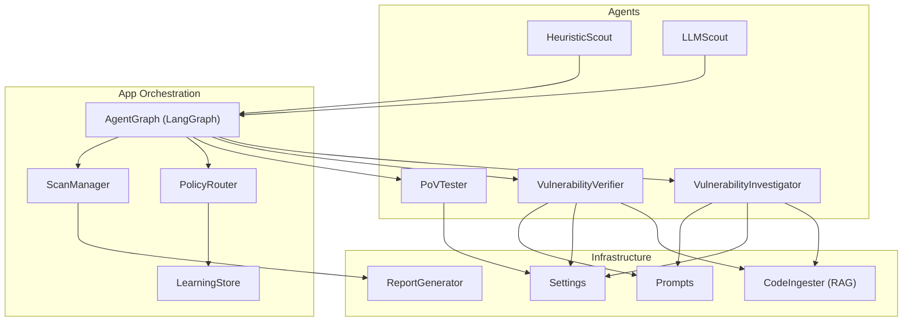
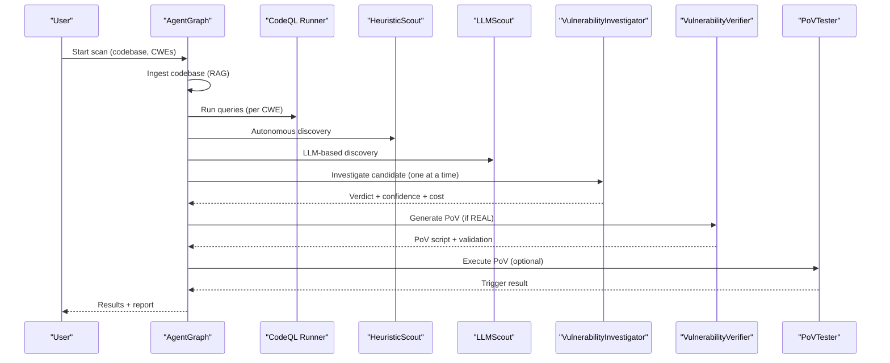
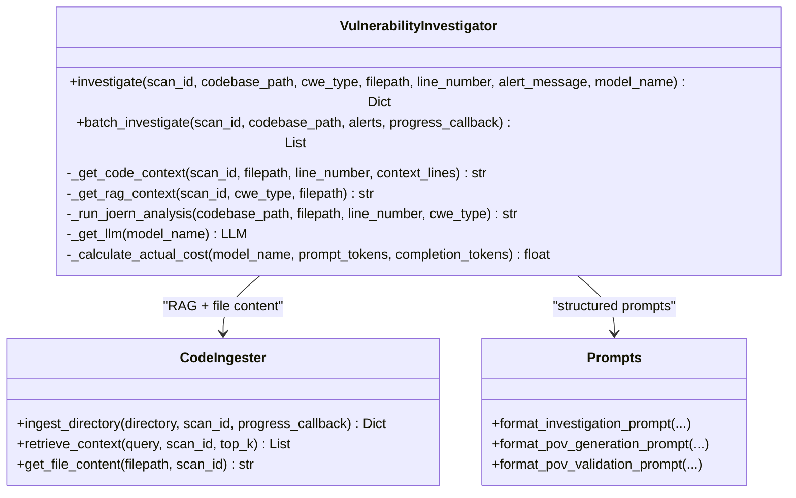
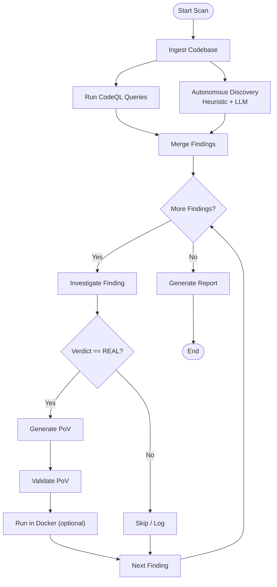
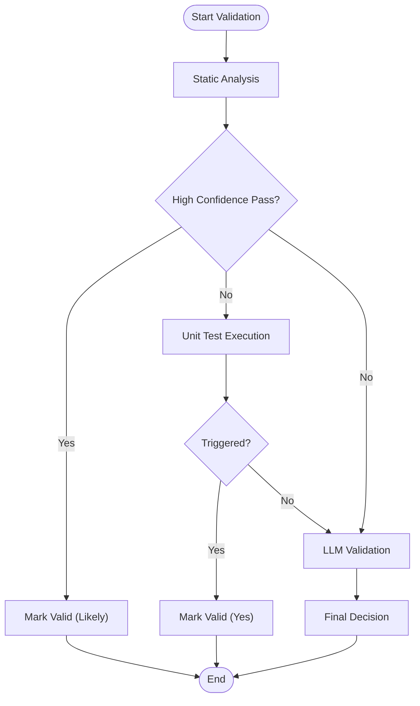
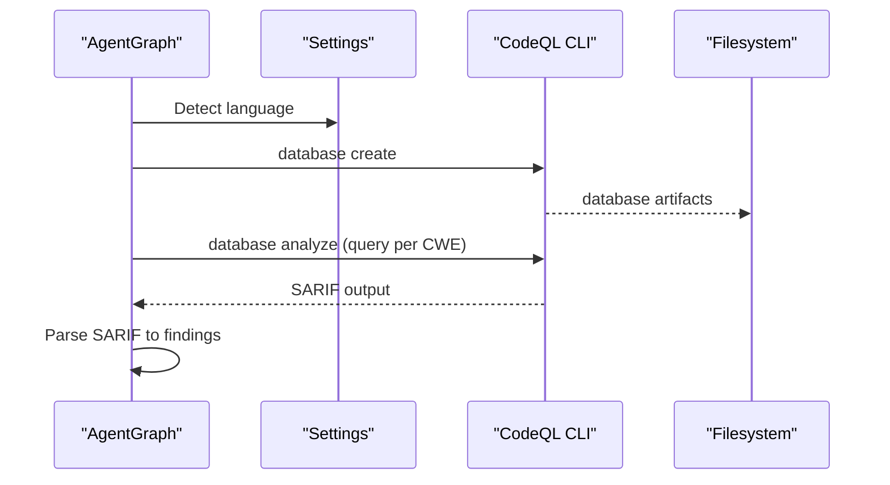
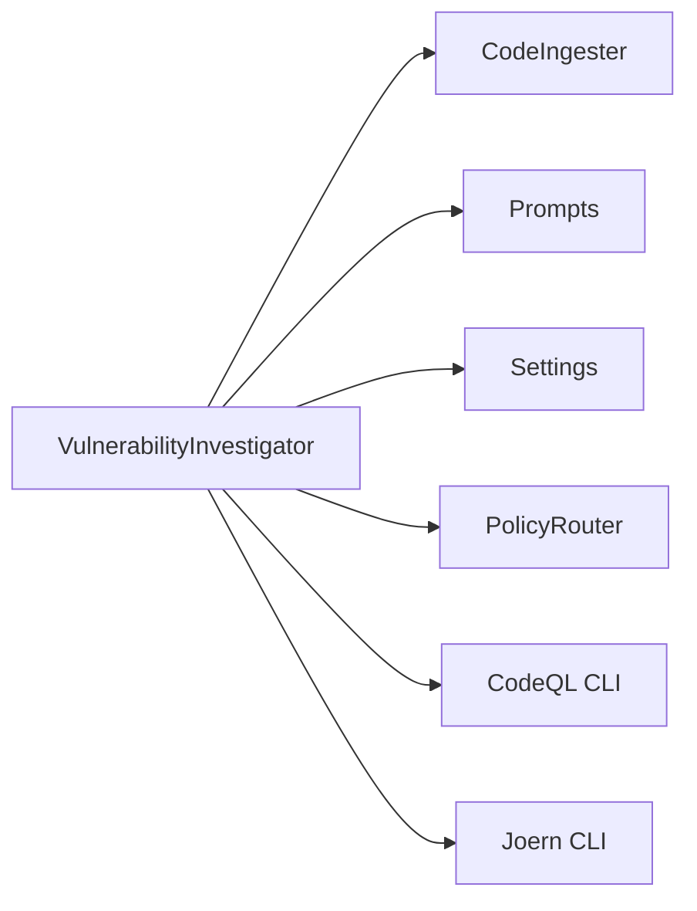

# Analysis Agents

<cite>
**Referenced Files in This Document**
- [investigator.py](file://agents/investigator.py)
- [agent_graph.py](file://app/agent_graph.py)
- [prompts.py](file://prompts.py)
- [ingest_codebase.py](file://agents/ingest_codebase.py)
- [config.py](file://app/config.py)
- [heuristic_scout.py](file://agents/heuristic_scout.py)
- [llm_scout.py](file://agents/llm_scout.py)
- [verifier.py](file://agents/verifier.py)
- [pov_tester.py](file://agents/pov_tester.py)
- [learning_store.py](file://app/learning_store.py)
- [report_generator.py](file://app/report_generator.py)
- [scan_manager.py](file://app/scan_manager.py)
- [BufferOverflow.ql](file://codeql_queries/BufferOverflow.ql)
</cite>

## Table of Contents
1. [Introduction](#introduction)
2. [Project Structure](#project-structure)
3. [Core Components](#core-components)
4. [Architecture Overview](#architecture-overview)
5. [Detailed Component Analysis](#detailed-component-analysis)
6. [Dependency Analysis](#dependency-analysis)
7. [Performance Considerations](#performance-considerations)
8. [Troubleshooting Guide](#troubleshooting-guide)
9. [Conclusion](#conclusion)
10. [Appendices](#appendices)

## Introduction
This document explains AutoPoV’s Analysis Agents with a focus on the Investigator agent’s multi-layered vulnerability analysis pipeline. It covers how the Investigator performs code context evaluation, exploit feasibility assessment, and risk prioritization; how decisions are made, confidence is scored, and evidence is gathered; and how the agent integrates with external analysis tools (CodeQL, Joern, LLMs) and result interpretation mechanisms. It also details the broader agent graph workflow, scoring and aggregation logic, and practical guidance for accuracy, bias mitigation, and performance optimization.

## Project Structure
AutoPoV organizes analysis logic across dedicated agents and supporting modules:
- Agents: Investigator (deep LLM-based analysis), Verifier (PoV generation/validation), Heuristic Scout, LLM Scout, PoV Tester, Docker Runner, Static Validator, Unit Test Runner
- Application orchestration: Agent Graph (LangGraph workflow), Scan Manager (lifecycle and persistence), Policy Router (model selection), Learning Store (model routing feedback)
- Infrastructure: Config (environment and tool availability), Code Ingestion (RAG), Prompts (structured templates), Reports (PDF/JSON)

**Diagram sources**
- [agent_graph.py:82-168](file://app/agent_graph.py#L82-L168)
- [investigator.py:37-519](file://agents/investigator.py#L37-L519)
- [verifier.py:42-562](file://agents/verifier.py#L42-L562)
- [pov_tester.py:21-296](file://agents/pov_tester.py#L21-L296)
- [heuristic_scout.py:13-242](file://agents/heuristic_scout.py#L13-L242)
- [llm_scout.py:32-208](file://agents/llm_scout.py#L32-L208)
- [ingest_codebase.py:41-413](file://agents/ingest_codebase.py#L41-L413)
- [prompts.py:7-424](file://prompts.py#L7-L424)
- [config.py:13-255](file://app/config.py#L13-L255)
- [policy.py:12-40](file://app/policy.py#L12-L40)
- [learning_store.py:14-256](file://app/learning_store.py#L14-L256)
- [scan_manager.py:47-663](file://app/scan_manager.py#L47-L663)
- [report_generator.py:200-800](file://app/report_generator.py#L200-L800)

**Section sources**
- [agent_graph.py:82-168](file://app/agent_graph.py#L82-L168)
- [investigator.py:37-519](file://agents/investigator.py#L37-L519)
- [verifier.py:42-562](file://agents/verifier.py#L42-L562)
- [pov_tester.py:21-296](file://agents/pov_tester.py#L21-L296)
- [heuristic_scout.py:13-242](file://agents/heuristic_scout.py#L13-L242)
- [llm_scout.py:32-208](file://agents/llm_scout.py#L32-L208)
- [ingest_codebase.py:41-413](file://agents/ingest_codebase.py#L41-L413)
- [prompts.py:7-424](file://prompts.py#L7-L424)
- [config.py:13-255](file://app/config.py#L13-L255)
- [policy.py:12-40](file://app/policy.py#L12-L40)
- [learning_store.py:14-256](file://app/learning_store.py#L14-L256)
- [scan_manager.py:47-663](file://app/scan_manager.py#L47-L663)
- [report_generator.py:200-800](file://app/report_generator.py#L200-L800)

## Core Components
- VulnerabilityInvestigator: Performs LLM-based deep analysis of candidate vulnerabilities, gathers code context, optionally augments with external CPG analysis (Joern), and returns structured verdicts with confidence and cost tracking.
- AgentGraph: Orchestrates the full vulnerability detection workflow, including ingestion, CodeQL/autonomous discovery, investigation, PoV generation/validation, and Docker execution.
- VulnerabilityVerifier: Generates and validates Proof-of-Vulnerability scripts using static analysis, unit tests, and LLM-based validation.
- CodeIngester: Provides RAG capabilities by chunking and embedding code for retrieval augmentation.
- PolicyRouter and LearningStore: Route models based on historical performance and learn optimal configurations.
- Prompts: Centralized, structured prompts for investigation, PoV generation/validation, and retry analysis.

Key implementation highlights:
- Structured JSON responses from LLMs enable robust parsing and downstream processing.
- Token usage extraction and cost calculation enable budget-aware operations.
- Hybrid validation pipeline (static → unit test → LLM) improves reliability.
- LangGraph workflow ensures deterministic, observable processing of findings.

**Section sources**
- [investigator.py:37-519](file://agents/investigator.py#L37-L519)
- [agent_graph.py:691-777](file://app/agent_graph.py#L691-L777)
- [verifier.py:42-562](file://agents/verifier.py#L42-L562)
- [ingest_codebase.py:41-413](file://agents/ingest_codebase.py#L41-L413)
- [prompts.py:7-424](file://prompts.py#L7-L424)
- [policy.py:12-40](file://app/policy.py#L12-L40)
- [learning_store.py:14-256](file://app/learning_store.py#L14-L256)

## Architecture Overview
The Investigator agent participates in a multi-agent, LangGraph-driven workflow. The flow begins with code ingestion and discovery (CodeQL and autonomous scouts), proceeds to investigation with LLMs, and culminates in PoV generation and validation.

**Diagram sources**
- [agent_graph.py:170-168](file://app/agent_graph.py#L170-L168)
- [heuristic_scout.py:188-234](file://agents/heuristic_scout.py#L188-L234)
- [llm_scout.py:88-200](file://agents/llm_scout.py#L88-L200)
- [investigator.py:270-432](file://agents/investigator.py#L270-L432)
- [verifier.py:90-224](file://agents/verifier.py#L90-L224)
- [pov_tester.py:24-100](file://agents/pov_tester.py#L24-L100)

## Detailed Component Analysis

### Investigator Agent: Multi-Layered Analysis
The Investigator agent performs:
- Code context retrieval: full-file content or RAG-enhanced related chunks
- Optional external CPG analysis (Joern) for specific CWEs (e.g., Use After Free)
- LLM-based analysis using a structured prompt to produce a JSON verdict
- Confidence scoring, cost tracking, and timing metadata
- Batch investigation support

Decision-making and scoring:
- The prompt template enforces structured JSON with fields for verdict, confidence, explanation, vulnerable code, root cause, and impact.
- Confidence is derived from the LLM’s response and can be influenced by prior stages (e.g., CodeQL confidence).
- Cost tracking uses token usage extracted from LLM responses; fallback estimates are applied when unavailable.

Evidence gathering:
- Code context is captured with line numbers and surrounding context.
- RAG context augments understanding with related code patterns.
- Joern CPG analysis (for CWE-416) adds program graph insights.

External tool integration:
- CodeQL: executed via CLI with SARIF output parsing; findings injected into the workflow.
- Joern: invoked to build a CPG and query for use-after-free patterns; output included in the investigation prompt.
- LLMs: selected via PolicyRouter; supports online (OpenRouter) and offline (Ollama) modes.

**Diagram sources**
- [investigator.py:37-519](file://agents/investigator.py#L37-L519)
- [ingest_codebase.py:41-413](file://agents/ingest_codebase.py#L41-L413)
- [prompts.py:257-358](file://prompts.py#L257-L358)

**Section sources**
- [investigator.py:270-432](file://agents/investigator.py#L270-L432)
- [prompts.py:7-44](file://prompts.py#L7-L44)
- [ingest_codebase.py:315-358](file://agents/ingest_codebase.py#L315-L358)

### Agent Graph Workflow: From Candidate to Verdict
The AgentGraph orchestrates the lifecycle:
- Ingest codebase into vector store for RAG
- Run CodeQL queries (per CWE) and/or autonomous discovery (heuristic + LLM)
- Investigate each finding with the Investigator agent
- Route model selection via PolicyRouter
- Record outcomes in LearningStore for routing feedback
- Generate and validate PoVs with the Verifier agent
- Optionally execute PoVs against a live target with PoVTester

**Diagram sources**
- [agent_graph.py:170-168](file://app/agent_graph.py#L170-L168)
- [agent_graph.py:691-777](file://app/agent_graph.py#L691-L777)
- [agent_graph.py:779-800](file://app/agent_graph.py#L779-L800)

**Section sources**
- [agent_graph.py:170-168](file://app/agent_graph.py#L170-L168)
- [agent_graph.py:691-777](file://app/agent_graph.py#L691-L777)
- [agent_graph.py:779-800](file://app/agent_graph.py#L779-L800)

### Verifier Agent: PoV Generation and Validation
The Verifier agent generates PoV scripts and validates them through:
- Static analysis (fast, detects syntax, standard library constraints, CWE-specific patterns)
- Unit test execution (when vulnerable code is available)
- LLM-based validation (fallback)

**Diagram sources**
- [verifier.py:225-387](file://agents/verifier.py#L225-L387)
- [verifier.py:453-491](file://agents/verifier.py#L453-L491)

**Section sources**
- [verifier.py:90-224](file://agents/verifier.py#L90-L224)
- [verifier.py:225-387](file://agents/verifier.py#L225-L387)
- [verifier.py:453-491](file://agents/verifier.py#L453-L491)

### CodeQL Integration and Rule Engine
CodeQL queries are mapped to CWE categories and executed via the CLI. The AgentGraph:
- Detects language and creates a CodeQL database
- Runs targeted queries per CWE
- Parses SARIF output into standardized findings
- Falls back to autonomous discovery if CodeQL is unavailable

**Diagram sources**
- [agent_graph.py:241-307](file://app/agent_graph.py#L241-L307)
- [agent_graph.py:309-341](file://app/agent_graph.py#L309-L341)
- [agent_graph.py:506-605](file://app/agent_graph.py#L506-L605)
- [BufferOverflow.ql:1-59](file://codeql_queries/BufferOverflow.ql#L1-L59)

**Section sources**
- [agent_graph.py:382-505](file://app/agent_graph.py#L382-L505)
- [agent_graph.py:506-605](file://app/agent_graph.py#L506-L605)
- [BufferOverflow.ql:1-59](file://codeql_queries/BufferOverflow.ql#L1-L59)

### Confidence Calculation and Evidence Aggregation
- Confidence: Provided by the LLM in the JSON response; for CodeQL findings, a high default confidence is applied.
- Evidence: Includes code context, RAG context, Joern CPG output, and PoV validation results.
- Aggregation: The AgentGraph updates each finding with verdict, confidence, inference time, cost, and token usage; totals are tracked across the scan.

**Section sources**
- [agent_graph.py:691-777](file://app/agent_graph.py#L691-L777)
- [investigator.py:379-414](file://agents/investigator.py#L379-L414)

### Integration Patterns and Decision Documentation
- Policy-based model selection: Investigator and Verifier fetch the appropriate model from PolicyRouter, enabling adaptive routing.
- Learning-store feedback: Outcomes are recorded to improve future model recommendations.
- Decision documentation: Each finding carries structured metadata (filepath, line_number, model_used, token_usage, cost_usd, inference_time_s) for traceability.

**Section sources**
- [policy.py:18-32](file://app/policy.py#L18-L32)
- [learning_store.py:61-123](file://app/learning_store.py#L61-L123)
- [agent_graph.py:763-776](file://app/agent_graph.py#L763-L776)

## Dependency Analysis
The Investigator agent depends on:
- CodeIngester for RAG and file content retrieval
- Prompts for structured LLM instructions
- Config for tool availability and model configuration
- PolicyRouter for model selection
- External tools (CodeQL, Joern) for complementary analysis

**Diagram sources**
- [investigator.py:270-432](file://agents/investigator.py#L270-L432)
- [ingest_codebase.py:41-413](file://agents/ingest_codebase.py#L41-L413)
- [prompts.py:257-358](file://prompts.py#L257-L358)
- [config.py:162-231](file://app/config.py#L162-L231)
- [policy.py:18-32](file://app/policy.py#L18-L32)

**Section sources**
- [investigator.py:270-432](file://agents/investigator.py#L270-L432)
- [ingest_codebase.py:41-413](file://agents/ingest_codebase.py#L41-L413)
- [prompts.py:257-358](file://prompts.py#L257-L358)
- [config.py:162-231](file://app/config.py#L162-L231)
- [policy.py:18-32](file://app/policy.py#L18-L32)

## Performance Considerations
- Cost control: Token usage extraction and cost calculation enable budget-aware operations; fallback estimations maintain visibility when usage metadata is missing.
- Parallelization: Batch investigation supports progress callbacks; CodeQL execution is sequential per query to avoid resource contention.
- RAG efficiency: Chunk size and overlap are configurable; retrieval uses top-k to balance recall and latency.
- Tool availability: Graceful fallbacks when CodeQL or Joern are unavailable; autonomous discovery ensures continuity.
- Reporting: PDF generation is optional and requires an external dependency; JSON reports are always available.

[No sources needed since this section provides general guidance]

## Troubleshooting Guide
Common issues and resolutions:
- Missing or misconfigured LLM provider: Ensure API keys and base URLs are set; verify model availability (online vs offline).
- CodeQL not available: The workflow falls back to heuristic and LLM scouts; install CodeQL CLI or disable CodeQL mode.
- Joern not available: The Investigator skips CPG analysis for applicable CWEs; install Joern CLI to enable use-after-free analysis.
- RAG failures: Verify ChromaDB installation and embedding model configuration; check file permissions and binary file filtering.
- Validation inconclusive: Static and unit test validations provide deterministic signals; LLM validation acts as a fallback.
- Cost tracking missing: Some LLM providers do not expose usage metadata; the Investigator applies fallback cost estimation.

**Section sources**
- [investigator.py:434-471](file://agents/investigator.py#L434-L471)
- [agent_graph.py:241-307](file://app/agent_graph.py#L241-L307)
- [ingest_codebase.py:96-121](file://agents/ingest_codebase.py#L96-L121)
- [verifier.py:225-387](file://agents/verifier.py#L225-L387)

## Conclusion
The Investigator agent forms the analytical backbone of AutoPoV’s vulnerability assessment pipeline. By combining structured LLM analysis, RAG context, optional external CPG analysis, and robust cost tracking, it delivers reliable verdicts with confidence scores and actionable evidence. Integrated with the AgentGraph, PolicyRouter, and LearningStore, it enables adaptive, data-driven model selection and continuous improvement. The Verifier and PoVTester further strengthen the pipeline by generating and validating exploitations, while the AgentGraph coordinates the entire workflow with clear decision points and documentation.

[No sources needed since this section summarizes without analyzing specific files]

## Appendices

### Example: Custom Analysis Rules and Integration Patterns
- Custom CWE queries: Extend the AgentGraph’s query mapping to include additional CWEs or language packs; ensure query files exist and are discoverable.
- Prompt customization: Adjust the investigation prompt to incorporate domain-specific guidance or additional CWE heuristics.
- Model routing: Use LearningStore-backed recommendations to route specific CWEs or languages to higher-performing models.
- External tool hooks: Integrate additional static analyzers by adding new nodes to the AgentGraph and adapting the investigation flow.

**Section sources**
- [agent_graph.py:382-505](file://app/agent_graph.py#L382-L505)
- [prompts.py:257-358](file://prompts.py#L257-L358)
- [learning_store.py:188-248](file://app/learning_store.py#L188-L248)