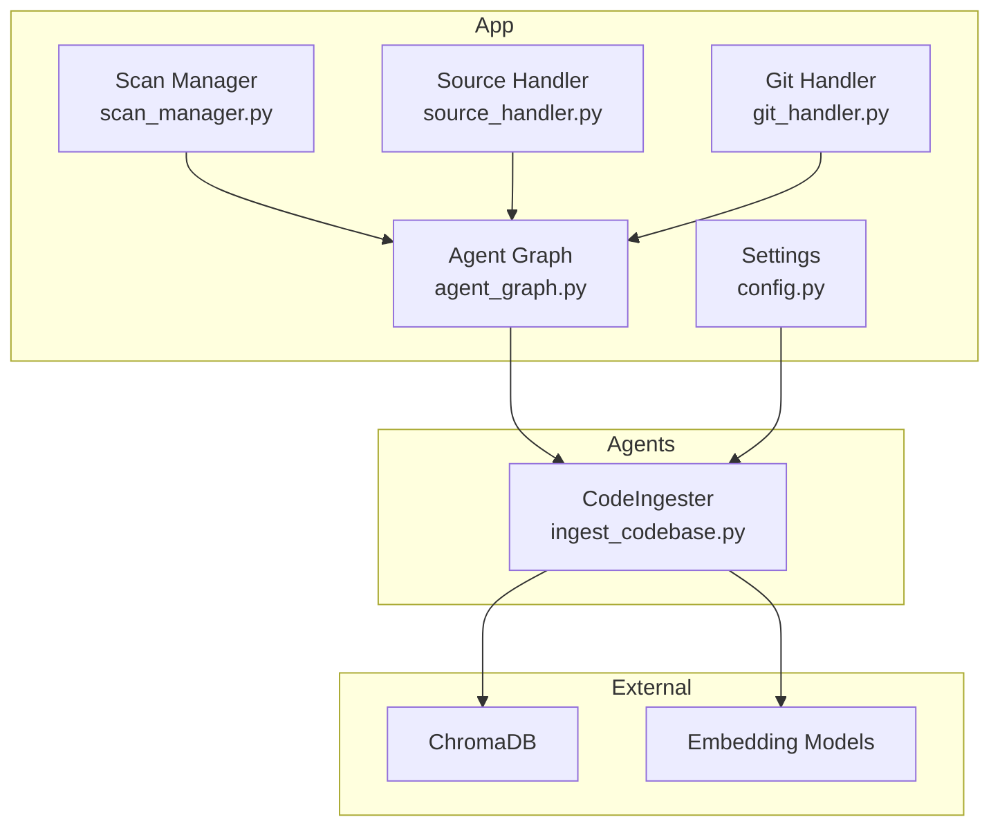
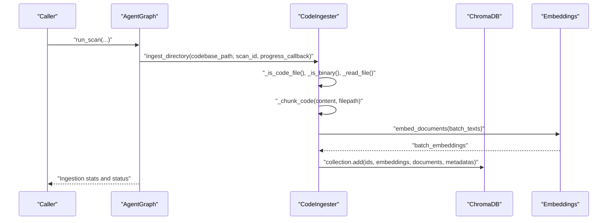
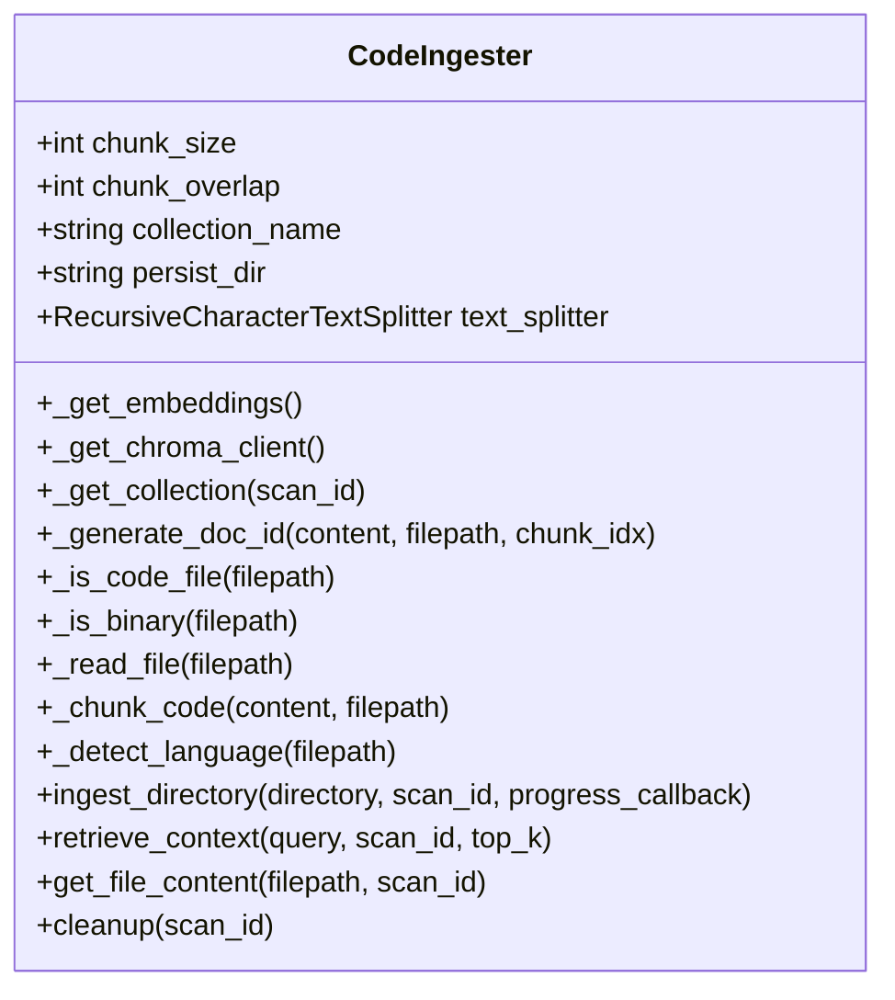
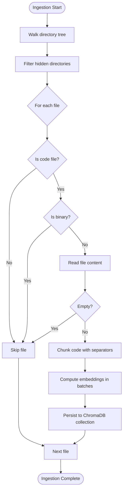
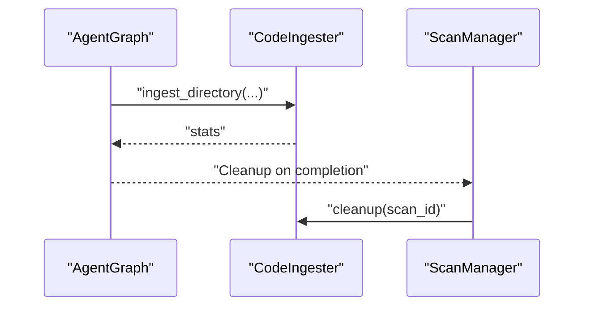
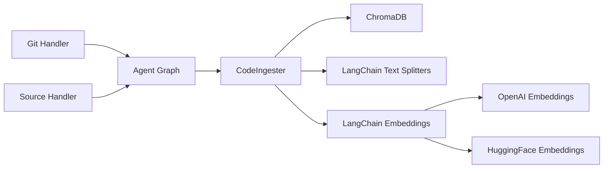

# Code Ingestion and Processing Agent

<cite>
**Referenced Files in This Document**
- [ingest_codebase.py](file://autopov/agents/ingest_codebase.py)
- [config.py](file://autopov/app/config.py)
- [agent_graph.py](file://autopov/app/agent_graph.py)
- [scan_manager.py](file://autopov/app/scan_manager.py)
- [source_handler.py](file://autopov/app/source_handler.py)
- [git_handler.py](file://autopov/app/git_handler.py)
- [requirements.txt](file://autopov/requirements.txt)
- [README.md](file://autopov/README.md)
</cite>

## Table of Contents
1. [Introduction](#introduction)
2. [Project Structure](#project-structure)
3. [Core Components](#core-components)
4. [Architecture Overview](#architecture-overview)
5. [Detailed Component Analysis](#detailed-component-analysis)
6. [Dependency Analysis](#dependency-analysis)
7. [Performance Considerations](#performance-considerations)
8. [Troubleshooting Guide](#troubleshooting-guide)
9. [Conclusion](#conclusion)
10. [Appendices](#appendices)

## Introduction
This document explains the code ingestion and processing agent responsible for transforming large codebases into vectorized chunks suitable for Retrieval-Augmented Generation (RAG). It covers the ingest_codebase agent’s chunking algorithms, file processing workflows, vector embedding creation, and integration with ChromaDB. It also details supported programming languages, preprocessing steps, configuration options, error handling, performance optimization, and troubleshooting.

## Project Structure
The ingestion pipeline is part of a larger agentic vulnerability detection system. The ingest_codebase agent lives under agents/, while configuration and orchestration live under app/.

**Diagram sources**
- [ingest_codebase.py](file://autopov/agents/ingest_codebase.py#L41-L407)
- [config.py](file://autopov/app/config.py#L13-L210)
- [agent_graph.py](file://autopov/app/agent_graph.py#L78-L582)
- [scan_manager.py](file://autopov/app/scan_manager.py#L40-L344)
- [source_handler.py](file://autopov/app/source_handler.py#L18-L380)
- [git_handler.py](file://autopov/app/git_handler.py#L18-L222)

**Section sources**
- [README.md](file://autopov/README.md#L17-L35)
- [requirements.txt](file://autopov/requirements.txt#L1-L42)

## Core Components
- CodeIngester: Orchestrates code ingestion, chunking, embedding, and ChromaDB persistence.
- Settings: Centralized configuration for chunk sizes, overlaps, embedding models, and vector store paths.
- Agent Graph: Calls the ingester during the “ingest_code” node of the vulnerability detection workflow.
- Scan Manager: Coordinates scan lifecycle and triggers cleanup of vector stores after completion.
- Source/Git Handlers: Prepare source code directories prior to ingestion.

Key responsibilities:
- Filter and preprocess files (skip binaries, hidden directories, empty files).
- Split code into overlapping chunks with language-aware separators.
- Compute embeddings using either online (OpenAI) or offline (HuggingFace) models.
- Persist chunks to ChromaDB collections keyed by scan_id.
- Provide retrieval and file-content lookup for downstream agents.

**Section sources**
- [ingest_codebase.py](file://autopov/agents/ingest_codebase.py#L41-L407)
- [config.py](file://autopov/app/config.py#L60-L93)
- [agent_graph.py](file://autopov/app/agent_graph.py#L136-L161)
- [scan_manager.py](file://autopov/app/scan_manager.py#L172-L175)

## Architecture Overview
The ingestion workflow integrates with the broader LangGraph-based vulnerability detection pipeline.

**Diagram sources**
- [agent_graph.py](file://autopov/app/agent_graph.py#L136-L161)
- [ingest_codebase.py](file://autopov/agents/ingest_codebase.py#L201-L307)

## Detailed Component Analysis

### CodeIngester
The CodeIngester encapsulates the ingestion logic:
- Configuration-driven chunking via RecursiveCharacterTextSplitter with language-aware separators.
- Dynamic embedding selection based on settings (online vs offline).
- ChromaDB client and collection management per scan_id.
- Batched embedding computation and vector insertion.
- Retrieval and file-content lookup for downstream agents.

**Diagram sources**
- [ingest_codebase.py](file://autopov/agents/ingest_codebase.py#L41-L407)

Key behaviors:
- File filtering: Only code files with known extensions are processed; binary files are skipped.
- Chunking: Uses recursive separators aligned with common programming constructs to preserve context.
- Embeddings: Chooses OpenAIEmbeddings for online mode or HuggingFaceEmbeddings for offline mode.
- Persistence: Creates a dedicated ChromaDB collection per scan_id; adds vectors in batches.
- Retrieval: Computes query embedding and performs similarity search against the collection.

**Section sources**
- [ingest_codebase.py](file://autopov/agents/ingest_codebase.py#L122-L200)
- [ingest_codebase.py](file://autopov/agents/ingest_codebase.py#L201-L307)
- [ingest_codebase.py](file://autopov/agents/ingest_codebase.py#L309-L386)

### Configuration Options
Chunking and embedding parameters are centrally managed:
- MAX_CHUNK_SIZE: Controls chunk length.
- CHUNK_OVERLAP: Controls overlap between adjacent chunks.
- CHROMA_PERSIST_DIR: Directory for ChromaDB persistence.
- CHROMA_COLLECTION_NAME: Base collection name; scan_id is appended to isolate data.
- EMBEDDING_MODEL_ONLINE/OFFLINE: Model names for embeddings depending on mode.
- MODEL_MODE: Switch between online and offline embedding providers.

These settings are consumed by CodeIngester and influence runtime behavior.

**Section sources**
- [config.py](file://autopov/app/config.py#L60-L93)
- [config.py](file://autopov/app/config.py#L173-L189)
- [ingest_codebase.py](file://autopov/agents/ingest_codebase.py#L44-L48)

### Supported Programming Languages and Preprocessing
Supported extensions include Python, JavaScript/TypeScript, Java, C/C++, Go, Rust, Ruby, PHP, C#, Swift, Kotlin, Scala, R, Objective-C, Perl, Shell, and SQL. The agent detects language from file extensions and attaches metadata to chunks.

Preprocessing steps:
- Skip hidden directories during traversal.
- Filter out binary files using a small-byte-read heuristic.
- Ignore empty files.
- Read text with UTF-8 decoding and ignore errors to handle malformed encodings gracefully.

**Section sources**
- [ingest_codebase.py](file://autopov/agents/ingest_codebase.py#L122-L131)
- [ingest_codebase.py](file://autopov/agents/ingest_codebase.py#L132-L149)
- [ingest_codebase.py](file://autopov/agents/ingest_codebase.py#L169-L199)

### Vector Store Integration (ChromaDB)
- Collection isolation: Each scan_id gets its own collection named with a prefix plus the scan_id.
- Persistence: ChromaDB persists to the configured directory.
- Batched ingestion: Embeddings are computed in batches and inserted efficiently.
- Retrieval: Query embeddings are computed and similarity-searched against the collection.

**Diagram sources**
- [ingest_codebase.py](file://autopov/agents/ingest_codebase.py#L240-L307)

**Section sources**
- [ingest_codebase.py](file://autopov/agents/ingest_codebase.py#L105-L115)
- [ingest_codebase.py](file://autopov/agents/ingest_codebase.py#L290-L307)

### Integration with Agent Graph and Scan Manager
- Agent Graph calls CodeIngester during the “ingest_code” node and logs progress.
- Scan Manager triggers cleanup of the vector store after a scan completes.

**Diagram sources**
- [agent_graph.py](file://autopov/app/agent_graph.py#L136-L161)
- [scan_manager.py](file://autopov/app/scan_manager.py#L172-L175)

**Section sources**
- [agent_graph.py](file://autopov/app/agent_graph.py#L136-L161)
- [scan_manager.py](file://autopov/app/scan_manager.py#L172-L175)

## Dependency Analysis
External libraries and their roles:
- ChromaDB: Vector store for persistent embeddings.
- LangChain text splitters and embeddings: Chunking and embedding computation.
- LangChain OpenAI/HuggingFace: Embedding providers.
- GitPython: Cloning repositories for ingestion.
- Docker: Execution environment for PoV scripts (used by downstream components).

**Diagram sources**
- [requirements.txt](file://autopov/requirements.txt#L16-L33)
- [ingest_codebase.py](file://autopov/agents/ingest_codebase.py#L11-L33)
- [git_handler.py](file://autopov/app/git_handler.py#L18-L222)
- [source_handler.py](file://autopov/app/source_handler.py#L18-L380)

**Section sources**
- [requirements.txt](file://autopov/requirements.txt#L1-L42)

## Performance Considerations
- Batched embeddings: Embedding computation is batched to reduce overhead and improve throughput.
- Overlap tuning: CHUNK_OVERLAP balances context continuity versus redundancy.
- Chunk size tuning: MAX_CHUNK_SIZE controls embedding cost and retrieval precision.
- Binary filtering: Early skip of binary files avoids unnecessary IO and processing.
- Hidden directory filtering: Reduces traversal overhead.
- Collection isolation: Per-scan collections prevent cross-scan interference and enable targeted cleanup.

[No sources needed since this section provides general guidance]

## Troubleshooting Guide
Common issues and resolutions:
- Missing ChromaDB: Ensure installation and availability; the agent raises a specific error when unavailable.
- Missing embedding provider: The agent checks for langchain-openai or langchain-huggingface depending on mode and raises descriptive errors.
- Missing API key: For online mode, ensure the API key is configured; otherwise, ingestion will fail early.
- Malformed or unreadable files: The agent ignores encoding errors and logs warnings; large binary files are skipped via a binary detection heuristic.
- Insufficient disk space: Verify CHROMA_PERSIST_DIR has sufficient space for embeddings.
- Large codebases: Consider increasing MAX_CHUNK_SIZE and CHUNK_OVERLAP cautiously; monitor memory usage during batch embedding.

Monitoring ingestion statistics:
- The ingest_directory method returns a dictionary with:
  - files_processed: Number of files successfully processed.
  - files_skipped: Number of files skipped (binary, hidden, empty).
  - chunks_created: Total number of chunks created.
  - errors: List of encountered errors.

**Section sources**
- [ingest_codebase.py](file://autopov/agents/ingest_codebase.py#L218-L226)
- [ingest_codebase.py](file://autopov/agents/ingest_codebase.py#L287-L288)

## Conclusion
The ingest_codebase agent provides a robust, configurable pipeline for transforming codebases into searchable, embeddable chunks. Its integration with ChromaDB and LangChain enables efficient retrieval-augmented workflows, while careful preprocessing and batching optimize performance. Proper configuration of chunk sizes, overlaps, and embedding models ensures scalable ingestion across diverse codebases.

[No sources needed since this section summarizes without analyzing specific files]

## Appendices

### Practical Ingestion Workflows
- From a Git repository: Use the Git Handler to clone and then pass the resulting path to the Agent Graph, which invokes the CodeIngester.
- From ZIP/TAR uploads: Use the Source Handler to extract archives into a temporary source directory, then ingest.
- From raw code paste: Use the Source Handler to write the code to a file with an appropriate extension, then ingest.

**Section sources**
- [git_handler.py](file://autopov/app/git_handler.py#L60-L124)
- [source_handler.py](file://autopov/app/source_handler.py#L31-L190)
- [agent_graph.py](file://autopov/app/agent_graph.py#L136-L161)

### Retrieval-Augmented Generation Support
- retrieve_context(query, scan_id, top_k): Returns relevant code chunks with metadata and distances.
- get_file_content(filepath, scan_id): Reconstructs full file content from ordered chunks.

**Section sources**
- [ingest_codebase.py](file://autopov/agents/ingest_codebase.py#L309-L352)
- [ingest_codebase.py](file://autopov/agents/ingest_codebase.py#L354-L386)