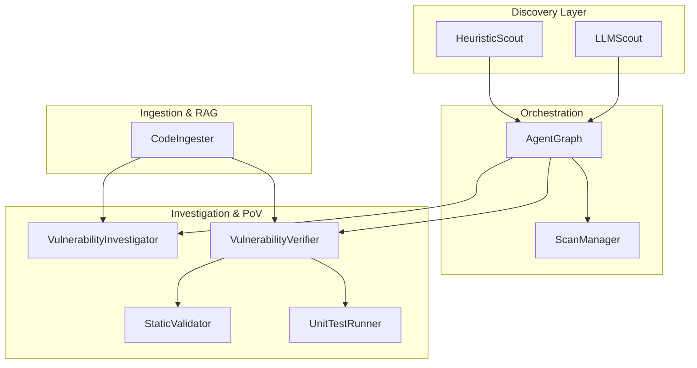
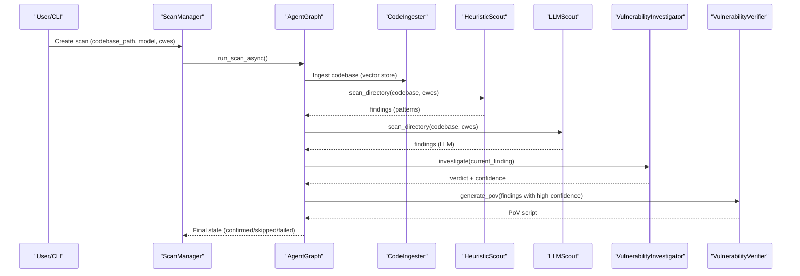
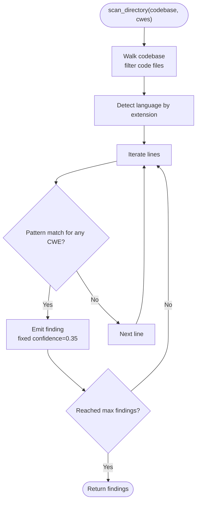
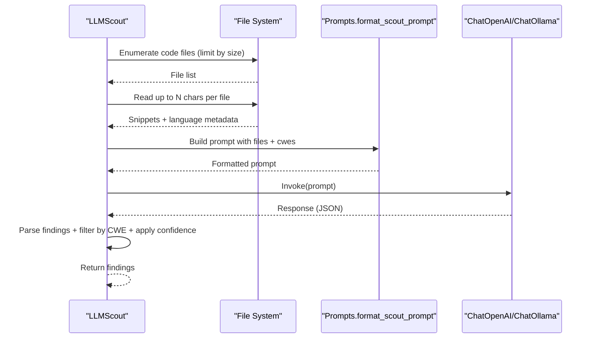
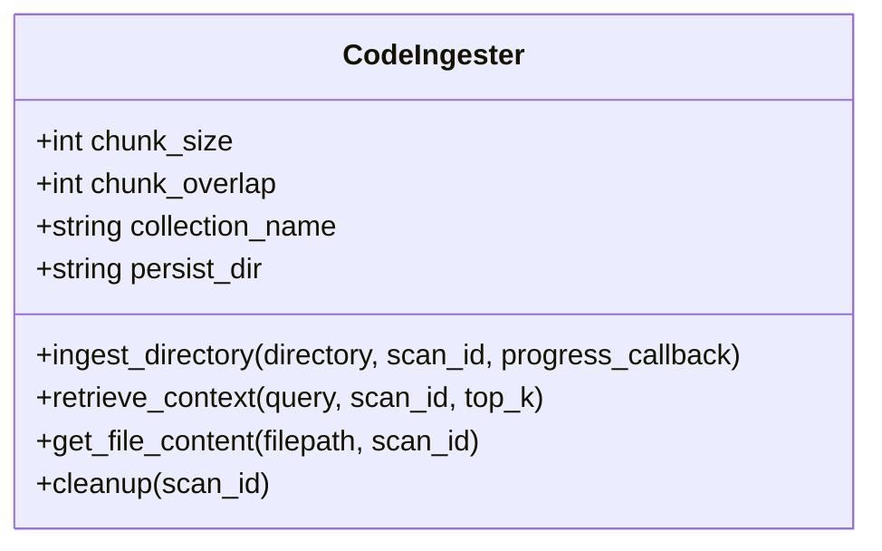
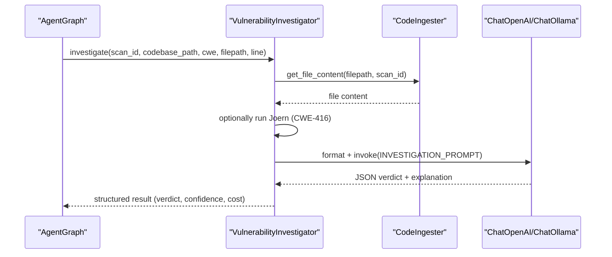
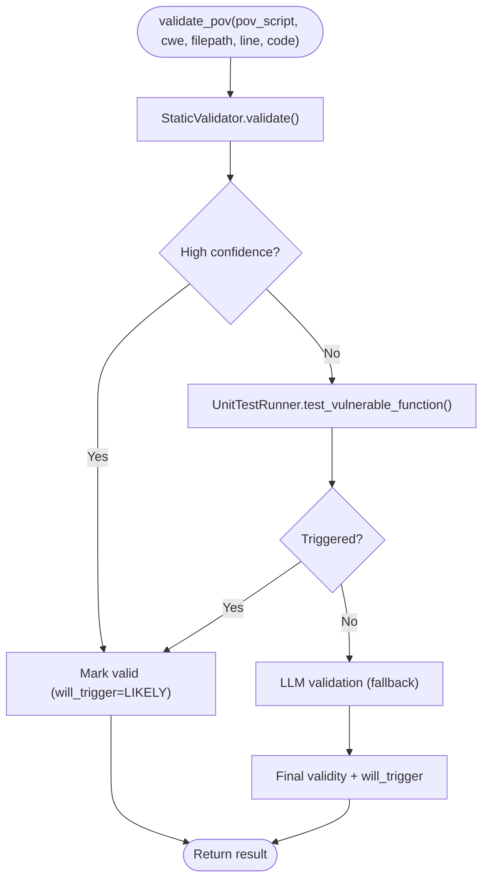
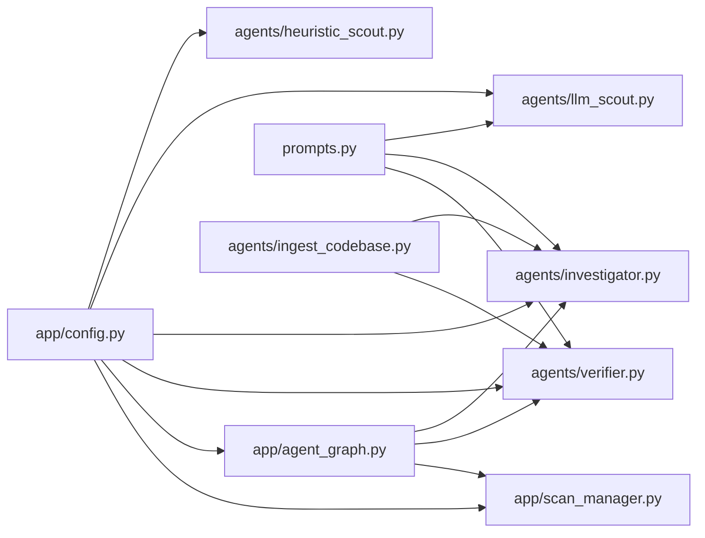

# Discovery Agents

<cite>
**Referenced Files in This Document**
- [heuristic_scout.py](file://agents/heuristic_scout.py)
- [llm_scout.py](file://agents/llm_scout.py)
- [ingest_codebase.py](file://agents/ingest_codebase.py)
- [config.py](file://app/config.py)
- [prompts.py](file://prompts.py)
- [investigator.py](file://agents/investigator.py)
- [agent_graph.py](file://app/agent_graph.py)
- [scan_manager.py](file://app/scan_manager.py)
- [verifier.py](file://agents/verifier.py)
- [static_validator.py](file://agents/static_validator.py)
- [unit_test_runner.py](file://agents/unit_test_runner.py)
</cite>

## Table of Contents
1. [Introduction](#introduction)
2. [Project Structure](#project-structure)
3. [Core Components](#core-components)
4. [Architecture Overview](#architecture-overview)
5. [Detailed Component Analysis](#detailed-component-analysis)
6. [Dependency Analysis](#dependency-analysis)
7. [Performance Considerations](#performance-considerations)
8. [Troubleshooting Guide](#troubleshooting-guide)
9. [Conclusion](#conclusion)
10. [Appendices](#appendices)

## Introduction
This document explains AutoPoV’s discovery agents that identify potential vulnerabilities in codebases. It focuses on:
- HeuristicScout: Pattern-based detection across supported CWE categories, regex matching, and language detection.
- LLMScout: AI-powered candidate generation using LLMs, prompt engineering, and reasoning.
- The end-to-end discovery workflow from code ingestion to candidate generation and investigation.
- Configuration options, performance tuning, and result filtering.
- Implementation details for pattern definition, language-specific heuristics, and confidence scoring.
- Troubleshooting strategies for false positives, missing detections, and performance optimization.
- Guidance for developing custom patterns and integrating them into the broader agent ecosystem.

## Project Structure
AutoPoV organizes discovery-related logic across dedicated modules:
- agents/heuristic_scout.py: Lightweight pattern-based candidate discovery.
- agents/llm_scout.py: LLM-based candidate generation across files.
- agents/ingest_codebase.py: Code chunking, embedding, and ChromaDB storage for RAG.
- app/config.py: Centralized configuration, including discovery settings and supported CWEs.
- prompts.py: Prompt templates for scouts, investigations, PoV generation/validation, and retry analysis.
- agents/investigator.py: LLM-based investigation of candidates with RAG and optional Joern analysis.
- app/agent_graph.py: Orchestrates the full vulnerability detection pipeline.
- app/scan_manager.py: Manages scan lifecycle, state, and persistence.
- agents/verifier.py: PoV generation and validation using static analysis, unit tests, and LLMs.
- agents/static_validator.py: Static analysis of PoV scripts.
- agents/unit_test_runner.py: Unit test harness for isolated PoV execution.

**Diagram sources**
- [heuristic_scout.py:13-242](file://agents/heuristic_scout.py#L13-L242)
- [llm_scout.py:32-208](file://agents/llm_scout.py#L32-L208)
- [ingest_codebase.py:41-413](file://agents/ingest_codebase.py#L41-L413)
- [agent_graph.py:82-168](file://app/agent_graph.py#L82-L168)
- [scan_manager.py:47-663](file://app/scan_manager.py#L47-L663)
- [investigator.py:37-519](file://agents/investigator.py#L37-L519)
- [verifier.py:42-562](file://agents/verifier.py#L42-L562)
- [static_validator.py:22-305](file://agents/static_validator.py#L22-L305)
- [unit_test_runner.py:28-344](file://agents/unit_test_runner.py#L28-L344)

**Section sources**
- [heuristic_scout.py:13-242](file://agents/heuristic_scout.py#L13-L242)
- [llm_scout.py:32-208](file://agents/llm_scout.py#L32-L208)
- [ingest_codebase.py:41-413](file://agents/ingest_codebase.py#L41-L413)
- [config.py:13-255](file://app/config.py#L13-L255)
- [prompts.py:1-424](file://prompts.py#L1-L424)
- [investigator.py:37-519](file://agents/investigator.py#L37-L519)
- [agent_graph.py:82-168](file://app/agent_graph.py#L82-L168)
- [scan_manager.py:47-663](file://app/scan_manager.py#L47-L663)
- [verifier.py:42-562](file://agents/verifier.py#L42-L562)
- [static_validator.py:22-305](file://agents/static_validator.py#L22-L305)
- [unit_test_runner.py:28-344](file://agents/unit_test_runner.py#L28-L344)

## Core Components
- HeuristicScout: Scans codebases using predefined regex patterns grouped by CWE categories. It detects languages by file extension and emits findings with a fixed confidence and metadata.
- LLMScout: Selects a model, reads up to a configurable number of files, constructs a multi-file prompt, and parses structured JSON to produce findings with confidence and explanations.
- CodeIngester: Chunks code, computes embeddings, and stores vectors in ChromaDB for retrieval during investigation and context enhancement.
- VulnerabilityInvestigator: Uses LLMs and optional Joern analysis to decide if a candidate is a real vulnerability, returning a structured verdict with confidence and cost tracking.
- VulnerabilityVerifier: Generates PoV scripts with LLMs, validates them statically and via unit tests, and falls back to LLM validation when needed.
- AgentGraph: Orchestrates the full pipeline: code ingestion, CodeQL analysis, autonomous discovery (heuristic + LLM), investigation, PoV generation/validation, and execution.
- ScanManager: Manages scan lifecycle, persists results, and maintains metrics.

**Section sources**
- [heuristic_scout.py:13-242](file://agents/heuristic_scout.py#L13-L242)
- [llm_scout.py:32-208](file://agents/llm_scout.py#L32-L208)
- [ingest_codebase.py:41-413](file://agents/ingest_codebase.py#L41-L413)
- [investigator.py:37-519](file://agents/investigator.py#L37-L519)
- [verifier.py:42-562](file://agents/verifier.py#L42-L562)
- [agent_graph.py:82-168](file://app/agent_graph.py#L82-L168)
- [scan_manager.py:47-663](file://app/scan_manager.py#L47-L663)

## Architecture Overview
The discovery workflow integrates static pattern matching, LLM-based candidate generation, and robust investigation and PoV validation.

**Diagram sources**
- [agent_graph.py:206-307](file://app/agent_graph.py#L206-L307)
- [heuristic_scout.py:188-234](file://agents/heuristic_scout.py#L188-L234)
- [llm_scout.py:88-200](file://agents/llm_scout.py#L88-L200)
- [investigator.py:270-432](file://agents/investigator.py#L270-L432)
- [verifier.py:90-224](file://agents/verifier.py#L90-L224)
- [scan_manager.py:234-366](file://app/scan_manager.py#L234-L366)

## Detailed Component Analysis

### HeuristicScout: Pattern-Based Detection
- Purpose: Rapid, low-cost candidate discovery using regex patterns mapped to CWE categories.
- Pattern coverage: Includes SQL injection (CWE-89), XSS (CWE-79), path traversal (CWE-22), OS command injection (CWE-78), code injection (CWE-94), deserialization (CWE-502), hardcoded credentials (CWE-798), cleartext storage (CWE-312), weak crypto (CWE-327), CSRF (CWE-352), auth bypass (CWE-287), missing auth (CWE-306), open redirect (CWE-601), SSRF (CWE-918), file upload (CWE-434), XXE (CWE-611), resource exhaustion (CWE-400), session fixation (CWE-384), info disclosure (CWE-200), input validation (CWE-20), buffer overflow (CWE-119), integer overflow (CWE-190), and use-after-free (CWE-416).
- Language detection: Maps file extensions to languages (Python, JavaScript/TypeScript, Java, C/C++, Go, Rust, Ruby, PHP, C#) for metadata and filtering.
- Confidence: Fixed at 0.35 for heuristic matches.
- Limits: Enforced by settings.SCOUT_MAX_FINDINGS to cap early termination.

**Diagram sources**
- [heuristic_scout.py:188-234](file://agents/heuristic_scout.py#L188-L234)

**Section sources**
- [heuristic_scout.py:13-242](file://agents/heuristic_scout.py#L13-L242)
- [config.py:46-53](file://app/config.py#L46-L53)

### LLMScout: AI-Powered Candidate Generation
- Purpose: Proposes candidates by prompting an LLM with a curated set of files and requested CWEs.
- File selection: Reads up to SCOUT_MAX_FILES, sorts by size, and limits each file to SCOUT_MAX_CHARS_PER_FILE.
- Prompting: Uses format_scout_prompt to build a multi-file prompt and invokes the selected LLM (online via OpenRouter or offline via Ollama).
- Parsing: Expects JSON with a findings array; filters by requested CWEs and applies confidence thresholds.
- Cost control: Estimates cost from token usage and enforces SCOUT_MAX_COST_USD.
- Confidence: Defaults to 0.4 for LLM-generated findings.

**Diagram sources**
- [llm_scout.py:88-200](file://agents/llm_scout.py#L88-L200)
- [prompts.py:413-424](file://prompts.py#L413-L424)

**Section sources**
- [llm_scout.py:32-208](file://agents/llm_scout.py#L32-L208)
- [prompts.py:391-424](file://prompts.py#L391-L424)
- [config.py:46-53](file://app/config.py#L46-L53)

### Code Ingestion and RAG
- Purpose: Prepare codebase for contextual LLM investigation and retrieval.
- Chunking: Uses RecursiveCharacterTextSplitter with language-aware separators.
- Embeddings: Supports OpenAI embeddings (online) and HuggingFace sentence-transformers (offline).
- Vector store: ChromaDB persistent collection keyed by scan_id.
- Retrieval: Query by embedding similarity to fetch related code chunks for context.

**Diagram sources**
- [ingest_codebase.py:41-413](file://agents/ingest_codebase.py#L41-L413)

**Section sources**
- [ingest_codebase.py:41-413](file://agents/ingest_codebase.py#L41-L413)

### Investigation Workflow
- Purpose: Convert candidates into actionable findings with structured verdicts.
- Steps:
  - Gather code context around the candidate line.
  - Optionally run Joern for use-after-free (CWE-416).
  - Prompt LLM with investigation template and parse JSON result.
  - Track token usage and compute cost.
  - Record learning store metrics.

**Diagram sources**
- [investigator.py:270-432](file://agents/investigator.py#L270-L432)
- [prompts.py:7-44](file://prompts.py#L7-L44)
- [agent_graph.py:691-777](file://app/agent_graph.py#L691-L777)

**Section sources**
- [investigator.py:37-519](file://agents/investigator.py#L37-L519)
- [prompts.py:7-44](file://prompts.py#L7-L44)
- [agent_graph.py:691-777](file://app/agent_graph.py#L691-L777)

### PoV Generation and Validation
- Generation: Uses a CWE-aware prompt to produce a PoV script in a target language. Tracks cost and token usage.
- Validation: Hybrid approach:
  - Static analysis: Checks required indicators, imports, attack patterns, and relevance to vulnerable code.
  - Unit test: Executes PoV against an isolated harness of the vulnerable code snippet.
  - LLM fallback: Validates when static/unit test are inconclusive.
- Execution: If unit test confirms trigger or static analysis is highly confident, skip Docker. Otherwise, run in Docker.

**Diagram sources**
- [verifier.py:225-387](file://agents/verifier.py#L225-L387)
- [static_validator.py:123-233](file://agents/static_validator.py#L123-L233)
- [unit_test_runner.py:34-116](file://agents/unit_test_runner.py#L34-L116)

**Section sources**
- [verifier.py:42-562](file://agents/verifier.py#L42-L562)
- [static_validator.py:22-305](file://agents/static_validator.py#L22-L305)
- [unit_test_runner.py:28-344](file://agents/unit_test_runner.py#L28-L344)

## Dependency Analysis
- Configuration-driven behavior: All agents read settings from app/config.py, including discovery toggles, limits, and model routing.
- Prompt-driven orchestration: LLMScout and Investigator/Verifier depend on prompts.py templates.
- RAG integration: Investigator and Verifier leverage CodeIngester for context retrieval and file content.
- AgentGraph orchestrates discovery, investigation, and PoV flows, with ScanManager managing persistence and metrics.

**Diagram sources**
- [config.py:13-255](file://app/config.py#L13-L255)
- [prompts.py:1-424](file://prompts.py#L1-L424)
- [heuristic_scout.py:13-242](file://agents/heuristic_scout.py#L13-L242)
- [llm_scout.py:32-208](file://agents/llm_scout.py#L32-L208)
- [investigator.py:37-519](file://agents/investigator.py#L37-L519)
- [verifier.py:42-562](file://agents/verifier.py#L42-L562)
- [agent_graph.py:82-168](file://app/agent_graph.py#L82-L168)
- [scan_manager.py:47-663](file://app/scan_manager.py#L47-L663)
- [ingest_codebase.py:41-413](file://agents/ingest_codebase.py#L41-L413)

**Section sources**
- [config.py:13-255](file://app/config.py#L13-L255)
- [prompts.py:1-424](file://prompts.py#L1-L424)
- [agent_graph.py:82-168](file://app/agent_graph.py#L82-L168)

## Performance Considerations
- HeuristicScout:
  - Complexity: O(F × L × P) where F is files, L is lines, P is patterns per CWE. Early termination at SCOUT_MAX_FINDINGS.
  - Tuning: Adjust SCOUT_MAX_FINDINGS to reduce downstream LLM calls.
- LLMScout:
  - Complexity: Proportional to number of files and characters per file. Use SCOUT_MAX_FILES and SCOUT_MAX_CHARS_PER_FILE to bound cost and latency.
  - Cost control: SCOUT_MAX_COST_USD prevents excessive spending; cost is estimated from token usage.
- Investigation:
  - Cost tracking: Actual token usage drives cost calculations; enable LangSmith tracing for visibility.
  - Joern: Optional CPG analysis for CWE-416 adds overhead; ensure availability and timeouts.
- PoV generation/validation:
  - Static validation is fast and highly effective; unit test execution is slower but definitive.
  - Docker fallback is reserved for ambiguous cases.

[No sources needed since this section provides general guidance]

## Troubleshooting Guide
- False positives (heuristic):
  - Symptom: Many matches with low specificity.
  - Actions: Narrow CWE scope, increase SCOUT_MAX_FINDINGS threshold, review regex patterns, or disable heuristic scout temporarily.
  - References: [heuristic_scout.py:18-157](file://agents/heuristic_scout.py#L18-L157), [config.py:46-53](file://app/config.py#L46-L53)
- Missing detections:
  - Symptom: Known patterns not caught.
  - Actions: Add new regex patterns under the appropriate CWE, expand language coverage, or enable LLMScout for broader coverage.
  - References: [heuristic_scout.py:18-157](file://agents/heuristic_scout.py#L18-L157)
- LLMScout failures:
  - Symptom: Empty findings or JSON parse errors.
  - Actions: Verify model availability and keys, adjust SCOUT_MAX_COST_USD, reduce SCOUT_MAX_FILES/CHARS, or switch model mode.
  - References: [llm_scout.py:35-57](file://agents/llm_scout.py#L35-L57), [llm_scout.py:168-171](file://agents/llm_scout.py#L168-L171), [config.py:46-53](file://app/config.py#L46-L53)
- Investigation errors:
  - Symptom: Unknown verdicts or high cost.
  - Actions: Check API keys, provider connectivity, and LangSmith tracing; reduce model temperature for deterministic outputs.
  - References: [investigator.py:50-103](file://agents/investigator.py#L50-L103), [investigator.py:339-377](file://agents/investigator.py#L339-L377)
- PoV validation issues:
  - Symptom: Static validation fails or unit test inconclusive.
  - Actions: Improve PoV payload patterns, ensure required imports, and confirm “VULNERABILITY TRIGGERED” presence; use LLM fallback analysis.
  - References: [verifier.py:225-387](file://agents/verifier.py#L225-L387), [static_validator.py:123-233](file://agents/static_validator.py#L123-L233), [unit_test_runner.py:34-116](file://agents/unit_test_runner.py#L34-L116)
- Performance bottlenecks:
  - Symptom: Slow scans or high costs.
  - Actions: Reduce SCOUT_MAX_FILES/CHARS, cap SCOUT_MAX_FINDINGS, enable offline models, or disable optional analyses (Joern).
  - References: [config.py:46-53](file://app/config.py#L46-L53), [agent_graph.py:309-341](file://app/agent_graph.py#L309-L341)

**Section sources**
- [heuristic_scout.py:18-157](file://agents/heuristic_scout.py#L18-L157)
- [llm_scout.py:35-57](file://agents/llm_scout.py#L35-L57)
- [llm_scout.py:168-171](file://agents/llm_scout.py#L168-L171)
- [investigator.py:50-103](file://agents/investigator.py#L50-L103)
- [investigator.py:339-377](file://agents/investigator.py#L339-L377)
- [verifier.py:225-387](file://agents/verifier.py#L225-L387)
- [static_validator.py:123-233](file://agents/static_validator.py#L123-L233)
- [unit_test_runner.py:34-116](file://agents/unit_test_runner.py#L34-L116)
- [agent_graph.py:309-341](file://app/agent_graph.py#L309-L341)

## Conclusion
AutoPoV’s discovery agents combine efficient pattern matching with LLM-powered candidate generation to accelerate vulnerability identification. HeuristicScout provides broad, fast coverage; LLMScout expands detection breadth; and the investigation/PoV pipeline ensures high-confidence triage and reproducible validation. Configuration knobs and cost controls enable tuning for speed, accuracy, and budget. The modular design allows incremental improvements, such as adding new regex patterns or refining prompts.

[No sources needed since this section summarizes without analyzing specific files]

## Appendices

### Configuration Options for Discovery Agents
- Discovery toggles and limits:
  - SCOUT_ENABLED: Enable/disable autonomous discovery.
  - SCOUT_LLM_ENABLED: Enable/disable LLMScout.
  - SCOUT_MAX_FILES: Max files to read for LLMScout.
  - SCOUT_MAX_CHARS_PER_FILE: Max characters per file for LLMScout.
  - SCOUT_MAX_FINDINGS: Max findings from HeuristicScout.
  - SCOUT_MAX_COST_USD: Cap cost for LLMScout.
- Supported CWEs: Predefined list optimized for high-impact web vulnerabilities.
- Model routing: Online (OpenRouter) or offline (Ollama) with selectable models.

**Section sources**
- [config.py:46-134](file://app/config.py#L46-L134)

### Implementation Details: Pattern Definition and Language Heuristics
- Pattern definition:
  - Regex patterns are grouped by CWE in HeuristicScout._patterns.
  - LLMScout relies on prompts.py to frame multi-file analysis and expects JSON output.
- Language detection:
  - HeuristicScout and LLMScout detect language from file extensions.
  - Investigator and AgentGraph detect language for CodeQL and policy routing.

**Section sources**
- [heuristic_scout.py:18-157](file://agents/heuristic_scout.py#L18-L157)
- [llm_scout.py:59-86](file://agents/llm_scout.py#L59-L86)
- [agent_graph.py:342-380](file://app/agent_graph.py#L342-L380)

### Confidence Scoring
- HeuristicScout: Fixed confidence 0.35.
- LLMScout: Defaults to 0.4; parsed from LLM JSON.
- Investigation: Confidence from LLM JSON; stored in findings.
- PoV validation: Static confidence ≥ 0.8 considered highly reliable; unit test results override ambiguity.

**Section sources**
- [heuristic_scout.py:219](file://agents/heuristic_scout.py#L219)
- [llm_scout.py:185](file://agents/llm_scout.py#L185)
- [investigator.py:380-400](file://agents/investigator.py#L380-L400)
- [verifier.py:279](file://agents/verifier.py#L279)

### Example: Custom Pattern Development
- Steps:
  - Identify a CWE category and representative attack patterns.
  - Add regex patterns to HeuristicScout._patterns under the appropriate CWE key.
  - Optionally refine prompts.py templates to guide LLMScout for broader context.
  - Validate with targeted scans and adjust thresholds (SCOUT_MAX_FINDINGS, confidence).
- Integration:
  - Patterns are automatically used by HeuristicScout and can be combined with LLMScout findings in AgentGraph.

**Section sources**
- [heuristic_scout.py:18-157](file://agents/heuristic_scout.py#L18-L157)
- [prompts.py:391-424](file://prompts.py#L391-L424)
- [agent_graph.py:206-227](file://app/agent_graph.py#L206-L227)