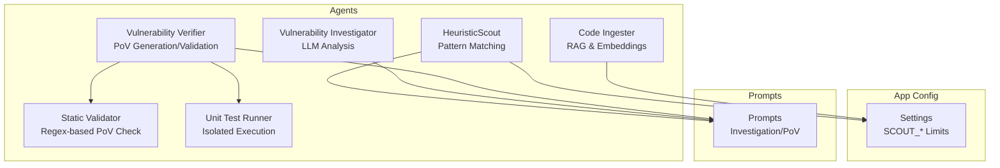
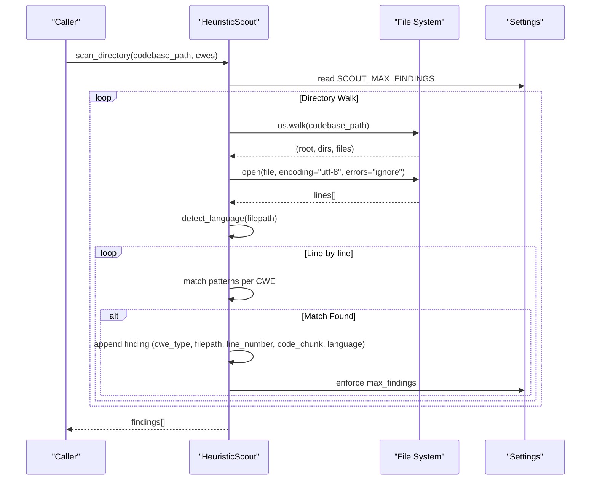
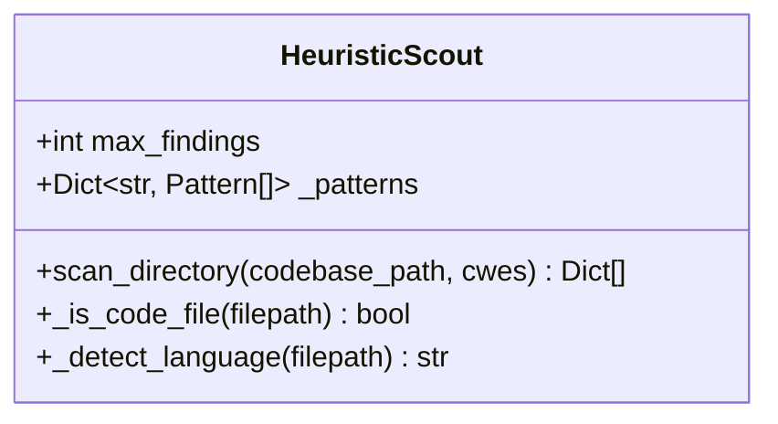
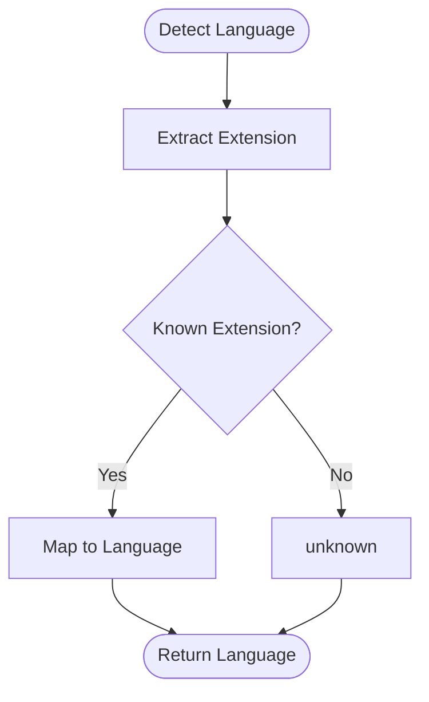
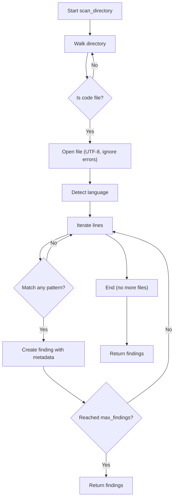
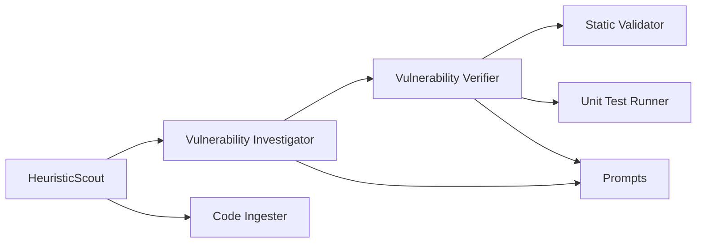
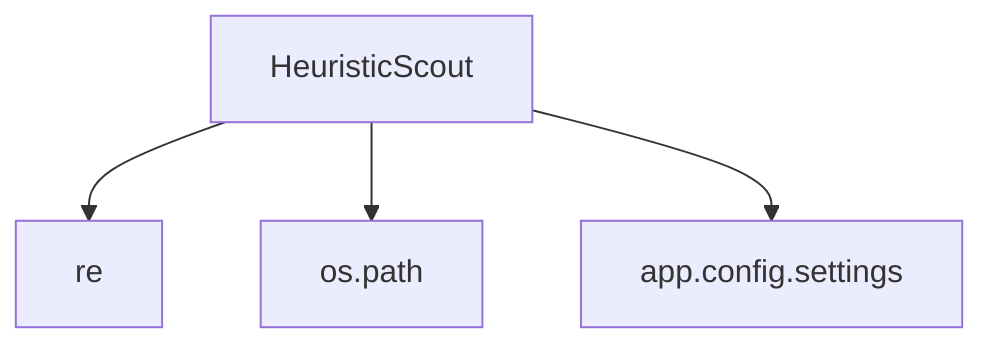

# HeuristicScout Agent

<cite>
**Referenced Files in This Document**
- [heuristic_scout.py](file://agents/heuristic_scout.py)
- [config.py](file://app/config.py)
- [prompts.py](file://prompts.py)
- [test_patterns.py](file://test_patterns.py)
- [ingest_codebase.py](file://agents/ingest_codebase.py)
- [investigator.py](file://agents/investigator.py)
- [verifier.py](file://agents/verifier.py)
- [static_validator.py](file://agents/static_validator.py)
- [unit_test_runner.py](file://agents/unit_test_runner.py)
</cite>

## Table of Contents
1. [Introduction](#introduction)
2. [Project Structure](#project-structure)
3. [Core Components](#core-components)
4. [Architecture Overview](#architecture-overview)
5. [Detailed Component Analysis](#detailed-component-analysis)
6. [Dependency Analysis](#dependency-analysis)
7. [Performance Considerations](#performance-considerations)
8. [Troubleshooting Guide](#troubleshooting-guide)
9. [Conclusion](#conclusion)

## Introduction
The HeuristicScout agent performs lightweight, pattern-based vulnerability detection across multiple CWE categories using regular expressions. It scans codebases to identify potential security issues and generates candidate findings ready for deeper investigation and PoV validation. The agent focuses on high-impact web vulnerabilities and integrates with the broader AutoPoV ecosystem for cost-controlled, scalable security scanning.

## Project Structure
The HeuristicScout resides in the agents module alongside other vulnerability detection components. It relies on configuration settings for limits and supported CWEs, and participates in a multi-stage pipeline that includes code ingestion, investigation, and PoV generation/validation.

**Diagram sources**
- [heuristic_scout.py:13-242](file://agents/heuristic_scout.py#L13-L242)
- [config.py:46-134](file://app/config.py#L46-L134)
- [prompts.py:7-120](file://prompts.py#L7-L120)

**Section sources**
- [heuristic_scout.py:13-242](file://agents/heuristic_scout.py#L13-L242)
- [config.py:46-134](file://app/config.py#L46-L134)

## Core Components
- HeuristicScout: Lightweight pattern matcher that scans code files and emits candidate findings with minimal overhead.
- Pattern Library: Regex-based signatures for CWE categories including SQL injection, XSS, path traversal, command injection, and more.
- Language Detection: Maps file extensions to programming languages for context-aware scanning.
- Configuration: Controls maximum findings, cost limits, and supported CWEs.

**Section sources**
- [heuristic_scout.py:16-157](file://agents/heuristic_scout.py#L16-L157)
- [config.py:46-134](file://app/config.py#L46-L134)

## Architecture Overview
The HeuristicScout agent operates as the first stage of the vulnerability detection pipeline. It traverses the codebase, applies regex patterns per CWE, and produces findings enriched with language metadata. These findings are later investigated by the Vulnerability Investigator and validated via PoV generation and execution.

**Diagram sources**
- [heuristic_scout.py:188-234](file://agents/heuristic_scout.py#L188-L234)
- [config.py:46-52](file://app/config.py#L46-L52)

## Detailed Component Analysis

### HeuristicScout Implementation
- Purpose: Rapidly surface potential vulnerabilities using lightweight regex patterns.
- Scope: Supports a curated set of CWEs focused on web applications and common high-impact issues.
- Language Detection: Maps file extensions to languages for downstream context-aware processing.
- Output: Candidate findings with metadata suitable for investigation and PoV generation.

**Diagram sources**
- [heuristic_scout.py:13-242](file://agents/heuristic_scout.py#L13-L242)

**Section sources**
- [heuristic_scout.py:16-234](file://agents/heuristic_scout.py#L16-L234)

### Pattern Library Structure
The pattern library organizes regex patterns by CWE category. Each category includes multiple patterns designed to detect common insecure coding practices. Categories include:
- CWE-89 (SQL Injection)
- CWE-79 (XSS)
- CWE-22 (Path Traversal)
- CWE-78 (Command Injection)
- CWE-94 (Code Injection)
- CWE-502 (Deserialization)
- CWE-798 (Hardcoded Credentials)
- CWE-312 (Cleartext Storage)
- CWE-327 (Use of Broken Cryptography)
- CWE-352 (CSRF)
- CWE-287 (Improper Authentication)
- CWE-306 (Missing Authentication)
- CWE-601 (Open Redirect)
- CWE-918 (Server-Side Request Forgery)
- CWE-434 (Unrestricted Upload of File with Dangerous Type)
- CWE-611 (XML External Entity)
- CWE-400 (Uncontrolled Resource Consumption)
- CWE-384 (Session Fixation)
- CWE-200 (Information Exposure)
- CWE-20 (Improper Input Validation)
- CWE-119 (Buffer Overflow)
- CWE-190 (Integer Overflow)
- CWE-416 (Use After Free)

Each pattern is compiled once and reused across the codebase scan. The patterns are tuned to balance sensitivity and specificity for heuristic scanning.

**Section sources**
- [heuristic_scout.py:18-157](file://agents/heuristic_scout.py#L18-L157)

### Language Detection System
Language detection maps file extensions to programming languages. This enables downstream components to tailor analysis and PoV generation to the target language context.

**Diagram sources**
- [heuristic_scout.py:166-186](file://agents/heuristic_scout.py#L166-L186)

**Section sources**
- [heuristic_scout.py:159-186](file://agents/heuristic_scout.py#L159-L186)

### Scanning Workflow
The scanning workflow proceeds as follows:
1. Directory traversal using os.walk, skipping hidden directories.
2. File filtering to include only known code extensions.
3. Line-by-line scanning with regex patterns per selected CWEs.
4. Early termination upon reaching SCOUT_MAX_FINDINGS.
5. Output includes metadata such as cwe_type, filepath, line_number, code_chunk, language, and default confidence.

**Diagram sources**
- [heuristic_scout.py:188-234](file://agents/heuristic_scout.py#L188-L234)
- [config.py:46-52](file://app/config.py#L46-L52)

**Section sources**
- [heuristic_scout.py:188-234](file://agents/heuristic_scout.py#L188-L234)

### Configuration Options
Key configuration impacting HeuristicScout behavior:
- SCOUT_ENABLED: Enable/disable heuristic scanning.
- SCOUT_LLM_ENABLED: Enable/disable LLM-assisted investigation of findings.
- SCOUT_MAX_FINDINGS: Cap on candidate findings to control cost and performance.
- SCOUT_MAX_FILES: Limit files processed per scan.
- SCOUT_MAX_CHARS_PER_FILE: Limit characters per file to bound processing time.
- SCOUT_MAX_COST_USD: Maximum cost for heuristic-related operations.
- SUPPORTED_CWES: Curated list of CWEs to scan for, focusing on high-impact web vulnerabilities.

These settings are defined in the central configuration module and influence both the agent’s behavior and downstream components.

**Section sources**
- [config.py:46-134](file://app/config.py#L46-L134)

### Integration with Broader Agent Ecosystem
- Code Ingester: Provides RAG context and embeddings for deeper analysis.
- Vulnerability Investigator: Uses LLMs to assess findings and compute costs.
- Vulnerability Verifier: Generates and validates PoVs using static analysis, unit tests, and LLM validation.
- Static Validator: Validates PoV scripts using regex patterns and structural checks.
- Unit Test Runner: Executes PoVs in isolated environments to confirm vulnerability triggers.

**Diagram sources**
- [heuristic_scout.py:13-242](file://agents/heuristic_scout.py#L13-L242)
- [investigator.py:270-432](file://agents/investigator.py#L270-L432)
- [verifier.py:90-387](file://agents/verifier.py#L90-L387)
- [static_validator.py:123-233](file://agents/static_validator.py#L123-L233)
- [unit_test_runner.py:34-116](file://agents/unit_test_runner.py#L34-L116)
- [prompts.py:7-120](file://prompts.py#L7-L120)

**Section sources**
- [ingest_codebase.py:175-205](file://agents/ingest_codebase.py#L175-L205)
- [investigator.py:270-432](file://agents/investigator.py#L270-L432)
- [verifier.py:90-387](file://agents/verifier.py#L90-L387)
- [static_validator.py:123-233](file://agents/static_validator.py#L123-L233)
- [unit_test_runner.py:34-116](file://agents/unit_test_runner.py#L34-L116)

## Dependency Analysis
- Internal Dependencies:
  - HeuristicScout depends on app.config.settings for SCOUT_MAX_FINDINGS and other limits.
  - Uses Python’s re module for regex pattern matching.
  - Uses os.path for file extension handling and path normalization.
- External Dependencies:
  - No external libraries are required for pattern matching; regex engine is sufficient.
- Coupling:
  - Low coupling to configuration via settings.
  - Cohesion within pattern matching and language detection logic.

**Diagram sources**
- [heuristic_scout.py:6-10](file://agents/heuristic_scout.py#L6-L10)
- [config.py:46-52](file://app/config.py#L46-L52)

**Section sources**
- [heuristic_scout.py:6-10](file://agents/heuristic_scout.py#L6-L10)
- [config.py:46-52](file://app/config.py#L46-L52)

## Performance Considerations
- Regex Compilation: Patterns are compiled once during initialization to minimize overhead.
- Early Termination: Enforced by SCOUT_MAX_FINDINGS to cap processing volume.
- File Filtering: Skips non-code files and hidden directories to reduce IO.
- Character Limits: SCOUT_MAX_CHARS_PER_FILE and SCOUT_MAX_FILES bound resource usage.
- Cost Control: SCOUT_MAX_COST_USD prevents excessive LLM usage when combined with other components.
- Large Codebases:
  - Consider limiting the set of CWEs scanned via SUPPORTED_CWES.
  - Adjust SCOUT_MAX_FINDINGS and SCOUT_MAX_FILES to balance coverage and speed.
  - Use targeted scans on specific directories to reduce traversal time.

[No sources needed since this section provides general guidance]

## Troubleshooting Guide
- False Positives:
  - Use the curated SUPPORTED_CWES list to focus on high-confidence categories.
  - Review regex patterns and refine them using test_patterns.py to validate behavior against representative code.
  - Leverage downstream components (Investigator, Verifier) to reduce false positives via LLM analysis and PoV validation.
- Performance Issues:
  - Reduce SCOUT_MAX_FINDINGS and SCOUT_MAX_FILES.
  - Narrow the CWE scope to fewer categories.
  - Ensure hidden directories are excluded (already handled by os.walk filtering).
- Debugging Regex Patterns:
  - Use test_patterns.py to compile and test individual patterns against sample code.
  - Validate pattern groups and IGNORECASE flags to ensure consistent matching.
- Language Detection:
  - Confirm file extensions are mapped in the language detection function.
  - Extend the mapping for new languages if needed.

**Section sources**
- [test_patterns.py:1-33](file://test_patterns.py#L1-L33)
- [config.py:108-134](file://app/config.py#L108-L134)

## Conclusion
HeuristicScout provides a fast, lightweight mechanism to surface potential vulnerabilities using regex-based pattern matching. Its integration with the broader AutoPoV ecosystem ensures findings are contextualized, investigated, and validated through PoV generation and execution. By tuning configuration parameters and leveraging downstream components, teams can achieve efficient, cost-controlled vulnerability detection across diverse codebases.