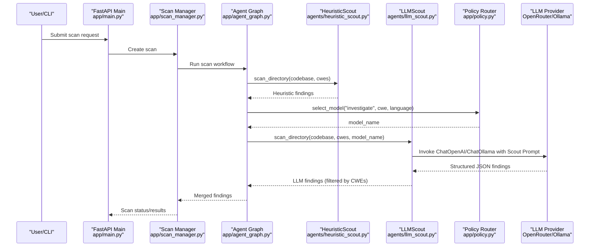
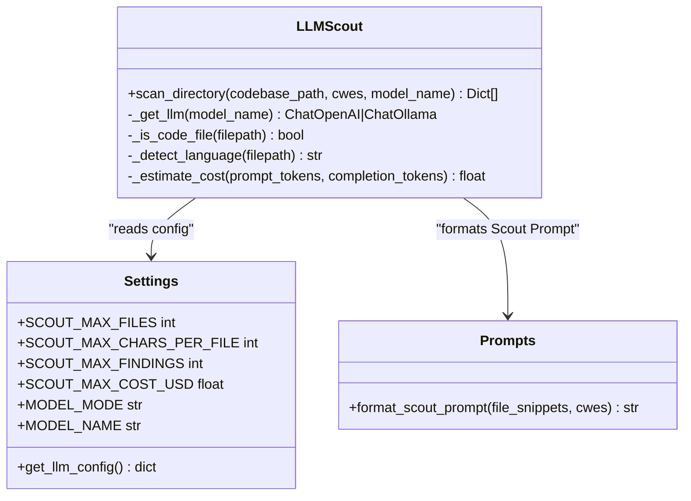
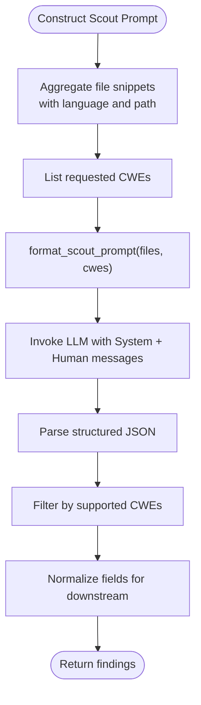
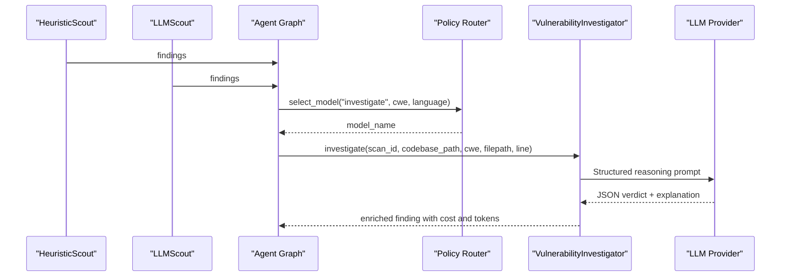
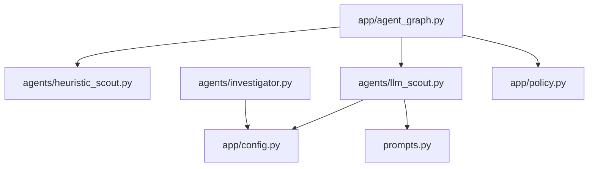

# LLMScout Agent

<cite>
**Referenced Files in This Document**
- [llm_scout.py](file://agents/llm_scout.py)
- [config.py](file://app/config.py)
- [prompts.py](file://prompts.py)
- [investigator.py](file://agents/investigator.py)
- [heuristic_scout.py](file://agents/heuristic_scout.py)
- [agent_graph.py](file://app/agent_graph.py)
- [policy.py](file://app/policy.py)
- [scan_manager.py](file://app/scan_manager.py)
- [requirements.txt](file://requirements.txt)
- [DOCS_APPLICATION_FLOW.md](file://DOCS_APPLICATION_FLOW.md)
</cite>

## Table of Contents
1. [Introduction](#introduction)
2. [Project Structure](#project-structure)
3. [Core Components](#core-components)
4. [Architecture Overview](#architecture-overview)
5. [Detailed Component Analysis](#detailed-component-analysis)
6. [Dependency Analysis](#dependency-analysis)
7. [Performance Considerations](#performance-considerations)
8. [Troubleshooting Guide](#troubleshooting-guide)
9. [Conclusion](#conclusion)

## Introduction
The LLMScout agent is an AI-powered component designed to autonomously discover potential vulnerability candidates across codebases. It operates as part of a multi-stage vulnerability discovery pipeline, integrating with LLM providers (OpenRouter for online models and Ollama for local models) to perform reasoning over file snippets. Unlike pattern-matching approaches, LLMScout emphasizes contextual analysis, code semantics understanding, and multi-file correlation to propose high-quality candidates for deeper investigation.

LLMScout complements the HeuristicScout agent by combining lightweight, fast pattern-based detection with AI-driven reasoning. Together, they form a hybrid discovery system that balances speed and accuracy while enabling cost-aware operation through configurable limits and provider selection.

## Project Structure
The LLMScout agent resides under the agents package and collaborates with configuration, prompt engineering, and orchestration modules:

- agents/llm_scout.py: Implements the LLMScout class, file traversal, prompt construction, and LLM invocation.
- app/config.py: Centralizes configuration including LLM provider settings, model selection, and cost controls.
- prompts.py: Defines structured prompts for vulnerability discovery, including the Scout Prompt used by LLMScout.
- agents/investigator.py: Provides cost calculation and structured reasoning for confirmed findings.
- agents/heuristic_scout.py: Supplies pattern-based candidates to augment LLMScout results.
- app/agent_graph.py: Orchestrates the end-to-end scan workflow, merging findings from multiple scouts.
- app/policy.py: Routes models per stage using fixed, learning-based, or auto modes.
- app/scan_manager.py: Manages scan lifecycle, persistence, and metrics.
- requirements.txt: Lists LangChain integrations for OpenAI and Ollama.
- DOCS_APPLICATION_FLOW.md: Describes the end-to-end pipeline and LLMScout's role.

```mermaid
graph TB
subgraph "Agents"
LLMScout["LLMScout<br/>agents/llm_scout.py"]
HeuristicScout["HeuristicScout<br/>agents/heuristic_scout.py"]
Investigator["VulnerabilityInvestigator<br/>agents/investigator.py"]
end
subgraph "App Layer"
Config["Settings & Config<br/>app/config.py"]
Policy["Policy Router<br/>app/policy.py"]
AgentGraph["Agent Graph<br/>app/agent_graph.py"]
ScanMgr["Scan Manager<br/>app/scan_manager.py"]
end
subgraph "Prompts"
Prompts["Prompt Templates<br/>prompts.py"]
end
subgraph "Providers"
OpenRouter["OpenRouter (Online)<br/>langchain-openai"]
Ollama["Ollama (Offline)<br/>langchain-ollama"]
end
HeuristicScout --> AgentGraph
LLMScout --> AgentGraph
AgentGraph --> Investigator
AgentGraph --> Policy
Policy --> Config
LLMScout --> Prompts
Investigator --> Prompts
LLMScout --> OpenRouter
LLMScout --> Ollama
Investigator --> OpenRouter
Investigator --> Ollama
AgentGraph --> ScanMgr
```

**Diagram sources**
- [llm_scout.py:32-203](file://agents/llm_scout.py#L32-L203)
- [config.py:13-255](file://app/config.py#L13-L255)
- [prompts.py:391-424](file://prompts.py#L391-L424)
- [investigator.py:37-519](file://agents/investigator.py#L37-L519)
- [heuristic_scout.py:13-242](file://agents/heuristic_scout.py#L13-L242)
- [agent_graph.py:206-227](file://app/agent_graph.py#L206-L227)
- [policy.py:12-40](file://app/policy.py#L12-L40)
- [scan_manager.py:47-663](file://app/scan_manager.py#L47-L663)

**Section sources**
- [llm_scout.py:1-208](file://agents/llm_scout.py#L1-L208)
- [config.py:1-255](file://app/config.py#L1-L255)
- [prompts.py:1-424](file://prompts.py#L1-L424)
- [investigator.py:1-519](file://agents/investigator.py#L1-L519)
- [heuristic_scout.py:1-242](file://agents/heuristic_scout.py#L1-L242)
- [agent_graph.py:1-800](file://app/agent_graph.py#L1-L800)
- [policy.py:1-40](file://app/policy.py#L1-L40)
- [scan_manager.py:1-663](file://app/scan_manager.py#L1-L663)
- [requirements.txt:1-44](file://requirements.txt#L1-L44)
- [DOCS_APPLICATION_FLOW.md:79-108](file://DOCS_APPLICATION_FLOW.md#L79-L108)

## Core Components
- LLMScout: Performs autonomous candidate discovery by traversing code files, constructing a Scout Prompt, and invoking the configured LLM to return structured findings. It enforces cost caps and filters results by supported CWEs.
- Configuration: Centralized settings define provider mode (online/offline), model names, embedding models, and cost thresholds for scouts.
- Prompt Engineering: The Scout Prompt template instructs the model to propose findings with CWE, file path, line number, code snippet, reasoning, and confidence.
- Investigator: Validates and reasons over candidates, calculating actual token usage and cost, and enriching findings with structured verdicts.
- HeuristicScout: Provides fast pattern-based candidates to complement LLMScout and reduce unnecessary LLM calls.
- Agent Graph: Orchestrates the full pipeline, merging findings from multiple sources and routing models per stage.
- Policy Router: Selects models for investigation and PoV generation based on routing mode (fixed, learning, auto).
- Scan Manager: Manages scan lifecycle, persistence, metrics, and cleanup.

**Section sources**
- [llm_scout.py:32-203](file://agents/llm_scout.py#L32-L203)
- [config.py:46-78](file://app/config.py#L46-L78)
- [prompts.py:391-424](file://prompts.py#L391-L424)
- [investigator.py:434-472](file://agents/investigator.py#L434-L472)
- [heuristic_scout.py:13-242](file://agents/heuristic_scout.py#L13-L242)
- [agent_graph.py:206-227](file://app/agent_graph.py#L206-L227)
- [policy.py:18-32](file://app/policy.py#L18-L32)
- [scan_manager.py:234-366](file://app/scan_manager.py#L234-L366)

## Architecture Overview
The LLMScout agent participates in a multi-agent workflow that merges CodeQL findings, heuristic candidates, and LLM-generated candidates. It respects cost and file limits, constructs a Scout Prompt, and returns structured findings for downstream investigation.



**Diagram sources**
- [agent_graph.py:206-227](file://app/agent_graph.py#L206-L227)
- [llm_scout.py:88-200](file://agents/llm_scout.py#L88-L200)
- [policy.py:18-32](file://app/policy.py#L18-L32)
- [prompts.py:391-424](file://prompts.py#L391-L424)
- [config.py:30-39](file://app/config.py#L30-L39)

**Section sources**
- [DOCS_APPLICATION_FLOW.md:79-108](file://DOCS_APPLICATION_FLOW.md#L79-L108)
- [agent_graph.py:206-227](file://app/agent_graph.py#L206-L227)
- [llm_scout.py:88-200](file://agents/llm_scout.py#L88-L200)

## Detailed Component Analysis

### LLMScout Class
The LLMScout class encapsulates the AI-powered candidate discovery logic:
- File traversal: Walks the codebase, filters code files, sorts by size, and limits by maximum files and characters per file.
- Prompt construction: Formats a Scout Prompt with file snippets and targeted CWEs.
- Provider selection: Chooses OpenRouter (online) or Ollama (offline) based on configuration, with temperature tuned for deterministic outputs.
- Cost control: Estimates and compares cost against a per-scan cap; returns empty findings if exceeded.
- Result parsing: Parses structured JSON, validates CWEs, and normalizes fields for downstream consumption.



**Diagram sources**
- [llm_scout.py:32-203](file://agents/llm_scout.py#L32-L203)
- [config.py:212-232](file://app/config.py#L212-L232)
- [prompts.py:413-424](file://prompts.py#L413-L424)

**Section sources**
- [llm_scout.py:35-57](file://agents/llm_scout.py#L35-L57)
- [llm_scout.py:88-200](file://agents/llm_scout.py#L88-L200)
- [config.py:46-52](file://app/config.py#L46-L52)
- [prompts.py:413-424](file://prompts.py#L413-L424)

### Prompt Engineering for Vulnerability Discovery
The Scout Prompt instructs the model to propose structured findings across multiple files. It includes:
- Files: A collection of file paths, languages, and code snippets.
- CWE scope: Explicitly constrained to the requested CWEs.
- Output format: JSON with fields for CWE, filepath, line number, snippet, reason, and confidence.

This template enables multi-file correlation and contextual reasoning beyond simple pattern matching.



**Diagram sources**
- [prompts.py:391-424](file://prompts.py#L391-L424)
- [llm_scout.py:117-124](file://agents/llm_scout.py#L117-L124)
- [llm_scout.py:168-200](file://agents/llm_scout.py#L168-L200)

**Section sources**
- [prompts.py:391-424](file://prompts.py#L391-L424)
- [llm_scout.py:117-124](file://agents/llm_scout.py#L117-L124)
- [llm_scout.py:168-200](file://agents/llm_scout.py#L168-L200)

### Reasoning Capabilities and Beyond Pattern Matching
LLMScout’s reasoning extends pattern matching by:
- Multi-file correlation: The Scout Prompt aggregates multiple files, allowing the model to connect related code across the codebase.
- Contextual analysis: By including language and code snippets, the model can infer intent, data flow, and potential misuses.
- Semantics understanding: The model interprets code semantics (e.g., SQL injection patterns, XSS sinks) rather than relying solely on keyword matches.
- Structured output: The prompt requires structured JSON, encouraging precise and actionable candidate reporting.

These capabilities enable LLMScout to propose nuanced candidates that require deeper investigation, reducing reliance on brittle heuristics.

**Section sources**
- [prompts.py:391-424](file://prompts.py#L391-L424)
- [llm_scout.py:117-124](file://agents/llm_scout.py#L117-L124)

### Configuration Options
Key configuration impacting LLMScout behavior:
- Provider mode and credentials:
  - MODEL_MODE: online or offline.
  - OPENROUTER_API_KEY and OPENROUTER_BASE_URL for online mode.
  - OLLAMA_BASE_URL for offline mode.
- Model selection:
  - MODEL_NAME: default model used by LLMScout.
  - ONLINE_MODELS and OFFLINE_MODELS lists.
- Scout limits:
  - SCOUT_MAX_FILES: maximum files to include.
  - SCOUT_MAX_CHARS_PER_FILE: maximum characters per file snippet.
  - SCOUT_MAX_FINDINGS: maximum findings returned.
  - SCOUT_MAX_COST_USD: per-scan cost cap enforced by LLMScout.
- Embedding models:
  - EMBEDDING_MODEL_ONLINE and EMBEDDING_MODEL_OFFLINE.

Provider-specific parameters:
- Online (OpenRouter): api_key, base_url, model.
- Offline (Ollama): base_url, model.

**Section sources**
- [config.py:30-62](file://app/config.py#L30-L62)
- [config.py:46-52](file://app/config.py#L46-L52)
- [config.py:212-232](file://app/config.py#L212-L232)
- [llm_scout.py:35-57](file://agents/llm_scout.py#L35-L57)

### Prompt Templates for Different Vulnerability Types
While the Scout Prompt is generic across CWEs, the broader system includes specialized prompts for investigation, PoV generation, and validation. These templates guide the model to tailor reasoning to specific vulnerability categories (e.g., SQL injection, XSS, deserialization) and ensure deterministic PoV scripts.

- INVESTIGATION_PROMPT: Guides the Investigator to determine REAL vs FALSE_POSITIVE with confidence and explanation.
- POV_GENERATION_PROMPT: Produces PoV scripts tailored to the target language and vulnerability type.
- POV_VALIDATION_PROMPT: Validates PoV scripts for correctness and determinism.
- CODE_ANALYSIS_PROMPT: Summarizes potential vulnerabilities in a single file.
- RAG_CONTEXT_PROMPT: Enhances context synthesis for investigation.
- RETRY_ANALYSIS_PROMPT: Suggests improvements when PoV attempts fail.
- SUMMARY_REPORT_PROMPT: Generates executive summaries of scan outcomes.

These templates collectively support the reasoning chain from candidate discovery to PoV validation.

**Section sources**
- [prompts.py:7-44](file://prompts.py#L7-L44)
- [prompts.py:46-91](file://prompts.py#L46-L91)
- [prompts.py:93-121](file://prompts.py#L93-L121)
- [prompts.py:123-164](file://prompts.py#L123-L164)
- [prompts.py:166-186](file://prompts.py#L166-L186)
- [prompts.py:188-222](file://prompts.py#L188-L222)
- [prompts.py:224-255](file://prompts.py#L224-L255)

### Reasoning Chain Implementation
The reasoning chain spans multiple agents and stages:
1. Candidate discovery: HeuristicScout and LLMScout propose candidates.
2. Context retrieval: Investigator gathers code context and RAG-related chunks.
3. Reasoning: Investigator sends a structured prompt to the LLM to classify findings.
4. Cost tracking: Actual token usage is parsed and cost calculated per model pricing.
5. Learning store: Results are recorded for model selection optimization.



**Diagram sources**
- [agent_graph.py:206-227](file://app/agent_graph.py#L206-L227)
- [investigator.py:270-433](file://agents/investigator.py#L270-L433)
- [policy.py:18-32](file://app/policy.py#L18-L32)

**Section sources**
- [agent_graph.py:206-227](file://app/agent_graph.py#L206-L227)
- [investigator.py:270-433](file://agents/investigator.py#L270-L433)
- [policy.py:18-32](file://app/policy.py#L18-L32)

### Result Validation Mechanisms
LLMScout validates model responses and enforces safety:
- JSON parsing: Attempts to parse the LLM response as JSON; returns empty findings on failure.
- CWE filtering: Ensures proposed CWEs are within the requested set.
- Cost enforcement: Compares estimated cost against SCOUT_MAX_COST_USD and returns empty findings if exceeded.
- Deduplication: The Agent Graph merges findings and deduplicates by (filepath, line_number, cwe_type).

**Section sources**
- [llm_scout.py:165-200](file://agents/llm_scout.py#L165-L200)
- [agent_graph.py:229-239](file://app/agent_graph.py#L229-L239)

### Customization Examples
- Customizing prompts for specific codebases:
  - Adjust Scout Prompt to include domain-specific constraints or additional context fields.
  - Tailor INVESTIGATION_PROMPT to emphasize domain-specific mitigations or attack surfaces.
- Optimizing for different LLM providers:
  - Online (OpenRouter): Use MODEL_MODE=online and configure OPENROUTER_API_KEY; leverage higher-capability models for complex reasoning.
  - Offline (Ollama): Use MODEL_MODE=offline and configure OLLAMA_BASE_URL; choose smaller models for cost-sensitive scenarios.
- Handling provider rate limits:
  - Monitor token usage and cost via response metadata.
  - Enforce SCOUT_MAX_COST_USD to prevent runaway spending.
  - Use Policy Router to dynamically select models based on historical performance and cost.

**Section sources**
- [prompts.py:391-424](file://prompts.py#L391-L424)
- [config.py:30-39](file://app/config.py#L30-L39)
- [investigator.py:434-472](file://agents/investigator.py#L434-L472)
- [llm_scout.py:153-166](file://agents/llm_scout.py#L153-L166)

## Dependency Analysis
LLMScout depends on configuration, prompt templates, and provider libraries. It integrates with the Agent Graph for orchestration and with the Investigator for cost tracking and structured reasoning.



**Diagram sources**
- [llm_scout.py:24-25](file://agents/llm_scout.py#L24-L25)
- [config.py:249](file://app/config.py#L249)
- [prompts.py:25](file://prompts.py#L25)
- [investigator.py:27-29](file://agents/investigator.py#L27-L29)
- [agent_graph.py:22-23](file://app/agent_graph.py#L22-L23)
- [policy.py:8-9](file://app/policy.py#L8-L9)

**Section sources**
- [llm_scout.py:24-25](file://agents/llm_scout.py#L24-L25)
- [config.py:249](file://app/config.py#L249)
- [prompts.py:25](file://prompts.py#L25)
- [investigator.py:27-29](file://agents/investigator.py#L27-L29)
- [agent_graph.py:22-23](file://app/agent_graph.py#L22-L23)
- [policy.py:8-9](file://app/policy.py#L8-L9)

## Performance Considerations
- File sampling: Sorting by file size and limiting SCOUT_MAX_FILES reduces token overhead.
- Token limits: SCOUT_MAX_CHARS_PER_FILE and SCOUT_MAX_FINDINGS cap prompt size.
- Cost control: SCOUT_MAX_COST_USD prevents excessive spending; Investigator also tracks actual costs.
- Provider selection: Choose models appropriate for the workload; lower-capability models reduce latency and cost.
- Parallelization: The Agent Graph orchestrates sequential investigation; consider batching and caching for repeated scans.

[No sources needed since this section provides general guidance]

## Troubleshooting Guide
Common issues and resolutions:
- Missing provider libraries:
  - Ensure langchain-openai and langchain-ollama are installed for online/offline modes respectively.
- API key configuration:
  - For online mode, set OPENROUTER_API_KEY; for offline mode, ensure Ollama is reachable at OLLAMA_BASE_URL.
- Cost cap exceeded:
  - Reduce SCOUT_MAX_FILES, SCOUT_MAX_CHARS_PER_FILE, or increase SCOUT_MAX_COST_USD.
- Parsing failures:
  - LLMScout returns empty findings if JSON parsing fails; verify prompt formatting and model output structure.
- Model routing:
  - Use Policy Router to select models per stage; fallback to AUTO_ROUTER_MODEL if learning store lacks signals.

**Section sources**
- [requirements.txt:9-15](file://requirements.txt#L9-L15)
- [llm_scout.py:40-57](file://agents/llm_scout.py#L40-L57)
- [config.py:30-39](file://app/config.py#L30-L39)
- [llm_scout.py:165-171](file://agents/llm_scout.py#L165-L171)
- [policy.py:18-32](file://app/policy.py#L18-L32)

## Conclusion
LLMScout enhances vulnerability discovery by combining multi-file reasoning, contextual analysis, and structured prompts to propose high-quality candidates. Its integration with configuration, policy routing, and the broader agent graph ensures cost-aware, scalable operation. Combined with HeuristicScout, it forms a robust hybrid pipeline that balances speed and accuracy, while Investigator provides rigorous validation and cost tracking for reliable results.

[No sources needed since this section summarizes without analyzing specific files]