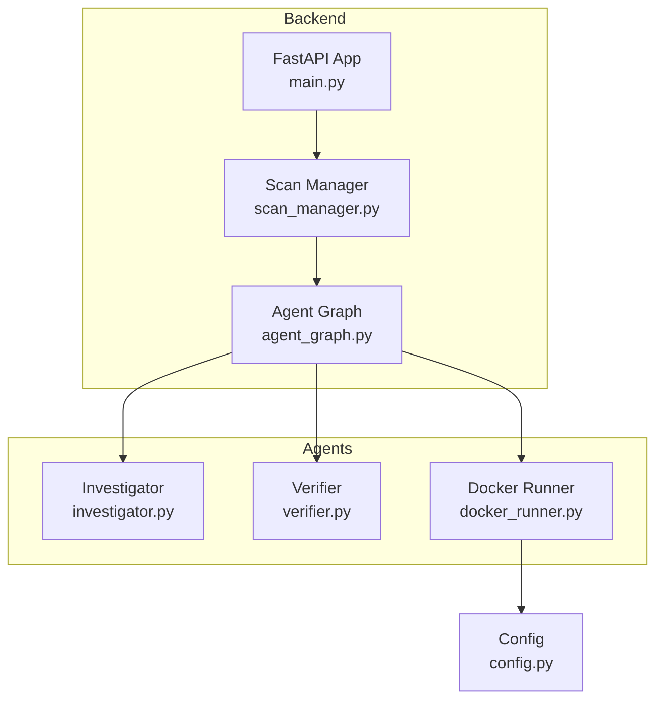
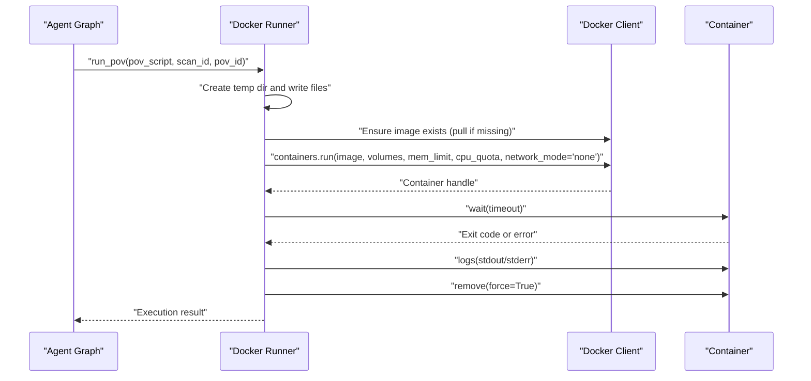
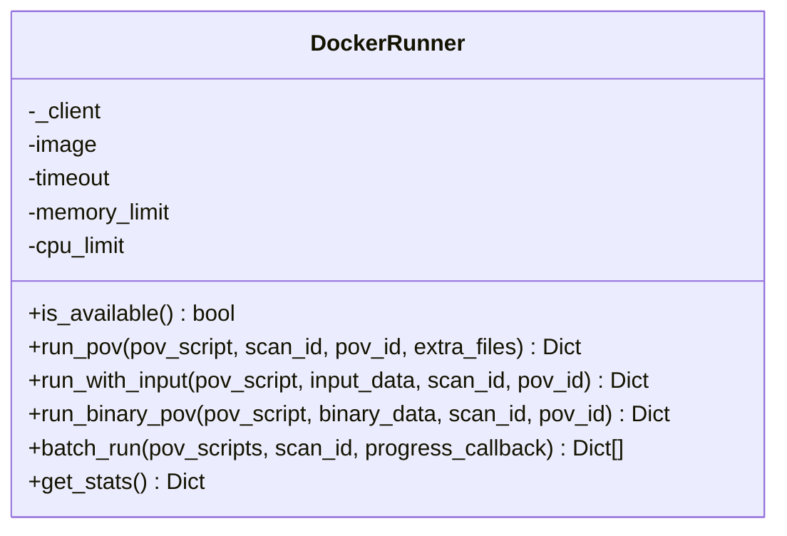
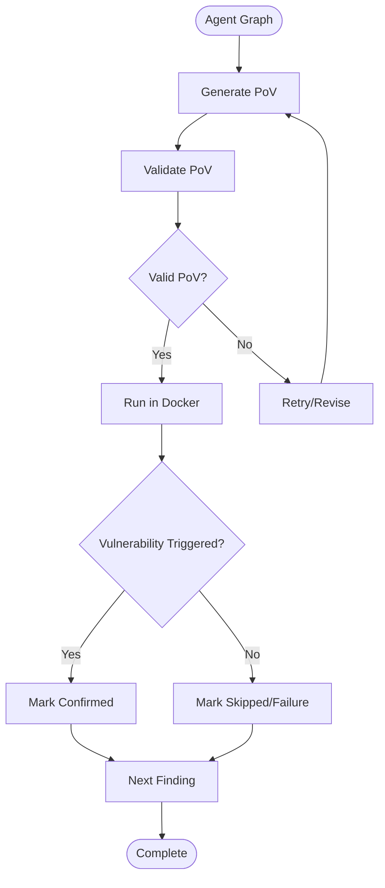
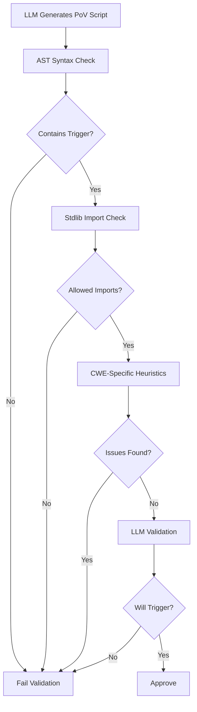
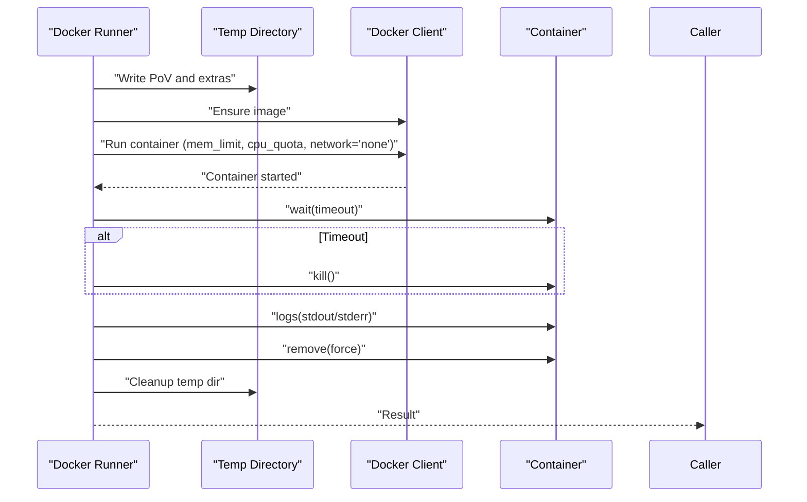
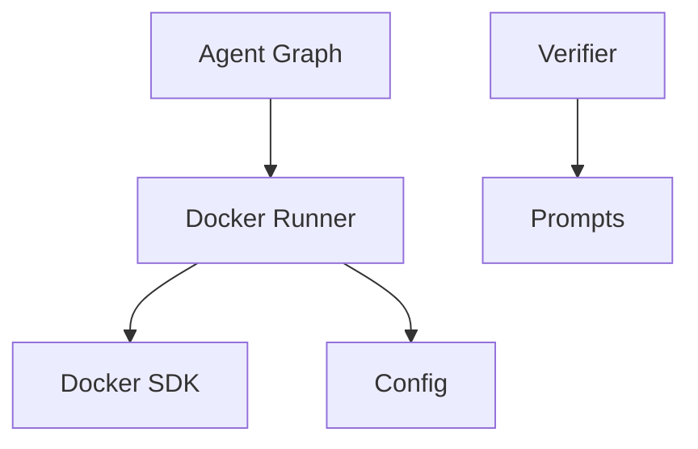

# Docker Execution and Security Agent

<cite>
**Referenced Files in This Document**
- [docker_runner.py](file://autopov/agents/docker_runner.py)
- [config.py](file://autopov/app/config.py)
- [agent_graph.py](file://autopov/app/agent_graph.py)
- [scan_manager.py](file://autopov/app/scan_manager.py)
- [main.py](file://autopov/app/main.py)
- [requirements.txt](file://autopov/requirements.txt)
- [prompts.py](file://autopov/prompts.py)
- [README.md](file://autopov/README.md)
</cite>

## Table of Contents
1. [Introduction](#introduction)
2. [Project Structure](#project-structure)
3. [Core Components](#core-components)
4. [Architecture Overview](#architecture-overview)
5. [Detailed Component Analysis](#detailed-component-analysis)
6. [Dependency Analysis](#dependency-analysis)
7. [Performance Considerations](#performance-considerations)
8. [Troubleshooting Guide](#troubleshooting-guide)
9. [Conclusion](#conclusion)
10. [Appendices](#appendices)

## Introduction
This document explains the Docker execution and security agent responsible for safe, isolated Proof-of-Vulnerability (PoV) script execution. It covers containerized execution environments, Docker image management, resource limiting, network isolation, and the end-to-end execution workflow. It also documents configuration options, security measures, and operational guidance for reliable and secure concurrent execution.

## Project Structure
The Docker execution agent is part of a larger autonomous vulnerability detection framework. The relevant components are organized as follows:
- Backend API and orchestration: FastAPI application, scan manager, and agent graph
- Agents: Investigator, Verifier, and Docker runner
- Configuration: Centralized settings with Docker-related defaults
- Supporting modules: Prompts for PoV generation/validation and CLI/API entry points

**Diagram sources**
- [main.py](file://autopov/app/main.py#L102-L111)
- [agent_graph.py](file://autopov/app/agent_graph.py#L78-L134)
- [scan_manager.py](file://autopov/app/scan_manager.py#L40-L49)
- [docker_runner.py](file://autopov/agents/docker_runner.py#L27-L36)
- [config.py](file://autopov/app/config.py#L13-L84)

**Section sources**
- [README.md](file://autopov/README.md#L17-L35)
- [main.py](file://autopov/app/main.py#L102-L111)
- [agent_graph.py](file://autopov/app/agent_graph.py#L78-L134)
- [docker_runner.py](file://autopov/agents/docker_runner.py#L27-L36)
- [config.py](file://autopov/app/config.py#L13-L84)

## Core Components
- Docker Runner: Orchestrates PoV execution in isolated containers with resource limits, network isolation, and timeout enforcement.
- Configuration: Provides Docker defaults (image, timeout, memory, CPU) and availability checks.
- Agent Graph: Drives the end-to-end workflow, invoking the Docker runner to execute PoVs.
- Scan Manager: Coordinates scan lifecycle and background execution.
- Prompts: Define PoV generation and validation requirements for deterministic, safe execution.

Key capabilities:
- Safe container runtime with no network access
- Resource constraints (memory, CPU quota)
- Execution timeout with controlled termination
- Deterministic PoV validation and retry logic
- Batch execution support

**Section sources**
- [docker_runner.py](file://autopov/agents/docker_runner.py#L27-L379)
- [config.py](file://autopov/app/config.py#L78-L84)
- [agent_graph.py](file://autopov/app/agent_graph.py#L403-L433)
- [prompts.py](file://autopov/prompts.py#L46-L109)

## Architecture Overview
The Docker execution agent integrates tightly with the agent graph and configuration system. The workflow is:
- Agent graph determines when to run PoVs
- Docker runner prepares a temporary directory with PoV script and optional inputs
- Docker runner ensures the image exists, pulls if missing, and starts a container with strict resource and network constraints
- The container runs the PoV script and logs outputs
- Results are collected, including whether the PoV triggered the vulnerability

**Diagram sources**
- [agent_graph.py](file://autopov/app/agent_graph.py#L403-L433)
- [docker_runner.py](file://autopov/agents/docker_runner.py#L113-L150)

## Detailed Component Analysis

### Docker Runner
The Docker Runner encapsulates all containerized execution logic:
- Availability checks: Validates Docker presence and connectivity
- Image management: Ensures the configured image exists, pulling if absent
- Resource limits: Applies memory limit and CPU quota
- Network isolation: Disables networking for safety
- Execution lifecycle: Starts container, waits with timeout, collects logs, and cleans up
- Input handling: Supports stdin via wrapper scripts and binary inputs
- Batch execution: Runs multiple PoVs sequentially with progress callbacks
- Stats: Exposes Docker daemon stats and configuration

Security and safety features:
- No network access via network_mode='none'
- Strict memory and CPU limits
- Controlled timeout to prevent runaway executions
- Temporary directory cleanup regardless of outcome

Operational highlights:
- run_pov: Executes a PoV script with optional extra files
- run_with_input: Pipes textual input to the PoV via a wrapper
- run_binary_pov: Provides binary input via mounted volume
- batch_run: Iterative execution with progress reporting
- get_stats: Inspects Docker daemon and runner configuration

**Diagram sources**
- [docker_runner.py](file://autopov/agents/docker_runner.py#L27-L379)

**Section sources**
- [docker_runner.py](file://autopov/agents/docker_runner.py#L27-L379)

### Configuration and Defaults
Docker-related configuration is centralized:
- DOCKER_ENABLED: Toggle for Docker execution
- DOCKER_IMAGE: Base image for PoV execution (Python slim)
- DOCKER_TIMEOUT: Execution timeout in seconds
- DOCKER_MEMORY_LIMIT: Memory limit string (e.g., "512m")
- DOCKER_CPU_LIMIT: CPU shares as a fraction of a single core

Availability checks:
- is_docker_available(): Verifies Docker daemon readiness

These settings are consumed by the Docker Runner and influence execution behavior.

**Section sources**
- [config.py](file://autopov/app/config.py#L78-L84)
- [config.py](file://autopov/app/config.py#L123-L136)

### Agent Graph Integration
The agent graph orchestrates PoV execution as part of the vulnerability detection pipeline:
- Generates PoV scripts via the Verifier agent
- Validates PoVs for correctness and safety
- Invokes the Docker Runner to execute PoVs in containers
- Logs outcomes and transitions to next steps

**Diagram sources**
- [agent_graph.py](file://autopov/app/agent_graph.py#L403-L433)
- [agent_graph.py](file://autopov/app/agent_graph.py#L501-L515)

**Section sources**
- [agent_graph.py](file://autopov/app/agent_graph.py#L403-L433)
- [agent_graph.py](file://autopov/app/agent_graph.py#L501-L515)

### PoV Generation and Validation
PoV scripts are generated and validated to ensure deterministic, safe execution:
- Generation prompt enforces standard library usage and a specific trigger message
- Validation checks include syntax, required trigger message, standard library usage, and CWE-specific heuristics
- LLM-based validation augments automated checks

**Diagram sources**
- [prompts.py](file://autopov/prompts.py#L46-L78)
- [prompts.py](file://autopov/prompts.py#L82-L109)
- [verifier.py](file://autopov/agents/verifier.py#L151-L227)

**Section sources**
- [prompts.py](file://autopov/prompts.py#L46-L109)
- [verifier.py](file://autopov/agents/verifier.py#L151-L227)

### Execution Workflow Details
- Packaging: The Docker Runner writes the PoV script and any extra files to a temporary directory and mounts it read-only into the container.
- Container startup: The runner ensures the image exists, then starts the container with:
  - Working directory set to the mounted path
  - Memory limit and CPU quota applied
  - Network disabled
  - Detached mode with stdout/stderr streaming
- Monitoring: The runner waits for completion up to the configured timeout; on timeout, the container is killed.
- Result collection: The runner captures stdout/stderr, determines if the PoV triggered the vulnerability, computes execution time, and returns a structured result.
- Cleanup: The container is removed and the temporary directory is deleted.

**Diagram sources**
- [docker_runner.py](file://autopov/agents/docker_runner.py#L92-L191)
- [docker_runner.py](file://autopov/agents/docker_runner.py#L251-L311)

**Section sources**
- [docker_runner.py](file://autopov/agents/docker_runner.py#L92-L191)
- [docker_runner.py](file://autopov/agents/docker_runner.py#L251-L311)

## Dependency Analysis
External dependencies relevant to Docker execution:
- Docker SDK: Used for client initialization, image management, container lifecycle, and stats
- Python standard library: Enforced by PoV validation to minimize attack surface
- Configuration system: Centralizes Docker settings and availability checks

**Diagram sources**
- [docker_runner.py](file://autopov/agents/docker_runner.py#L12-L18)
- [config.py](file://autopov/app/config.py#L78-L84)
- [prompts.py](file://autopov/prompts.py#L46-L109)
- [agent_graph.py](file://autopov/app/agent_graph.py#L403-L433)

**Section sources**
- [requirements.txt](file://autopov/requirements.txt#L23-L24)
- [docker_runner.py](file://autopov/agents/docker_runner.py#L12-L18)
- [config.py](file://autopov/app/config.py#L78-L84)
- [prompts.py](file://autopov/prompts.py#L46-L109)
- [agent_graph.py](file://autopov/app/agent_graph.py#L403-L433)

## Performance Considerations
- Concurrency: The Docker Runner executes PoVs sequentially by default. For concurrent execution, consider:
  - Using separate Docker images per PoV to isolate state
  - Implementing a worker pool with bounded concurrency
  - Applying per-container CPU quotas proportionally to available cores
- Resource sizing: Tune memory and CPU limits based on workload characteristics; monitor container stats via get_stats
- I/O: Prefer read-only mounts and minimal file writes inside containers to reduce overhead
- Batch execution: Use batch_run for multiple PoVs to amortize setup costs

[No sources needed since this section provides general guidance]

## Troubleshooting Guide
Common issues and remedies:
- Docker not available
  - Symptom: Docker runner reports failure and “Docker not available”
  - Action: Verify Docker service is running and accessible; check DOCKER_ENABLED and is_docker_available
- Image pull failures
  - Symptom: Failure to pull the configured image
  - Action: Ensure network access to registry; pre-pull the image or adjust DOCKER_IMAGE
- Timeout exceeded
  - Symptom: Container killed after timeout; exit code -1
  - Action: Increase DOCKER_TIMEOUT; optimize PoV logic; reduce memory/CPU limits if needed
- No network access
  - Symptom: PoV cannot reach external resources
  - Action: Expected behavior; PoVs must be self-contained
- Resource exhaustion
  - Symptom: Out-of-memory or throttled CPU
  - Action: Increase memory limit or reduce CPU quota; validate PoV logic
- Validation failures
  - Symptom: PoV rejected due to syntax, imports, or missing trigger
  - Action: Review PoV against validation criteria; ensure standard library usage and required trigger message

Operational tips:
- Monitor Docker daemon stats via get_stats
- Stream logs via the API for real-time visibility
- Use batch_run with progress callbacks for long-running sequences

**Section sources**
- [docker_runner.py](file://autopov/agents/docker_runner.py#L81-L90)
- [docker_runner.py](file://autopov/agents/docker_runner.py#L135-L143)
- [config.py](file://autopov/app/config.py#L123-L136)
- [agent_graph.py](file://autopov/app/agent_graph.py#L403-L433)

## Conclusion
The Docker execution and security agent provides a robust, safe, and configurable foundation for PoV script execution. By enforcing strict resource limits, disabling network access, and validating PoVs, it minimizes risk while enabling reliable benchmarking. The agent integrates seamlessly with the broader framework’s orchestration and configuration systems, supporting both single-shot and batch execution scenarios.

[No sources needed since this section summarizes without analyzing specific files]

## Appendices

### Configuration Options
- DOCKER_ENABLED: Enable/disable Docker execution
- DOCKER_IMAGE: Base image for PoV execution
- DOCKER_TIMEOUT: Execution timeout in seconds
- DOCKER_MEMORY_LIMIT: Memory limit string
- DOCKER_CPU_LIMIT: CPU shares as a fraction of a core

Environment variables and defaults are defined in the configuration module.

**Section sources**
- [config.py](file://autopov/app/config.py#L78-L84)

### Practical Examples
- Container setup
  - The Docker Runner creates a temporary directory, writes the PoV script and optional inputs, and mounts it read-only into the container.
- Execution monitoring
  - Use get_stats to inspect Docker daemon and runner configuration; stream logs via the API for live updates.
- Troubleshooting
  - If Docker is unavailable, verify service status and permissions; if timeouts occur, increase DOCKER_TIMEOUT; if validation fails, refine the PoV according to validation criteria.

**Section sources**
- [docker_runner.py](file://autopov/agents/docker_runner.py#L92-L191)
- [docker_runner.py](file://autopov/agents/docker_runner.py#L346-L370)
- [main.py](file://autopov/app/main.py#L350-L385)

### Security Best Practices
- Always run containers with network disabled
- Apply strict memory and CPU limits
- Validate PoVs using AST and standard library checks
- Use read-only mounts and minimal file writes
- Periodically audit and rotate API keys and secrets

**Section sources**
- [docker_runner.py](file://autopov/agents/docker_runner.py#L129-L133)
- [docker_runner.py](file://autopov/agents/docker_runner.py#L276-L280)
- [verifier.py](file://autopov/agents/verifier.py#L177-L227)