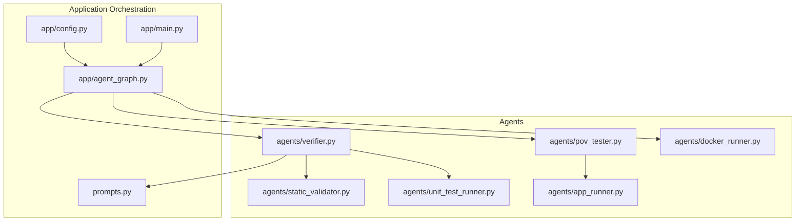
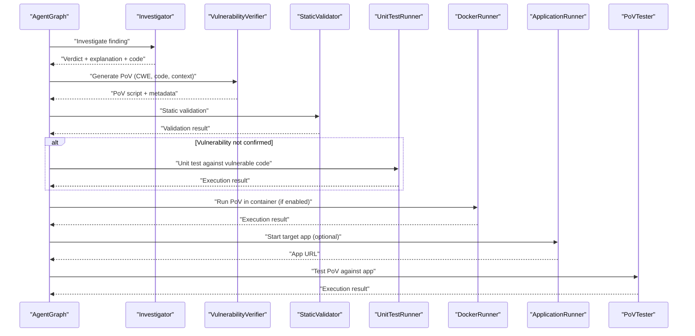
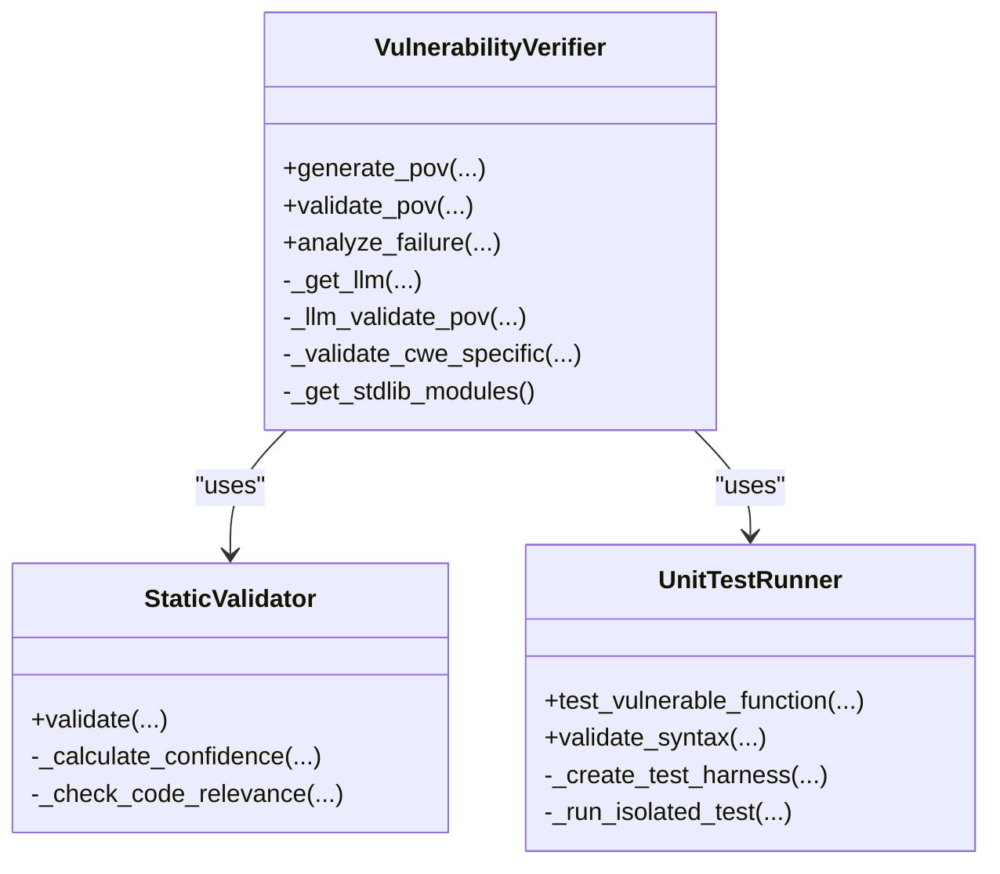
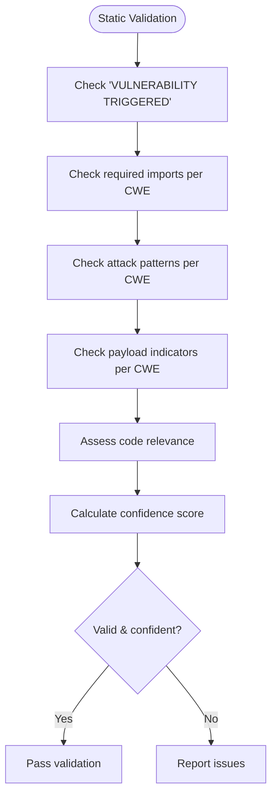
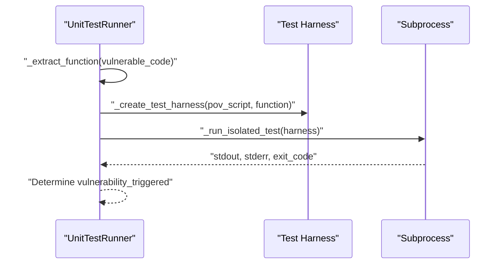
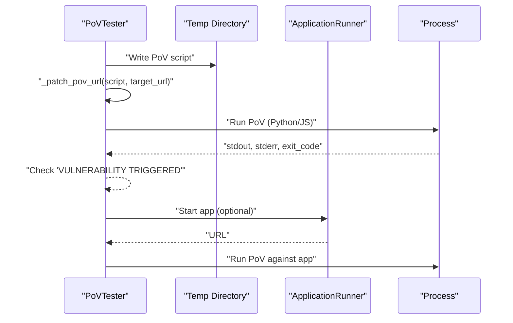
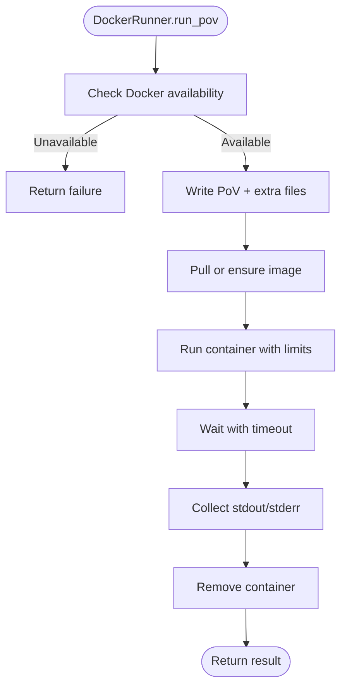
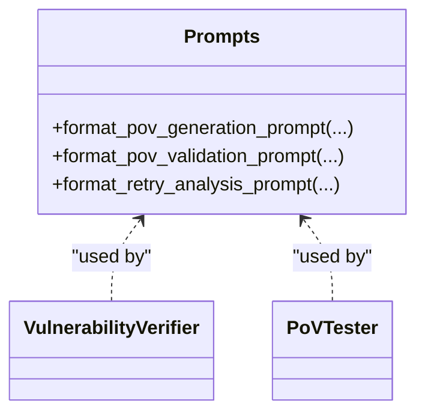
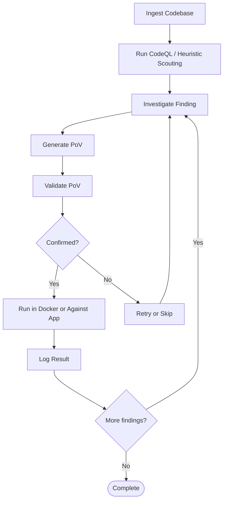
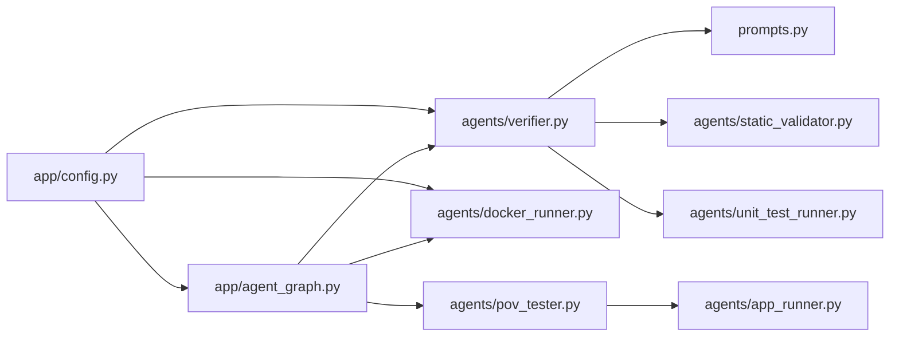

# Generation Agents

<cite>
**Referenced Files in This Document**
- [verifier.py](file://agents/verifier.py)
- [pov_tester.py](file://agents/pov_tester.py)
- [static_validator.py](file://agents/static_validator.py)
- [unit_test_runner.py](file://agents/unit_test_runner.py)
- [docker_runner.py](file://agents/docker_runner.py)
- [app_runner.py](file://agents/app_runner.py)
- [prompts.py](file://prompts.py)
- [agent_graph.py](file://app/agent_graph.py)
- [config.py](file://app/config.py)
- [main.py](file://app/main.py)
- [test_patterns.py](file://test_patterns.py)
</cite>

## Table of Contents
1. [Introduction](#introduction)
2. [Project Structure](#project-structure)
3. [Core Components](#core-components)
4. [Architecture Overview](#architecture-overview)
5. [Detailed Component Analysis](#detailed-component-analysis)
6. [Dependency Analysis](#dependency-analysis)
7. [Performance Considerations](#performance-considerations)
8. [Troubleshooting Guide](#troubleshooting-guide)
9. [Conclusion](#conclusion)
10. [Appendices](#appendices)

## Introduction
This document explains AutoPoV’s generation agents responsible for creating Proof-of-Vulnerability (PoV) scripts and exploit demonstrations. It focuses on the Verifier agent’s PoV generation capabilities, including template-based generation, code synthesis techniques, and exploit crafting methodologies. It also covers integration with vulnerability-specific exploit patterns, payload generation, and validation script creation. The document details the generation workflow from vulnerability analysis through PoV script construction to executable proof creation, along with configuration options, output formatting preferences, and security considerations. Implementation details for code generation templates, exploit pattern matching, and script validation are included, alongside troubleshooting approaches for generation failures, script compatibility issues, and security validation.

## Project Structure
AutoPoV organizes generation-related logic primarily under agents/, with orchestration in app/agent_graph.py and configuration in app/config.py. The prompts module centralizes LLM prompts for PoV generation, validation, and retry analysis. The main API surface is exposed via app/main.py.

**Diagram sources**
- [verifier.py:1-562](file://agents/verifier.py#L1-L562)
- [static_validator.py:1-305](file://agents/static_validator.py#L1-L305)
- [unit_test_runner.py:1-344](file://agents/unit_test_runner.py#L1-L344)
- [pov_tester.py:1-296](file://agents/pov_tester.py#L1-L296)
- [docker_runner.py:1-377](file://agents/docker_runner.py#L1-L377)
- [app_runner.py:1-200](file://agents/app_runner.py#L1-L200)
- [agent_graph.py:1-1225](file://app/agent_graph.py#L1-L1225)
- [prompts.py:1-424](file://prompts.py#L1-L424)
- [config.py:1-255](file://app/config.py#L1-L255)
- [main.py:1-768](file://app/main.py#L1-L768)

**Section sources**
- [agent_graph.py:82-168](file://app/agent_graph.py#L82-L168)
- [config.py:13-255](file://app/config.py#L13-L255)
- [prompts.py:46-221](file://prompts.py#L46-L221)

## Core Components
- VulnerabilityVerifier (agents/verifier.py): Generates PoV scripts using LLM prompts and validates them using a hybrid approach (static, unit test, and LLM fallback).
- StaticValidator (agents/static_validator.py): Performs static analysis to validate PoV scripts without execution, checking for required imports, attack patterns, and indicators.
- UnitTestRunner (agents/unit_test_runner.py): Executes PoV scripts against isolated vulnerable code snippets in a controlled environment.
- PoVTester (agents/pov_tester.py): Tests PoV scripts against running applications, patching target URLs and running Python/JavaScript PoVs.
- DockerRunner (agents/docker_runner.py): Runs PoV scripts in isolated Docker containers with resource limits and no network access.
- ApplicationRunner (agents/app_runner.py): Manages lifecycle of target applications for PoV testing.
- Prompt Templates (prompts.py): Centralized prompts for investigation, PoV generation, validation, and retry analysis.
- Agent Graph Orchestrator (app/agent_graph.py): Coordinates the full workflow from ingestion to PoV validation and execution.
- Configuration (app/config.py): Defines LLM providers, routing modes, Docker settings, and supported CWEs.

**Section sources**
- [verifier.py:42-562](file://agents/verifier.py#L42-L562)
- [static_validator.py:22-305](file://agents/static_validator.py#L22-L305)
- [unit_test_runner.py:28-344](file://agents/unit_test_runner.py#L28-L344)
- [pov_tester.py:21-296](file://agents/pov_tester.py#L21-L296)
- [docker_runner.py:27-377](file://agents/docker_runner.py#L27-L377)
- [app_runner.py:19-200](file://agents/app_runner.py#L19-L200)
- [prompts.py:46-221](file://prompts.py#L46-L221)
- [agent_graph.py:779-805](file://app/agent_graph.py#L779-L805)
- [config.py:13-255](file://app/config.py#L13-L255)

## Architecture Overview
The generation workflow is orchestrated by the Agent Graph, which:
- Ingests codebases and runs CodeQL or heuristic/LLM scouting to discover findings.
- Investigates findings with LLM to determine if they are real vulnerabilities.
- Generates PoV scripts using VulnerabilityVerifier with template-based prompts.
- Validates PoVs using StaticValidator, UnitTestRunner, and LLM fallback.
- Executes PoVs in Docker or against running apps via PoVTester.

**Diagram sources**
- [agent_graph.py:779-805](file://app/agent_graph.py#L779-L805)
- [verifier.py:90-224](file://agents/verifier.py#L90-L224)
- [static_validator.py:123-233](file://agents/static_validator.py#L123-L233)
- [unit_test_runner.py:34-116](file://agents/unit_test_runner.py#L34-L116)
- [docker_runner.py:62-192](file://agents/docker_runner.py#L62-L192)
- [app_runner.py:25-133](file://agents/app_runner.py#L25-L133)
- [pov_tester.py:24-100](file://agents/pov_tester.py#L24-L100)

## Detailed Component Analysis

### VulnerabilityVerifier: PoV Generation and Validation
- Generation:
  - Uses format_pov_generation_prompt to construct a tailored prompt embedding CWE, file path, line number, vulnerable code, explanation, and code context.
  - Selects LLM mode (online via OpenRouter or offline via Ollama) based on configuration.
  - Cleans markdown code blocks from LLM output and records token usage and cost.
- Validation:
  - Static validation via StaticValidator (required “VULNERABILITY TRIGGERED” indicator, required imports, attack patterns, payload indicators, and relevance to vulnerable code).
  - Unit test execution via UnitTestRunner when vulnerable code is available.
  - Traditional validation fallback: AST syntax check, presence of “VULNERABILITY TRIGGERED”, only standard library imports, CWE-specific checks, and optional LLM analysis.
- Retry analysis:
  - Uses format_retry_analysis_prompt to analyze failures and suggest improvements.

**Diagram sources**
- [verifier.py:42-562](file://agents/verifier.py#L42-L562)
- [static_validator.py:22-305](file://agents/static_validator.py#L22-L305)
- [unit_test_runner.py:28-344](file://agents/unit_test_runner.py#L28-L344)

**Section sources**
- [verifier.py:90-224](file://agents/verifier.py#L90-L224)
- [verifier.py:225-387](file://agents/verifier.py#L225-L387)
- [verifier.py:425-451](file://agents/verifier.py#L425-L451)
- [verifier.py:453-491](file://agents/verifier.py#L453-L491)

### StaticValidator: Template-Based Static Analysis
- Pattern Matching:
  - CWE-specific patterns define required imports, attack patterns, and payload indicators for each vulnerability family.
  - Validates presence of “VULNERABILITY TRIGGERED” and assesses relevance to the vulnerable code.
- Confidence Calculation:
  - Combines matched patterns, presence of vulnerability check, code relevance, and issue counts into a normalized confidence score.

**Diagram sources**
- [static_validator.py:123-233](file://agents/static_validator.py#L123-L233)
- [static_validator.py:261-284](file://agents/static_validator.py#L261-L284)

**Section sources**
- [static_validator.py:25-118](file://agents/static_validator.py#L25-L118)
- [static_validator.py:123-233](file://agents/static_validator.py#L123-L233)
- [static_validator.py:261-284](file://agents/static_validator.py#L261-L284)

### UnitTestRunner: Isolated Vulnerable Function Testing
- Extracts the vulnerable function from the code snippet and creates a test harness that executes the PoV script in the same namespace as the vulnerable code.
- Runs the harness in an isolated subprocess with restricted environment and timeouts.
- Reports success/failure, vulnerability-triggered outcome, and execution details.

**Diagram sources**
- [unit_test_runner.py:118-234](file://agents/unit_test_runner.py#L118-L234)
- [unit_test_runner.py:236-286](file://agents/unit_test_runner.py#L236-L286)

**Section sources**
- [unit_test_runner.py:34-116](file://agents/unit_test_runner.py#L34-L116)
- [unit_test_runner.py:118-234](file://agents/unit_test_runner.py#L118-L234)
- [unit_test_runner.py:236-286](file://agents/unit_test_runner.py#L236-L286)

### PoVTester: Application-Level Testing
- Writes the PoV script to a temporary directory and patches target URLs to match the running application.
- Supports Python and JavaScript PoVs, with environment variables injected for target URL.
- Provides lifecycle testing with ApplicationRunner to start, test, and stop applications.

**Diagram sources**
- [pov_tester.py:24-100](file://agents/pov_tester.py#L24-L100)
- [pov_tester.py:107-138](file://agents/pov_tester.py#L107-L138)
- [pov_tester.py:140-222](file://agents/pov_tester.py#L140-L222)
- [app_runner.py:25-133](file://agents/app_runner.py#L25-L133)

**Section sources**
- [pov_tester.py:24-100](file://agents/pov_tester.py#L24-L100)
- [pov_tester.py:107-138](file://agents/pov_tester.py#L107-L138)
- [pov_tester.py:140-222](file://agents/pov_tester.py#L140-L222)
- [app_runner.py:25-133](file://agents/app_runner.py#L25-L133)

### DockerRunner: Secure Execution Environment
- Runs PoV scripts in isolated Docker containers with resource limits and no network access.
- Supports batch execution and provides statistics about Docker availability and runtime configuration.

**Diagram sources**
- [docker_runner.py:62-192](file://agents/docker_runner.py#L62-L192)
- [docker_runner.py:311-342](file://agents/docker_runner.py#L311-L342)

**Section sources**
- [docker_runner.py:27-377](file://agents/docker_runner.py#L27-L377)

### Prompt Templates: Code Generation and Validation
- PoV Generation Prompt: Guides LLM to produce a deterministic, standard-library-only PoV script that prints “VULNERABILITY TRIGGERED” and targets the specific CWE.
- PoV Validation Prompt: Requests structured validation of PoV scripts with criteria such as standard library usage, determinism, and correctness.
- Retry Analysis Prompt: Helps diagnose why a PoV failed and suggests improvements.

**Diagram sources**
- [prompts.py:46-221](file://prompts.py#L46-L221)
- [verifier.py:126-135](file://agents/verifier.py#L126-L135)
- [verifier.py:461-466](file://agents/verifier.py#L461-L466)
- [verifier.py:519-528](file://agents/verifier.py#L519-L528)

**Section sources**
- [prompts.py:46-221](file://prompts.py#L46-L221)

### Agent Graph Orchestration: From Finding to Executable Proof
- The Agent Graph coordinates nodes for ingestion, CodeQL/LLM scanning, investigation, PoV generation, validation, and execution.
- It selects models via policy routing and transitions between nodes based on outcomes (confirm PoV, skip, retry, or fail).

**Diagram sources**
- [agent_graph.py:88-168](file://app/agent_graph.py#L88-L168)
- [agent_graph.py:779-805](file://app/agent_graph.py#L779-L805)

**Section sources**
- [agent_graph.py:88-168](file://app/agent_graph.py#L88-L168)
- [agent_graph.py:779-805](file://app/agent_graph.py#L779-L805)

## Dependency Analysis
- LLM Providers:
  - Online (OpenRouter) and offline (Ollama) configurations are supported via app/config.py.
  - VulnerabilityVerifier dynamically selects the appropriate LLM client and records token usage and cost.
- Static Validation Dependencies:
  - StaticValidator relies on regex-based pattern matching and CWE-specific indicators.
- Execution Dependencies:
  - UnitTestRunner depends on Python subprocess isolation and AST parsing.
  - PoVTester depends on ApplicationRunner for app lifecycle and subprocess execution.
  - DockerRunner depends on Docker SDK and settings for resource limits.

**Diagram sources**
- [config.py:212-231](file://app/config.py#L212-L231)
- [verifier.py:48-88](file://agents/verifier.py#L48-L88)
- [docker_runner.py:37-48](file://agents/docker_runner.py#L37-L48)
- [agent_graph.py:88-168](file://app/agent_graph.py#L88-L168)

**Section sources**
- [config.py:212-231](file://app/config.py#L212-L231)
- [verifier.py:48-88](file://agents/verifier.py#L48-L88)
- [docker_runner.py:37-48](file://agents/docker_runner.py#L37-L48)
- [agent_graph.py:88-168](file://app/agent_graph.py#L88-L168)

## Performance Considerations
- Token Usage Tracking:
  - VulnerabilityVerifier extracts usage metadata from LLM responses to compute costs and track token consumption.
- Cost Control:
  - Configuration supports cost tracking and maximum cost thresholds; model selection affects pricing.
- Execution Timeouts:
  - UnitTestRunner and DockerRunner enforce timeouts to prevent runaway executions.
- Static Validation First:
  - Prioritizing static validation reduces expensive unit test and LLM fallback calls.

[No sources needed since this section provides general guidance]

## Troubleshooting Guide
Common issues and resolutions:
- Non-stdlib imports in PoV scripts:
  - StaticValidator flags disallowed imports; adjust PoV to use only standard library modules.
- Missing “VULNERABILITY TRIGGERED”:
  - Ensure the PoV prints the required indicator upon successful exploitation.
- Syntax errors:
  - Use UnitTestRunner.validate_syntax to catch early issues.
- Docker not available:
  - Verify Docker availability and connectivity; otherwise, rely on unit tests or app-based testing.
- Application startup failures:
  - Check ApplicationRunner logs and ensure dependencies are installed and ports are free.
- Retry analysis:
  - Use VulnerabilityVerifier.analyze_failure to get structured suggestions for fixing PoVs.

**Section sources**
- [verifier.py:328-387](file://agents/verifier.py#L328-L387)
- [static_validator.py:123-233](file://agents/static_validator.py#L123-L233)
- [unit_test_runner.py:320-334](file://agents/unit_test_runner.py#L320-L334)
- [docker_runner.py:50-61](file://agents/docker_runner.py#L50-L61)
- [app_runner.py:135-148](file://agents/app_runner.py#L135-L148)
- [verifier.py:492-551](file://agents/verifier.py#L492-L551)

## Conclusion
AutoPoV’s generation agents combine template-based LLM prompts, robust static validation, and controlled execution environments to reliably produce executable PoV scripts. The Verifier agent orchestrates generation and validation, while supporting agents handle unit testing, application-level testing, and secure containerized execution. Configuration enables flexible model selection and strict security boundaries, ensuring reproducible and safe PoV demonstrations.

[No sources needed since this section summarizes without analyzing specific files]

## Appendices

### Configuration Options for Exploit Types and Output Formatting
- LLM Mode and Models:
  - Online (OpenRouter) or offline (Ollama) with configurable base URLs and model names.
- CWE Support:
  - Predefined list of supported CWEs optimized for web vulnerabilities.
- Docker Execution:
  - Memory limits, CPU quotas, and timeouts configurable.
- Output Metadata:
  - Generation time, timestamps, model used, token usage, and cost tracking.

**Section sources**
- [config.py:30-101](file://app/config.py#L30-L101)
- [config.py:108-134](file://app/config.py#L108-L134)
- [config.py:92-98](file://app/config.py#L92-L98)
- [verifier.py:147-211](file://agents/verifier.py#L147-L211)

### Example: CWE-Specific Validation Rules
- CWE-119 (Buffer Overflow): Looks for buffer-related terms and large sizes.
- CWE-89 (SQL Injection): Checks for SQL keywords and injection patterns.
- CWE-416 (Use After Free): Notes that C code is typically required.
- CWE-190 (Integer Overflow): Requires large numeric values.

**Section sources**
- [verifier.py:425-451](file://agents/verifier.py#L425-L451)

### Example: Regex Patterns for Vulnerability Discovery
- Patterns for SQL injection detection demonstrate how AutoPoV identifies risky constructs in code.

**Section sources**
- [test_patterns.py:6-14](file://test_patterns.py#L6-L14)