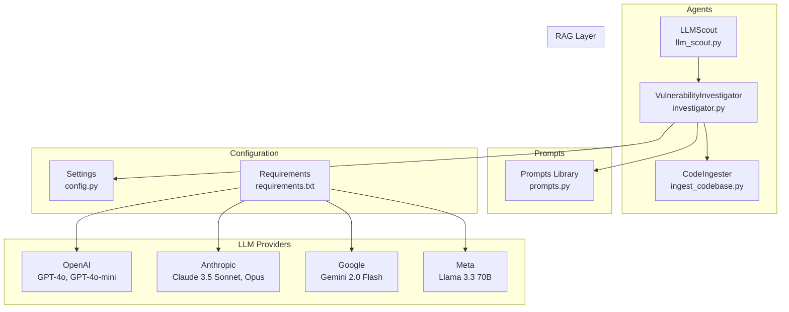
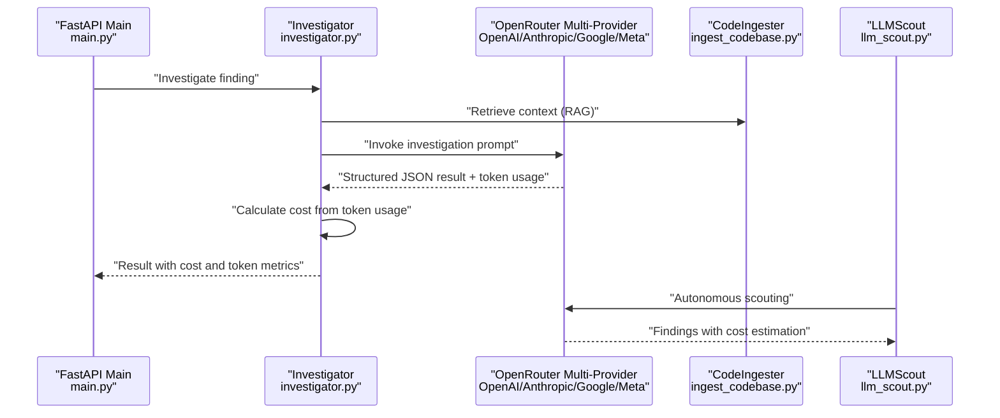
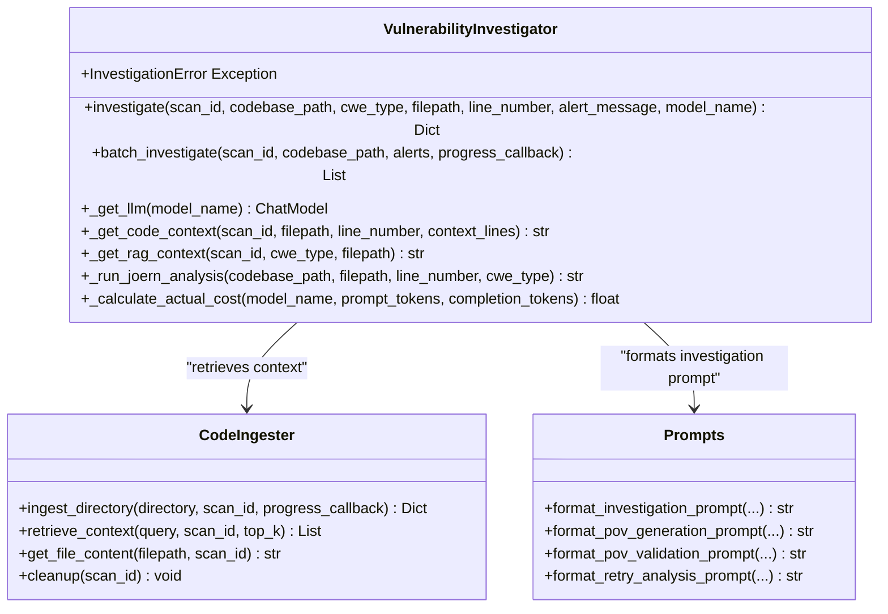
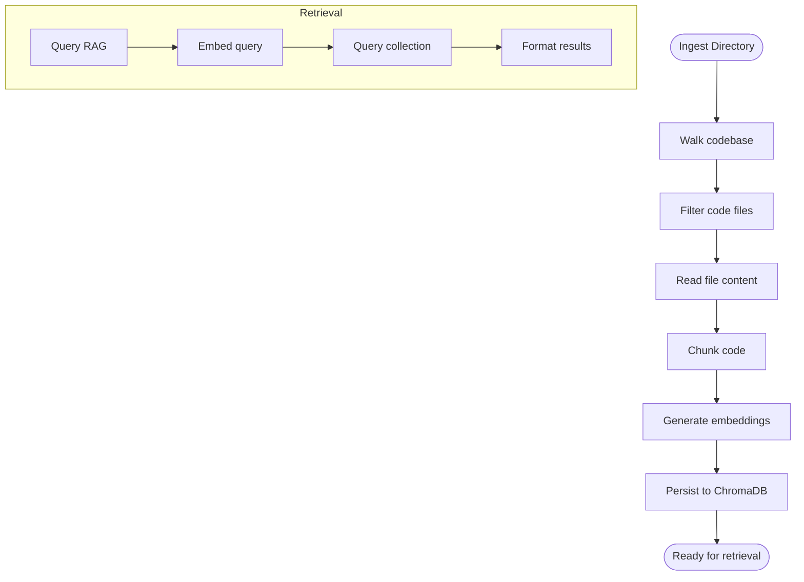
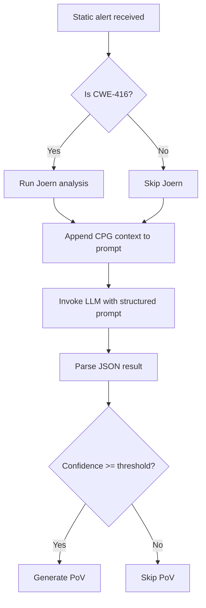
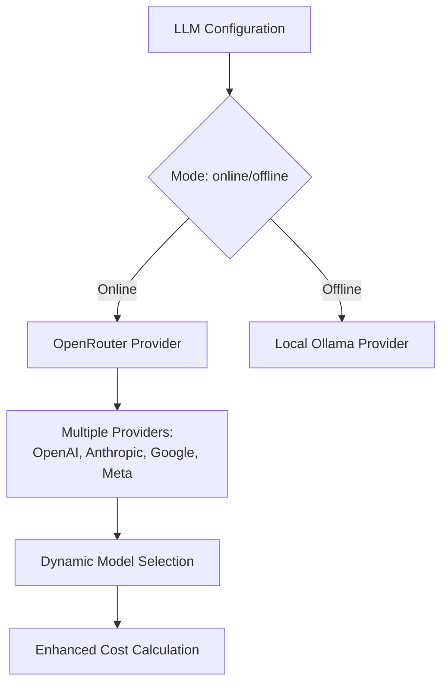
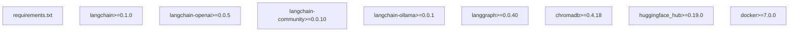

# Investigator Agent

<cite>
**Referenced Files in This Document**
- [investigator.py](file://agents/investigator.py)
- [prompts.py](file://prompts.py)
- [config.py](file://app/config.py)
- [ingest_codebase.py](file://agents/ingest_codebase.py)
- [llm_scout.py](file://agents/llm_scout.py)
- [requirements.txt](file://requirements.txt)
</cite>

## Update Summary
**Changes Made**
- Enhanced LLM integration with support for multiple providers (OpenAI, Anthropic, Google, Meta) via OpenRouter
- Improved cost calculation mechanisms with comprehensive token usage tracking
- Added dynamic model switching capabilities allowing per-investigation model overrides
- Enhanced error handling for model availability and provider configuration
- Expanded supported models list including Anthropic Claude, Google Gemini, and Meta Llama models
- Added robust token usage extraction from various LangChain response formats

## Table of Contents
1. [Introduction](#introduction)
2. [Project Structure](#project-structure)
3. [Core Components](#core-components)
4. [Architecture Overview](#architecture-overview)
5. [Detailed Component Analysis](#detailed-component-analysis)
6. [Enhanced LLM Provider Integration](#enhanced-llm-provider-integration)
7. [Advanced Cost Tracking System](#advanced-cost-tracking-system)
8. [Dynamic Model Switching](#dynamic-model-switching)
9. [Enhanced Error Handling System](#enhanced-error-handling-system)
10. [Dependency Analysis](#dependency-analysis)
11. [Performance Considerations](#performance-considerations)
12. [Troubleshooting Guide](#troubleshooting-guide)
13. [Conclusion](#conclusion)
14. [Appendices](#appendices)

## Introduction
This document explains the Investigator Agent responsible for LLM-based vulnerability analysis and reasoning. The agent has been significantly enhanced with improved LLM integration supporting multiple providers (OpenAI, Anthropic, Google, Meta), better error handling for model availability, and dynamic model switching capabilities. It covers how the agent performs Retrieval-Augmented Generation (RAG) to detect and assess vulnerabilities, integrates with multiple LLM providers through OpenRouter, and orchestrates CWE-specific analysis patterns. The agent now features robust cost calculation mechanisms, comprehensive token usage tracking, and enhanced error handling with structured diagnostic details.

## Project Structure
The Investigator Agent is part of a broader autonomous vulnerability detection framework built with FastAPI, LangChain, LangGraph, and vector databases. The agent's responsibilities include:
- Retrieving context from a vector store (ChromaDB)
- Analyzing code chunks and CWE-specific patterns
- Calling LLMs through OpenRouter with support for multiple providers
- Returning structured results with confidence scores, cost tracking, and token usage
- Integrating with the broader agentic workflow for PoV generation and execution
- Providing enhanced error handling with structured diagnostics and fallback mechanisms



**Diagram sources**
- [investigator.py:37-521](file://agents/investigator.py#L37-L521)
- [prompts.py:7-420](file://prompts.py#L7-L420)
- [config.py:13-249](file://app/config.py#L13-L249)
- [ingest_codebase.py:41-407](file://agents/ingest_codebase.py#L41-L407)
- [llm_scout.py:120-207](file://agents/llm_scout.py#L120-L207)
- [requirements.txt:9-14](file://requirements.txt#L9-L14)

**Section sources**
- [investigator.py:1-521](file://agents/investigator.py#L1-L521)
- [prompts.py:1-420](file://prompts.py#L1-L420)
- [config.py:1-249](file://app/config.py#L1-L249)
- [ingest_codebase.py:1-407](file://agents/ingest_codebase.py#L1-L407)
- [llm_scout.py:1-207](file://agents/llm_scout.py#L1-L207)
- [requirements.txt:1-42](file://requirements.txt#L1-L42)

## Core Components
- **VulnerabilityInvestigator**: Orchestrates RAG-based investigation, LLM calls with multiple provider support, and CWE-specific analysis. Now includes enhanced error handling, dynamic model switching, and comprehensive cost tracking with token usage extraction.
- **CodeIngester**: Handles code ingestion, chunking, embedding, and ChromaDB storage. Provides retrieval and file content lookup for context.
- **Prompts**: Centralized prompt templates for investigation, PoV generation, and retry analysis.
- **LLMScout**: Autonomous vulnerability discovery agent that integrates with the investigator for cost estimation and token tracking.
- **Enhanced Configuration**: Supports multiple LLM providers through OpenRouter with comprehensive model selection and cost tracking.

**Section sources**
- [investigator.py:37-521](file://agents/investigator.py#L37-L521)
- [ingest_codebase.py:41-407](file://agents/ingest_codebase.py#L41-L407)
- [prompts.py:7-420](file://prompts.py#L7-L420)
- [llm_scout.py:120-207](file://agents/llm_scout.py#L120-L207)
- [config.py:54-62](file://app/config.py#L54-L62)

## Architecture Overview
The Investigator Agent participates in an enhanced multi-stage workflow with improved LLM provider integration:
1. Code ingestion and embedding into ChromaDB
2. Static analysis (CodeQL) to produce candidate findings
3. LLM-based investigation with dynamic model selection through OpenRouter
4. Optional CWE-specific dynamic analysis (Joern for use-after-free)
5. PoV generation and validation
6. Safe execution in Docker
7. Comprehensive cost tracking and reporting



**Diagram sources**
- [investigator.py:270-434](file://agents/investigator.py#L270-L434)
- [prompts.py:253-269](file://prompts.py#L253-L269)
- [ingest_codebase.py:309-352](file://agents/ingest_codebase.py#L309-L352)
- [llm_scout.py:120-207](file://agents/llm_scout.py#L120-L207)

## Detailed Component Analysis

### Investigator Agent Implementation
The Investigator Agent encapsulates the RAG-based vulnerability investigation logic with enhanced LLM provider integration:
- **Enhanced LLM Selection**: Chooses from multiple providers (OpenAI, Anthropic, Google, Meta) through OpenRouter based on configuration. Supports dynamic model switching per investigation.
- **Comprehensive Error Handling**: Structured error reporting with provider availability checks and detailed diagnostic information.
- **Advanced Cost Tracking**: Automatic token usage extraction from LangChain responses with comprehensive cost calculation.
- **Code context retrieval**: Uses the ingester to fetch full file content or fallback to RAG-retrieved chunks.
- **CWE-specific analysis**: Runs Joern for use-after-free (CWE-416) when applicable, appending CPG analysis results to the prompt.
- **Prompt engineering**: Uses a structured JSON schema to guide the LLM to return verdict, confidence, explanation, vulnerable code, root cause, and impact.
- **Result parsing**: Attempts to extract JSON from LLM output; falls back to a structured result if parsing fails.
- **Metadata enrichment**: Adds inference time, timestamp, filepath, line number, model used, cost, and token usage to results.



**Diagram sources**
- [investigator.py:37-521](file://agents/investigator.py#L37-L521)
- [ingest_codebase.py:41-407](file://agents/ingest_codebase.py#L41-L407)
- [prompts.py:253-354](file://prompts.py#L253-L354)

**Section sources**
- [investigator.py:37-521](file://agents/investigator.py#L37-L521)
- [prompts.py:7-420](file://prompts.py#L7-L420)
- [config.py:54-62](file://app/config.py#L54-L62)

### RAG Pipeline and Context Retrieval
The RAG pipeline builds a vector store from code chunks and supports:
- Chunking with overlap and language-aware separators
- Embedding selection based on mode (online/offline) with provider-specific embeddings
- ChromaDB persistence and retrieval queries
- File content lookup for precise context
- Cleanup of per-scan collections



**Diagram sources**
- [ingest_codebase.py:201-307](file://agents/ingest_codebase.py#L201-L307)
- [ingest_codebase.py:309-352](file://agents/ingest_codebase.py#L309-L352)

**Section sources**
- [ingest_codebase.py:41-407](file://agents/ingest_codebase.py#L41-L407)

### CWE-Specific Analysis Patterns
The Investigator Agent applies CWE-specific heuristics and dynamic analysis:
- Use-after-free (CWE-416): Invokes Joern to analyze call graphs and data flows around free calls and subsequent uses.
- Confidence thresholds: The orchestration layer uses a configurable threshold to decide PoV generation.
- Prompt guidelines: The investigation prompt template includes CWE-specific guidance for buffer sizes, SQL parameterization, memory management, and integer bounds.



**Diagram sources**
- [investigator.py:291-299](file://agents/investigator.py#L291-L299)
- [prompts.py:35-43](file://prompts.py#L35-L43)

**Section sources**
- [investigator.py:89-185](file://agents/investigator.py#L89-L185)
- [prompts.py:7-44](file://prompts.py#L7-L44)

## Enhanced LLM Provider Integration

### Multi-Provider Support Through OpenRouter
The Investigator Agent now supports multiple LLM providers through OpenRouter, enabling dynamic model selection and enhanced flexibility:

**Supported Providers and Models:**
- **OpenAI**: gpt-4o, gpt-4o-mini, gpt-4-turbo
- **Anthropic**: claude-3.5-sonnet, claude-3-opus, claude-3-haiku  
- **Google**: gemini-2.0-flash-001
- **Meta**: llama-3.3-70b-instruct
- **DeepSeek**: deepseek-chat
- **Qwen**: qwen-2.5-72b-instruct

**Dynamic Model Selection:**
- Configurable model per investigation via `model_name` parameter
- Automatic fallback to configured default model
- Provider-specific pricing and token usage tracking
- Enhanced error handling for provider availability



**Diagram sources**
- [investigator.py:50-103](file://agents/investigator.py#L50-L103)
- [config.py:54-62](file://app/config.py#L54-L62)

**Section sources**
- [investigator.py:50-103](file://agents/investigator.py#L50-L103)
- [config.py:54-62](file://app/config.py#L54-L62)

## Advanced Cost Tracking System

### Comprehensive Token Usage Extraction
The Investigator Agent implements a robust cost tracking system with automatic token usage extraction from various LangChain response formats:

**Token Usage Extraction Methods:**
1. **Method 1**: `usage_metadata` (newer LangChain versions)
2. **Method 2**: `response_metadata` (older LangChain versions)  
3. **Fallback**: Graceful degradation when token usage is unavailable

**Cost Calculation Features:**
- Provider-specific pricing per 1M tokens (input/output)
- Real-time cost calculation during inference
- Detailed cost breakdown with model identification
- Enhanced error handling for cost calculation failures

**Supported Pricing Models:**
- OpenAI: $2.50/$10.00 per 1M tokens (gpt-4o)
- Anthropic: $3.00/$15.00 per 1M tokens (claude-3.5-sonnet)
- Google: $0.10/$0.40 per 1M tokens (gemini-2.0-flash)
- Meta: $0.70/$1.50 per 1M tokens (llama-3.3-70b)
- DeepSeek: $0.50/$2.00 per 1M tokens
- Qwen: $0.50/$1.50 per 1M tokens

**Section sources**
- [investigator.py:333-380](file://agents/investigator.py#L333-L380)
- [investigator.py:436-473](file://agents/investigator.py#L436-L473)

## Dynamic Model Switching

### Per-Investigation Model Override
The Investigator Agent supports dynamic model switching, allowing different models to be used for specific investigations:

**Implementation Features:**
- Optional `model_name` parameter in `investigate()` method
- Automatic model instance creation when specified
- Model-specific cost tracking and token usage
- Seamless integration with existing configuration system

**Usage Examples:**
```python
# Use default configured model
result1 = investigator.investigate(scan_id, codebase_path, cwe_type, filepath, line_number, alert_message)

# Override with specific model
result2 = investigator.investigate(
    scan_id, 
    codebase_path, 
    cwe_type, 
    filepath, 
    line_number, 
    alert_message, 
    model_name="anthropic/claude-3.5-sonnet"
)
```

**Section sources**
- [investigator.py:270-290](file://agents/investigator.py#L270-L290)
- [investigator.py](file://agents/investigator.py#L324)

## Enhanced Error Handling System

### Comprehensive Error Management
The Investigator Agent now includes a comprehensive error handling system with structured error reporting and provider-specific diagnostics:

**Error Handling Features:**
- **InvestigationError Exception**: Dedicated exception class for structured error handling
- **Provider Availability Checks**: Automatic detection and error reporting for missing providers
- **Configuration Validation**: Comprehensive validation of API keys and base URLs
- **Graceful Degradation**: Fallback mechanisms when providers are unavailable
- **Detailed Error Messages**: Comprehensive error information with context and timing details

**Error Categories:**
1. **Provider Unavailable**: Missing langchain-openai or langchain-ollama installations
2. **Configuration Errors**: Missing API keys or invalid configuration values
3. **Runtime Errors**: Exceptions during LLM invocation or processing
4. **Tool Availability**: Missing external tools (Joern, CodeQL, Docker)

**Section sources**
- [investigator.py:32-34](file://agents/investigator.py#L32-L34)
- [investigator.py:62-68](file://agents/investigator.py#L62-L68)
- [investigator.py:418-434](file://agents/investigator.py#L418-L434)

## Dependency Analysis
External dependencies and integrations:
- LangChain and LangGraph for LLM orchestration and graph execution
- ChromaDB for vector storage and retrieval
- OpenRouter for multi-provider LLM inference (OpenAI, Anthropic, Google, Meta)
- Ollama for local model serving
- Docker for secure PoV execution
- CodeQL and Joern for static/dynamic analysis (optional)



**Diagram sources**
- [requirements.txt:9-14](file://requirements.txt#L9-L14)

**Section sources**
- [requirements.txt:1-42](file://requirements.txt#L1-L42)
- [config.py:30-39](file://app/config.py#L30-L39)

## Performance Considerations
- Chunking strategy: Adjustable chunk size and overlap balance recall and latency.
- Embedding model selection: Online vs offline embeddings based on deployment mode.
- RAG retrieval: Top-k tuning impacts quality and latency.
- LLM temperature: Lower temperature improves determinism for investigation.
- **Enhanced Cost Estimation**: Real-time token usage extraction with provider-specific pricing.
- **Dynamic Model Selection**: Efficient model switching without performance overhead.
- **Robust Error Handling**: Minimal performance impact with comprehensive error reporting.
- Docker resource limits: Memory and CPU quotas constrain PoV execution and prevent resource exhaustion.

## Troubleshooting Guide
Common issues and resolutions:
- **LLM provider unavailability**:
  - Verify provider availability and credentials; the agent raises explicit InvestigationError exceptions when providers are missing.
  - Check OpenRouter API key configuration and network connectivity.
  - Ensure required packages are installed (langchain-openai, langchain-ollama).
- **Vector store issues**:
  - Ensure ChromaDB is installed and persistent directory is writable.
  - Verify embedding model availability for the selected provider.
- **Tool availability**:
  - CodeQL, Joern, and Docker availability is checked; fallbacks exist when unavailable.
- **Parsing failures**:
  - The agent gracefully falls back to a structured result when JSON parsing fails.
- **Cost tracking issues**:
  - Token usage extraction handles multiple response formats automatically.
  - Cost calculation falls back to default pricing when token usage is unavailable.
- **Model switching problems**:
  - Verify model names match available providers in OpenRouter.
  - Check model availability and pricing configuration.

**Section sources**
- [investigator.py:50-103](file://agents/investigator.py#L50-L103)
- [investigator.py:418-434](file://agents/investigator.py#L418-L434)
- [config.py:157-226](file://app/config.py#L157-L226)

## Conclusion
The Investigator Agent provides a robust, multi-provider LLM-based vulnerability analysis pipeline with significantly enhanced capabilities. The enhanced LLM integration supports multiple providers (OpenAI, Anthropic, Google, Meta) through OpenRouter, offering dynamic model switching and comprehensive cost tracking. The advanced cost calculation system provides real-time token usage extraction and provider-specific pricing, while the enhanced error handling system delivers comprehensive diagnostic information and graceful degradation mechanisms. With configurable model selection, prompt engineering, and multi-modal analysis, it supports both online and offline deployments while maintaining safety, reproducibility, and comprehensive error diagnostics.

## Appendices

### Configuration Options
Key configuration options affecting the Investigator Agent:
- **Model mode**: online/offline selection with provider-specific configurations
- **Model name**: specific model identifier from supported providers
- **API keys and base URLs**: OpenRouter configuration with multiple provider support
- **Embedding models**: online and offline choices with provider-specific embeddings
- **Chunk size and overlap**: RAG chunking parameters
- **Retries and thresholds**: PoV retry policy and confidence gating
- **Cost tracking**: Real-time cost monitoring and budget control

**Section sources**
- [config.py:30-44](file://app/config.py#L30-L44)
- [config.py:54-62](file://app/config.py#L54-L62)
- [config.py:99-101](file://app/config.py#L99-L101)

### Prompt Templates and Examples
- **Investigation prompt**: Guides structured JSON output with CWE-specific guidance and multi-provider context.
- **PoV generation prompt**: Requests deterministic scripts with comments and provider-specific considerations.
- **PoV validation prompt**: Validates PoV correctness and suggests improvements.
- **Retry analysis prompt**: Analyzes failed PoVs and suggests fixes with cost awareness.

**Section sources**
- [prompts.py:7-420](file://prompts.py#L7-L420)

### Practical Examples
- **Investigation prompt composition**: Combines code context, alert details, optional Joern output, and provider-specific guidance.
- **Dynamic model switching**: Demonstrates per-investigation model override with cost tracking.
- **Cost calculation**: Shows real-time token usage extraction and provider-specific pricing.
- **Multi-provider integration**: Illustrates seamless switching between OpenAI, Anthropic, Google, and Meta models.

**Section sources**
- [investigator.py:295-321](file://agents/investigator.py#L295-L321)
- [investigator.py](file://agents/investigator.py#L278)
- [investigator.py:436-473](file://agents/investigator.py#L436-L473)

### Cost Estimation and Optimization
- **Real-time cost tracking**: Automatic token usage extraction with provider-specific pricing.
- **Optimization strategies**: Tune chunk size, reduce top-k, lower temperature, and leverage caching where applicable.
- **Provider selection**: Choose optimal models based on cost-performance trade-offs.
- **Enhanced error handling**: Minimal performance impact with comprehensive error reporting and cost tracking.

**Section sources**
- [investigator.py:333-380](file://agents/investigator.py#L333-L380)
- [investigator.py:436-473](file://agents/investigator.py#L436-L473)