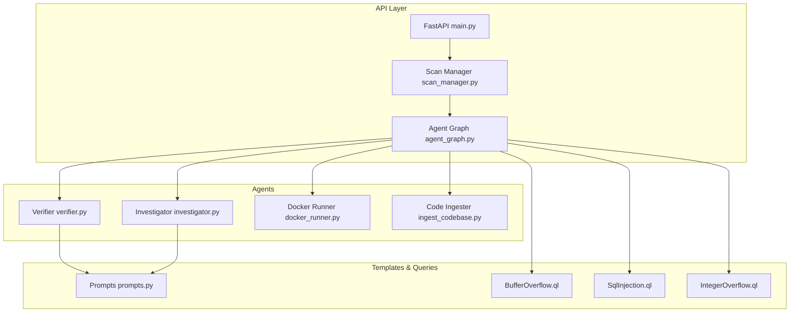
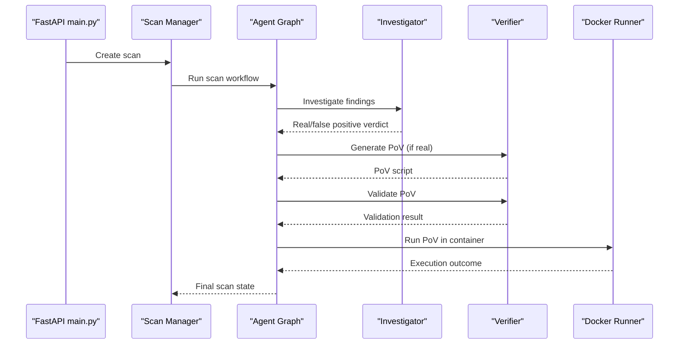
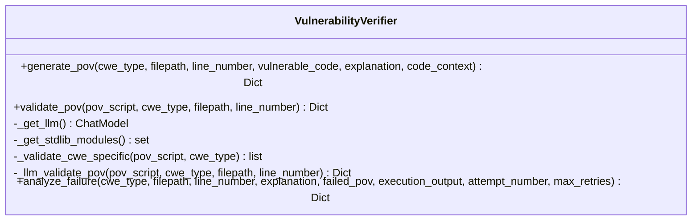
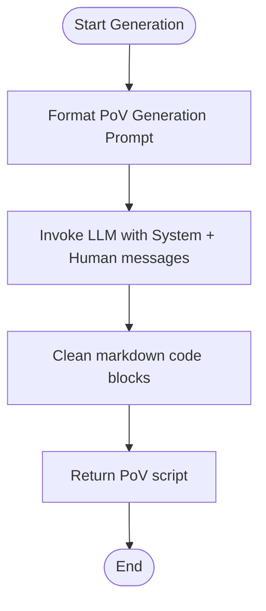
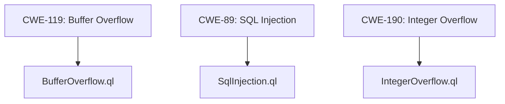
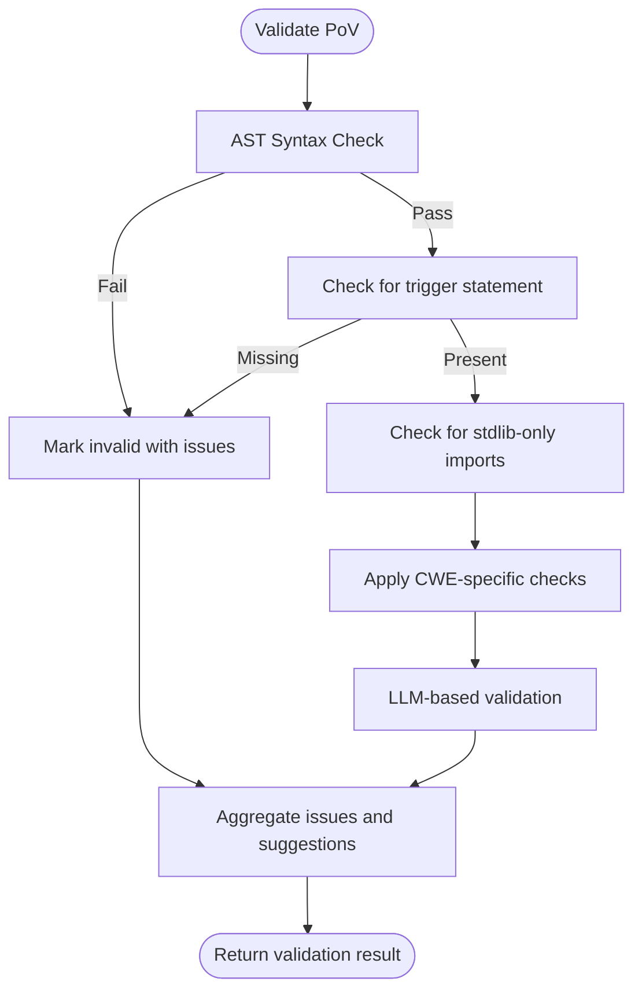
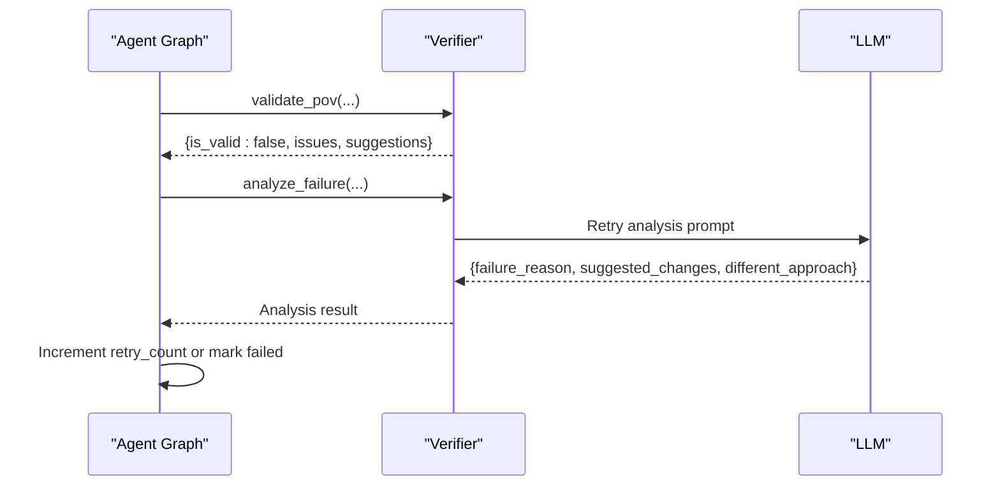
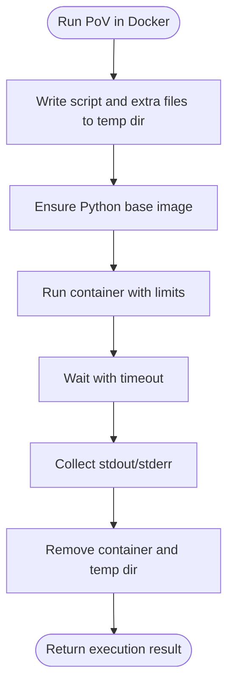
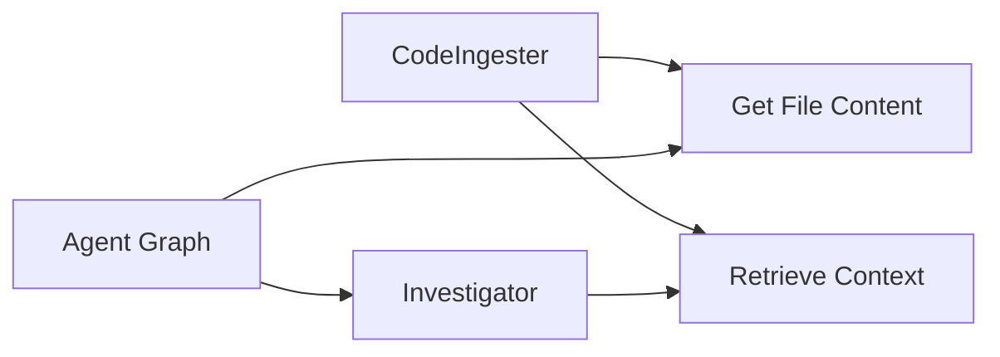
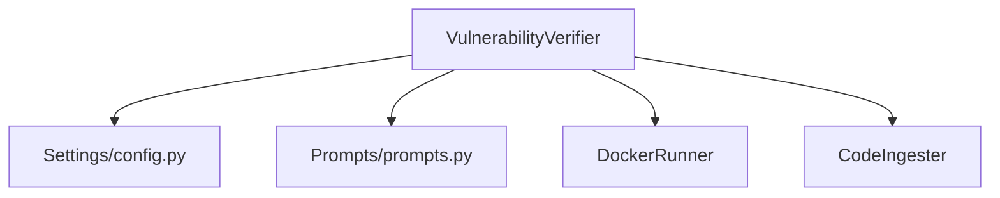

# PoV Generation and Verification Agent

<cite>
**Referenced Files in This Document**
- [verifier.py](file://autopov/agents/verifier.py)
- [prompts.py](file://autopov/prompts.py)
- [config.py](file://autopov/app/config.py)
- [agent_graph.py](file://autopov/app/agent_graph.py)
- [docker_runner.py](file://autopov/agents/docker_runner.py)
- [ingest_codebase.py](file://autopov/agents/ingest_codebase.py)
- [investigator.py](file://autopov/agents/investigator.py)
- [scan_manager.py](file://autopov/app/scan_manager.py)
- [main.py](file://autopov/app/main.py)
- [BufferOverflow.ql](file://autopov/codeql_queries/BufferOverflow.ql)
- [SqlInjection.ql](file://autopov/codeql_queries/SqlInjection.ql)
- [IntegerOverflow.ql](file://autopov/codeql_queries/IntegerOverflow.ql)
- [README.md](file://autopov/README.md)
</cite>

## Table of Contents
1. [Introduction](#introduction)
2. [Project Structure](#project-structure)
3. [Core Components](#core-components)
4. [Architecture Overview](#architecture-overview)
5. [Detailed Component Analysis](#detailed-component-analysis)
6. [Dependency Analysis](#dependency-analysis)
7. [Performance Considerations](#performance-considerations)
8. [Troubleshooting Guide](#troubleshooting-guide)
9. [Conclusion](#conclusion)
10. [Appendices](#appendices)

## Introduction
This document describes the PoV generation and verification agent within the AutoPoV framework. The agent is responsible for automatically generating Proof-of-Vulnerability (PoV) scripts using LLM reasoning, validating their quality and correctness, and orchestrating safe execution in isolated environments. It integrates with CWE-specific templates, vulnerability pattern matching, and supports robust validation strategies including static analysis, syntax checking, logical consistency, and retry mechanisms.

## Project Structure
The AutoPoV project is organized into modular components:
- Backend API and orchestration: FastAPI application, scan manager, agent graph workflow
- Agents: Code ingestion, vulnerability investigation, PoV verification, Docker execution
- Prompts and templates: Centralized LLM prompts for investigation, PoV generation, validation, and retry analysis
- Static analysis: CodeQL queries for supported CWEs
- Configuration: Environment-driven settings for models, Docker, and safety parameters

**Diagram sources**
- [main.py](file://autopov/app/main.py#L102-L121)
- [scan_manager.py](file://autopov/app/scan_manager.py#L40-L50)
- [agent_graph.py](file://autopov/app/agent_graph.py#L78-L134)
- [investigator.py](file://autopov/agents/investigator.py#L37-L87)
- [verifier.py](file://autopov/agents/verifier.py#L40-L77)
- [docker_runner.py](file://autopov/agents/docker_runner.py#L27-L48)
- [ingest_codebase.py](file://autopov/agents/ingest_codebase.py#L41-L115)
- [prompts.py](file://autopov/prompts.py#L46-L109)
- [BufferOverflow.ql](file://autopov/codeql_queries/BufferOverflow.ql#L1-L59)
- [SqlInjection.ql](file://autopov/codeql_queries/SqlInjection.ql#L1-L67)
- [IntegerOverflow.ql](file://autopov/codeql_queries/IntegerOverflow.ql#L1-L62)

**Section sources**
- [README.md](file://autopov/README.md#L17-L35)
- [main.py](file://autopov/app/main.py#L102-L121)
- [scan_manager.py](file://autopov/app/scan_manager.py#L40-L50)
- [agent_graph.py](file://autopov/app/agent_graph.py#L78-L134)

## Core Components
- VulnerabilityVerifier: Generates PoV scripts using LLM prompts, validates them statically and logically, and coordinates advanced LLM-based validation.
- Prompts: Centralized prompt templates for investigation, PoV generation, validation, and retry analysis.
- Agent Graph: Orchestrates ingestion, CodeQL/LLM analysis, PoV generation, validation, and Docker execution.
- Docker Runner: Executes PoV scripts in isolated containers with strict resource limits and no network access.
- Code Ingester: Provides RAG context and retrieves file content for vulnerability analysis.
- Configuration: Controls model selection, Docker runtime, cost tracking, and supported CWEs.

**Section sources**
- [verifier.py](file://autopov/agents/verifier.py#L40-L150)
- [prompts.py](file://autopov/prompts.py#L46-L109)
- [agent_graph.py](file://autopov/app/agent_graph.py#L78-L134)
- [docker_runner.py](file://autopov/agents/docker_runner.py#L27-L91)
- [ingest_codebase.py](file://autopov/agents/ingest_codebase.py#L41-L115)
- [config.py](file://autopov/app/config.py#L13-L100)

## Architecture Overview
The PoV generation and verification agent participates in a LangGraph-based workflow that:
- Ingests code into a vector store for RAG context
- Runs CodeQL or falls back to LLM-only analysis
- Investigates findings with LLM to determine real vs. false positive
- Generates PoV scripts for confirmed vulnerabilities
- Validates PoVs statically and via LLM
- Executes PoVs in Docker and records outcomes

**Diagram sources**
- [main.py](file://autopov/app/main.py#L177-L316)
- [scan_manager.py](file://autopov/app/scan_manager.py#L86-L116)
- [agent_graph.py](file://autopov/app/agent_graph.py#L290-L433)
- [investigator.py](file://autopov/agents/investigator.py#L254-L365)
- [verifier.py](file://autopov/agents/verifier.py#L79-L150)
- [docker_runner.py](file://autopov/agents/docker_runner.py#L62-L191)

## Detailed Component Analysis

### VulnerabilityVerifier: PoV Generation and Validation
The verifier encapsulates PoV generation and validation logic:
- LLM selection: Chooses online (OpenRouter) or offline (Ollama) based on configuration.
- PoV generation: Formats a prompt with CWE, file location, vulnerable code, and context; invokes LLM; cleans markdown blocks; measures generation time.
- Static validation: AST-based syntax check, required print statement presence, standard library-only imports, CWE-specific heuristics.
- Advanced validation: Uses LLM to assess logical consistency and trigger likelihood.
- Failure analysis: When validation fails, suggests improvements and determines retry strategy.

**Diagram sources**
- [verifier.py](file://autopov/agents/verifier.py#L40-L392)

**Section sources**
- [verifier.py](file://autopov/agents/verifier.py#L40-L150)
- [verifier.py](file://autopov/agents/verifier.py#L151-L227)
- [verifier.py](file://autopov/agents/verifier.py#L229-L291)
- [verifier.py](file://autopov/agents/verifier.py#L293-L391)

### Prompt Templates and Script Generation Strategies
Prompt templates guide the LLM to produce deterministic, secure PoV scripts:
- Investigation prompt: Guides LLM to distinguish real vs. false positives with structured JSON.
- PoV generation prompt: Requires standard library usage, deterministic behavior, and explicit trigger output.
- PoV validation prompt: Requests structured validation with criteria for standard library usage, trigger statement, logic correctness, error handling, and determinism.
- Retry analysis prompt: Helps diagnose failures and propose targeted improvements.

**Diagram sources**
- [prompts.py](file://autopov/prompts.py#L46-L78)
- [verifier.py](file://autopov/agents/verifier.py#L106-L130)

**Section sources**
- [prompts.py](file://autopov/prompts.py#L7-L44)
- [prompts.py](file://autopov/prompts.py#L46-L78)
- [prompts.py](file://autopov/prompts.py#L81-L109)
- [prompts.py](file://autopov/prompts.py#L176-L209)

### CWE-Specific Templates and Pattern Matching
The workflow integrates static analysis and LLM reasoning:
- CodeQL queries for supported CWEs:
  - Buffer Overflow (CWE-119): Detects unsafe buffer operations and missing bounds checks.
  - SQL Injection (CWE-89): Identifies taint flows from user input to SQL execution sinks.
  - Integer Overflow (CWE-190): Flags arithmetic operations susceptible to wraparound.
- Agent Graph maps CWEs to queries and parses results into findings for investigation and PoV generation.

**Diagram sources**
- [BufferOverflow.ql](file://autopov/codeql_queries/BufferOverflow.ql#L1-L59)
- [SqlInjection.ql](file://autopov/codeql_queries/SqlInjection.ql#L1-L67)
- [IntegerOverflow.ql](file://autopov/codeql_queries/IntegerOverflow.ql#L1-L62)

**Section sources**
- [agent_graph.py](file://autopov/app/agent_graph.py#L193-L278)
- [BufferOverflow.ql](file://autopov/codeql_queries/BufferOverflow.ql#L1-L59)
- [SqlInjection.ql](file://autopov/codeql_queries/SqlInjection.ql#L1-L67)
- [IntegerOverflow.ql](file://autopov/codeql_queries/IntegerOverflow.ql#L1-L62)

### Validation Workflow and Quality Assessment
The verifier performs layered validation:
- Syntax validation: AST parse to catch syntax errors.
- Trigger requirement: Ensures the script prints the expected trigger phrase.
- Import restrictions: Enforces standard library usage only.
- CWE-specific checks: Heuristic validations tailored to each CWE.
- LLM-based assessment: Requests structured evaluation of correctness and trigger likelihood.

**Diagram sources**
- [verifier.py](file://autopov/agents/verifier.py#L177-L227)

**Section sources**
- [verifier.py](file://autopov/agents/verifier.py#L177-L227)
- [verifier.py](file://autopov/agents/verifier.py#L265-L291)

### Retry Mechanisms and Failure Analysis
When validation fails or execution does not trigger:
- The agent analyzes the failure using a dedicated prompt to identify root causes.
- Suggestions are returned to improve the PoV script or change approach.
- Retries are bounded by configuration; exceeding attempts leads to logging failure.

**Diagram sources**
- [agent_graph.py](file://autopov/app/agent_graph.py#L501-L514)
- [verifier.py](file://autopov/agents/verifier.py#L332-L391)

**Section sources**
- [agent_graph.py](file://autopov/app/agent_graph.py#L501-L514)
- [verifier.py](file://autopov/agents/verifier.py#L332-L391)

### Docker Execution and Safety
PoV scripts are executed in isolated containers with:
- No network access
- Memory and CPU limits
- Timeouts
- Resource cleanup

**Diagram sources**
- [docker_runner.py](file://autopov/agents/docker_runner.py#L95-L191)

**Section sources**
- [docker_runner.py](file://autopov/agents/docker_runner.py#L62-L191)
- [config.py](file://autopov/app/config.py#L78-L87)

### Integration with RAG and Code Ingestion
- CodeIngester chunks code, embeds it, and stores in ChromaDB for retrieval.
- The investigator retrieves context and enhances analysis with RAG.
- The agent graph fetches file content for PoV generation.

**Diagram sources**
- [ingest_codebase.py](file://autopov/agents/ingest_codebase.py#L309-L352)
- [investigator.py](file://autopov/agents/investigator.py#L235-L252)
- [agent_graph.py](file://autopov/app/agent_graph.py#L345-L348)

**Section sources**
- [ingest_codebase.py](file://autopov/agents/ingest_codebase.py#L201-L307)
- [investigator.py](file://autopov/agents/investigator.py#L235-L252)
- [agent_graph.py](file://autopov/app/agent_graph.py#L345-L348)

## Dependency Analysis
The verifier depends on:
- Configuration for LLM selection and runtime parameters
- Prompts for generation, validation, and retry analysis
- Docker runner for execution
- Code ingestion for context retrieval

**Diagram sources**
- [verifier.py](file://autopov/agents/verifier.py#L27-L32)
- [config.py](file://autopov/app/config.py#L173-L189)
- [prompts.py](file://autopov/prompts.py#L28-L32)
- [docker_runner.py](file://autopov/agents/docker_runner.py#L19-L20)
- [ingest_codebase.py](file://autopov/agents/ingest_codebase.py#L33-L34)

**Section sources**
- [verifier.py](file://autopov/agents/verifier.py#L27-L32)
- [config.py](file://autopov/app/config.py#L173-L189)

## Performance Considerations
- Cost control: The system estimates costs based on inference time and enforces a maximum cost threshold.
- Batch execution: Docker runner supports batch runs with progress callbacks for throughput optimization.
- Chunking and RAG: Efficient code chunking and embedding reduce retrieval latency.
- Model mode: Supports online and offline modes to balance cost and performance.

[No sources needed since this section provides general guidance]

## Troubleshooting Guide
Common validation failures and remedies:
- Syntax errors: Fix Python syntax; ensure AST parse succeeds.
- Missing trigger statement: Add the required print statement indicating vulnerability trigger.
- Non-stdlib imports: Remove external dependencies; use only standard library modules.
- CWE mismatch: Align PoV logic with the specific CWE pattern (e.g., buffer bounds, SQL taint, integer wraparound).
- Execution not triggering: Use failure analysis to refine inputs or approach; leverage retry mechanism up to configured maximum.

Security considerations:
- Docker isolation: No network access, resource limits, and timeouts prevent misuse.
- Input sanitization: While the verifier does not sanitize inputs, the Docker sandbox prevents arbitrary code execution outside the container.
- Standard library enforcement: Prevents loading of potentially malicious third-party modules.

**Section sources**
- [verifier.py](file://autopov/agents/verifier.py#L177-L227)
- [verifier.py](file://autopov/agents/verifier.py#L265-L291)
- [docker_runner.py](file://autopov/agents/docker_runner.py#L129-L133)
- [config.py](file://autopov/app/config.py#L81-L83)

## Conclusion
The PoV generation and verification agent leverages LLM reasoning, structured prompts, and robust validation to produce reliable PoV scripts. It integrates static analysis, RAG-enhanced context, and safe Docker execution to ensure both effectiveness and safety. The configurable retry mechanism and layered validation improve resilience and accuracy across diverse CWEs.

[No sources needed since this section summarizes without analyzing specific files]

## Appendices

### Configuration Options
- Model selection: Online (OpenRouter) or offline (Ollama) with configurable base URLs and model names.
- Docker runtime: Image, timeout, memory, CPU limits, and enable/disable flag.
- Cost control: Maximum cost threshold and cost tracking toggle.
- Retries: Maximum retry attempts for PoV generation/validation failures.
- Supported CWEs: List of checked vulnerabilities.

**Section sources**
- [config.py](file://autopov/app/config.py#L30-L100)
- [config.py](file://autopov/app/config.py#L173-L189)

### Practical Examples
- PoV generation workflow:
  - Input: CWE type, file path, line number, vulnerable code snippet, explanation, code context.
  - Output: PoV script with metadata and timing.
- Validation workflow:
  - Input: PoV script, CWE type, file path, line number.
  - Output: Validation result with issues, suggestions, and trigger likelihood.
- Retry workflow:
  - Input: Failed PoV, execution output, attempt number, max retries.
  - Output: Failure analysis and guidance for improvement.

**Section sources**
- [verifier.py](file://autopov/agents/verifier.py#L79-L150)
- [verifier.py](file://autopov/agents/verifier.py#L151-L227)
- [verifier.py](file://autopov/agents/verifier.py#L332-L391)