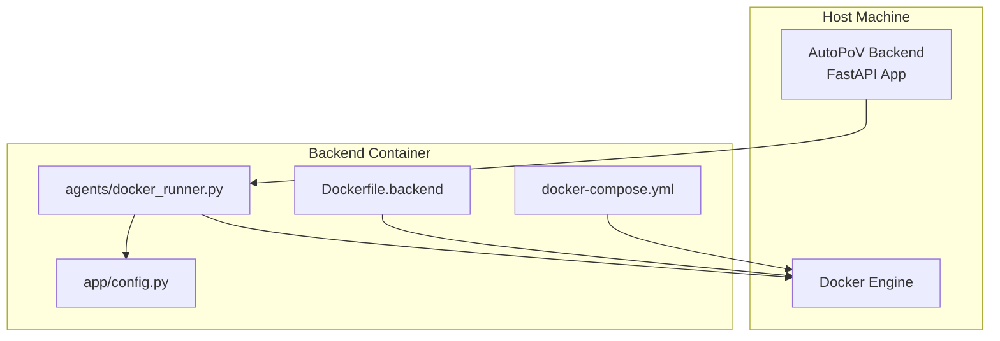
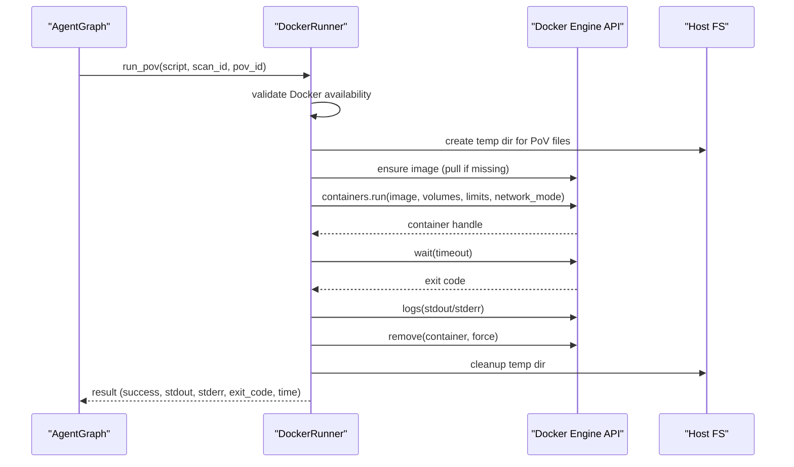
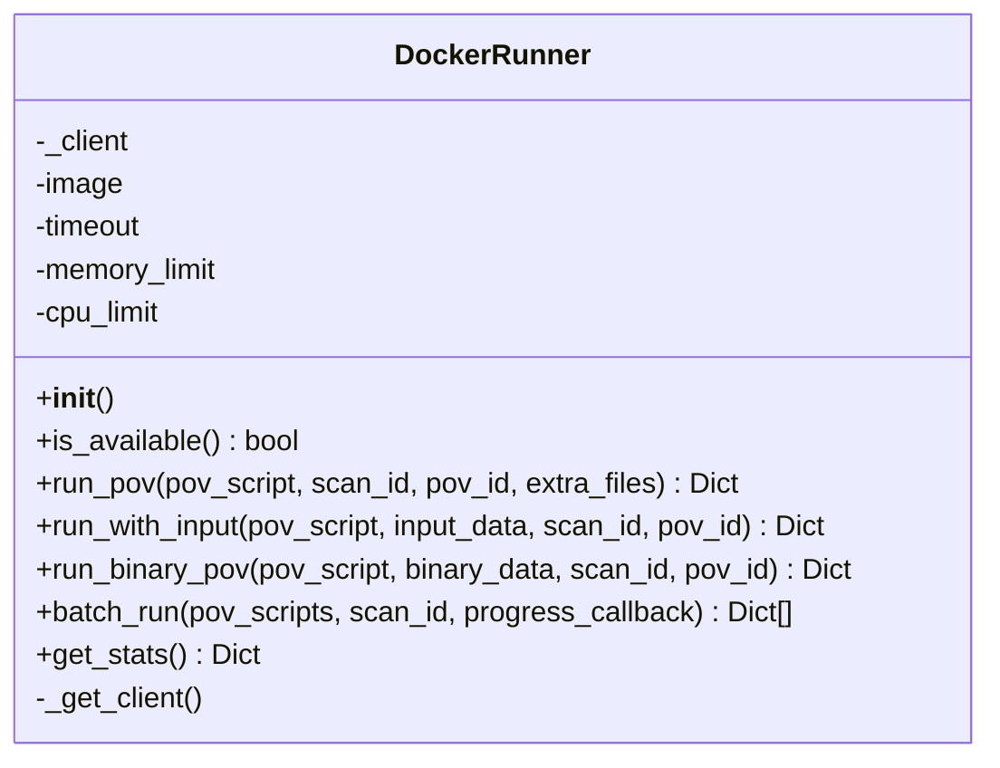
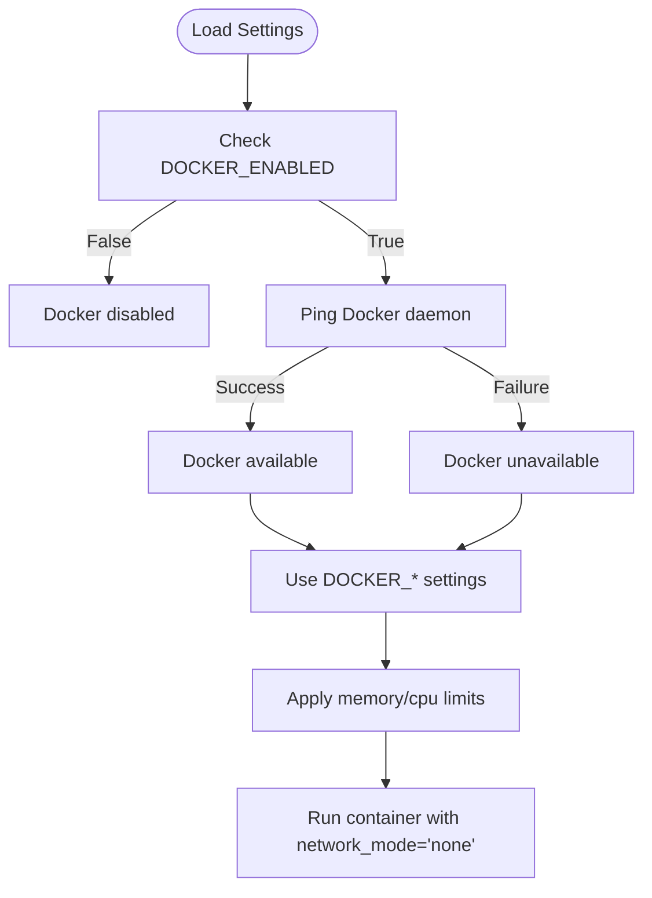
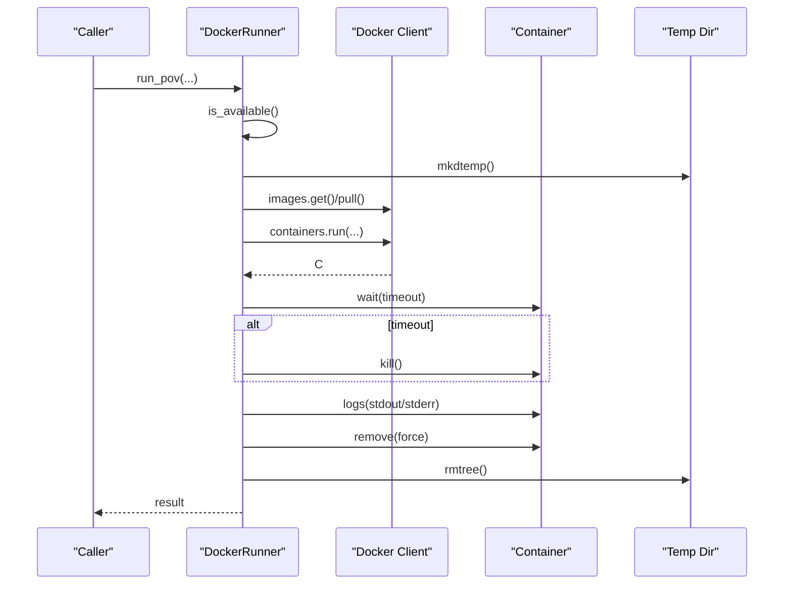
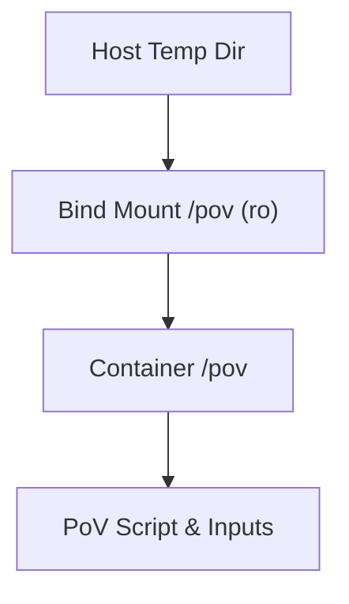
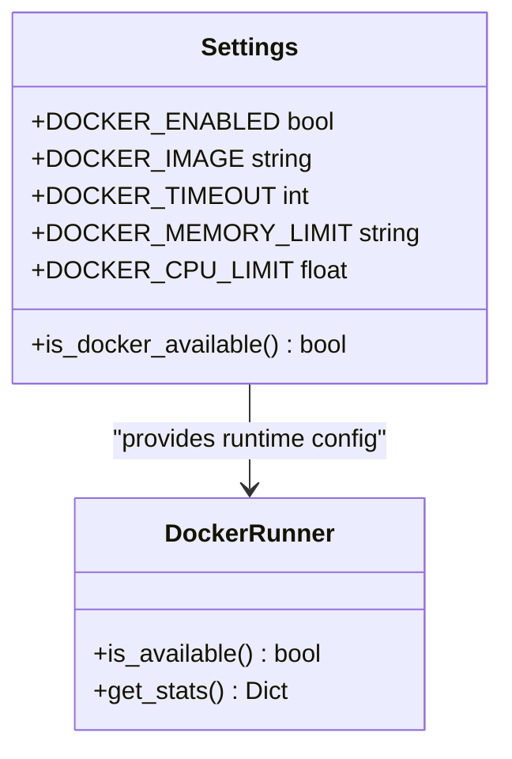
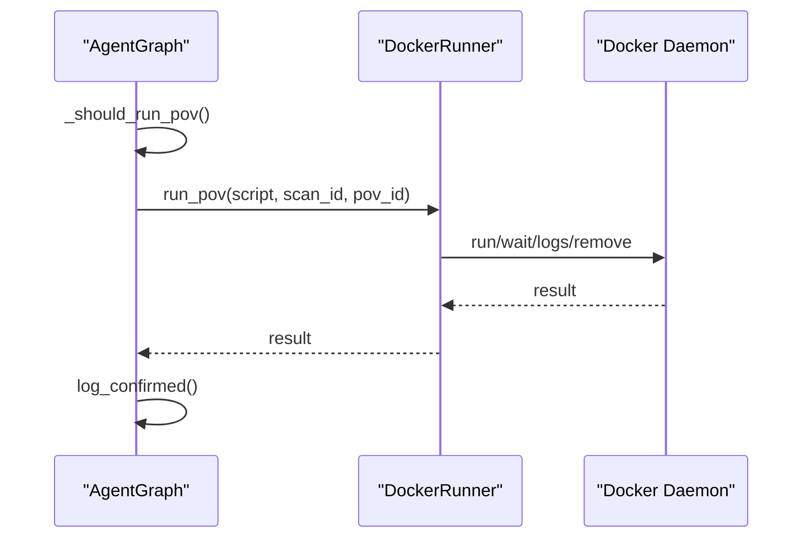
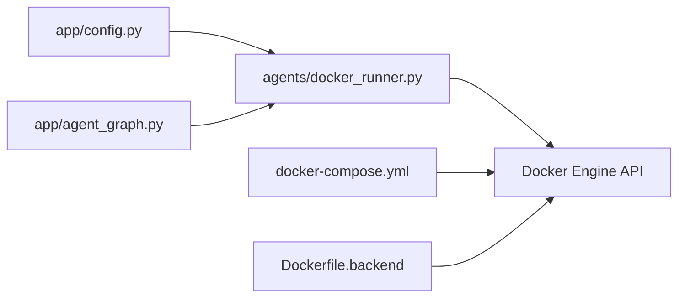

# Docker Runner Agent

<cite>
**Referenced Files in This Document**
- [docker_runner.py](file://agents/docker_runner.py)
- [config.py](file://app/config.py)
- [Dockerfile.backend](file://Dockerfile.backend)
- [docker-compose.yml](file://docker-compose.yml)
- [main.py](file://app/main.py)
- [agent_graph.py](file://app/agent_graph.py)
- [scan_manager.py](file://app/scan_manager.py)
</cite>

## Table of Contents
1. [Introduction](#introduction)
2. [Project Structure](#project-structure)
3. [Core Components](#core-components)
4. [Architecture Overview](#architecture-overview)
5. [Detailed Component Analysis](#detailed-component-analysis)
6. [Dependency Analysis](#dependency-analysis)
7. [Performance Considerations](#performance-considerations)
8. [Troubleshooting Guide](#troubleshooting-guide)
9. [Conclusion](#conclusion)

## Introduction
This document describes the Docker Runner Agent responsible for sandboxed execution of Proof-of-Vulnerability (PoV) scripts inside isolated Docker containers. It covers container orchestration, image management, lifecycle control, resource allocation, security isolation, network configuration, and volume mounting. It also documents the execution workflow from container creation to cleanup, integration with the Docker API, monitoring capabilities, and practical guidance for troubleshooting and performance optimization.

## Project Structure
The Docker Runner Agent is part of the AutoPoV framework and integrates with the broader application stack:
- The agent exposes a Python interface to run PoV scripts in Docker.
- Configuration is centralized via application settings that define Docker image, timeouts, and limits.
- The backend container image bundles Docker CLI and CodeQL for advanced analysis.
- The orchestrator composes the backend and frontend services, enabling Docker-in-Docker scenarios.

**Diagram sources**
- [docker_runner.py:27-377](file://agents/docker_runner.py#L27-L377)
- [config.py:92-98](file://app/config.py#L92-L98)
- [Dockerfile.backend:1-64](file://Dockerfile.backend#L1-L64)
- [docker-compose.yml:1-41](file://docker-compose.yml#L1-L41)

**Section sources**
- [docker_runner.py:27-377](file://agents/docker_runner.py#L27-L377)
- [config.py:92-98](file://app/config.py#L92-L98)
- [Dockerfile.backend:1-64](file://Dockerfile.backend#L1-L64)
- [docker-compose.yml:1-41](file://docker-compose.yml#L1-L41)

## Core Components
- DockerRunner: Orchestrates containerized execution of PoV scripts with robust error handling, resource limits, and cleanup.
- Settings: Centralized configuration for Docker image, timeouts, memory/cpu limits, and availability checks.
- Backend Dockerfile: Installs Docker CLI and CodeQL to enable Docker-in-Docker and static analysis.
- Compose: Mounts Docker socket and persists data volumes for the backend service.

Key responsibilities:
- Image management: Pulls the configured base image if missing.
- Lifecycle: Creates, starts, waits, logs, and removes containers.
- Isolation: Disables networking and mounts a temporary directory read-only.
- Resource control: Enforces CPU quota and memory limits.
- Result capture: Aggregates exit code, stdout/stderr, execution time, and vulnerability trigger detection.

**Section sources**
- [docker_runner.py:27-377](file://agents/docker_runner.py#L27-L377)
- [config.py:92-98](file://app/config.py#L92-L98)
- [Dockerfile.backend:1-64](file://Dockerfile.backend#L1-L64)
- [docker-compose.yml:1-41](file://docker-compose.yml#L1-L41)

## Architecture Overview
The Docker Runner Agent participates in the AutoPoV scanning pipeline. The orchestrator coordinates agents and invokes the Docker Runner to execute PoV scripts in isolated containers.

**Diagram sources**
- [agent_graph.py:82-168](file://app/agent_graph.py#L82-L168)
- [docker_runner.py:62-192](file://agents/docker_runner.py#L62-L192)
- [config.py:92-98](file://app/config.py#L92-L98)

## Detailed Component Analysis

### DockerRunner Class
The DockerRunner encapsulates container orchestration:
- Initialization: Reads configuration for image, timeout, memory, and CPU limits.
- Availability: Checks Docker availability via environment and ping.
- Execution:
  - Writes PoV and auxiliary files to a temporary directory.
  - Ensures the configured image exists (pulls if missing).
  - Runs a container with:
    - Read-only bind mount of the temp directory at /pov.
    - Working directory set to /pov.
    - CPU quota and memory limit applied.
    - Network disabled via network_mode='none'.
    - Detached execution with stdout/stderr capture enabled.
  - Waits with timeout; on timeout or error, kills and cleans up.
  - Captures logs and aggregates results including vulnerability trigger detection.
- Input variants:
  - run_with_input: Writes input data to a file and executes a wrapper script.
  - run_binary_pov: Writes binary input to input.bin and executes a PoV script.
- Batch execution: Iterates over multiple PoVs with optional progress callbacks.
- Stats: Queries Docker daemon info for server version, running containers, total containers, and images.

**Diagram sources**
- [docker_runner.py:27-377](file://agents/docker_runner.py#L27-L377)

**Section sources**
- [docker_runner.py:27-377](file://agents/docker_runner.py#L27-L377)

### Configuration and Environment Setup
- Settings:
  - DOCKER_ENABLED toggles Docker usage.
  - DOCKER_IMAGE defines the base image for PoV execution.
  - DOCKER_TIMEOUT sets container wait timeout.
  - DOCKER_MEMORY_LIMIT and DOCKER_CPU_LIMIT enforce resource caps.
  - is_docker_available() validates Docker presence and connectivity.
- Backend image:
  - Installs Docker CLI and CodeQL to support Docker-in-Docker and static analysis.
  - Sets environment variables for model mode and Docker enablement.
- Compose:
  - Mounts host Docker socket to enable container orchestration from within the backend container.
  - Persists data and results directories.
  - Exposes backend and frontend ports.

**Diagram sources**
- [config.py:92-98](file://app/config.py#L92-L98)
- [config.py:162-174](file://app/config.py#L162-L174)
- [Dockerfile.backend:57-60](file://Dockerfile.backend#L57-L60)
- [docker-compose.yml:13-13](file://docker-compose.yml#L13-L13)

**Section sources**
- [config.py:92-98](file://app/config.py#L92-L98)
- [config.py:162-174](file://app/config.py#L162-L174)
- [Dockerfile.backend:57-60](file://Dockerfile.backend#L57-L60)
- [docker-compose.yml:13-13](file://docker-compose.yml#L13-L13)

### Execution Workflow
End-to-end flow for running a PoV script in Docker:
1. Validate Docker availability using settings and client ping.
2. Create a temporary directory and write the PoV script and any extra files.
3. Ensure the configured image exists; pull if absent.
4. Start the container with:
   - Working directory set to /pov.
   - Read-only volume mounted from temp directory to /pov.
   - CPU quota and memory limit applied.
   - Network disabled.
   - Detached execution with stdout/stderr capture.
5. Wait for completion with timeout; on timeout, kill the container.
6. Collect stdout/stderr logs and remove the container.
7. Compute execution time and detect vulnerability trigger from stdout.
8. Return structured result with success flag, exit code, and timing metadata.
9. Clean up the temporary directory regardless of outcome.

**Diagram sources**
- [docker_runner.py:62-192](file://agents/docker_runner.py#L62-L192)

**Section sources**
- [docker_runner.py:62-192](file://agents/docker_runner.py#L62-L192)

### Security Isolation and Network Configuration
- Network isolation: Containers are launched with network_mode='none' to prevent outbound connections.
- Filesystem isolation: The temp directory is mounted read-only at /pov to prevent writes to host filesystem.
- Resource isolation: CPU quota and memory limits are enforced per container.
- Process isolation: Containers run in detached mode with explicit stdout/stderr capture.

These defaults provide strong sandboxing for PoV execution. Adjustments should be made carefully to balance security and functionality.

**Section sources**
- [docker_runner.py:122-133](file://agents/docker_runner.py#L122-L133)
- [docker_runner.py:267-278](file://agents/docker_runner.py#L267-L278)

### Volume Mounting Strategies
- Temporary directory binding: The host temp directory is mounted read-only into the container at /pov.
- Purpose: Allows PoV scripts and auxiliary files to be accessed inside the container without persisting changes on the host.
- Cleanup: The agent removes the temp directory after execution completes.

**Diagram sources**
- [docker_runner.py:92-125](file://agents/docker_runner.py#L92-L125)
- [docker_runner.py:249-270](file://agents/docker_runner.py#L249-L270)

**Section sources**
- [docker_runner.py:92-125](file://agents/docker_runner.py#L92-L125)
- [docker_runner.py:249-270](file://agents/docker_runner.py#L249-L270)

### Integration with Docker API and Monitoring
- Docker client initialization: Lazy initialization with docker.from_env().
- Availability checks: Uses ping() to confirm connectivity.
- Stats endpoint: Retrieves Docker info including server version, running containers, total containers, and images.
- Error handling: Catches Docker-specific exceptions and returns structured results with error details.

**Diagram sources**
- [config.py:92-98](file://app/config.py#L92-L98)
- [config.py:162-174](file://app/config.py#L162-L174)
- [docker_runner.py:344-367](file://agents/docker_runner.py#L344-L367)

**Section sources**
- [config.py:92-98](file://app/config.py#L92-L98)
- [config.py:162-174](file://app/config.py#L162-L174)
- [docker_runner.py:344-367](file://agents/docker_runner.py#L344-L367)

### Agent Orchestration Integration
The Docker Runner is invoked by the orchestrator as part of the vulnerability detection workflow:
- The orchestrator builds a LangGraph workflow and transitions to the "run_in_docker" node when a validated PoV is ready.
- The orchestrator passes the PoV script and identifiers to the Docker Runner.
- Results are recorded and used to update the scan state.

**Diagram sources**
- [agent_graph.py:82-168](file://app/agent_graph.py#L82-L168)
- [docker_runner.py:62-192](file://agents/docker_runner.py#L62-L192)

**Section sources**
- [agent_graph.py:82-168](file://app/agent_graph.py#L82-L168)
- [docker_runner.py:62-192](file://agents/docker_runner.py#L62-L192)

## Dependency Analysis
- Internal dependencies:
  - DockerRunner depends on app.config.settings for runtime configuration.
  - Orchestrator depends on DockerRunner to execute PoVs.
- External dependencies:
  - Docker Engine API via docker-py.
  - Host Docker socket when running in Docker-in-Docker scenarios.

**Diagram sources**
- [config.py:92-98](file://app/config.py#L92-L98)
- [docker_runner.py:27-377](file://agents/docker_runner.py#L27-L377)
- [agent_graph.py:82-168](file://app/agent_graph.py#L82-L168)
- [docker-compose.yml:1-41](file://docker-compose.yml#L1-L41)
- [Dockerfile.backend:1-64](file://Dockerfile.backend#L1-L64)

**Section sources**
- [config.py:92-98](file://app/config.py#L92-L98)
- [docker_runner.py:27-377](file://agents/docker_runner.py#L27-L377)
- [agent_graph.py:82-168](file://app/agent_graph.py#L82-L168)
- [docker-compose.yml:1-41](file://docker-compose.yml#L1-L41)
- [Dockerfile.backend:1-64](file://Dockerfile.backend#L1-L64)

## Performance Considerations
- Concurrency: The Docker Runner does not implement internal concurrency controls. For parallel execution, coordinate at the orchestrator level (e.g., using thread pools or async executors) and ensure resource limits are sufficient.
- Resource limits: Tune DOCKER_MEMORY_LIMIT and DOCKER_CPU_LIMIT to balance throughput and stability.
- Image reuse: Reuse the configured base image to minimize pull overhead.
- Logging: Capturing logs adds I/O overhead; keep logs concise for high-throughput scenarios.
- Timeouts: Adjust DOCKER_TIMEOUT to accommodate longer-running PoVs while preventing runaway containers.

[No sources needed since this section provides general guidance]

## Troubleshooting Guide
Common issues and resolutions:
- Docker not available:
  - Verify DOCKER_ENABLED and that the Docker daemon is reachable.
  - Confirm the backend container has access to the Docker socket if using Docker-in-Docker.
- Image pull failures:
  - Ensure network access or pre-pull the image.
  - Check DOCKER_IMAGE setting correctness.
- Container startup errors:
  - Review returned stderr and exit code from the Docker Runner result.
  - Validate that the PoV script is valid and does not require network access.
- Timeout or killed containers:
  - Increase DOCKER_TIMEOUT or optimize the PoV script.
  - Reduce CPU/memory limits if contention is suspected.
- Resource exhaustion:
  - Lower memory or CPU limits; verify host resource availability.
- Logs not captured:
  - Ensure stdout/stderr capture is enabled and container exits cleanly.

Operational checks:
- Use get_stats() to inspect Docker server version, running containers, and image counts.
- Confirm that network_mode='none' is intentional and aligns with the PoV’s needs.

**Section sources**
- [docker_runner.py:344-367](file://agents/docker_runner.py#L344-L367)
- [config.py:92-98](file://app/config.py#L92-L98)
- [docker-compose.yml:13-13](file://docker-compose.yml#L13-L13)

## Conclusion
The Docker Runner Agent provides a secure, configurable, and robust mechanism to execute PoV scripts in isolated containers. By combining strict resource limits, network isolation, and careful volume management, it minimizes risk while enabling effective vulnerability validation. Proper configuration of Docker settings, orchestration coordination, and monitoring ensures reliable operation at scale.