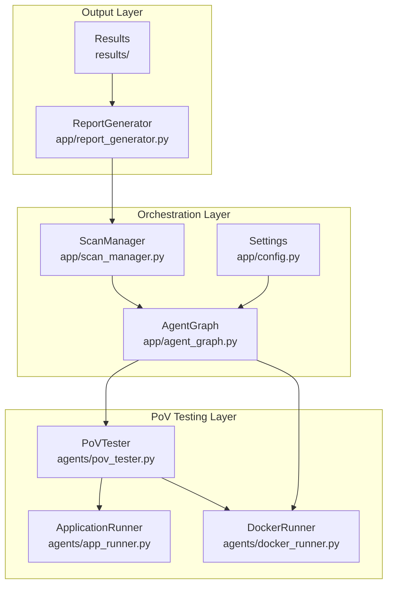
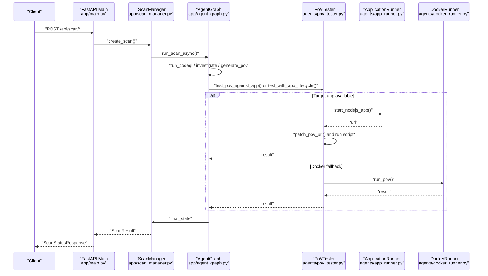
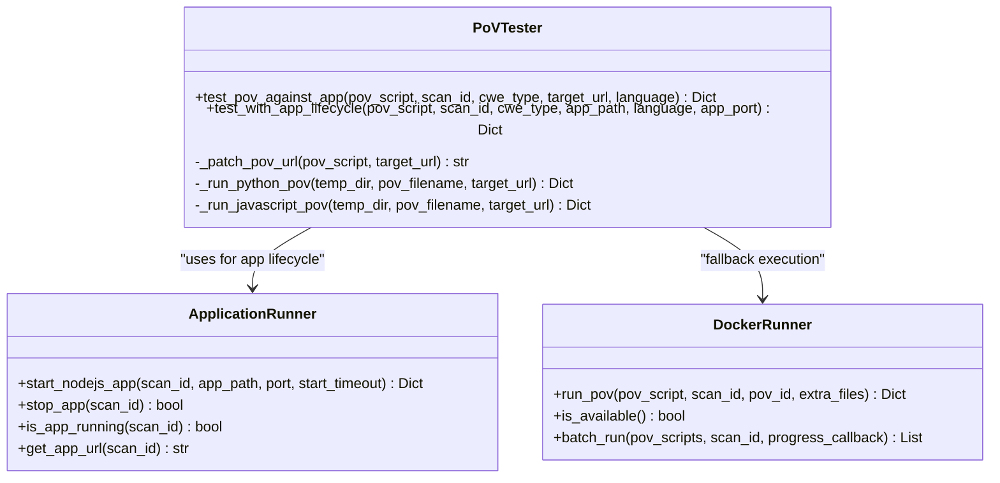
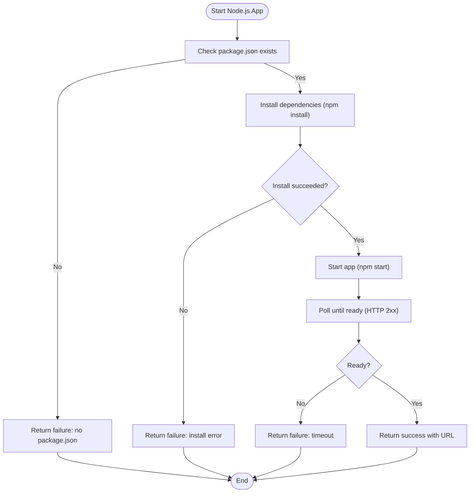
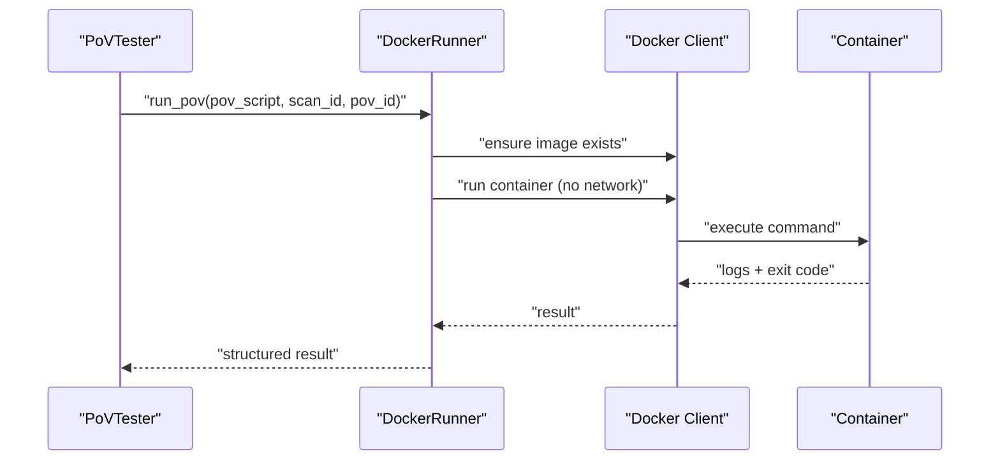
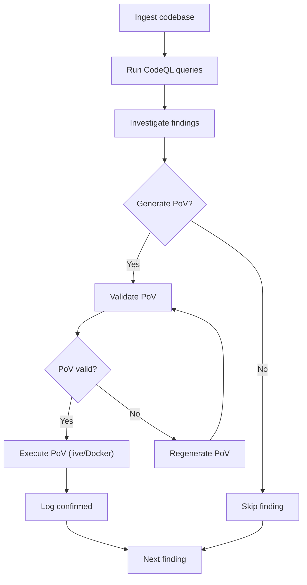
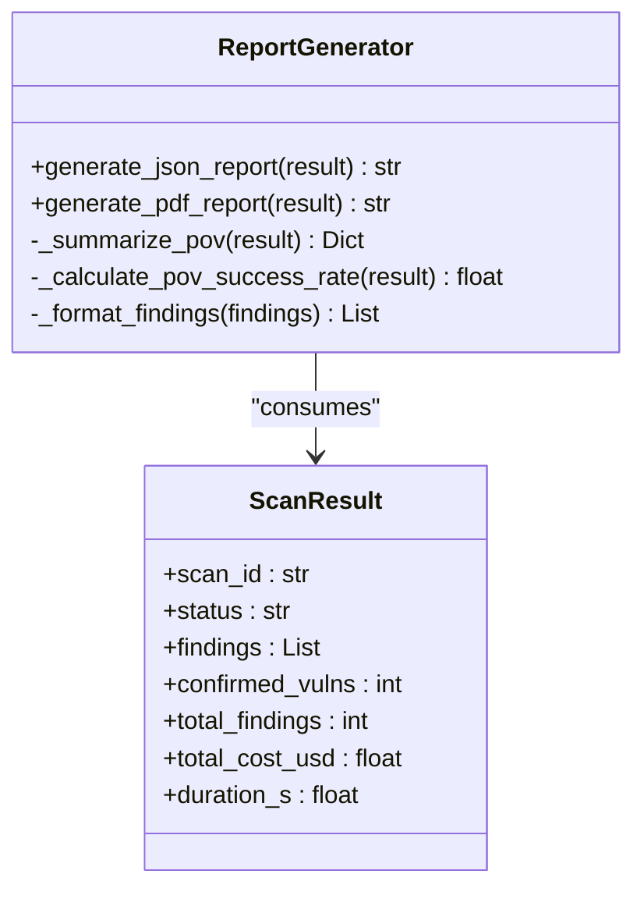
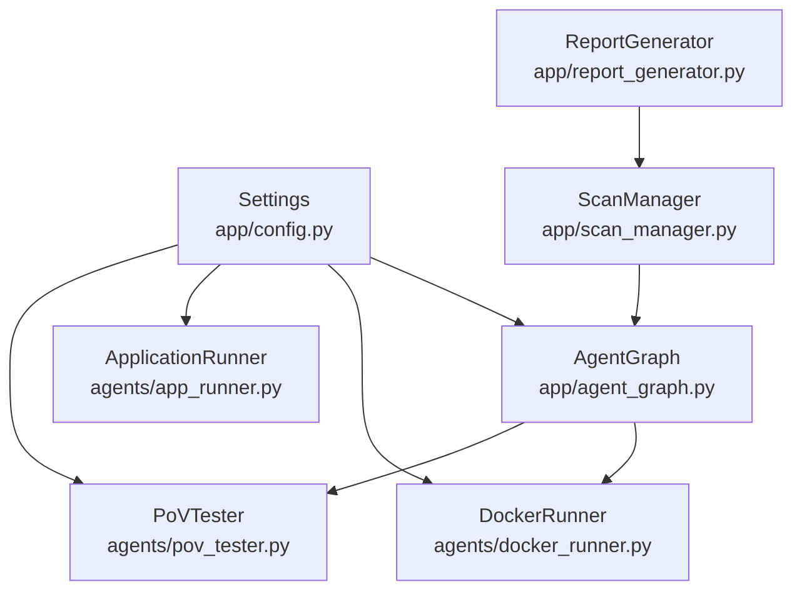

# PoV Tester Agent

<cite>
**Referenced Files in This Document**
- [pov_tester.py](file://agents/pov_tester.py)
- [app_runner.py](file://agents/app_runner.py)
- [docker_runner.py](file://agents/docker_runner.py)
- [agent_graph.py](file://app/agent_graph.py)
- [report_generator.py](file://app/report_generator.py)
- [config.py](file://app/config.py)
- [scan_manager.py](file://app/scan_manager.py)
- [main.py](file://app/main.py)
- [SqlInjection.ql](file://codeql_queries/SqlInjection.ql)
- [BufferOverflow.ql](file://codeql_queries/BufferOverflow.ql)
- [.gitkeep](file://results/povs/.gitkeep)
</cite>

## Table of Contents
1. [Introduction](#introduction)
2. [Project Structure](#project-structure)
3. [Core Components](#core-components)
4. [Architecture Overview](#architecture-overview)
5. [Detailed Component Analysis](#detailed-component-analysis)
6. [Dependency Analysis](#dependency-analysis)
7. [Performance Considerations](#performance-considerations)
8. [Troubleshooting Guide](#troubleshooting-guide)
9. [Conclusion](#conclusion)
10. [Appendices](#appendices)

## Introduction
The PoV Tester Agent is responsible for comprehensive Proof-of-Vulnerability (PoV) script validation and exploitation testing. It executes PoV scripts against target systems, manages environment setup, monitors execution, and analyzes results to determine whether vulnerabilities are successfully triggered. The agent integrates with application lifecycle management, Docker-based isolation, and the broader AutoPoV orchestration framework to deliver reliable and repeatable vulnerability validation.

## Project Structure
The PoV testing capability is implemented across several modules:
- PoV execution engine: executes PoV scripts in-process (Python/JavaScript) and captures outputs
- Application lifecycle management: starts/stops target applications for testing
- Docker-based execution: runs PoV scripts in isolated containers for safety and reproducibility
- Orchestration: integrates PoV testing into the end-to-end vulnerability detection workflow
- Reporting: generates structured reports summarizing PoV outcomes and validation evidence

**Diagram sources**
- [pov_tester.py:21-296](file://agents/pov_tester.py#L21-L296)
- [app_runner.py:19-200](file://agents/app_runner.py#L19-L200)
- [docker_runner.py:27-377](file://agents/docker_runner.py#L27-L377)
- [agent_graph.py:82-168](file://app/agent_graph.py#L82-L168)
- [scan_manager.py:47-663](file://app/scan_manager.py#L47-L663)
- [config.py:13-255](file://app/config.py#L13-L255)
- [report_generator.py:200-830](file://app/report_generator.py#L200-L830)

**Section sources**
- [pov_tester.py:1-296](file://agents/pov_tester.py#L1-L296)
- [app_runner.py:1-200](file://agents/app_runner.py#L1-L200)
- [docker_runner.py:1-377](file://agents/docker_runner.py#L1-L377)
- [agent_graph.py:1-800](file://app/agent_graph.py#L1-L800)
- [config.py:1-255](file://app/config.py#L1-L255)
- [scan_manager.py:1-663](file://app/scan_manager.py#L1-L663)
- [report_generator.py:1-830](file://app/report_generator.py#L1-L830)

## Core Components
- PoVTester: Executes PoV scripts against live targets, patches target URLs, and determines success based on output markers
- ApplicationRunner: Manages lifecycle of target applications (Node.js) for PoV testing
- DockerRunner: Provides secure, isolated execution of PoV scripts using Docker
- AgentGraph: Orchestrates the end-to-end workflow, including PoV generation, validation, and execution
- ReportGenerator: Produces structured JSON/PDF reports summarizing PoV outcomes and validation evidence

Key responsibilities:
- Environment setup: URL patching, dependency installation, and application startup
- Execution monitoring: timeouts, resource limits, and output capture
- Result analysis: success/failure determination and metadata collection
- Integration: seamless coordination with static analysis, PoV generation, and reporting

**Section sources**
- [pov_tester.py:21-296](file://agents/pov_tester.py#L21-L296)
- [app_runner.py:19-200](file://agents/app_runner.py#L19-L200)
- [docker_runner.py:27-377](file://agents/docker_runner.py#L27-L377)
- [agent_graph.py:82-168](file://app/agent_graph.py#L82-L168)
- [report_generator.py:200-830](file://app/report_generator.py#L200-L830)

## Architecture Overview
The PoV Tester Agent participates in a multi-agent workflow orchestrated by AgentGraph. The workflow includes ingestion, static analysis (CodeQL), investigation, PoV generation, validation, and execution. PoV execution can occur against live applications managed by ApplicationRunner or in Docker containers via DockerRunner.

**Diagram sources**
- [main.py:204-401](file://app/main.py#L204-L401)
- [scan_manager.py:234-366](file://app/scan_manager.py#L234-L366)
- [agent_graph.py:82-168](file://app/agent_graph.py#L82-L168)
- [pov_tester.py:24-106](file://agents/pov_tester.py#L24-L106)
- [app_runner.py:25-148](file://agents/app_runner.py#L25-L148)
- [docker_runner.py:62-192](file://agents/docker_runner.py#L62-L192)

## Detailed Component Analysis

### PoVTester: Execution Engine
The PoVTester orchestrates PoV script execution against live applications or in Docker containers. It handles URL patching, environment variable injection, timeout enforcement, and result interpretation.

**Diagram sources**
- [pov_tester.py:21-296](file://agents/pov_tester.py#L21-L296)
- [app_runner.py:19-200](file://agents/app_runner.py#L19-L200)
- [docker_runner.py:27-377](file://agents/docker_runner.py#L27-L377)

Key execution logic:
- URL patching: replaces placeholders and localhost patterns with the actual target URL
- Language support: Python and JavaScript PoV scripts
- Timeout handling: enforces execution limits and captures timeout errors
- Success criteria: vulnerability triggered if output contains a specific marker

**Section sources**
- [pov_tester.py:24-296](file://agents/pov_tester.py#L24-L296)

### ApplicationRunner: Target Lifecycle Management
ApplicationRunner manages Node.js applications used for PoV testing. It installs dependencies, starts the app, waits for readiness, and ensures cleanup.

**Diagram sources**
- [app_runner.py:25-148](file://agents/app_runner.py#L25-L148)

Operational characteristics:
- Dependency management: installs missing node_modules automatically
- Readiness checks: polls HTTP endpoint until application responds
- Resource cleanup: terminates processes and removes tracking records

**Section sources**
- [app_runner.py:25-148](file://agents/app_runner.py#L25-L148)

### DockerRunner: Isolated Execution
DockerRunner executes PoV scripts in isolated containers with strict resource limits and no network access. It ensures reproducibility and safety.

**Diagram sources**
- [docker_runner.py:62-192](file://agents/docker_runner.py#L62-L192)

Key features:
- Resource constraints: memory and CPU quotas
- Network isolation: none for security
- Timeout enforcement: kills container on timeout
- Output capture: collects stdout/stderr for analysis

**Section sources**
- [docker_runner.py:62-192](file://agents/docker_runner.py#L62-L192)

### AgentGraph: Workflow Orchestration
AgentGraph defines the end-to-end vulnerability detection workflow, including PoV generation, validation, and execution. It conditionally routes to PoV testing based on validation outcomes.

**Diagram sources**
- [agent_graph.py:82-168](file://app/agent_graph.py#L82-L168)

Integration points:
- PoV generation and validation nodes
- Conditional routing based on validation results
- Logging and status transitions

**Section sources**
- [agent_graph.py:82-168](file://app/agent_graph.py#L82-L168)

### ReportGenerator: Validation Reporting
ReportGenerator produces comprehensive JSON/PDF reports summarizing PoV outcomes, including success rates, validation evidence, and execution details.

**Diagram sources**
- [report_generator.py:200-830](file://app/report_generator.py#L200-L830)
- [scan_manager.py:23-45](file://app/scan_manager.py#L23-L45)

Reporting highlights:
- PoV success metrics: counts and percentages
- Validation evidence: stdout/stderr inclusion
- Model usage tracking and cost attribution

**Section sources**
- [report_generator.py:200-830](file://app/report_generator.py#L200-L830)
- [scan_manager.py:23-45](file://app/scan_manager.py#L23-L45)

## Dependency Analysis
The PoV Tester Agent depends on configuration settings, orchestration components, and execution backends. The following diagram shows key dependencies:

**Diagram sources**
- [config.py:13-255](file://app/config.py#L13-L255)
- [pov_tester.py:13-13](file://agents/pov_tester.py#L13-L13)
- [app_runner.py:1-11](file://agents/app_runner.py#L1-L11)
- [docker_runner.py:19-20](file://agents/docker_runner.py#L19-L20)
- [agent_graph.py:19-28](file://app/agent_graph.py#L19-L28)
- [scan_manager.py:18-21](file://app/scan_manager.py#L18-L21)
- [report_generator.py:13-14](file://app/report_generator.py#L13-L14)

Observations:
- Centralized configuration drives availability of Docker and CodeQL
- AgentGraph coordinates PoV testing within the broader workflow
- ReportGenerator consumes ScanManager results for reporting

**Section sources**
- [config.py:162-198](file://app/config.py#L162-L198)
- [agent_graph.py:19-28](file://app/agent_graph.py#L19-L28)
- [scan_manager.py:18-21](file://app/scan_manager.py#L18-L21)

## Performance Considerations
- Execution timeouts: enforced at both script and container levels to prevent hangs
- Resource limits: DockerRunner applies memory and CPU quotas to constrain resource usage
- Output capture: stdout/stderr collected for minimal overhead during execution
- Batch execution: DockerRunner supports batch runs for improved throughput
- Static analysis integration: CodeQL reduces false positives by narrowing candidate findings before PoV generation

[No sources needed since this section provides general guidance]

## Troubleshooting Guide
Common issues and resolutions:
- Application startup failures: verify package.json presence and dependency installation; check port availability and readiness polling
- Docker unavailability: ensure Docker daemon is running and accessible; confirm image pull and permissions
- Timeout errors: increase timeouts cautiously; validate PoV script efficiency and target responsiveness
- URL patching mismatches: confirm target URL patterns and placeholders; ensure environment variables are propagated
- Validation accuracy: refine PoV scripts to improve specificity; leverage static analysis to reduce false positives

**Section sources**
- [app_runner.py:45-148](file://agents/app_runner.py#L45-L148)
- [docker_runner.py:50-91](file://agents/docker_runner.py#L50-L91)
- [pov_tester.py:107-222](file://agents/pov_tester.py#L107-L222)

## Conclusion
The PoV Tester Agent provides a robust, configurable framework for validating vulnerabilities through executable PoV scripts. By integrating application lifecycle management, Docker-based isolation, and comprehensive reporting, it ensures reliable, repeatable, and auditable vulnerability validation. Proper configuration and troubleshooting practices further enhance accuracy and reliability across diverse target environments.

[No sources needed since this section summarizes without analyzing specific files]

## Appendices

### Testing Methodology by CWE Type
- SQL Injection (CWE-89): PoV scripts target user input flows to SQL execution sinks; validation relies on triggering error messages or data retrieval
- Buffer Overflow (CWE-119): PoV scripts exploit unsafe buffer operations; validation detects crashes or memory corruption indicators
- Other web vulnerabilities: tailored PoV scripts targeting injection, XSS, CSRF, SSRF, and deserialization patterns

**Section sources**
- [SqlInjection.ql:17-67](file://codeql_queries/SqlInjection.ql#L17-L67)
- [BufferOverflow.ql:16-59](file://codeql_queries/BufferOverflow.ql#L16-L59)

### Success Criteria Definition
- Vulnerability triggered: PoV output contains a specific success marker
- Execution completeness: non-zero exit code or successful container termination
- Time-bound execution: within configured timeout limits
- Evidence retention: stdout/stderr preserved for report generation

**Section sources**
- [pov_tester.py:73-87](file://agents/pov_tester.py#L73-L87)
- [docker_runner.py:155-166](file://agents/docker_runner.py#L155-L166)

### Execution Workflow Summary
- Preparation: PoV script prepared and validated
- Environment setup: target application started or Docker image ensured
- Execution: PoV script executed with appropriate environment and constraints
- Monitoring: logs captured, timeouts enforced, resource limits applied
- Analysis: success determined and reported
- Reporting: structured JSON/PDF generated summarizing outcomes

**Section sources**
- [agent_graph.py:82-168](file://app/agent_graph.py#L82-L168)
- [report_generator.py:209-262](file://app/report_generator.py#L209-L262)

### Example Scenarios
- Live application testing: PoVTester starts target app, injects TARGET_URL, executes PoV, and stops app
- Docker fallback testing: PoVTester runs PoV in isolated container with no network access
- Static analysis integration: CodeQL narrows candidates; PoVTester validates remaining findings

**Section sources**
- [pov_tester.py:224-287](file://agents/pov_tester.py#L224-L287)
- [docker_runner.py:62-192](file://agents/docker_runner.py#L62-L192)

### Validation Criteria and Result Interpretation
- Confirmed vulnerability: PoV triggers with expected output; validation evidence included in report
- Not triggered: PoV did not trigger; may indicate environmental constraints or script refinement needs
- Failure: execution errors or timeouts; requires investigation and retry

**Section sources**
- [report_generator.py:431-494](file://app/report_generator.py#L431-L494)

### Directory Structure for Results
- PoV scripts and reports are stored under results/povs and results/runs respectively; .gitkeep ensures directory tracking

**Section sources**
- [.gitkeep:1-2](file://results/povs/.gitkeep#L1-L2)