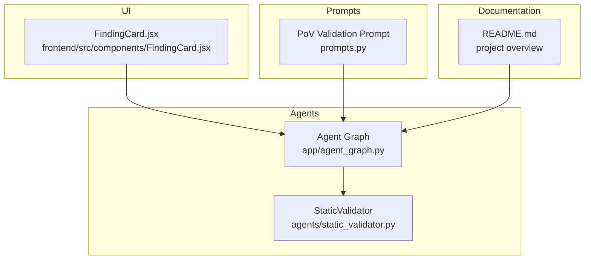
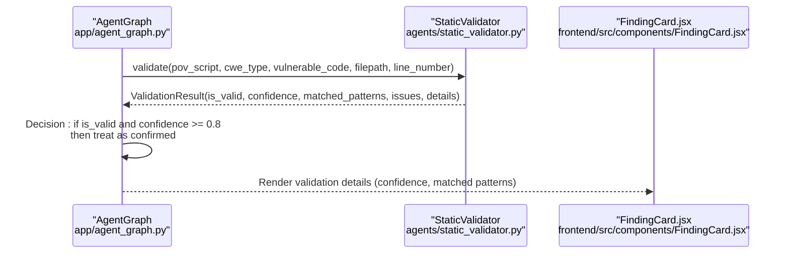
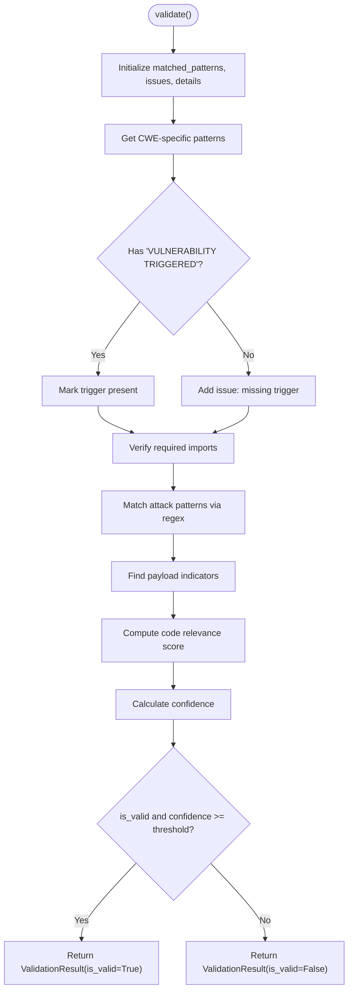
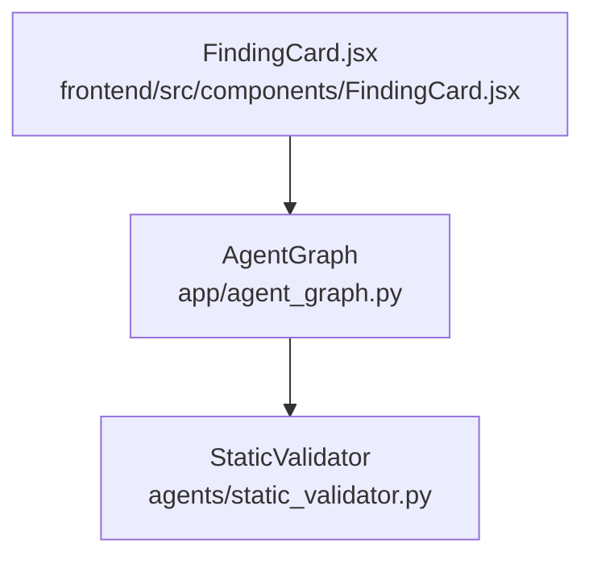

# Static Validator Agent

<cite>
**Referenced Files in This Document**
- [static_validator.py](file://agents/static_validator.py)
- [agent_graph.py](file://app/agent_graph.py)
- [prompts.py](file://prompts.py)
- [FindingCard.jsx](file://frontend/src/components/FindingCard.jsx)
- [README.md](file://README.md)
- [test_patterns.py](file://test_patterns.py)
</cite>

## Table of Contents
1. [Introduction](#introduction)
2. [Project Structure](#project-structure)
3. [Core Components](#core-components)
4. [Architecture Overview](#architecture-overview)
5. [Detailed Component Analysis](#detailed-component-analysis)
6. [Dependency Analysis](#dependency-analysis)
7. [Performance Considerations](#performance-considerations)
8. [Troubleshooting Guide](#troubleshooting-guide)
9. [Conclusion](#conclusion)

## Introduction
The Static Validator Agent performs static code analysis to validate Proof-of-Vulnerability (PoV) scripts without executing them. It applies CWE-specific pattern-matching to detect potential vulnerabilities and evaluates PoV quality using confidence scoring and code relevance metrics. This document explains the agent’s pattern-matching approach, ValidationResult structure, validation workflow, confidence calculation, and practical troubleshooting strategies.

## Project Structure
The Static Validator resides in the agents module and integrates with the broader agent graph orchestration. It participates in the validation phase of the vulnerability workflow, which escalates from static validation to unit testing and finally to Docker execution when needed.

**Diagram sources**
- [static_validator.py:12-305](file://agents/static_validator.py#L12-L305)
- [agent_graph.py:948-972](file://app/agent_graph.py#L948-L972)
- [FindingCard.jsx:122-149](file://frontend/src/components/FindingCard.jsx#L122-L149)
- [prompts.py:93-120](file://prompts.py#L93-L120)
- [README.md:34-69](file://README.md#L34-L69)

**Section sources**
- [README.md:34-69](file://README.md#L34-L69)
- [static_validator.py:12-305](file://agents/static_validator.py#L12-L305)
- [agent_graph.py:948-972](file://app/agent_graph.py#L948-L972)

## Core Components
- ValidationResult: Encapsulates validation outcomes with boolean validity, confidence score, matched patterns, issues, and details.
- StaticValidator: Implements pattern-matching and confidence calculation for CWE-specific PoV validation.

Key responsibilities:
- Pattern-matching: Uses CWE-specific regex patterns and payload indicators.
- Required import verification: Ensures PoV uses expected libraries for the CWE.
- Attack pattern detection: Identifies suspicious constructs indicative of attacks.
- Payload indicator analysis: Detects keywords suggesting exploit payloads.
- Code relevance scoring: Measures alignment between PoV and the vulnerable code.
- Confidence calculation: Computes a normalized score from matched patterns, issues, vulnerability triggers, and relevance.

**Section sources**
- [static_validator.py:12-305](file://agents/static_validator.py#L12-L305)

## Architecture Overview
The Static Validator participates in the agent graph’s validation phase. When static validation yields high confidence, the system treats the vulnerability as confirmed without requiring Docker execution.

**Diagram sources**
- [agent_graph.py:948-972](file://app/agent_graph.py#L948-L972)
- [static_validator.py:123-233](file://agents/static_validator.py#L123-L233)
- [FindingCard.jsx:122-149](file://frontend/src/components/FindingCard.jsx#L122-L149)

**Section sources**
- [agent_graph.py:948-972](file://app/agent_graph.py#L948-L972)
- [static_validator.py:123-233](file://agents/static_validator.py#L123-L233)
- [FindingCard.jsx:122-149](file://frontend/src/components/FindingCard.jsx#L122-L149)

## Detailed Component Analysis

### ValidationResult Data Structure
ValidationResult captures:
- is_valid: Boolean indicating whether the PoV meets validation criteria.
- confidence: Float score from 0.0 to 1.0 representing validation certainty.
- matched_patterns: List of pattern matches and indicators found.
- issues: List of validation concerns or missing elements.
- details: Additional metadata such as CWE type, file path, line number, PoV length, and vulnerability trigger presence.

Interpretation:
- High confidence combined with strong matched patterns suggests a robust PoV.
- Issues indicate missing elements (e.g., missing vulnerability trigger) that lower confidence.

**Section sources**
- [static_validator.py:12-19](file://agents/static_validator.py#L12-L19)

### StaticValidator Class
Responsibilities:
- CWE_PATTERNS: Defines regex patterns, required imports, and payload indicators per CWE.
- validate: Orchestrates vulnerability trigger detection, import verification, attack pattern matching, payload indicator analysis, and code relevance scoring; computes confidence and determines validity.
- _check_code_relevance: Scores how closely the PoV aligns with the vulnerable code.
- _calculate_confidence: Computes confidence from matched patterns, issues, vulnerability trigger presence, and code relevance.
- quick_validate: Simplified boolean check using a lower confidence threshold.

Validation workflow highlights:
- Vulnerability trigger detection: Requires “VULNERABILITY TRIGGERED” in the PoV.
- Required import verification: Confirms expected imports for the CWE.
- Attack pattern matching: Applies regex patterns for each CWE.
- Payload indicator analysis: Searches for CWE-relevant keywords.
- Code relevance scoring: Normalized score based on shared keywords between PoV and vulnerable code.
- Confidence calculation: Balances positive signals (matches, trigger, relevance) against negative signals (issues).

**Section sources**
- [static_validator.py:22-305](file://agents/static_validator.py#L22-L305)

### CWE-Specific Pattern Configuration
The agent defines CWE-specific configurations including:
- required_imports: Libraries commonly used for the attack type.
- attack_patterns: Regex patterns targeting suspicious constructs.
- payload_indicators: Keywords suggesting exploit payloads.

Supported CWEs:
- CWE-89 (SQL Injection)
- CWE-79 (XSS)
- CWE-94 (Code Injection)
- CWE-22 (Path Traversal)
- CWE-78 (Command Injection)
- CWE-502 (Deserialization)
- CWE-798 (Hardcoded Credentials)

Pattern examples (descriptive):
- SQL Injection: OR-based injection, comment injection, UNION SELECT, DROP TABLE, admin bypass patterns.
- XSS: Script tags, JavaScript handlers, event handlers, img onerror, alert invocations.
- Code Injection: eval, exec, subprocess calls, os.system.
- Path Traversal: ../ sequences, %2e%2e, OS-specific paths.
- Command Injection: shell pipes, command chaining, command substitution.
- Deserialization: pickle loads, yaml load, json loads, magic methods.
- Hardcoded Credentials: password, secret, api_key, token assignments.

**Section sources**
- [static_validator.py:25-118](file://agents/static_validator.py#L25-L118)

### Validation Workflow
End-to-end steps:
1. Initialize ValidationResult fields and collect details.
2. Retrieve CWE-specific patterns.
3. Detect vulnerability trigger (“VULNERABILITY TRIGGERED”).
4. Verify required imports for the CWE.
5. Match attack patterns via regex.
6. Identify payload indicators.
7. Compute code relevance score.
8. Calculate confidence using the confidence algorithm.
9. Determine validity based on thresholds (trigger present, minimum matched patterns, and confidence).
10. Record result in validation history.

**Diagram sources**
- [static_validator.py:123-233](file://agents/static_validator.py#L123-L233)

**Section sources**
- [static_validator.py:123-233](file://agents/static_validator.py#L123-L233)

### Confidence Calculation Algorithm
The algorithm computes a normalized confidence score:
- Base score starts at a small positive value.
- Adds contributions for:
  - Matched patterns (up to a cap).
  - Presence of vulnerability trigger.
  - Code relevance (up to a cap).
- Subtracts penalties for issues.
- Clamps the result to [0.0, 1.0].

Thresholds:
- Static validation considered highly confident when confidence >= 0.8.
- quick_validate uses a stricter threshold (>= 0.6) for simplified checks.

**Section sources**
- [static_validator.py:261-284](file://agents/static_validator.py#L261-L284)
- [agent_graph.py:948-950](file://app/agent_graph.py#L948-L950)

### Code Relevance Scoring Mechanism
The relevance score measures overlap between the PoV and the vulnerable code:
- Converts both to lowercase for case-insensitive matching.
- Counts occurrences of shared keywords (e.g., function, def, class, route, endpoint, query, execute, select, insert, update, delete, render, template, user, input, request).
- Normalizes the count to a maximum cap and returns a float in [0.0, 1.0].
- Defaults to a moderate score if processing fails.

**Section sources**
- [static_validator.py:235-259](file://agents/static_validator.py#L235-L259)

### Static Validation in the Agent Graph
The agent graph uses static validation results:
- If static validation is valid and confidence >= 0.8, the finding is treated as confirmed without Docker execution.
- Otherwise, the system falls back to Docker-based testing.

**Section sources**
- [agent_graph.py:948-972](file://app/agent_graph.py#L948-L972)

### UI Integration
The frontend displays validation details:
- Shows confidence percentage and matched pattern counts.
- Presents issues reported by the validator.

**Section sources**
- [FindingCard.jsx:122-149](file://frontend/src/components/FindingCard.jsx#L122-L149)

## Dependency Analysis
- StaticValidator depends on:
  - Regular expressions for pattern matching.
  - Dataclasses for structured results.
- Agent Graph depends on StaticValidator outputs to decide validation routing.
- Frontend consumes validation results for user feedback.

**Diagram sources**
- [static_validator.py:6-9](file://agents/static_validator.py#L6-L9)
- [agent_graph.py:948-972](file://app/agent_graph.py#L948-L972)
- [FindingCard.jsx:122-149](file://frontend/src/components/FindingCard.jsx#L122-L149)

**Section sources**
- [static_validator.py:6-9](file://agents/static_validator.py#L6-L9)
- [agent_graph.py:948-972](file://app/agent_graph.py#L948-L972)
- [FindingCard.jsx:122-149](file://frontend/src/components/FindingCard.jsx#L122-L149)

## Performance Considerations
- Regex compilation and matching: Keep patterns efficient and avoid overly broad patterns to reduce false positives and computation time.
- Lowercasing and preprocessing: Minimal overhead but essential for consistent matching.
- Early exits: The validator short-circuits when unknown CWEs are encountered, preventing unnecessary processing.
- Confidence normalization: Prevents extreme scores and stabilizes routing decisions.

[No sources needed since this section provides general guidance]

## Troubleshooting Guide

### False Positives and Pattern Refinement
- Symptom: PoVs flagged as valid despite not triggering vulnerabilities.
- Actions:
  - Increase the minimum matched patterns threshold in validity checks.
  - Tighten attack patterns to be more specific (avoid overly broad regex).
  - Add more precise payload indicators aligned with the CWE.
  - Strengthen code relevance scoring by including more domain-specific keywords.

**Section sources**
- [static_validator.py:218-222](file://agents/static_validator.py#L218-L222)
- [static_validator.py:261-284](file://agents/static_validator.py#L261-L284)

### Validation Accuracy Optimization
- Symptom: Missed PoVs or low confidence scores.
- Actions:
  - Expand attack patterns with new variants observed in practice.
  - Add missing required imports for specific CWEs.
  - Improve code relevance scoring by incorporating more relevant keywords.
  - Adjust confidence weights to reflect empirical success rates.

**Section sources**
- [static_validator.py:25-118](file://agents/static_validator.py#L25-L118)
- [static_validator.py:261-284](file://agents/static_validator.py#L261-L284)

### Static vs. Docker Validation
- Symptom: Static validation inconclusive or too strict.
- Actions:
  - Lower the static confidence threshold to 0.7–0.8 to allow Docker fallback for borderline cases.
  - Ensure PoVs include the vulnerability trigger and minimal imports to improve static scores.
  - Use quick_validate for rapid screening when full validation is not required.

**Section sources**
- [agent_graph.py:948-972](file://app/agent_graph.py#L948-L972)
- [static_validator.py:286-295](file://agents/static_validator.py#L286-L295)

### Example Static Validation Rules and Interpretation
- SQL Injection (CWE-89):
  - Look for OR-based injection, comment injection, UNION SELECT, destructive patterns, and admin bypass indicators.
  - Ensure PoV imports include database or HTTP libraries.
- XSS (CWE-79):
  - Detect script tags, JavaScript handlers, event handlers, img onerror, and alert invocations.
  - Confirm usage of HTTP clients or automation libraries.
- Code Injection (CWE-94):
  - Identify eval, exec, subprocess calls, and os.system usage.
- Path Traversal (CWE-22):
  - Match ../, %2e%2e, and OS-specific paths.
- Command Injection (CWE-78):
  - Spot shell pipes, command chaining, and command substitution.
- Deserialization (CWE-502):
  - Catch pickle loads, yaml load, json loads, and magic methods.
- Hardcoded Credentials (CWE-798):
  - Find password, secret, api_key, token assignments.

**Section sources**
- [static_validator.py:25-118](file://agents/static_validator.py#L25-L118)

### Pattern Configuration Examples
- Attack patterns:
  - Use anchored or bounded regex to avoid excessive matching.
  - Combine multiple patterns to cover variant forms.
- Payload indicators:
  - Include both lowercase and common misspellings or abbreviations.
- Required imports:
  - Align imports with the CWE’s typical attack vectors.

**Section sources**
- [static_validator.py:25-118](file://agents/static_validator.py#L25-L118)

### Result Interpretation
- High confidence and multiple matched patterns: Strong indication of a valid PoV.
- Missing vulnerability trigger or import mismatches: Likely invalid or incomplete PoV.
- Moderate confidence with few matched patterns: Consider revising PoV to include clearer attack patterns and indicators.

**Section sources**
- [static_validator.py:12-19](file://agents/static_validator.py#L12-L19)
- [static_validator.py:218-222](file://agents/static_validator.py#L218-L222)

## Conclusion
The Static Validator Agent provides a robust, configurable framework for validating PoV scripts using static analysis. Its CWE-specific pattern-matching, import verification, and confidence scoring enable early identification of promising PoVs while maintaining flexibility for refinement. By tuning patterns, thresholds, and relevance scoring, teams can optimize validation accuracy and reduce reliance on Docker execution for borderline cases.