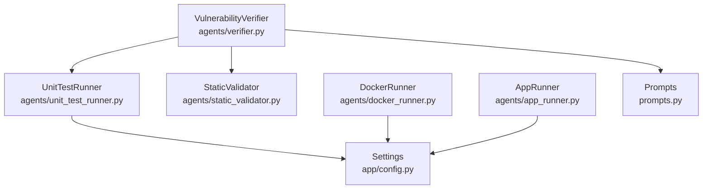
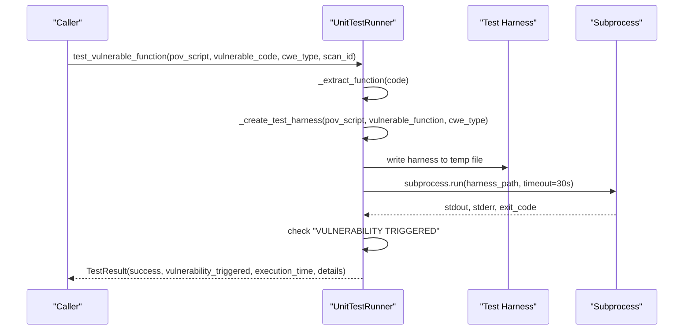
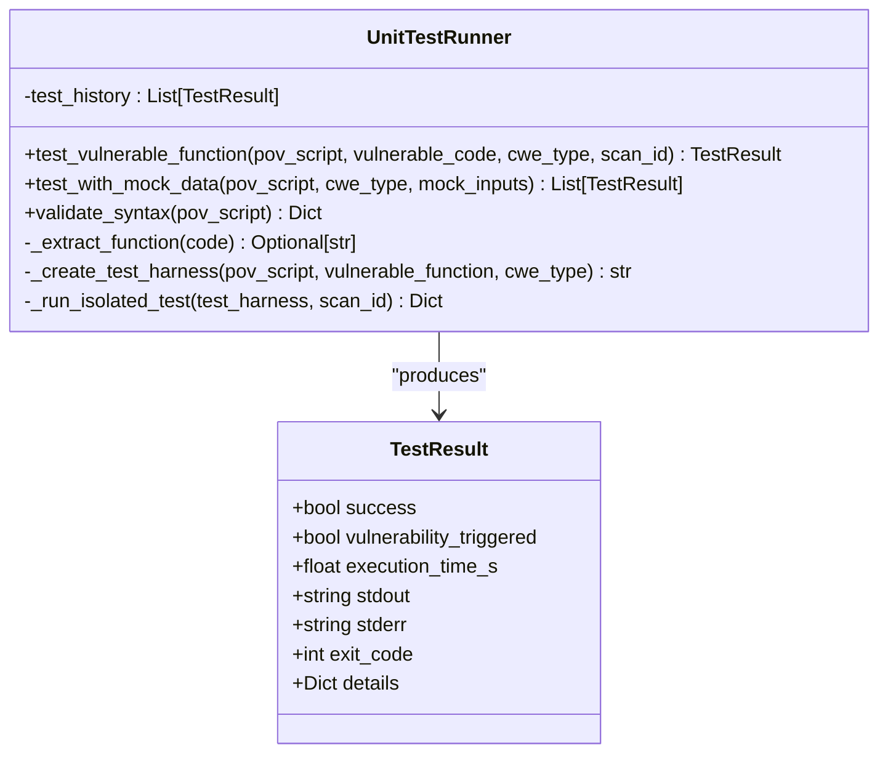
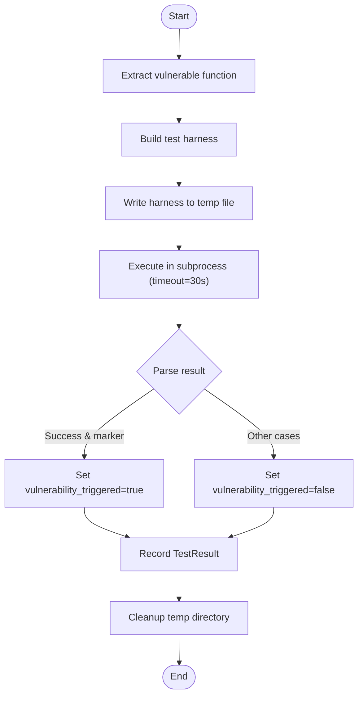
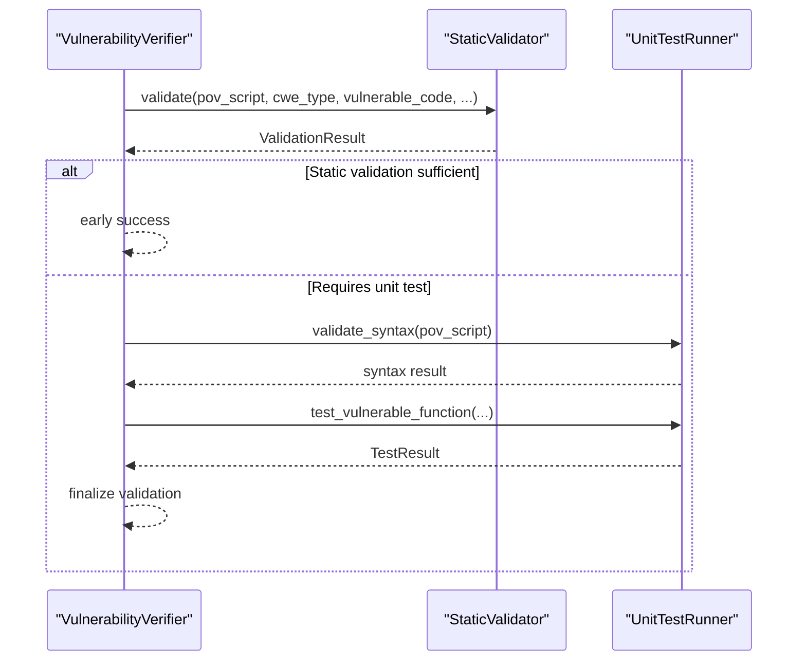
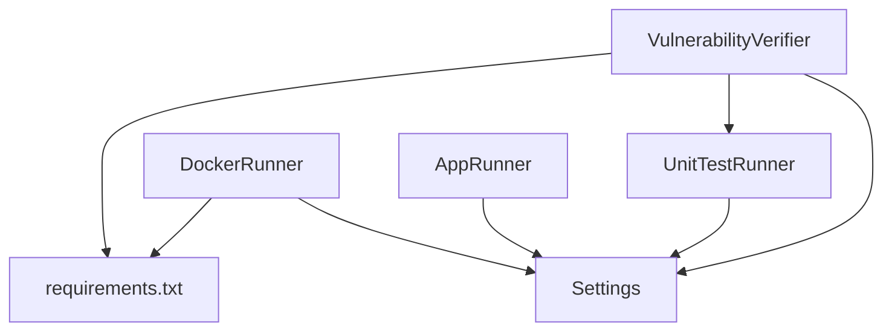

# Unit Test Runner Agent

<cite>
**Referenced Files in This Document**
- [unit_test_runner.py](file://agents/unit_test_runner.py)
- [pov_tester.py](file://agents/pov_tester.py)
- [docker_runner.py](file://agents/docker_runner.py)
- [app_runner.py](file://agents/app_runner.py)
- [verifier.py](file://agents/verifier.py)
- [static_validator.py](file://agents/static_validator.py)
- [config.py](file://app/config.py)
- [prompts.py](file://prompts.py)
- [test_agent.py](file://tests/test_agent.py)
- [requirements.txt](file://requirements.txt)
</cite>

## Table of Contents
1. [Introduction](#introduction)
2. [Project Structure](#project-structure)
3. [Core Components](#core-components)
4. [Architecture Overview](#architecture-overview)
5. [Detailed Component Analysis](#detailed-component-analysis)
6. [Dependency Analysis](#dependency-analysis)
7. [Performance Considerations](#performance-considerations)
8. [Troubleshooting Guide](#troubleshooting-guide)
9. [Conclusion](#conclusion)
10. [Appendices](#appendices)

## Introduction
The UnitTestRunner agent provides a controlled, isolated environment for executing Proof-of-Vulnerability (PoV) scripts against vulnerable code snippets. It focuses on unit-style validation by extracting and isolating vulnerable functions, embedding PoV logic, and running the combined harness in a restricted subprocess. The agent integrates with broader testing infrastructure, including static validation, Docker-based execution, and application lifecycle management, to deliver reliable vulnerability exploitation validation.

## Project Structure
The UnitTestRunner resides in the agents module alongside complementary testing and validation components. It collaborates with:
- StaticValidator for pre-execution checks
- DockerRunner for containerized execution
- AppRunner for application lifecycle management
- Verifier for end-to-end PoV generation and validation
- Config for environment and resource limits

**Diagram sources**
- [unit_test_runner.py:1-344](file://agents/unit_test_runner.py#L1-L344)
- [static_validator.py:1-305](file://agents/static_validator.py#L1-L305)
- [docker_runner.py:1-377](file://agents/docker_runner.py#L1-L377)
- [app_runner.py:1-200](file://agents/app_runner.py#L1-L200)
- [verifier.py:1-562](file://agents/verifier.py#L1-L562)
- [config.py:1-255](file://app/config.py#L1-L255)
- [prompts.py:1-424](file://prompts.py#L1-L424)

**Section sources**
- [unit_test_runner.py:1-344](file://agents/unit_test_runner.py#L1-L344)
- [config.py:92-101](file://app/config.py#L92-L101)

## Core Components
- UnitTestRunner: Orchestrates PoV execution against isolated vulnerable code. Provides:
  - Function extraction from code snippets
  - Test harness creation embedding PoV into vulnerable context
  - Subprocess execution with timeouts and restricted environments
  - Mock input testing capability
  - Syntax validation via AST parsing
- TestResult: Encapsulates execution outcomes, including success flags, vulnerability trigger detection, timing, and captured output.
- Integration points:
  - StaticValidator: Pre-execution validation of PoV scripts
  - DockerRunner: Alternative containerized execution with stricter isolation
  - AppRunner: Lifecycle management for applications under test
  - VulnerabilityVerifier: End-to-end PoV generation and validation pipeline

**Section sources**
- [unit_test_runner.py:16-117](file://agents/unit_test_runner.py#L16-L117)
- [static_validator.py:12-23](file://agents/static_validator.py#L12-L23)
- [docker_runner.py:27-36](file://agents/docker_runner.py#L27-L36)
- [app_runner.py:19-24](file://agents/app_runner.py#L19-L24)
- [verifier.py:42-47](file://agents/verifier.py#L42-L47)

## Architecture Overview
The UnitTestRunner executes PoV scripts in a two-stage process:
1. Test harness assembly: Embeds the vulnerable code and PoV into a single Python script with isolated namespaces and output redirection.
2. Controlled execution: Runs the harness in a subprocess with strict resource limits and a timeout.

**Diagram sources**
- [unit_test_runner.py:34-117](file://agents/unit_test_runner.py#L34-L117)
- [unit_test_runner.py:145-234](file://agents/unit_test_runner.py#L145-L234)
- [unit_test_runner.py:236-286](file://agents/unit_test_runner.py#L236-L286)

## Detailed Component Analysis

### UnitTestRunner Class
Responsibilities:
- Extract the main vulnerable function from a code snippet using regex heuristics.
- Build a test harness that:
  - Defines a vulnerable code context
  - Exposes helpers (e.g., target URL constants)
  - Executes the vulnerable code in an isolated namespace
  - Executes the PoV script within the same namespace
  - Captures stdout/stderr and prints a standardized result marker
- Run the harness in a subprocess with:
  - A 30-second timeout
  - Restricted environment variables
  - Temporary directory cleanup
- Validate PoV syntax using AST parsing
- Support mock input testing by piping inputs to the harness

Key behaviors:
- Vulnerability trigger detection relies on the presence of a specific marker in stdout and the harness’s exit code convention.
- Execution history is maintained for observability.

**Diagram sources**
- [unit_test_runner.py:28-117](file://agents/unit_test_runner.py#L28-L117)
- [unit_test_runner.py:16-26](file://agents/unit_test_runner.py#L16-L26)

**Section sources**
- [unit_test_runner.py:28-344](file://agents/unit_test_runner.py#L28-L344)

### Test Harness Construction
The harness:
- Creates a safe execution environment with redirected stdout/stderr
- Loads the vulnerable code into a namespace and exposes it globally
- Executes the PoV script within the same namespace so that exposed functions are callable
- Emits a standardized result marker upon successful trigger or failure

Security and isolation:
- Uses a temporary directory per execution
- Restricts environment variables in subprocess execution
- Enforces a hard timeout to prevent hangs

**Section sources**
- [unit_test_runner.py:145-234](file://agents/unit_test_runner.py#L145-L234)
- [unit_test_runner.py:236-286](file://agents/unit_test_runner.py#L236-L286)

### Execution Workflow
End-to-end flow:
1. Prepare PoV and vulnerable code
2. Extract function and build harness
3. Write harness to a temporary file
4. Execute in subprocess with timeout and restricted environment
5. Parse results and mark vulnerability trigger
6. Record execution metrics and cleanup

**Diagram sources**
- [unit_test_runner.py:34-117](file://agents/unit_test_runner.py#L34-L117)
- [unit_test_runner.py:236-286](file://agents/unit_test_runner.py#L236-L286)

### Integration with Static Validation and Verifier
- StaticValidator performs fast, CWE-aware checks to confirm PoV script structure and relevance before unit execution.
- VulnerabilityVerifier coordinates:
  - Static validation
  - Unit test execution (when vulnerable code is available)
  - LLM-based fallback validation
  - Failure analysis and suggestions

**Diagram sources**
- [verifier.py:225-387](file://agents/verifier.py#L225-L387)
- [static_validator.py:123-233](file://agents/static_validator.py#L123-L233)
- [unit_test_runner.py:308-334](file://agents/unit_test_runner.py#L308-L334)

**Section sources**
- [verifier.py:225-387](file://agents/verifier.py#L225-L387)
- [static_validator.py:123-233](file://agents/static_validator.py#L123-L233)
- [unit_test_runner.py:308-334](file://agents/unit_test_runner.py#L308-L334)

### Environment Configuration and Isolation
- DockerRunner provides an alternative with stronger isolation:
  - Network isolation via none mode
  - Memory and CPU quotas
  - Image pull and container lifecycle management
- AppRunner manages application lifecycle for integration-style testing:
  - Dependency installation and process startup
  - Health checks and graceful shutdown
- Settings define Docker defaults and availability checks.

**Section sources**
- [docker_runner.py:27-36](file://agents/docker_runner.py#L27-L36)
- [docker_runner.py:62-191](file://agents/docker_runner.py#L62-L191)
- [app_runner.py:25-148](file://agents/app_runner.py#L25-L148)
- [config.py:92-101](file://app/config.py#L92-L101)

## Dependency Analysis
External dependencies and runtime requirements:
- Python standard library for core functionality
- Docker SDK for containerized execution
- Pydantic settings for configuration management
- Optional LLM libraries for verifier workflows

**Diagram sources**
- [requirements.txt:1-44](file://requirements.txt#L1-L44)
- [config.py:1-255](file://app/config.py#L1-L255)
- [unit_test_runner.py:1-14](file://agents/unit_test_runner.py#L1-L14)
- [docker_runner.py:1-20](file://agents/docker_runner.py#L1-L20)
- [verifier.py:1-35](file://agents/verifier.py#L1-L35)

**Section sources**
- [requirements.txt:1-44](file://requirements.txt#L1-L44)
- [config.py:150-255](file://app/config.py#L150-L255)

## Performance Considerations
- Subprocess timeout: 30 seconds to prevent long-running or stuck executions.
- Resource limits: DockerRunner enforces memory and CPU quotas for containerized runs.
- Output capture: Buffered stdout/stderr to minimize overhead.
- Batch execution: DockerRunner supports batch runs with optional progress callbacks.
- Static validation: Reduces unnecessary unit test executions by catching obvious issues early.

[No sources needed since this section provides general guidance]

## Troubleshooting Guide
Common issues and resolutions:
- Extraction failures: If the vulnerable code lacks a recognizable function signature, extraction returns None. Ensure the code snippet includes a function definition or adjust the snippet to expose the vulnerable logic.
- Syntax errors: Use the built-in syntax validation to catch AST errors before execution.
- Timeout failures: Increase Docker timeout or optimize PoV logic to reduce execution time.
- Missing trigger marker: Ensure the harness prints the required marker and that the PoV script exits with the expected code.
- Environment isolation: Verify Docker availability and image readiness when using DockerRunner.
- Application lifecycle: Confirm AppRunner can start the target application and that ports are available.

**Section sources**
- [unit_test_runner.py:55-68](file://agents/unit_test_runner.py#L55-L68)
- [unit_test_runner.py:320-334](file://agents/unit_test_runner.py#L320-L334)
- [docker_runner.py:81-90](file://agents/docker_runner.py#L81-L90)
- [app_runner.py:135-148](file://agents/app_runner.py#L135-L148)

## Conclusion
The UnitTestRunner agent offers a focused, repeatable method for validating PoV scripts against isolated vulnerable code. By combining function extraction, harness construction, and controlled execution, it provides reliable trigger detection and detailed execution metrics. Integration with static validation, Docker-based isolation, and application lifecycle management enables scalable and secure testing workflows.

[No sources needed since this section summarizes without analyzing specific files]

## Appendices

### Supported Testing Frameworks and Formats
- Unit-style harness: Executes PoV against embedded vulnerable code in a single Python script.
- Mock input testing: Pipes mock inputs to the harness for deterministic validation.
- Static validation: Pre-execution checks for structure and relevance.
- Containerized execution: DockerRunner for stronger isolation and resource control.

**Section sources**
- [unit_test_runner.py:288-318](file://agents/unit_test_runner.py#L288-L318)
- [static_validator.py:123-233](file://agents/static_validator.py#L123-L233)
- [docker_runner.py:62-191](file://agents/docker_runner.py#L62-L191)

### Test Case Formatting Requirements
- Must include a vulnerability trigger indicator printed to stdout.
- Should use only standard library modules.
- Prefer deterministic logic and avoid external network calls.
- When leveraging the harness, invoke the exposed vulnerable functions from the shared namespace.

**Section sources**
- [prompts.py:67-90](file://prompts.py#L67-L90)
- [unit_test_runner.py:191-224](file://agents/unit_test_runner.py#L191-L224)

### Execution Timeout Handling
- Unit test runner: 30-second subprocess timeout.
- DockerRunner: Configurable timeout with kill on expiration.
- AppRunner: Start timeout configurable per application.

**Section sources**
- [unit_test_runner.py:249-273](file://agents/unit_test_runner.py#L249-L273)
- [docker_runner.py:135-143](file://agents/docker_runner.py#L135-L143)
- [app_runner.py:30-31](file://agents/app_runner.py#L30-L31)

### Examples and References
- Example validation scenarios and assertions are demonstrated in the test suite for verifier behavior.
- Use the verifier to generate and validate PoVs, which then feed into the UnitTestRunner for unit-style testing.

**Section sources**
- [test_agent.py:17-61](file://tests/test_agent.py#L17-L61)
- [verifier.py:90-223](file://agents/verifier.py#L90-L223)