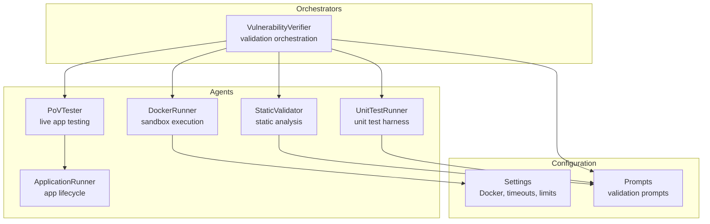
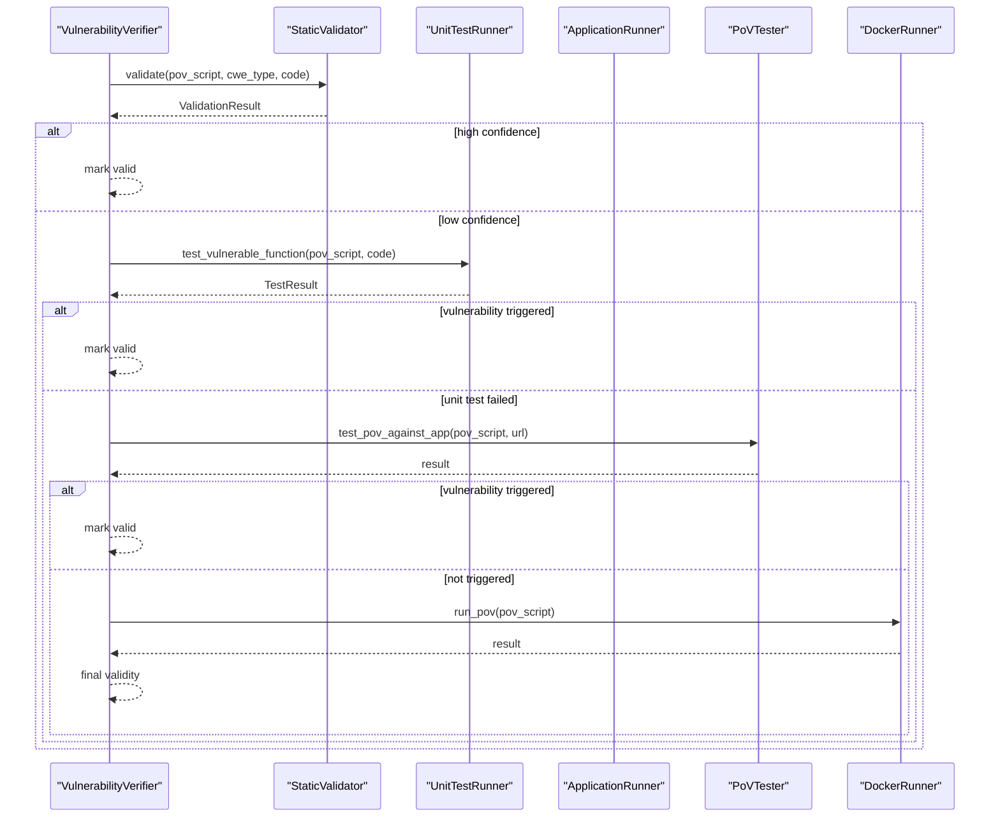
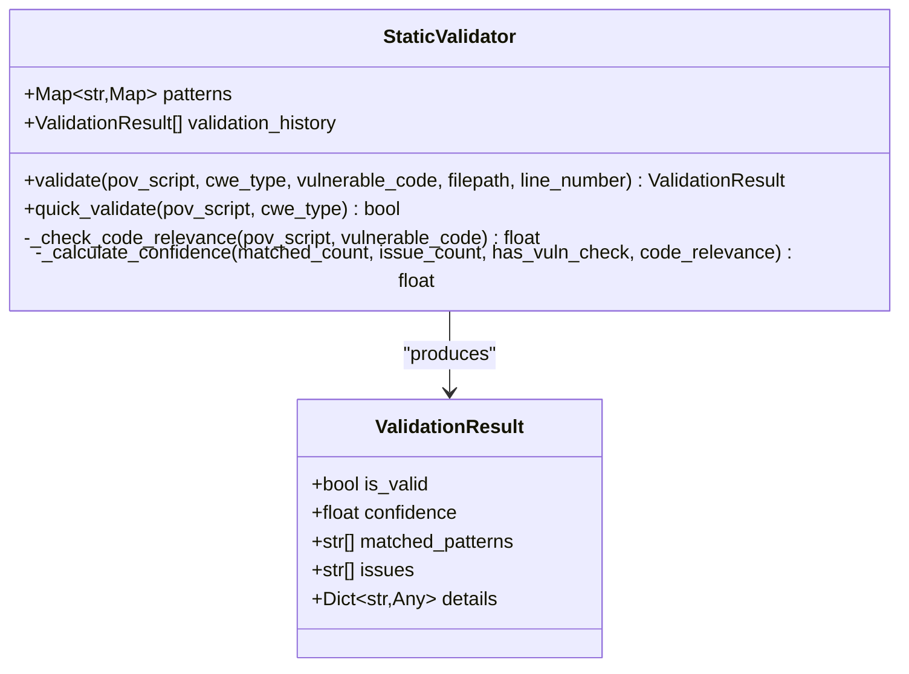
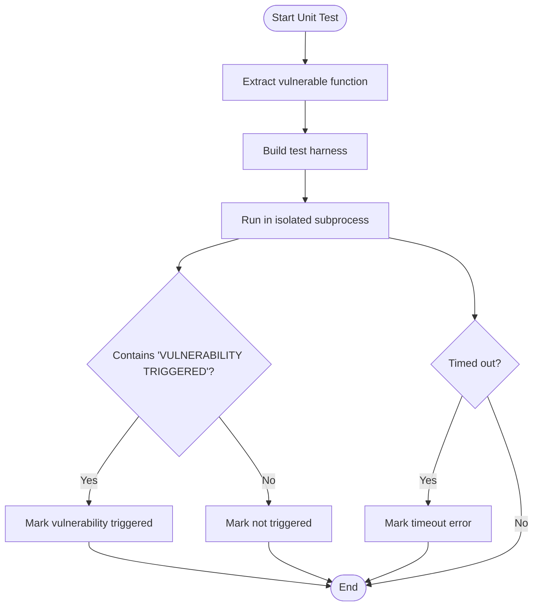
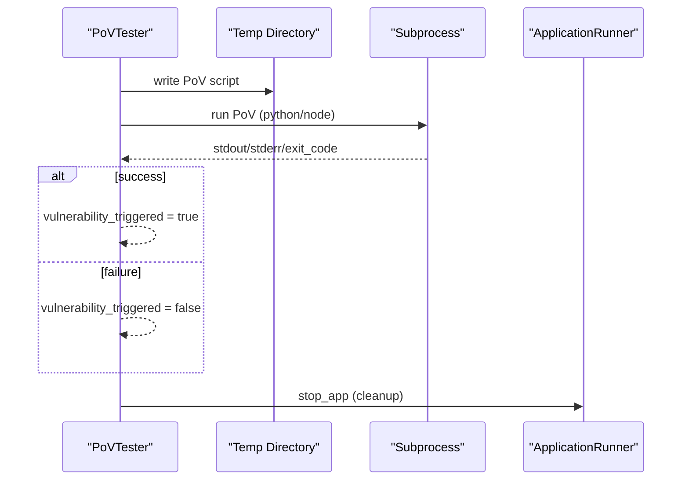
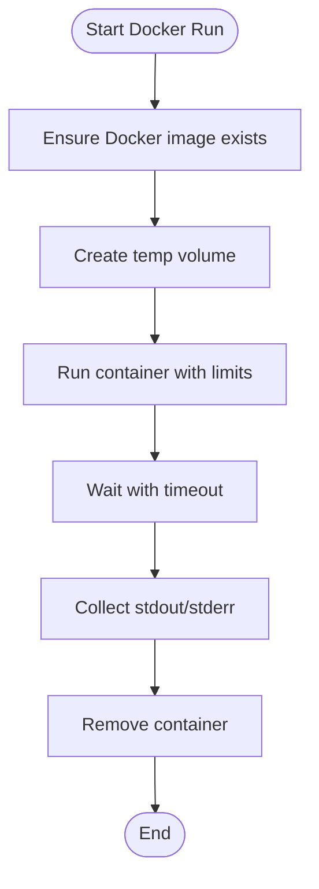
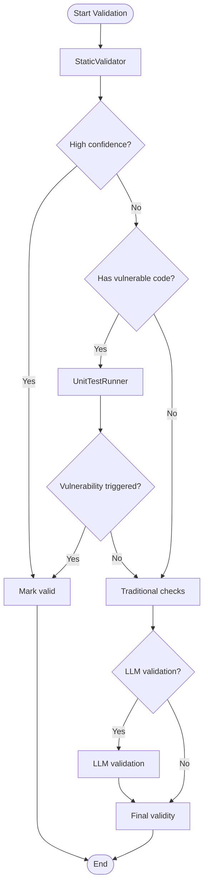
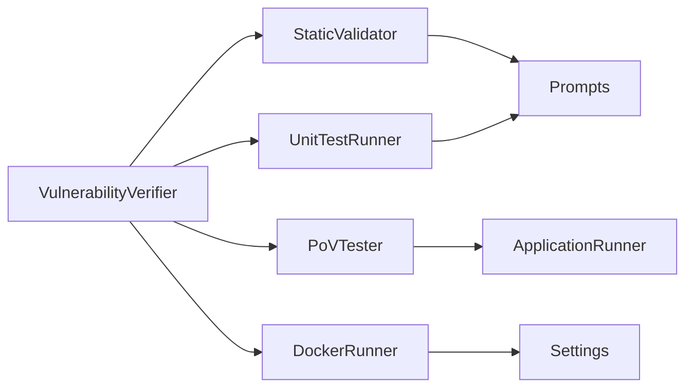

# Validation Agents

<cite>
**Referenced Files in This Document**
- [static_validator.py](file://agents/static_validator.py)
- [unit_test_runner.py](file://agents/unit_test_runner.py)
- [pov_tester.py](file://agents/pov_tester.py)
- [docker_runner.py](file://agents/docker_runner.py)
- [app_runner.py](file://agents/app_runner.py)
- [verifier.py](file://agents/verifier.py)
- [config.py](file://app/config.py)
- [prompts.py](file://prompts.py)
- [test_agent.py](file://tests/test_agent.py)
</cite>

## Table of Contents
1. [Introduction](#introduction)
2. [Project Structure](#project-structure)
3. [Core Components](#core-components)
4. [Architecture Overview](#architecture-overview)
5. [Detailed Component Analysis](#detailed-component-analysis)
6. [Dependency Analysis](#dependency-analysis)
7. [Performance Considerations](#performance-considerations)
8. [Troubleshooting Guide](#troubleshooting-guide)
9. [Conclusion](#conclusion)
10. [Appendices](#appendices)

## Introduction
This document explains AutoPoV’s validation agents that test and verify discovered vulnerabilities. It covers:
- StaticValidator: static analysis rules, security pattern detection, and automated validation
- UnitTestRunner: unit test harness integration, test case execution, and result interpretation
- PoVTester: PoV script validation against live applications, environment setup, and success criteria
- DockerRunner: sandboxed execution, container isolation, and secure validation environments
- Aggregation and workflow: how validation results are combined and interpreted across agents

It also provides troubleshooting guidance, performance tips, and examples for extending validation rules and integrating with the broader agent ecosystem.

## Project Structure
The validation agents reside under agents/ and integrate with configuration and prompts under app/ and prompts.py respectively. The verifier orchestrates validation across static, unit test, and LLM-based steps.

**Diagram sources**
- [static_validator.py:22-305](file://agents/static_validator.py#L22-L305)
- [unit_test_runner.py:28-344](file://agents/unit_test_runner.py#L28-L344)
- [pov_tester.py:21-296](file://agents/pov_tester.py#L21-L296)
- [docker_runner.py:27-377](file://agents/docker_runner.py#L27-L377)
- [app_runner.py:19-200](file://agents/app_runner.py#L19-L200)
- [verifier.py:42-562](file://agents/verifier.py#L42-L562)
- [config.py:92-101](file://app/config.py#L92-L101)
- [prompts.py:93-121](file://prompts.py#L93-L121)

**Section sources**
- [static_validator.py:1-305](file://agents/static_validator.py#L1-L305)
- [unit_test_runner.py:1-344](file://agents/unit_test_runner.py#L1-L344)
- [pov_tester.py:1-296](file://agents/pov_tester.py#L1-L296)
- [docker_runner.py:1-377](file://agents/docker_runner.py#L1-L377)
- [app_runner.py:1-200](file://agents/app_runner.py#L1-L200)
- [verifier.py:1-562](file://agents/verifier.py#L1-L562)
- [config.py:1-255](file://app/config.py#L1-L255)
- [prompts.py:1-424](file://prompts.py#L1-L424)

## Core Components
- StaticValidator: performs static analysis of PoV scripts against CWE-specific patterns and returns a structured result with confidence and matched indicators.
- UnitTestRunner: creates isolated test harnesses to execute PoVs against vulnerable code snippets and captures execution outcomes.
- PoVTester: executes PoVs against running applications, patches target URLs, and interprets success based on printed triggers.
- DockerRunner: runs PoVs inside Docker containers with strict resource limits and no network access for secure sandboxing.
- VulnerabilityVerifier: orchestrates validation across static, unit test, and fallback LLM-based checks, aggregating results and determining validity.

**Section sources**
- [static_validator.py:22-305](file://agents/static_validator.py#L22-L305)
- [unit_test_runner.py:28-344](file://agents/unit_test_runner.py#L28-L344)
- [pov_tester.py:21-296](file://agents/pov_tester.py#L21-L296)
- [docker_runner.py:27-377](file://agents/docker_runner.py#L27-L377)
- [verifier.py:225-387](file://agents/verifier.py#L225-L387)

## Architecture Overview
The validation pipeline follows a tiered approach:
- Static analysis for fast filtering
- Unit test execution when vulnerable code is available
- Live application testing via PoVTester
- Docker sandboxing for secure, isolated execution
- LLM-based validation as a fallback when needed

**Diagram sources**
- [verifier.py:225-387](file://agents/verifier.py#L225-L387)
- [static_validator.py:123-233](file://agents/static_validator.py#L123-L233)
- [unit_test_runner.py:34-116](file://agents/unit_test_runner.py#L34-L116)
- [pov_tester.py:24-106](file://agents/pov_tester.py#L24-L106)
- [docker_runner.py:62-191](file://agents/docker_runner.py#L62-L191)
- [app_runner.py:25-148](file://agents/app_runner.py#L25-L148)

## Detailed Component Analysis

### StaticValidator
StaticValidator evaluates PoV scripts using:
- CWE-specific regex patterns for attack vectors
- Required imports for the CWE category
- Payload indicators and presence of “VULNERABILITY TRIGGERED”
- Relevance scoring against the vulnerable code snippet
- Confidence calculation combining matched patterns, issues, and relevance

Key behaviors:
- Validates PoV against CWE categories (e.g., SQL Injection, XSS, Code Injection, Path Traversal, Command Injection, Deserialization, Hardcoded Credentials)
- Computes a confidence score and determines validity thresholds
- Tracks validation history for observability

**Diagram sources**
- [static_validator.py:12-233](file://agents/static_validator.py#L12-L233)

**Section sources**
- [static_validator.py:22-305](file://agents/static_validator.py#L22-L305)

### UnitTestRunner
UnitTestRunner isolates PoV execution against vulnerable code:
- Extracts the vulnerable function or code snippet
- Builds a test harness that loads the vulnerable code into a namespace and executes the PoV
- Runs the harness in a subprocess with restricted environment and timeout
- Captures stdout/stderr and determines if “VULNERABILITY TRIGGERED” was printed
- Supports mock-data testing and syntax validation

**Diagram sources**
- [unit_test_runner.py:34-116](file://agents/unit_test_runner.py#L34-L116)
- [unit_test_runner.py:145-234](file://agents/unit_test_runner.py#L145-L234)
- [unit_test_runner.py:236-286](file://agents/unit_test_runner.py#L236-L286)

**Section sources**
- [unit_test_runner.py:28-344](file://agents/unit_test_runner.py#L28-L344)

### PoVTester
PoVTester executes PoVs against live applications:
- Writes PoV to a temporary directory and runs it with patched target URLs
- Supports Python and JavaScript PoVs
- Uses environment variables to pass target URL
- Times out after a fixed period and cleans up
- Provides lifecycle support to start/stop apps via ApplicationRunner

**Diagram sources**
- [pov_tester.py:24-106](file://agents/pov_tester.py#L24-L106)
- [pov_tester.py:140-222](file://agents/pov_tester.py#L140-L222)
- [app_runner.py:150-169](file://agents/app_runner.py#L150-L169)

**Section sources**
- [pov_tester.py:21-296](file://agents/pov_tester.py#L21-L296)
- [app_runner.py:19-200](file://agents/app_runner.py#L19-L200)

### DockerRunner
DockerRunner executes PoVs in secure, isolated containers:
- Ensures Docker availability and image presence
- Mounts a temporary directory read-only into the container
- Disables networking and applies CPU/memory limits
- Waits with timeout and collects logs
- Supports stdin input and binary data variants

**Diagram sources**
- [docker_runner.py:62-191](file://agents/docker_runner.py#L62-L191)
- [docker_runner.py:193-310](file://agents/docker_runner.py#L193-L310)
- [config.py:92-101](file://app/config.py#L92-L101)

**Section sources**
- [docker_runner.py:27-377](file://agents/docker_runner.py#L27-L377)
- [config.py:92-101](file://app/config.py#L92-L101)

### VulnerabilityVerifier Orchestration
VulnerabilityVerifier coordinates validation:
- Static analysis first; if high confidence, mark valid
- If vulnerable code is available, run unit test; if triggered, mark valid
- Otherwise, fallback to traditional checks (syntax, required prints, standard library only, CWE-specific checks)
- Optionally use LLM validation when needed
- Aggregates results and sets final validity, will_trigger, and suggestions

**Diagram sources**
- [verifier.py:225-387](file://agents/verifier.py#L225-L387)
- [static_validator.py:123-233](file://agents/static_validator.py#L123-L233)
- [unit_test_runner.py:34-116](file://agents/unit_test_runner.py#L34-L116)
- [prompts.py:93-121](file://prompts.py#L93-L121)

**Section sources**
- [verifier.py:225-387](file://agents/verifier.py#L225-L387)
- [prompts.py:93-121](file://prompts.py#L93-L121)

## Dependency Analysis
- StaticValidator depends on regex and dataclasses; it does not import other agents.
- UnitTestRunner depends on subprocess, tempfile, and AST parsing; it writes and executes test harnesses.
- PoVTester depends on ApplicationRunner and subprocess; it patches target URLs and runs PoVs.
- DockerRunner depends on Docker SDK and Settings; it manages containers and enforces limits.
- VulnerabilityVerifier integrates StaticValidator, UnitTestRunner, and LLM prompts; it orchestrates the validation workflow.

**Diagram sources**
- [static_validator.py:1-305](file://agents/static_validator.py#L1-L305)
- [unit_test_runner.py:1-344](file://agents/unit_test_runner.py#L1-L344)
- [pov_tester.py:1-296](file://agents/pov_tester.py#L1-L296)
- [docker_runner.py:1-377](file://agents/docker_runner.py#L1-L377)
- [app_runner.py:1-200](file://agents/app_runner.py#L1-L200)
- [verifier.py:1-562](file://agents/verifier.py#L1-L562)
- [config.py:1-255](file://app/config.py#L1-L255)
- [prompts.py:1-424](file://prompts.py#L1-L424)

**Section sources**
- [static_validator.py:1-305](file://agents/static_validator.py#L1-L305)
- [unit_test_runner.py:1-344](file://agents/unit_test_runner.py#L1-L344)
- [pov_tester.py:1-296](file://agents/pov_tester.py#L1-L296)
- [docker_runner.py:1-377](file://agents/docker_runner.py#L1-L377)
- [app_runner.py:1-200](file://agents/app_runner.py#L1-L200)
- [verifier.py:1-562](file://agents/verifier.py#L1-L562)
- [config.py:1-255](file://app/config.py#L1-L255)
- [prompts.py:1-424](file://prompts.py#L1-L424)

## Performance Considerations
- StaticValidator is lightweight and fast; use it as the first filter.
- UnitTestRunner uses timeouts and restricted environments; keep PoVs deterministic and minimal.
- PoVTester and DockerRunner enforce timeouts; ensure PoVs terminate quickly.
- DockerRunner applies CPU/memory limits; tune settings for heavy PoVs.
- LLM-based validation is expensive; reserve for ambiguous cases.

[No sources needed since this section provides general guidance]

## Troubleshooting Guide
Common issues and resolutions:
- Static validation fails due to missing “VULNERABILITY TRIGGERED”: ensure PoV prints the required message.
- Unit test failures: verify PoV syntax and that vulnerable code is correctly extracted; check harness output for errors.
- PoVTester timeouts: reduce PoV complexity or adjust target URL patching; confirm app startup readiness.
- DockerRunner failures: verify Docker availability and image pull; check container logs for errors.
- LLM validation errors: ensure API keys and model availability; review prompt formatting.

**Section sources**
- [verifier.py:328-387](file://agents/verifier.py#L328-L387)
- [unit_test_runner.py:266-281](file://agents/unit_test_runner.py#L266-L281)
- [pov_tester.py:167-180](file://agents/pov_tester.py#L167-L180)
- [docker_runner.py:168-187](file://agents/docker_runner.py#L168-L187)
- [config.py:162-174](file://app/config.py#L162-L174)

## Conclusion
AutoPoV’s validation agents provide a robust, layered approach to confirming vulnerabilities:
- StaticValidator quickly filters PoVs
- UnitTestRunner validates PoVs against isolated code
- PoVTester ensures applicability against live targets
- DockerRunner guarantees secure, reproducible execution
- VulnerabilityVerifier aggregates results and makes final decisions

This design balances speed, safety, and accuracy, enabling reliable PoV validation across diverse environments.

[No sources needed since this section summarizes without analyzing specific files]

## Appendices

### Implementation Details for Validation Workflows
- Static validation: use StaticValidator.validate(...) to compute confidence and matched patterns.
- Unit test execution: use UnitTestRunner.test_vulnerable_function(...) with a scan_id for isolation.
- Live app testing: use PoVTester.test_pov_against_app(...); optionally use test_with_app_lifecycle(...) to manage app lifecycle.
- Sandbox execution: use DockerRunner.run_pov(...) with extra_files for complex PoVs.

**Section sources**
- [static_validator.py:123-233](file://agents/static_validator.py#L123-L233)
- [unit_test_runner.py:34-116](file://agents/unit_test_runner.py#L34-L116)
- [pov_tester.py:24-106](file://agents/pov_tester.py#L24-L106)
- [docker_runner.py:62-191](file://agents/docker_runner.py#L62-L191)

### Result Aggregation and Interpretation
- VulnerabilityVerifier.validate_pov(...) returns:
  - is_valid: final validity
  - will_trigger: YES/MAYBE/NO
  - validation_method: static_analysis/unit_test_execution/llm_analysis
  - static_result and unit_test_result for transparency
  - issues and suggestions for remediation

**Section sources**
- [verifier.py:249-387](file://agents/verifier.py#L249-L387)

### Failure Analysis and Retry Guidance
- Use VulnerabilityVerifier.analyze_failure(...) to get structured feedback on why a PoV failed and suggestions for improvement.

**Section sources**
- [verifier.py:492-551](file://agents/verifier.py#L492-L551)

### Examples and Best Practices
- Custom validation rules:
  - Extend StaticValidator.CWE_PATTERNS with new CWE entries and attack indicators.
  - Add CWE-specific checks in VulnerabilityVerifier._validate_cwe_specific(...).
- Test case development:
  - Keep PoVs deterministic and focused; include “VULNERABILITY TRIGGERED” and minimal imports.
  - Use UnitTestRunner.test_with_mock_data(...) for input-driven PoVs.
- Integration with the broader ecosystem:
  - Use VulnerabilityVerifier.generate_pov(...) to produce PoVs aligned with prompts.
  - Combine PoVTester and ApplicationRunner for end-to-end validation.

**Section sources**
- [static_validator.py:25-118](file://agents/static_validator.py#L25-L118)
- [verifier.py:425-451](file://agents/verifier.py#L425-L451)
- [unit_test_runner.py:288-318](file://agents/unit_test_runner.py#L288-L318)
- [prompts.py:46-90](file://prompts.py#L46-L90)

### Tests and Validation
- Unit tests demonstrate validation behavior for syntax errors, missing triggers, and stdlib module detection.

**Section sources**
- [test_agent.py:17-71](file://tests/test_agent.py#L17-L71)