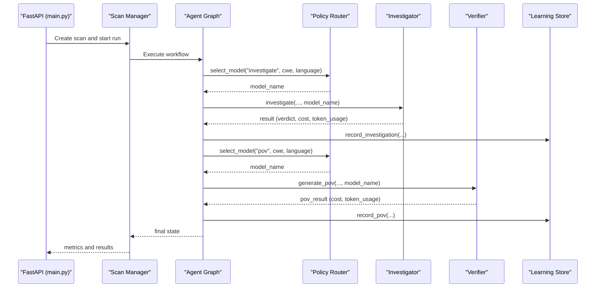
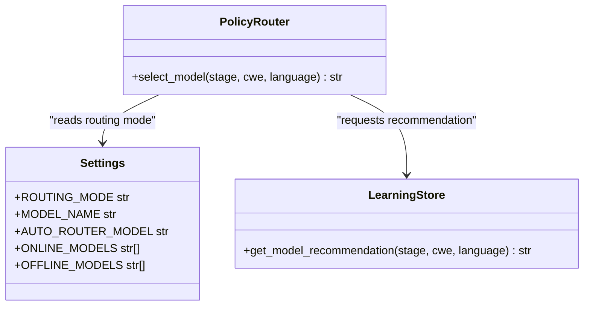
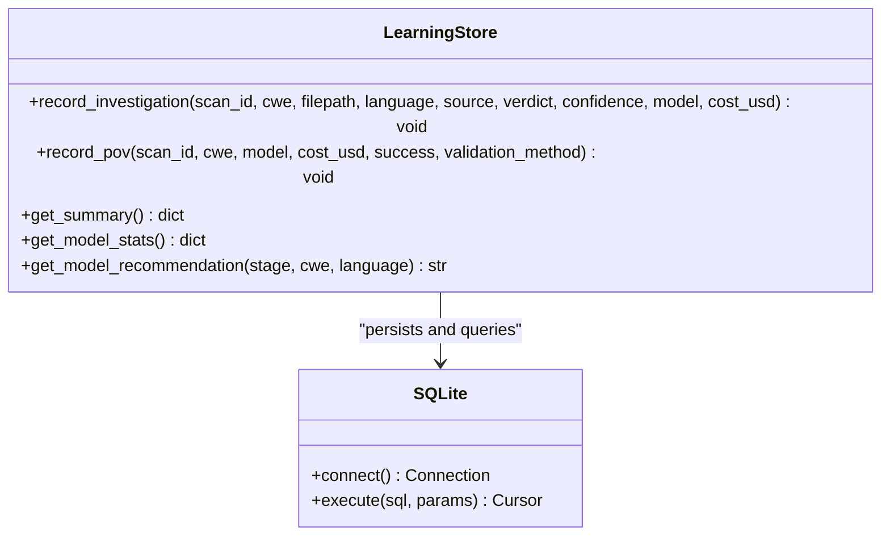
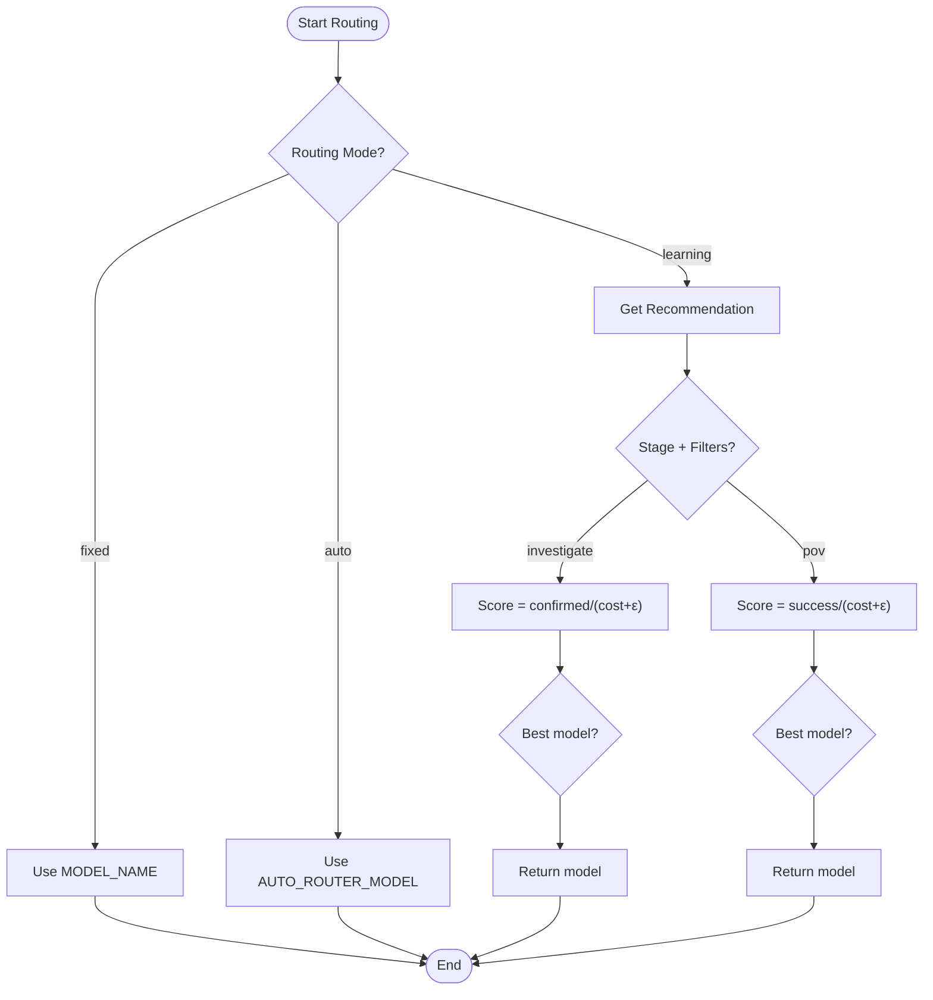
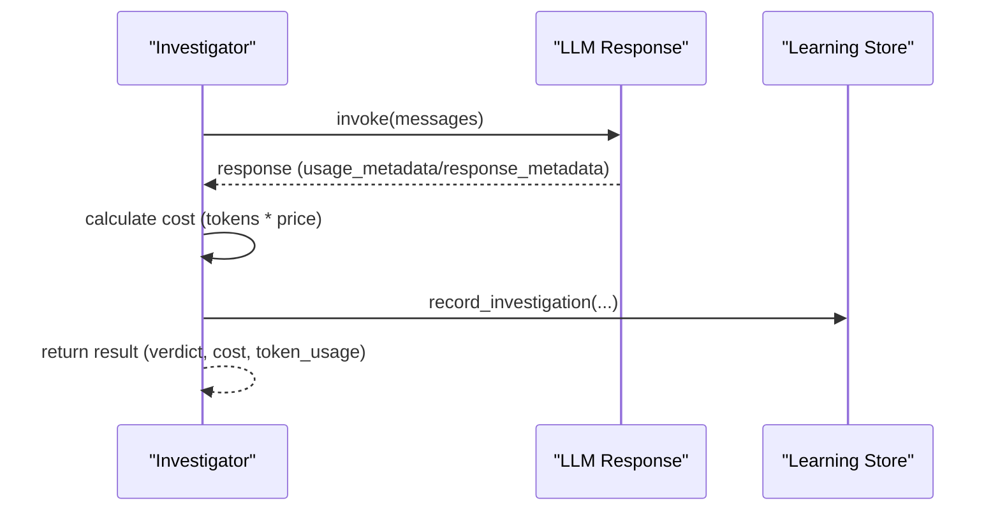
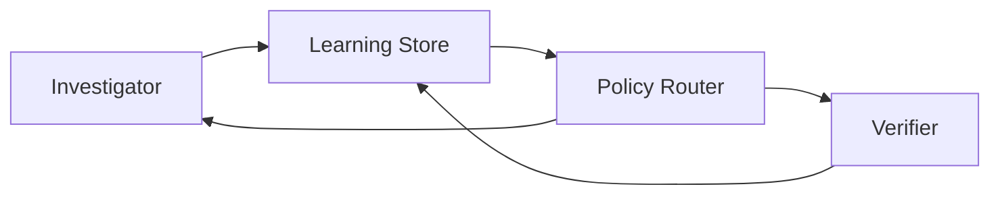
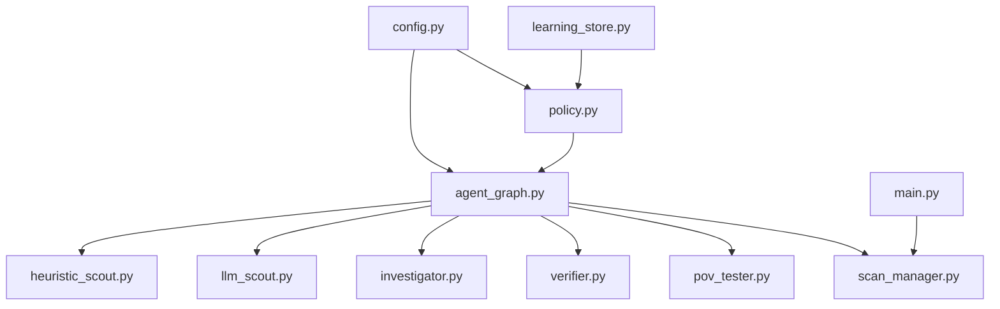

# Adaptive Learning & Policy System

<cite>
**Referenced Files in This Document**
- [policy.py](file://app/policy.py)
- [learning_store.py](file://app/learning_store.py)
- [config.py](file://app/config.py)
- [agent_graph.py](file://app/agent_graph.py)
- [scan_manager.py](file://app/scan_manager.py)
- [main.py](file://app/main.py)
- [llm_scout.py](file://agents/llm_scout.py)
- [investigator.py](file://agents/investigator.py)
- [heuristic_scout.py](file://agents/heuristic_scout.py)
- [verifier.py](file://agents/verifier.py)
- [pov_tester.py](file://agents/pov_tester.py)
- [prompts.py](file://prompts.py)
</cite>

## Table of Contents
1. [Introduction](#introduction)
2. [Project Structure](#project-structure)
3. [Core Components](#core-components)
4. [Architecture Overview](#architecture-overview)
5. [Detailed Component Analysis](#detailed-component-analysis)
6. [Dependency Analysis](#dependency-analysis)
7. [Performance Considerations](#performance-considerations)
8. [Troubleshooting Guide](#troubleshooting-guide)
9. [Conclusion](#conclusion)

## Introduction
This document describes AutoPoV’s adaptive learning and policy system that dynamically selects optimal LLM models for vulnerability research. It covers:
- The Policy Agent that routes models based on routing mode, vulnerability type, language characteristics, and historical performance
- The Learning Store that tracks agent performance metrics, cost efficiency, and success rates across configurations
- Model routing algorithms balancing cost, speed, and accuracy for different vulnerability categories
- Performance tracking mechanisms capturing inference times, token usage, and validation success rates
- Feedback loops that continuously improve model selection accuracy
- Strategies for handling model availability and rate limiting
- Examples of policy decision-making, performance thresholds, and integration patterns between learning data and agent execution
- Scalability considerations for large-scale vulnerability research operations

## Project Structure
AutoPoV organizes adaptive learning and policy logic primarily in the application layer (policy, learning store, configuration) and integrates with agent workflows (scouting, investigation, PoV generation/validation, testing). The scan manager orchestrates end-to-end execution and persists metrics for learning.

```mermaid
graph TB
subgraph "Application Layer"
CFG["Configuration (config.py)"]
POL["Policy Router (policy.py)"]
LS["Learning Store (learning_store.py)"]
AG["Agent Graph (agent_graph.py)"]
SM["Scan Manager (scan_manager.py)"]
API["FastAPI App (main.py)"]
end
subgraph "Agents"
HS["Heuristic Scout (heuristic_scout.py)"]
LLMSC["LLM Scout (llm_scout.py)"]
INV["Investigator (investigator.py)"]
VER["Verifier (verifier.py)"]
PVT["PoV Tester (pov_tester.py)"]
end
CFG --> POL
POL --> AG
LS <- --> AG
LS <- --> INV
LS <- --> VER
AG --> HS
AG --> LLMSC
AG --> INV
AG --> VER
AG --> PVT
AG --> SM
API --> SM
```

**Diagram sources**
- [config.py:13-254](file://app/config.py#L13-L254)
- [policy.py:12-39](file://app/policy.py#L12-L39)
- [learning_store.py:14-255](file://app/learning_store.py#L14-L255)
- [agent_graph.py:82-168](file://app/agent_graph.py#L82-L168)
- [scan_manager.py:47-662](file://app/scan_manager.py#L47-L662)
- [main.py:113-767](file://app/main.py#L113-L767)
- [heuristic_scout.py:13-241](file://agents/heuristic_scout.py#L13-L241)
- [llm_scout.py:32-207](file://agents/llm_scout.py#L32-L207)
- [investigator.py:37-518](file://agents/investigator.py#L37-L518)
- [verifier.py:42-561](file://agents/verifier.py#L42-L561)
- [pov_tester.py:21-295](file://agents/pov_tester.py#L21-L295)

**Section sources**
- [config.py:13-254](file://app/config.py#L13-L254)
- [main.py:113-767](file://app/main.py#L113-L767)

## Core Components
- Policy Router: Selects models based on routing mode and historical performance signals.
- Learning Store: Persists scan outcomes and aggregates performance statistics for recommendation.
- Configuration: Centralizes routing modes, model lists, cost caps, and feature toggles.
- Agent Graph: Orchestrates the vulnerability workflow and invokes policy decisions at key steps.
- Agents: Implement LLM-based scouting, investigation, PoV generation/validation, and testing with built-in cost tracking.

**Section sources**
- [policy.py:12-39](file://app/policy.py#L12-L39)
- [learning_store.py:14-255](file://app/learning_store.py#L14-L255)
- [config.py:13-254](file://app/config.py#L13-L254)
- [agent_graph.py:82-168](file://app/agent_graph.py#L82-L168)

## Architecture Overview
The adaptive system operates as follows:
- Routing Mode determines model selection strategy: fixed, learning-aware, or auto-router fallback.
- At each stage (investigate, PoV), the Policy Router chooses a model using:
  - Stage context
  - CWE category
  - Detected language
  - Historical performance from the Learning Store
- Agents record runtime metrics (inference time, token usage, cost) and outcomes (verdict, success) into the Learning Store.
- Metrics drive continuous improvement: higher-performing models are recommended more frequently.



**Diagram sources**
- [main.py:204-400](file://app/main.py#L204-L400)
- [scan_manager.py:234-365](file://app/scan_manager.py#L234-L365)
- [agent_graph.py:691-777](file://app/agent_graph.py#L691-L777)
- [policy.py:18-32](file://app/policy.py#L18-L32)
- [investigator.py:270-432](file://agents/investigator.py#L270-L432)
- [verifier.py:90-223](file://agents/verifier.py#L90-L223)
- [learning_store.py:61-123](file://app/learning_store.py#L61-L123)

## Detailed Component Analysis

### Policy Agent: Dynamic Model Selection
The Policy Agent encapsulates routing logic and integrates with the Learning Store for performance-aware recommendations.



- Routing Modes:
  - fixed: Always uses MODEL_NAME
  - learning: Uses Learning Store recommendation; falls back to AUTO_ROUTER_MODEL if none
  - auto: Uses AUTO_ROUTER_MODEL (default)
- Recommendation Algorithm:
  - For investigate: maximizes confirmed/(cost + ε) per model, filtered by CWE and language
  - For pov: maximizes success/(cost + ε) per model, filtered by CWE
- Integration:
  - Called by Agent Graph during investigation and PoV generation
  - Provides model name to agents for inference

**Diagram sources**
- [policy.py:12-39](file://app/policy.py#L12-L39)
- [config.py:41-44](file://app/config.py#L41-L44)
- [learning_store.py:188-248](file://app/learning_store.py#L188-L248)
- [agent_graph.py:709-796](file://app/agent_graph.py#L709-L796)

**Section sources**
- [policy.py:12-39](file://app/policy.py#L12-L39)
- [learning_store.py:188-248](file://app/learning_store.py#L188-L248)
- [agent_graph.py:709-796](file://app/agent_graph.py#L709-L796)

### Learning Store: Performance Tracking and Recommendations
The Learning Store persists outcomes and computes statistics to guide model selection.



- Data Model:
  - investigations: per-investigation records with verdict, confidence, model, cost, timestamp
  - pov_runs: per-PoV run with model, cost, success, validation_method, timestamp
- Aggregations:
  - get_model_stats(): per-stage totals, confirm rates, success rates, costs
  - get_summary(): overall counts and costs
- Recommendation:
  - Score = confirmed / (cost + ε); pick best-scoring model per stage and filters

**Diagram sources**
- [learning_store.py:14-255](file://app/learning_store.py#L14-L255)

**Section sources**
- [learning_store.py:14-255](file://app/learning_store.py#L14-L255)

### Model Routing Algorithms
Routing balances cost, speed, and accuracy:
- Accuracy: verified by historical confirmed rate (investigate) or success rate (pov)
- Cost: actual USD cost derived from token usage and pricing
- Speed: inferred from recorded inference times
- Filters: stage, CWE, language



**Diagram sources**
- [policy.py:18-32](file://app/policy.py#L18-L32)
- [learning_store.py:188-248](file://app/learning_store.py#L188-L248)

**Section sources**
- [policy.py:18-32](file://app/policy.py#L18-L32)
- [learning_store.py:188-248](file://app/learning_store.py#L188-L248)

### Performance Tracking Mechanisms
Agents capture and persist performance metrics for continuous learning:
- Inference time: measured per operation
- Token usage: extracted from response metadata
- Cost calculation: derived from pricing per 1M tokens
- Outcomes: verdicts, success flags, validation methods



**Diagram sources**
- [investigator.py:333-414](file://agents/investigator.py#L333-L414)
- [investigator.py:434-471](file://agents/investigator.py#L434-L471)
- [learning_store.py:61-94](file://app/learning_store.py#L61-L94)

**Section sources**
- [investigator.py:333-414](file://agents/investigator.py#L333-L414)
- [investigator.py:434-471](file://agents/investigator.py#L434-L471)
- [learning_store.py:61-94](file://app/learning_store.py#L61-L94)

### Feedback Loops and Continuous Improvement
- Agents record outcomes immediately after each stage
- Learning Store aggregates performance across models and stages
- Policy Router uses aggregated signals to improve future selections
- Metrics endpoints expose system-wide performance for tuning



**Diagram sources**
- [investigator.py:763-773](file://agents/investigator.py#L763-L773)
- [verifier.py:180-186](file://agents/verifier.py#L180-L186)
- [learning_store.py:188-248](file://app/learning_store.py#L188-L248)
- [policy.py:18-29](file://app/policy.py#L18-L29)

**Section sources**
- [investigator.py:763-773](file://agents/investigator.py#L763-L773)
- [verifier.py:180-186](file://agents/verifier.py#L180-L186)
- [learning_store.py:188-248](file://app/learning_store.py#L188-L248)
- [policy.py:18-29](file://app/policy.py#L18-L29)

### Handling Model Availability and Rate Limiting
- Availability:
  - Online vs offline modes selected via configuration
  - Agents check availability and raise explicit errors if providers are missing
- Rate limiting:
  - Cost caps enforced via configuration and per-call cost calculations
  - Scout cost cap prevents excessive early exploration
- Resilience:
  - Fallbacks: heuristic-only or LLM-only analysis when CodeQL unavailable
  - Graceful degradation: ingestion failures do not halt scans

**Section sources**
- [config.py:156-231](file://app/config.py#L156-L231)
- [llm_scout.py:165-166](file://agents/llm_scout.py#L165-L166)
- [agent_graph.py:253-300](file://app/agent_graph.py#L253-L300)

### Examples of Policy Decision-Making
- Investigate stage:
  - If routing mode is learning, Policy Router queries Learning Store with cwe and language filters
  - Recommends model with highest confirmed/(cost+ε)
- PoV stage:
  - Same scoring logic, but success/(cost+ε) using historical PoV outcomes
- Fallback:
  - If no recommendation available, defaults to AUTO_ROUTER_MODEL

**Section sources**
- [agent_graph.py:220-221](file://app/agent_graph.py#L220-L221)
- [agent_graph.py:710-712](file://app/agent_graph.py#L710-L712)
- [agent_graph.py:795-797](file://app/agent_graph.py#L795-L797)
- [policy.py:24-29](file://app/policy.py#L24-L29)

### Performance Threshold Configurations
- Cost controls:
  - MAX_COST_USD: global cap
  - SCOUT_MAX_COST_USD: per-scout budget
- Routing:
  - ROUTING_MODE: fixed | learning | auto
  - AUTO_ROUTER_MODEL: fallback model
- Model lists:
  - ONLINE_MODELS, OFFLINE_MODELS: selectable models
- Metrics exposure:
  - Metrics endpoint aggregates scans, costs, durations

**Section sources**
- [config.py:99-101](file://app/config.py#L99-L101)
- [config.py:46-62](file://app/config.py#L46-L62)
- [config.py:41-44](file://app/config.py#L41-L44)
- [main.py:754-757](file://app/main.py#L754-L757)

### Integration Patterns Between Learning Data and Agent Execution
- Agent Graph:
  - Calls Policy Router before investigation and PoV generation
  - Records outcomes into Learning Store after each stage
- Scan Manager:
  - Orchestrates workflow and persists results for historical analysis
- API:
  - Exposes learning summary and metrics for operational visibility

**Section sources**
- [agent_graph.py:709-796](file://app/agent_graph.py#L709-L796)
- [scan_manager.py:367-401](file://app/scan_manager.py#L367-L401)
- [main.py:745-751](file://app/main.py#L745-L751)

## Dependency Analysis
The system exhibits low coupling between components, with clear interfaces:
- Policy Router depends on Configuration and Learning Store
- Agent Graph depends on Policy Router and Agents
- Agents depend on Configuration and optionally on each other (e.g., Investigator informs Verifier)
- Scan Manager coordinates orchestration and persistence



**Diagram sources**
- [config.py:13-254](file://app/config.py#L13-L254)
- [policy.py:12-39](file://app/policy.py#L12-L39)
- [learning_store.py:14-255](file://app/learning_store.py#L14-L255)
- [agent_graph.py:82-168](file://app/agent_graph.py#L82-L168)
- [heuristic_scout.py:13-241](file://agents/heuristic_scout.py#L13-L241)
- [llm_scout.py:32-207](file://agents/llm_scout.py#L32-L207)
- [investigator.py:37-518](file://agents/investigator.py#L37-L518)
- [verifier.py:42-561](file://agents/verifier.py#L42-L561)
- [pov_tester.py:21-295](file://agents/pov_tester.py#L21-L295)
- [scan_manager.py:47-662](file://app/scan_manager.py#L47-L662)
- [main.py:113-767](file://app/main.py#L113-L767)

**Section sources**
- [config.py:13-254](file://app/config.py#L13-L254)
- [policy.py:12-39](file://app/policy.py#L12-L39)
- [learning_store.py:14-255](file://app/learning_store.py#L14-L255)
- [agent_graph.py:82-168](file://app/agent_graph.py#L82-L168)
- [scan_manager.py:47-662](file://app/scan_manager.py#L47-L662)
- [main.py:113-767](file://app/main.py#L113-L767)

## Performance Considerations
- Cost efficiency:
  - Use cost-aware routing (learning mode) to maximize confirmed/per-dollar
  - Apply per-call cost calculations and global caps
- Throughput:
  - Parallelize independent tasks (thread pool executor in Scan Manager)
  - Minimize redundant LLM calls via heuristic pre-filtering
- Latency:
  - Cache model instances in agents when possible
  - Prefer offline models for lower latency when accuracy permits
- Persistence:
  - Lightweight SQLite-backed store avoids external dependencies
  - Batch writes and periodic CSV rebuilds for metrics

[No sources needed since this section provides general guidance]

## Troubleshooting Guide
- Missing providers:
  - Investigator/Verifier raise explicit exceptions if required libraries are not installed
- Cost tracking issues:
  - Token usage extraction attempts multiple response metadata formats; fallback to estimates
- Routing anomalies:
  - Verify ROUTING_MODE and AUTO_ROUTER_MODEL configuration
  - Confirm Learning Store has sufficient historical data for recommendations
- Availability problems:
  - Check CodeQL/Joern availability; fallback to heuristic-only or LLM-only analysis

**Section sources**
- [investigator.py:32-34](file://agents/investigator.py#L32-L34)
- [verifier.py:37-39](file://agents/verifier.py#L37-L39)
- [investigator.py:340-377](file://agents/investigator.py#L340-L377)
- [agent_graph.py:253-300](file://app/agent_graph.py#L253-L300)

## Conclusion
AutoPoV’s adaptive learning and policy system provides a robust framework for dynamic model selection in vulnerability research. By combining configurable routing modes, a performance-aware recommendation engine, and comprehensive metrics collection, the system continuously improves model effectiveness while maintaining cost and performance discipline. The modular architecture enables scalability and resilience, supporting large-scale operations through careful resource management and graceful fallbacks.