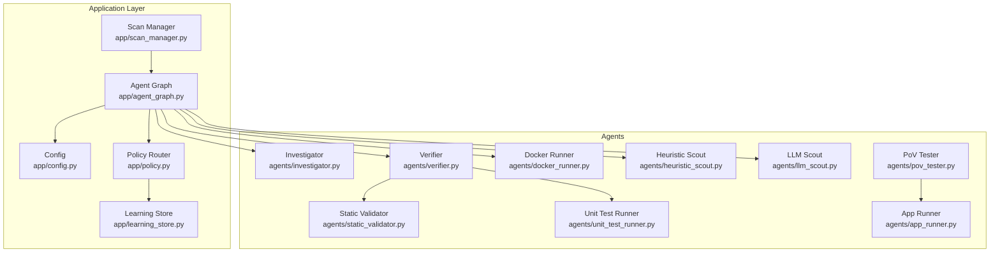
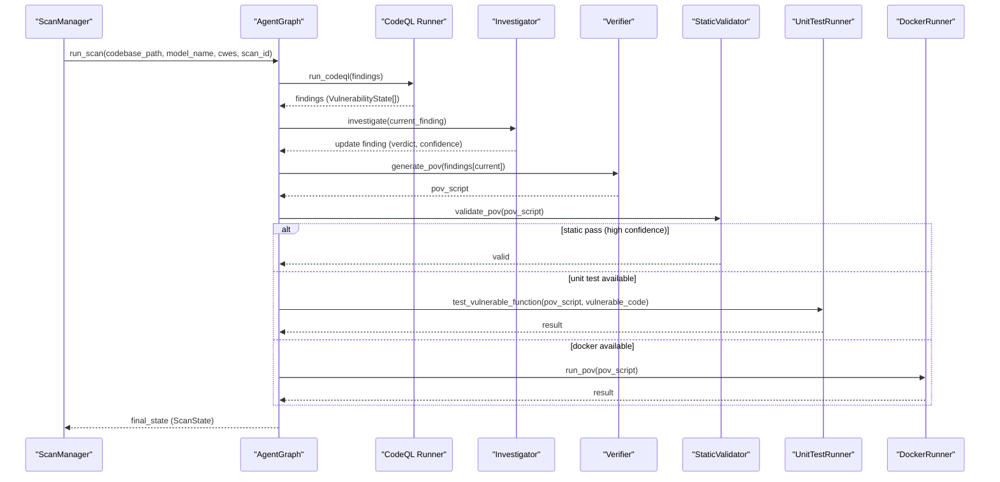
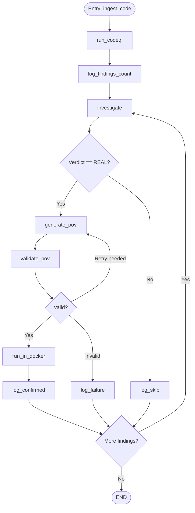
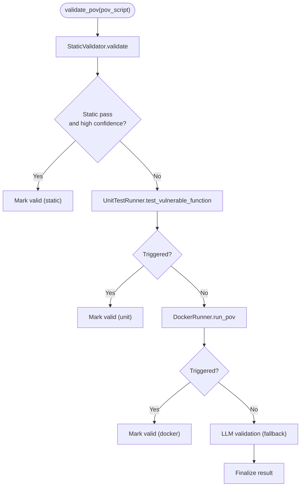
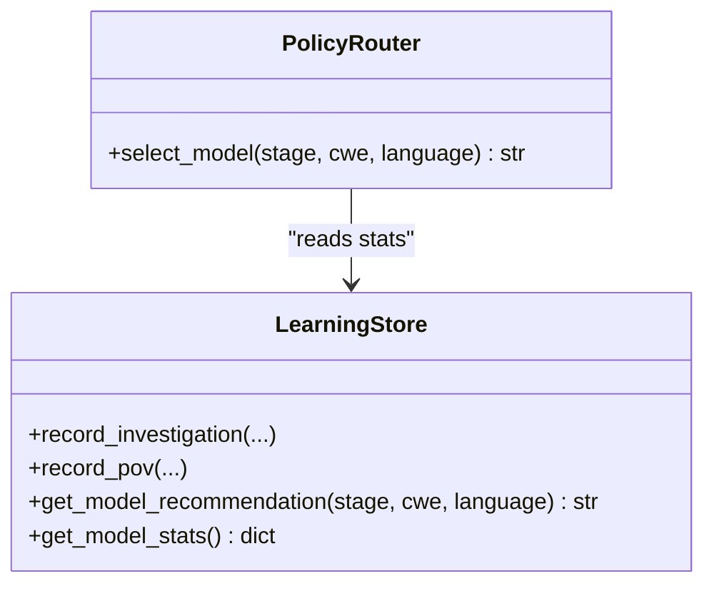
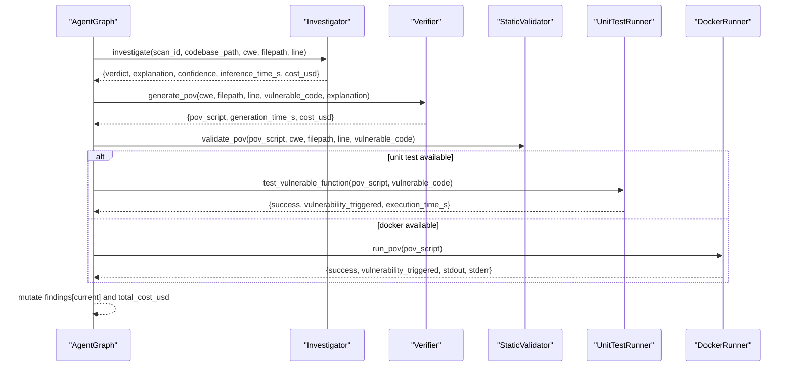
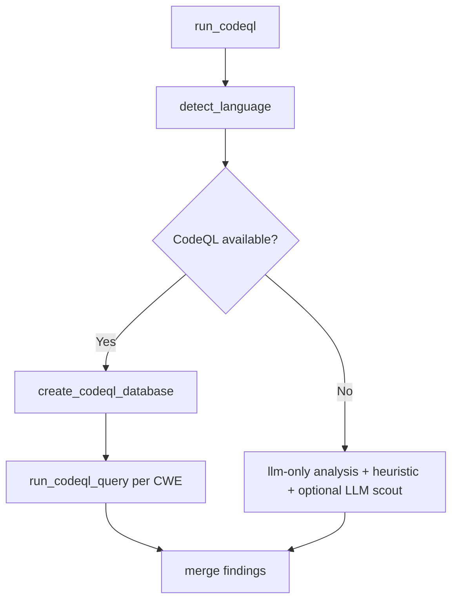
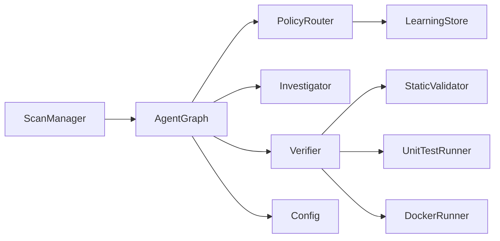

# Agent Orchestration & Workflow

<cite>
**Referenced Files in This Document**
- [agent_graph.py](file://app/agent_graph.py)
- [learning_store.py](file://app/learning_store.py)
- [policy.py](file://app/policy.py)
- [scan_manager.py](file://app/scan_manager.py)
- [config.py](file://app/config.py)
- [investigator.py](file://agents/investigator.py)
- [verifier.py](file://agents/verifier.py)
- [docker_runner.py](file://agents/docker_runner.py)
- [static_validator.py](file://agents/static_validator.py)
- [unit_test_runner.py](file://agents/unit_test_runner.py)
- [heuristic_scout.py](file://agents/heuristic_scout.py)
- [llm_scout.py](file://agents/llm_scout.py)
- [app_runner.py](file://agents/app_runner.py)
- [pov_tester.py](file://agents/pov_tester.py)
</cite>

## Table of Contents
1. [Introduction](#introduction)
2. [Project Structure](#project-structure)
3. [Core Components](#core-components)
4. [Architecture Overview](#architecture-overview)
5. [Detailed Component Analysis](#detailed-component-analysis)
6. [Dependency Analysis](#dependency-analysis)
7. [Performance Considerations](#performance-considerations)
8. [Troubleshooting Guide](#troubleshooting-guide)
9. [Conclusion](#conclusion)

## Introduction
This document explains AutoPoV’s agent orchestration system built on LangGraph. The system implements a stateful workflow where each vulnerability stage becomes an autonomous agent node. It documents the ScanState and VulnerabilityState data models enabling persistent state across agent transitions, the conditional edge logic that routes work based on outcomes and confidence, and the hybrid validation pipeline that escalates from static analysis to unit testing to Docker sandbox execution. It also covers adaptive model selection via the Policy Agent and Learning Store integration, concrete examples of workflow transitions and state mutations, and error handling strategies. Finally, it addresses performance considerations for multi-agent coordination and state persistence patterns.

## Project Structure
AutoPoV organizes its orchestration around a central LangGraph workflow in the application layer, with specialized agent modules under agents/. Supporting infrastructure includes configuration, policy routing, learning storage, and scan lifecycle management.

**Diagram sources**
- [agent_graph.py:82-168](file://app/agent_graph.py#L82-L168)
- [scan_manager.py:47-114](file://app/scan_manager.py#L47-L114)
- [policy.py:12-39](file://app/policy.py#L12-L39)
- [learning_store.py:14-256](file://app/learning_store.py#L14-L256)
- [investigator.py:37-519](file://agents/investigator.py#L37-L519)
- [verifier.py:42-562](file://agents/verifier.py#L42-L562)
- [docker_runner.py:27-377](file://agents/docker_runner.py#L27-L377)
- [static_validator.py:22-305](file://agents/static_validator.py#L22-L305)
- [unit_test_runner.py:28-344](file://agents/unit_test_runner.py#L28-L344)
- [heuristic_scout.py:13-242](file://agents/heuristic_scout.py#L13-L242)
- [llm_scout.py:32-208](file://agents/llm_scout.py#L32-L208)
- [app_runner.py:19-200](file://agents/app_runner.py#L19-L200)
- [pov_tester.py:21-296](file://agents/pov_tester.py#L21-L296)

**Section sources**
- [agent_graph.py:82-168](file://app/agent_graph.py#L82-L168)
- [scan_manager.py:47-114](file://app/scan_manager.py#L47-L114)

## Core Components
- State models
  - ScanState: orchestrates the entire scan lifecycle, tracks findings, and maintains persistent metadata across nodes.
  - VulnerabilityState: captures per-finding details, including confidence, PoV artifacts, and final status.
- Agent nodes
  - ingest_code, run_codeql, investigate, generate_pov, validate_pov, run_in_docker, log_confirmed, log_skip, log_failure, log_findings_count.
- Conditional routing
  - Edges route based on outcomes (REAL vs SKIP), validation results, and whether more findings remain.
- Hybrid validation
  - Static analysis → unit testing → Docker sandbox execution with fallback LLM validation.
- Adaptive model selection
  - PolicyRouter selects models based on routing mode (fixed, auto, learning) using LearningStore statistics.

**Section sources**
- [agent_graph.py:45-80](file://app/agent_graph.py#L45-L80)
- [agent_graph.py:105-168](file://app/agent_graph.py#L105-L168)
- [verifier.py:225-387](file://agents/verifier.py#L225-L387)
- [policy.py:12-39](file://app/policy.py#L12-L39)
- [learning_store.py:188-248](file://app/learning_store.py#L188-L248)

## Architecture Overview
The orchestration centers on a LangGraph StateGraph that defines deterministic nodes and conditional edges. Each node mutates ScanState and optionally a single VulnerabilityState element identified by current_finding_idx. The workflow integrates discovery (CodeQL + scouts), investigation, PoV generation, hybrid validation, and optional Docker sandboxing.

**Diagram sources**
- [agent_graph.py:241-307](file://app/agent_graph.py#L241-L307)
- [agent_graph.py:691-777](file://app/agent_graph.py#L691-L777)
- [verifier.py:90-224](file://agents/verifier.py#L90-L224)
- [static_validator.py:123-233](file://agents/static_validator.py#L123-L233)
- [unit_test_runner.py:34-104](file://agents/unit_test_runner.py#L34-L104)
- [docker_runner.py:62-191](file://agents/docker_runner.py#L62-L191)
- [scan_manager.py:234-365](file://app/scan_manager.py#L234-L365)

## Detailed Component Analysis

### State Models: ScanState and VulnerabilityState
- ScanState fields include scan identity, status, codebase path, selected model, CWE list, findings array, preloaded findings, detected language, current finding index, timing, cumulative cost, logs, and error.
- VulnerabilityState fields include CVE, file path, line number, CWE type, code chunk, LLM verdict/explanation, confidence, PoV artifacts, retry count, inference cost/time, and final status.

These models enable persistent state across nodes and allow the workflow to iterate over findings deterministically.

**Section sources**
- [agent_graph.py:45-80](file://app/agent_graph.py#L45-L80)

### Agent Nodes and Conditional Edges
- Nodes
  - ingest_code: prepares vector store context.
  - run_codeql: executes CodeQL queries, merges with autonomous discovery, and sets findings.
  - investigate: applies PolicyRouter to select model, calls Investigator, records learning store metrics.
  - generate_pov: invokes Verifier to produce PoV script.
  - validate_pov: hybrid validation pipeline (static → unit test → Docker).
  - run_in_docker: executes PoV in sandbox.
  - log_confirmed/skip/failure: final logging and status tagging.
  - log_findings_count: pre-investigation logging.
- Conditional edges
  - From investigate: route to generate_pov or log_skip based on verdict.
  - From validate_pov: route to run_in_docker, generate_pov (retry), or log_failure.
  - After logging: loop back to investigate if more findings; otherwise END.

**Diagram sources**
- [agent_graph.py:88-168](file://app/agent_graph.py#L88-L168)

**Section sources**
- [agent_graph.py:88-168](file://app/agent_graph.py#L88-L168)

### Hybrid Validation Pipeline
The verifier implements a three-tier hybrid validation:
1) Static analysis: checks for required indicators, imports, attack patterns, and code relevance; produces confidence and issues.
2) Unit test execution: if vulnerable code is available, isolates and executes PoV against the vulnerable function; captures stdout/stderr and exit code.
3) Docker sandbox execution: if Docker is available, runs PoV in a restricted container; marks vulnerability triggered if expected indicator appears in output.
4) Fallback LLM analysis: if inconclusive, uses LLM to assess PoV validity.

**Diagram sources**
- [verifier.py:225-387](file://agents/verifier.py#L225-L387)
- [static_validator.py:123-233](file://agents/static_validator.py#L123-L233)
- [unit_test_runner.py:34-104](file://agents/unit_test_runner.py#L34-L104)
- [docker_runner.py:62-191](file://agents/docker_runner.py#L62-L191)

**Section sources**
- [verifier.py:225-387](file://agents/verifier.py#L225-L387)
- [static_validator.py:123-233](file://agents/static_validator.py#L123-L233)
- [unit_test_runner.py:34-104](file://agents/unit_test_runner.py#L34-L104)
- [docker_runner.py:62-191](file://agents/docker_runner.py#L62-L191)

### Adaptive Model Selection via Policy Agent and Learning Store
- PolicyRouter selects models based on routing mode:
  - fixed: uses a configured model.
  - learning: queries LearningStore for best-performing model by stage and attributes.
  - auto: uses a default auto-router model.
- LearningStore persists investigation and PoV run outcomes, aggregates stats, and recommends models by confirmed counts and cost efficiency.

**Diagram sources**
- [policy.py:12-39](file://app/policy.py#L12-L39)
- [learning_store.py:188-248](file://app/learning_store.py#L188-L248)

**Section sources**
- [policy.py:12-39](file://app/policy.py#L12-L39)
- [learning_store.py:188-248](file://app/learning_store.py#L188-L248)

### Concrete Examples: Workflow Transitions and State Mutations
- Transition example 1: CodeQL → Investigate → Generate PoV → Validate PoV → Run in Docker
  - State mutation: ScanState.findings[current_finding_idx] updated with llm_verdict/confidence; VulnerabilityState pov_script and pov_result populated; total_cost_usd accumulated.
- Transition example 2: Investigate → Skip (non-REAL) → Next Finding
  - State mutation: current_finding_idx incremented; final_status set to skipped; loop continues until END.
- Transition example 3: Validate PoV → Retry (low confidence)
  - State mutation: generate_pov invoked again; retry_count incremented; confidence updated on next investigation.

**Diagram sources**
- [agent_graph.py:691-777](file://app/agent_graph.py#L691-L777)
- [verifier.py:90-224](file://agents/verifier.py#L90-L224)
- [static_validator.py:123-233](file://agents/static_validator.py#L123-L233)
- [unit_test_runner.py:34-104](file://agents/unit_test_runner.py#L34-L104)
- [docker_runner.py:62-191](file://agents/docker_runner.py#L62-L191)

**Section sources**
- [agent_graph.py:691-777](file://app/agent_graph.py#L691-L777)
- [verifier.py:90-224](file://agents/verifier.py#L90-L224)

### Discovery and Preprocessing
- CodeQL discovery: detects language, creates database, runs queries per CWE, parses SARIF, and merges with autonomous discovery.
- Autonomous discovery: heuristic scout and optional LLM scout (when enabled) augment findings; duplicates removed by filepath/line/CWE.

**Diagram sources**
- [agent_graph.py:241-307](file://app/agent_graph.py#L241-L307)
- [heuristic_scout.py:188-234](file://agents/heuristic_scout.py#L188-L234)
- [llm_scout.py:88-200](file://agents/llm_scout.py#L88-L200)

**Section sources**
- [agent_graph.py:241-307](file://app/agent_graph.py#L241-L307)
- [heuristic_scout.py:188-234](file://agents/heuristic_scout.py#L188-L234)
- [llm_scout.py:88-200](file://agents/llm_scout.py#L88-L200)

## Dependency Analysis
- Orchestrator-to-agent dependencies
  - AgentGraph depends on PolicyRouter and LearningStore for adaptive model selection.
  - Investigator depends on configuration and prompts; integrates tracing when enabled.
  - Verifier composes StaticValidator and UnitTestRunner; optionally uses DockerRunner.
  - DockerRunner depends on configuration and Docker availability.
- Configuration and environment
  - Config exposes environment-driven settings for models, tools, limits, and paths.
  - ScanManager coordinates lifecycle, logs, and persistence.

**Diagram sources**
- [agent_graph.py:82-168](file://app/agent_graph.py#L82-L168)
- [policy.py:12-39](file://app/policy.py#L12-L39)
- [learning_store.py:14-256](file://app/learning_store.py#L14-L256)
- [investigator.py:37-519](file://agents/investigator.py#L37-L519)
- [verifier.py:42-562](file://agents/verifier.py#L42-L562)
- [static_validator.py:22-305](file://agents/static_validator.py#L22-L305)
- [unit_test_runner.py:28-344](file://agents/unit_test_runner.py#L28-L344)
- [docker_runner.py:27-377](file://agents/docker_runner.py#L27-L377)
- [config.py:13-255](file://app/config.py#L13-L255)
- [scan_manager.py:47-114](file://app/scan_manager.py#L47-L114)

**Section sources**
- [agent_graph.py:82-168](file://app/agent_graph.py#L82-L168)
- [policy.py:12-39](file://app/policy.py#L12-L39)
- [learning_store.py:14-256](file://app/learning_store.py#L14-L256)
- [investigator.py:37-519](file://agents/investigator.py#L37-L519)
- [verifier.py:42-562](file://agents/verifier.py#L42-L562)
- [static_validator.py:22-305](file://agents/static_validator.py#L22-L305)
- [unit_test_runner.py:28-344](file://agents/unit_test_runner.py#L28-L344)
- [docker_runner.py:27-377](file://agents/docker_runner.py#L27-L377)
- [config.py:13-255](file://app/config.py#L13-L255)
- [scan_manager.py:47-114](file://app/scan_manager.py#L47-L114)

## Performance Considerations
- Multi-agent coordination
  - Use thread pool executor in ScanManager to run scans asynchronously without blocking the event loop.
  - Keep nodes small and stateless where possible; rely on persistent state to minimize inter-node communication overhead.
- State persistence
  - Persist ScanState logs and results to files; maintain CSV history for auditability and metrics.
  - Use SQLite-backed LearningStore for lightweight, transactional persistence of model performance signals.
- Cost control
  - Enforce per-scan and per-stage cost caps via configuration and token usage extraction.
  - Cap file scanning in scouts and limit max findings to bound compute.
- Tool availability checks
  - Gracefully degrade when CodeQL, Docker, or other tools are unavailable; still run LLM-only or heuristic-based flows.
- Resource isolation
  - DockerRunner enforces memory and CPU limits; UnitTestRunner restricts environment and timeouts.

[No sources needed since this section provides general guidance]

## Troubleshooting Guide
- CodeQL failures
  - Symptoms: warnings about ingestion, fallback to LLM-only analysis, or empty findings.
  - Actions: verify CodeQL CLI path and packs base; check language detection; inspect logs for timeouts or errors.
- Investigator errors
  - Symptoms: UNKNOWN verdicts, missing token usage, or exceptions.
  - Actions: confirm model availability and API keys; review tracing logs; fallback to estimated costs.
- Validation pipeline issues
  - Symptoms: static pass but unit test fails, or Docker not available.
  - Actions: ensure unit test harness can execute PoV against vulnerable code; verify Docker daemon and image availability; adjust timeouts.
- Policy routing anomalies
  - Symptoms: unexpected model selection.
  - Actions: check routing mode; verify LearningStore recommendations; confirm model stats aggregation.
- Scan lifecycle problems
  - Symptoms: stuck scans, missing results, or inconsistent logs.
  - Actions: inspect ScanManager logs, ensure thread-safe log appends; verify cleanup routines and result persistence.

**Section sources**
- [agent_graph.py:178-204](file://app/agent_graph.py#L178-L204)
- [agent_graph.py:293-300](file://app/agent_graph.py#L293-L300)
- [investigator.py:416-432](file://agents/investigator.py#L416-L432)
- [verifier.py:327-387](file://agents/verifier.py#L327-L387)
- [docker_runner.py:50-61](file://agents/docker_runner.py#L50-L61)
- [scan_manager.py:423-447](file://app/scan_manager.py#L423-L447)

## Conclusion
AutoPoV’s LangGraph-based orchestration couples robust state management with adaptive model selection and a layered validation pipeline. The ScanState and VulnerabilityState models provide durable continuity across nodes, while conditional edges enable intelligent routing. The hybrid validation pipeline balances speed and accuracy, and the Policy Agent plus Learning Store continuously improves model selection. Together, these patterns yield a scalable, observable, and resilient vulnerability detection workflow.