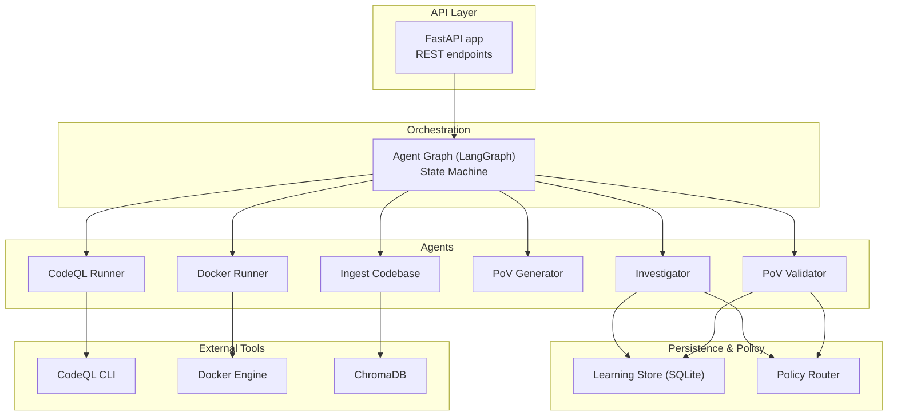
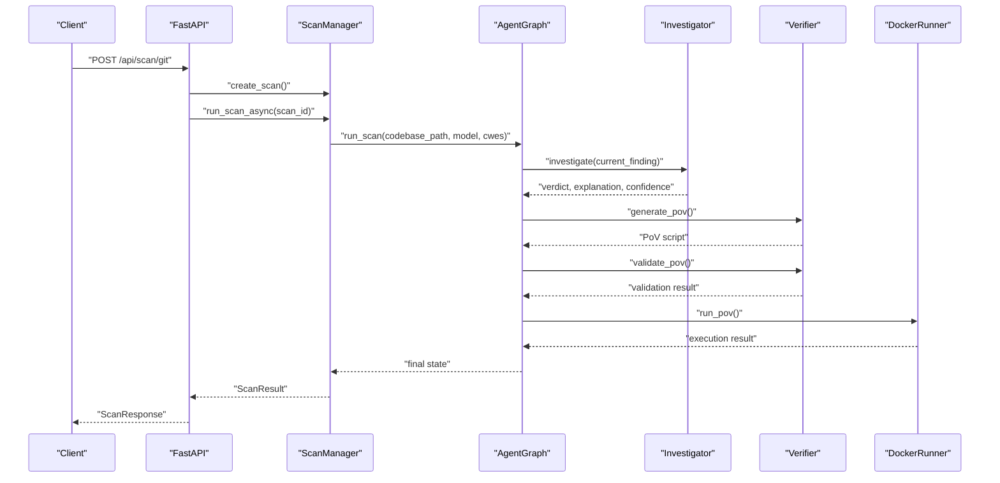
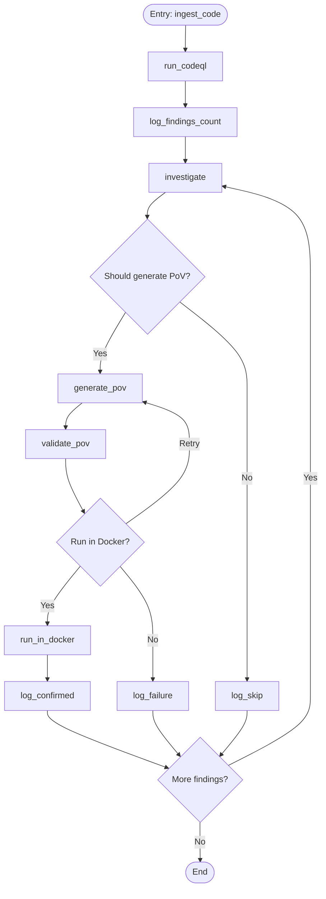
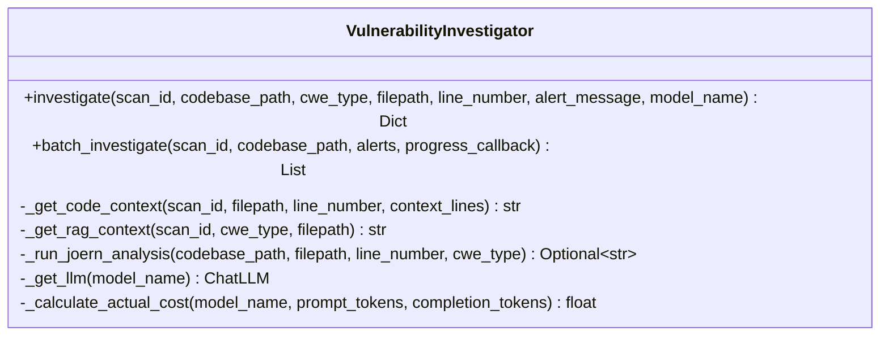
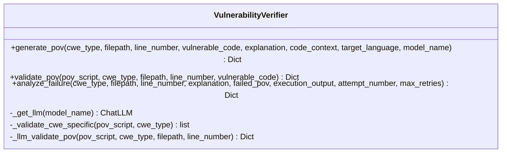
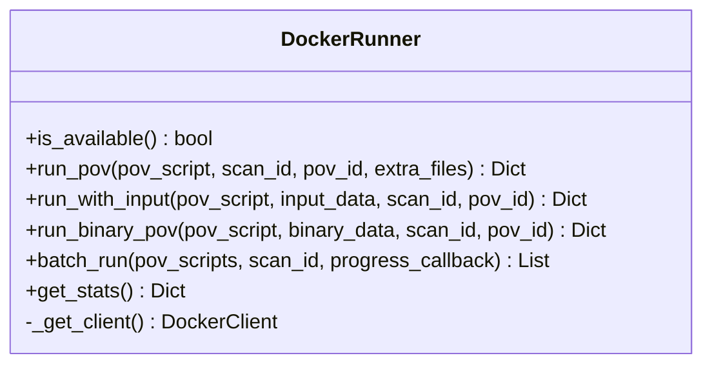
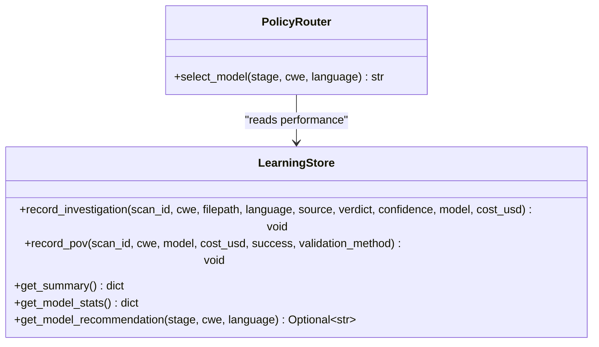
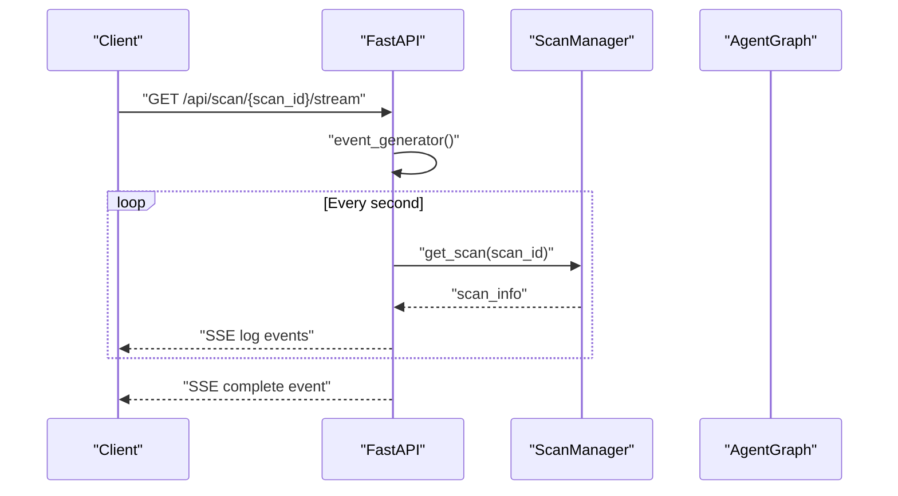
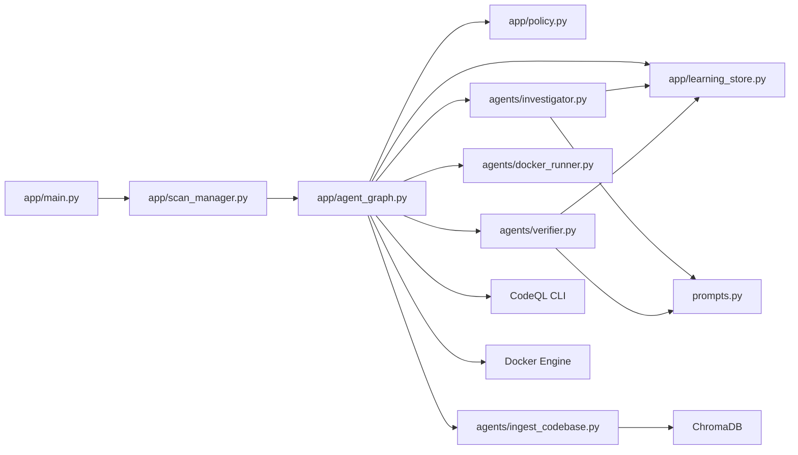

# Architecture & Design

<cite>
**Referenced Files in This Document**
- [app/main.py](file://app/main.py)
- [app/agent_graph.py](file://app/agent_graph.py)
- [app/scan_manager.py](file://app/scan_manager.py)
- [app/config.py](file://app/config.py)
- [app/policy.py](file://app/policy.py)
- [app/learning_store.py](file://app/learning_store.py)
- [agents/__init__.py](file://agents/__init__.py)
- [agents/ingest_codebase.py](file://agents/ingest_codebase.py)
- [agents/investigator.py](file://agents/investigator.py)
- [agents/verifier.py](file://agents/verifier.py)
- [agents/docker_runner.py](file://agents/docker_runner.py)
- [agents/heuristic_scout.py](file://agents/heuristic_scout.py)
- [agents/llm_scout.py](file://agents/llm_scout.py)
- [prompts.py](file://prompts.py)
</cite>

## Table of Contents
1. [Introduction](#introduction)
2. [Project Structure](#project-structure)
3. [Core Components](#core-components)
4. [Architecture Overview](#architecture-overview)
5. [Detailed Component Analysis](#detailed-component-analysis)
6. [Dependency Analysis](#dependency-analysis)
7. [Performance Considerations](#performance-considerations)
8. [Troubleshooting Guide](#troubleshooting-guide)
9. [Conclusion](#conclusion)
10. [Appendices](#appendices)

## Introduction
This document describes the architecture and design of AutoPoV, a multi-agent vulnerability research platform built around LangGraph state machines. The system orchestrates autonomous agents to detect, investigate, and validate vulnerabilities across codebases. It integrates external tools (CodeQL, Docker, ChromaDB) and a Policy Agent/Learning Store to continuously improve model routing and outcomes. The platform supports both synchronous and asynchronous execution, real-time streaming of scan logs, and a hybrid validation pipeline that combines static analysis, unit testing, and LLM-based checks.

## Project Structure
AutoPoV is organized into cohesive layers:
- API Layer: FastAPI endpoints manage scans, streaming logs, reports, and administrative tasks.
- Orchestration Layer: LangGraph-based Agent Graph defines the state machine and routing logic.
- Agent Layer: Specialized agents implement vulnerability stages (ingest, codeql, investigate, generate PoV, validate PoV, run in Docker).
- Persistence and Policy: Learning Store records outcomes; Policy Router selects models based on routing mode and learned signals.
- Configuration: Centralized settings define runtime behavior, tool availability, and resource limits.

**Diagram sources**
- [app/main.py:114-768](file://app/main.py#L114-L768)
- [app/agent_graph.py:82-169](file://app/agent_graph.py#L82-L169)
- [app/scan_manager.py:47-73](file://app/scan_manager.py#L47-L73)
- [app/policy.py:12-40](file://app/policy.py#L12-L40)
- [app/learning_store.py:14-256](file://app/learning_store.py#L14-L256)

**Section sources**
- [app/main.py:114-768](file://app/main.py#L114-L768)
- [app/agent_graph.py:82-169](file://app/agent_graph.py#L82-L169)
- [app/scan_manager.py:47-73](file://app/scan_manager.py#L47-L73)

## Core Components
- FastAPI Application: Exposes endpoints for initiating scans (Git, ZIP, paste), replaying scans, streaming logs, retrieving results, managing API keys, and administrative cleanup.
- Agent Graph (LangGraph): Defines a state machine with nodes for ingestion, CodeQL analysis, investigation, PoV generation, validation, Docker execution, and logging outcomes. Edges encode conditional routing based on context and outcomes.
- Scan Manager: Manages scan lifecycle, state, persistence, concurrency, and metrics. Bridges API and Agent Graph.
- Agents:
  - Ingest Codebase: Loads code into ChromaDB for retrieval-augmented investigation.
  - CodeQL Runner: Creates databases, executes queries, parses SARIF, and merges autonomous discovery results.
  - Investigator: Uses LLMs with RAG and optional Joern analysis to decide vulnerability veracity.
  - Verifier: Generates PoV scripts and validates them via static analysis, unit tests, and LLM fallback.
  - Docker Runner: Executes PoVs in isolated containers with strict resource limits.
  - Heuristic and LLM Scouts: Lightweight candidate discovery for autonomous exploration.
- Policy Router: Selects models for each stage based on routing mode (fixed, auto, learning).
- Learning Store: Persists investigation and PoV outcomes to drive model recommendations.

**Section sources**
- [app/main.py:204-584](file://app/main.py#L204-L584)
- [app/agent_graph.py:82-169](file://app/agent_graph.py#L82-L169)
- [app/scan_manager.py:47-115](file://app/scan_manager.py#L47-L115)
- [agents/investigator.py:37-519](file://agents/investigator.py#L37-L519)
- [agents/verifier.py:42-562](file://agents/verifier.py#L42-L562)
- [agents/docker_runner.py:27-377](file://agents/docker_runner.py#L27-L377)
- [agents/heuristic_scout.py:13-242](file://agents/heuristic_scout.py#L13-L242)
- [agents/llm_scout.py:32-208](file://agents/llm_scout.py#L32-L208)
- [app/policy.py:12-40](file://app/policy.py#L12-L40)
- [app/learning_store.py:14-256](file://app/learning_store.py#L14-L256)

## Architecture Overview
The system centers on a LangGraph state machine that orchestrates agents through a deterministic, stateful workflow. The Agent Graph transitions between nodes based on outcomes and context, enabling autonomous routing decisions. The Policy Router dynamically selects models per stage, while the Learning Store accumulates outcomes to inform future routing.

**Diagram sources**
- [app/main.py:204-401](file://app/main.py#L204-L401)
- [app/scan_manager.py:234-265](file://app/scan_manager.py#L234-L265)
- [app/agent_graph.py:691-778](file://app/agent_graph.py#L691-L778)
- [agents/investigator.py:270-433](file://agents/investigator.py#L270-L433)
- [agents/verifier.py:90-224](file://agents/verifier.py#L90-L224)
- [agents/docker_runner.py:62-192](file://agents/docker_runner.py#L62-L192)

## Detailed Component Analysis

### Agent Graph and State Machine
The Agent Graph defines a state machine with typed state for a scan and individual findings. Nodes encapsulate each vulnerability stage, and edges implement conditional routing based on outcomes and context.

**Diagram sources**
- [app/agent_graph.py:82-169](file://app/agent_graph.py#L82-L169)

Key behaviors:
- Ingestion into ChromaDB for RAG-driven investigation.
- CodeQL execution with language detection and SARIF parsing; fallback to autonomous discovery if unavailable.
- Investigation using LLMs with optional Joern CPG analysis for specific CWEs.
- Hybrid PoV validation pipeline: static analysis, unit tests, and LLM fallback.
- Docker execution with resource limits and isolation.

**Section sources**
- [app/agent_graph.py:178-307](file://app/agent_graph.py#L178-L307)
- [app/agent_graph.py:342-505](file://app/agent_graph.py#L342-L505)
- [app/agent_graph.py:506-690](file://app/agent_graph.py#L506-L690)
- [app/agent_graph.py:691-778](file://app/agent_graph.py#L691-L778)
- [app/agent_graph.py:779-867](file://app/agent_graph.py#L779-L867)

### Investigator Agent
The Investigator performs LLM-based vulnerability analysis with RAG and optional Joern CPG analysis for use-after-free. It extracts token usage and cost, formats structured JSON responses, and records outcomes to the Learning Store.

**Diagram sources**
- [agents/investigator.py:37-519](file://agents/investigator.py#L37-L519)

**Section sources**
- [agents/investigator.py:270-433](file://agents/investigator.py#L270-L433)
- [prompts.py:7-44](file://prompts.py#L7-L44)

### Verifier Agent (PoV Generation and Validation)
The Verifier generates PoV scripts and validates them using a hybrid pipeline: static analysis, unit test execution, and LLM-based validation. It records PoV outcomes to the Learning Store.

**Diagram sources**
- [agents/verifier.py:42-562](file://agents/verifier.py#L42-L562)

**Section sources**
- [agents/verifier.py:90-224](file://agents/verifier.py#L90-L224)
- [agents/verifier.py:225-388](file://agents/verifier.py#L225-L388)
- [prompts.py:46-121](file://prompts.py#L46-L121)

### Docker Runner
The Docker Runner executes PoVs in isolated containers with strict resource limits and no network access. It captures execution results and determines if the PoV triggered the vulnerability.

**Diagram sources**
- [agents/docker_runner.py:27-377](file://agents/docker_runner.py#L27-L377)

**Section sources**
- [agents/docker_runner.py:62-192](file://agents/docker_runner.py#L62-L192)
- [agents/docker_runner.py:193-310](file://agents/docker_runner.py#L193-L310)

### Policy Router and Learning Store
The Policy Router selects models for each stage based on routing mode (fixed, auto, learning). The Learning Store persists outcomes and computes model performance statistics to guide recommendations.

**Diagram sources**
- [app/policy.py:12-40](file://app/policy.py#L12-L40)
- [app/learning_store.py:14-256](file://app/learning_store.py#L14-L256)

**Section sources**
- [app/policy.py:18-32](file://app/policy.py#L18-L32)
- [app/learning_store.py:61-124](file://app/learning_store.py#L61-L124)
- [app/learning_store.py:188-248](file://app/learning_store.py#L188-L248)

### API and Real-Time Streaming
The API exposes endpoints for initiating scans, replaying results, retrieving history, and streaming logs via Server-Sent Events. It integrates with Scan Manager and Agent Graph to orchestrate workloads.

**Diagram sources**
- [app/main.py:548-584](file://app/main.py#L548-L584)
- [app/scan_manager.py:419-494](file://app/scan_manager.py#L419-L494)

**Section sources**
- [app/main.py:204-401](file://app/main.py#L204-L401)
- [app/main.py:548-584](file://app/main.py#L548-L584)

## Dependency Analysis
The system exhibits clear separation of concerns:
- API depends on Scan Manager and Agent Graph.
- Agent Graph depends on Policy Router, Learning Store, and agents.
- Agents depend on external tools (CodeQL, Docker) and internal stores (ChromaDB, SQLite).
- Configuration centralizes environment-dependent behavior.

**Diagram sources**
- [app/main.py:13-28](file://app/main.py#L13-L28)
- [app/agent_graph.py:19-29](file://app/agent_graph.py#L19-L29)
- [agents/investigator.py:27-29](file://agents/investigator.py#L27-L29)
- [agents/verifier.py:27-33](file://agents/verifier.py#L27-L33)

**Section sources**
- [app/main.py:13-28](file://app/main.py#L13-L28)
- [app/agent_graph.py:19-29](file://app/agent_graph.py#L19-L29)
- [agents/__init__.py:6-20](file://agents/__init__.py#L6-L20)

## Performance Considerations
- Concurrency: Scan Manager uses a thread pool executor to run scans synchronously within an async loop, balancing CPU-bound tasks and I/O.
- Cost Control: Configurable caps on LLM usage and costs; token usage extraction enables accurate billing.
- Tool Availability: Graceful fallbacks when CodeQL or Docker are unavailable; autonomous discovery ensures continuity.
- Memory and CPU Limits: Docker Runner enforces strict resource limits to prevent resource exhaustion.
- Vector Store Efficiency: ChromaDB ingestion and retrieval optimized for RAG context; cleanup after scans reduces overhead.

[No sources needed since this section provides general guidance]

## Troubleshooting Guide
Common issues and resolutions:
- CodeQL not available: The Agent Graph falls back to autonomous discovery and LLM-only analysis.
- Docker not available: PoV validation skips container execution; results indicate Docker unavailability.
- LLM model selection failures: Policy Router defaults to auto router when learning store has no recommendation.
- Streaming logs: Ensure SSE endpoint is polled and that Scan Manager maintains logs until completion.
- Cost tracking: Verify token usage extraction and pricing calculations; adjust model mode and cost caps accordingly.

**Section sources**
- [app/agent_graph.py:256-300](file://app/agent_graph.py#L256-L300)
- [agents/docker_runner.py:81-91](file://agents/docker_runner.py#L81-L91)
- [app/policy.py:24-29](file://app/policy.py#L24-L29)
- [app/scan_manager.py:419-494](file://app/scan_manager.py#L419-L494)

## Conclusion
AutoPoV’s architecture leverages LangGraph to orchestrate a robust, stateful, and autonomous vulnerability research workflow. By combining CodeQL, LLMs, and hybrid validation, it achieves high-confidence detection and reproducible PoVs. The Policy Router and Learning Store enable continuous improvement, while the API and streaming mechanisms provide operational visibility and scalability.

[No sources needed since this section summarizes without analyzing specific files]

## Appendices

### Technology Stack Choices and Trade-offs
- LangGraph: Enables declarative state machines and conditional routing; trade-off is increased abstraction complexity.
- ChromaDB: Provides efficient RAG for investigation; trade-off is dependency on persistent vector storage.
- CodeQL: Strong static analysis coverage; trade-off is tool availability and query compilation time.
- Docker: Ensures reproducibility and safety; trade-off is resource overhead and dependency on container runtime.
- LLMs (Online/Offline): Flexibility in deployment; trade-off is cost and latency; token usage tracking mitigates risk.
- SQLite Learning Store: Lightweight persistence; trade-off is limited concurrent writes compared to distributed systems.

**Section sources**
- [app/config.py:162-232](file://app/config.py#L162-L232)
- [app/learning_store.py:14-256](file://app/learning_store.py#L14-L256)