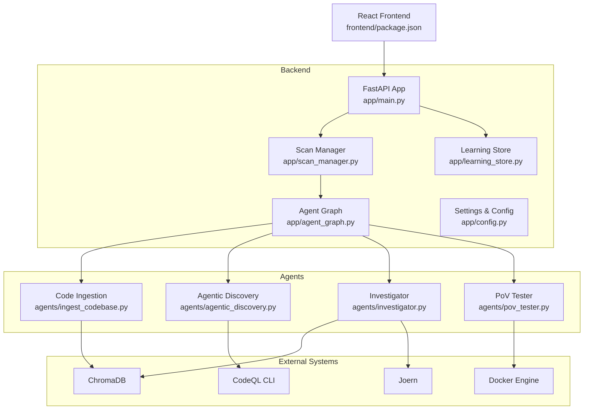
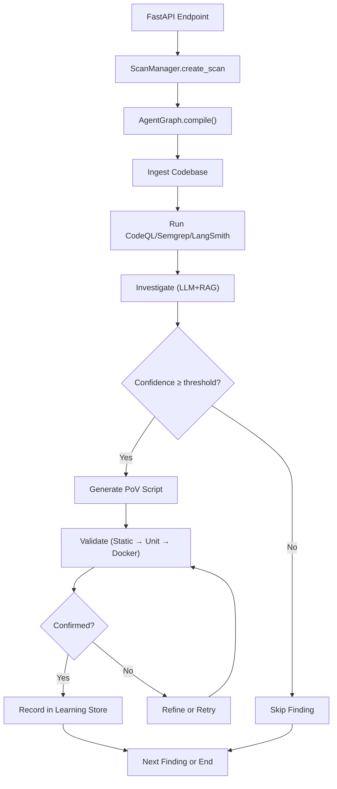
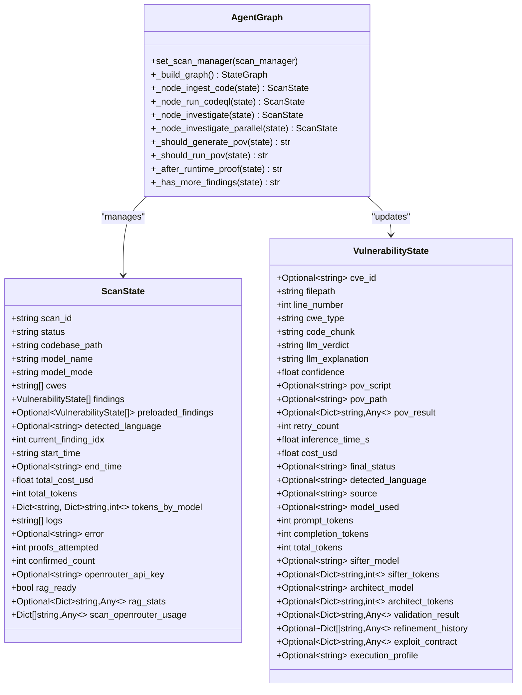
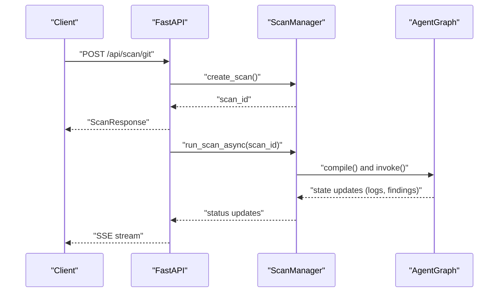
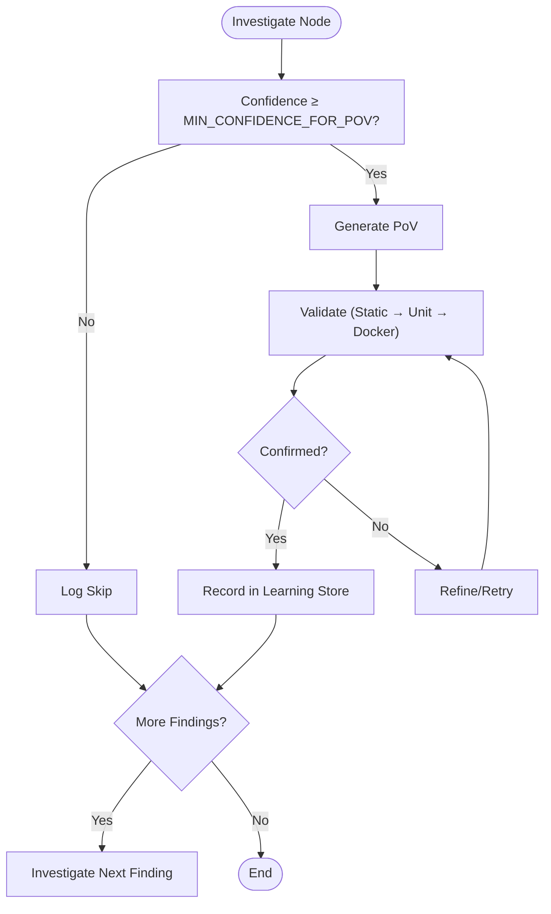
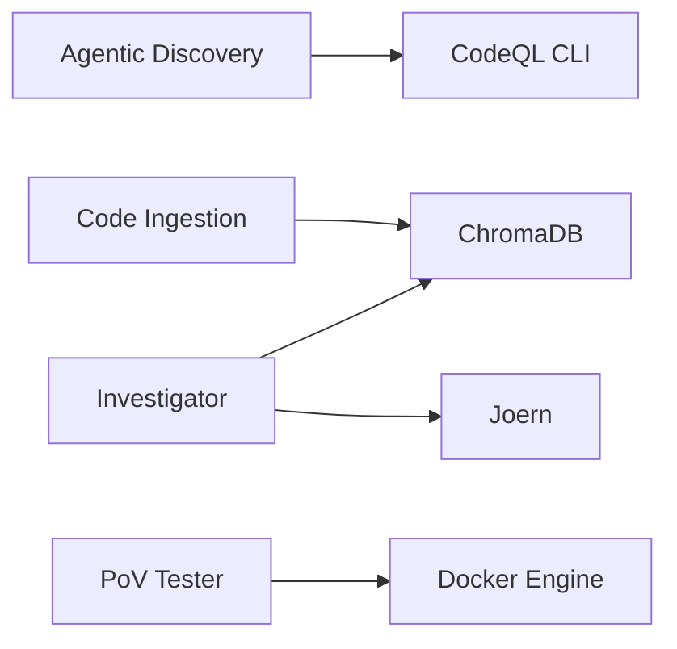
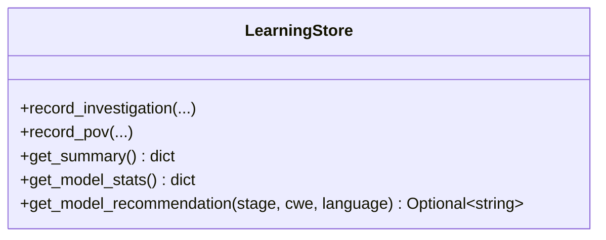
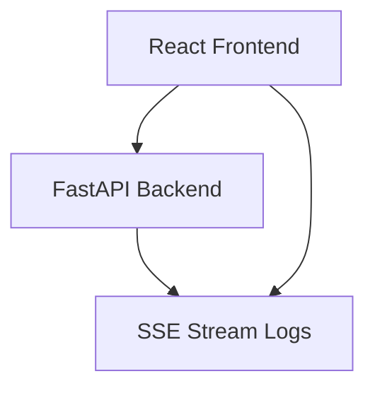
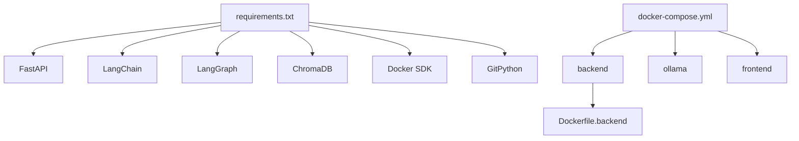
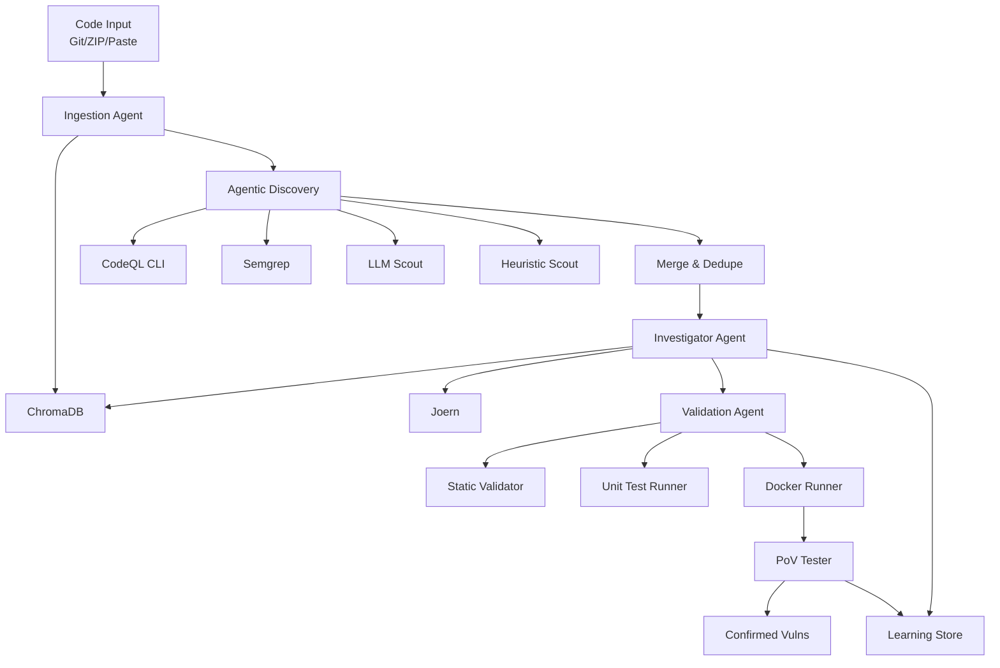

# Architecture & Design

<cite>
**Referenced Files in This Document**
- [README.md](file://README.md)
- [app/main.py](file://app/main.py)
- [app/agent_graph.py](file://app/agent_graph.py)
- [app/scan_manager.py](file://app/scan_manager.py)
- [app/config.py](file://app/config.py)
- [app/learning_store.py](file://app/learning_store.py)
- [agents/__init__.py](file://agents/__init__.py)
- [agents/ingest_codebase.py](file://agents/ingest_codebase.py)
- [agents/agentic_discovery.py](file://agents/agentic_discovery.py)
- [agents/investigator.py](file://agents/investigator.py)
- [agents/pov_tester.py](file://agents/pov_tester.py)
- [Dockerfile.backend](file://Dockerfile.backend)
- [docker-compose.yml](file://docker-compose.yml)
- [requirements.txt](file://requirements.txt)
- [frontend/package.json](file://frontend/package.json)
</cite>

## Table of Contents
1. [Introduction](#introduction)
2. [Project Structure](#project-structure)
3. [Core Components](#core-components)
4. [Architecture Overview](#architecture-overview)
5. [Detailed Component Analysis](#detailed-component-analysis)
6. [Dependency Analysis](#dependency-analysis)
7. [Performance Considerations](#performance-considerations)
8. [Troubleshooting Guide](#troubleshooting-guide)
9. [Conclusion](#conclusion)
10. [Appendices](#appendices)

## Introduction
This document describes the high-level architecture and design of AutoPoV, an autonomous, agentic system for discovering, investigating, generating, and validating exploitable vulnerabilities. The system is built around a LangGraph-based agent orchestration engine, stateful workflow management, and conditional routing. It integrates external tools (CodeQL, Docker, ChromaDB, Joern), a learning store for self-improvement, and a FastAPI backend with real-time streaming and robust security controls. The document also covers infrastructure requirements, system context diagrams, cross-cutting concerns (security, monitoring, scalability), and the technology stack.

## Project Structure
AutoPoV is organized into three primary layers:
- Backend API and Orchestration: FastAPI application, agent graph, scan lifecycle, configuration, and learning store.
- Agents: Specialized modules implementing discovery, investigation, exploit generation, validation, and runtime execution.
- Frontend: React-based web UI communicating with the backend via REST and Server-Sent Events (SSE).

**Diagram sources**
- [app/main.py:165-212](file://app/main.py#L165-L212)
- [app/agent_graph.py:137-229](file://app/agent_graph.py#L137-L229)
- [app/scan_manager.py:58-133](file://app/scan_manager.py#L58-L133)
- [app/config.py:14-342](file://app/config.py#L14-L342)
- [app/learning_store.py:14-200](file://app/learning_store.py#L14-L200)
- [agents/ingest_codebase.py:107-200](file://agents/ingest_codebase.py#L107-L200)
- [agents/agentic_discovery.py:50-200](file://agents/agentic_discovery.py#L50-L200)
- [agents/investigator.py:38-200](file://agents/investigator.py#L38-L200)
- [agents/pov_tester.py:18-200](file://agents/pov_tester.py#L18-L200)
- [frontend/package.json:1-34](file://frontend/package.json#L1-L34)

**Section sources**
- [README.md:89-124](file://README.md#L89-L124)
- [app/main.py:165-212](file://app/main.py#L165-L212)
- [app/agent_graph.py:137-229](file://app/agent_graph.py#L137-L229)
- [app/scan_manager.py:58-133](file://app/scan_manager.py#L58-L133)
- [app/config.py:14-342](file://app/config.py#L14-L342)
- [app/learning_store.py:14-200](file://app/learning_store.py#L14-L200)
- [agents/ingest_codebase.py:107-200](file://agents/ingest_codebase.py#L107-L200)
- [agents/agentic_discovery.py:50-200](file://agents/agentic_discovery.py#L50-L200)
- [agents/investigator.py:38-200](file://agents/investigator.py#L38-L200)
- [agents/pov_tester.py:18-200](file://agents/pov_tester.py#L18-L200)
- [frontend/package.json:1-34](file://frontend/package.json#L1-L34)

## Core Components
- FastAPI Backend: Provides REST endpoints for scan initiation, status, streaming logs, replay, cancellation, and administrative operations. Implements CORS, CSRF protection, and rate-limited authentication.
- Agent Graph (LangGraph): Defines a stateful workflow with nodes for ingestion, discovery, investigation, exploit generation, validation, and runtime execution. Conditional edges route based on confidence thresholds, validation outcomes, and retry policies.
- Scan Manager: Manages scan lifecycle, persistence, concurrency, and background execution. Maintains active scans, snapshots, and results.
- Configuration: Centralized settings for models, tools, storage, parallelism, and safety controls.
- Learning Store: SQLite-backed persistence for agent outcomes enabling adaptive model routing and self-improvement.
- Agents:
  - Code Ingestion: Chunks code, computes embeddings, and persists to ChromaDB.
  - Agentic Discovery: Integrates CodeQL, Semgrep, LLM scouts, and heuristics with language profiling and triage.
  - Investigator: LLM + RAG analysis to classify findings as REAL or FALSE_POSITIVE with confidence.
  - PoV Tester: Executes generated exploits in targeted harnesses or containers to confirm exploitability.
- Infrastructure: Docker Compose for backend, Ollama, and frontend; Dockerfile.backend installs CodeQL and Docker CLI.

**Section sources**
- [app/main.py:257-286](file://app/main.py#L257-L286)
- [app/agent_graph.py:111-229](file://app/agent_graph.py#L111-L229)
- [app/scan_manager.py:58-133](file://app/scan_manager.py#L58-L133)
- [app/config.py:14-342](file://app/config.py#L14-L342)
- [app/learning_store.py:14-200](file://app/learning_store.py#L14-L200)
- [agents/ingest_codebase.py:107-200](file://agents/ingest_codebase.py#L107-L200)
- [agents/agentic_discovery.py:50-200](file://agents/agentic_discovery.py#L50-L200)
- [agents/investigator.py:38-200](file://agents/investigator.py#L38-L200)
- [agents/pov_tester.py:18-200](file://agents/pov_tester.py#L18-L200)
- [Dockerfile.backend:1-80](file://Dockerfile.backend#L1-L80)
- [docker-compose.yml:1-66](file://docker-compose.yml#L1-L66)

## Architecture Overview
The system follows a stateful, agent-centric architecture:
- Stateful Orchestration: LangGraph maintains ScanState and VulnerabilityState across nodes, enabling persistent context and deterministic routing.
- Conditional Routing: Edges evaluate confidence, validation results, and retry counts to decide next steps.
- Tool Integration: Agents invoke CodeQL, ChromaDB, Docker, and Joern depending on language and exploitability.
- Persistence and Adaptation: Learning Store records outcomes to improve model selection and routing over time.

**Diagram sources**
- [app/agent_graph.py:137-229](file://app/agent_graph.py#L137-L229)
- [app/scan_manager.py:58-133](file://app/scan_manager.py#L58-L133)
- [app/learning_store.py:14-200](file://app/learning_store.py#L14-L200)

## Detailed Component Analysis

### LangGraph-Based Agent Orchestration
- State Types: ScanState and VulnerabilityState encapsulate scan-wide and per-finding context, including tokens, costs, logs, and validation history.
- Nodes: Ingestion, discovery, investigation, PoV generation, validation, refinement, runtime execution, and logging nodes.
- Conditional Edges: Route based on confidence thresholds, validation outcomes, and retry limits.
- Parallel Investigation: Optional batch processing of findings to accelerate throughput.

**Diagram sources**
- [app/agent_graph.py:45-110](file://app/agent_graph.py#L45-L110)
- [app/agent_graph.py:111-229](file://app/agent_graph.py#L111-L229)

**Section sources**
- [app/agent_graph.py:45-110](file://app/agent_graph.py#L45-L110)
- [app/agent_graph.py:111-229](file://app/agent_graph.py#L111-L229)

### Stateful Workflow Management
- Scan Lifecycle: Creation, persistence, background execution, cancellation, and result serialization.
- Concurrency: Thread-safe logs and locks per scan; background tasks for long-running operations.
- Snapshots: Active scans persisted to disk to recover from backend restarts.

**Diagram sources**
- [app/main.py:289-371](file://app/main.py#L289-L371)
- [app/scan_manager.py:58-133](file://app/scan_manager.py#L58-L133)
- [app/agent_graph.py:137-229](file://app/agent_graph.py#L137-L229)

**Section sources**
- [app/scan_manager.py:58-133](file://app/scan_manager.py#L58-L133)
- [app/main.py:289-371](file://app/main.py#L289-L371)

### Conditional Routing Mechanisms
- Confidence Threshold: Findings below a configurable threshold are skipped.
- Validation Outcomes: Confirmed vs. failed/expired findings drive routing to refinement or termination.
- Retry Policy: Controlled retries with refinement loops.

**Diagram sources**
- [app/agent_graph.py:164-227](file://app/agent_graph.py#L164-L227)
- [app/config.py:134-139](file://app/config.py#L134-L139)

**Section sources**
- [app/agent_graph.py:164-227](file://app/agent_graph.py#L164-L227)
- [app/config.py:134-139](file://app/config.py#L134-L139)

### External Tool Integration
- CodeQL: Discovery and analysis orchestrated via agentic discovery with language-specific suites and fallbacks.
- ChromaDB: Persistent vector store for semantic search; ingestion supports online and offline embeddings.
- Docker: Sandboxed execution of PoV scripts; configurable timeouts and resource limits.
- Joern: Optional CPG analysis for native memory safety issues.

**Diagram sources**
- [agents/agentic_discovery.py:50-200](file://agents/agentic_discovery.py#L50-L200)
- [agents/ingest_codebase.py:107-200](file://agents/ingest_codebase.py#L107-L200)
- [agents/investigator.py:38-200](file://agents/investigator.py#L38-L200)
- [agents/pov_tester.py:18-200](file://agents/pov_tester.py#L18-L200)

**Section sources**
- [agents/agentic_discovery.py:50-200](file://agents/agentic_discovery.py#L50-L200)
- [agents/ingest_codebase.py:107-200](file://agents/ingest_codebase.py#L107-L200)
- [agents/investigator.py:38-200](file://agents/investigator.py#L38-L200)
- [agents/pov_tester.py:18-200](file://agents/pov_tester.py#L18-L200)

### Learning Store and Adaptive Routing
- Persistence: Records investigation outcomes and PoV runs with timestamps and costs.
- Analytics: Aggregates model performance and suggests model recommendations per stage and context.
- Feedback Loop: Improves routing decisions over time.

**Diagram sources**
- [app/learning_store.py:14-200](file://app/learning_store.py#L14-L200)

**Section sources**
- [app/learning_store.py:14-200](file://app/learning_store.py#L14-L200)

### Frontend and Real-Time Streaming
- Technology Stack: React, Vite, Tailwind, Axios, Recharts.
- Communication: REST APIs and SSE for live logs and progress updates.
- Pages: Dashboard, scan management, metrics, settings, and results.

**Diagram sources**
- [frontend/package.json:1-34](file://frontend/package.json#L1-L34)
- [app/main.py:769-806](file://app/main.py#L769-L806)

**Section sources**
- [frontend/package.json:1-34](file://frontend/package.json#L1-L34)
- [app/main.py:769-806](file://app/main.py#L769-L806)

## Dependency Analysis
- Backend Dependencies: FastAPI, LangChain, LangGraph, ChromaDB, Docker SDK, GitPython, OpenRouter client, and others.
- Containerization: Docker Compose provisions backend, Ollama, and frontend; volumes persist ChromaDB and results.
- Tool Availability: Runtime checks for Docker, CodeQL, and Joern; environment-driven configuration.

**Diagram sources**
- [requirements.txt:1-47](file://requirements.txt#L1-L47)
- [docker-compose.yml:1-66](file://docker-compose.yml#L1-L66)
- [Dockerfile.backend:1-80](file://Dockerfile.backend#L1-L80)

**Section sources**
- [requirements.txt:1-47](file://requirements.txt#L1-L47)
- [docker-compose.yml:1-66](file://docker-compose.yml#L1-L66)
- [Dockerfile.backend:1-80](file://Dockerfile.backend#L1-L80)

## Performance Considerations
- Parallel Processing: Batch findings for investigation to reduce latency; tune worker count and rate limits.
- Early Termination: Stop after a configurable number of confirmed findings to cap cost and time.
- Chunking and Embeddings: Tune chunk size and overlap; prefer local embeddings for offline resilience.
- Resource Limits: Configure Docker CPU/memory limits and timeouts; enforce per-request LLM timeouts.
- Caching: Utilize analysis cache and prompt cache to reduce repeated work.

[No sources needed since this section provides general guidance]

## Troubleshooting Guide
- Health Checks: Use the health endpoint to verify Docker, CodeQL, and Joern availability.
- Authentication: Ensure admin and API keys are configured; verify rate-limiting behavior.
- Logs: Subscribe to SSE streams for real-time diagnostics; inspect persisted scan snapshots.
- Tool Availability: Confirm Docker, CodeQL, and Joern binaries; adjust paths and timeouts in settings.
- Storage: Verify persistent volumes for ChromaDB and results; ensure adequate disk space.

**Section sources**
- [app/main.py:257-267](file://app/main.py#L257-L267)
- [app/config.py:201-249](file://app/config.py#L201-L249)
- [app/scan_manager.py:175-197](file://app/scan_manager.py#L175-L197)

## Conclusion
AutoPoV’s architecture centers on a stateful, conditional agent graph orchestrated by LangGraph, integrated with external tools and a learning store for continuous improvement. The FastAPI backend provides secure, scalable APIs with real-time streaming and robust lifecycle management. Infrastructure is containerized for ease of deployment, while configuration enables flexible model and tool choices. Together, these design choices enable autonomous, reproducible, and benchmarkable vulnerability research.

[No sources needed since this section summarizes without analyzing specific files]

## Appendices

### System Context Diagram: From Code Ingestion to Exploit Validation

**Diagram sources**
- [README.md:34-69](file://README.md#L34-L69)
- [agents/agentic_discovery.py:50-200](file://agents/agentic_discovery.py#L50-L200)
- [agents/ingest_codebase.py:107-200](file://agents/ingest_codebase.py#L107-L200)
- [agents/investigator.py:38-200](file://agents/investigator.py#L38-L200)
- [agents/pov_tester.py:18-200](file://agents/pov_tester.py#L18-L200)
- [app/learning_store.py:14-200](file://app/learning_store.py#L14-L200)

### Infrastructure Requirements
- Backend: Python 3.11+, FastAPI, LangChain, LangGraph, ChromaDB, Docker SDK, GitPython.
- Tools: Docker Desktop, CodeQL CLI, optional Joern.
- Frontend: Node.js 20+, Vite, React, Tailwind.
- Deployment: Docker Compose with persistent volumes for ChromaDB and results.

**Section sources**
- [README.md:130-140](file://README.md#L130-L140)
- [requirements.txt:1-47](file://requirements.txt#L1-L47)
- [docker-compose.yml:1-66](file://docker-compose.yml#L1-L66)
- [Dockerfile.backend:1-80](file://Dockerfile.backend#L1-L80)

### Cross-Cutting Concerns
- Security: Two-tier authentication (Admin Key, API Key), rate limiting, CSRF protection, and optional sandboxing via Docker.
- Monitoring: Real-time SSE logs, LangSmith tracing, and metrics endpoints.
- Scalability: Parallel investigation, early termination, and configurable resource limits.

**Section sources**
- [app/main.py:196-212](file://app/main.py#L196-L212)
- [app/config.py:127-131](file://app/config.py#L127-L131)
- [app/config.py:133-139](file://app/config.py#L133-L139)