# Data Flow & State Management

<cite>
**Referenced Files in This Document**
- [agent_graph.py](file://app/agent_graph.py)
- [scan_manager.py](file://app/scan_manager.py)
- [config.py](file://app/config.py)
- [learning_store.py](file://app/learning_store.py)
- [prompts.py](file://prompts.py)
- [investigator.py](file://agents/investigator.py)
- [verifier.py](file://agents/verifier.py)
- [docker_runner.py](file://agents/docker_runner.py)
- [static_validator.py](file://agents/static_validator.py)
- [unit_test_runner.py](file://agents/unit_test_runner.py)
- [heuristic_scout.py](file://agents/heuristic_scout.py)
</cite>

## Table of Contents
1. [Introduction](#introduction)
2. [Project Structure](#project-structure)
3. [Core Components](#core-components)
4. [Architecture Overview](#architecture-overview)
5. [Detailed Component Analysis](#detailed-component-analysis)
6. [Dependency Analysis](#dependency-analysis)
7. [Performance Considerations](#performance-considerations)
8. [Troubleshooting Guide](#troubleshooting-guide)
9. [Conclusion](#conclusion)

## Introduction
This document explains AutoPoV’s data flow architecture and state management patterns. It focuses on the ScanState and VulnerabilityState typed dictionaries that define the vulnerability research workflow, the agent graph lifecycle, confidence scoring, cost tracking, performance metrics, logging and monitoring, serialization for persistence, error handling, state transformations, validation rules, and memory management strategies for large codebases.

## Project Structure
AutoPoV organizes vulnerability detection as a LangGraph-based workflow with modular agents:
- Workflow orchestration and state: app/agent_graph.py
- Lifecycle management and persistence: app/scan_manager.py
- Configuration and cost/capacity limits: app/config.py
- Learning store for model routing and metrics: app/learning_store.py
- LLM prompts for investigation and PoV: prompts.py
- Agents: investigator, verifier, docker_runner, static_validator, unit_test_runner, heuristic_scout

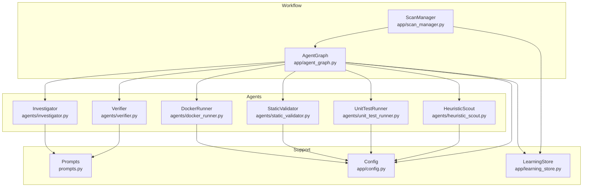

**Diagram sources**
- [agent_graph.py:82-168](file://app/agent_graph.py#L82-L168)
- [scan_manager.py:47-114](file://app/scan_manager.py#L47-L114)
- [config.py:13-255](file://app/config.py#L13-L255)
- [learning_store.py:14-124](file://app/learning_store.py#L14-L124)
- [prompts.py:7-424](file://prompts.py#L7-L424)
- [investigator.py:37-104](file://agents/investigator.py#L37-L104)
- [verifier.py:42-88](file://agents/verifier.py#L42-L88)
- [docker_runner.py:27-48](file://agents/docker_runner.py#L27-L48)
- [static_validator.py:22-122](file://agents/static_validator.py#L22-L122)
- [unit_test_runner.py:28-52](file://agents/unit_test_runner.py#L28-L52)
- [heuristic_scout.py:13-50](file://agents/heuristic_scout.py#L13-L50)

**Section sources**
- [agent_graph.py:82-168](file://app/agent_graph.py#L82-L168)
- [scan_manager.py:47-114](file://app/scan_manager.py#L47-L114)
- [config.py:13-255](file://app/config.py#L13-L255)

## Core Components
- ScanState: Typed dictionary representing the entire scan lifecycle, including status, findings, cost, logs, and timing.
- VulnerabilityState: Typed dictionary representing a single finding with LLM verdict, confidence, PoV artifacts, and validation results.

Key fields and roles:
- ScanState: scan_id, status, codebase_path, model_name, cwes, findings, preloaded_findings, detected_language, current_finding_idx, start_time, end_time, total_cost_usd, logs, error.
- VulnerabilityState: cve_id, filepath, line_number, cwe_type, code_chunk, llm_verdict, llm_explanation, confidence, pov_script, pov_path, pov_result, retry_count, inference_time_s, cost_usd, final_status.

State mutations occur through agent nodes that update fields like llm_verdict, confidence, cost_usd, inference_time_s, and final_status, while maintaining logs and total_cost_usd.

**Section sources**
- [agent_graph.py:45-81](file://app/agent_graph.py#L45-L81)

## Architecture Overview
AutoPoV uses LangGraph to orchestrate a vulnerability detection pipeline:
- Ingest codebase into vector store
- Run CodeQL or heuristic/LLM-based discovery
- Investigate findings with LLM and RAG
- Generate and validate PoV scripts
- Optionally run PoV in Docker
- Persist results and metrics

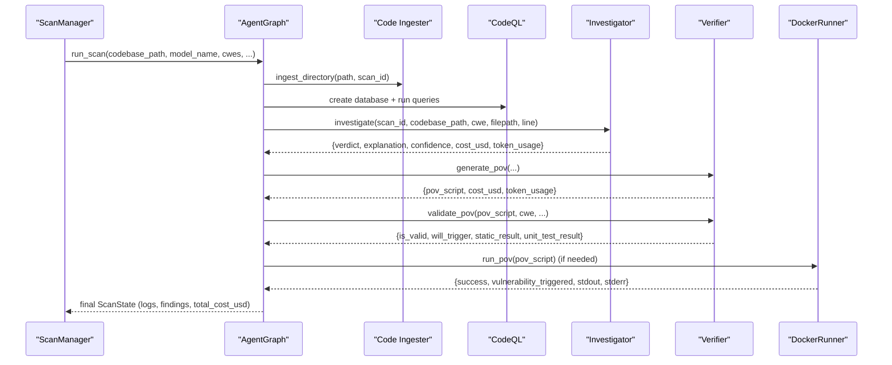

**Diagram sources**
- [agent_graph.py:1146-1192](file://app/agent_graph.py#L1146-L1192)
- [scan_manager.py:266-366](file://app/scan_manager.py#L266-L366)
- [investigator.py:270-432](file://agents/investigator.py#L270-L432)
- [verifier.py:90-223](file://agents/verifier.py#L90-L223)
- [docker_runner.py:62-191](file://agents/docker_runner.py#L62-L191)

## Detailed Component Analysis

### Typed State Models
- ScanState: Central orchestrator state with lifecycle, metrics, and findings list.
- VulnerabilityState: Per-finding state capturing LLM analysis, PoV generation/validation, and execution results.

State mutation patterns:
- Investigation node writes llm_verdict, llm_explanation, confidence, code_chunk, inference_time_s, cost_usd, token_usage.
- PoV generation node writes pov_script, model_used, cost_usd.
- Validation node writes validation_result, static_result, unit_test_result, retry_count.
- Execution node writes pov_result and final_status.

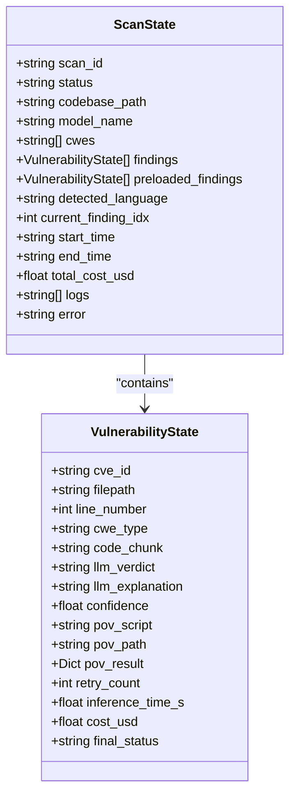

**Diagram sources**
- [agent_graph.py:45-81](file://app/agent_graph.py#L45-L81)

**Section sources**
- [agent_graph.py:45-81](file://app/agent_graph.py#L45-L81)

### Confidence Scoring System
Confidence is derived from LLM responses and used to gate PoV generation:
- CodeQL findings initialized with high confidence (e.g., 0.8).
- Heuristic-only findings initialized with moderate confidence (e.g., 0.35).
- LLM investigation returns a numeric confidence in [0.0, 1.0].
Decision thresholds:
- Generate PoV only when llm_verdict == "REAL" and confidence >= 0.7.
- Validation uses static_result confidence; if >= 0.8, PoV is accepted without Docker execution.

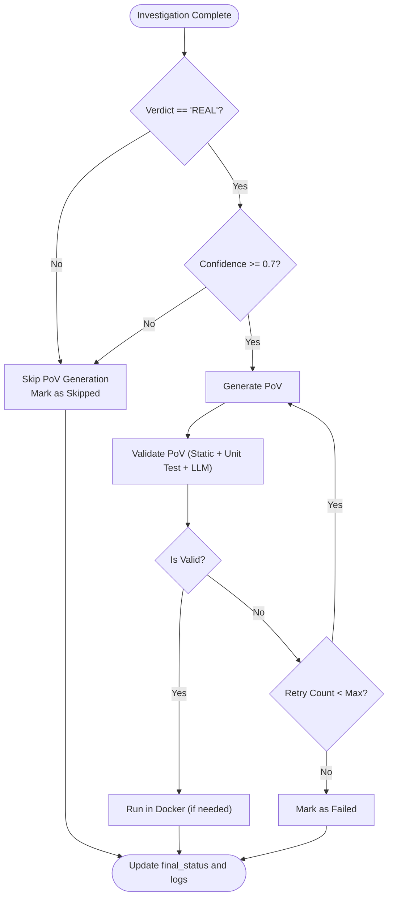

**Diagram sources**
- [agent_graph.py:1059-1093](file://app/agent_graph.py#L1059-L1093)
- [verifier.py:225-387](file://agents/verifier.py#L225-L387)

**Section sources**
- [agent_graph.py:577-594](file://app/agent_graph.py#L577-L594)
- [agent_graph.py:670-682](file://app/agent_graph.py#L670-L682)
- [agent_graph.py:1059-1093](file://app/agent_graph.py#L1059-L1093)
- [verifier.py:225-387](file://agents/verifier.py#L225-L387)

### Cost Tracking and Token Usage
- Actual cost extraction: Investigator and Verifier extract token_usage from LLM responses and compute USD cost using provider pricing.
- Fallback cost estimation is deprecated and avoided in favor of token-based accounting.
- ScanState.total_cost_usd accumulates per-finding costs.

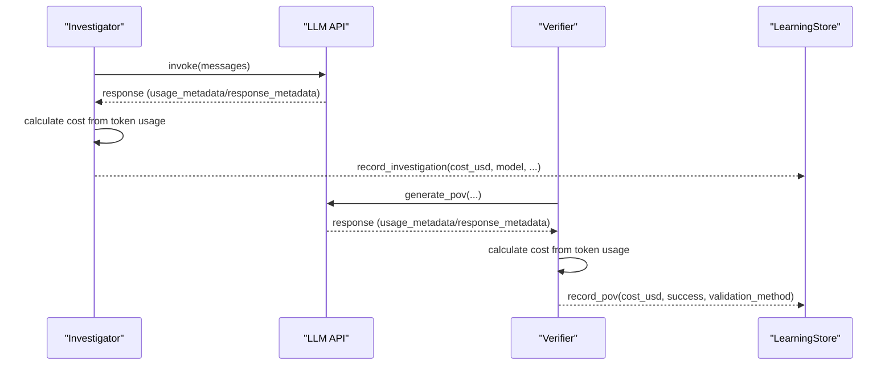

**Diagram sources**
- [investigator.py:333-414](file://agents/investigator.py#L333-L414)
- [verifier.py:147-211](file://agents/verifier.py#L147-L211)
- [learning_store.py:61-123](file://app/learning_store.py#L61-L123)

**Section sources**
- [investigator.py:333-414](file://agents/investigator.py#L333-L414)
- [verifier.py:147-211](file://agents/verifier.py#L147-L211)
- [learning_store.py:61-123](file://app/learning_store.py#L61-L123)

### Logging and Monitoring
- Real-time logging: AgentGraph._log appends timestamped entries to state["logs"] and streams to ScanManager via thread-safe append_log.
- ScanManager maintains per-scan logs, supports retrieval, and persists results to JSON and CSV.
- Metrics aggregation: ScanManager.get_metrics computes totals, counts, and averages.

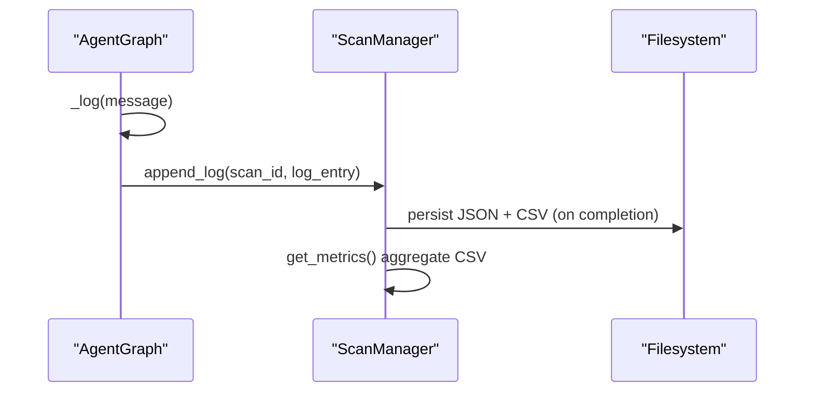

**Diagram sources**
- [agent_graph.py:1111-1130](file://app/agent_graph.py#L1111-L1130)
- [scan_manager.py:423-447](file://app/scan_manager.py#L423-L447)
- [scan_manager.py:367-401](file://app/scan_manager.py#L367-L401)
- [scan_manager.py:604-653](file://app/scan_manager.py#L604-L653)

**Section sources**
- [agent_graph.py:1111-1130](file://app/agent_graph.py#L1111-L1130)
- [scan_manager.py:423-447](file://app/scan_manager.py#L423-L447)
- [scan_manager.py:367-401](file://app/scan_manager.py#L367-L401)
- [scan_manager.py:604-653](file://app/scan_manager.py#L604-L653)

### Data Serialization and Persistence
- JSON persistence: ScanManager saves ScanResult to results/runs/<scan_id>.json with CSV audit trail in scan_history.csv.
- Snapshots: Optional codebase snapshots for replay support.
- LearningStore: SQLite-backed persistence of investigation and PoV run outcomes for model routing.

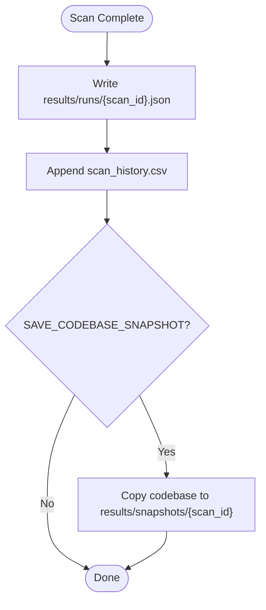

**Diagram sources**
- [scan_manager.py:367-418](file://app/scan_manager.py#L367-L418)
- [config.py:144-145](file://app/config.py#L144-L145)

**Section sources**
- [scan_manager.py:367-418](file://app/scan_manager.py#L367-L418)
- [config.py:144-145](file://app/config.py#L144-L145)

### Error Handling and State Consistency
- Non-fatal ingestion failures: AgentGraph continues without vector store context.
- CodeQL failures: Fall back to LLM-only analysis and heuristic discovery.
- Investigation exceptions: Default result with UNKNOWN verdict and recorded error context.
- Validation failures: Increment retry_count; eventually mark as failed.
- Docker unavailability: Return structured result indicating Docker not available.
- Cleanup: CodeQL database removed after queries; temporary directories cleaned.

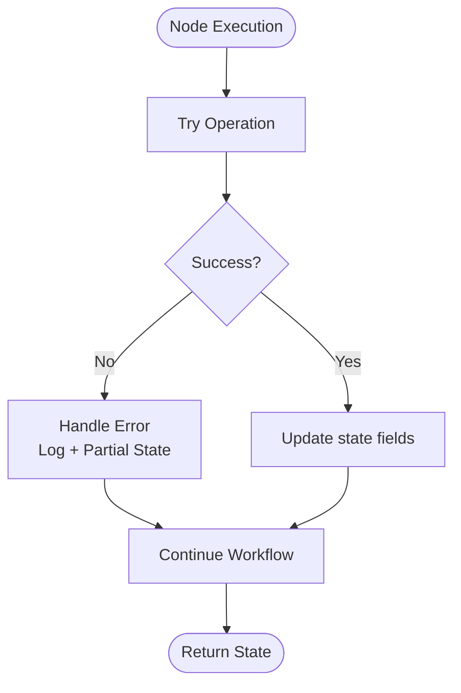

**Diagram sources**
- [agent_graph.py:199-203](file://app/agent_graph.py#L199-L203)
- [agent_graph.py:293-299](file://app/agent_graph.py#L293-L299)
- [investigator.py:416-432](file://agents/investigator.py#L416-L432)
- [verifier.py:213-223](file://agents/verifier.py#L213-L223)
- [docker_runner.py:81-90](file://agents/docker_runner.py#L81-L90)

**Section sources**
- [agent_graph.py:199-203](file://app/agent_graph.py#L199-L203)
- [agent_graph.py:293-299](file://app/agent_graph.py#L293-L299)
- [investigator.py:416-432](file://agents/investigator.py#L416-L432)
- [verifier.py:213-223](file://agents/verifier.py#L213-L223)
- [docker_runner.py:81-90](file://agents/docker_runner.py#L81-L90)

### State Transformations and Validation Rules
- Merge findings: Deduplicate by (filepath, line_number, cwe_type).
- Decision edges: Conditional transitions based on llm_verdict and confidence thresholds.
- Validation rules: StaticValidator enforces presence of “VULNERABILITY TRIGGERED”, standard library usage, CWE-specific patterns, and code relevance.
- Unit test validation: Executes PoV against isolated vulnerable code with strict timeouts and resource restrictions.

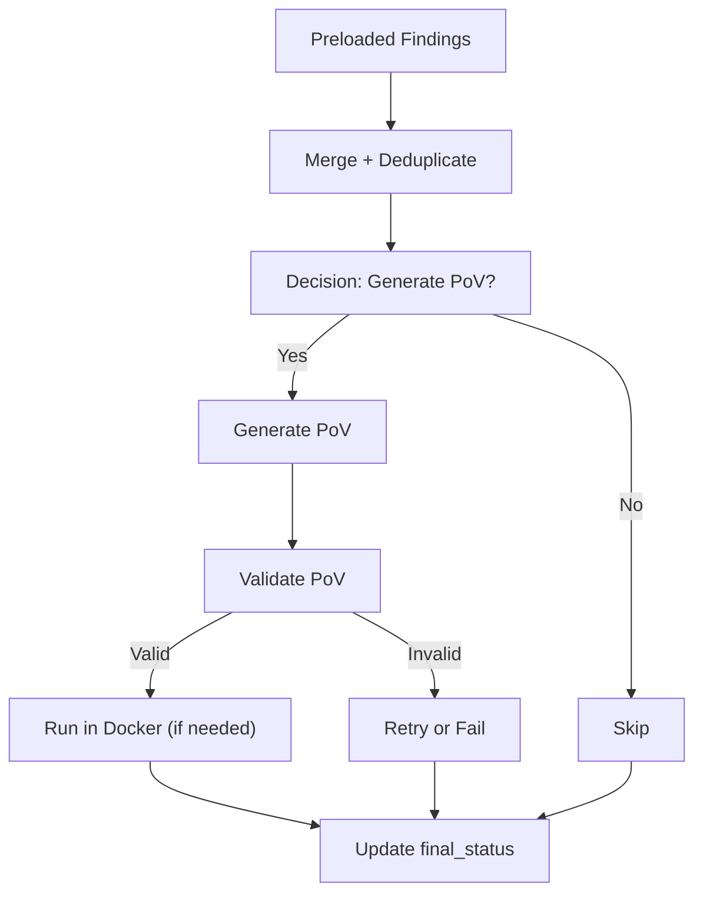

**Diagram sources**
- [agent_graph.py:229-239](file://app/agent_graph.py#L229-L239)
- [agent_graph.py:1059-1093](file://app/agent_graph.py#L1059-L1093)
- [verifier.py:225-387](file://agents/verifier.py#L225-L387)
- [static_validator.py:123-233](file://agents/static_validator.py#L123-L233)
- [unit_test_runner.py:34-116](file://agents/unit_test_runner.py#L34-L116)

**Section sources**
- [agent_graph.py:229-239](file://app/agent_graph.py#L229-L239)
- [agent_graph.py:1059-1093](file://app/agent_graph.py#L1059-L1093)
- [verifier.py:225-387](file://agents/verifier.py#L225-L387)
- [static_validator.py:123-233](file://agents/static_validator.py#L123-L233)
- [unit_test_runner.py:34-116](file://agents/unit_test_runner.py#L34-L116)

### Integration Patterns Between Data Sources
- CodeQL integration: Detect language, create database, run queries, parse SARIF, produce VulnerabilityState.
- Heuristic scout: Lightweight pattern matching across supported CWEs.
- LLM-only fallback: Walk code files, apply heuristic pre-filter, and propose candidates.
- RAG context: Retrieve related code chunks for investigation.

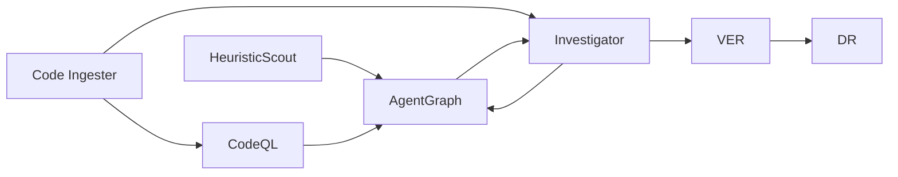

**Diagram sources**
- [heuristic_scout.py:188-234](file://agents/heuristic_scout.py#L188-L234)
- [agent_graph.py:241-307](file://app/agent_graph.py#L241-L307)
- [investigator.py:202-268](file://agents/investigator.py#L202-L268)
- [prompts.py:7-44](file://prompts.py#L7-L44)

**Section sources**
- [heuristic_scout.py:188-234](file://agents/heuristic_scout.py#L188-L234)
- [agent_graph.py:241-307](file://app/agent_graph.py#L241-L307)
- [investigator.py:202-268](file://agents/investigator.py#L202-L268)
- [prompts.py:7-44](file://prompts.py#L7-L44)

### Memory Management for Large Codebases
- CodeQL database created per scan and cleaned up after queries.
- LLM-only analysis caps file count to limit cost and memory footprint.
- Vector store ingestion supports progress callbacks and logs warnings without failing the scan.
- Static and unit test validators avoid heavy computation; DockerRunner executes in isolated containers with resource limits.

**Section sources**
- [agent_graph.py:309-340](file://app/agent_graph.py#L309-L340)
- [agent_graph.py:607-689](file://app/agent_graph.py#L607-L689)
- [docker_runner.py:30-36](file://agents/docker_runner.py#L30-L36)

## Dependency Analysis
- AgentGraph depends on configuration, policy router, learning store, and agents.
- Investigator and Verifier depend on prompts and configuration for model selection and cost calculation.
- DockerRunner depends on configuration for runtime limits and availability checks.
- ScanManager coordinates persistence and metrics, integrating with AgentGraph and LearningStore.

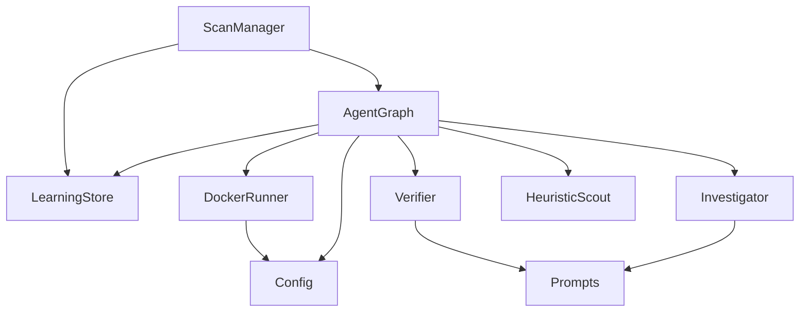

**Diagram sources**
- [agent_graph.py:19-29](file://app/agent_graph.py#L19-L29)
- [investigator.py:28-29](file://agents/investigator.py#L28-L29)
- [verifier.py:27-34](file://agents/verifier.py#L27-L34)
- [docker_runner.py](file://agents/docker_runner.py#L19)
- [scan_manager.py:18-20](file://app/scan_manager.py#L18-L20)

**Section sources**
- [agent_graph.py:19-29](file://app/agent_graph.py#L19-L29)
- [investigator.py:28-29](file://agents/investigator.py#L28-L29)
- [verifier.py:27-34](file://agents/verifier.py#L27-L34)
- [docker_runner.py](file://agents/docker_runner.py#L19)
- [scan_manager.py:18-20](file://app/scan_manager.py#L18-L20)

## Performance Considerations
- Cost control: MAX_COST_USD and COST_TRACKING_ENABLED cap spending; token-based cost calculation preferred over estimation.
- Parallelism: ThreadPoolExecutor in ScanManager for background scan execution.
- I/O limits: DockerRunner enforces CPU/memory/timeouts; unit tests use strict timeouts.
- Data volume: LLM-only analysis limits files scanned; CodeQL database reused per scan.

[No sources needed since this section provides general guidance]

## Troubleshooting Guide
Common issues and remedies:
- CodeQL not available: Falls back to heuristic/LLM-only analysis; verify CODEQL_CLI_PATH and packs location.
- Docker not available: Validation and execution fall back to static/unit test results; verify DOCKER_ENABLED and runtime configuration.
- LLM cost spikes: Monitor token usage and adjust model selection; leverage LearningStore model recommendations.
- Scan stuck or slow: Check logs via ScanManager.get_scan_logs; inspect current_finding_idx and status transitions.
- Persistence failures: Verify RUNS_DIR and permissions; CSV rebuild handled automatically.

**Section sources**
- [agent_graph.py:253-262](file://app/agent_graph.py#L253-L262)
- [docker_runner.py:50-60](file://agents/docker_runner.py#L50-L60)
- [scan_manager.py:483-493](file://app/scan_manager.py#L483-L493)
- [config.py:162-211](file://app/config.py#L162-L211)

## Conclusion
AutoPoV’s state-driven architecture ensures robust, observable, and cost-aware vulnerability research. ScanState and VulnerabilityState provide precise data models for each stage, while AgentGraph orchestrates intelligent branching based on confidence and validation outcomes. Cost tracking, logging, persistence, and error handling maintain reliability and transparency, enabling scalable operation on large codebases.