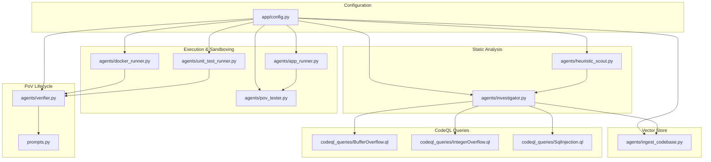
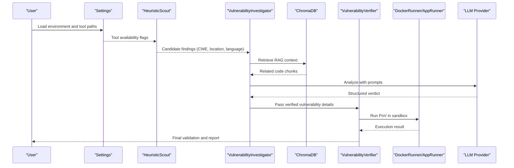
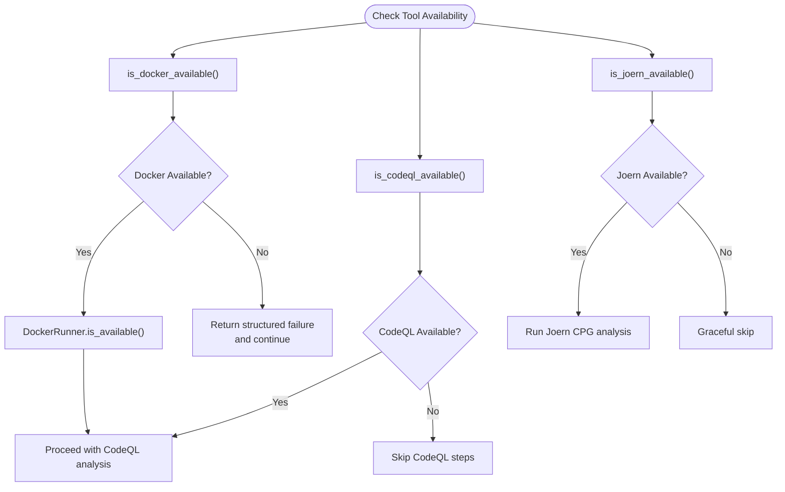
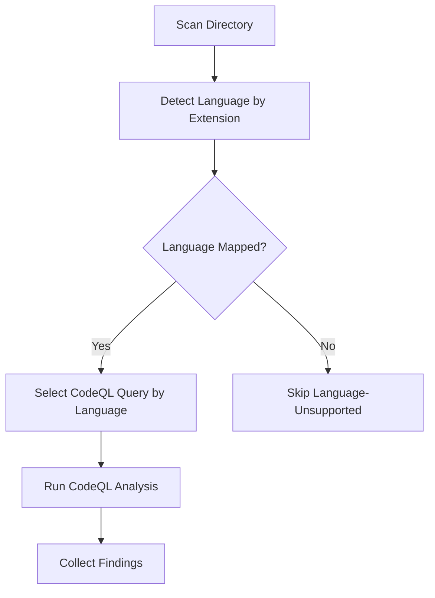
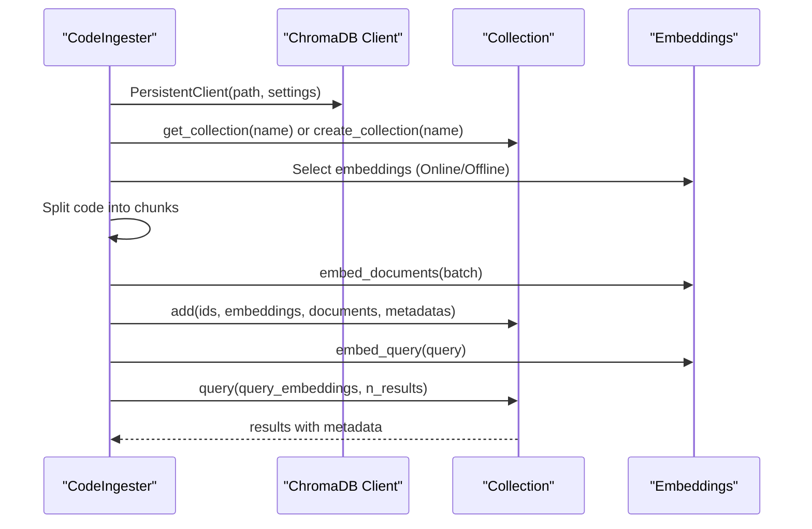
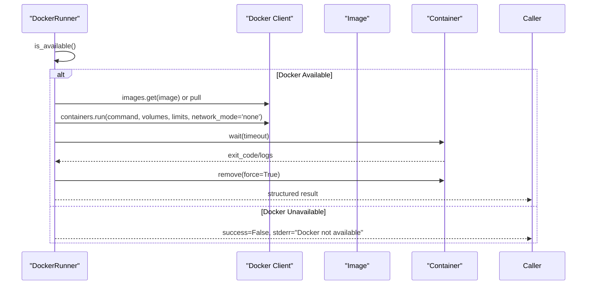
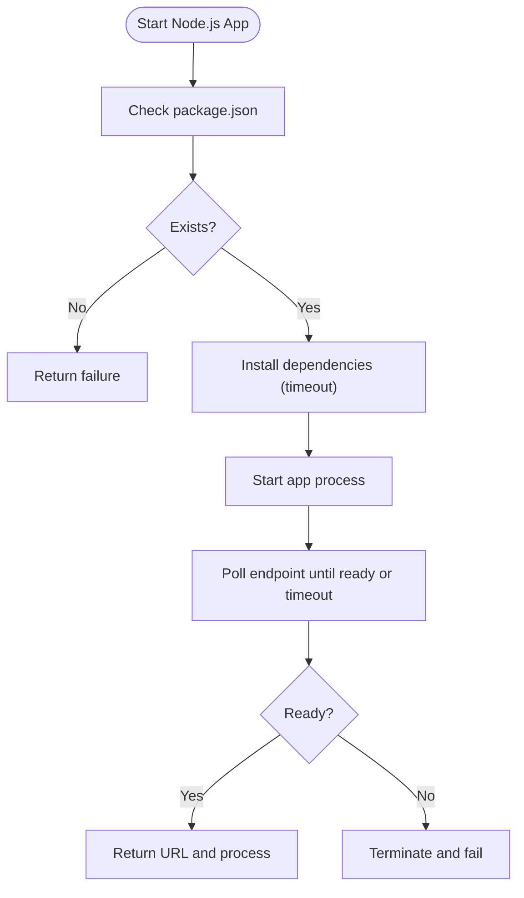
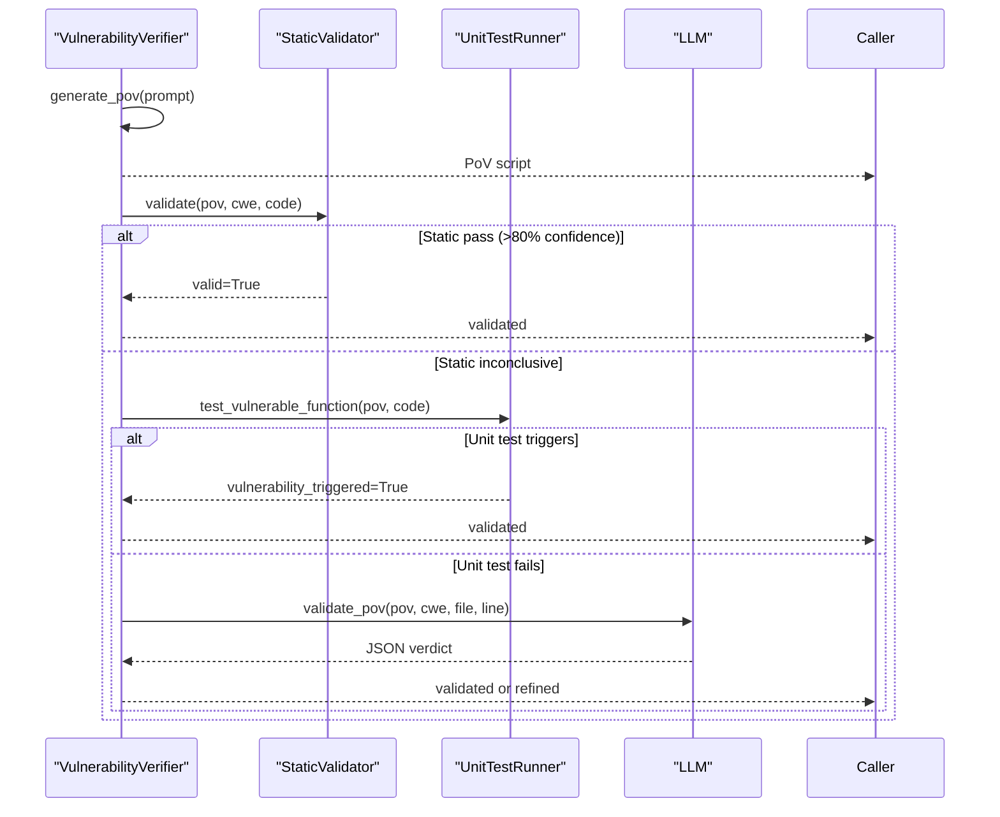
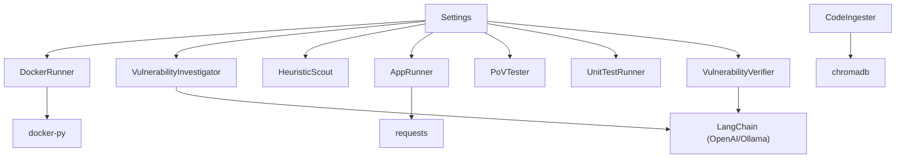

# External Tool Integration

<cite>
**Referenced Files in This Document**
- [docker_runner.py](file://agents/docker_runner.py)
- [app_runner.py](file://agents/app_runner.py)
- [ingest_codebase.py](file://agents/ingest_codebase.py)
- [config.py](file://app/config.py)
- [investigator.py](file://agents/investigator.py)
- [heuristic_scout.py](file://agents/heuristic_scout.py)
- [pov_tester.py](file://agents/pov_tester.py)
- [unit_test_runner.py](file://agents/unit_test_runner.py)
- [verifier.py](file://agents/verifier.py)
- [prompts.py](file://prompts.py)
- [BufferOverflow.ql](file://codeql_queries/BufferOverflow.ql)
- [IntegerOverflow.ql](file://codeql_queries/IntegerOverflow.ql)
- [SqlInjection.ql](file://codeql_queries/SqlInjection.ql)
</cite>

## Table of Contents
1. [Introduction](#introduction)
2. [Project Structure](#project-structure)
3. [Core Components](#core-components)
4. [Architecture Overview](#architecture-overview)
5. [Detailed Component Analysis](#detailed-component-analysis)
6. [Dependency Analysis](#dependency-analysis)
7. [Performance Considerations](#performance-considerations)
8. [Troubleshooting Guide](#troubleshooting-guide)
9. [Conclusion](#conclusion)

## Introduction
This document describes AutoPoV’s external tool integration architecture, focusing on how the system orchestrates:
- CodeQL for static analysis
- Docker for sandboxed execution
- ChromaDB for vector storage and retrieval
- Language detection and query mapping for CodeQL
- Tool availability detection and graceful fallbacks
- Subprocess execution patterns, timeouts, and resource cleanup
- Security considerations for sandboxing and external process management

It synthesizes the agent modules and configuration to explain seamless integration, error propagation, and performance optimization strategies.

## Project Structure
AutoPoV organizes external tool integrations primarily within the agents package and the app configuration module. Key integration points:
- Tool availability and configuration: app/config.py
- Vector store ingestion and retrieval: agents/ingest_codebase.py
- Static analysis orchestration: agents/investigator.py, agents/heuristic_scout.py
- Sandboxed execution: agents/docker_runner.py, agents/app_runner.py, agents/pov_tester.py, agents/unit_test_runner.py
- PoV generation and validation: agents/verifier.py
- LLM prompts: prompts.py
- CodeQL queries: codeql_queries/*.ql

**Diagram sources**
- [config.py:162-211](file://app/config.py#L162-L211)
- [ingest_codebase.py:96-121](file://agents/ingest_codebase.py#L96-L121)
- [investigator.py:105-201](file://agents/investigator.py#L105-L201)
- [docker_runner.py:50-61](file://agents/docker_runner.py#L50-L61)
- [app_runner.py:25-148](file://agents/app_runner.py#L25-L148)
- [pov_tester.py:24-106](file://agents/pov_tester.py#L24-L106)
- [unit_test_runner.py:236-286](file://agents/unit_test_runner.py#L236-L286)
- [verifier.py:90-224](file://agents/verifier.py#L90-L224)
- [prompts.py:46-90](file://prompts.py#L46-L90)
- [BufferOverflow.ql:1-59](file://codeql_queries/BufferOverflow.ql#L1-L59)
- [IntegerOverflow.ql:1-62](file://codeql_queries/IntegerOverflow.ql#L1-L62)
- [SqlInjection.ql:1-67](file://codeql_queries/SqlInjection.ql#L1-L67)

**Section sources**
- [config.py:162-211](file://app/config.py#L162-L211)
- [ingest_codebase.py:96-121](file://agents/ingest_codebase.py#L96-L121)
- [investigator.py:105-201](file://agents/investigator.py#L105-L201)
- [docker_runner.py:50-61](file://agents/docker_runner.py#L50-L61)
- [app_runner.py:25-148](file://agents/app_runner.py#L25-L148)
- [pov_tester.py:24-106](file://agents/pov_tester.py#L24-L106)
- [unit_test_runner.py:236-286](file://agents/unit_test_runner.py#L236-L286)
- [verifier.py:90-224](file://agents/verifier.py#L90-L224)
- [prompts.py:46-90](file://prompts.py#L46-L90)
- [BufferOverflow.ql:1-59](file://codeql_queries/BufferOverflow.ql#L1-L59)
- [IntegerOverflow.ql:1-62](file://codeql_queries/IntegerOverflow.ql#L1-L62)
- [SqlInjection.ql:1-67](file://codeql_queries/SqlInjection.ql#L1-L67)

## Core Components
- Tool availability detection and configuration:
  - Centralized via settings.is_docker_available(), settings.is_codeql_available(), settings.is_joern_available(), settings.is_kaitai_available().
  - Provides graceful fallbacks when tools are missing.
- Vector store integration:
  - Persistent ChromaDB client, dynamic collection creation per scan, OpenAI/HuggingFace embeddings selection, and batched ingestion with chunking.
- Static analysis orchestration:
  - HeuristicScout for lightweight pattern matching across supported CWEs.
  - Investigator integrates RAG, LLMs, and optional Joern CPG analysis for deeper insights.
- Sandboxed execution:
  - DockerRunner executes PoVs in isolated containers with resource limits and network isolation.
  - AppRunner starts Node.js apps for live testing.
  - UnitTestRunner executes PoVs in isolated subprocesses with restricted environments.
- Language detection and CodeQL mapping:
  - Language detection by file extension in HeuristicScout and CodeIngester.
  - CodeQL query selection via file-language targeting (e.g., BufferOverflow.ql for C/C++, SqlInjection.ql for Python).
- PoV lifecycle:
  - Verifier generates PoVs with strict constraints and validates via static analysis, unit tests, and LLM fallback.
- Subprocess execution patterns:
  - Timeouts, environment isolation, and cleanup across modules.

**Section sources**
- [config.py:162-211](file://app/config.py#L162-L211)
- [ingest_codebase.py:96-121](file://agents/ingest_codebase.py#L96-L121)
- [heuristic_scout.py:166-186](file://agents/heuristic_scout.py#L166-L186)
- [investigator.py:105-201](file://agents/investigator.py#L105-L201)
- [docker_runner.py:50-61](file://agents/docker_runner.py#L50-L61)
- [app_runner.py:25-148](file://agents/app_runner.py#L25-L148)
- [unit_test_runner.py:236-286](file://agents/unit_test_runner.py#L236-L286)
- [verifier.py:90-224](file://agents/verifier.py#L90-L224)

## Architecture Overview
The system integrates external tools through a layered approach:
- Configuration layer detects tool availability and sets runtime behavior.
- Data layer manages vector embeddings and retrieval for RAG.
- Analysis layer applies heuristics and LLM-driven investigation.
- Execution layer runs PoVs in secure sandboxes.
- Feedback loop iterates on failures using LLM retry analysis.

**Diagram sources**
- [config.py:162-211](file://app/config.py#L162-L211)
- [heuristic_scout.py:188-234](file://agents/heuristic_scout.py#L188-L234)
- [investigator.py:270-432](file://agents/investigator.py#L270-L432)
- [ingest_codebase.py:315-358](file://agents/ingest_codebase.py#L315-L358)
- [verifier.py:90-224](file://agents/verifier.py#L90-L224)
- [docker_runner.py:62-192](file://agents/docker_runner.py#L62-L192)
- [app_runner.py:25-148](file://agents/app_runner.py#L25-L148)

## Detailed Component Analysis

### Tool Availability Detection and Graceful Fallbacks
- Docker availability:
  - is_docker_available() checks DOCKER_ENABLED and executes docker info with timeout.
  - DockerRunner.is_available() pings the client and returns a structured result when unavailable.
- CodeQL availability:
  - is_codeql_available() verifies the CLI path and version.
  - Investigator._run_joern_analysis() is invoked only for specific CWEs and gracefully skips when unavailable.
- Joern availability:
  - is_joern_available() checks CLI presence and version.
- Kaitai availability:
  - is_kaitai_available() checks the compiler path and version.
- Fallback behavior:
  - When tools are unavailable, modules return structured results indicating failure and continue processing.

**Diagram sources**
- [config.py:162-211](file://app/config.py#L162-L211)
- [docker_runner.py:50-61](file://agents/docker_runner.py#L50-L61)
- [investigator.py:128-200](file://agents/investigator.py#L128-L200)

**Section sources**
- [config.py:162-211](file://app/config.py#L162-L211)
- [docker_runner.py:50-61](file://agents/docker_runner.py#L50-L61)
- [investigator.py:128-200](file://agents/investigator.py#L128-L200)

### Language Detection and CodeQL Query Mapping
- Language detection:
  - HeuristicScout._detect_language(): maps extensions to language identifiers.
  - CodeIngester._detect_language(): broader language mapping for embedding.
- CodeQL query mapping:
  - HeuristicScout scans by language and CWE patterns.
  - Investigator integrates with CodeQL queries by leveraging language-specific targets:
    - BufferOverflow.ql targets C/C++.
    - SqlInjection.ql targets Python.
    - IntegerOverflow.ql targets C/C++.

**Diagram sources**
- [heuristic_scout.py:166-186](file://agents/heuristic_scout.py#L166-L186)
- [ingest_codebase.py:175-205](file://agents/ingest_codebase.py#L175-L205)
- [BufferOverflow.ql:1-59](file://codeql_queries/BufferOverflow.ql#L1-L59)
- [SqlInjection.ql:1-67](file://codeql_queries/SqlInjection.ql#L1-L67)
- [IntegerOverflow.ql:1-62](file://codeql_queries/IntegerOverflow.ql#L1-L62)

**Section sources**
- [heuristic_scout.py:166-186](file://agents/heuristic_scout.py#L166-L186)
- [ingest_codebase.py:175-205](file://agents/ingest_codebase.py#L175-L205)
- [BufferOverflow.ql:1-59](file://codeql_queries/BufferOverflow.ql#L1-L59)
- [SqlInjection.ql:1-67](file://codeql_queries/SqlInjection.ql#L1-L67)
- [IntegerOverflow.ql:1-62](file://codeql_queries/IntegerOverflow.ql#L1-L62)

### Vector Store Integration with ChromaDB
- Client initialization:
  - PersistentClient with telemetry disabled.
- Collection management:
  - Dynamic collection per scan_id; created if absent.
- Embedding selection:
  - Online mode: OpenAI embeddings via OpenRouter.
  - Offline mode: HuggingFace sentence transformers.
- Ingestion pipeline:
  - RecursiveCharacterTextSplitter with language-aware separators.
  - Batched embedding generation and insertion.
- Retrieval:
  - Query embedding computed and top-k results returned with metadata.

**Diagram sources**
- [ingest_codebase.py:96-121](file://agents/ingest_codebase.py#L96-L121)
- [ingest_codebase.py:207-313](file://agents/ingest_codebase.py#L207-L313)
- [ingest_codebase.py:315-358](file://agents/ingest_codebase.py#L315-L358)

**Section sources**
- [ingest_codebase.py:96-121](file://agents/ingest_codebase.py#L96-L121)
- [ingest_codebase.py:207-313](file://agents/ingest_codebase.py#L207-L313)
- [ingest_codebase.py:315-358](file://agents/ingest_codebase.py#L315-L358)

### Sandboxed Execution with Docker
- Isolation and limits:
  - Memory and CPU quotas, read-only volume binding, network disabled.
- Lifecycle:
  - Image pull if missing, container run, wait with timeout, logs extraction, force removal.
- Fallback:
  - When Docker is unavailable, DockerRunner returns a structured failure result.

**Diagram sources**
- [docker_runner.py:50-61](file://agents/docker_runner.py#L50-L61)
- [docker_runner.py:62-192](file://agents/docker_runner.py#L62-L192)

**Section sources**
- [docker_runner.py:50-61](file://agents/docker_runner.py#L50-L61)
- [docker_runner.py:62-192](file://agents/docker_runner.py#L62-L192)

### Application Lifecycle Management for Live Testing
- Node.js app startup:
  - Validates package.json, installs dependencies if missing, starts app with environment overrides, waits for readiness with timeout.
- Health checks:
  - Polls HTTP endpoint until success or timeout.
- Cleanup:
  - Terminates process and removes from registry.

**Diagram sources**
- [app_runner.py:25-148](file://agents/app_runner.py#L25-L148)

**Section sources**
- [app_runner.py:25-148](file://agents/app_runner.py#L25-L148)

### Proof-of-Vulnerability Lifecycle and Validation
- Generation:
  - Verifier.generate_pov() builds a prompt tailored to CWE and target language, produces a deterministic PoV script, and tracks cost and token usage.
- Validation:
  - StaticValidator performs fast pattern checks and confidence scoring.
  - UnitTestRunner executes PoVs in isolated subprocesses with restricted environments and captures output.
  - LLM-based validation serves as a fallback when other methods are inconclusive.
- Retry and refinement:
  - Verifier.analyze_failure() suggests targeted improvements based on execution output.

**Diagram sources**
- [verifier.py:90-224](file://agents/verifier.py#L90-L224)
- [verifier.py:225-387](file://agents/verifier.py#L225-L387)
- [static_validator.py:123-233](file://agents/static_validator.py#L123-L233)
- [unit_test_runner.py:34-116](file://agents/unit_test_runner.py#L34-L116)

**Section sources**
- [verifier.py:90-224](file://agents/verifier.py#L90-L224)
- [verifier.py:225-387](file://agents/verifier.py#L225-L387)
- [static_validator.py:123-233](file://agents/static_validator.py#L123-L233)
- [unit_test_runner.py:34-116](file://agents/unit_test_runner.py#L34-L116)

### Subprocess Execution Patterns, Timeouts, and Cleanup
- Timeouts:
  - DockerRunner.container.wait(timeout=...).
  - AppRunner.start_nodejs_app() uses timeouts for npm install and readiness polling.
  - UnitTestRunner._run_isolated_test() enforces 30s timeout.
  - PoVTester._run_python_pov/_run_javascript_pov() enforce 30s timeout.
- Environment isolation:
  - UnitTestRunner restricts PATH and PYTHONPATH.
  - DockerRunner disables networking and binds volumes read-only.
- Cleanup:
  - DockerRunner removes containers and temp directories.
  - AppRunner terminates processes and cleans up registry entries.
  - UnitTestRunner removes temporary harness directories.

**Section sources**
- [docker_runner.py:135-150](file://agents/docker_runner.py#L135-L150)
- [app_runner.py:88-112](file://agents/app_runner.py#L88-L112)
- [unit_test_runner.py:248-264](file://agents/unit_test_runner.py#L248-L264)
- [pov_tester.py:152-173](file://agents/pov_tester.py#L152-L173)

### Security Considerations for Sandboxing and External Processes
- Network isolation:
  - DockerRunner sets network_mode='none'.
- Resource limits:
  - Memory and CPU quotas enforced via container configuration.
- Restricted environments:
  - UnitTestRunner limits PATH and PYTHONPATH.
- Process lifecycle:
  - Explicit termination and cleanup to prevent orphaned processes.
- Error containment:
  - Structured error returns with timeouts and exceptions handled centrally.

**Section sources**
- [docker_runner.py:122-133](file://agents/docker_runner.py#L122-L133)
- [unit_test_runner.py:249-256](file://agents/unit_test_runner.py#L249-L256)
- [app_runner.py:150-168](file://agents/app_runner.py#L150-L168)

## Dependency Analysis
External dependencies and integration points:
- Docker SDK for Python: used by DockerRunner to manage containers.
- Requests: used by AppRunner for health checks.
- LangChain ecosystem: OpenAI and Ollama clients used by Investigator and Verifier.
- ChromaDB: persistent vector store client.
- CodeQL CLI: invoked via settings.CODEQL_CLI_PATH for analysis.
- Joern CLI: invoked via settings.JOERN_CLI_PATH for CPG analysis.

**Diagram sources**
- [docker_runner.py:12-18](file://agents/docker_runner.py#L12-L18)
- [app_runner.py:9-10](file://agents/app_runner.py#L9-L10)
- [investigator.py:15-25](file://agents/investigator.py#L15-L25)
- [verifier.py:15-25](file://agents/verifier.py#L15-L25)
- [ingest_codebase.py:14-31](file://agents/ingest_codebase.py#L14-L31)
- [config.py:87-91](file://app/config.py#L87-L91)

**Section sources**
- [docker_runner.py:12-18](file://agents/docker_runner.py#L12-L18)
- [app_runner.py:9-10](file://agents/app_runner.py#L9-L10)
- [investigator.py:15-25](file://agents/investigator.py#L15-L25)
- [verifier.py:15-25](file://agents/verifier.py#L15-L25)
- [ingest_codebase.py:14-31](file://agents/ingest_codebase.py#L14-L31)
- [config.py:87-91](file://app/config.py#L87-L91)

## Performance Considerations
- Vector ingestion batching:
  - CodeIngester processes embeddings in batches to reduce overhead.
- Cost control:
  - Settings.MAX_COST_USD and COST_TRACKING_ENABLED cap spending; Investigator and Verifier compute costs from token usage.
- Timeouts:
  - Consistent timeouts across subprocesses prevent resource starvation.
- Language-aware chunking:
  - RecursiveCharacterTextSplitter with language-specific separators improves retrieval quality.
- Tool availability gating:
  - Early checks prevent wasted cycles when tools are unavailable.

[No sources needed since this section provides general guidance]

## Troubleshooting Guide
Common issues and resolutions:
- Docker not available:
  - Verify DOCKER_ENABLED and docker info; DockerRunner returns structured failure when unavailable.
- CodeQL CLI not found:
  - Ensure CODEQL_CLI_PATH points to a valid installation; Investigator skips CodeQL steps gracefully.
- Joern not available:
  - Investigator only runs Joern for CWE-416 and gracefully skips otherwise.
- ChromaDB not installed:
  - CodeIngester raises explicit errors when chromadb is missing; install the package.
- LLM provider issues:
  - Investigator and Verifier raise errors when required providers are missing; configure OPENROUTER_API_KEY or OLLAMA_BASE_URL accordingly.
- Timeout errors:
  - Adjust timeouts in DockerRunner, AppRunner, and UnitTestRunner as needed; ensure resource limits are sufficient.

**Section sources**
- [docker_runner.py:50-61](file://agents/docker_runner.py#L50-L61)
- [investigator.py:128-200](file://agents/investigator.py#L128-L200)
- [ingest_codebase.py:96-109](file://agents/ingest_codebase.py#L96-L109)
- [config.py:162-211](file://app/config.py#L162-L211)

## Conclusion
AutoPoV’s external tool integration architecture balances robustness and flexibility:
- Tool availability detection enables graceful fallbacks.
- Language-aware CodeQL mapping ensures relevant static analysis.
- ChromaDB powers effective RAG for context retrieval.
- Sandboxed execution with Docker and restricted subprocesses ensures safety and reproducibility.
- Structured validation and retry strategies improve PoV reliability.
These patterns collectively deliver a secure, scalable, and maintainable integration framework for automated vulnerability analysis.