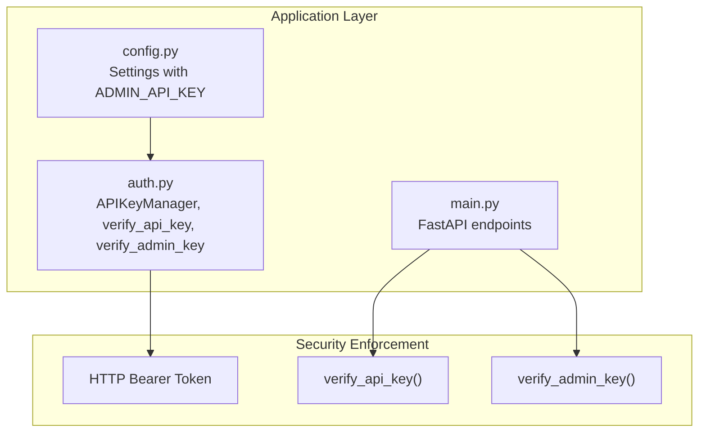
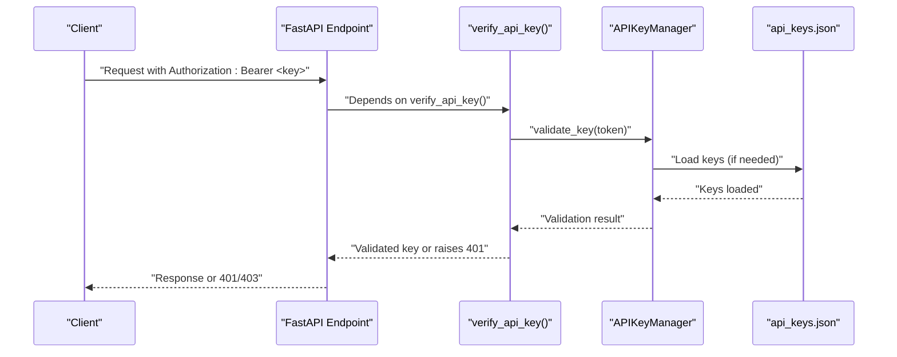
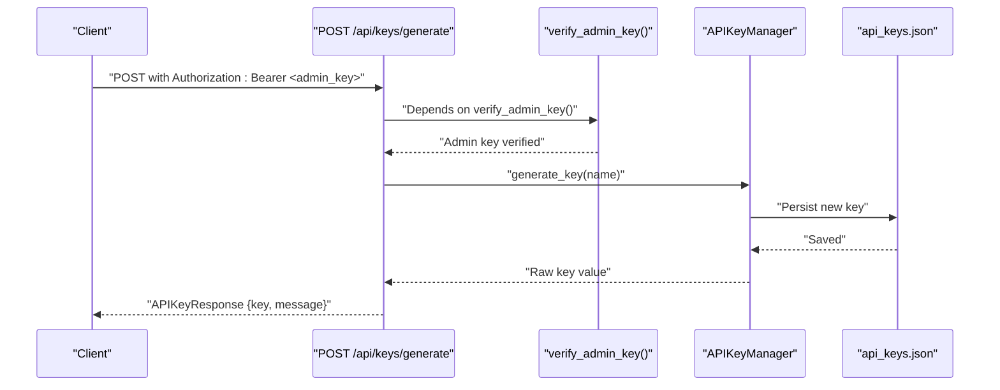
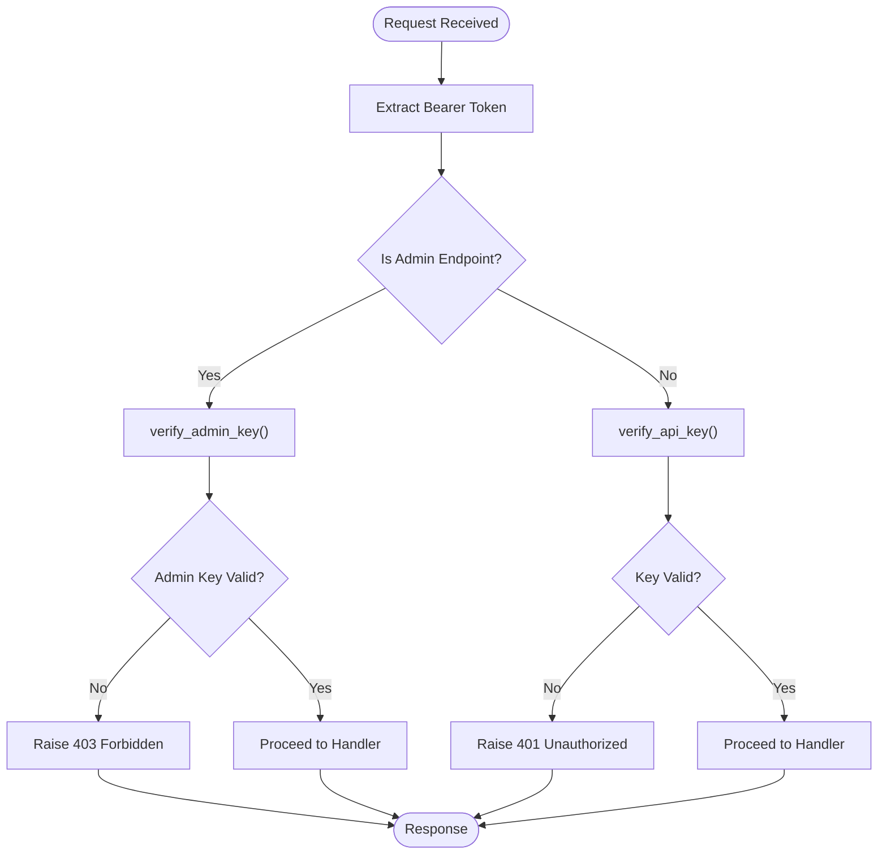
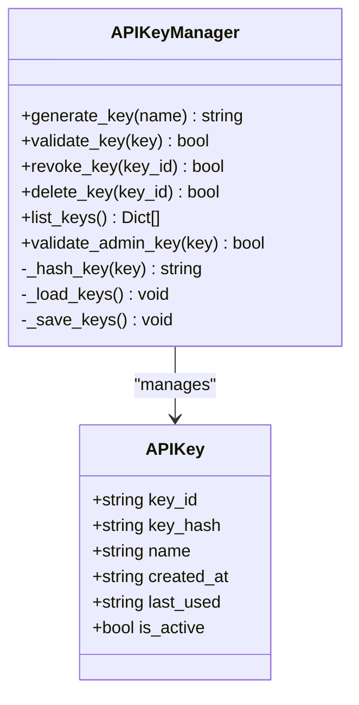
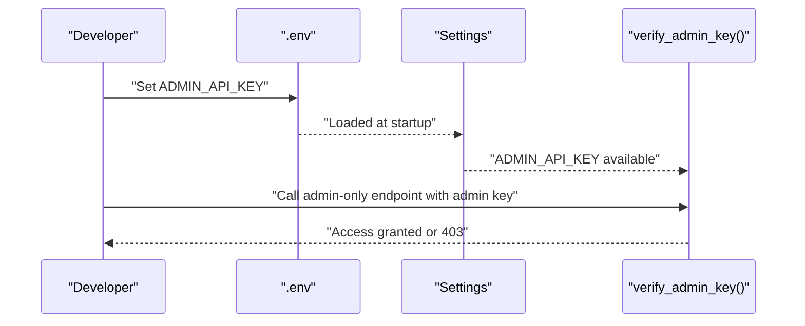
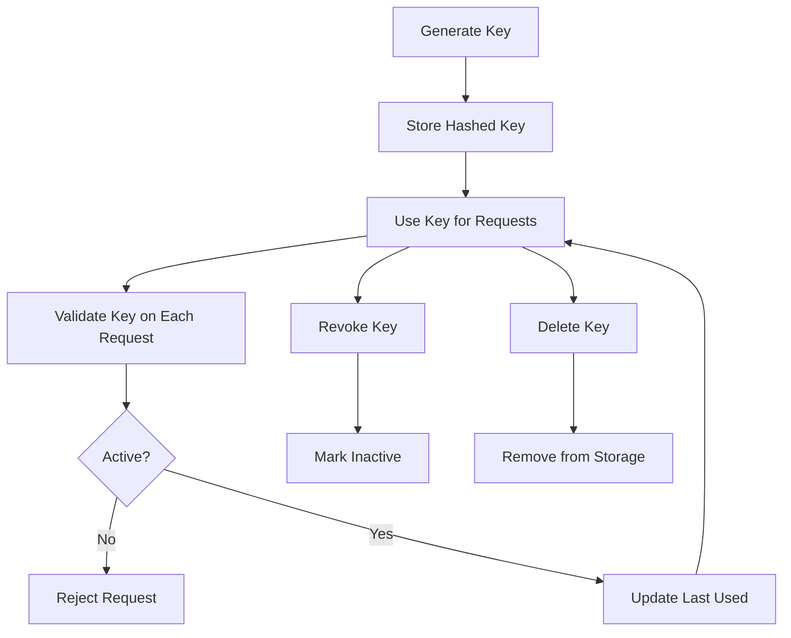
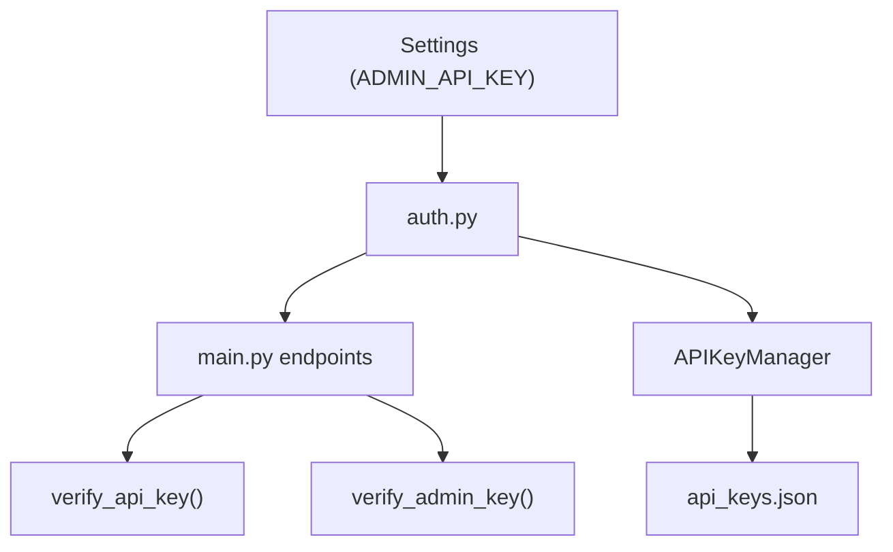

# Authentication and Authorization Endpoints

<cite>
**Referenced Files in This Document**
- [auth.py](file://autopov/app/auth.py)
- [main.py](file://autopov/app/main.py)
- [config.py](file://autopov/app/config.py)
- [test_auth.py](file://autopov/tests/test_auth.py)
- [test_api.py](file://autopov/tests/test_api.py)
- [README.md](file://autopov/README.md)
- [autopov.py](file://autopov/cli/autopov.py)
- [generate_key.py](file://autopov/generate_key.py)
</cite>

## Table of Contents
1. [Introduction](#introduction)
2. [Project Structure](#project-structure)
3. [Core Components](#core-components)
4. [Architecture Overview](#architecture-overview)
5. [Detailed Component Analysis](#detailed-component-analysis)
6. [Dependency Analysis](#dependency-analysis)
7. [Performance Considerations](#performance-considerations)
8. [Troubleshooting Guide](#troubleshooting-guide)
9. [Conclusion](#conclusion)
10. [Appendices](#appendices)

## Introduction
This document provides comprehensive API documentation for AutoPoV’s authentication and authorization endpoints with a focus on API key management and security enforcement. It covers admin-only endpoints for key generation, listing, and revocation, along with the underlying verification mechanisms and best practices for secure usage.

## Project Structure
The authentication and authorization logic is implemented in the application layer and integrated into the FastAPI endpoints. Key components include:
- Authentication and API key management module
- FastAPI endpoints secured by bearer tokens
- Configuration for admin keys and environment variables
- CLI and utility scripts for key generation and management

**Diagram sources**
- [auth.py](file://autopov/app/auth.py#L137-L162)
- [main.py](file://autopov/app/main.py#L478-L511)
- [config.py](file://autopov/app/config.py#L26-L28)

**Section sources**
- [auth.py](file://autopov/app/auth.py#L1-L168)
- [main.py](file://autopov/app/main.py#L1-L528)
- [config.py](file://autopov/app/config.py#L1-L210)

## Core Components
- APIKeyManager: Manages API key lifecycle, hashing, persistence, and validation.
- verify_api_key: Validates standard API keys via Bearer token for general endpoints.
- verify_admin_key: Validates admin API keys for privileged endpoints.
- Settings: Provides ADMIN_API_KEY and other configuration for security.

Key responsibilities:
- Generate keys with secure random identifiers and hashed storage
- Validate keys against stored hashes and activity status
- Revoke/delete keys and list keys without exposing hashes
- Enforce admin-only access to key management endpoints

**Section sources**
- [auth.py](file://autopov/app/auth.py#L32-L168)
- [config.py](file://autopov/app/config.py#L26-L28)

## Architecture Overview
The authentication architecture enforces bearer token-based access control across endpoints. Admin-only endpoints require an admin key, while general endpoints require a standard API key. Keys are persisted to disk and validated on each request.

**Diagram sources**
- [auth.py](file://autopov/app/auth.py#L137-L148)
- [auth.py](file://autopov/app/auth.py#L81-L95)
- [main.py](file://autopov/app/main.py#L177-L316)

## Detailed Component Analysis

### API Key Management Endpoints
Admin-only endpoints for managing API keys:
- POST /api/keys/generate: Generate a new API key (admin only)
- GET /api/keys: List all API keys (admin only)
- DELETE /api/keys/{key_id}: Revoke an API key (admin only)

Access control:
- verify_admin_key dependency ensures only admin keys can access these endpoints.

Key lifecycle:
- Generation creates a new key with a secure identifier and stores a hash
- Listing returns metadata without exposing hashes
- Revocation deactivates a key; deletion removes it permanently

**Diagram sources**
- [main.py](file://autopov/app/main.py#L478-L489)
- [auth.py](file://autopov/app/auth.py#L151-L162)
- [auth.py](file://autopov/app/auth.py#L63-L79)

**Section sources**
- [main.py](file://autopov/app/main.py#L478-L511)
- [auth.py](file://autopov/app/auth.py#L32-L168)

### API Key Verification Dependencies
- verify_api_key: Validates standard API keys for general endpoints
- verify_admin_key: Validates admin API keys for admin-only endpoints

Behavior:
- Both depend on HTTP Bearer tokens
- verify_api_key raises 401 Unauthorized for invalid/expired keys
- verify_admin_key raises 403 Forbidden if admin key is missing or incorrect

**Diagram sources**
- [auth.py](file://autopov/app/auth.py#L137-L162)
- [main.py](file://autopov/app/main.py#L478-L511)

**Section sources**
- [auth.py](file://autopov/app/auth.py#L137-L162)

### HTTP Bearer Token Authentication Requirements
- All protected endpoints require Authorization: Bearer <API_KEY> header
- verify_api_key validates standard keys
- verify_admin_key validates admin keys for admin-only endpoints

Best practices:
- Always send Authorization: Bearer <key> header
- Never expose raw keys in logs or client-side code
- Rotate keys regularly and revoke unused keys

**Section sources**
- [auth.py](file://autopov/app/auth.py#L137-L162)
- [main.py](file://autopov/app/main.py#L177-L316)

### Key Format Specifications
- Raw key format: apov_<secure_random_string>
- Key identifiers: URL-safe random identifiers
- Hashing: SHA-256 of the raw key is stored for validation
- Persistence: api_keys.json in the configured data directory

**Diagram sources**
- [auth.py](file://autopov/app/auth.py#L22-L168)

**Section sources**
- [auth.py](file://autopov/app/auth.py#L22-L168)

### Admin Key Generation Process
- Admin key is configured via ADMIN_API_KEY environment variable
- Admin-only endpoints require this key for access
- CLI and utility scripts demonstrate admin key usage

**Diagram sources**
- [config.py](file://autopov/app/config.py#L26-L28)
- [auth.py](file://autopov/app/auth.py#L126-L130)

**Section sources**
- [config.py](file://autopov/app/config.py#L26-L28)
- [README.md](file://autopov/README.md#L88-L101)

### Key Lifecycle Management
- Creation: generate_key(name) produces a raw key and persists a hashed version
- Validation: validate_key checks hash and activity status, updates last_used
- Revocation: revoke_key sets is_active=false
- Deletion: delete_key removes the key from storage
- Listing: list_keys returns metadata without exposing hashes

**Diagram sources**
- [auth.py](file://autopov/app/auth.py#L63-L124)

**Section sources**
- [auth.py](file://autopov/app/auth.py#L63-L124)

### Access Control Patterns
- verify_api_key: Applied to general endpoints requiring standard API key
- verify_admin_key: Applied to admin-only endpoints
- HTTPException with appropriate status codes and WWW-Authenticate headers

**Section sources**
- [auth.py](file://autopov/app/auth.py#L137-L162)
- [main.py](file://autopov/app/main.py#L478-L511)

### API Key Usage Examples
- Using curl with Authorization header
- CLI usage with AUTOPOV_API_KEY or --api-key flag
- Web UI settings for storing API keys

Examples are demonstrated in the project documentation and CLI usage.

**Section sources**
- [README.md](file://autopov/README.md#L128-L144)
- [autopov.py](file://autopov/cli/autopov.py#L29-L87)

### Key Rotation Procedures
- Generate a new key using admin-only endpoints or CLI
- Replace old key in clients and configuration
- Revoke old key after successful migration
- Delete old key if no longer needed

**Section sources**
- [main.py](file://autopov/app/main.py#L478-L511)
- [autopov.py](file://autopov/cli/autopov.py#L371-L409)

### Security Best Practices
- Store keys securely in environment variables or encrypted config
- Never commit keys to version control
- Use admin-only endpoints for key management
- Regularly review and revoke unused keys
- Monitor endpoint access and consider adding rate limiting and audit logging

[No sources needed since this section provides general guidance]

## Dependency Analysis
The authentication system integrates tightly with FastAPI endpoints and configuration:

**Diagram sources**
- [config.py](file://autopov/app/config.py#L26-L28)
- [auth.py](file://autopov/app/auth.py#L137-L162)
- [main.py](file://autopov/app/main.py#L478-L511)

**Section sources**
- [config.py](file://autopov/app/config.py#L26-L28)
- [auth.py](file://autopov/app/auth.py#L137-L162)
- [main.py](file://autopov/app/main.py#L478-L511)

## Performance Considerations
- Key validation performs a linear scan over stored keys; consider indexing or caching for high throughput
- Persisting keys on each validation minimizes memory overhead but may impact latency under heavy load
- Consider batching writes or using a database-backed storage for production deployments

[No sources needed since this section provides general guidance]

## Troubleshooting Guide
Common issues and resolutions:
- 401 Unauthorized: Invalid or expired API key; regenerate and replace
- 403 Forbidden: Admin-only endpoint accessed without admin key; provide ADMIN_API_KEY
- 404 Not Found: Key not found during revocation; verify key_id
- Tests indicate authentication failures without keys; confirm Authorization header presence

**Section sources**
- [auth.py](file://autopov/app/auth.py#L141-L146)
- [auth.py](file://autopov/app/auth.py#L155-L160)
- [test_api.py](file://autopov/tests/test_api.py#L29-L39)

## Conclusion
AutoPoV’s authentication system provides robust bearer token-based access control with clear separation between standard and admin endpoints. By following the documented best practices—secure key storage, rotation, and careful access control—you can maintain a secure deployment of the API.

[No sources needed since this section summarizes without analyzing specific files]

## Appendices

### Endpoint Reference
- POST /api/keys/generate: Generate a new API key (admin only)
- GET /api/keys: List API keys (admin only)
- DELETE /api/keys/{key_id}: Revoke an API key (admin only)

All endpoints require Authorization: Bearer <key> header.

**Section sources**
- [main.py](file://autopov/app/main.py#L478-L511)

### Key Storage Security
- Keys are stored as SHA-256 hashes with random identifiers
- Raw keys are only returned upon generation and must be stored securely
- Consider encrypting api_keys.json at rest

**Section sources**
- [auth.py](file://autopov/app/auth.py#L59-L61)
- [auth.py](file://autopov/app/auth.py#L52-L57)

### Rate Limiting and Audit Logging
- No built-in rate limiting or audit logging detected in the codebase
- Consider integrating middleware or external systems for monitoring and protection

[No sources needed since this section provides general guidance]