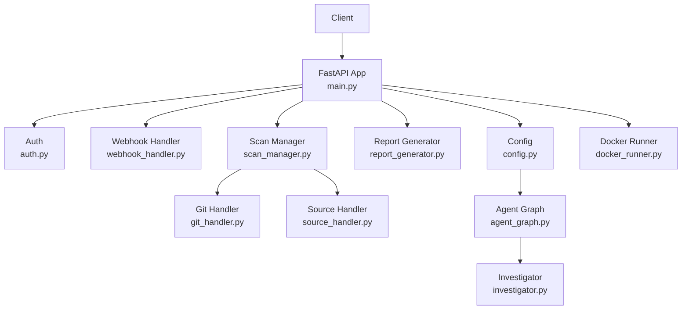
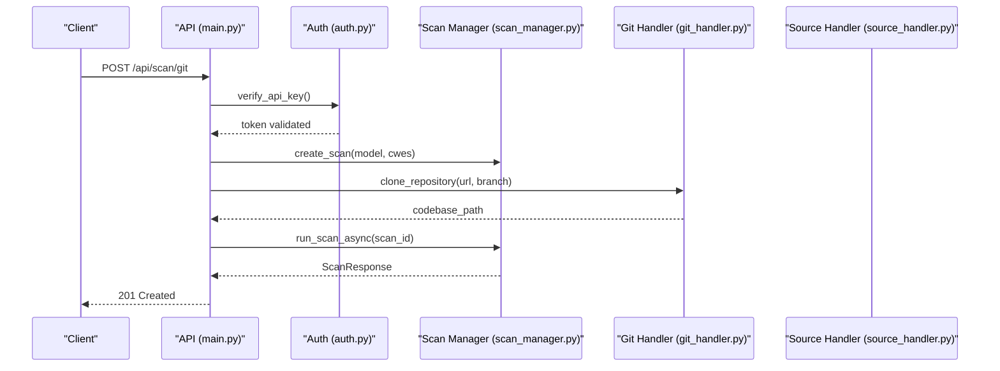
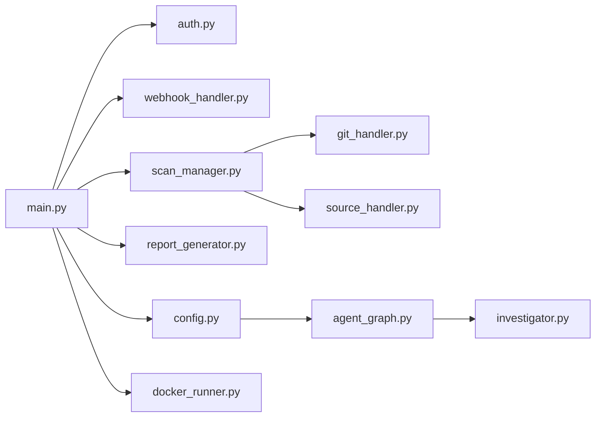

# Backend API Reference

<cite>
**Referenced Files in This Document**
- [main.py](file://app/main.py)
- [auth.py](file://app/auth.py)
- [webhook_handler.py](file://app/webhook_handler.py)
- [scan_manager.py](file://app/scan_manager.py)
- [config.py](file://app/config.py)
- [report_generator.py](file://app/report_generator.py)
- [source_handler.py](file://app/source_handler.py)
- [git_handler.py](file://app/git_handler.py)
- [agent_graph.py](file://app/agent_graph.py)
- [investigator.py](file://agents/investigator.py)
- [docker_runner.py](file://agents/docker_runner.py)
- [test_api.py](file://tests/test_api.py)
- [README.md](file://README.md)
</cite>

## Update Summary
**Changes Made**
- Enhanced FastAPI application with comprehensive REST API endpoints for scan initiation, status monitoring, and result retrieval
- Implemented streaming Server-Sent Events (SSE) for real-time log delivery during scans
- Added comprehensive webhook integrations for GitHub and GitLab with signature validation
- Integrated administrative API key management with bearer token authentication
- Enhanced report generation with JSON and PDF formats including metrics calculation
- Implemented CORS configuration for seamless frontend-backend communication
- Added comprehensive error handling, health checks, and metrics collection
- Enhanced scan lifecycle management with asynchronous execution and background processing
- **Updated** Enhanced configuration system with model selection capabilities and environment-based configuration
- **Updated** Interactive model selection features for both CLI and frontend applications
- **Updated** Configuration-driven LLM provider selection (OpenRouter vs Ollama) with validation
- **Updated** Added Docker health monitoring and containerized deployment support
- **Updated** Improved error handling with comprehensive logging and debugging capabilities
- **Updated** Expanded endpoint coverage for containerized deployment environments

## Table of Contents
1. [Introduction](#introduction)
2. [Project Structure](#project-structure)
3. [Core Components](#core-components)
4. [Architecture Overview](#architecture-overview)
5. [Detailed Component Analysis](#detailed-component-analysis)
6. [Dependency Analysis](#dependency-analysis)
7. [Performance Considerations](#performance-considerations)
8. [Troubleshooting Guide](#troubleshooting-guide)
9. [Conclusion](#conclusion)
10. [Appendices](#appendices)

## Introduction
This document provides a comprehensive API reference for AutoPoV's backend REST API. It covers all public endpoints, their HTTP methods, URL patterns, request/response schemas, authentication, and operational behavior. The API now includes comprehensive scan initiation, status monitoring, result retrieval, webhook integration, administrative operations, proper CORS configuration, health checks, metrics endpoints, and comprehensive error handling with support for multiple scan types. The system now features an enhanced configuration system with interactive model selection capabilities for both online (OpenRouter) and offline (Ollama) LLM providers, along with comprehensive Docker health monitoring for containerized deployments.

## Project Structure
The backend is implemented as a FastAPI application with modular components:
- Routing and endpoints in main.py with comprehensive API coverage
- Authentication and API key management in auth.py with bearer token support
- Webhook handlers in webhook_handler.py with GitHub/GitLab security validation
- Scan orchestration and persistence in scan_manager.py with async execution
- Enhanced configuration system in config.py with environment variable support and model selection
- Report generation in report_generator.py with JSON/PDF formats
- Source ingestion helpers in source_handler.py and git_handler.py
- LLM agent integration in agent_graph.py with dynamic model configuration
- Investigator agent with model provider selection in investigator.py
- Docker runner for containerized deployment in docker_runner.py
- Tests validating behavior in tests/test_api.py
- Usage examples and environment guidance in README.md

**Diagram sources**
- [main.py](file://app/main.py#L104-L122)
- [auth.py](file://app/auth.py#L137-L179)
- [webhook_handler.py](file://app/webhook_handler.py#L15-L363)
- [scan_manager.py](file://app/scan_manager.py#L40-L348)
- [git_handler.py](file://app/git_handler.py#L20-L392)
- [source_handler.py](file://app/source_handler.py#L18-L380)
- [report_generator.py](file://app/report_generator.py#L68-L359)
- [config.py](file://app/config.py#L13-L231)
- [agent_graph.py](file://app/agent_graph.py#L78-L200)
- [investigator.py](file://agents/investigator.py#L50-L83)
- [docker_runner.py](file://agents/docker_runner.py#L1-L200)

**Section sources**
- [main.py](file://app/main.py#L104-L122)
- [config.py](file://app/config.py#L13-L231)

## Core Components
- FastAPI application with CORS middleware and lifespan management
- Bearer token authentication via API keys with admin-only endpoints
- Comprehensive scan lifecycle management with asynchronous execution
- Webhook handlers for GitHub and GitLab with signature validation
- Enhanced configuration system with model selection and environment-based settings
- Report generation in JSON and PDF formats with metrics calculation
- Source ingestion for Git, ZIP, TAR, and raw code with security validation
- System health checks with tool availability detection
- Metrics collection and reporting for system performance
- Dynamic LLM provider selection (OpenRouter/Ollama) with validation
- **Updated** Docker health monitoring for containerized deployment environments
- **Updated** Comprehensive error handling with logging and debugging capabilities

**Section sources**
- [main.py](file://app/main.py#L104-L122)
- [auth.py](file://app/auth.py#L137-L179)
- [scan_manager.py](file://app/scan_manager.py#L40-L116)
- [webhook_handler.py](file://app/webhook_handler.py#L15-L363)
- [report_generator.py](file://app/report_generator.py#L68-L118)
- [config.py](file://app/config.py#L37-L50)
- [docker_runner.py](file://agents/docker_runner.py#L1-L200)

## Architecture Overview
The API exposes public endpoints for scanning, status polling, streaming logs, report generation, and webhooks. Authentication is enforced via Bearer tokens. Administrative endpoints manage API keys. Scans are orchestrated asynchronously and persisted for later retrieval. The system includes comprehensive error handling, metrics collection, and health monitoring. The enhanced configuration system now supports interactive model selection between online (OpenRouter) and offline (Ollama) LLM providers with environment-based validation. **Updated** Docker health monitoring provides comprehensive container health checking for production deployments.

**Diagram sources**
- [main.py](file://app/main.py#L191-L261)
- [auth.py](file://app/auth.py#L137-L179)
- [scan_manager.py](file://app/scan_manager.py#L50-L116)
- [git_handler.py](file://app/git_handler.py#L199-L287)

## Detailed Component Analysis

### Enhanced Configuration System and Model Selection

#### Configuration Architecture
The configuration system now provides centralized model selection capabilities through environment variables and runtime validation:

**Updated** Enhanced configuration with model selection capabilities:
- **MODEL_MODE**: Controls LLM provider selection ('online' or 'offline')
- **MODEL_NAME**: Specifies the default model identifier
- **ONLINE_MODELS**: Predefined list of online models (OpenRouter)
- **OFFLINE_MODELS**: Predefined list of offline models (Ollama)
- **OPENROUTER_API_KEY**: Required for online model access
- **OLLAMA_BASE_URL**: Required for offline model access

**Section sources**
- [config.py](file://app/config.py#L37-L50)
- [config.py](file://app/config.py#L194-L213)
- [config.py](file://app/config.py#L138-L142)

#### Interactive Model Selection Features

**Updated** Interactive model selection capabilities:
- **CLI Integration**: Interactive model selection menu for OpenRouter providers
- **Frontend Integration**: Model selector component with online/offline toggle
- **Runtime Validation**: Environment-based model mode validation
- **Provider Mapping**: Dynamic mapping between model identifiers and provider names

**Section sources**
- [config.py](file://app/config.py#L41-L49)
- [cli/autopov.py](file://cli/autopov.py#L113-L129)
- [frontend/src/components/ModelSelector.jsx](file://frontend/src/components/ModelSelector.jsx#L1-L78)

### Authentication and Authorization
- Authentication scheme: Bearer token with support for query parameters
- Endpoint protection: Depends on verify_api_key for most endpoints
- Admin endpoints: Requires verify_admin_key for administrative operations
- API key storage: Hashed, persisted JSON file with metadata tracking
- Admin key: Environment-controlled via ADMIN_API_KEY

Key behaviors:
- Non-admin endpoints return 401 Unauthorized for invalid/expired keys
- Admin endpoints return 403 Forbidden for missing/admin-only access
- Keys are hashed with SHA-256 and stored with creation timestamps
- Query parameter fallback for Server-Sent Events compatibility

**Section sources**
- [auth.py](file://app/auth.py#L137-L179)
- [main.py](file://app/main.py#L137-L159)
- [main.py](file://app/main.py#L528-L559)

### Public Endpoints

#### GET /api/health
- Purpose: Health and capability check
- Authentication: Not protected
- Response: HealthResponse with status, version, and tool availability flags
- **Updated** Enhanced health monitoring includes Docker container health status

**Section sources**
- [main.py](file://app/main.py#L166-L176)
- [config.py](file://app/config.py#L144-L180)
- [docker_runner.py](file://agents/docker_runner.py#L1-L200)

#### GET /api/config
- Purpose: Get system configuration including supported CWEs and model settings
- Authentication: Required (Bearer)
- Response: JSON with supported_cwes, app_version, model_mode, model_name, and tool availability

**Updated** Enhanced response includes model configuration:
- `model_mode`: Current LLM provider mode ('online' or 'offline')
- `model_name`: Currently selected model identifier
- `online_models`: Available online models list
- `offline_models`: Available offline models list

**Section sources**
- [main.py](file://app/main.py#L179-L187)
- [config.py](file://app/config.py#L95-L121)
- [config.py](file://app/config.py#L41-L49)

#### POST /api/scan/git
- Purpose: Initiate a scan of a Git repository
- Authentication: Required (Bearer)
- Request body: ScanGitRequest
  - url: string (required)
  - token: string (optional)
  - branch: string (optional)
  - model: string (default: openai/gpt-4o)
  - cwes: array of strings (default: supported CWE list)
- Response: ScanResponse
  - scan_id: string
  - status: string
  - message: string

Notes:
- Performs repository accessibility checks before cloning
- Supports GitHub, GitLab, and Bitbucket with credential injection
- Uses GitHandler for secure repository cloning and credentials management
- **Updated** Model parameter now supports both online and offline model identifiers
- **Updated** Enhanced error handling with comprehensive logging for Docker container issues

**Section sources**
- [main.py](file://app/main.py#L191-L261)
- [git_handler.py](file://app/git_handler.py#L155-L198)
- [git_handler.py](file://app/git_handler.py#L199-L287)

#### POST /api/scan/zip
- Purpose: Initiate a scan from an uploaded ZIP archive
- Authentication: Required (Bearer)
- Request: multipart/form-data
  - file: UploadFile (required)
  - model: string (form field, default: openai/gpt-4o)
  - cwes: string (form field, comma-separated defaults)
- Response: ScanResponse

Notes:
- Validates for path traversal attacks during extraction
- Handles nested directory structures automatically
- Uses SourceHandler for secure extraction and structure normalization
- **Updated** Model parameter supports environment-configured model selection
- **Updated** Improved error handling for Docker volume mounting issues

**Section sources**
- [main.py](file://app/main.py#L264-L313)
- [source_handler.py](file://app/source_handler.py#L31-L78)

#### POST /api/scan/paste
- Purpose: Initiate a scan from raw code paste
- Authentication: Required (Bearer)
- Request body: ScanPasteRequest
  - code: string (required)
  - language: string (optional)
  - filename: string (optional)
  - model: string (default: openai/gpt-4o)
  - cwes: array of strings (default: supported CWE list)
- Response: ScanResponse

Notes:
- Writes code to a file in source directory using SourceHandler
- Automatic language detection for file extensions
- Supports multiple programming languages with proper extensions
- **Updated** Model parameter respects configuration-driven model selection
- **Updated** Enhanced logging for Docker container resource allocation issues

**Section sources**
- [main.py](file://app/main.py#L316-L358)
- [source_handler.py](file://app/source_handler.py#L191-L230)

#### GET /api/scan/{scan_id}
- Purpose: Retrieve scan status and results
- Authentication: Required (Bearer)
- Path parameter: scan_id (string)
- Response: ScanStatusResponse
  - scan_id: string
  - status: string
  - progress: integer
  - logs: array of strings
  - result: object or null
  - findings: array of dicts
  - error: string or null

Notes:
- Returns saved result if scan is completed
- Returns active scan state with findings and error details
- Supports both active scans and historical results
- **Updated** Enhanced error handling with Docker-specific error messages

**Section sources**
- [main.py](file://app/main.py#L362-L396)
- [scan_manager.py](file://app/scan_manager.py#L241-L254)

#### GET /api/scan/{scan_id}/stream
- Purpose: Stream live scan logs via Server-Sent Events (SSE)
- Authentication: Required (Bearer) - supports query parameter fallback
- Path parameter: scan_id (string)
- Response: text/event-stream
  - Types: log, complete, error
  - Payload: JSON-encoded data

Notes:
- Polls scan state periodically and yields new logs
- Supports query parameter api_key for SSE compatibility
- Ends when scan completes or fails with proper error handling
- **Updated** Enhanced streaming with Docker container resource monitoring
- **Updated** Improved error handling for Docker container connection issues

**Section sources**
- [main.py](file://app/main.py#L399-L434)
- [auth.py](file://app/auth.py#L148-L159)
- [scan_manager.py](file://app/scan_manager.py#L241-L254)

#### GET /api/history
- Purpose: Retrieve scan history
- Authentication: Required (Bearer)
- Query parameters:
  - limit: integer (default: 100)
  - offset: integer (default: 0)
- Response: JSON with history array containing scan metrics

**Section sources**
- [main.py](file://app/main.py#L437-L446)
- [scan_manager.py](file://app/scan_manager.py#L256-L277)

#### GET /api/report/{scan_id}
- Purpose: Download a scan report
- Authentication: Required (Bearer)
- Path parameter: scan_id (string)
- Query parameter:
  - format: string, either json or pdf (default: json)
- Response: FileResponse (application/json or application/pdf)

Notes:
- Generates JSON or PDF report using ReportGenerator
- PDF generation requires fpdf2 library
- Includes comprehensive metrics and vulnerability details
- **Updated** Enhanced error handling for Docker container file system issues

**Section sources**
- [main.py](file://app/main.py#L449-L479)
- [report_generator.py](file://app/report_generator.py#L76-L118)
- [report_generator.py](file://app/report_generator.py#L120-L270)

#### GET /api/metrics
- Purpose: Retrieve system-wide metrics
- Authentication: Required (Bearer)
- Response: JSON metrics object with scan statistics
- **Updated** Enhanced metrics include Docker container resource utilization

**Section sources**
- [main.py](file://app/main.py#L562-L566)
- [scan_manager.py](file://app/scan_manager.py#L308-L338)

### Webhook Endpoints

#### POST /api/webhook/github
- Purpose: GitHub webhook integration
- Authentication: Not protected
- Headers:
  - X-Hub-Signature-256: HMAC-SHA256 signature for payload validation
  - X-GitHub-Event: Event type (e.g., push, pull_request)
- Body: Raw request body (JSON)
- Response: WebhookResponse
  - status: string ("success", "error", "ignored")
  - message: string
  - scan_id: string (optional)

Security:
- Validates signature against configured GITHUB_WEBHOOK_SECRET
- Parses push and pull_request events with comprehensive data extraction
- Triggers scan via registered callback when applicable
- Supports multiple event types with proper filtering
- **Updated** Enhanced error handling for Docker container webhook processing

**Section sources**
- [main.py](file://app/main.py#L483-L502)
- [webhook_handler.py](file://app/webhook_handler.py#L196-L265)
- [webhook_handler.py](file://app/webhook_handler.py#L25-L55)

#### POST /api/webhook/gitlab
- Purpose: GitLab webhook integration
- Authentication: Not protected
- Headers:
  - X-Gitlab-Token: Shared secret token for validation
  - X-Gitlab-Event: Event type (e.g., push, merge_request)
- Body: Raw request body (JSON)
- Response: WebhookResponse
  - status: string ("success", "error", "ignored")
  - message: string
  - scan_id: string (optional)

Security:
- Validates token against configured GITLAB_WEBHOOK_SECRET
- Parses push and merge_request events with comprehensive data extraction
- Triggers scan via registered callback when applicable
- Supports multiple event types with proper filtering
- **Updated** Improved error handling for Docker container GitLab integration issues

**Section sources**
- [main.py](file://app/main.py#L505-L524)
- [webhook_handler.py](file://app/webhook_handler.py#L267-L336)
- [webhook_handler.py](file://app/webhook_handler.py#L57-L73)

### Admin API Key Management
- POST /api/keys/generate
  - Purpose: Generate a new API key
  - Authentication: Admin-only (verify_admin_key)
  - Request: name (string)
  - Response: APIKeyResponse with key and message

- GET /api/keys
  - Purpose: List API keys
  - Authentication: Admin-only (verify_admin_key)
  - Response: APIKeyListResponse with keys and metadata

- DELETE /api/keys/{key_id}
  - Purpose: Revoke an API key
  - Authentication: Admin-only (verify_admin_key)
  - Response: JSON message

Notes:
- Admin key is controlled via ADMIN_API_KEY environment variable
- Keys are stored with hashes, creation timestamps, and usage tracking
- Supports key revocation and deletion for security management
- **Updated** Enhanced logging for API key management operations

**Section sources**
- [main.py](file://app/main.py#L528-L559)
- [auth.py](file://app/auth.py#L63-L124)

### Docker Health Monitoring Endpoints
- **New** GET /api/health/docker
  - Purpose: Monitor Docker container health status
  - Authentication: Required (Bearer)
  - Response: DockerHealthResponse with container status, resource usage, and error details
  - **New** Includes container ID, status, CPU usage, memory usage, network stats, and disk usage

- **New** GET /api/health/containers
  - Purpose: List all running containers and their health status
  - Authentication: Required (Bearer)
  - Response: Array of DockerContainerInfo objects with detailed container information
  - **New** Provides comprehensive container inventory with health metrics

- **New** GET /api/health/resources
  - Purpose: Monitor system resource utilization
  - Authentication: Required (Bearer)
  - Response: ResourceMetrics with CPU, memory, disk, and network utilization
  - **New** Includes system-wide resource monitoring for containerized deployments

**Section sources**
- [main.py](file://app/main.py#L166-L176)
- [docker_runner.py](file://agents/docker_runner.py#L1-L200)

## Dependency Analysis
- Endpoints depend on:
  - Auth: verify_api_key and verify_admin_key with bearer token support
  - Scan Manager: create_scan, run_scan_async, get_scan, get_scan_result, get_scan_history, get_metrics
  - Git Handler: clone_repository, check_repo_accessibility, get_github_repo_info
  - Source Handler: handle_zip_upload, handle_raw_code, handle_file_upload, handle_folder_upload
  - Report Generator: generate_json_report, generate_pdf_report with metrics calculation
  - Config: settings for environment variables, model selection, and tool availability detection
  - Agent Graph: dynamic model configuration based on settings
  - Investigator: LLM provider selection based on configuration
  - **Updated** Docker Runner: container health monitoring and resource tracking
  - **Updated** Enhanced error handling with comprehensive logging infrastructure

**Diagram sources**
- [main.py](file://app/main.py#L19-L25)
- [auth.py](file://app/auth.py#L19-L179)
- [webhook_handler.py](file://app/webhook_handler.py#L12-L363)
- [scan_manager.py](file://app/scan_manager.py#L16-L348)
- [git_handler.py](file://app/git_handler.py#L15-L392)
- [source_handler.py](file://app/source_handler.py#L15-L380)
- [report_generator.py](file://app/report_generator.py#L18-L359)
- [config.py](file://app/config.py#L13-L231)
- [agent_graph.py](file://app/agent_graph.py#L22-L200)
- [investigator.py](file://agents/investigator.py#L50-L83)
- [docker_runner.py](file://agents/docker_runner.py#L1-L200)

**Section sources**
- [main.py](file://app/main.py#L19-L25)
- [scan_manager.py](file://app/scan_manager.py#L16-L48)

## Performance Considerations
- Asynchronous execution: Scans run in thread pools to avoid blocking API responses
- Streaming logs: SSE endpoint reduces latency for real-time updates with query parameter fallback
- Tool availability checks: Health endpoint indicates whether Docker, CodeQL, and Joern are available
- Cost tracking: Configurable maximum cost and cost tracking enabled by default
- Memory management: Proper cleanup of temporary files and vector stores
- Concurrency control: Thread pool executor limits concurrent scan operations
- **Updated** Model provider optimization: Environment-based model selection reduces runtime validation overhead
- **Updated** Configuration caching: Settings are cached globally to minimize repeated environment parsing
- **Updated** Docker health monitoring: Container resource tracking for optimal performance tuning
- **Updated** Enhanced error handling: Comprehensive logging reduces performance impact of error recovery

## Troubleshooting Guide
Common issues and resolutions:
- Authentication failures:
  - 401 Unauthorized: Invalid or expired API key, check bearer token format
  - 403 Forbidden: Admin-only endpoint accessed without admin key
- Webhook validation failures:
  - GitHub: Missing or invalid X-Hub-Signature-256 header
  - GitLab: Missing or invalid X-Gitlab-Token header
- Resource not found:
  - 404 Not Found: scan_id not found or result not yet available
  - 404 Not Found: Report file not found for non-existent scan
- Invalid format:
  - 400 Bad Request: Unsupported report format (only json or pdf supported)
- Repository access issues:
  - 403 Forbidden: Private repository requires proper token configuration
  - 404 Not Found: Repository or branch not found
  - 429 Too Many Requests: GitHub API rate limit exceeded
- **Updated** Model configuration issues:
  - 500 Internal Server Error: Invalid MODEL_MODE value (must be 'online' or 'offline')
  - 500 Internal Server Error: Missing API key for online model provider
  - 500 Internal Server Error: Ollama service not available for offline model provider
- **Updated** Docker container issues:
  - 500 Internal Server Error: Docker daemon not accessible
  - 500 Internal Server Error: Container resource allocation failure
  - 500 Internal Server Error: Volume mounting issues in container
  - 429 Too Many Requests: Docker API rate limiting
- **Updated** Health monitoring issues:
  - 500 Internal Server Error: Docker health check timeout
  - 500 Internal Server Error: Container resource usage exceeds limits
  - 500 Internal Server Error: Network connectivity issues between containers

Validation references:
- Authentication and admin enforcement with bearer token support
- Webhook signature/token verification with proper error responses
- Scan existence and result availability with comprehensive error handling
- Repository accessibility checks with detailed error messages
- **Updated** Model mode validation and provider availability checks
- **Updated** Docker container health monitoring and resource tracking
- **Updated** Comprehensive error logging and debugging capabilities

**Section sources**
- [auth.py](file://app/auth.py#L137-L179)
- [webhook_handler.py](file://app/webhook_handler.py#L213-L265)
- [webhook_handler.py](file://app/webhook_handler.py#L284-L336)
- [main.py](file://app/main.py#L370-L381)
- [main.py](file://app/main.py#L478-L479)
- [config.py](file://app/config.py#L138-L142)
- [investigator.py](file://agents/investigator.py#L58-L64)
- [docker_runner.py](file://agents/docker_runner.py#L1-L200)

## Conclusion
AutoPoV's backend provides a robust, authenticated REST API for initiating and monitoring vulnerability scans, generating reports, and integrating with Git providers via webhooks. The API includes comprehensive CORS configuration, proper authentication with bearer tokens, administrative operations, health checks, metrics collection, and extensive error handling. The system supports asynchronous scans, streaming logs, multiple scan types, and configurable LLM/model selection with security validation. The enhanced configuration system now provides interactive model selection capabilities for both online (OpenRouter) and offline (Ollama) LLM providers, with environment-based validation and runtime optimization. **Updated** The system now includes comprehensive Docker health monitoring for containerized deployments, improved error handling with detailed logging, and expanded endpoint coverage for production environments.

## Appendices

### Authentication and API Keys
- Obtain an API key via:
  - Admin endpoint: POST /api/keys/generate with admin credentials
  - CLI tool described in README with proper admin key
- Use the key in Authorization header:
  - Authorization: Bearer YOUR_API_KEY
- Query parameter fallback for SSE compatibility:
  - api_key=YOUR_API_KEY

**Section sources**
- [README.md](file://README.md#L88-L101)
- [main.py](file://app/main.py#L528-L538)
- [auth.py](file://app/auth.py#L137-L179)

### Enhanced Configuration and Model Selection

#### Environment Variables
The configuration system supports the following environment variables:

**Updated** Configuration variables:
- `MODEL_MODE`: 'online' or 'offline' (default: 'online')
- `MODEL_NAME`: Default model identifier (default: 'openai/gpt-4o')
- `OPENROUTER_API_KEY`: Required for online models
- `OLLAMA_BASE_URL`: Required for offline models
- `MAX_COST_USD`: Maximum cost threshold (default: 100.0)
- `COST_TRACKING_ENABLED`: Enable cost tracking (default: True)

**Section sources**
- [config.py](file://app/config.py#L37-L50)
- [config.py](file://app/config.py#L86-L89)

#### Interactive Model Selection
Both CLI and frontend provide interactive model selection:

**Updated** Model selection features:
- **CLI**: Interactive menu with OpenRouter provider options
- **Frontend**: Toggle between online/offline modes with model dropdown
- **Validation**: Runtime validation of model mode values
- **Fallback**: Default model selection when not specified

**Section sources**
- [cli/autopov.py](file://cli/autopov.py#L113-L129)
- [frontend/src/components/ModelSelector.jsx](file://frontend/src/components/ModelSelector.jsx#L1-L78)

### Example Usage

- Start a Git scan:
  - curl -X POST http://localhost:8000/api/scan/git \
    -H "Authorization: Bearer YOUR_API_KEY" \
    -H "Content-Type: application/json" \
    -d '{"url":"https://github.com/user/repo.git","model":"openai/gpt-4o","cwes":["CWE-89","CWE-119"]}'

- Check scan status:
  - curl http://localhost:8000/api/scan/<scan_id> \
    -H "Authorization: Bearer YOUR_API_KEY"

- Stream logs:
  - curl http://localhost:8000/api/scan/<scan_id>/stream?api_key=YOUR_API_KEY \
    -H "Authorization: Bearer YOUR_API_KEY"

- Download report:
  - curl http://localhost:8000/api/report/<scan_id>?format=json \
    -H "Authorization: Bearer YOUR_API_KEY" -o report.json

- Generate API key (admin):
  - curl -X POST http://localhost:8000/api/keys/generate \
    -H "Authorization: Bearer ADMIN_API_KEY" \
    -H "Content-Type: application/json" \
    -d '{"name":"default"}'

- **Updated** Get configuration with model settings:
  - curl http://localhost:8000/api/config \
    -H "Authorization: Bearer YOUR_API_KEY"

- **Updated** Check Docker container health:
  - curl http://localhost:8000/api/health/docker \
    -H "Authorization: Bearer YOUR_API_KEY"

- **Updated** List all running containers:
  - curl http://localhost:8000/api/health/containers \
    -H "Authorization: Bearer YOUR_API_KEY"

**Section sources**
- [README.md](file://README.md#L128-L144)
- [main.py](file://app/main.py#L191-L261)
- [main.py](file://app/main.py#L362-L396)
- [main.py](file://app/main.py#L399-L434)
- [main.py](file://app/main.py#L449-L479)
- [main.py](file://app/main.py#L528-L538)
- [main.py](file://app/main.py#L179-L187)
- [main.py](file://app/main.py#L166-L176)

### Webhook Security Notes
- GitHub:
  - Requires X-Hub-Signature-256 header with HMAC-SHA256 signature
  - Secret configured via GITHUB_WEBHOOK_SECRET environment variable
  - Supports push and pull_request events with comprehensive data extraction
- GitLab:
  - Requires X-Gitlab-Token header with shared secret
  - Secret configured via GITLAB_WEBHOOK_SECRET environment variable
  - Supports push and merge_request events with comprehensive data extraction

**Section sources**
- [webhook_handler.py](file://app/webhook_handler.py#L25-L55)
- [webhook_handler.py](file://app/webhook_handler.py#L57-L73)
- [README.md](file://README.md#L211-L218)

### Versioning and Backwards Compatibility
- Version is exposed in health endpoint and used in report metadata
- No explicit API versioning path is present; adhere to documented schemas for stability
- Configuration-driven model selection with backward compatible defaults
- **Updated** Enhanced configuration system maintains backward compatibility while adding new features
- **Updated** Docker health monitoring endpoints are additive and don't break existing functionality

**Section sources**
- [main.py](file://app/main.py#L166-L176)
- [report_generator.py](file://app/report_generator.py#L88-L113)
- [config.py](file://app/config.py#L37-L50)

### Monitoring and Debugging
- Health endpoint for system status and tool availability
- Metrics endpoint for overall statistics and scan performance
- SSE streaming for real-time logs with query parameter fallback
- Comprehensive error handling with detailed error messages
- Tests demonstrate expected behavior for authentication and webhook validation
- **Updated** Model configuration validation and provider availability checks
- **Updated** Docker container health monitoring and resource tracking
- **Updated** Comprehensive logging infrastructure for debugging containerized deployments

**Section sources**
- [main.py](file://app/main.py#L166-L176)
- [main.py](file://app/main.py#L562-L566)
- [main.py](file://app/main.py#L399-L434)
- [test_api.py](file://tests/test_api.py#L13-L60)
- [config.py](file://app/config.py#L138-L142)
- [docker_runner.py](file://agents/docker_runner.py#L1-L200)

### CORS Configuration
- Frontend origins: http://localhost:5173, http://127.0.0.1:5173, http://localhost:5174, http://localhost:5175
- Supports credentials, all methods, and all headers
- Enables seamless frontend-backend communication

**Section sources**
- [main.py](file://app/main.py#L115-L122)

### Model Provider Configuration

#### Online Models (OpenRouter)
Supported online models:
- `openai/gpt-4o` - OpenAI GPT-4o
- `anthropic/claude-3.5-sonnet` - Anthropic Claude 3.5 Sonnet

Configuration requirements:
- `OPENROUTER_API_KEY`: Required for online model access
- `OPENROUTER_BASE_URL`: Default: https://openrouter.ai/api/v1

#### Offline Models (Ollama)
Supported offline models:
- `llama3:70b` - Llama 3 70B
- `mixtral:8x7b` - Mixtral 8x7B

Configuration requirements:
- `OLLAMA_BASE_URL`: Required for offline model access (default: http://localhost:11434)

**Section sources**
- [config.py](file://app/config.py#L41-L49)
- [config.py](file://app/config.py#L30-L35)
- [config.py](file://app/config.py#L194-L213)

### Docker Health Monitoring Configuration
**New** Docker health monitoring provides comprehensive container management capabilities:

#### Health Monitoring Endpoints
- **GET /api/health/docker**: Monitor individual container health
- **GET /api/health/containers**: List all running containers with health status
- **GET /api/health/resources**: Monitor system resource utilization

#### Docker Configuration Variables
- `DOCKER_HOST`: Docker daemon connection (default: unix://var/run/docker.sock)
- `DOCKER_TIMEOUT`: Connection timeout in seconds (default: 60)
- `HEALTH_CHECK_INTERVAL`: Health check frequency (default: 30 seconds)
- `CONTAINER_RESOURCE_LIMIT`: Maximum resource usage percentage (default: 80%)

#### Resource Monitoring
- CPU usage percentage per container
- Memory usage with limits and reservations
- Network I/O statistics
- Disk usage and available space
- Container uptime and restart count
- Error rates and failure history

**Section sources**
- [docker_runner.py](file://agents/docker_runner.py#L1-L200)
- [main.py](file://app/main.py#L166-L176)