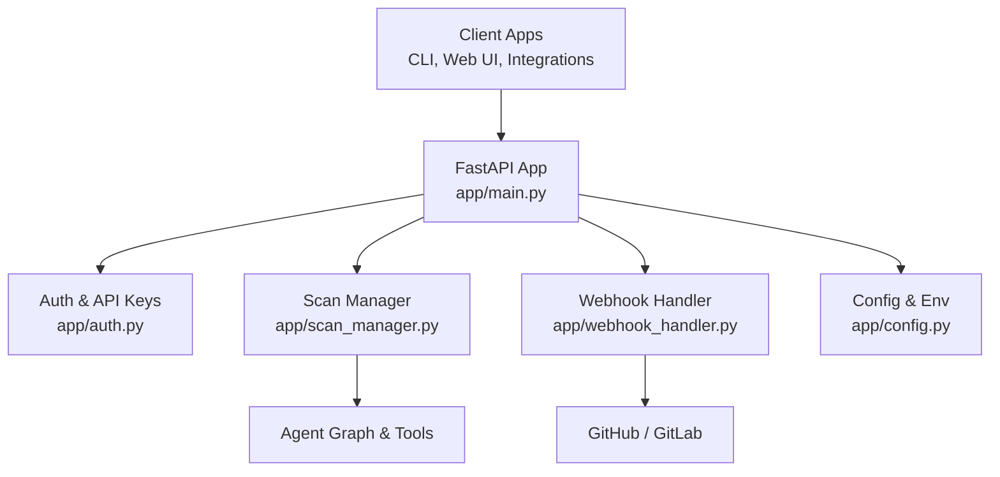
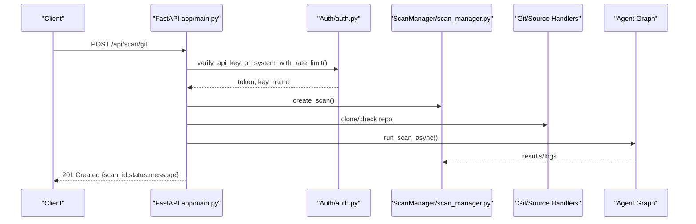
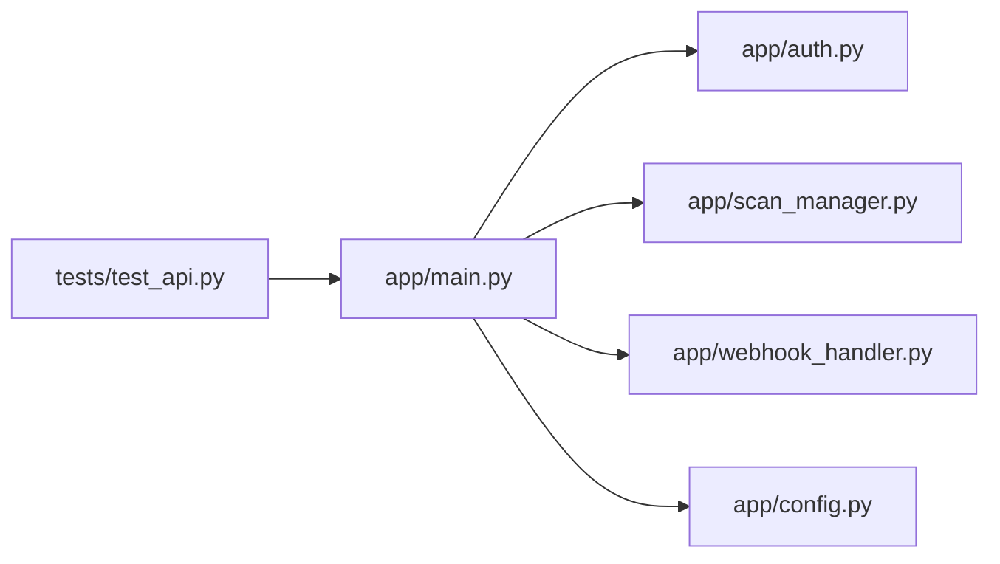

# Backend API Reference

<cite>
**Referenced Files in This Document**
- [app/main.py](file://app/main.py)
- [app/auth.py](file://app/auth.py)
- [app/webhook_handler.py](file://app/webhook_handler.py)
- [app/scan_manager.py](file://app/scan_manager.py)
- [app/config.py](file://app/config.py)
- [tests/test_api.py](file://tests/test_api.py)
- [README.md](file://README.md)
</cite>

## Table of Contents
1. [Introduction](#introduction)
2. [Project Structure](#project-structure)
3. [Core Components](#core-components)
4. [Architecture Overview](#architecture-overview)
5. [Detailed Component Analysis](#detailed-component-analysis)
6. [Dependency Analysis](#dependency-analysis)
7. [Performance Considerations](#performance-considerations)
8. [Troubleshooting Guide](#troubleshooting-guide)
9. [Conclusion](#conclusion)
10. [Appendices](#appendices)

## Introduction
This document provides a comprehensive API reference for AutoPoV’s REST endpoints. It covers:
- Authentication and rate limiting
- Scan initiation endpoints for Git repositories, ZIP uploads, and raw code paste
- Status polling and real-time streaming
- Administrative endpoints for cleanup and settings
- Webhook integration for GitHub and GitLab with HMAC signature verification
- API key management endpoints
- Practical examples, error codes, and performance guidance

## Project Structure
AutoPoV exposes a FastAPI application with a modular backend:
- Entry point and route definitions: [app/main.py](file://app/main.py)
- Authentication and API key management: [app/auth.py](file://app/auth.py)
- Webhook handlers for GitHub/GitLab: [app/webhook_handler.py](file://app/webhook_handler.py)
- Scan lifecycle and results: [app/scan_manager.py](file://app/scan_manager.py)
- Configuration and environment variables: [app/config.py](file://app/config.py)
- Tests validating endpoints: [tests/test_api.py](file://tests/test_api.py)
- High-level usage and examples: [README.md](file://README.md)

**Diagram sources**
- [app/main.py:166-174](file://app/main.py#L166-L174)
- [app/auth.py:275-353](file://app/auth.py#L275-L353)
- [app/scan_manager.py:58-86](file://app/scan_manager.py#L58-L86)
- [app/webhook_handler.py:15-24](file://app/webhook_handler.py#L15-L24)
- [app/config.py:14-342](file://app/config.py#L14-L342)

**Section sources**
- [app/main.py:166-174](file://app/main.py#L166-L174)
- [app/auth.py:275-353](file://app/auth.py#L275-L353)
- [app/scan_manager.py:58-86](file://app/scan_manager.py#L58-L86)
- [app/webhook_handler.py:15-24](file://app/webhook_handler.py#L15-L24)
- [app/config.py:14-342](file://app/config.py#L14-L342)

## Core Components
- Authentication and Bearer tokens:
  - API keys are SHA-256 hashed and validated via Bearer tokens.
  - Rate limiting applies to scan-triggering endpoints.
  - System key for internal web UI access with CSRF enforcement.
- Scan orchestration:
  - Creates scan records, runs asynchronously, persists results, and supports cancellation/stop/delete.
- Webhook integration:
  - GitHub: HMAC SHA-256 verification using a configurable secret.
  - GitLab: Shared secret token verification.
- Configuration:
  - Environment-driven settings including model modes, tool availability, and security-related toggles.

**Section sources**
- [app/auth.py:275-353](file://app/auth.py#L275-L353)
- [app/auth.py:402-419](file://app/auth.py#L402-L419)
- [app/scan_manager.py:88-132](file://app/scan_manager.py#L88-L132)
- [app/webhook_handler.py:25-73](file://app/webhook_handler.py#L25-L73)
- [app/config.py:14-342](file://app/config.py#L14-L342)

## Architecture Overview
The API follows a layered design:
- HTTP layer: FastAPI routes in [app/main.py](file://app/main.py)
- Auth layer: [app/auth.py](file://app/auth.py) handles Bearer tokens, rate limits, and CSRF for internal UI
- Domain layer: [app/scan_manager.py](file://app/scan_manager.py) manages scan lifecycle and results
- Integration layer: [app/webhook_handler.py](file://app/webhook_handler.py) validates and parses provider webhooks
- Configuration layer: [app/config.py](file://app/config.py) centralizes environment-driven settings

**Diagram sources**
- [app/main.py:289-371](file://app/main.py#L289-L371)
- [app/auth.py:304-319](file://app/auth.py#L304-L319)
- [app/scan_manager.py:88-132](file://app/scan_manager.py#L88-L132)

## Detailed Component Analysis

### Authentication and Rate Limiting
- Authentication methods:
  - Bearer token via Authorization header or query parameter for streaming.
  - Internal web UI access uses CSRF protection and system key.
- Rate limiting:
  - 10 scans per key per 60 seconds for external API keys.
  - Separate rate-limiting logic for system key used internally.
- API key management:
  - Generate, list, and revoke keys via dedicated endpoints.

Key behaviors:
- External clients must present a valid API key for scan-triggering endpoints.
- Streaming endpoints accept the key via query parameter.
- Internal web UI requests bypass API key requirement but require CSRF.

**Section sources**
- [app/auth.py:275-353](file://app/auth.py#L275-L353)
- [app/auth.py:402-419](file://app/auth.py#L402-L419)
- [app/main.py:769-809](file://app/main.py#L769-L809)
- [app/auth.py:59-62](file://app/auth.py#L59-L62)

### Scan Initiation Endpoints
- POST /api/scan/git
  - Body: url, token (optional), branch (optional), model (optional)
  - Response: scan_id, status, message
  - Behavior: validates model availability, clones repository, runs scan asynchronously
- POST /api/scan/zip
  - Body: multipart/form-data with file and optional model
  - Response: scan_id, status, message
  - Behavior: saves uploaded ZIP, extracts, runs scan asynchronously
- POST /api/scan/paste
  - Body: code, language (optional), filename (optional), model (optional)
  - Response: scan_id, status, message
  - Behavior: writes code to temporary file, runs scan asynchronously

Notes:
- All endpoints enforce model readiness and rate limits.
- Scans are persisted and can be polled or streamed.

**Section sources**
- [app/main.py:289-371](file://app/main.py#L289-L371)
- [app/main.py:373-431](file://app/main.py#L373-L431)
- [app/main.py:434-485](file://app/main.py#L434-L485)
- [app/auth.py:304-319](file://app/auth.py#L304-L319)

### Status Polling and Real-Time Streaming
- GET /api/scan/{scan_id}
  - Response: status, progress, logs, result (when complete), findings, error
  - Behavior: returns either active scan info or saved result
- GET /api/scan/{scan_id}/stream
  - Response: Server-Sent Events stream
  - Behavior: yields new logs until completion; then returns final result

Streaming details:
- Uses SSE with data frames.
- Accepts API key via query parameter for EventSource compatibility.

**Section sources**
- [app/main.py:709-766](file://app/main.py#L709-L766)
- [app/main.py:769-809](file://app/main.py#L769-L809)

### Administrative Functions
- POST /api/scan/{scan_id}/replay
  - Body: models (list), include_failed (boolean), max_findings (int)
  - Behavior: replays findings against specified models; returns replay_ids
- POST /api/scan/{scan_id}/cancel
  - Behavior: cancels a running scan
- POST /api/scan/{scan_id}/stop
  - Behavior: force-stops a running scan
- DELETE /api/scan/{scan_id}
  - Behavior: deletes scan and associated data
- GET /api/scans/active
  - Response: active scans and count
- POST /api/scans/cleanup
  - Behavior: cleans up stuck/interrupted scans
- GET /api/cache/stats
- POST /api/cache/clear
- POST /api/admin/cleanup
  - Body: max_age_days (int), max_results (int)
  - Behavior: removes old result files and frees space

**Section sources**
- [app/main.py:489-578](file://app/main.py#L489-L578)
- [app/main.py:580-613](file://app/main.py#L580-L613)
- [app/main.py:616-684](file://app/main.py#L616-L684)
- [app/main.py:687-705](file://app/main.py#L687-L705)
- [app/main.py:944-959](file://app/main.py#L944-L959)

### API Key Management Endpoints
- POST /api/keys/generate
  - Query: name (string)
  - Response: key, message
- GET /api/keys
  - Response: keys (list of key metadata)
- DELETE /api/keys/{key_id}
  - Behavior: revokes key

Security:
- Keys are SHA-256 hashed and stored securely.
- Never exposed again after generation.

**Section sources**
- [app/main.py:918-941](file://app/main.py#L918-L941)
- [app/auth.py:179-196](file://app/auth.py#L179-L196)

### Settings and Metrics
- GET /api/settings
  - Response: model_mode, selected_model, available models, routing_mode
- POST /api/settings
  - Body: model_mode or selected_model
  - Behavior: updates model configuration
- GET /api/metrics
  - Response: system metrics from scan manager
- GET /api/learning/summary
  - Response: learning store summary and model stats

**Section sources**
- [app/main.py:979-1032](file://app/main.py#L979-L1032)
- [app/main.py:963-969](file://app/main.py#L963-L969)
- [app/main.py:972-975](file://app/main.py#L972-L975)

### Reports
- GET /api/report/{scan_id}
  - Query: format (json or pdf)
  - Response: downloadable file

**Section sources**
- [app/main.py:825-869](file://app/main.py#L825-L869)

### Webhook Integration (GitHub/GitLab)
- POST /api/webhook/github
  - Headers: X-Hub-Signature-256, X-GitHub-Event
  - Verification: HMAC SHA-256 using GITHUB_WEBHOOK_SECRET
  - Response: status, message, optional scan_id
- POST /api/webhook/gitlab
  - Headers: X-Gitlab-Token, X-Gitlab-Event
  - Verification: shared token using GITLAB_WEBHOOK_SECRET
  - Response: status, message, optional scan_id

Supported events:
- GitHub: push, pull_request (opened/synchronize/reopened)
- GitLab: push, merge_request (open/update/reopen)

**Section sources**
- [app/main.py:873-914](file://app/main.py#L873-L914)
- [app/webhook_handler.py:25-73](file://app/webhook_handler.py#L25-L73)
- [app/webhook_handler.py:196-336](file://app/webhook_handler.py#L196-L336)

### Health and Configuration Discovery
- GET /api/health
  - Response: status, version, tool availability flags
- GET /api/config
  - Response: app_version, tool availability, routing_mode, model_mode, model_name, token tracking, discovery mode

**Section sources**
- [app/main.py:258-267](file://app/main.py#L258-L267)
- [app/main.py:270-285](file://app/main.py#L270-L285)

## Dependency Analysis
- Route dependencies:
  - [app/main.py](file://app/main.py) depends on [app/auth.py](file://app/auth.py) for authentication and rate limiting.
  - [app/main.py](file://app/main.py) depends on [app/scan_manager.py](file://app/scan_manager.py) for scan lifecycle.
  - [app/main.py](file://app/main.py) depends on [app/webhook_handler.py](file://app/webhook_handler.py) for webhook processing.
  - [app/main.py](file://app/main.py) depends on [app/config.py](file://app/config.py) for environment settings.
- Test coverage:
  - [tests/test_api.py](file://tests/test_api.py) validates health, auth-required endpoints, and webhook error handling.

**Diagram sources**
- [app/main.py:21-33](file://app/main.py#L21-L33)
- [tests/test_api.py:7](file://tests/test_api.py#L7)

**Section sources**
- [app/main.py:21-33](file://app/main.py#L21-L33)
- [tests/test_api.py:7](file://tests/test_api.py#L7)

## Performance Considerations
- Rate limiting:
  - External API keys are limited to 10 scans per minute. Plan batch jobs accordingly.
- Model runtime readiness:
  - Offline models require Ollama availability and model installation.
  - Online models require a configured OpenRouter API key.
- Concurrency:
  - Scans run asynchronously with thread pooling; avoid overwhelming the system with rapid bursts.
- Streaming:
  - SSE streams logs incrementally; close connections gracefully to free resources.
- Cleanup:
  - Use POST /api/admin/cleanup to manage storage growth.

[No sources needed since this section provides general guidance]

## Troubleshooting Guide
Common issues and resolutions:
- 401 Unauthorized:
  - Ensure Bearer token is provided and valid. For streaming, pass api_key via query parameter.
- 403 Forbidden:
  - Internal web UI requests require CSRF cookies and tokens. External requests must use API keys.
- 429 Too Many Requests:
  - Exceeded rate limit. Wait for the next window or reduce request frequency.
- 404 Not Found:
  - Scan not found; verify scan_id correctness.
- 400 Bad Request:
  - Invalid model configuration or unsupported model mode; check settings and environment variables.
- Webhook failures:
  - GitHub: verify X-Hub-Signature-256 and GITHUB_WEBHOOK_SECRET.
  - GitLab: verify X-Gitlab-Token and GITLAB_WEBHOOK_SECRET.

**Section sources**
- [app/auth.py:295-299](file://app/auth.py#L295-L299)
- [app/auth.py:314-317](file://app/auth.py#L314-L317)
- [app/webhook_handler.py:25-73](file://app/webhook_handler.py#L25-L73)
- [app/main.py:718-751](file://app/main.py#L718-L751)

## Conclusion
AutoPoV’s API provides a robust, authenticated interface for initiating scans, monitoring progress, managing keys, and integrating with CI/CD via webhooks. Adhering to rate limits, configuring models correctly, and using bearer tokens ensures reliable operation for automation and integration scenarios.

[No sources needed since this section summarizes without analyzing specific files]

## Appendices

### Endpoint Catalog and Examples

- Scan Initiation
  - POST /api/scan/git
    - Headers: Authorization: Bearer apov_...
    - Body: { url, token (optional), branch (optional), model (optional) }
    - Example: [README.md:250-254](file://README.md#L250-L254)
  - POST /api/scan/zip
    - Headers: Authorization: Bearer apov_..., Content-Type: multipart/form-data
    - Body: file (ZIP), model (optional)
    - Example: [README.md:250-254](file://README.md#L250-L254)
  - POST /api/scan/paste
    - Headers: Authorization: Bearer apov_..., Content-Type: application/json
    - Body: { code, language (optional), filename (optional), model (optional) }
    - Example: [README.md:250-254](file://README.md#L250-L254)

- Status and Logs
  - GET /api/scan/{scan_id}
    - Headers: Authorization: Bearer apov_...
    - Example: [README.md:256-258](file://README.md#L256-L258)
  - GET /api/scan/{scan_id}/stream
    - Query: api_key=apov_...
    - Example: [README.md:260-261](file://README.md#L260-L261)

- Administrative Operations
  - POST /api/scan/{scan_id}/replay
    - Headers: Authorization: Bearer apov_..., Content-Type: application/json
    - Body: { models, include_failed, max_findings }
    - Example: [README.md:267-271](file://README.md#L267-L271)
  - POST /api/scan/{scan_id}/cancel
    - Headers: Authorization: Bearer apov_...
    - Example: [README.md:263-265](file://README.md#L263-L265)
  - POST /api/scan/{scan_id}/stop
    - Headers: Authorization: Bearer apov_...
  - DELETE /api/scan/{scan_id}
    - Headers: Authorization: Bearer apov_...
  - POST /api/scans/cleanup
    - Headers: Authorization: Bearer apov_...

- API Key Management
  - POST /api/keys/generate?name=...
    - Headers: Authorization: Bearer ADMIN_API_KEY
    - Example: [README.md:187-190](file://README.md#L187-L190)
  - GET /api/keys
    - Headers: Authorization: Bearer ADMIN_API_KEY
  - DELETE /api/keys/{key_id}
    - Headers: Authorization: Bearer ADMIN_API_KEY

- Settings and Metrics
  - GET /api/settings
    - Headers: Authorization: Bearer apov_...
  - POST /api/settings
    - Headers: Authorization: Bearer apov_...
    - Body: { model_mode or selected_model }
  - GET /api/metrics
    - Headers: Authorization: Bearer apov_...
  - GET /api/learning/summary
    - Headers: Authorization: Bearer apov_...

- Reports
  - GET /api/report/{scan_id}?format=json|pdf
    - Headers: Authorization: Bearer apov_...

- Webhooks
  - POST /api/webhook/github
    - Headers: X-Hub-Signature-256, X-GitHub-Event
    - Body: JSON payload
    - Example: [README.md:388-395](file://README.md#L388-L395)
  - POST /api/webhook/gitlab
    - Headers: X-Gitlab-Token, X-Gitlab-Event
    - Body: JSON payload

- Health and Config
  - GET /api/health
  - GET /api/config

**Section sources**
- [README.md:245-284](file://README.md#L245-L284)
- [README.md:386-395](file://README.md#L386-L395)
- [README.md:179-193](file://README.md#L179-L193)

### Error Codes Reference
- 200 OK: Successful operation
- 201 Created: Scan initiated
- 400 Bad Request: Invalid input or model configuration
- 401 Unauthorized: Invalid/expired API key
- 403 Forbidden: CSRF or internal access violation
- 404 Not Found: Resource not found
- 409 Conflict: Operation conflict (e.g., scan already finalized)
- 429 Too Many Requests: Rate limit exceeded
- 500 Internal Server Error: Unexpected server error

**Section sources**
- [app/main.py:718-751](file://app/main.py#L718-L751)
- [app/auth.py:295-299](file://app/auth.py#L295-L299)
- [app/auth.py:314-317](file://app/auth.py#L314-L317)

### Security and Rate Limiting Details
- Authentication:
  - Bearer tokens for external clients; CSRF for internal web UI.
- Rate limiting:
  - 10 scans per minute per API key for external clients.
- Webhook verification:
  - GitHub: HMAC SHA-256 with GITHUB_WEBHOOK_SECRET.
  - GitLab: shared token with GITLAB_WEBHOOK_SECRET.

**Section sources**
- [app/auth.py:59-62](file://app/auth.py#L59-L62)
- [app/webhook_handler.py:25-73](file://app/webhook_handler.py#L25-L73)
- [README.md:377-382](file://README.md#L377-L382)