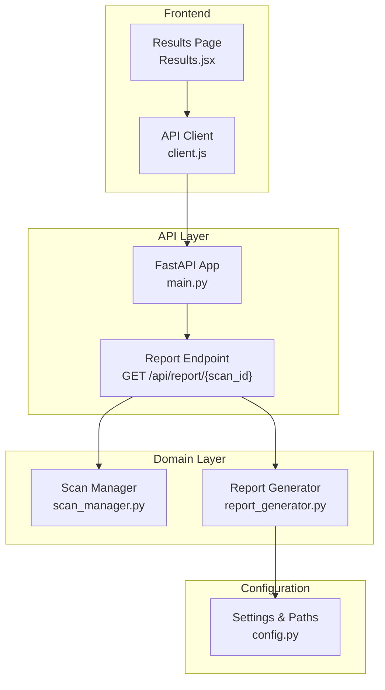
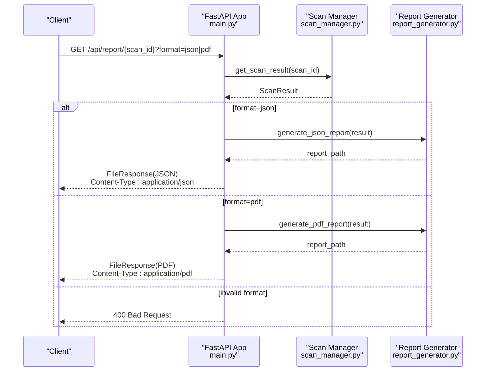
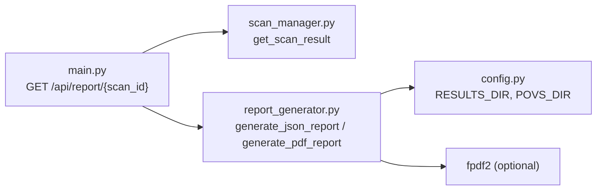

# Report and Export Endpoints

<cite>
**Referenced Files in This Document**
- [main.py](file://autopov/app/main.py)
- [report_generator.py](file://autopov/app/report_generator.py)
- [scan_manager.py](file://autopov/app/scan_manager.py)
- [config.py](file://autopov/app/config.py)
- [client.js](file://autopov/frontend/src/api/client.js)
- [Results.jsx](file://autopov/frontend/src/pages/Results.jsx)
- [README.md](file://autopov/README.md)
</cite>

## Table of Contents
1. [Introduction](#introduction)
2. [Project Structure](#project-structure)
3. [Core Components](#core-components)
4. [Architecture Overview](#architecture-overview)
5. [Detailed Component Analysis](#detailed-component-analysis)
6. [Dependency Analysis](#dependency-analysis)
7. [Performance Considerations](#performance-considerations)
8. [Troubleshooting Guide](#troubleshooting-guide)
9. [Conclusion](#conclusion)
10. [Appendices](#appendices)

## Introduction
This document provides API documentation for AutoPoV’s report generation and export endpoints, focusing on the GET /api/report/{scan_id} endpoint with format parameter support. It explains how JSON and PDF reports are generated from scan results, how responses are delivered as downloadable files, and how content-type headers are set for both formats. It also covers scan result aggregation, vulnerability severity categorization, and PoV script inclusion in reports. Integration patterns for automated reporting workflows, report metadata and timestamp formatting, result serialization patterns, caching behavior, file cleanup procedures, and storage location management are documented.

## Project Structure
The report and export functionality spans several modules:
- API endpoint definition and routing in the FastAPI application
- Report generation logic for JSON and PDF outputs
- Scan result data model and persistence
- Configuration of storage locations and environment settings
- Frontend integration for initiating downloads

**Diagram sources**
- [main.py](file://autopov/app/main.py#L400-L431)
- [report_generator.py](file://autopov/app/report_generator.py#L68-L359)
- [scan_manager.py](file://autopov/app/scan_manager.py#L21-L344)
- [config.py](file://autopov/app/config.py#L102-L108)
- [client.js](file://autopov/frontend/src/api/client.js#L50-L53)
- [Results.jsx](file://autopov/frontend/src/pages/Results.jsx#L30-L48)

**Section sources**
- [main.py](file://autopov/app/main.py#L400-L431)
- [report_generator.py](file://autopov/app/report_generator.py#L68-L359)
- [scan_manager.py](file://autopov/app/scan_manager.py#L21-L344)
- [config.py](file://autopov/app/config.py#L102-L108)
- [client.js](file://autopov/frontend/src/api/client.js#L50-L53)
- [Results.jsx](file://autopov/frontend/src/pages/Results.jsx#L30-L48)

## Core Components
- Report endpoint: GET /api/report/{scan_id}?format=json|pdf
- JSON report generation: generate_json_report method
- PDF report generation: generate_pdf_report method
- Scan result data model: ScanResult with aggregated metrics and findings
- Storage locations: results directory for reports and PoV scripts; runs directory for scan history
- Frontend integration: client-side download handling for both JSON and PDF

**Section sources**
- [main.py](file://autopov/app/main.py#L400-L431)
- [report_generator.py](file://autopov/app/report_generator.py#L76-L118)
- [report_generator.py](file://autopov/app/report_generator.py#L120-L270)
- [scan_manager.py](file://autopov/app/scan_manager.py#L21-L38)
- [config.py](file://autopov/app/config.py#L102-L108)
- [client.js](file://autopov/frontend/src/api/client.js#L50-L53)

## Architecture Overview
The report generation pipeline integrates the API layer, scan result persistence, and report generation logic. The endpoint retrieves a scan result, delegates to the report generator, and returns a file response with appropriate content-type headers.

**Diagram sources**
- [main.py](file://autopov/app/main.py#L400-L431)
- [report_generator.py](file://autopov/app/report_generator.py#L76-L118)
- [report_generator.py](file://autopov/app/report_generator.py#L120-L270)
- [scan_manager.py](file://autopov/app/scan_manager.py#L241-L250)

## Detailed Component Analysis

### Report Endpoint: GET /api/report/{scan_id}
- Purpose: Retrieve a scan report in JSON or PDF format.
- Path: /api/report/{scan_id}
- Query parameters:
  - format: "json" or "pdf" (default: "json")
- Authentication: Requires API key via bearer token.
- Response:
  - JSON: application/json with filename {scan_id}_report.json
  - PDF: application/pdf with filename {scan_id}_report.pdf
  - Error: 404 if scan result not found; 400 if format is invalid

Behavior highlights:
- Validates scan existence by loading the persisted result.
- Delegates to report generator based on format.
- Returns a FileResponse configured with the correct media type and filename.

**Section sources**
- [main.py](file://autopov/app/main.py#L400-L431)

### JSON Report Generation: generate_json_report
- Input: ScanResult
- Output: Path to generated JSON file
- Storage: Saved under results directory with filename {scan_id}_report.json
- Report structure:
  - report_metadata: tool name, version, and generated timestamp
  - scan_summary: scan_id, status, codebase path, model, CWEs checked, duration, total cost
  - metrics: total findings, confirmed vulnerabilities, false positives, failed analyses, detection rate, false positive rate, PoV success rate
  - findings: formatted list of findings with cwe_type, filepath, line_number, verdict, confidence, explanation, vulnerable_code, final_status, has_pov, pov_success, inference_time_s, cost_usd

Timestamp formatting:
- ISO 8601 UTC for report_metadata.generated_at

Serialization patterns:
- Uses JSON serialization with default=str for non-serializable types.

**Section sources**
- [report_generator.py](file://autopov/app/report_generator.py#L76-L118)
- [report_generator.py](file://autopov/app/report_generator.py#L88-L113)

### PDF Report Generation: generate_pdf_report
- Input: ScanResult
- Output: Path to generated PDF file
- Storage: Saved under results directory with filename {scan_id}_report.pdf
- PDF content:
  - Cover page with scan ID and UTC date/time
  - Executive summary with scan configuration and results overview
  - Metrics summary table
  - Confirmed vulnerabilities section with explanations and PoV scripts (truncated if too long)
  - Methodology section describing the scanning process and metric definitions
- Dependencies:
  - Requires fpdf2 library; raises an error if unavailable

PoV script inclusion:
- For each confirmed finding with a PoV script, the report includes the script content (truncated to approximately 2000 characters with a truncation indicator).

**Section sources**
- [report_generator.py](file://autopov/app/report_generator.py#L120-L270)
- [report_generator.py](file://autopov/app/report_generator.py#L220-L231)

### Scan Result Aggregation and Metrics
- Aggregation occurs when constructing ScanResult from the agent graph final state.
- Metrics computed:
  - Detection rate: (confirmed_vulns / total_findings) * 100
  - False positive rate: (false_positives / total_findings) * 100
  - PoV success rate: (count of confirmed findings with vulnerability_triggered) / confirmed_vulns * 100
- Vulnerability severity categorization:
  - Final status per finding determines whether it is considered confirmed, skipped, failed, or pov_generation_failed.
  - The report distinguishes confirmed vulnerabilities for inclusion in the PDF findings section and in metrics.

**Section sources**
- [scan_manager.py](file://autopov/app/scan_manager.py#L138-L175)
- [report_generator.py](file://autopov/app/report_generator.py#L302-L327)

### Report Metadata, Timestamp Formatting, and Result Serialization
- Report metadata includes tool name, version, and generated_at timestamp in ISO 8601 UTC.
- Scan timestamps (start_time, end_time) are stored in ISO 8601 UTC.
- Results serialization uses default=str to handle non-serializable types.

**Section sources**
- [report_generator.py](file://autopov/app/report_generator.py#L89-L93)
- [report_generator.py](file://autopov/app/report_generator.py#L145)
- [scan_manager.py](file://autopov/app/scan_manager.py#L144-L146)

### Content-Type Headers and File Download Mechanisms
- JSON response:
  - Content-Type: application/json
  - Filename: {scan_id}_report.json
- PDF response:
  - Content-Type: application/pdf
  - Filename: {scan_id}_report.pdf
- Frontend integration:
  - The frontend client sets responseType to "blob" for PDF and "json" for JSON.
  - Downloads are triggered by creating a Blob and invoking a temporary anchor element.

**Section sources**
- [main.py](file://autopov/app/main.py#L415-L427)
- [client.js](file://autopov/frontend/src/api/client.js#L50-L53)
- [Results.jsx](file://autopov/frontend/src/pages/Results.jsx#L30-L48)

### Storage Location Management
- Results directory: stores both JSON and PDF reports.
- PoVs directory: stores PoV scripts separately for confirmed vulnerabilities.
- Runs directory: persists scan results as JSON and maintains a CSV history log.
- Temporary directory: used for intermediate processing (e.g., ZIP uploads).

**Section sources**
- [config.py](file://autopov/app/config.py#L102-L108)
- [report_generator.py](file://autopov/app/report_generator.py#L272-L300)
- [scan_manager.py](file://autopov/app/scan_manager.py#L201-L235)

### Report Caching and Cleanup Procedures
- Reports are generated on-demand and returned as files; there is no explicit in-memory caching of report content.
- Cleanup procedures:
  - Vector store cleanup is performed after scan completion.
  - Temporary scan directories are cleaned up by the source handler.
  - No automatic deletion of previously generated reports is implemented.

**Section sources**
- [scan_manager.py](file://autopov/app/scan_manager.py#L172-L173)
- [scan_manager.py](file://autopov/app/scan_manager.py#L296-L302)
- [source_handler.py](file://autopov/app/source_handler.py#L267-L271)

### Integration Patterns for Automated Reporting Workflows
- CLI usage examples demonstrate how to generate reports programmatically.
- Web UI integration allows users to download reports directly from the results page.
- API clients can programmatically request reports and handle responses based on format.

**Section sources**
- [README.md](file://autopov/README.md#L124-L126)
- [Results.jsx](file://autopov/frontend/src/pages/Results.jsx#L98-L112)
- [client.js](file://autopov/frontend/src/api/client.js#L50-L53)

## Dependency Analysis
The report endpoint depends on the scan manager for retrieving results and the report generator for producing outputs. The report generator depends on configuration for storage paths and on the fpdf2 library for PDF generation.

**Diagram sources**
- [main.py](file://autopov/app/main.py#L400-L431)
- [report_generator.py](file://autopov/app/report_generator.py#L68-L75)
- [config.py](file://autopov/app/config.py#L102-L108)

**Section sources**
- [main.py](file://autopov/app/main.py#L400-L431)
- [report_generator.py](file://autopov/app/report_generator.py#L68-L75)
- [config.py](file://autopov/app/config.py#L102-L108)

## Performance Considerations
- Report generation is synchronous and writes files to disk; consider the cost of disk I/O and PDF rendering for large scans.
- PDF generation requires fpdf2; ensure it is installed to avoid runtime errors.
- For high-throughput scenarios, consider asynchronous report generation and caching strategies.

[No sources needed since this section provides general guidance]

## Troubleshooting Guide
Common issues and resolutions:
- Invalid format parameter:
  - Symptom: 400 Bad Request
  - Cause: format not "json" or "pdf"
  - Resolution: Use "json" or "pdf"
- Scan result not found:
  - Symptom: 404 Not Found
  - Cause: scan_id does not correspond to a persisted result
  - Resolution: Verify scan_id and ensure the scan completed successfully
- fpdf2 missing for PDF:
  - Symptom: Error indicating fpdf2 not available
  - Cause: fpdf2 not installed
  - Resolution: Install fpdf2 or request JSON format
- Download failures in frontend:
  - Symptom: Download does not start
  - Cause: Incorrect responseType or unsupported browser features
  - Resolution: Ensure responseType is set appropriately ("blob" for PDF, "json" for JSON) and use modern browsers

**Section sources**
- [main.py](file://autopov/app/main.py#L429-L430)
- [main.py](file://autopov/app/main.py#L410-L411)
- [report_generator.py](file://autopov/app/report_generator.py#L130-L131)
- [client.js](file://autopov/frontend/src/api/client.js#L50-L53)

## Conclusion
The GET /api/report/{scan_id} endpoint provides a straightforward mechanism to export AutoPoV scan results as either JSON or PDF. JSON reports offer structured, machine-readable output suitable for integration, while PDF reports deliver a comprehensive human-readable document with metrics and PoV scripts. Proper configuration of storage paths, awareness of dependencies like fpdf2, and correct handling of content-type headers ensure reliable operation across automated workflows and manual usage.

[No sources needed since this section summarizes without analyzing specific files]

## Appendices

### API Definition Summary
- Endpoint: GET /api/report/{scan_id}
- Query parameters:
  - format: "json" | "pdf" (default: "json")
- Authentication: Bearer token via Authorization header
- Responses:
  - 200 OK with FileResponse for JSON or PDF
  - 400 Bad Request for invalid format
  - 404 Not Found if scan result not found

**Section sources**
- [main.py](file://autopov/app/main.py#L400-L431)

### Example Requests and Responses
- JSON request:
  - curl -H "Authorization: Bearer YOUR_API_KEY" "http://localhost:8000/api/report/{scan_id}?format=json"
  - Response: application/json with filename {scan_id}_report.json
- PDF request:
  - curl -H "Authorization: Bearer YOUR_API_KEY" "http://localhost:8000/api/report/{scan_id}?format=pdf"
  - Response: application/pdf with filename {scan_id}_report.pdf

**Section sources**
- [main.py](file://autopov/app/main.py#L415-L427)

### Frontend Integration Notes
- The frontend client sets responseType based on format and triggers a browser download.
- The results page provides buttons to download JSON and PDF reports.

**Section sources**
- [client.js](file://autopov/frontend/src/api/client.js#L50-L53)
- [Results.jsx](file://autopov/frontend/src/pages/Results.jsx#L98-L112)