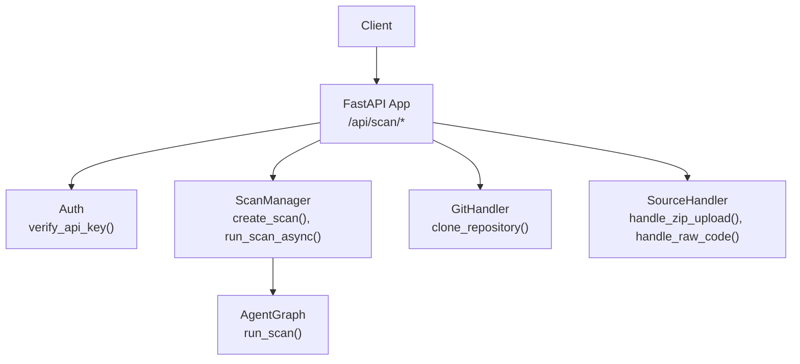
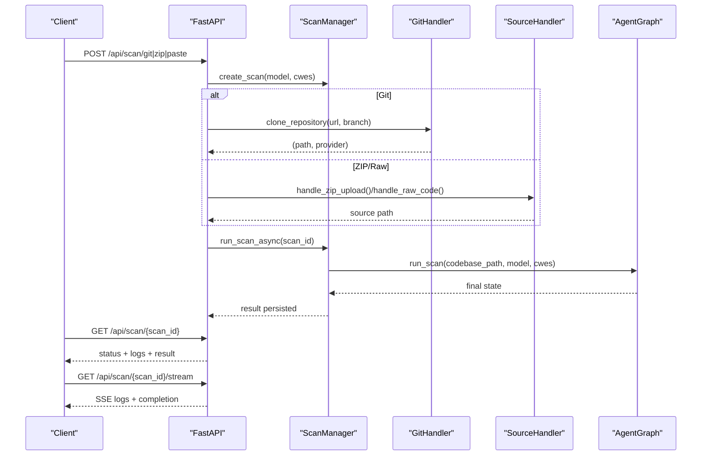
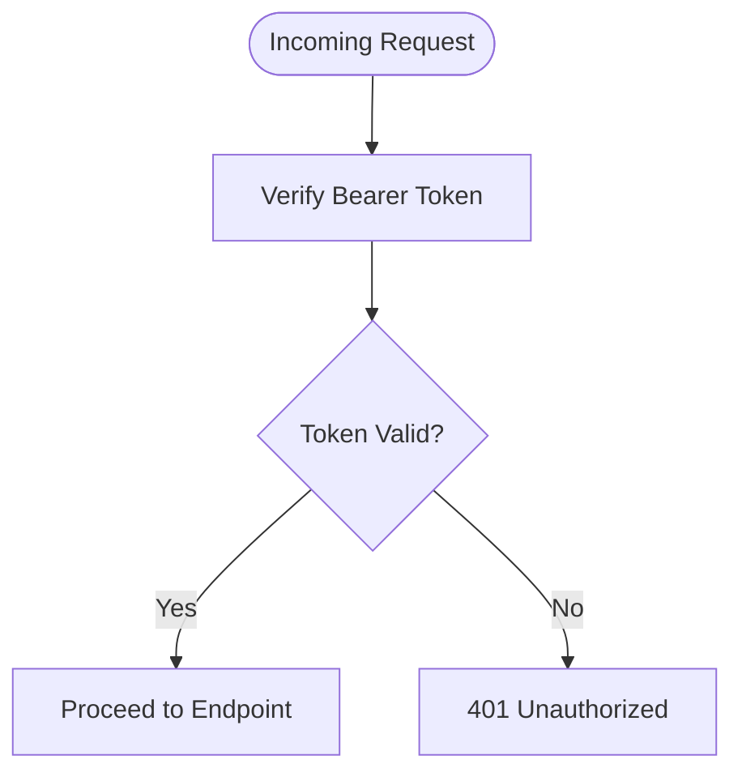
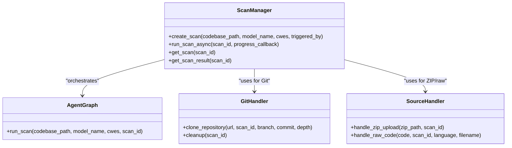
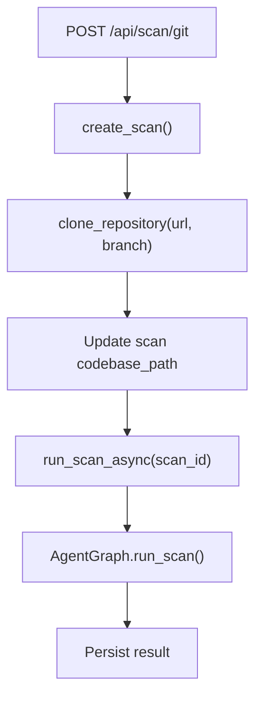
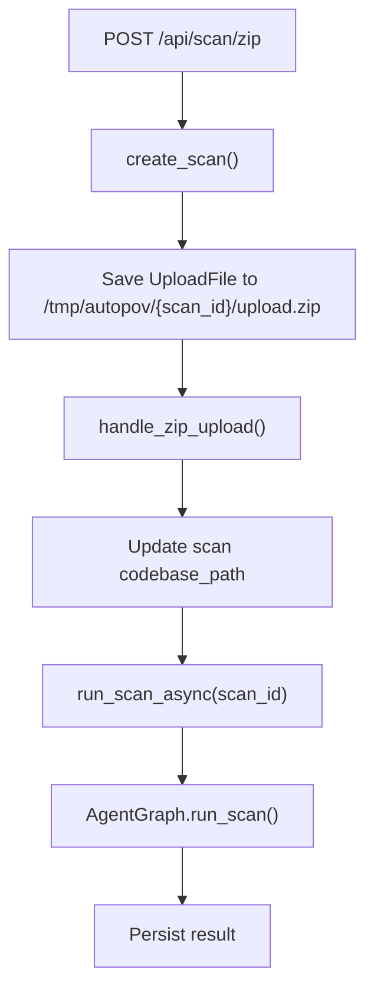
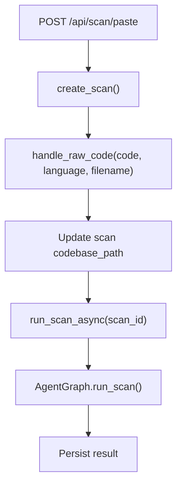
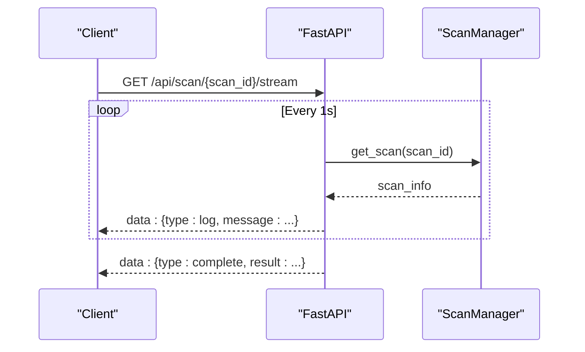
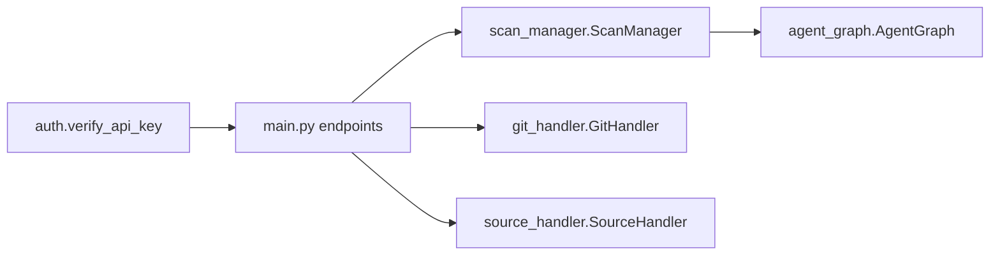

# Scan Endpoints

<cite>
**Referenced Files in This Document**
- [main.py](file://autopov/app/main.py)
- [scan_manager.py](file://autopov/app/scan_manager.py)
- [source_handler.py](file://autopov/app/source_handler.py)
- [git_handler.py](file://autopov/app/git_handler.py)
- [auth.py](file://autopov/app/auth.py)
- [config.py](file://autopov/app/config.py)
- [agent_graph.py](file://autopov/app/agent_graph.py)
- [report_generator.py](file://autopov/app/report_generator.py)
- [README.md](file://autopov/README.md)
</cite>

## Table of Contents
1. [Introduction](#introduction)
2. [Project Structure](#project-structure)
3. [Core Components](#core-components)
4. [Architecture Overview](#architecture-overview)
5. [Detailed Component Analysis](#detailed-component-analysis)
6. [Dependency Analysis](#dependency-analysis)
7. [Performance Considerations](#performance-considerations)
8. [Troubleshooting Guide](#troubleshooting-guide)
9. [Conclusion](#conclusion)

## Introduction
This document describes AutoPoV’s scan endpoints for initiating vulnerability scans via three primary methods:
- Git repository scanning
- ZIP file upload scanning
- Direct code paste scanning

It covers request/response schemas, authentication requirements, background task processing, and real-time progress monitoring via server-sent events. Practical curl examples and code snippet paths are included to guide API usage.

## Project Structure
The scan endpoints are implemented in the FastAPI application module and orchestrated by the scan manager. Supporting handlers manage source ingestion (ZIP, raw code) and Git repository cloning. Authentication is enforced via Bearer tokens validated against stored API keys.

**Diagram sources**
- [main.py](file://autopov/app/main.py#L175-L313)
- [auth.py](file://autopov/app/auth.py#L137-L148)
- [scan_manager.py](file://autopov/app/scan_manager.py#L50-L116)
- [git_handler.py](file://autopov/app/git_handler.py#L60-L124)
- [source_handler.py](file://autopov/app/source_handler.py#L31-L230)
- [agent_graph.py](file://autopov/app/agent_graph.py#L532-L572)

**Section sources**
- [main.py](file://autopov/app/main.py#L1-L525)
- [README.md](file://autopov/README.md#L1-L242)

## Core Components
- FastAPI endpoints for Git, ZIP, and paste scans
- Pydantic request/response models
- Background task orchestration
- Real-time progress via server-sent events
- Status polling endpoint

Key endpoint definitions and models:
- POST /api/scan/git
- POST /api/scan/zip
- POST /api/scan/paste
- GET /api/scan/{scan_id}
- GET /api/scan/{scan_id}/stream

Authentication:
- All scan endpoints require a Bearer token API key verified by the verify_api_key dependency.

**Section sources**
- [main.py](file://autopov/app/main.py#L29-L80)
- [main.py](file://autopov/app/main.py#L175-L382)
- [auth.py](file://autopov/app/auth.py#L137-L148)

## Architecture Overview
The scan workflow is asynchronous. Upon receiving a scan request, the API creates a scan record and schedules background processing. The scan manager coordinates the agent graph pipeline, which performs code ingestion, static analysis, LLM investigation, PoV generation, and optional Docker execution. Progress and logs are streamed via SSE until completion.

**Diagram sources**
- [main.py](file://autopov/app/main.py#L175-L313)
- [scan_manager.py](file://autopov/app/scan_manager.py#L86-L116)
- [git_handler.py](file://autopov/app/git_handler.py#L60-L124)
- [source_handler.py](file://autopov/app/source_handler.py#L31-L230)
- [agent_graph.py](file://autopov/app/agent_graph.py#L532-L572)

## Detailed Component Analysis

### Authentication and Authorization
- All protected endpoints depend on verify_api_key, which validates the Bearer token against stored keys.
- Admin-only endpoints (API key management) depend on verify_admin_key.

**Diagram sources**
- [auth.py](file://autopov/app/auth.py#L137-L148)

**Section sources**
- [auth.py](file://autopov/app/auth.py#L137-L167)
- [config.py](file://autopov/app/config.py#L26-L28)

### POST /api/scan/git
Purpose: Initiate a scan of a Git repository.

Parameters (JSON):
- url: string (required)
- token: string (optional; injected into URL for providers)
- branch: string (optional)
- model: string (default: openai/gpt-4o)
- cwes: array of strings (default: ["CWE-89","CWE-119","CWE-190","CWE-416"])

Behavior:
- Creates a scan record via ScanManager.create_scan
- Clones the repository using GitHandler.clone_repository
- Updates scan record with codebase path
- Runs scan asynchronously via ScanManager.run_scan_async
- Returns ScanResponse with scan_id and status

Background processing:
- Exceptions are captured and stored in scan info as “failed” with error details.

Real-time monitoring:
- Use GET /api/scan/{scan_id} for status and logs
- Use GET /api/scan/{scan_id}/stream for SSE logs and completion

Example curl:
- See [README.md](file://autopov/README.md#L130-L144)

**Section sources**
- [main.py](file://autopov/app/main.py#L29-L34)
- [main.py](file://autopov/app/main.py#L175-L216)
- [git_handler.py](file://autopov/app/git_handler.py#L60-L124)
- [scan_manager.py](file://autopov/app/scan_manager.py#L50-L84)

### POST /api/scan/zip
Purpose: Initiate a scan from an uploaded ZIP archive.

Parameters (multipart/form-data):
- file: UploadFile (required)
- model: string (form field, default: openai/gpt-4o)
- cwes: string (form field, comma-separated, default: "CWE-89,CWE-119,CWE-190,CWE-416")

Behavior:
- Parses cwes string into a list
- Creates a scan record
- Saves uploaded file to temporary path and extracts via SourceHandler.handle_zip_upload
- Updates scan record with extracted source path
- Runs scan asynchronously
- Returns ScanResponse

Security:
- ZIP extraction includes path traversal checks.

Example curl:
- Use multipart/form-data with Content-Type multipart/form-data and fields file, model, cwes.

**Section sources**
- [main.py](file://autopov/app/main.py#L37-L42)
- [main.py](file://autopov/app/main.py#L219-L268)
- [source_handler.py](file://autopov/app/source_handler.py#L31-L78)
- [scan_manager.py](file://autopov/app/scan_manager.py#L50-L84)

### POST /api/scan/paste
Purpose: Initiate a scan from raw code content.

Parameters (JSON):
- code: string (required)
- language: string (optional; determines file extension)
- filename: string (optional; overrides default)
- model: string (default: openai/gpt-4o)
- cwes: array of strings (default: ["CWE-89","CWE-119","CWE-190","CWE-416"])

Behavior:
- Creates a scan record
- Writes code to a file via SourceHandler.handle_raw_code
- Updates scan record with source path
- Runs scan asynchronously
- Returns ScanResponse

Supported languages (selected by language name) include Python, JavaScript, TypeScript, Java, C, C++, Go, Rust, Ruby, PHP, C#, Swift, Kotlin, Scala, R, Perl, Shell, SQL, HTML, CSS, XML, JSON, YAML.

Example curl:
- POST with Content-Type application/json and a JSON body containing code, optional language/filename, model, and cwes.

**Section sources**
- [main.py](file://autopov/app/main.py#L37-L42)
- [main.py](file://autopov/app/main.py#L271-L313)
- [source_handler.py](file://autopov/app/source_handler.py#L191-L230)
- [scan_manager.py](file://autopov/app/scan_manager.py#L50-L84)

### GET /api/scan/{scan_id}
Purpose: Poll for scan status and results.

Response fields:
- scan_id: string
- status: string
- progress: integer
- logs: array of strings
- result: object (optional) containing scan metrics and findings

Behavior:
- Returns active scan info if present
- If not found, attempts to load persisted result
- On missing scan and result, returns 404

**Section sources**
- [main.py](file://autopov/app/main.py#L317-L344)
- [scan_manager.py](file://autopov/app/scan_manager.py#L237-L250)

### GET /api/scan/{scan_id}/stream
Purpose: Stream real-time logs and completion status via Server-Sent Events.

Behavior:
- Continuously yields new log entries as they appear
- Terminates when scan reaches completed, failed, or cancelled
- Sends a final event with result data when finished

**Section sources**
- [main.py](file://autopov/app/main.py#L347-L382)

### Request/Response Schemas

- ScanGitRequest
  - url: string
  - token: string (optional)
  - branch: string (optional)
  - model: string (default: openai/gpt-4o)
  - cwes: array of strings (default: ["CWE-89","CWE-119","CWE-190","CWE-416"])

- ScanPasteRequest
  - code: string
  - language: string (optional)
  - filename: string (optional)
  - model: string (default: openai/gpt-4o)
  - cwes: array of strings (default: ["CWE-89","CWE-119","CWE-190","CWE-416"])

- ScanResponse
  - scan_id: string
  - status: string
  - message: string

- ScanStatusResponse
  - scan_id: string
  - status: string
  - progress: integer
  - logs: array of strings
  - result: object (optional)

**Section sources**
- [main.py](file://autopov/app/main.py#L29-L80)

## Architecture Overview

**Diagram sources**
- [scan_manager.py](file://autopov/app/scan_manager.py#L40-L344)
- [git_handler.py](file://autopov/app/git_handler.py#L18-L222)
- [source_handler.py](file://autopov/app/source_handler.py#L18-L380)
- [agent_graph.py](file://autopov/app/agent_graph.py#L78-L582)

## Detailed Component Analysis

### Git Repository Scanning Flow

**Diagram sources**
- [main.py](file://autopov/app/main.py#L175-L216)
- [git_handler.py](file://autopov/app/git_handler.py#L60-L124)
- [agent_graph.py](file://autopov/app/agent_graph.py#L532-L572)

**Section sources**
- [main.py](file://autopov/app/main.py#L175-L216)
- [git_handler.py](file://autopov/app/git_handler.py#L60-L124)

### ZIP Upload Scanning Flow

**Diagram sources**
- [main.py](file://autopov/app/main.py#L219-L268)
- [source_handler.py](file://autopov/app/source_handler.py#L31-L78)
- [agent_graph.py](file://autopov/app/agent_graph.py#L532-L572)

**Section sources**
- [main.py](file://autopov/app/main.py#L219-L268)
- [source_handler.py](file://autopov/app/source_handler.py#L31-L78)

### Raw Code Paste Scanning Flow

**Diagram sources**
- [main.py](file://autopov/app/main.py#L271-L313)
- [source_handler.py](file://autopov/app/source_handler.py#L191-L230)
- [agent_graph.py](file://autopov/app/agent_graph.py#L532-L572)

**Section sources**
- [main.py](file://autopov/app/main.py#L271-L313)
- [source_handler.py](file://autopov/app/source_handler.py#L191-L230)

### Real-Time Monitoring via SSE

**Diagram sources**
- [main.py](file://autopov/app/main.py#L347-L382)
- [scan_manager.py](file://autopov/app/scan_manager.py#L237-L239)

**Section sources**
- [main.py](file://autopov/app/main.py#L347-L382)

## Dependency Analysis
- Endpoints depend on verify_api_key for authentication.
- ScanManager coordinates scan lifecycle and integrates with AgentGraph.
- GitHandler and SourceHandler encapsulate repository and file ingestion logic.
- AgentGraph orchestrates the multi-stage vulnerability detection pipeline.

**Diagram sources**
- [auth.py](file://autopov/app/auth.py#L137-L148)
- [main.py](file://autopov/app/main.py#L175-L313)
- [scan_manager.py](file://autopov/app/scan_manager.py#L40-L116)
- [git_handler.py](file://autopov/app/git_handler.py#L18-L124)
- [source_handler.py](file://autopov/app/source_handler.py#L18-L230)
- [agent_graph.py](file://autopov/app/agent_graph.py#L78-L134)

**Section sources**
- [auth.py](file://autopov/app/auth.py#L137-L148)
- [main.py](file://autopov/app/main.py#L175-L313)
- [scan_manager.py](file://autopov/app/scan_manager.py#L40-L116)

## Performance Considerations
- Background execution: Scans run asynchronously to prevent blocking the API.
- Thread pool executor: ScanManager uses a thread pool for CPU-bound tasks.
- Resource cleanup: Vector store and temporary directories are cleaned up after scans.
- SSE polling interval: Logs are streamed every 1 second; adjust client-side polling if needed.
- Cost control: Configuration includes MAX_COST_USD and cost tracking toggles.

[No sources needed since this section provides general guidance]

## Troubleshooting Guide
Common issues and resolutions:
- 401 Unauthorized: Ensure Authorization header includes a valid Bearer token.
- 403 Forbidden: Verify the API key is active and not revoked.
- 404 Not Found: Scan ID invalid or result not yet persisted; poll status endpoint.
- Git clone failures: Check repository URL, branch, and provider tokens.
- ZIP extraction errors: Ensure ZIP is not corrupted and does not contain path traversal attempts.
- Missing CodeQL: If unavailable, the system falls back to LLM-only analysis.

**Section sources**
- [auth.py](file://autopov/app/auth.py#L141-L146)
- [main.py](file://autopov/app/main.py#L317-L344)
- [git_handler.py](file://autopov/app/git_handler.py#L119-L123)
- [source_handler.py](file://autopov/app/source_handler.py#L56-L63)

## Conclusion
AutoPoV’s scan endpoints provide a flexible, secure, and scalable way to analyze codebases from Git repositories, ZIP archives, or raw code. With robust authentication, asynchronous processing, and real-time progress streaming, the API supports both interactive and automated workflows. Use the provided curl examples and endpoint schemas to integrate scanning into your CI/CD or security tooling.